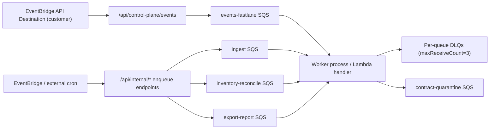

# Complete Feature Inventory

> Historical note (2026-03-15): Public SaaS-managed PR-bundle plan/apply is archived. Customer-run PR bundles remain supported; the inventory below reflects the February 2026 snapshot, not the current product direction.

## 1. Executive Summary

PRODUCT CAPABILITY OVERVIEW
AWS Security Autopilot gives tenant admins a workflow to connect AWS accounts, ingest security findings, prioritize remediation actions, create exceptions, run direct fixes or PR-bundle remediations, and generate evidence/baseline exports from a single SaaS interface.

Technically, the platform runs a React/Next.js frontend over a FastAPI control plane with PostgreSQL state, SQS-driven workers, and AWS role-assumption integrations (STS + customer ReadRole/WriteRole) to ingest, reconcile, remediate, and export security/compliance artifacts across tenant-scoped data boundaries.

FEATURE COUNT SUMMARY
| Category | Total features | Complete | Partial | Stub | Missing | Broken |
|---------|---------------|---------|---------|------|---------|--------|
| Frontend | 92 | 80 | 2 | 2 | 8 | 0 |
| Backend API | 115 | 114 | 1 | 0 | 0 | 0 |
| Background Jobs | 18 | 17 | 1 | 0 | 0 | 0 |
| AWS Integrations | 52 | 51 | 1 | 0 | 0 | 0 |
| Infrastructure | 24 | 18 | 5 | 0 | 1 | 0 |
| TOTAL | 301 | 280 | 10 | 2 | 9 | 0 |

TOP 10 GA BLOCKERS
- FE-007 — Forgot-password request API is missing, which blocks user account recovery and increases account lockout risk at GA.
- FE-010 — Reset-password completion API is missing, which blocks end-to-end credential recovery for existing users.
- FE-073 — Settings password-management APIs are missing, which blocks in-app password rotation and weakens baseline account security operations.
- FE-048 — Manual-workflow evidence APIs are missing, which blocks required evidence capture for exception-only/manual remediation paths.
- FE-062 — Audit-log API is missing, which blocks admin audit-event retrieval needed for operator trust and compliance workflows.
- INF-012 — WAF deployment is parameter-dependent and not automatically enforced, which leaves edge protection inconsistent across deployments.
- INF-003 — DR controls are split from base runtime deployment, which blocks a single reproducible production rollout profile with backup guarantees.
- INF-006 — CI gates exist but in-repo automatic CD is missing, which blocks standardized release execution and rollback confidence for GA operations.
- INF-018 — Readiness metrics exist but dashboarding/extended coverage is manual, which blocks reliable scale operations and proactive incident response at GA.
- PERF-001 — `feat-task9-performance-characteristics.md` is missing, which blocks source-backed performance sign-off for GA capacity/readiness claims.

## 2. User-Facing Frontend Features

### Source: feat-task1-surface-map.md (Frontend Surface Map)
SECTION 1 — FRONTEND SURFACE MAP

| Route | Page File Path | Primary purpose in one sentence |
|-------|---------------|--------------------------------|
| `/` | `frontend/src/app/page.tsx` | Root entrypoint that routes users to onboarding, findings, or login based on auth/onboarding state. |
| `/accept-invite` | `frontend/src/app/accept-invite/page.tsx` | Accepts an invitation token and completes invited-user account activation. |
| `/accounts` | `frontend/src/app/accounts/page.tsx` | Manages connected AWS accounts, role status, and ingestion/reconciliation actions. |
| `/actions` | `frontend/src/app/actions/page.tsx` | Legacy actions route that currently redirects users to `/findings`. |
| `/actions/[id]` | `frontend/src/app/actions/[id]/page.tsx` | Legacy action-detail route that currently redirects users to `/findings`. |
| `/actions/group` | `frontend/src/app/actions/group/page.tsx` | Shows grouped actions for batch review and grouped remediation/PR-bundle execution. |
| `/admin/control-plane` | `frontend/src/app/admin/control-plane/page.tsx` | SaaS-admin operations page for global control-plane health, lag, and queue/event status. |
| `/admin/control-plane/[tenantId]` | `frontend/src/app/admin/control-plane/[tenantId]/page.tsx` | Tenant-level control-plane drill-down for shadow/authoritative status and event diagnostics. |
| `/admin/tenants` | `frontend/src/app/admin/tenants/page.tsx` | SaaS-admin tenant list/search page for selecting a tenant to inspect or support. |
| `/admin/tenants/[tenantId]` | `frontend/src/app/admin/tenants/[tenantId]/page.tsx` | SaaS-admin tenant detail workspace with tabs for overview, users, accounts, findings, actions, runs, exports, notes, and files. |
| `/audit-log` | `frontend/src/app/audit-log/page.tsx` | Displays tenant audit events and filtering around security operations changes. |
| `/baseline-report` | `frontend/src/app/baseline-report/page.tsx` | Requests, monitors, and views 48-hour baseline report outputs and recommendations. |
| `/exceptions` | `frontend/src/app/exceptions/page.tsx` | Lists and manages remediation exceptions including expiry and approval status. |
| `/exports` | `frontend/src/app/exports/page.tsx` | Creates and tracks evidence/compliance exports and related report requests. |
| `/findings` | `frontend/src/app/findings/page.tsx` | Primary findings workbench with filters, source controls, refresh, and action orchestration entrypoints. |
| `/findings/[id]` | `frontend/src/app/findings/[id]/page.tsx` | Displays full details for a single finding and related metadata. |
| `/landing` | `frontend/src/app/landing/page.tsx` | Public marketing page describing product value, flow, trust model, and conversion CTAs. |
| `/login` | `frontend/src/app/login/page.tsx` | Auth login page for existing users. |
| `/onboarding` | `frontend/src/app/onboarding/page.tsx` | Guided onboarding wizard for role setup, account validation, and first ingestion checks. |
| `/pr-bundles` | `frontend/src/app/pr-bundles/page.tsx` | Shows PR bundle run history and links to create a new bundle. |
| `/pr-bundles/create` | `frontend/src/app/pr-bundles/create/page.tsx` | Builder page for selecting actions/accounts/filters before generating a PR bundle. |
| `/pr-bundles/create/summary` | `frontend/src/app/pr-bundles/create/summary/page.tsx` | Final review page summarizing selected actions and executing grouped PR-bundle runs. |
| `/remediation-runs/[id]` | `frontend/src/app/remediation-runs/[id]/page.tsx` | Run detail page for remediation execution status, logs, and artifacts. |
| `/reset-password` | `frontend/src/app/reset-password/page.tsx` | Completes password reset for users with reset tokens. |
| `/session-expired` | `frontend/src/app/session-expired/page.tsx` | Session timeout page that prompts secure re-authentication. |
| `/settings` | `frontend/src/app/settings/page.tsx` | Tenant settings hub for notifications, Slack, team/org controls, and control mappings. |
| `/signup` | `frontend/src/app/signup/page.tsx` | User registration page for creating a new tenant account. |
| `/support-files` | `frontend/src/app/support-files/page.tsx` | Tenant support file listing page for shared file retrieval and status visibility. |
| `/top-risks` | `frontend/src/app/top-risks/page.tsx` | Risk summary dashboard highlighting highest-priority exposure metrics and trends. |

### Source: feat-task2-frontend-features.md (Full)
USER-FACING FEATURE INVENTORY
| Feature ID | Feature Name | Page/Route | Component File | Description | User action that triggers it | What the user sees on success | What the user sees on failure | Backend endpoint(s) called | Data displayed to user | Access level required (any user / admin only) | Implementation status (fully implemented / partial / stub / unknown) |
|---|---|---|---|---|---|---|---|---|---|---|---|
| FE-001 | Root auth router | `/` | `frontend/src/app/page.tsx` | Routes authenticated users to onboarding/findings and unauthenticated users to login. | Open root route. | Redirects to `/onboarding`, `/findings`, or `/login`. | N/A (client-side routing only). | None (AuthContext session state already loaded). | Loading screen while auth state resolves. | any user | fully implemented |
| FE-002 | Marketing site nav + hero CTAs | `/landing` | `frontend/src/app/landing/page.tsx`, `frontend/src/components/site-nav.tsx` | Public landing page with section links and booking CTAs. | Open landing and click nav/CTA links. | Scroll/navigation to sections and external booking links open. | Unknown (external destination failures depend on browser/network). | None (static content). | Product value props, proof sections, CTA links. | any user | partial (contains TODO placeholders for some marketing assets/links) |
| FE-003 | FAQ accordion | `/landing` | `frontend/src/app/landing/page.tsx` | Expand/collapse FAQ answers. | Click FAQ question. | Answer panel expands/collapses with animation. | N/A (client-only). | None | FAQ questions and answers. | any user | fully implemented |
| FE-004 | Contact popover panel | `/landing` | `frontend/src/components/landing/ContactPopoverForm.tsx`, `frontend/src/components/ui/floating-panel.tsx` | Opens a floating contact form panel. | Click `Direct Email`, fill fields, submit. | Panel opens and can be closed; mailto fallback link exists. | Submitted data is not persisted/sent to backend. | None | Contact fields (`message`, `name`, `email`, `company`, `phone`). | any user | stub |
| FE-005 | Locale dropdown | `/landing` | `frontend/src/components/site-nav.tsx` | Locale selector UI in site nav. | Open locale dropdown and pick locale. | Dropdown item highlights/selects in UI. | No locale change is applied (handler is no-op). | None | Locale labels (`English`, `العربية`). | any user | stub |
| FE-006 | Login | `/login` | `frontend/src/app/login/page.tsx`, `frontend/src/contexts/AuthContext.tsx` | Email/password sign-in with cookie session. | Submit login form. | Redirects to `/` with authenticated session. | Inline error card with API message. | `POST /api/auth/login` | Email/password form; auth error messages. | any user | fully implemented |
| FE-007 | Forgot password request | `/login` | `frontend/src/app/login/page.tsx` | Password reset request from modal. | Open `Forgot password?`, submit email. | Success notice: reset link sent (if account exists). | Inline error in modal. | `POST /api/auth/forgot-password` | Forgot-password email input and status message. | any user | fully implemented |
| FE-008 | Signup | `/signup` | `frontend/src/app/signup/page.tsx`, `frontend/src/contexts/AuthContext.tsx` | Registers new tenant/user account. | Submit signup form. | Redirects to `/onboarding` on success. | Validation errors (`password mismatch`, min length) or API error. | `POST /api/auth/signup` | Company, name, email, password fields. | any user | fully implemented |
| FE-009 | Accept invite | `/accept-invite` | `frontend/src/app/accept-invite/page.tsx`, `frontend/src/contexts/AuthContext.tsx` | Invite-token flow for joining existing tenant. | Open invite link with token, submit profile/password. | User joins tenant and is redirected to `/`. | Invalid/expired invite screen or inline form error. | `POST /api/users/accept-invite` (info pre-check via same route) | Inviter/tenant metadata, invite email, password setup fields. | any user | fully implemented |
| FE-010 | Reset password | `/reset-password` | `frontend/src/app/reset-password/page.tsx` | Completes password reset using token. | Submit new password and confirmation. | Success message then redirect to login. | Token missing/invalid or API error message. | `POST /api/auth/reset-password` | Reset form and status banners. | any user | fully implemented |
| FE-011 | Session expiry recovery | `/session-expired` | `frontend/src/app/session-expired/page.tsx` | Dedicated session-timeout page. | Click `Go to sign in`. | Browser navigates to `/login`. | N/A (client redirect). | None | Session-expired message and CTA. | any user | fully implemented |
| FE-012 | Global 404 page | `/not-found` | `frontend/src/app/not-found.tsx` | Fallback for unknown routes. | Navigate to missing route and click CTA. | `Back to dashboard` link opens findings route. | N/A | None | 404 explanatory message. | any user | fully implemented |
| FE-013 | Global error boundary | Global | `frontend/src/app/error.tsx` | Displays app-level runtime error UI and refresh button. | Unhandled route/render error occurs. | Error message shown with `Refresh page` button. | Repeated failures continue to show boundary message. | None | Generic recovery messaging. | any user | fully implemented |
| FE-014 | Sidebar navigation shell | Global shell | `frontend/src/components/layout/Sidebar.tsx` | Role-aware app navigation with pin/hover/mobile drawer behavior. | Hover/pin sidebar, open mobile menu, click nav item. | Route changes and selected nav item state updates. | N/A (client-side shell behavior). | None | Navigation items, org/user identity block, role-scoped admin entries. | any user | fully implemented |
| FE-015 | Top bar notifications and profile menu | Global shell | `frontend/src/components/layout/TopBar.tsx` | Notification center, theme switch, profile menu actions. | Open bell/profile menus; click actions. | Finished jobs can be cleared; sign out/sign in/settings actions are available. | Notification items may remain stale if no job updates arrive. | None (job feed from local background-job context). | Job status rows, user identity, menu actions. | any user | fully implemented |
| FE-016 | Global async banner rail | Global shell | `frontend/src/components/ui/GlobalAsyncBannerRail.tsx` | Surfaces active background jobs across pages. | Trigger async workflow (ingest/recompute/etc.). | Top banners show progress and completion states. | Error/timed-out banners appear with failure detail. | None (context-driven). | Active job summaries and progress text. | any user | fully implemented |
| FE-017 | Accounts list + sectional views | `/accounts` | `frontend/src/app/accounts/page.tsx` | Connected-account inventory split into Health/Roles/Integrations/Usage sections. | Open Accounts page and switch section tabs. | Account rows/cards render with status and details actions. | Error banner with retry action. | `GET /api/aws/accounts` | Account IDs, role ARNs, regions, status, validation timestamps. | any user | fully implemented |
| FE-018 | Connect/reconnect AWS account | `/accounts` | `frontend/src/app/accounts/ConnectAccountModal.tsx` | Modal workflow for first connect and reconnect validation. | Click `Connect AWS account` or `Reconnect`, submit role/account/region data. | Account validates and list refreshes. | Inline status/error banner in modal. | `POST /api/aws/accounts` | External ID/SaaS Account ID helpers, role ARNs, account ID, selected regions. | any user | fully implemented |
| FE-019 | Copy onboarding identifiers in connect modal | `/accounts` | `frontend/src/app/accounts/ConnectAccountModal.tsx` | Copy-to-clipboard for tenant external ID and SaaS account ID during role setup. | Click copy icon buttons. | Values copied for CloudFormation setup. | Unknown (clipboard permission failures depend on browser). | None | External ID and SaaS account ID values. | any user | fully implemented |
| FE-020 | Validate account role | `/accounts` | `frontend/src/app/accounts/AccountDetailModal.tsx` | Re-validates read role for a connected account. | Click `Validate`. | Status updates and validation timestamp refresh. | Inline action error text shown. | `POST /api/aws/accounts/{account_id}/validate` | Validation status and last-validated timestamp. | any user | fully implemented |
| FE-021 | Stop/resume monitoring | `/accounts` | `frontend/src/app/accounts/AccountDetailModal.tsx` | Toggles account status between active/disabled monitoring. | Click `Stop monitoring` or `Resume monitoring`. | Status badge updates. | Inline action error text shown. | `PATCH /api/aws/accounts/{account_id}` | Account monitoring status. | any user | fully implemented |
| FE-022 | Remove account | `/accounts` | `frontend/src/app/accounts/AccountDetailModal.tsx` | Deletes account after explicit confirmation. | Click `Remove account` then confirm. | Account disappears from list after refresh. | Inline action error text shown. | `DELETE /api/aws/accounts/{account_id}` | Remove confirmation prompt and affected account metadata. | any user | fully implemented |
| FE-023 | Ingest refresh by source | `/accounts` | `frontend/src/app/accounts/AccountIngestActions.tsx` | Triggers ingestion for Security Hub, Access Analyzer, or Inspector. | Choose source and click `Refresh findings`. | Success message and notification-center progress job. | Error banner in component + failed background job. | `POST /api/aws/accounts/{account_id}/ingest`, `POST /api/aws/accounts/{account_id}/ingest-access-analyzer`, `POST /api/aws/accounts/{account_id}/ingest-inspector` | Source selector, queue status message, live progress details. | any user | fully implemented |
| FE-024 | Ingest refresh all sources | `/accounts` | `frontend/src/app/accounts/AccountIngestActions.tsx` | Triggers all three ingestion sources in parallel. | Click `Refresh all sources`. | Combined success status with queued sources. | Combined error if one or more source triggers fail. | Same three ingest endpoints as FE-023 | Source-by-source queue outcome summary. | any user | fully implemented |
| FE-025 | Ingest progress polling | `/accounts` | `frontend/src/app/accounts/AccountIngestActions.tsx` | Polls ingest status and updates global job feed. | Refresh trigger from FE-023/FE-024. | Background job transitions to completed/timeout with details. | Poll retries and error details shown in job log. | `GET /api/aws/accounts/{account_id}/ingest-progress` | Progress percentage, updated findings count, status message. | any user | fully implemented |
| FE-026 | Reconciliation preflight/run | `/accounts` | `frontend/src/app/accounts/AccountReconciliationPanel.tsx` | Manual reconciliation controls per account with preflight and run-now flow. | Click `Run preflight` or `Run now`. | Preflight pass/fail details and queued shard summary shown. | Error banner with API detail. | `POST /api/reconciliation/preflight`, `POST /api/reconciliation/run` | Missing permissions/warnings, shard counts, run state summary. | any user | fully implemented |
| FE-027 | Reconciliation schedule management | `/accounts` | `frontend/src/app/accounts/AccountReconciliationPanel.tsx` | Updates periodic reconciliation settings and shows coverage/status cards. | Toggle schedule/settings and click `Save schedule`. | Success message and refreshed settings/status. | Error banner with API detail. | `GET /api/reconciliation/settings/{account_id}`, `PUT /api/reconciliation/settings/{account_id}`, `GET /api/reconciliation/status`, `GET /api/reconciliation/coverage` | Coverage %, matched/unmatched counts, run health counters, schedule config. | any user | fully implemented |
| FE-028 | Service verification shortcut | `/accounts` | `frontend/src/app/accounts/AccountServiceStatusCheck.tsx` | Provides onboarding shortcut for required service verification checks. | Click `Open onboarding checks`. | Navigates to onboarding verification step. | N/A | None | Service verification guidance text and account ID. | any user | fully implemented |
| FE-029 | Onboarding stepper + autosave draft | `/onboarding` | `frontend/src/app/onboarding/page.tsx` | Multi-step onboarding with local draft persistence and resume hints. | Open onboarding and move between steps. | Step state and entered values persist across reloads. | Stale draft gets reset when TTL expires. | None (localStorage-driven). | Step titles, progress context, persisted form values. | any user | fully implemented |
| FE-030 | Launch-stack role setup links | `/onboarding` | `frontend/src/app/onboarding/page.tsx`, `frontend/src/contexts/AuthContext.tsx` | Generates CloudFormation launch links for ReadRole/WriteRole and forwarder stack. | Click `Open CloudFormation Launch Stack` links. | AWS Console opens with prefilled stack params. | Unknown (depends on console/session/permissions). | `GET /api/auth/me` (metadata source for launch URL params) | External ID, SaaS Account ID, template/region defaults, stack names. | any user | fully implemented |
| FE-031 | Validate integration role | `/onboarding` | `frontend/src/app/onboarding/page.tsx` | Validates account role and captures connected account context. | Fill role/account inputs and click `Validate role`. | Success message and step advancement. | Inline error banner with validation detail. | `POST /api/aws/accounts` | Account ID, read/write role ARNs, selected regions, validation feedback. | any user | fully implemented |
| FE-032 | Service readiness checks | `/onboarding` | `frontend/src/app/onboarding/page.tsx` | Runs Security Hub/Config/Inspector/Access Analyzer readiness checks per connected account. | Click service-check buttons in onboarding steps. | Region-level readiness results displayed. | Inline errors with failed check reason. | `GET /api/aws/accounts/{account_id}/service-readiness` | Missing regions lists, readiness booleans, diagnostic messages. | any user | fully implemented |
| FE-033 | Control-plane readiness check | `/onboarding` | `frontend/src/app/onboarding/page.tsx` | Validates control-plane event intake health after forwarder setup. | Click `Verify control plane`. | Missing regions list updates and guidance shown. | Inline error with API message. | `GET /api/aws/accounts/{account_id}/control-plane-readiness` | Intake readiness per region and remediation guidance text. | any user | fully implemented |
| FE-034 | Control-plane token rotate/revoke | `/onboarding` | `frontend/src/app/onboarding/page.tsx`, `frontend/src/contexts/AuthContext.tsx` | Rotates/revokes one-time control-plane token during onboarding. | Click `Rotate and reveal token` or `Revoke token`. | Token state/fingerprint/status updates in UI. | Inline error message from API response. | `POST /api/auth/control-plane-token/rotate`, `POST /api/auth/control-plane-token/revoke` | Token reveal, fingerprint, active/revoked state. | admin only |
| FE-035 | Fast-path onboarding trigger | `/onboarding` | `frontend/src/app/onboarding/page.tsx` | Optionally queues first-value ingest/compute earlier in onboarding flow. | Validate integration role or run final checks. | Info message indicates fast-path queued/deferred state. | Inline error if fast-path trigger fails. | `POST /api/aws/accounts/{account_id}/onboarding-fast-path` | Fast-path trigger state and queue outcome copy. | any user | fully implemented |
| FE-036 | Final checks + queue initial workload | `/onboarding` | `frontend/src/app/onboarding/page.tsx` | Runs required checks, queues ingest and action compute, then redirects to Findings. | Click `Run final checks` then completion CTA. | Background jobs created and user moved to findings workflow. | Error banner if queueing/checks fail. | `GET /api/aws/accounts/{account_id}/service-readiness`, `GET /api/aws/accounts/{account_id}/control-plane-readiness`, `POST /api/aws/accounts/{account_id}/ingest`, `POST /api/actions/compute`, `PATCH /api/users/me` | Final check statuses, queue messages, resume notices. | any user | fully implemented |
| FE-037 | Findings filters and source/severity tabs | `/findings` | `frontend/src/app/findings/page.tsx`, `frontend/src/app/findings/SeverityTabs.tsx`, `frontend/src/app/findings/SourceTabs.tsx` | Main findings workbench with tab + filter controls. | Change filters/tabs/search inputs. | Findings list refreshes with active-filter chips. | Inline error panel with retry button. | `GET /api/findings`, `GET /api/meta/scope`, `GET /api/aws/accounts` | Findings cards, counts, scope metadata, filter chips. | any user | fully implemented |
| FE-038 | Grouped findings mode | `/findings` | `frontend/src/app/findings/page.tsx`, `frontend/src/app/findings/GroupingControlBar.tsx`, `frontend/src/app/findings/GroupedFindingsView.tsx` | Switches between flat and grouped findings with configurable grouping dimension. | Toggle `Grouped` mode and adjust grouping controls. | Accordion-bucketed group cards render with totals. | Grouped-load error panel with retry. | `GET /api/findings/grouped` | Group title, severity distribution, account/region chips, action status. | any user | fully implemented |
| FE-039 | Group-level actions on findings | `/findings` | `frontend/src/app/findings/FindingGroupCard.tsx` | Applies suppress/acknowledge/false-positive actions to matched group findings. | Open group actions menu and select action. | Success notice showing matched/updated counts. | Inline group-action error text. | `POST /api/findings/group-actions` | Group action outcome counts and notices. | admin only | fully implemented |
| FE-040 | Shared-resource safety confirmation | `/findings` | `frontend/src/app/findings/FindingGroupCard.tsx` | Adds warning confirmation before PR generation for shared resources. | Click `Generate PR` on shared-resource group. | Confirmation modal opens; proceed continues flow. | User cancellation leaves group unchanged. | None (guardrail before navigation). | Shared-resource warning details. | any user | fully implemented |
| FE-041 | First-run processing tracker | `/findings` | `frontend/src/app/findings/page.tsx` | Tracks initial ingest/compute completion and communicates timeout/retry paths. | First-time findings load or after onboarding queue. | Processing panel resolves and findings/actions data appear. | Timeout warning with retry option and notify-me behavior. | `GET /api/findings`, `GET /api/actions` | First-run status card, timeout reason, retry CTA. | any user | fully implemented |
| FE-042 | Retry first-run processing | `/findings` | `frontend/src/app/findings/page.tsx` | Re-queues ingest + action compute from first-run timeout panel. | Click `Retry processing`. | New background jobs are queued and tracked. | Inline error panel and job timeout messages. | `POST /api/aws/accounts/{account_id}/ingest`, `POST /api/actions/compute` | Retry state messaging and job progress. | any user | fully implemented |
| FE-043 | Findings pagination | `/findings` | `frontend/src/app/findings/Pagination.tsx` | Paged navigation for flat and grouped results. | Click page controls. | Offset updates and new page loads. | Existing error panels remain if fetch fails. | `GET /api/findings`, `GET /api/findings/grouped` | Page counts and current range indicators. | any user | fully implemented |
| FE-044 | Finding detail page | `/findings/[id]` | `frontend/src/app/findings/[id]/page.tsx` | Shows full finding metadata and related remediation context. | Open finding from list or direct route. | Full finding detail loads. | Error banner for failed fetch/not-found response. | `GET /api/findings/{id}` | Severity/status/title/resource/control/raw details. | any user | fully implemented |
| FE-045 | Action detail drawer | `/findings` (drawer interaction) | `frontend/src/components/ActionDetailDrawer.tsx` | Slide-over detail for remediation action context and related runs/options. | Open action from finding/group context. | Action, account, run history, and options load in drawer. | Drawer-level error message for failed API calls. | `GET /api/actions/{id}`, `GET /api/aws/accounts`, `GET /api/remediation-runs`, `GET /api/actions/{id}/remediation-options` | Action metadata, dependency info, linked findings, latest runs. | any user | fully implemented |
| FE-046 | Recompute actions from drawer | `/findings` (drawer interaction) | `frontend/src/components/ActionDetailDrawer.tsx` | Re-runs action engine and refreshes action state inline. | Click `Recompute actions`. | Success notice and refreshed action status. | Failed background-job notice with error reason. | `POST /api/actions/compute`, `GET /api/actions/{id}` | Recompute status and updated action fields. | any user | fully implemented |
| FE-047 | Remediation strategy selection | `/findings`, `/actions/group` (modal interaction) | `frontend/src/components/RemediationModal.tsx` | Selects recommended/manual/exception-only remediation strategies with validation checks. | Open remediation modal and select strategy. | Strategy details and checks render; eligible submit CTA enabled. | Blocking messages for failing checks/missing inputs/risk-ack not checked. | `GET /api/actions/{action_id}/remediation-options`, `GET /api/actions/{action_id}/remediation-preview` | Strategy label/risk/warnings/input schema/precheck messages. | any user | fully implemented |
| FE-048 | Manual workflow evidence upload | Remediation modal | `frontend/src/components/RemediationModal.tsx` | Manual-only remediation path with required evidence uploads. | Upload evidence file per required key. | Uploaded artifact list and completion status update. | Evidence upload error card. | `GET /api/actions/{action_id}/manual-workflow/evidence`, `POST /api/actions/{action_id}/manual-workflow/evidence/upload` | Required evidence checklist, uploaded filenames, verification criteria. | any user | fully implemented |
| FE-049 | Create remediation run | Remediation modal | `frontend/src/components/RemediationModal.tsx` | Creates direct-fix or PR-only run after strategy validation. | Click primary submit action in modal. | Run progress view appears in modal and links to run detail page. | Submit error message; conflict fallback attempts to reuse pending run. | `POST /api/remediation-runs`, `GET /api/remediation-runs` (409 fallback) | Run ID, progress state, outcome/errors. | any user | fully implemented |
| FE-050 | Create exception modal | `/findings` (modal interaction) | `frontend/src/components/CreateExceptionModal.tsx` | Creates exception for finding/action with expiry and optional ticket URL. | Fill reason/expiry/ticket and submit. | Success callback closes modal and refreshes parent list/detail. | Inline validation/API error text. | `POST /api/exceptions` | Exception reason, expiry date, ticket link, entity scope. | admin only | fully implemented |
| FE-051 | Action-group persistent view | `/actions/group` | `frontend/src/app/actions/group/page.tsx` | Persistent grouped-action detail view with counters and member list. | Open route with `group_id` (or legacy params). | Group details and run timeline load. | Error panel if group cannot be resolved/fetched. | `GET /api/action-groups`, `GET /api/action-groups/{group_id}`, `GET /api/action-groups/{group_id}/runs` | Group counters, member action statuses, run timeline metadata. | any user | fully implemented |
| FE-052 | Action-group bundle run generation | `/actions/group` | `frontend/src/app/actions/group/page.tsx` | Queues PR bundle run for current action group. | Click `Generate Bundle Run`. | Timeline refreshes with new run entries. | Inline error banner. | `POST /api/action-groups/{group_id}/bundle-run` | Updated run timeline and statuses. | any user | fully implemented |
| FE-053 | Action-group bundle download | `/actions/group` | `frontend/src/app/actions/group/page.tsx` | Downloads generated PR bundle zip for timeline run. | Click `Download Bundle` on run with remediation run ID. | Bundle zip downloaded to browser. | Error banner if files unavailable or fetch fails. | `GET /api/remediation-runs/{run_id}` | Bundle file paths/contents (from artifacts). | any user | fully implemented |
| FE-054 | Top-risks dashboard | `/top-risks` | `frontend/src/app/top-risks/page.tsx` | Shows ranked critical/high findings with risk score and source/time filters. | Change time/source filters or click refresh. | Risk cards and score widget update with latest filtered data. | Error banner with retry button. | `GET /api/findings` | Risk score, critical/high counts, ranked finding cards, quick links. | any user | fully implemented |
| FE-055 | Exceptions list and filtering | `/exceptions` | `frontend/src/app/exceptions/page.tsx` | Lists active/all exceptions with entity-type filtering and paging. | Toggle `Active/All`, select entity type, paginate. | Exception cards and totals refresh. | Error banner with API message. | `GET /api/exceptions` | Exception reason, approver, expiry, links to finding/action. | any user | fully implemented |
| FE-056 | Revoke exception | `/exceptions` | `frontend/src/app/exceptions/page.tsx` | Revokes active exception via confirmation modal. | Click `Revoke` and confirm. | Exception removed from active list after refresh. | Error banner if revoke fails. | `DELETE /api/exceptions/{exception_id}` | Revoke modal summary and post-action list updates. | admin only | fully implemented |
| FE-057 | Evidence/compliance export creation | `/exports` | `frontend/src/app/exports/page.tsx` | Creates export pack with selectable pack type. | Choose pack type and click generate. | Run enters queued/generating state then success with download CTA. | Inline export error or failed status card. | `POST /api/exports`, `GET /api/exports/{export_id}` | Pack type, status, file size, download link, recent exports. | any user | fully implemented |
| FE-058 | Export history and ad-hoc download | `/exports` | `frontend/src/app/exports/page.tsx` | Shows recent exports and resolves fresh download URLs for success rows. | Click `Download` on history row. | New signed URL opens in a new tab. | `Could not get download link` message shown. | `GET /api/exports`, `GET /api/exports/{export_id}` | Export IDs, statuses, timestamps, pack type. | any user | fully implemented |
| FE-059 | Baseline report request from exports tab | `/exports` | `frontend/src/app/exports/page.tsx` | Requests one-off baseline report and polls status. | Click `Request baseline report`. | Success message and eventual download CTA when completed. | 429 throttle message or API error card. | `POST /api/baseline-report`, `GET /api/baseline-report/{report_id}`, `GET /api/baseline-report` | Baseline report status/history metadata. | any user | fully implemented |
| FE-060 | Baseline report viewer page | `/baseline-report` | `frontend/src/app/baseline-report/page.tsx` | Full baseline report viewer with SOC2 callout, top-risks table, recommendations, and report history. | Request/select report from history. | Rendered report data and history highlighting. | Pending/failed/empty state cards with clear messaging. | `POST /api/baseline-report`, `GET /api/baseline-report/{report_id}`, `GET /api/baseline-report/{report_id}/data`, `GET /api/baseline-report` | Summary metrics, SOC2 CC IDs, top risks, recommendations, report history. | any user | fully implemented |
| FE-061 | Support files download center | `/support-files` | `frontend/src/app/support-files/page.tsx` | Displays tenant-shared support files and download action. | Click `Download` on a file row. | Browser navigates to signed download URL. | Error banner for list/download failures. | `GET /api/support-files`, `GET /api/support-files/{file_id}/download` | File name, message, upload time, size. | any user | fully implemented |
| FE-062 | Audit log explorer | `/audit-log` | `frontend/src/app/audit-log/page.tsx` | Admin-only audit-event search with date/resource filters and payload expansion. | Apply filters, paginate, open payload details. | Filtered event table and payload JSON render. | Access denied banner (non-admin) or error alert. | `GET /api/audit-log` | Timestamp, actor, action, resource, payload JSON. | admin only | fully implemented |
| FE-063 | PR bundle history | `/pr-bundles` | `frontend/src/app/pr-bundles/page.tsx` | Lists `pr_only` remediation runs for current user with filters and pagination. | Apply filters and paginate, click `Open`. | Run table updates and links to run detail. | Inline error banner. | `GET /api/remediation-runs` | Run IDs/statuses/timestamps/summary stats. | any user | fully implemented |
| FE-064 | PR bundle action picker | `/pr-bundles/create` | `frontend/src/app/pr-bundles/create/page.tsx` | Selects open actions for bundle generation using search/account/region filters. | Filter actions, check rows, click `Review bundle`. | Redirects to summary with selected IDs. | Error banner or empty-table message. | `GET /api/actions` | Action title/control/account/region/finding count plus selection count. | any user | fully implemented |
| FE-065 | PR bundle summary generation | `/pr-bundles/create/summary` | `frontend/src/app/pr-bundles/create/summary/page.tsx` | Summarizes selected actions and generates one/many PR bundle runs (grouped execution). | Click `Generate ... bundle`. | Success/failure totals shown and generated run IDs captured. | Error banner with per-item failure details. | `GET /api/actions`, `POST /api/remediation-runs`, `POST /api/remediation-runs/group-pr-bundle` | Selection totals by account/region/type, lane partition summary, generation results. | any user | fully implemented |
| FE-066 | Online execution controls for generated bundles | `/pr-bundles/create/summary` | `frontend/src/components/pr-bundles/OnlineExecutionControls.tsx`, `frontend/src/app/pr-bundles/create/summary/page.tsx` | Admin can queue bulk plan/apply and refresh execution status for generated runs. | Click `Run all plans`, `Approve all apply`, `Refresh execution status`. | Bulk accepted/rejected counts and status summary update. | Permission message (non-admin) or API error (including 503 executor unavailable). | `POST /api/remediation-runs/bulk-execute-pr-bundle`, `POST /api/remediation-runs/bulk-approve-apply`, `GET /api/remediation-runs/{run_id}/execution` | Execution status counts, execution IDs, bulk response stats. | admin only | fully implemented |
| FE-067 | Remediation run live status | `/remediation-runs/[id]` | `frontend/src/app/remediation-runs/[id]/page.tsx`, `frontend/src/components/RemediationRunProgress.tsx` | Polling-based run status view with progress bar, timeline, logs, and next-steps guidance. | Open remediation run detail route. | Live status updates until terminal state. | Error panel or stale-poll warning while retrying. | `GET /api/remediation-runs/{run_id}` | Status badge, progress %, timestamps, logs, action link, outcome text. | any user | fully implemented |
| FE-068 | Cancel remediation run | `/remediation-runs/[id]` | `frontend/src/components/RemediationRunProgress.tsx` | Cancels pending/running/awaiting-approval remediation runs. | Click `Cancel run`. | Run transitions to cancelled/terminal state. | Error banner on cancel failure. | `DELETE /api/remediation-runs/{run_id}` | Updated run status and outcome. | any user | fully implemented |
| FE-069 | Resend stale remediation run | `/remediation-runs/[id]` | `frontend/src/components/RemediationRunProgress.tsx` | Offers re-queue action when run appears stale. | Click `Resend to queue` in stale warning block. | Success message indicates job requeued. | Inline resend failure message. | `POST /api/remediation-runs/{run_id}/resend` | Stale warning, resend result text. | any user | fully implemented |
| FE-070 | Download generated PR files from run | `/remediation-runs/[id]` | `frontend/src/components/RemediationRunProgress.tsx` | Downloads generated bundle and renders file previews after successful PR-only run. | Click `Download bundle`. | Zip download starts; file previews remain visible. | Download error text shown. | Data source from existing run detail (`GET /api/remediation-runs/{run_id}`) | Generated file paths and contents. | any user | fully implemented |
| FE-071 | Settings profile update | `/settings` | `frontend/src/app/settings/ProfileTab.tsx` | Updates user display name and phone number. | Submit `Save Profile`. | Success banner and updated user context. | Inline API error. | `PATCH /api/users/me` | Name, role, email, phone, verification badges. | any user | fully implemented |
| FE-072 | Email/phone verification modal | `/settings` | `frontend/src/app/settings/ProfileTab.tsx` | Sends and verifies OTP codes for email/phone verification. | Click `Verify Now`, submit 6-digit code. | Verification success and updated badge state. | Inline error/resend error details. | `POST /api/auth/verify/send`, `POST /api/auth/verify/confirm` | Verification modal, code input, status messages. | any user | fully implemented |
| FE-073 | Settings password management | `/settings` | `frontend/src/app/settings/ProfileTab.tsx`, `frontend/src/app/settings/SecurityTab.tsx` | Changes password and allows forgot-password trigger from settings. | Submit password form or click `Forgot Password?`. | Success banner and form reset. | Validation/API error messages. | `PUT /api/auth/password`, `POST /api/auth/forgot-password` | Current/new/confirm password fields and reset-link confirmation. | any user | fully implemented |
| FE-074 | Settings account deletion | `/settings` | `frontend/src/app/settings/ProfileTab.tsx`, `frontend/src/app/settings/DangerZoneTab.tsx` | Deletes current user account after explicit confirmation. | Open delete modal, type `DELETE`, confirm. | Redirects to login with deleted marker query. | Inline delete error in modal. | `DELETE /api/users/me` | Delete warnings and confirmation controls. | any user | fully implemented |
| FE-075 | Team invite | `/settings` | `frontend/src/app/settings/page.tsx` | Invites team member by email/role from Team tab modal. | Submit invite form. | New invitation success state and team list refresh. | Invite error message shown. | `POST /api/users/invite`, `GET /api/users` | Team members table, invite modal fields. | admin only | fully implemented |
| FE-076 | Team member removal | `/settings` | `frontend/src/app/settings/page.tsx` | Removes existing team member via confirmation modal. | Click remove action and confirm. | User removed and list refreshes. | Error banner if delete fails. | `DELETE /api/users/{user_id}`, `GET /api/users` | User row metadata and removal confirmation dialog. | admin only | fully implemented |
| FE-077 | Digest notification settings | `/settings` | `frontend/src/app/settings/page.tsx` | Configures weekly digest enabled state and recipient list. | Edit digest form and click save. | Saved-success message and persisted state refresh. | Admin-only guard or API error message. | `GET /api/users/me/digest-settings`, `PATCH /api/users/me/digest-settings` | Toggle state, recipients, save status. | admin only | fully implemented |
| FE-078 | Slack notification settings | `/settings` | `frontend/src/app/settings/page.tsx` | Configures/clears Slack webhook and digest toggle. | Save Slack form or click clear webhook. | Success message and updated configured status. | Admin-only guard or API error message. | `GET /api/users/me/slack-settings`, `PATCH /api/users/me/slack-settings` | Webhook configured indicator, toggle, save status. | admin only | fully implemented |
| FE-079 | Settings evidence export panel | `/settings` | `frontend/src/app/settings/page.tsx` | Secondary export UI in settings with pack type and recent history. | Generate export or download recent export. | Export status card and download links appear. | Error banner in tab. | `POST /api/exports`, `GET /api/exports`, `GET /api/exports/{export_id}` | Export statuses, timestamps, pack type. | any user | fully implemented |
| FE-080 | Control mappings management | `/settings` | `frontend/src/app/settings/page.tsx` | Filters existing control mappings and creates new mapping records. | Submit add-mapping form / use filter inputs. | New mapping appears in table after refresh. | Validation/API error message. | `GET /api/control-mappings`, `POST /api/control-mappings` | Control ID, framework, framework control ID, domain, description. | admin only | fully implemented |
| FE-081 | Settings baseline report panel | `/settings` | `frontend/src/app/settings/page.tsx` | Requests baseline report and browses report history from settings tab. | Click request and select history item. | Status transitions and download/view actions update. | 429 throttle message or API error. | `POST /api/baseline-report`, `GET /api/baseline-report`, `GET /api/baseline-report/{report_id}` | Report IDs, statuses, requested/completed timestamps. | any user | fully implemented |
| FE-082 | Organization readiness + launch workflow | `/settings` | `frontend/src/app/settings/page.tsx` | Org tab checks service/control-plane readiness and surfaces launch instructions/links. | Run readiness checks and use launch links. | Readiness cards and guided instructions update. | Readiness error banners for failed checks. | `GET /api/aws/accounts`, `GET /api/aws/accounts/{account_id}/service-readiness`, `GET /api/aws/accounts/{account_id}/control-plane-readiness` | Service readiness results, control-plane guidance, stack setup instructions. | admin only | fully implemented |
| FE-083 | SaaS admin tenant list | `/admin/tenants` | `frontend/src/app/admin/tenants/page.tsx` | Searchable tenant inventory with system health KPIs and paging. | Search, paginate, or open tenant row. | Tenant table and KPI cards update. | Error banner on failed load. | `GET /api/saas/tenants`, `GET /api/saas/system-health` | Tenant counts/flags, system health metrics. | admin only | fully implemented |
| FE-084 | SaaS admin tenant detail workspace | `/admin/tenants/[tenantId]` | `frontend/src/app/admin/tenants/[tenantId]/page.tsx` | Multi-tab tenant operations view (overview/users/accounts/findings/actions/runs/exports/notes/files). | Switch tabs, inspect tables. | Corresponding tenant data tables render. | Error text if bulk load fails. | `GET /api/saas/tenants/{tenant_id}`, `/users`, `/aws-accounts`, `/findings`, `/actions`, `/remediation-runs`, `/exports`, `/baseline-reports`, `/notes`, `/files` | Tenant-wide operational datasets across tabs. | admin only | fully implemented |
| FE-085 | Admin support note creation | `/admin/tenants/[tenantId]` | `frontend/src/app/admin/tenants/[tenantId]/page.tsx` | Adds internal support note for tenant case history. | Submit note in Notes tab. | New note appears at top of notes table. | Error text if note creation fails. | `POST /api/saas/tenants/{tenant_id}/notes` | Note author/time/body rows. | admin only | fully implemented |
| FE-086 | Admin support file upload | `/admin/tenants/[tenantId]` | `frontend/src/app/admin/tenants/[tenantId]/page.tsx` | Uploads operator support file to tenant and lists upload metadata. | Select file and click upload in Files tab. | Uploaded file appears in files table. | Error text if upload fails. | `POST /api/saas/tenants/{tenant_id}/files/initiate`, direct upload to returned URL, `POST /api/saas/tenants/{tenant_id}/files/{file_id}/finalize` | Filename, size, status, uploaded timestamp, optional message. | admin only | fully implemented |
| FE-087 | Control-plane global ops dashboard | `/admin/control-plane` | `frontend/src/app/admin/control-plane/page.tsx`, `frontend/src/components/control-plane/ControlPlaneKpiGrid.tsx` | Global control-plane SLO dashboard with tenant drilldown entrypoints. | Change hours/filter, refresh, open tenant view. | KPI cards, burn badges, top affected tenants table update. | Access-denied warning (non-saas-admin) or error banner. | `GET /api/saas/control-plane/slo`, `GET /api/saas/tenants` | Latency/drop/duplicate KPIs and top-tenant lag rows. | admin only | fully implemented |
| FE-088 | Control-plane tenant drilldown | `/admin/control-plane/[tenantId]` | `frontend/src/app/admin/control-plane/[tenantId]/page.tsx`, `frontend/src/components/control-plane/*` | Tenant-level shadow/live comparison, mismatch filtering, control drilldown, and paging. | Select control, toggle mismatch filters, paginate tables. | Compare tables and shadow summary update. | Error banners for load failures in each panel. | `GET /api/saas/control-plane/slo`, `GET /api/saas/control-plane/shadow-summary`, `GET /api/saas/control-plane/compare`, `GET /api/saas/control-plane/shadow-compare` | SLO metrics, shadow state counts, per-finding compare rows, mismatch highlights. | admin only | fully implemented |
| FE-089 | Control-plane reconcile enqueue actions | `/admin/control-plane/[tenantId]` | `frontend/src/components/control-plane/ReconcileActionsPanel.tsx` | Tenant reconcile controls for recently-touched/global/shard jobs with guardrails. | Fill reconcile inputs and click action buttons. | Queue confirmation message and refreshed metrics/jobs. | Validation messages/API errors shown inline. | `POST /api/saas/control-plane/reconcile/recently-touched`, `POST /api/saas/control-plane/reconcile/global`, `POST /api/saas/control-plane/reconcile/shard` | Reconcile parameters, queue response counts, validation errors. | admin only | fully implemented |
| FE-090 | Control-plane reconcile job history | `/admin/control-plane/[tenantId]` | `frontend/src/components/control-plane/ReconcileJobTable.tsx` | Displays recent reconcile operations and payload/error summaries. | Open tenant control-plane page or refresh. | Job table rows with statuses and payload summaries render. | Empty-state row when no jobs exist. | `GET /api/saas/control-plane/reconcile-jobs` | Job type/status/submitted time/submitter/payload/error. | admin only | fully implemented |
| FE-091 | Legacy actions route redirect | `/actions` | `frontend/src/app/actions/page.tsx` | Legacy route forwards users to findings workbench. | Open `/actions`. | Immediate redirect to `/findings`. | N/A | None | No standalone page content (redirect only). | any user | fully implemented |
| FE-092 | Legacy action-detail route redirect | `/actions/[id]` | `frontend/src/app/actions/[id]/page.tsx` | Legacy action detail route forwards users to findings. | Open `/actions/{id}`. | Immediate redirect to `/findings`. | N/A | None | No standalone page content (redirect only). | any user | fully implemented |

NAVIGATION AND LAYOUT FEATURES
- Sidebar navigation shell with role-aware entries, pin/unpin behavior, hover expansion, and mobile drawer support (`frontend/src/components/layout/Sidebar.tsx`).
- Top bar with theme toggle, notification center, clear-finished jobs, and user/profile menu actions (`frontend/src/components/layout/TopBar.tsx`).
- Global async banner rail that surfaces active background jobs across routes (`frontend/src/components/ui/GlobalAsyncBannerRail.tsx`).
- App shell wrapper with per-route titles and centered content container (`frontend/src/components/layout/AppShell.tsx`).
- Route transition wrapper for page-change animation (`frontend/src/components/PageTransition.tsx`).
- Marketing site top nav with mobile menu, booking CTA, locale dropdown, and sign-in link (`frontend/src/components/site-nav.tsx`).

EMPTY AND LOADING STATES
| Page/Route | Has loading state | Has empty state | Has error state |
|-----------|-----------------|----------------|----------------|
| `/` | Yes | No | No |
| `/landing` | No | No | No |
| `/login` | Yes | No | Yes |
| `/signup` | Yes | No | Yes |
| `/accept-invite` | Yes | No | Yes |
| `/reset-password` | Yes | No | Yes |
| `/session-expired` | No | No | No |
| `/accounts` | Yes | Yes | Yes |
| `/onboarding` | Yes | No | Yes |
| `/findings` | Yes | Yes | Yes |
| `/findings/[id]` | Yes | No | Yes |
| `/actions/group` | Yes | Yes | Yes |
| `/top-risks` | Yes | Yes | Yes |
| `/exceptions` | Yes | Yes | Yes |
| `/exports` | Yes | Yes | Yes |
| `/baseline-report` | Yes | Yes | Yes |
| `/support-files` | Yes | Yes | Yes |
| `/audit-log` | Yes | Yes | Yes |
| `/pr-bundles` | Yes | Yes | Yes |
| `/pr-bundles/create` | Yes | Yes | Yes |
| `/pr-bundles/create/summary` | Yes | Yes | Yes |
| `/remediation-runs/[id]` | Yes | No | Yes |
| `/settings` | Yes | Yes | Yes |
| `/admin/tenants` | Yes | Yes | Yes |
| `/admin/tenants/[tenantId]` | Yes | Yes | Yes |
| `/admin/control-plane` | Yes | Yes | Yes |
| `/admin/control-plane/[tenantId]` | Yes | Yes | Yes |
| `/actions` | No (redirect) | No | No |
| `/actions/[id]` | No (redirect) | No | No |

FORMS AND INPUTS
| Form Name | Page | Fields | Validation | Submit action |
|-----------|------|--------|-----------|---------------|
| Login form | `/login` | `email`, `password` | Required fields; backend auth checks | `POST /api/auth/login` |
| Forgot password form | `/login` modal | `email` | Valid email required | `POST /api/auth/forgot-password` |
| Signup form | `/signup` | `company_name`, `name`, `email`, `password`, `confirm_password` | Password match; min length 8; required fields | `POST /api/auth/signup` |
| Accept invite form | `/accept-invite` | Invite token (query), `name`, `password`, `confirm_password` | Token required; password match; min length 8 | `POST /api/users/accept-invite` |
| Reset password form | `/reset-password` | Reset token (query), `new_password`, `confirm_password` | Token required; password match; min length 8 | `POST /api/auth/reset-password` |
| Connect/reconnect AWS form | `/accounts` modal | `account_id`, `role_read_arn`, `role_write_arn`, `regions[]` | ARN/account format checks; region limit; required account/read role | `POST /api/aws/accounts` |
| Account ingest source selector | `/accounts` | `source` dropdown | Source enum constraint | `POST /api/aws/accounts/{id}/ingest*` |
| Reconciliation preflight/run form | `/accounts` | `services_csv`, `regions_csv`, `max_resources`, `sweep_mode`, `require_preflight_pass` | Numeric ranges; CSV parsing | `POST /api/reconciliation/preflight`, `POST /api/reconciliation/run` |
| Reconciliation schedule form | `/accounts` | `enabled`, `interval_minutes`, `cooldown_minutes`, plus services/regions/max_resources | Numeric min/max constraints | `PUT /api/reconciliation/settings/{account_id}` |
| Onboarding integration role form | `/onboarding` | `integrationRoleArn`, `accountId`, `includeWriteRole`, `writeRoleArn`, `regions[]` | ARN/account format and required gates before validate | `POST /api/aws/accounts` |
| Onboarding readiness controls | `/onboarding` | Step actions (no freeform fields), optional `controlPlaneRegion`, `controlPlaneStackName` | Required step sequencing and account presence checks | Readiness checks + queue endpoints (`/api/aws/accounts/*`, `/api/actions/compute`) |
| Findings filter controls | `/findings` | `search`, `severity`, `source`, `account_id`, `region`, `status`, `control_id`, `resource_id` | Filter value constraints by select options | `GET /api/findings`, `GET /api/findings/grouped` |
| Group action menu | `/findings` grouped | Action type (`suppress`, `acknowledge_risk`, `false_positive`) + inherited filters | Admin-only gating; action enum | `POST /api/findings/group-actions` |
| Create exception form | Remediation/Findings modal | `reason`, `expires_at`, optional `ticket_link` | Reason required; date required | `POST /api/exceptions` |
| Remediation strategy form | Remediation modal | `strategy_id`, dynamic `strategy_input` fields, `risk_acknowledged` checkbox | Required dynamic inputs; dependency-check gating | `POST /api/remediation-runs` |
| Manual evidence upload form | Remediation modal | Per-evidence-key file input | File required before upload button enabled | `POST /api/actions/{id}/manual-workflow/evidence/upload` |
| Top-risks filters | `/top-risks` | `timeFilter`, `sourceFilter` | Enum options only | `GET /api/findings` |
| Exceptions filter form | `/exceptions` | `active_only`, `entity_type`, pagination offset | Enum options only | `GET /api/exceptions` |
| Exports creation form | `/exports` | `pack_type` (`evidence`/`compliance`) | Enum options only | `POST /api/exports` |
| Baseline request form (exports tab) | `/exports` | Request action only | 24h throttle handled by API | `POST /api/baseline-report` |
| Baseline report request form | `/baseline-report` | Request action only | 24h throttle handled by API | `POST /api/baseline-report` |
| Audit log filters form | `/audit-log` | `actor_user_id`, `resource_type`, `resource_id`, `from_date`, `to_date`, `limit` | Date conversion and numeric limit options | `GET /api/audit-log` |
| PR bundle history filters | `/pr-bundles` | `control_id`, `resource_id` | Free-text filters | `GET /api/remediation-runs` |
| PR bundle selection filters | `/pr-bundles/create` | `searchQuery`, `accountFilter`, `regionFilter`, selected action checkboxes | Selection required for summary navigation | `GET /api/actions` |
| PR bundle summary controls | `/pr-bundles/create/summary` | `parallelCount`, bulk execution buttons | Admin-only gating for bulk plan/apply | `POST /api/remediation-runs*`, bulk execution endpoints |
| Profile form | `/settings` | `name`, `phone_number` | Required name; phone length constraints | `PATCH /api/users/me` |
| Verification code form | `/settings` modal | `verification_type`, `code` | 6-digit code required | `POST /api/auth/verify/send`, `POST /api/auth/verify/confirm` |
| Password update form | `/settings` | `old_password`, `new_password`, `confirm_password` | Match + min length 8 | `PUT /api/auth/password` |
| Delete account confirmation | `/settings` modal | Confirmation text (`DELETE`) | Must exactly match `DELETE` | `DELETE /api/users/me` |
| Team invite form | `/settings` modal | `email`, `role` | Email required; admin permission | `POST /api/users/invite` |
| Notifications digest form | `/settings` | `digest_enabled`, `digest_recipients` | Admin permission checks | `PATCH /api/users/me/digest-settings` |
| Notifications Slack form | `/settings` | `slack_webhook_url`, `slack_digest_enabled` | Admin permission checks; webhook URL format validated server-side | `PATCH /api/users/me/slack-settings` |
| Control mapping create form | `/settings` | `control_id`, `framework`, `framework_control_id`, `domain`, `description` | Required text fields | `POST /api/control-mappings` |
| Admin tenant note form | `/admin/tenants/[tenantId]` | `note_body` | Non-empty body required | `POST /api/saas/tenants/{tenant_id}/notes` |
| Admin support file upload form | `/admin/tenants/[tenantId]` | `file`, optional `message` | File required | `POST /api/saas/tenants/{tenant_id}/files/initiate` + finalize |
| Admin control-plane reconcile forms | `/admin/control-plane/[tenantId]` | Recently-touched/global/shard parameters (`lookback`, `services`, `account`, `region`, `resource_ids`) | Account ID regex for shard; required region/service for shard | `POST /api/saas/control-plane/reconcile/*` |

## 3. Backend API Features

### Source: feat-task1-surface-map.md (Backend API Surface Map)
SECTION 2 — BACKEND API SURFACE MAP

| Router File | URL Prefix | Number of endpoints | Primary domain |
|-------------|-----------|---------------------|---------------|
| `backend/routers/action_groups.py` | `/api/action-groups` | 4 | Grouped action retrieval and group-level execution workflow. |
| `backend/routers/actions.py` | `/api/actions` | 6 | Action listing/detail and remediation option/approval entrypoints. |
| `backend/routers/auth.py` | `/api/auth` | 6 | Authentication, signup/login, identity lookup, and auth lifecycle operations. |
| `backend/routers/aws_accounts.py` | `/api/aws/accounts` | 16 | AWS account onboarding, validation, role/connectivity checks, and ingest triggers. |
| `backend/routers/baseline_report.py` | `/api/baseline-report` | 3 | Baseline report request, list, and detail retrieval. |
| `backend/routers/control_mappings.py` | `/api/control-mappings` | 3 | Compliance/control mapping management for evidence/compliance features. |
| `backend/routers/control_plane.py` | `/api/control-plane` | 1 | Control-plane event ingestion endpoint for forwarder pipeline intake. |
| `backend/routers/exceptions.py` | `/api/exceptions` | 4 | Exception create/list/update/expiry governance. |
| `backend/routers/exports.py` | `/api/exports` | 3 | Evidence/compliance export creation, listing, and download access. |
| `backend/routers/findings.py` | `/api/findings` | 3 | Findings list/detail operations and related finding-level access patterns. |
| `backend/routers/internal.py` | `/api/internal` | 10 | Internal scheduled/admin-only enqueue and reconciliation orchestration endpoints. |
| `backend/routers/meta.py` | `/api/meta` | 1 | Service metadata/readiness utility endpoint(s). |
| `backend/routers/reconciliation.py` | `/api/reconciliation` | 6 | Reconciliation health, status, and reconciliation-control APIs. |
| `backend/routers/remediation_runs.py` | `/api/remediation-runs` | 12 | Remediation run lifecycle, status, logs, artifact and PR-execution controls. |
| `backend/routers/saas_admin.py` | `/api/saas` | 25 | SaaS-admin cross-tenant operations, diagnostics, and support tooling APIs. |
| `backend/routers/support_files.py` | `/api/support-files` | 2 | Support file upload/list/download orchestration for tenant support workflows. |
| `backend/routers/users.py` | `/api/users` | 10 | Tenant user management, invites, role updates, and self-profile operations. |

### Source: feat-task3-backend-features.md (Full)
BACKEND API FEATURE INVENTORY

| Feature ID | Method | Path | Router File | What it does (one sentence) | Request body / params (field names and types) | Response shape (key fields returned) | Auth required (yes / no / admin only) | Tenant scoped (yes / no) | Side effects (DB writes / job enqueued / AWS call / email sent) | Rate limited (yes / no / unknown) | Calls background job (job name or none) | Implementation status (fully implemented / partial / stub / unknown) | Known issues from audit files (finding ID or none) |
|---|---|---|---|---|---|---|---|---|---|---|---|---|---|
| API-001 | GET | /api/action-groups | backend/routers/action_groups.py | List action groups | query tenant_id: str?; query account_id: str?; query region: str?; query action_type: str?; query limit: int; query offset: int | ActionGroupsListResponse{items: list[ActionGroupListItemResponse], total: int} | unknown | yes | none | no | none | fully implemented | none |
| API-002 | GET | /api/action-groups/{group_id} | backend/routers/action_groups.py | Get action group detail | path group_id: str; query tenant_id: str? | ActionGroupDetailResponse{id: str, tenant_id: str, group_key: str, action_type: str, account_id: str, region: str \| None, created_at: str \| None, updated_at: str \| None, metadata: dict[str, Any], counters: ActionGroupCo… | unknown | yes | none | no | none | fully implemented | none |
| API-003 | GET | /api/action-groups/{group_id}/runs | backend/routers/action_groups.py | Get action group runs | path group_id: str; query tenant_id: str?; query limit: int; query offset: int | ActionGroupRunsResponse{items: list[ActionGroupRunListItemResponse], total: int} | unknown | yes | none | no | none | fully implemented | none |
| API-004 | POST | /api/action-groups/{group_id}/bundle-run | backend/routers/action_groups.py | Create action group bundle run | path group_id: str; body CreateActionGroupBundleRunRequest{strategy_id: str \| None, strategy_inputs: dict[str, Any] \| None, risk_acknowledged: bool, pr_bundle_variant: str \| None} | CreateActionGroupBundleRunResponse{group_run_id: str, remediation_run_id: str, reporting_token: str, reporting_callback_url: str, status: str} | yes | yes | DB writes; job enqueued; AWS call | no | remediation_run | fully implemented | none |
| API-005 | GET | /api/actions | backend/routers/actions.py | List actions with optional filters and pagination. | query tenant_id: str?; query account_id: str?; query region: str?; query control_id: str?; query resource_id: str?; query action_type: str?; query status_filter: str?; query group_by: Literal['resource', 'batch']; query include_orphans: bool; query limit: int… | ActionsListResponse{items: list[ActionItemResponse], total: int} | unknown | yes | none | no | none | fully implemented | none |
| API-006 | GET | /api/actions/{action_id} | backend/routers/actions.py | Get a single action by ID with linked findings. | path action_id: str; query tenant_id: str? | ActionDetailResponse{id: str, tenant_id: str, action_type: str, target_id: str, account_id: str, region: str \| None, priority: int, status: str, title: str, description: str \| None…} | unknown | yes | none | no | none | fully implemented | none |
| API-007 | GET | /api/actions/{action_id}/remediation-options | backend/routers/actions.py | List strategy options and risk checks for one action. | path action_id: str; query tenant_id: str? | RemediationOptionsResponse{action_id: str, action_type: str, mode_options: list[Literal['pr_only', 'direct_fix']], strategies: list[RemediationOptionResponse], manual_high_risk: bool, pre_execution_notice: str \| None, r… | unknown | yes | none | no | none | fully implemented | none |
| API-008 | GET | /api/actions/{action_id}/remediation-preview | backend/routers/actions.py | Pre-check only (dry-run) for direct fix. Shows current state before user approves. | path action_id: str; query mode: Literal['direct_fix']; query strategy_id: str?; query strategy_inputs_json: str?; query tenant_id: str? | RemediationPreviewResponse{compliant: bool, message: str, will_apply: bool} | unknown | yes | AWS call | no | none | fully implemented | none |
| API-009 | PATCH | /api/actions/{action_id} | backend/routers/actions.py | Update action status (in_progress, resolved, suppressed). | path action_id: str; query tenant_id: str?; body PatchActionRequest{status: Literal['in_progress', 'resolved', 'suppressed']} | ActionDetailResponse{id: str, tenant_id: str, action_type: str, target_id: str, account_id: str, region: str \| None, priority: int, status: str, title: str, description: str \| None…} | unknown | yes | DB writes | no | none | fully implemented | none |
| API-010 | POST | /api/actions/compute | backend/routers/actions.py | Enqueue one compute_actions job. Resolves tenant from JWT or tenant_id query. | query tenant_id: str?; body ComputeActionsRequest{account_id: Optional[str], region: Optional[str]} | ComputeActionsResponse{message: str, tenant_id: str, scope: dict} | unknown | yes | job enqueued; AWS call | no | compute_actions | fully implemented | none |
| API-011 | POST | /api/auth/signup | backend/routers/auth.py | Create a new tenant and admin user. | body SignupRequest{company_name: str, email: EmailStr, name: str, password: str} | AuthResponse{access_token: str, token_type: str, user: UserResponse, tenant: TenantResponse, saas_account_id: str \| None, read_role_launch_stack_url: str \| None, read_role_template_url: str \| None, read_role_region: str… | no | no | DB writes | no | none | fully implemented | none |
| API-012 | POST | /api/auth/login | backend/routers/auth.py | Authenticate user and return a JWT token. | body LoginRequest{email: EmailStr, password: str} | AuthResponse{access_token: str, token_type: str, user: UserResponse, tenant: TenantResponse, saas_account_id: str \| None, read_role_launch_stack_url: str \| None, read_role_template_url: str \| None, read_role_region: str… | no | no | none | no | none | fully implemented | none |
| API-013 | POST | /api/auth/logout | backend/routers/auth.py | Clear browser auth and CSRF cookies. | none | unknown | no | no | none | no | none | fully implemented | none |
| API-014 | GET | /api/auth/me | backend/routers/auth.py | Get current authenticated user and their tenant. | none | MeResponse{user: UserResponse, tenant: TenantResponse, saas_account_id: str \| None, read_role_launch_stack_url: str \| None, read_role_template_url: str \| None, read_role_region: str \| None, read_role_default_stack_name:… | yes | yes | AWS call | no | none | fully implemented | none |
| API-015 | POST | /api/auth/control-plane-token/rotate | backend/routers/auth.py | Rotate tenant control-plane token and reveal it exactly once. | none | ControlPlaneTokenRotateResponse{control_plane_token: str, control_plane_token_fingerprint: str, control_plane_token_created_at: str, control_plane_token_active: bool} | admin only | yes | DB writes | no | none | fully implemented | none |
| API-016 | POST | /api/auth/control-plane-token/revoke | backend/routers/auth.py | Revoke tenant control-plane token without revealing any token value. | none | ControlPlaneTokenRevokeResponse{control_plane_token_fingerprint: str \| None, control_plane_token_created_at: str \| None, control_plane_token_revoked_at: str, control_plane_token_active: bool} | admin only | yes | DB writes | no | none | fully implemented | none |
| API-017 | GET | /api/aws/accounts | backend/routers/aws_accounts.py | List all AWS accounts for a tenant. | query tenant_id: str? | list[AccountListItem{id: str, account_id: str, role_read_arn: str, role_write_arn: str \| None, regions: list[str], status: str, last_validated_at: datetime \| None, created_at: datetime…}] | unknown | yes | none | no | none | fully implemented | none |
| API-018 | PATCH | /api/aws/accounts/{account_id} | backend/routers/aws_accounts.py | Update an AWS account. Supports updating the WriteRole ARN and/or status (stop/resume). | path account_id: str; body AccountUpdateRequest{role_write_arn: str \| None, status: Literal['disabled', 'validated'] \| None}; query tenant_id: str? | AccountListItem{id: str, account_id: str, role_read_arn: str, role_write_arn: str \| None, regions: list[str], status: str, last_validated_at: datetime \| None, created_at: datetime, updated_at: datetime} | unknown | yes | DB writes | no | none | fully implemented | none |
| API-019 | DELETE | /api/aws/accounts/{account_id} | backend/routers/aws_accounts.py | Remove an AWS account from the tenant. The account record and its association | path account_id: str; query tenant_id: str?; query cleanup_resources: bool | 204 No Content | unknown | yes | DB writes | no | none | fully implemented | none |
| API-020 | POST | /api/aws/accounts/{account_id}/read-role/update | backend/routers/aws_accounts.py | Trigger an in-place CloudFormation update for the customer's existing ReadRole stack. | path account_id: str; body ReadRoleUpdateRequest{stack_name: str, include_write_role: bool}; query tenant_id: str? | ReadRoleUpdateResponse{account_id: str, stack_name: str, template_url: str, template_version: str \| None, status: Literal['update_started', 'already_up_to_date'], stack_id: str \| None, message: str} | admin only | yes | AWS call | no | none | fully implemented | none |
| API-021 | GET | /api/aws/accounts/{account_id}/read-role/update-status | backend/routers/aws_accounts.py | Compare currently deployed ReadRole template version against latest available template. | path account_id: str; query stack_name: str; query tenant_id: str? | ReadRoleUpdateStatusResponse{account_id: str, stack_name: str, current_template_url: str \| None, current_template_version: str \| None, latest_template_url: str, latest_template_version: str \| None, update_available: boo… | unknown | yes | AWS call | no | none | fully implemented | none |
| API-022 | POST | /api/aws/accounts | backend/routers/aws_accounts.py | Register a new AWS account or update an existing one. | body AccountRegistrationRequest{account_id: str, role_read_arn: str, role_write_arn: str \| None, regions: list[str], tenant_id: str} | AccountRegistrationResponse{id: str, account_id: str, status: str, last_validated_at: datetime \| None} | unknown | yes | DB writes; AWS call | no | none | fully implemented | none |
| API-023 | POST | /api/aws/accounts/{account_id}/validate | backend/routers/aws_accounts.py | Validate an existing AWS account. | path account_id: str; query tenant_id: str? | ValidationResponse{status: str, account_id: str, last_validated_at: datetime \| None, permissions_ok: bool, missing_permissions: list[str], warnings: list[str], required_permissions: list[str], authoritative_mode_allowed… | unknown | yes | DB writes; AWS call | no | none | fully implemented | none |
| API-024 | POST | /api/aws/accounts/{account_id}/service-readiness | backend/routers/aws_accounts.py | Checks per-region readiness for Security Hub, AWS Config, Access Analyzer, and Inspector. | path account_id: str; query tenant_id: str? | AccountServiceReadinessResponse{account_id: str, overall_ready: bool, all_security_hub_enabled: bool, all_aws_config_enabled: bool, all_access_analyzer_enabled: bool, all_inspector_enabled: bool, missing_security_hub_re… | unknown | yes | AWS call | no | none | fully implemented | none |
| API-025 | POST | /api/aws/accounts/{account_id}/onboarding-fast-path | backend/routers/aws_accounts.py | Evaluates onboarding gates and queues first ingest/actions when safe to accelerate first value. | path account_id: str; query tenant_id: str? | OnboardingFastPathResponse{account_id: str, fast_path_triggered: bool, triggered_at: datetime, ingest_jobs_queued: int, ingest_regions: list[str], ingest_message_ids: list[str], compute_actions_queued: bool, compute_act… | unknown | yes | job enqueued; AWS call | no | ingest_findings, compute_actions | fully implemented | none |
| API-026 | GET | /api/aws/accounts/{account_id}/control-plane-readiness | backend/routers/aws_accounts.py | Checks whether recent control-plane events are arriving per configured account region. | path account_id: str; query stale_after_minutes: int; query tenant_id: str? | AccountControlPlaneReadinessResponse{account_id: str, stale_after_minutes: int, overall_ready: bool, missing_regions: list[str], regions: list[RegionControlPlaneReadiness]} | unknown | yes | AWS call | no | none | fully implemented | none |
| API-027 | POST | /api/aws/accounts/{account_id}/ingest | backend/routers/aws_accounts.py | Trigger ingestion jobs for an AWS account. | path account_id: str; query tenant_id: str?; body IngestTriggerRequest{regions: list[str] \| None} | IngestTriggerResponse{account_id: str, jobs_queued: int, regions: list[str], message_ids: list[str], message: str} | unknown | yes | job enqueued | no | ingest_findings | fully implemented | none |
| API-028 | GET | /api/aws/accounts/{account_id}/ingest-progress | backend/routers/aws_accounts.py | Returns lightweight ingest progress status based on finding updates since a start timestamp. | path account_id: str; query started_after: datetime; query source: Literal['security_hub', 'access_analyzer', 'inspector']?; query tenant_id: str? | IngestProgressResponse{account_id: str, source: Literal['security_hub', 'access_analyzer', 'inspector'] \| None, started_after: datetime, elapsed_seconds: int, status: Literal['queued', 'running', 'completed', 'no_change… | unknown | yes | none | no | none | fully implemented | none |
| API-029 | POST | /api/aws/accounts/{account_id}/ingest-access-analyzer | backend/routers/aws_accounts.py | Trigger IAM Access Analyzer ingestion jobs (Step 2B.1). | path account_id: str; query tenant_id: str?; body IngestTriggerRequest{regions: list[str] \| None} | IngestTriggerResponse{account_id: str, jobs_queued: int, regions: list[str], message_ids: list[str], message: str} | unknown | yes | job enqueued | no | ingest_access_analyzer | fully implemented | none |
| API-030 | POST | /api/aws/accounts/{account_id}/ingest-inspector | backend/routers/aws_accounts.py | Trigger Amazon Inspector v2 ingestion jobs (Step 2B.2). | path account_id: str; query tenant_id: str?; body IngestTriggerRequest{regions: list[str] \| None} | IngestTriggerResponse{account_id: str, jobs_queued: int, regions: list[str], message_ids: list[str], message: str} | unknown | yes | job enqueued | no | ingest_inspector | fully implemented | none |
| API-031 | POST | /api/aws/accounts/{account_id}/ingest-sync | backend/routers/aws_accounts.py | Run Security Hub ingestion **synchronously** in the API process (no SQS/worker). | path account_id: str; query tenant_id: str?; body IngestTriggerRequest{regions: list[str] \| None} | IngestSyncResponse{account_id: str, regions: list[str], message: str} | unknown | yes | DB writes by synchronous ingest pipeline (worker logic in-process) | no | none (sync execution) | partial | none |
| API-032 | GET | /api/aws/accounts/ping | backend/routers/aws_accounts.py | Health check endpoint. | none | {status: str} | no | no | none | no | none | fully implemented | none |
| API-033 | POST | /api/baseline-report | backend/routers/baseline_report.py | Create a baseline report row (status=pending) and enqueue generate_baseline_report job. | body CreateBaselineReportRequest{account_ids: Optional[List[str]]} | BaselineReportCreatedResponse{id: str, status: str, requested_at: str, message: str} | yes | yes | DB writes; job enqueued; AWS call | yes | generate_baseline_report | fully implemented | none |
| API-034 | GET | /api/baseline-report | backend/routers/baseline_report.py | List baseline reports for the tenant. | query limit: int; query offset: int | BaselineReportListResponse{items: List[BaselineReportListItem], total: int} | yes | yes | none | no | none | fully implemented | none |
| API-035 | GET | /api/baseline-report/{report_id} | backend/routers/baseline_report.py | Get a single baseline report by id. Returns download_url when status is success. Cache-Control: no-store. | path report_id: str | BaselineReportDetailResponse{id: str, status: str, requested_at: str, completed_at: Optional[str], file_size_bytes: Optional[int], download_url: Optional[str], outcome: Optional[str]} | yes | yes | AWS call (S3 presigned URL when report is ready) | no | none | fully implemented | none |
| API-036 | GET | /api/control-mappings | backend/routers/control_mappings.py | List control mappings with optional filters and pagination. | query control_id: str?; query framework_name: str?; query limit: int; query offset: int | ControlMappingListResponse{items: list[ControlMappingResponse], total: int} | yes | yes | none | no | none | fully implemented | none |
| API-037 | GET | /api/control-mappings/{mapping_id} | backend/routers/control_mappings.py | Get a single control mapping by id. | path mapping_id: str | ControlMappingResponse{id: str, control_id: str, framework_name: str, framework_control_code: str, control_title: str, description: str, created_at: str} | yes | yes | none | no | none | fully implemented | none |
| API-038 | POST | /api/control-mappings | backend/routers/control_mappings.py | Add a new control mapping. Requires admin role. | body CreateControlMappingRequest{control_id: str, framework_name: str, framework_control_code: str, control_title: str, description: str} | ControlMappingResponse{id: str, control_id: str, framework_name: str, framework_control_code: str, control_title: str, description: str, created_at: str} | admin only | yes | DB writes | no | none | fully implemented | none |
| API-039 | POST | /api/control-plane/events | backend/routers/control_plane.py | Accept a single EventBridge event payload and enqueue it for fast-lane processing. | body body: dict[str, Any]; header x_control_plane_token: str? | ControlPlaneIntakeResponse{enqueued: int, dropped: int, drop_reasons: dict[str, int]} | yes | yes | DB writes; job enqueued; AWS call | no | ingest_control_plane_events | fully implemented | none |
| API-040 | POST | /api/exceptions | backend/routers/exceptions.py | Create an exception (suppression) for a finding or action. | body CreateExceptionRequest{entity_type: Literal['finding', 'action'], entity_id: str, reason: str, expires_at: str, ticket_link: Optional[str]} | ExceptionResponse{id: str, tenant_id: str, entity_type: str, entity_id: str, reason: str, approved_by_user_id: str, approved_by_email: str \| None, ticket_link: str \| None, expires_at: str, created_at: str…} | yes | yes | DB writes | no | none | fully implemented | none |
| API-041 | GET | /api/exceptions | backend/routers/exceptions.py | List exceptions with optional filters and pagination. | query tenant_id: str?; query entity_type: str?; query entity_id: str?; query active_only: bool; query limit: int; query offset: int | ExceptionsListResponse{items: list[ExceptionListItem], total: int} | unknown | yes | none | no | none | fully implemented | none |
| API-042 | GET | /api/exceptions/{exception_id} | backend/routers/exceptions.py | Get a single exception by ID with full details. | path exception_id: str; query tenant_id: str? | ExceptionResponse{id: str, tenant_id: str, entity_type: str, entity_id: str, reason: str, approved_by_user_id: str, approved_by_email: str \| None, ticket_link: str \| None, expires_at: str, created_at: str…} | unknown | yes | none | no | none | fully implemented | none |
| API-043 | DELETE | /api/exceptions/{exception_id} | backend/routers/exceptions.py | Revoke (delete) an exception. | path exception_id: str; query tenant_id: str? | 204 No Content | unknown | yes | DB writes | no | none | fully implemented | none |
| API-044 | POST | /api/exports | backend/routers/exports.py | Create an export row (status=pending) and enqueue generate_export job. | body CreateExportRequest{pack_type: Literal['evidence', 'compliance']} | ExportCreatedResponse{id: str, status: str, created_at: str, message: str} | yes | yes | DB writes; job enqueued; AWS call | no | generate_export | fully implemented | none |
| API-045 | GET | /api/exports | backend/routers/exports.py | List exports for the tenant with optional status filter and pagination. | query tenant_id: str?; query status_filter: str?; query limit: int; query offset: int | ExportsListResponse{items: list[ExportListItem], total: int} | unknown | yes | none | no | none | fully implemented | none |
| API-046 | GET | /api/exports/{export_id} | backend/routers/exports.py | Get a single export by id. Returns download_url when status is success. | path export_id: str; query tenant_id: str? | ExportDetailResponse{id: str, status: str, pack_type: str, created_at: str, started_at: str \| None, completed_at: str \| None, error_message: str \| None, download_url: str \| None, file_size_bytes: int \| None} | unknown | yes | AWS call (S3 presigned URL when export is ready) | no | none | fully implemented | none |
| API-047 | GET | /api/findings/grouped | backend/routers/findings.py | List findings grouped by (control_id, resource_type). | query tenant_id: str?; query account_id: str?; query region: str?; query control_id: str?; query resource_id: str?; query severity: str?; query source: str?; query status_filter: str?; query limit: int; query offset: int | FindingsGroupedResponse{items: list[FindingGroupItem], total: int} | unknown | yes | none | no | none | fully implemented | none |
| API-048 | GET | /api/findings | backend/routers/findings.py | List findings with optional filters and pagination. | query tenant_id: str?; query account_id: str?; query region: str?; query control_id: str?; query resource_id: str?; query severity: str?; query status_filter: str?; query source: str?; query first_observed_since: datetime?; query last_observed_since: datetime… | FindingsListResponse{items: list[FindingItemResponse], total: int} | unknown | yes | none | no | none | fully implemented | none |
| API-049 | GET | /api/findings/{finding_id} | backend/routers/findings.py | Get a single finding by ID. | path finding_id: str; query tenant_id: str?; query include_raw: bool | FindingResponse{id: str, finding_id: str, tenant_id: str, account_id: str, region: str, source: str, severity_label: str, severity_normalized: int, status: str, display_badge: str…} | unknown | yes | none | no | none | fully implemented | none |
| API-050 | POST | /api/internal/weekly-digest | backend/routers/internal.py | Enqueue one weekly_digest job per tenant. | header x_digest_cron_secret: str? | unknown | yes | no | job enqueued; AWS call | no | weekly_digest | fully implemented | none |
| API-051 | POST | /api/internal/control-plane-events | backend/routers/internal.py | Validates and enqueues control-plane event envelopes to the fast-lane queue. | body ControlPlaneEventsIngestRequest{events: list[ControlPlaneEventEnvelope]}; header x_control_plane_secret: str? | unknown | yes | no | job enqueued; AWS call | no | ingest_control_plane_events | fully implemented | none |
| API-052 | POST | /api/internal/reconcile-inventory-shard | backend/routers/internal.py | Enqueues targeted inventory reconciliation shard jobs. | body ReconcileInventoryRequest{shards: list[InventoryShardRequest]}; header x_control_plane_secret: str? | unknown | yes | no | job enqueued; AWS call | no | reconcile_inventory_shard | fully implemented | none |
| API-053 | POST | /api/internal/reconcile-recently-touched | backend/routers/internal.py | Enqueues recently-touched targeted reconciliation jobs. | body ReconcileRecentRequest{tenant_id: uuid.UUID, lookback_minutes: int \| None, services: list[str] \| None, max_resources: int \| None}; header x_control_plane_secret: str? | unknown | yes | no | job enqueued; AWS call | no | reconcile_recently_touched_resources | fully implemented | none |
| API-054 | POST | /api/internal/group-runs/report | backend/routers/internal.py | Accepts signed bundle callback events and writes action-group run results. | body GroupRunReportRequest{token: str, event: str, reporting_source: str \| None, started_at: str \| None, finished_at: str \| None, action_results: list[GroupRunActionResult]} | unknown | no | no | DB writes | no | none | fully implemented | none |
| API-055 | POST | /api/internal/reconcile-inventory-global | backend/routers/internal.py | Builds tenant/account/region/service shards and enqueues global reconciliation jobs. | body ReconcileGlobalRequest{tenant_id: str, account_ids: list[str] \| None, regions: list[str] \| None, services: list[str] \| None, max_resources: int \| None}; header x_control_plane_secret: str? | unknown | yes | no | DB writes; job enqueued; AWS call | no | reconcile_inventory_shard | fully implemented | none |
| API-056 | POST | /api/internal/reconcile-inventory-global-all-tenants | backend/routers/internal.py | Enqueues orchestration jobs to fan out global reconciliation across many tenants. | body ReconcileGlobalAllTenantsRequest{tenant_ids: list[uuid.UUID] \| None, account_ids: list[str] \| None, regions: list[str] \| None, services: list[str] \| None, max_resources: int \| None, precheck_assume_role: bool, quarantine_on_assume_role_failure: bool}; he… | unknown | yes | no | DB writes; job enqueued; AWS call | no | reconcile_inventory_global_orchestration | fully implemented | none |
| API-057 | POST | /api/internal/reconciliation/schedule-tick | backend/routers/internal.py | Evaluates scheduled reconciliation settings and enqueues due runs. | body ReconciliationScheduleTickRequest{tenant_ids: list[uuid.UUID] \| None, account_ids: list[str] \| None, limit: int, dry_run: bool}; header x_reconciliation_scheduler_secret: str? | unknown | yes | no | DB writes | yes | none | fully implemented | none |
| API-058 | POST | /api/internal/backfill-finding-keys | backend/routers/internal.py | Queues chunked backfill jobs for canonical finding keys. | body BackfillFindingKeysRequest{tenant_id: uuid.UUID \| None, account_id: str \| None, region: str \| None, enqueue_per_tenant: bool, chunk_size: int, max_chunks: int, include_stale: bool, auto_continue: bool}; header x_control_plane_secret: str? | unknown | yes | no | job enqueued; AWS call | no | backfill_finding_keys | fully implemented | none |
| API-059 | POST | /api/internal/backfill-action-groups | backend/routers/internal.py | Queues chunked immutable action-group backfill jobs. | body BackfillActionGroupsRequest{tenant_id: uuid.UUID \| None, account_id: str \| None, region: str \| None, enqueue_per_tenant: bool, chunk_size: int, max_chunks: int, auto_continue: bool}; header x_control_plane_secret: str? | unknown | yes | no | job enqueued; AWS call | no | backfill_action_groups | fully implemented | none |
| API-060 | GET | /api/meta/scope | backend/routers/meta.py | Returns backend control-scope flags used by the frontend. | none | ScopeMetaResponse{only_in_scope_controls: bool, in_scope_controls_count: int, disabled_sources: list[str]} | no | no | none | no | none | fully implemented | none |
| API-061 | POST | /api/reconciliation/preflight | backend/routers/reconciliation.py | Runs account/service preflight checks before reconciliation. | body ReconciliationPreflightRequest{account_id: str, regions: list[str] \| None, services: list[str] \| None}; query tenant_id: str? | ReconciliationPreflightResponse{account_id: str, region_used: str, services: list[str], ok: bool, assume_role_ok: bool, assume_role_error: str \| None, missing_permissions: list[str], warnings: list[str], service_checks:… | unknown | yes | AWS call | no | none | fully implemented | none |
| API-062 | POST | /api/reconciliation/run | backend/routers/reconciliation.py | Starts a tenant reconciliation run with optional preflight enforcement. | body ReconciliationRunRequest{account_id: str, regions: list[str] \| None, services: list[str] \| None, max_resources: int \| None, sweep_mode: str \| None, require_preflight_pass: bool, force: bool}; query tenant_id: str? | ReconciliationRunResponse{run_id: str, account_id: str, status: str, submitted_at: str, total_shards: int, enqueued_shards: int, failed_shards: int, preflight: ReconciliationPreflightResponse \| None} | unknown | yes | AWS call | yes | none | fully implemented | none |
| API-063 | GET | /api/reconciliation/status | backend/routers/reconciliation.py | Returns reconciliation run status summary and recent runs. | query tenant_id: str?; query account_id: str?; query limit: int | ReconciliationStatusResponse{generated_at: str, account_id: str \| None, summary: ReconciliationStatusSummary, runs: list[ReconciliationRunItem]} | unknown | yes | AWS call | no | none | fully implemented | none |
| API-064 | GET | /api/reconciliation/coverage | backend/routers/reconciliation.py | Returns in-scope finding-to-shadow coverage metrics. | query tenant_id: str?; query account_id: str? | ReconciliationCoverageResponse{generated_at: str, account_id: str \| None, in_scope_total: int, in_scope_matched: int, in_scope_unmatched: int, coverage_rate: float, in_scope_new_total: int, in_scope_new_matched: int, in… | unknown | yes | none | no | none | fully implemented | none |
| API-065 | GET | /api/reconciliation/settings/{account_id} | backend/routers/reconciliation.py | Reads reconciliation schedule/settings for one account. | path account_id: str; query tenant_id: str? | ReconciliationSettingsResponse{account_id: str, enabled: bool, interval_minutes: int, services: list[str], regions: list[str], max_resources: int, sweep_mode: str, cooldown_minutes: int, last_enqueued_at: str \| None, la… | unknown | yes | none | no | none | fully implemented | none |
| API-066 | PUT | /api/reconciliation/settings/{account_id} | backend/routers/reconciliation.py | Upserts reconciliation schedule/settings for one account. | path account_id: str; body ReconciliationSettingsUpdateRequest{enabled: bool \| None, interval_minutes: int \| None, services: list[str] \| None, regions: list[str] \| None, max_resources: int \| None, sweep_mode: str \| None, cooldown_minutes: int \| None}; query t… | ReconciliationSettingsResponse{account_id: str, enabled: bool, interval_minutes: int, services: list[str], regions: list[str], max_resources: int, sweep_mode: str, cooldown_minutes: int, last_enqueued_at: str \| None, la… | unknown | yes | DB writes; AWS call | no | none | fully implemented | none |
| API-067 | POST | /api/remediation-runs | backend/routers/remediation_runs.py | Create a remediation run and enqueue the worker. | body CreateRemediationRunRequest{action_id: str, mode: Literal['pr_only', 'direct_fix'], strategy_id: str \| None, strategy_inputs: dict[str, Any] \| None, risk_acknowledged: bool, pr_bundle_variant: str \| None} | RemediationRunCreatedResponse{id: str, action_id: str, mode: str, status: str, created_at: str, updated_at: str, manual_high_risk: bool, pre_execution_notice: str \| None, runbook_url: str \| None} | yes | yes | DB writes; job enqueued; AWS call | no | remediation_run | fully implemented | none |
| API-068 | POST | /api/remediation-runs/group-pr-bundle | backend/routers/remediation_runs.py | Create one PR-only run that includes all actions in the selected execution group. | body CreateGroupPrBundleRunRequest{action_type: str, account_id: str, status: Literal['open', 'in_progress', 'resolved', 'suppressed'], region: str \| None, region_is_null: bool, strategy_id: str \| None, strategy_inputs: dict[str, Any] \| None, risk_acknowledge… | RemediationRunCreatedResponse{id: str, action_id: str, mode: str, status: str, created_at: str, updated_at: str, manual_high_risk: bool, pre_execution_notice: str \| None, runbook_url: str \| None} | yes | yes | DB writes; job enqueued; AWS call | no | remediation_run | fully implemented | none |
| API-069 | GET | /api/remediation-runs | backend/routers/remediation_runs.py | List remediation runs scoped to the tenant. | query tenant_id: str?; query action_id: str?; query control_id: str?; query resource_id: str?; query approved_by_user_id: str?; query status_filter: str?; query mode: str?; query limit: int; query offset: int | RemediationRunsListResponse{items: list[RemediationRunItemResponse], total: int} | unknown | yes | none | no | none | fully implemented | none |
| API-070 | PATCH | /api/remediation-runs/{run_id} | backend/routers/remediation_runs.py | Cancel a pending or running run so a new run can be started. Requires authentication. | path run_id: str; body PatchRemediationRunRequest{status: Literal['cancelled']} | RemediationRunDetailResponse{id: str, action_id: str, mode: str, status: str, outcome: str \| None, logs: str \| None, artifacts: dict[str, Any] \| None, approved_by_user_id: str \| None, started_at: str \| None, completed_a… | yes | yes | DB writes | no | none | fully implemented | none |
| API-071 | GET | /api/remediation-runs/{run_id} | backend/routers/remediation_runs.py | Get a single remediation run by ID with logs, artifacts, and action summary. | path run_id: str; query tenant_id: str? | RemediationRunDetailResponse{id: str, action_id: str, mode: str, status: str, outcome: str \| None, logs: str \| None, artifacts: dict[str, Any] \| None, approved_by_user_id: str \| None, started_at: str \| None, completed_a… | unknown | yes | none | no | none | fully implemented | none |
| API-072 | POST | /api/remediation-runs/bulk-execute-pr-bundle | backend/routers/remediation_runs.py | Bulk execute pr bundle plan | body BulkExecutePrBundleRequest{run_ids: list[str], phase: Literal['plan'], max_parallel: int, fail_fast: bool} | BulkExecutionResponse{accepted: list[BulkExecutionAcceptedItem], rejected: list[BulkExecutionRejectedItem]} | yes | yes | DB writes; job enqueued | yes | none | fully implemented | none |
| API-073 | POST | /api/remediation-runs/bulk-approve-apply | backend/routers/remediation_runs.py | Bulk approve apply pr bundle | body BulkApproveApplyRequest{run_ids: list[str], max_parallel: int} | BulkExecutionResponse{accepted: list[BulkExecutionAcceptedItem], rejected: list[BulkExecutionRejectedItem]} | yes | yes | DB writes; job enqueued | yes | none | fully implemented | none |
| API-074 | POST | /api/remediation-runs/{run_id}/execute-pr-bundle | backend/routers/remediation_runs.py | Execute pr bundle plan | path run_id: str; body ExecutePrBundlePlanRequest{fail_fast: bool \| None} | StartPrBundleExecutionResponse{execution_id: str, status: str} | yes | yes | DB writes; job enqueued; AWS call | yes | pr_bundle_execution | fully implemented | none |
| API-075 | POST | /api/remediation-runs/{run_id}/approve-apply | backend/routers/remediation_runs.py | Approve apply pr bundle | path run_id: str | StartPrBundleExecutionResponse{execution_id: str, status: str} | yes | yes | DB writes; job enqueued; AWS call | yes | pr_bundle_execution | fully implemented | none |
| API-076 | GET | /api/remediation-runs/{run_id}/execution | backend/routers/remediation_runs.py | Get remediation run execution | path run_id: str | RemediationRunExecutionResponse{id: str, run_id: str, phase: str, status: str, workspace_manifest: dict[str, Any] \| None, results: dict[str, Any] \| None, logs_ref: str \| None, error_summary: str \| None, started_at: str … | yes | yes | none | no | none | fully implemented | none |
| API-077 | POST | /api/remediation-runs/{run_id}/resend | backend/routers/remediation_runs.py | Re-enqueue a pending remediation run. Use when a run has been pending too long | path run_id: str; query tenant_id: str? | ResendRemediationRunResponse{message: str} | unknown | yes | job enqueued; AWS call | no | remediation_run | fully implemented | none |
| API-078 | GET | /api/remediation-runs/{run_id}/pr-bundle.zip | backend/routers/remediation_runs.py | Download PR bundle as a single zip file (pr-bundle-{run_id}.zip). | path run_id: str; query tenant_id: str? | application/zip stream (PR bundle files) | unknown | yes | none | no | none | fully implemented | none |
| API-079 | GET | /api/saas/system-health | backend/routers/saas_admin.py | Returns SaaS-wide health metrics and failure rates for operators. | none | SystemHealthResponse{window_hours: int, queue_configured: bool, export_bucket_configured: bool, support_bucket_configured: bool, failing_remediation_runs_24h: int, failing_baseline_reports_24h: int, failing_exports_24h:… | admin only | no | none | no | none | fully implemented | none |
| API-080 | GET | /api/saas/control-plane/slo | backend/routers/saas_admin.py | Returns control-plane SLO and lag metrics for a tenant/time window. | query tenant_id: str?; query hours: int | ControlPlaneSLOResponse{window_hours: int, tenant_id: str \| None, total_events: int, success_events: int, dropped_events: int, duplicate_hits: int, p95_end_to_end_lag_ms: float \| None, p99_end_to_end_lag_ms: float \| Non… | admin only | no | none | no | none | fully implemented | none |
| API-081 | GET | /api/saas/control-plane/shadow-summary | backend/routers/saas_admin.py | Returns shadow-state summary counters for a tenant. | query tenant_id: str | ControlPlaneShadowSummaryResponse{tenant_id: str, total_rows: int, open_count: int, resolved_count: int, soft_resolved_count: int, controls: dict[str, int]} | admin only | no | none | no | none | fully implemented | none |
| API-082 | GET | /api/saas/control-plane/shadow-compare | backend/routers/saas_admin.py | Returns paginated shadow-vs-authoritative comparison rows. | query tenant_id: str; query control_id: str?; query limit: int; query offset: int | ControlPlaneShadowCompareResponse{tenant_id: str, total: int, items: list[ControlPlaneShadowCompareItem]} | admin only | no | none | no | none | fully implemented | none |
| API-083 | GET | /api/saas/control-plane/compare | backend/routers/saas_admin.py | Returns a side-by-side comparison between: | query tenant_id: str; query basis: str; query only_with_shadow: bool; query only_mismatches: bool; query limit: int; query offset: int | ControlPlaneCompareResponse{tenant_id: str, basis: str, total: int, items: list[ControlPlaneCompareItem]} | admin only | no | none | no | none | fully implemented | none |
| API-084 | GET | /api/saas/control-plane/unmatched-report | backend/routers/saas_admin.py | Returns unmatched control-plane reasons over a lookback window. | query tenant_id: str; query days: int | ControlPlaneUnmatchedReportResponse{tenant_id: str, generated_at: str, items: list[ControlPlaneUnmatchedReasonItem]} | admin only | no | none | no | none | fully implemented | none |
| API-085 | GET | /api/saas/control-plane/reconcile-jobs | backend/routers/saas_admin.py | Lists control-plane reconciliation job records for a tenant. | query tenant_id: str; query limit: int | ReconcileJobsListResponse{items: list[ReconcileJobsListItemResponse], total: int} | admin only | no | none | no | none | fully implemented | none |
| API-086 | POST | /api/saas/control-plane/reconcile/recently-touched | backend/routers/saas_admin.py | Admin-enqueues recently-touched reconciliation jobs. | body ReconcileRecentlyTouchedRequest{tenant_id: str, lookback_minutes: int \| None, services: list[str] \| None, max_resources: int \| None} | ReconcileEnqueueResponse{enqueued: int, job_ids: list[str], status: str} | admin only | no | DB writes; job enqueued | no | reconcile_recently_touched_resources | fully implemented | none |
| API-087 | POST | /api/saas/control-plane/reconcile/global | backend/routers/saas_admin.py | Admin-enqueues global reconciliation shard jobs. | body ReconcileGlobalRequest{tenant_id: str, account_ids: list[str] \| None, regions: list[str] \| None, services: list[str] \| None, max_resources: int \| None} | ReconcileEnqueueResponse{enqueued: int, job_ids: list[str], status: str} | admin only | no | DB writes; job enqueued; AWS call | no | reconcile_inventory_shard | fully implemented | none |
| API-088 | POST | /api/saas/control-plane/reconcile/shard | backend/routers/saas_admin.py | Admin-enqueues explicit reconciliation shards. | body ReconcileShardRequest{shards: list[ReconcileShardItem]} | ReconcileEnqueueResponse{enqueued: int, job_ids: list[str], status: str} | admin only | no | DB writes; job enqueued | no | reconcile_inventory_shard | fully implemented | none |
| API-089 | GET | /api/saas/tenants | backend/routers/saas_admin.py | Lists tenants with operational summary metrics. | query query: str?; query limit: int; query offset: int | TenantListResponse{items: list[TenantListItem], total: int} | admin only | no | AWS call | no | none | fully implemented | none |
| API-090 | GET | /api/saas/tenants/{tenant_id} | backend/routers/saas_admin.py | Returns admin overview metrics for one tenant. | path tenant_id: str | TenantOverviewResponse{tenant_id: str, tenant_name: str, created_at: str, users_count: int, accounts_by_status: dict[str, int], actions_by_status: dict[str, int], findings_by_severity: dict[str, int], findings_trend: di… | admin only | no | none | no | none | fully implemented | none |
| API-091 | GET | /api/saas/tenants/{tenant_id}/users | backend/routers/saas_admin.py | Lists users for a selected tenant. | path tenant_id: str | list[UserItemResponse{id: str, name: str, email: str, role: str, created_at: str, onboarding_completed_at: str \| None}] | admin only | no | none | no | none | fully implemented | none |
| API-092 | GET | /api/saas/tenants/{tenant_id}/aws-accounts | backend/routers/saas_admin.py | Lists AWS accounts for a selected tenant. | path tenant_id: str | list[AccountItemResponse{id: str, account_id: str, regions: list[str], status: str, last_validated_at: str \| None, created_at: str}] | admin only | no | none | no | none | fully implemented | none |
| API-093 | GET | /api/saas/tenants/{tenant_id}/findings | backend/routers/saas_admin.py | Lists findings for a selected tenant with admin filters. | path tenant_id: str; query account_id: str?; query region: str?; query severity: str?; query status_filter: str?; query source: str?; query limit: int; query offset: int | FindingsListResponse{items: list[FindingItemResponse], total: int} | admin only | no | none | no | none | fully implemented | none |
| API-094 | GET | /api/saas/tenants/{tenant_id}/actions | backend/routers/saas_admin.py | Lists actions for a selected tenant with admin filters. | path tenant_id: str; query account_id: str?; query region: str?; query status_filter: str?; query limit: int; query offset: int | ActionsListResponse{items: list[ActionItemResponse], total: int} | admin only | no | none | no | none | fully implemented | none |
| API-095 | GET | /api/saas/tenants/{tenant_id}/remediation-runs | backend/routers/saas_admin.py | Lists remediation runs for a selected tenant. | path tenant_id: str; query limit: int; query offset: int | RemediationRunsListResponse{items: list[RemediationRunItemResponse], total: int} | admin only | no | none | no | none | fully implemented | none |
| API-096 | GET | /api/saas/tenants/{tenant_id}/exports | backend/routers/saas_admin.py | Lists exports for a selected tenant. | path tenant_id: str | list[ExportItemResponse{id: str, status: str, pack_type: str, created_at: str, started_at: str \| None, completed_at: str \| None, error_message: str \| None, file_size_bytes: int \| None}] | admin only | no | none | no | none | fully implemented | none |
| API-097 | GET | /api/saas/tenants/{tenant_id}/baseline-reports | backend/routers/saas_admin.py | Lists baseline reports for a selected tenant. | path tenant_id: str | list[BaselineReportItemResponse{id: str, status: str, requested_at: str, completed_at: str \| None, outcome: str \| None, file_size_bytes: int \| None}] | admin only | no | none | no | none | fully implemented | none |
| API-098 | GET | /api/saas/tenants/{tenant_id}/notes | backend/routers/saas_admin.py | Lists support notes for a selected tenant. | path tenant_id: str; query limit: int; query offset: int | list[SupportNoteResponse{id: str, tenant_id: str, created_by_user_id: str \| None, created_by_email: str \| None, body: str, created_at: str}] | admin only | no | none | no | none | fully implemented | none |
| API-099 | POST | /api/saas/tenants/{tenant_id}/notes | backend/routers/saas_admin.py | Creates an internal support note for a selected tenant. | path tenant_id: str; body SupportNoteCreateRequest{body: str} | SupportNoteResponse{id: str, tenant_id: str, created_by_user_id: str \| None, created_by_email: str \| None, body: str, created_at: str} | admin only | no | DB writes | no | none | fully implemented | none |
| API-100 | GET | /api/saas/tenants/{tenant_id}/files | backend/routers/saas_admin.py | Lists support files for a selected tenant. | path tenant_id: str; query limit: int; query offset: int | list[SupportFileItemResponse{id: str, tenant_id: str, filename: str, content_type: str \| None, size_bytes: int \| None, status: str, visible_to_tenant: bool, message: str \| None…}] | admin only | no | none | no | none | fully implemented | none |
| API-101 | POST | /api/saas/tenants/{tenant_id}/files/initiate | backend/routers/saas_admin.py | Creates a support-file record and returns presigned upload metadata. | path tenant_id: str; body InitiateSupportFileRequest{filename: str, content_type: str \| None, message: str \| None, visible_to_tenant: bool} | InitiateSupportFileResponse{id: str, upload_url: str, method: str, required_headers: dict[str, str]} | admin only | no | DB writes; AWS call | no | none | fully implemented | none |
| API-102 | POST | /api/saas/tenants/{tenant_id}/files/{file_id}/finalize | backend/routers/saas_admin.py | Finalizes a support-file upload and marks it available. | path tenant_id: str; path file_id: str; body FinalizeSupportFileRequest{size_bytes: int \| None} | SupportFileItemResponse{id: str, tenant_id: str, filename: str, content_type: str \| None, size_bytes: int \| None, status: str, visible_to_tenant: bool, message: str \| None, created_at: str, uploaded_at: str \| None} | admin only | no | DB writes | no | none | fully implemented | none |
| API-103 | POST | /api/saas/tenants/{tenant_id}/files/upload | backend/routers/saas_admin.py | Uploads a support file directly and records metadata. | path tenant_id: str; body file: UploadFile; body message: str?; body visible_to_tenant: bool | SupportFileItemResponse{id: str, tenant_id: str, filename: str, content_type: str \| None, size_bytes: int \| None, status: str, visible_to_tenant: bool, message: str \| None, created_at: str, uploaded_at: str \| None} | admin only | no | DB writes | no | none | fully implemented | none |
| API-104 | GET | /api/support-files | backend/routers/support_files.py | Lists tenant-visible support files for the authenticated tenant. | none | list[TenantSupportFileItemResponse{id: str, filename: str, content_type: str \| None, size_bytes: int \| None, message: str \| None, uploaded_at: str \| None, created_at: str}] | yes | yes | none | no | none | fully implemented | none |
| API-105 | GET | /api/support-files/{file_id}/download | backend/routers/support_files.py | Returns a presigned S3 URL for a tenant-visible support file. | path file_id: str | SupportFileDownloadResponse{download_url: str} | yes | yes | AWS call (S3 presigned URL) | no | none | fully implemented | none |
| API-106 | GET | /api/users | backend/routers/users.py | List all users in the current user's tenant. | none | list[UserListItem{id: str, email: str, name: str, role: str, created_at: str}] | yes | yes | none | no | none | fully implemented | none |
| API-107 | POST | /api/users/invite | backend/routers/users.py | Invite a user to join the tenant by email. | body InviteRequest{email: EmailStr} | InviteResponse{message: str, email: str} | admin only | yes | DB writes; email sent | no | none | fully implemented | none |
| API-108 | GET | /api/users/accept-invite | backend/routers/users.py | Get invite information for display before accepting. | query token: str | AcceptInviteInfoResponse{email: str, tenant_name: str, inviter_name: str} | no | no | none | no | none | fully implemented | none |
| API-109 | POST | /api/users/accept-invite | backend/routers/users.py | Accept an invitation and create/update user account. | body AcceptInviteRequest{token: str, password: str, name: str} | AuthResponse{access_token: str, token_type: str, user: UserResponse, tenant: TenantResponse, saas_account_id: str \| None, read_role_launch_stack_url: str \| None, read_role_template_url: str \| None, read_role_region: str… | no | no | DB writes | no | none | fully implemented | none |
| API-110 | PATCH | /api/users/me | backend/routers/users.py | Update current user's profile. | body UpdateMeRequest{onboarding_completed: bool \| None, name: str \| None} | UpdateMeResponse{user: dict} | yes | yes | DB writes | no | none | fully implemented | none |
| API-111 | GET | /api/users/me/digest-settings | backend/routers/users.py | Get current tenant's weekly digest settings (Step 11.3). | none | DigestSettingsResponse{digest_enabled: bool, digest_recipients: str \| None} | yes | yes | none | no | none | fully implemented | none |
| API-112 | PATCH | /api/users/me/digest-settings | backend/routers/users.py | Update current tenant's weekly digest settings (Step 11.3). | body DigestSettingsUpdateRequest{digest_enabled: bool \| None, digest_recipients: str \| None} | DigestSettingsResponse{digest_enabled: bool, digest_recipients: str \| None} | admin only | yes | DB writes | no | none | fully implemented | none |
| API-113 | GET | /api/users/me/slack-settings | backend/routers/users.py | Get current tenant's Slack digest settings (Step 11.4). | none | SlackSettingsResponse{slack_webhook_configured: bool, slack_digest_enabled: bool} | yes | yes | none | no | none | fully implemented | none |
| API-114 | PATCH | /api/users/me/slack-settings | backend/routers/users.py | Update current tenant's Slack digest settings (Step 11.4). | body SlackSettingsUpdateRequest{slack_webhook_url: str \| None, slack_digest_enabled: bool \| None} | SlackSettingsResponse{slack_webhook_configured: bool, slack_digest_enabled: bool} | admin only | yes | DB writes | no | none | fully implemented | none |
| API-115 | DELETE | /api/users/{user_id} | backend/routers/users.py | Delete a user from the tenant. | path user_id: str | 204 No Content | admin only | yes | DB writes | no | none | fully implemented | none |

ENDPOINT GROUPINGS

- **Authentication and session management**: API-011, API-012, API-013, API-014, API-015, API-016, API-108, API-109
- **User and team management**: API-106, API-107, API-110, API-111, API-112, API-113, API-114, API-115
- **AWS account management**: API-017, API-018, API-019, API-020, API-021, API-022, API-023, API-024, API-025, API-026, API-027, API-028, API-029, API-030, API-031, API-032
- **Findings**: API-040, API-041, API-042, API-043, API-047, API-048, API-049
- **Actions and remediation**: API-001, API-002, API-003, API-004, API-005, API-006, API-007, API-008, API-009, API-010, API-067, API-068, API-069, API-070, API-071, API-072, API-073, API-074, API-075, API-076, API-077, API-078
- **PR bundles**: API-004, API-068, API-072, API-073, API-074, API-075, API-078
- **Exports and reports**: API-033, API-034, API-035, API-036, API-037, API-038, API-044, API-045, API-046
- **Notifications and digest**: API-050, API-111, API-112, API-113, API-114
- **Internal and scheduler endpoints**: API-039, API-050, API-051, API-052, API-053, API-054, API-055, API-056, API-057, API-058, API-059, API-060, API-061, API-062, API-063, API-064, API-065, API-066, API-079, API-080, API-081, API-082, API-083, API-084, API-085, API-086, API-087, API-088, API-089, API-090, API-091, API-092, API-093, API-094, API-095, API-096, API-097, API-098, API-099, API-100, API-101, API-102, API-103

MISSING ENDPOINTS

`docs/prod-readiness/05-e2e-test-scenarios.md` is missing in this repository, so UNVERIFIED frontend-called endpoint comparison is blocked.

| Endpoint | Called from (frontend file) | Why it is needed | Priority |
|---------|---------------------------|-----------------|---------|
| BLOCKED (source file missing) | `docs/prod-readiness/05-e2e-test-scenarios.md` (missing) | Cannot compare UNVERIFIED frontend-called endpoints against implemented router endpoints without the source document. | blocked |

## 4. Background Job and Worker Features

### Source: feat-task1-surface-map.md (Worker and Job Surface Map)
SECTION 3 — WORKER AND JOB SURFACE MAP

| Job Name | File Path | Trigger type (API-enqueued / scheduled / event-driven) |
|---------|----------|-------------------------------------------------------|
| `worker_queue_poller` | `backend/workers/main.py` | event-driven |
| `worker_lambda_handler` | `backend/workers/lambda_handler.py` | event-driven |
| `ingest_findings` | `backend/workers/jobs/ingest_findings.py` | API-enqueued |
| `ingest_access_analyzer` | `backend/workers/jobs/ingest_access_analyzer.py` | API-enqueued |
| `ingest_inspector` | `backend/workers/jobs/ingest_inspector.py` | API-enqueued |
| `ingest_control_plane_events` | `backend/workers/jobs/ingest_control_plane_events.py` | event-driven |
| `compute_actions` | `backend/workers/jobs/compute_actions.py` | API-enqueued |
| `reconcile_inventory_global_orchestration` | `backend/workers/jobs/reconcile_inventory_global_orchestration.py` | scheduled |
| `reconcile_inventory_shard` | `backend/workers/jobs/reconcile_inventory_shard.py` | event-driven |
| `reconcile_recently_touched_resources` | `backend/workers/jobs/reconcile_recently_touched_resources.py` | scheduled |
| `remediation_run` | `backend/workers/jobs/remediation_run.py` | API-enqueued |
| `execute_pr_bundle_plan` | `backend/workers/jobs/remediation_run_execution.py` | API-enqueued |
| `execute_pr_bundle_apply` | `backend/workers/jobs/remediation_run_execution.py` | API-enqueued |
| `generate_export` | `backend/workers/jobs/evidence_export.py` | API-enqueued |
| `generate_baseline_report` | `backend/workers/jobs/generate_baseline_report.py` | API-enqueued |
| `weekly_digest` | `backend/workers/jobs/weekly_digest.py` | scheduled |
| `backfill_finding_keys` | `backend/workers/jobs/backfill_finding_keys.py` | API-enqueued |
| `backfill_action_groups` | `backend/workers/jobs/backfill_action_groups.py` | API-enqueued |

### Source: feat-task4-worker-features.md (Full)
BACKGROUND JOB FEATURE INVENTORY

| Feature ID | Job Name | File Path | What it does (one sentence) | Trigger type (API-enqueued / scheduled cron / event-driven / manual) | Trigger endpoint or event (which API endpoint or event source) | Input payload (fields expected) | Output / side effects (what it writes, calls, or sends) | AWS services called during execution | Estimated duration (fast <30s / medium 30s-5min / slow >5min) | Retry behavior (retries / no retry / unknown) | Idempotent (yes / no / unknown) | Failure behavior (what happens to the job and related data on failure) | Queue or scheduler mechanism | Implementation status (fully implemented / partial / stub / unknown) | Known issues from audit files (finding ID or none) |
|---|---|---|---|---|---|---|---|---|---|---|---|---|---|---|---|
| JOB-001 | worker_queue_poller | backend/workers/main.py | Long-polls configured SQS queue(s), validates contracts, dispatches handlers, and deletes only successful messages. | event-driven | ECS/local worker process entrypoint (`python -m backend.workers.main`) consuming SQS queues | SQS message bodies for all supported `job_type` values (`schema_version` + job-specific fields) | Receives/deletes/changes SQS visibility; routes to handler; quarantines invalid contracts to quarantine queue; auto-disables accounts after repeated AssumeRole failures (config gated) | SQS (receive/delete/change visibility/send quarantine), optional STS indirectly via handlers | slow >5min (continuous worker loop) | retries (tenacity on receive/delete; SQS redelivery and DLQ on handler failure) | unknown | Contract violations are quarantined when configured; handler exceptions leave message undeleted for retry then DLQ; worker keeps running unless poller thread dies | SQS long polling across `WORKER_POOL` queues (`legacy/events/inventory/export/all`) | fully implemented | unknown (audit source missing) |
| JOB-002 | worker_lambda_handler | backend/workers/lambda_handler.py | Processes SQS-triggered Lambda batches with partial-batch failure reporting and the same job routing/contract checks as the poller. | event-driven | Lambda SQS event-source mappings from ingest/events/inventory/export queues | Lambda `event.Records[]` bodies containing worker job payloads | Returns `batchItemFailures`; sends contract violations to quarantine queue; best-effort visibility heartbeats for long jobs | SQS (change visibility/send quarantine; delete handled by Lambda integration) | medium 30s-5min (per invocation; queue-driven) | retries (failed records returned in partial-batch response and retried by SQS/Lambda until DLQ policy) | unknown | Bad records are quarantined (if queue configured) and ACKed; handler failures mark record failed for retry/DLQ | AWS Lambda SQS event-source mappings (`ReportBatchItemFailures`) | fully implemented | unknown (audit source missing) |
| JOB-003 | ingest_findings | backend/workers/jobs/ingest_findings.py | Assumes tenant ReadRole, fetches Security Hub findings for one account/region, upserts findings, and optionally enqueues `compute_actions`. | API-enqueued | `POST /api/aws/accounts/{account_id}/ingest`; also `POST /api/aws/accounts/{account_id}/onboarding-fast-path` | `tenant_id`, `account_id`, `region`, `job_type`, `created_at`, `schema_version` | Upserts `findings` rows (`source=security_hub`), reevaluates action confirmations for resolved findings, best-effort enqueue of `compute_actions` | STS, Security Hub, SQS (follow-up enqueue) | medium 30s-5min | retries (queue retry on unhandled error) | yes | Security Hub-not-enabled is treated as skip (no throw); per-finding upsert errors are logged/continued; unhandled exceptions cause message retry/DLQ | Ingest queue (`SQS_INGEST_QUEUE_URL`) | fully implemented | unknown (audit source missing) |
| JOB-004 | ingest_access_analyzer | backend/workers/jobs/ingest_access_analyzer.py | Assumes tenant ReadRole, fetches Access Analyzer findings for one account/region, upserts findings, and optionally enqueues `compute_actions`. | API-enqueued | `POST /api/aws/accounts/{account_id}/ingest-access-analyzer` | `tenant_id`, `account_id`, `region`, `job_type`, `created_at`, `schema_version` | Upserts `findings` rows (`source=access_analyzer`), best-effort enqueue of `compute_actions` | STS, IAM Access Analyzer, SQS (follow-up enqueue) | medium 30s-5min | retries (queue retry on unhandled error) | yes | Missing Access Analyzer permission is treated as skip; unhandled exceptions retry/DLQ | Ingest queue (`SQS_INGEST_QUEUE_URL`) | fully implemented | unknown (audit source missing) |
| JOB-005 | ingest_inspector | backend/workers/jobs/ingest_inspector.py | Assumes tenant ReadRole, fetches Inspector v2 findings for one account/region, upserts findings, and optionally enqueues `compute_actions`. | API-enqueued | `POST /api/aws/accounts/{account_id}/ingest-inspector` | `tenant_id`, `account_id`, `region`, `job_type`, `created_at`, `schema_version` | Upserts `findings` rows (`source=inspector`), best-effort enqueue of `compute_actions` | STS, Inspector v2, SQS (follow-up enqueue) | medium 30s-5min | retries (queue retry on unhandled error) | yes | Per-finding failures are logged/continued; unhandled exceptions retry/DLQ | Ingest queue (`SQS_INGEST_QUEUE_URL`) | fully implemented | unknown (audit source missing) |
| JOB-006 | ingest_control_plane_events | backend/workers/jobs/ingest_control_plane_events.py | Deduplicates and processes control-plane CloudTrail management events into shadow finding state and freshness telemetry. | event-driven | `POST /api/control-plane/events` (EventBridge API Destination); `POST /api/internal/control-plane-events` | `tenant_id`, `account_id`, `region`, `event`, `event_id`, `event_time`, `intake_time`, `job_type`, `created_at`, `schema_version` | Writes `control_plane_events`; updates shadow state; reevaluates confirmations for impacted actions; best-effort enqueue of `compute_actions` when not in shadow mode | STS, service-specific AWS read APIs via event enrichment, SQS (optional follow-up enqueue) | fast <30s to medium 30s-5min | retries (queue retry on unhandled error) | yes | Duplicate event IDs are counted and skipped; unsupported events are persisted as dropped; unhandled exceptions retry/DLQ | Events fast-lane queue (`SQS_EVENTS_FAST_LANE_QUEUE_URL`) | fully implemented | unknown (audit source missing) |
| JOB-007 | compute_actions | backend/workers/jobs/compute_actions.py | Recomputes tenant action groups and statuses (optionally scoped to account/region). | API-enqueued | `POST /api/actions/compute`; `POST /api/aws/accounts/{account_id}/onboarding-fast-path`; also worker-chained from ingest/reconcile/control-plane jobs | `tenant_id`, `job_type`, `created_at`, optional `account_id`, optional `region`, `schema_version` | Runs action engine; updates actions/action_findings mappings in DB | none | medium 30s-5min | retries (queue retry on unhandled error) | yes | Any unhandled error causes message retry/DLQ; no AWS side effects | Ingest queue (`SQS_INGEST_QUEUE_URL`) | fully implemented | unknown (audit source missing) |
| JOB-008 | reconcile_inventory_global_orchestration | backend/workers/jobs/reconcile_inventory_global_orchestration.py | Expands tenant-wide reconciliation into per-account/region/service shard jobs with checkpointed resume state. | scheduled cron | `POST /api/internal/reconcile-inventory-global-all-tenants` (designed for EventBridge scheduler API Destination) | `tenant_id`, `orchestration_job_id`, `job_type`, `created_at`, optional filters (`account_ids`,`regions`,`services`,`max_resources`,`precheck_assume_role`,`quarantine_on_assume_role_failure`), `schema_version` | Updates `control_plane_reconcile_jobs` checkpoint/status/stats; enqueues many `reconcile_inventory_shard` jobs; may disable accounts on configured precheck failures | SQS, STS, Security Hub, EC2, S3 (authoritative precheck probes) | slow >5min | retries (queue retry on unhandled error; checkpoint enables resume) | unknown (checkpointed resume, but shard enqueue may be re-attempted) | On exception, orchestration record is marked `error` with last error code and message then job rethrows for retry | Inventory queue (`SQS_INVENTORY_RECONCILE_QUEUE_URL`) + EventBridge schedule calling internal endpoint | fully implemented | unknown (audit source missing) |
| JOB-009 | reconcile_inventory_shard | backend/workers/jobs/reconcile_inventory_shard.py | Reconciles one inventory shard (tenant/account/region/service), updates shadow state/assets, and optionally enqueues `compute_actions`. | API-enqueued | `POST /api/internal/reconcile-inventory-shard`; `POST /api/saas/control-plane/reconcile/global`; `POST /api/saas/control-plane/reconcile/shard`; worker-chained from global orchestration and post-apply reconcile | `tenant_id`, `account_id`, `region`, `service`, `job_type`, `created_at`, optional `resource_ids`,`sweep_mode`,`max_resources`,`run_id`,`run_shard_id`, `schema_version` | Updates inventory assets and shadow state; marks reconcile shard tracking rows running/finished; reevaluates impacted action confirmations; optional `compute_actions` enqueue when authoritative mode changed statuses | STS, service-specific inventory APIs (`ec2`,`s3`,`s3control`,`cloudtrail`,`config`,`iam`,`rds`,`eks`,`ssm`,`guardduty`,`securityhub`), SQS (optional follow-up enqueue) | medium 30s-5min (can be slow on large global sweeps) | retries (queue retry on unhandled error) | yes | If `run_shard_id` provided, tracking row is marked failed with classified error; unhandled exceptions retry/DLQ | Inventory queue (`SQS_INVENTORY_RECONCILE_QUEUE_URL`) | fully implemented | unknown (audit source missing) |
| JOB-010 | reconcile_recently_touched_resources | backend/workers/jobs/reconcile_recently_touched_resources.py | Finds recently touched resources from control-plane events and runs targeted shard reconciliations inline for those resource IDs. | scheduled cron | `POST /api/internal/reconcile-recently-touched`; `POST /api/saas/control-plane/reconcile/recently-touched` | `tenant_id`, `job_type`, `created_at`, optional `lookback_minutes`,`services`,`max_resources`, `schema_version` | Reads recent control-plane events, derives target sets, invokes `execute_reconcile_inventory_shard_job` per target group | Indirect through shard execution (STS + inventory AWS APIs) | medium 30s-5min | retries (queue retry on unhandled error) | yes | Failure in any inline shard invocation bubbles up and causes job retry/DLQ; successful prior shard updates are durable | Inventory queue (`SQS_INVENTORY_RECONCILE_QUEUE_URL`) | partial (target extraction currently implemented for SG/S3 event families) | unknown (audit source missing) |
| JOB-011 | remediation_run | backend/workers/jobs/remediation_run.py | Executes one remediation run by generating PR bundle artifacts (`pr_only`) or performing direct fix execution (`direct_fix`). | API-enqueued | `POST /api/remediation-runs`; `POST /api/remediation-runs/group-pr-bundle`; `POST /api/action-groups/{group_id}/bundle-run`; `POST /api/remediation-runs/{run_id}/resend` | `job_type`, `run_id`, `tenant_id`, `action_id`, `mode`, `created_at`, optional `pr_bundle_variant`,`strategy_id`,`strategy_inputs`,`risk_acknowledged`,`group_action_ids`, `schema_version` | Updates `remediation_runs` status/logs/outcome/artifacts; writes audit entry; updates related action-group run lifecycle for download-bundle mode; optional S3 read for centralized runner template; direct-fix path applies AWS changes | STS (direct-fix path), action-dependent AWS APIs via direct fix, optional S3 (`get_object`), none for pure bundle generation | medium 30s-5min | no retry for handled business failures (job stores failed status and returns); retries for unhandled exceptions | unknown | Most execution errors are captured into run status/outcome/artifacts (`failed`) and message is deleted; only unhandled exceptions cause queue retry/DLQ | Ingest queue (`SQS_INGEST_QUEUE_URL`) | fully implemented | unknown (audit source missing) |
| JOB-012 | execute_pr_bundle_plan | backend/workers/jobs/remediation_run_execution.py | Runs SaaS-managed Terraform `init/plan/show` for PR bundle workspace and records execution results. | API-enqueued | `POST /api/remediation-runs/{run_id}/execute-pr-bundle`; `POST /api/remediation-runs/bulk-execute-pr-bundle` | `job_type=execute_pr_bundle_plan`, `execution_id`, `run_id`, `tenant_id`, `phase=plan`, `created_at`, optional `requested_by_user_id`, `schema_version` | Updates `remediation_run_executions` and parent `remediation_runs`; stores per-folder command outputs/results; may update action-group execution result tables | STS (WriteRole assume), target AWS APIs through Terraform provider | slow >5min | no retry for handled execution failures (status persisted); retries for unhandled exceptions | yes (queue-claim/status checks prevent duplicate active processing) | Execution failures are persisted (`failed`, `error_summary`) and run outcome/logs updated; message is acknowledged unless an outer unhandled exception occurs | Ingest queue (`SQS_INGEST_QUEUE_URL`) | fully implemented | unknown (audit source missing) |
| JOB-013 | execute_pr_bundle_apply | backend/workers/jobs/remediation_run_execution.py | Runs SaaS-managed Terraform `apply` for approved PR bundle execution and updates remediation/run-group status. | API-enqueued | `POST /api/remediation-runs/{run_id}/approve-apply`; `POST /api/remediation-runs/bulk-approve-apply` | `job_type=execute_pr_bundle_apply`, `execution_id`, `run_id`, `tenant_id`, `phase=apply`, `created_at`, optional `requested_by_user_id`, `schema_version` | Applies Terraform plans, updates execution/run statuses, syncs group results, and best-effort enqueues post-apply reconciliation shards | STS (WriteRole assume), target AWS APIs through Terraform provider, SQS (post-apply reconcile enqueue) | slow >5min | no retry for handled execution failures (status persisted); retries for unhandled exceptions | yes (queue-claim/status checks prevent duplicate active processing) | Apply failures are persisted in execution/run state; root-credential-required actions are fail-fast with manual marker and no apply attempt | Ingest queue (`SQS_INGEST_QUEUE_URL`) | fully implemented | unknown (audit source missing) |
| JOB-014 | generate_export | backend/workers/jobs/evidence_export.py | Builds evidence/compliance export bundle and uploads the archive to S3 for one export request. | API-enqueued | `POST /api/exports` | `job_type`, `export_id`, `tenant_id`, `created_at`, optional `pack_type`, `schema_version` | Updates `evidence_exports` lifecycle/status fields; writes S3 bucket/key/file size; stores truncated error on failure | S3 (via `generate_evidence_pack`) | medium 30s-5min (can be slow for large datasets) | no retry for handled generation failures (status persisted); retries for lookup/outer exceptions | yes (skips if export already success/failed) | Generation exceptions are stored as `failed` on export row and message is acknowledged; missing export row raises and retries | Export/report queue (`SQS_EXPORT_REPORT_QUEUE_URL`) | fully implemented | unknown (audit source missing) |
| JOB-015 | generate_baseline_report | backend/workers/jobs/generate_baseline_report.py | Builds 48h baseline report HTML, uploads to S3, updates report row, and optionally sends ready email. | API-enqueued | `POST /api/baseline-report` | `job_type`, `report_id`, `tenant_id`, `created_at`, optional `account_ids`, `schema_version` | Updates `baseline_reports` status/bucket/key/size; generates presigned URL for email notification; sends optional ready email | S3 (report storage and presign), optional external email provider | medium 30s-5min | no retry for handled generation failures (status persisted); retries for lookup/outer exceptions | yes (skips if report already success/failed) | Generation failures are persisted as `failed` with truncated outcome and acknowledged; missing report row raises and retries | Export/report queue (`SQS_EXPORT_REPORT_QUEUE_URL`) | fully implemented | unknown (audit source missing) |
| JOB-016 | weekly_digest | backend/workers/jobs/weekly_digest.py | Builds tenant digest metrics/top actions, enforces 7-day cooldown, updates last-sent marker, and sends email/Slack digests when enabled. | scheduled cron | `POST /api/internal/weekly-digest` (protected by `X-Digest-Cron-Secret`, intended for EventBridge/cron) | `job_type`, `tenant_id`, `created_at`, `schema_version` | Updates `tenants.last_digest_sent_at`; sends weekly digest email and optional Slack digest | none directly (email/Slack delivery integrations only) | fast <30s | no retry for send failures (send errors are logged); retries for unhandled exceptions | yes (7-day cooldown idempotency) | If tenant missing or unexpected error occurs, message retries/DLQ; email/Slack send failures do not fail the job | Ingest queue (`SQS_INGEST_QUEUE_URL`) + external cron scheduler calling internal endpoint | fully implemented | unknown (audit source missing) |
| JOB-017 | backfill_finding_keys | backend/workers/jobs/backfill_finding_keys.py | Backfills canonical control/resource keys on Security Hub findings in chunks, optionally continuing via self-enqueued cursor jobs. | manual | `POST /api/internal/backfill-finding-keys` | `job_type`, `created_at`, optional `tenant_id`,`account_id`,`region`,`chunk_size`,`max_chunks`,`include_stale`,`auto_continue`,`start_after_id`, `schema_version` | Updates `findings.canonical_control_id/resource_key/in_scope`; computes missing in-scope counts; optionally enqueues continuation message | SQS (continuation enqueue) | slow >5min (chunked multi-pass over large finding sets) | retries (queue retry on unhandled error) | yes | Partial chunk updates are committed; failure before completion can retry safely; continuation enqueue failure raises and retries current message | Inventory queue (`SQS_INVENTORY_RECONCILE_QUEUE_URL`) | fully implemented | unknown (audit source missing) |
| JOB-018 | backfill_action_groups | backend/workers/jobs/backfill_action_groups.py | Backfills action-group memberships and legacy group-run/result records in chunks with optional continuation. | manual | `POST /api/internal/backfill-action-groups` | `job_type`, `created_at`, optional `tenant_id`,`account_id`,`region`,`chunk_size`,`max_chunks`,`auto_continue`,`start_after_action_id`, `schema_version` | Assigns immutable memberships, creates missing legacy `action_group_runs/results`, updates confirmation metadata, optionally enqueues continuation | SQS (continuation enqueue) | slow >5min (chunked over actions + legacy backfill) | retries (queue retry on unhandled error) | yes | Existing memberships/runs/results are skipped (append-only semantics); continuation enqueue errors raise and trigger retry | Ingest queue (`SQS_INGEST_QUEUE_URL`) | fully implemented | unknown (audit source missing) |

JOB DEPENDENCY MAP

| Job | Must run after | Typically followed by | Can run concurrently with |
|-----|---------------|----------------------|--------------------------|
| worker_queue_poller | Queue and DB readiness | All queue job handlers | All jobs (bounded by `WORKER_MAX_IN_FLIGHT_PER_QUEUE`) |
| worker_lambda_handler | Lambda event-source mapping + queue wiring | All queue job handlers | All jobs (bounded by Lambda concurrency) |
| ingest_findings | Account validation + ReadRole setup | compute_actions | Other account/region ingests, exports, digests |
| ingest_access_analyzer | Account validation + ReadRole permissions | compute_actions | Other ingests/reconcile/export jobs |
| ingest_inspector | Account validation + ReadRole permissions | compute_actions | Other ingests/reconcile/export jobs |
| ingest_control_plane_events | Control-plane event intake enqueue | compute_actions (when not shadow mode) | Ingest/reconcile/export jobs |
| compute_actions | Any finding/shadow state changes | remediation_run (user approval flow) | Most jobs |
| reconcile_inventory_global_orchestration | `control_plane_reconcile_jobs` record creation + queue availability | reconcile_inventory_shard fan-out | Ingest/export/digest/backfill jobs |
| reconcile_recently_touched_resources | Recent control-plane event rows present | inline reconcile_inventory_shard calls | Ingest/export/digest jobs |
| reconcile_inventory_shard | Shard payload creation (API/orchestration/post-apply) | compute_actions (authoritative mode + changed status) | Other shards, ingest, export |
| remediation_run | Remediation run row pending | execute_pr_bundle_plan/apply (SaaS executor path) or manual bundle apply | Ingest/export/reconcile jobs |
| execute_pr_bundle_plan | PR bundle artifacts present + queued execution row | execute_pr_bundle_apply (after approval) | Other non-execution jobs; other executions within tenant cap |
| execute_pr_bundle_apply | Plan phase awaiting approval | post-apply reconcile shard enqueue | Other non-execution jobs; other executions within tenant cap |
| generate_export | Evidence export row pending | none | All other jobs |
| generate_baseline_report | Baseline report row pending | none | All other jobs |
| weekly_digest | Cron/internal trigger | none | All other jobs |
| backfill_finding_keys | Backfill enqueue/manual trigger | continuation backfill_finding_keys jobs | All other jobs |
| backfill_action_groups | Backfill enqueue/manual trigger | continuation backfill_action_groups jobs | All other jobs |

SCHEDULER AND QUEUE ARCHITECTURE

- Queue type: Standard Amazon SQS queues (not FIFO) for ingest, events-fastlane, inventory-reconcile, and export-report.
- Scheduler type: EventBridge schedule (reconcile template defaults to `rate(6 hours)`) and cron-style callers for internal endpoints (weekly digest is explicitly designed for EventBridge/cron).
- Worker process type: 
  `backend/workers/main.py` long-poll multi-threaded queue consumer (ECS/local mode).
  `backend/workers/lambda_handler.py` Lambda SQS batch consumer with partial-batch failure support.
- DLQ/failure handling:
  Each main queue has a DLQ with `maxReceiveCount=3` in queue redrive policy.
  Invalid/unknown payload contracts can be diverted to `security-autopilot-contract-quarantine-queue` and source message is deleted.
  Handler exceptions generally leave message undeleted so SQS retry/DLQ behavior applies.
- Visibility timeout or lock behavior:
  Queue defaults set `VisibilityTimeout=960` seconds; poller receive call sets per-message visibility to 300 seconds; both poller and Lambda handler run heartbeat extensions (`ChangeMessageVisibility` to 300s every 120s) while jobs are running.

PERFORMANCE CHARACTERISTICS

| Job Name | Scales with (number of findings / accounts / actions) | Bottleneck risk | Max safe concurrent executions |
|---------|------------------------------------------------------|-----------------|-------------------------------|
| worker_queue_poller | Total queue depth across all configured queues | SQS receive rate, DB connection pool, downstream AWS API throttling | `WORKER_MAX_IN_FLIGHT_PER_QUEUE` per queue thread (default 10) |
| worker_lambda_handler | Queue depth and Lambda invocation fan-out | Lambda account concurrency, cold starts, downstream AWS throttling | Lambda reserved/unreserved concurrency; batch sizes set per queue mapping |
| ingest_findings | Findings volume per account-region | Security Hub API pagination + DB upsert throughput | Queue-consumer bound; keep account-region parallelism moderate to avoid AWS throttling |
| ingest_access_analyzer | Access Analyzer findings per account-region | Access Analyzer API rate + DB upserts | Queue-consumer bound; region/account fan-out should respect AWS read quotas |
| ingest_inspector | Inspector findings per account-region | Inspector API pagination + DB upserts | Queue-consumer bound; region/account fan-out should respect AWS read quotas |
| ingest_control_plane_events | Event rate (CloudTrail management events) | Event enrichment calls + shadow-state write contention | Queue-consumer bound; event queue isolates this workload |
| compute_actions | Number of findings/actions in tenant or scope | Action-engine DB joins/updates | Queue-consumer bound; scoped recompute reduces hotspot risk |
| reconcile_inventory_global_orchestration | Accounts × regions × services fan-out cardinality | SQS fan-out volume + precheck API calls | One orchestration per tenant is safest; checkpointing supports resume |
| reconcile_inventory_shard | Resources per shard and selected service complexity | AWS inventory API rate limits + shadow-state upserts | Parallel shards are safe when split by account/region/service and AWS quotas permit |
| reconcile_recently_touched_resources | Recent event volume and derived target groups | Inline shard execution serial cost inside one message | Low-to-moderate; large windows should be split or run more frequently |
| remediation_run | Action complexity; bundle size; direct-fix AWS mutation cost | Direct-fix AWS write operations; large group bundle generation | Queue-consumer bound; avoid high parallel direct-fix on same account/region |
| execute_pr_bundle_plan | Number of bundle folders/actions and Terraform graph size | Terraform init/plan runtime + provider/API throttling | Tenant cap via `SAAS_BUNDLE_EXECUTOR_MAX_CONCURRENT_PER_TENANT` (default 6) |
| execute_pr_bundle_apply | Number of bundle folders/actions and Terraform apply graph | Terraform apply runtime + AWS mutation throttling/failures | Tenant cap via `SAAS_BUNDLE_EXECUTOR_MAX_CONCURRENT_PER_TENANT` (default 6) |
| generate_export | Findings/actions/exceptions/runs included in pack | ZIP generation + S3 upload size | Queue-consumer bound; export queue isolates long-running pack jobs |
| generate_baseline_report | Included accounts and report data size | Report assembly + S3 upload + optional email send | Queue-consumer bound; export queue isolates report jobs |
| weekly_digest | Tenant count and per-tenant action/finding counts | Email provider throughput; DB aggregation queries | One job per tenant per week by cooldown logic |
| backfill_finding_keys | Historical finding row count (chunked) | DB scan/update throughput + continuation queue churn | Chunk controls (`chunk_size`,`max_chunks`) define safe rate |
| backfill_action_groups | Historical action count + legacy run cardinality | DB membership writes and legacy run/result backfill loops | Chunk controls (`chunk_size`,`max_chunks`) define safe rate |

## 5. AWS Integration Features

### Source: feat-task1-surface-map.md (AWS Integration Surface Map)
SECTION 4 — AWS INTEGRATION SURFACE MAP

| AWS Service | Integration type (read / write / both) | Used for | File(s) that implement it |
|------------|--------------------------------------|---------|--------------------------|
| AWS STS | both | Assuming customer roles and validating caller identity during onboarding/reconciliation. | `backend/services/aws.py`, `backend/services/aws_account_orchestration.py`, `backend/workers/jobs/reconcile_inventory_global_orchestration.py` |
| Amazon SQS | both | Enqueueing jobs from API and consuming/deleting worker messages across job queues. | `backend/utils/sqs.py`, `backend/workers/main.py`, `backend/routers/internal.py`, `backend/routers/aws_accounts.py` |
| Amazon S3 | both | Export/baseline artifact storage, support files, and template/source artifact handling. | `backend/services/evidence_export.py`, `backend/services/baseline_report_service.py`, `backend/routers/support_files.py`, `backend/routers/exports.py` |
| AWS Security Hub | both | Ingesting findings, readiness checks, and enabling Security Hub as a remediation path. | `backend/workers/services/security_hub.py`, `backend/workers/services/direct_fix.py`, `backend/services/aws_account_orchestration.py` |
| Amazon GuardDuty | both | Detector/readiness checks and GuardDuty enablement remediation. | `backend/workers/services/inventory_reconcile.py`, `backend/workers/services/direct_fix.py`, `backend/services/aws_account_orchestration.py` |
| IAM Access Analyzer | read | Analyzer/finding ingestion into the platform action pipeline. | `backend/workers/services/access_analyzer.py`, `backend/workers/jobs/ingest_access_analyzer.py`, `backend/services/aws_account_orchestration.py` |
| Amazon Inspector v2 | read | Inspector finding ingestion for vulnerability/control visibility. | `backend/workers/services/inspector.py`, `backend/workers/jobs/ingest_inspector.py`, `backend/services/aws_account_orchestration.py` |
| Amazon EC2 | both | Security group, EBS encryption, snapshot controls, inventory reads, and direct fixes. | `backend/workers/services/inventory_reconcile.py`, `backend/workers/services/direct_fix.py`, `backend/services/remediation_runtime_checks.py` |
| Amazon S3 Control | both | Account-level S3 public-access-block evaluation and remediation. | `backend/workers/services/direct_fix.py`, `backend/services/remediation_runtime_checks.py`, `backend/workers/services/inventory_reconcile.py` |
| AWS Config | read | Recorder/delivery posture checks and reconciliation visibility. | `backend/workers/services/inventory_reconcile.py`, `backend/services/aws_account_orchestration.py` |
| AWS CloudTrail | read | Trail/logging posture evaluation and reconciliation checks. | `backend/workers/services/inventory_reconcile.py`, `backend/services/tenant_reconciliation.py` |
| AWS Systems Manager (SSM) | both | Document-sharing control visibility and PR-bundle generation for remediation workflows. | `backend/workers/services/inventory_reconcile.py`, `backend/services/pr_bundle.py` |
| AWS Identity and Access Management (IAM) | both | Root-key/account posture checks and role/policy lifecycle handling. | `backend/workers/services/inventory_reconcile.py`, `backend/services/aws_account_cleanup.py`, `backend/services/tenant_reconciliation.py` |
| Amazon RDS | read | RDS public-access and encryption posture as inventory-only controls. | `backend/workers/services/inventory_reconcile.py`, `backend/services/tenant_reconciliation.py` |
| Amazon EKS | read | EKS public-endpoint posture as inventory-only control signal. | `backend/workers/services/inventory_reconcile.py`, `backend/services/tenant_reconciliation.py` |
| AWS KMS | read | Encryption key validation checks for encryption-related remediation/runtime checks. | `backend/services/remediation_runtime_checks.py` |
| AWS CloudFormation | both | Deploying/validating customer role stacks and template lifecycle handling. | `backend/routers/aws_accounts.py`, `backend/services/cloudformation_templates.py` |
| Amazon EventBridge | both | Control-plane event forwarding and scheduled reconciliation/digest invocations. | `infrastructure/cloudformation/control-plane-forwarder-template.yaml`, `infrastructure/cloudformation/reconcile-scheduler-template.yaml` |
| Amazon CloudWatch | both | Health/queue metrics checks and alarm resources for forwarder, scheduler, queues, and DR. | `backend/services/health_checks.py`, `infrastructure/cloudformation/sqs-queues.yaml`, `infrastructure/cloudformation/control-plane-forwarder-template.yaml` |
| AWS Backup | both | DR backup vault/plan/selection and restore-governance controls. | `infrastructure/cloudformation/dr-backup-controls.yaml` |
| AWS WAFv2 | both | Edge protection (managed rules, IP allow/rate limits) for public API surface. | `infrastructure/cloudformation/edge-protection.yaml` |
| AWS Lambda | both | API/worker serverless runtime and SQS event-source processing. | `infrastructure/cloudformation/saas-serverless-httpapi.yaml`, `backend/workers/lambda_handler.py` |

### Source: feat-task5-aws-integration-features.md (Full)
AWS INTEGRATION FEATURE INVENTORY

| Feature ID | AWS Service | API Operation | boto3 Call | What the product uses it for | Direction (product reads from AWS / product writes to AWS / both) | Called during (job name or API endpoint) | IAM permissions required (exact action string) | Requires read role / write role / both | Response data used (what fields are extracted) | Failure behavior if AWS call fails | Rate limit risk (yes — AWS throttles this / no / unknown) | Region-specific (yes / no — global) | Implementation file and line range |
|---|---|---|---|---|---|---|---|---|---|---|---|---|---|
| AWS-001 | STS | AssumeRole | `boto3.client("sts").assume_role(...)` | Assume customer ReadRole/WriteRole before probes, ingestion, reconciliation, and direct-fix checks | product reads from AWS | `POST /api/aws/accounts`, `POST /api/aws/accounts/{id}/validate`, `POST /api/reconciliation/preflight`, `POST /api/remediation-runs`, worker jobs using assumed roles | `sts:AssumeRole` | both | `Credentials.AccessKeyId`, `Credentials.SecretAccessKey`, `Credentials.SessionToken` | Retries transient failures in `assume_role`; final failure raises `ClientError`/`RuntimeError` and upstream endpoint/job fails or returns probe-unavailable | yes — AWS throttles this | no — global | `backend/services/aws.py:27-160`; `backend/services/tenant_reconciliation.py:194-205`; `backend/services/remediation_runtime_checks.py:136-145` |
| AWS-002 | STS | GetCallerIdentity | `session.client("sts").get_caller_identity()` | Verify assumed role account matches requested AWS account | product reads from AWS | `POST /api/aws/accounts`, `POST /api/aws/accounts/{id}/validate` service checks | `sts:GetCallerIdentity` | both | `Account` | Account mismatch raises `ValueError`; request returns 400 | unknown — no explicit backoff in caller | no — global | `backend/services/aws_account_orchestration.py:94-109`; `backend/routers/aws_accounts.py:1178-1191` |
| AWS-003 | SQS | SendMessage | `boto3.client("sqs").send_message(...)` | Enqueue ingest/reconcile/digest/backfill/control-plane worker jobs | product writes to AWS | `POST /api/aws/accounts/{id}/ingest*`, `POST /api/control-plane/events`, `POST /api/internal/*` enqueue endpoints, reconciliation run fanout | `sqs:SendMessage` | unknown — SaaS runtime role | `MessageId` when available | Most endpoints raise HTTP 502/503 on failure; reconciliation fanout marks shard/job failed and continues partial accounting | unknown — queue throughput limits not explicitly handled in code | yes | `backend/routers/aws_accounts.py:503-577`; `backend/services/tenant_reconciliation.py:367-429`; `backend/routers/control_plane.py:137-157`; `backend/routers/internal.py:312-495;740-793;895-913;1130-1143;1203-1215` |
| AWS-004 | SQS | GetQueueAttributes | `boto3.client("sqs").get_queue_attributes(...)` | Read readiness metrics for required queues (`visible`, `in-flight`, `oldest`) | product reads from AWS | `GET /ready`, `GET /health/ready` | `sqs:GetQueueAttributes` | unknown — SaaS runtime role | `Attributes.QueueArn`, `ApproximateNumberOfMessages`, `ApproximateNumberOfMessagesNotVisible`, `ApproximateAgeOfOldestMessage` | Queue snapshot for that queue is marked `ready=false` and readiness response becomes degraded | unknown — no retry loop | yes | `backend/services/health_checks.py:137-187` |
| AWS-005 | Security Hub | GetFindings | `session.client("securityhub", region_name=region).get_findings(...)` | Pull Security Hub findings; also minimal read-role permission probe | product reads from AWS | worker `ingest_findings`; `POST /api/aws/accounts/{id}/validate` | `securityhub:GetFindings` | read role | `Findings`, `NextToken` | In ingestion path: retried on transient codes, then exception fails job; in validation path: access denied captured in `missing_permissions` | yes — AWS throttles this | yes | `backend/workers/services/security_hub.py:66-124`; `backend/services/aws_account_orchestration.py:137-145` |
| AWS-006 | Security Hub | DescribeHub | `session.client("securityhub", region_name=region).describe_hub()` | Determine whether Security Hub is enabled in a region/account | product reads from AWS | `POST /api/aws/accounts/{id}/validate` readiness; worker `reconcile_inventory_shard` for `securityhub` collector | `securityhub:DescribeHub` | read role | `HubArn` | Access denied in reconcile becomes soft-resolved evidence; `InvalidAccessException`/`ResourceNotFoundException` treated as not enabled; other errors bubble | unknown — no explicit retry loop | yes | `backend/services/aws_account_orchestration.py:301-315`; `backend/workers/services/inventory_reconcile.py:1414-1435` |
| AWS-007 | Security Hub | GetEnabledStandards | `session.client("securityhub", region_name=region).get_enabled_standards(...)` | Pre/post-check Security Hub enablement for direct-fix and permission probe | product reads from AWS | worker `remediation_run` direct-fix (`enable_security_hub`); `POST /api/remediation-runs` direct-fix probe | `securityhub:GetEnabledStandards` | write role | `StandardsSubscriptions` | Known not-enabled codes are treated as expected pre-check state; other errors make probe fail or remediation run fail | unknown — no explicit retry loop | yes | `backend/workers/services/direct_fix.py:199-219;400-459`; `backend/services/remediation_runtime_checks.py:163-175` |
| AWS-008 | Security Hub | EnableSecurityHub | `session.client("securityhub", region_name=region).enable_security_hub(...)` | Apply direct remediation to enable Security Hub | product writes to AWS | worker `remediation_run` direct-fix (`enable_security_hub`) | `securityhub:EnableSecurityHub` | write role | none (success path only) | `ClientError` maps to failed remediation run (`Apply failed`) | unknown — no explicit retry loop | yes | `backend/workers/services/direct_fix.py:425-436` |
| AWS-009 | IAM Access Analyzer | ListAnalyzers | `session.client("accessanalyzer", region_name=region).list_analyzers(...)` | Discover active analyzers before ingest; readiness check for analyzer enablement | product reads from AWS | worker `ingest_access_analyzer`; `POST /api/aws/accounts/{id}/validate` readiness | `access-analyzer:ListAnalyzers` | read role | `analyzers[].arn`, `analyzers[].name`, `analyzers[].status`, `nextToken` | In ingest path retries transient failures; in readiness path exceptions become error strings or inferred-enabled from existing findings | yes — AWS throttles this | yes | `backend/workers/services/access_analyzer.py:69-103`; `backend/services/aws_account_orchestration.py:339-360` |
| AWS-010 | IAM Access Analyzer | ListFindings | `session.client("accessanalyzer", region_name=region).list_findings(...)` | Fetch Access Analyzer findings pages per analyzer | product reads from AWS | worker `ingest_access_analyzer` | `access-analyzer:ListFindings` | read role | `findings`, `nextToken` | Retries transient errors, then job fails if call still errors | yes — AWS throttles this | yes | `backend/workers/services/access_analyzer.py:113-134` |
| AWS-011 | Inspector2 | ListFindings | `session.client("inspector2", region_name=region).list_findings(...)` | Fetch Inspector findings pages for account/region | product reads from AWS | worker `ingest_inspector` | `inspector2:ListFindings` | read role | `findings`, `nextToken` | Retries transient failures; persistent errors fail ingest job | yes — AWS throttles this | yes | `backend/workers/services/inspector.py:70-110` |
| AWS-012 | Inspector2 | BatchGetAccountStatus | `session.client("inspector2", region_name=region).batch_get_account_status(...)` | Validate inspector account enablement in readiness response | product reads from AWS | `POST /api/aws/accounts/{id}/validate` readiness | `inspector2:BatchGetAccountStatus` | read role | `accounts[0].state.status` | Errors captured into inspector error text; readiness can be inferred from previously ingested findings | unknown — no explicit retry loop | yes | `backend/services/aws_account_orchestration.py:371-389` |
| AWS-013 | EC2 | DescribeSecurityGroups | `session.client("ec2", region_name=region).describe_security_groups(...)` | Permission probe and inventory collection for SG exposure controls | product reads from AWS | `POST /api/aws/accounts/{id}/validate`; `POST /api/reconciliation/preflight`; worker `reconcile_inventory_shard` (`ec2`) | `ec2:DescribeSecurityGroups` | read role | `SecurityGroups`, `IpPermissions`, `VpcId`, `GroupId`, `GroupName` | Validation/preflight convert access denied to missing permissions; reconcile ignores `InvalidGroup.NotFound` for targeted IDs but raises other errors | unknown — no explicit retry loop | yes | `backend/services/aws_account_orchestration.py:147-153`; `backend/workers/services/inventory_reconcile.py:337-379`; `backend/services/tenant_reconciliation.py:221-223` |
| AWS-014 | EC2 | DescribeVolumes | `session.client("ec2", region_name=region).describe_volumes(...)` | EBS service preflight permission probe | product reads from AWS | `POST /api/reconciliation/preflight` and optional preflight in `POST /api/reconciliation/run` | `ec2:DescribeVolumes` | read role | none (success/failure signal only) | Access denied mapped to missing permission hint; other errors reported as warnings | unknown — no explicit retry loop | yes | `backend/services/tenant_reconciliation.py:255-257` |
| AWS-015 | EC2 | DescribeSnapshots | `session.client("ec2", region_name=region).describe_snapshots(...)` | Runtime risk signal for snapshot public-sharing strategies | product reads from AWS | `POST /api/remediation-runs` strategy evaluation | `ec2:DescribeSnapshots` | read role | `Snapshots` count | Error recorded in runtime signals (`snapshot_public_shares_error`), does not hard-fail by itself | unknown — no explicit retry loop | yes | `backend/services/remediation_runtime_checks.py:404-418` |
| AWS-016 | EC2 | GetEbsEncryptionByDefault | `session.client("ec2", region_name=region).get_ebs_encryption_by_default()` | Inventory evaluation and pre/post checks for EBS default encryption | product reads from AWS | worker `reconcile_inventory_shard` (`ebs`); worker `remediation_run` direct-fix (`ebs_default_encryption`); direct-fix permission probe | `ec2:GetEbsEncryptionByDefault` | both | `EbsEncryptionByDefault` | Reconcile call failures raise shard error except handled unsupported snapshot branch; direct-fix errors return failed run/probe | unknown — no explicit retry loop | yes | `backend/workers/services/inventory_reconcile.py:899-901`; `backend/workers/services/direct_fix.py:261-274;605-622;642-649`; `backend/services/remediation_runtime_checks.py:184-189` |
| AWS-017 | EC2 | GetEbsDefaultKmsKeyId | `session.client("ec2", region_name=region).get_ebs_default_kms_key_id()` | Compare current default EBS KMS key vs desired key | product reads from AWS | worker `remediation_run` direct-fix (`ebs_default_encryption`) | `ec2:GetEbsDefaultKmsKeyId` | write role | `KmsKeyId` | Any exception in pre/post check fails remediation run | unknown — no explicit retry loop | yes | `backend/workers/services/direct_fix.py:268-271;613-617;650-657` |
| AWS-018 | EC2 | EnableEbsEncryptionByDefault | `session.client("ec2", region_name=region).enable_ebs_encryption_by_default()` | Enable EBS default encryption in direct-fix apply step | product writes to AWS | worker `remediation_run` direct-fix (`ebs_default_encryption`) | `ec2:EnableEbsEncryptionByDefault` | write role | none | `ClientError` returns failed remediation run (`Apply failed`) | unknown — no explicit retry loop | yes | `backend/workers/services/direct_fix.py:625-639` |
| AWS-019 | EC2 | ModifyEbsDefaultKmsKeyId | `session.client("ec2", region_name=region).modify_ebs_default_kms_key_id(...)` | Set customer-managed KMS key for EBS default encryption strategy | product writes to AWS | worker `remediation_run` direct-fix (`ebs_default_encryption` with customer KMS) | `ec2:ModifyEbsDefaultKmsKeyId` | write role | none | Error in apply path fails remediation run | unknown — no explicit retry loop | yes | `backend/workers/services/direct_fix.py:629-631` |
| AWS-020 | EC2 | GetSnapshotBlockPublicAccessState | `session.client("ec2", region_name=region).get_snapshot_block_public_access_state()` | Determine EC2.182 compliance state in inventory collector | product reads from AWS | worker `reconcile_inventory_shard` (`ebs`) | `ec2:GetSnapshotBlockPublicAccessState` | read role | `State` | Access denied or unsupported operation mapped to soft-resolved evidence; unknown errors raise shard failure | unknown — no explicit retry loop | yes | `backend/workers/services/inventory_reconcile.py:907-920` |
| AWS-021 | S3 | ListBuckets | `session.client("s3").list_buckets()` | Enumerate candidate buckets for probes and inventory | product reads from AWS | `POST /api/aws/accounts/{id}/validate`; `POST /api/reconciliation/preflight`; worker `reconcile_inventory_shard` (`s3`) | `s3:ListAllMyBuckets` | read role | `Buckets[].Name` | Validation/preflight convert access denied to missing permissions/warnings; reconcile errors bubble | unknown — no explicit retry loop | no — global | `backend/services/aws_account_orchestration.py:155-164`; `backend/workers/services/inventory_reconcile.py:490-495`; `backend/services/tenant_reconciliation.py:224-249` |
| AWS-022 | S3 | GetBucketLocation | `session.client("s3").get_bucket_location(Bucket=...)` | Map buckets to region and scope checks to target region | product reads from AWS | `POST /api/aws/accounts/{id}/validate`; `POST /api/reconciliation/preflight`; worker `reconcile_inventory_shard` (`s3`) | `s3:GetBucketLocation` | read role | `LocationConstraint` | `NoSuchBucket` is ignored/skipped; other errors surface as warnings or shard failures | unknown — no explicit retry loop | yes | `backend/workers/services/inventory_reconcile.py:129-140`; `backend/services/aws_account_orchestration.py:169-187`; `backend/services/tenant_reconciliation.py:229-247` |
| AWS-023 | S3 | GetPublicAccessBlock (Bucket) | `session.client("s3").get_public_access_block(Bucket=...)` | Evaluate bucket-level public access block posture and permission probes | product reads from AWS | `POST /api/aws/accounts/{id}/validate`; `POST /api/reconciliation/preflight`; worker `reconcile_inventory_shard` (`s3`) | `s3:GetBucketPublicAccessBlock` | read role | `PublicAccessBlockConfiguration` flags | Missing config/bucket is treated as empty config; access denied becomes missing permission in probe paths; other errors propagate | unknown — no explicit retry loop | yes | `backend/workers/services/inventory_reconcile.py:143-151`; `backend/services/aws_account_orchestration.py:169-187`; `backend/services/tenant_reconciliation.py:229-247` |
| AWS-024 | S3 | GetBucketPolicyStatus | `session.client("s3").get_bucket_policy_status(Bucket=...)` | Determine if bucket policy is public | product reads from AWS | `POST /api/aws/accounts/{id}/validate`; `POST /api/reconciliation/preflight`; worker `reconcile_inventory_shard`; runtime strategy checks | `s3:GetBucketPolicyStatus` | read role | `PolicyStatus.IsPublic` | Missing policy/bucket handled as non-public; access failures become warnings or access-path-unavailable; unknown errors propagate | unknown — no explicit retry loop | yes | `backend/workers/services/inventory_reconcile.py:166-173`; `backend/services/aws_account_orchestration.py:169-187`; `backend/services/tenant_reconciliation.py:229-247`; `backend/services/remediation_runtime_checks.py:389-399` |
| AWS-025 | S3 | GetBucketPolicy | `session.client("s3").get_bucket_policy(Bucket=...)` | Retrieve bucket policy for SSL/public posture checks and strategy analysis | product reads from AWS | `POST /api/aws/accounts/{id}/validate`; `POST /api/reconciliation/preflight`; worker `reconcile_inventory_shard`; runtime strategy checks | `s3:GetBucketPolicy` | read role | `Policy` (JSON policy text) | `NoSuchBucketPolicy` treated as absent policy; other errors surface as warnings or mark analysis unavailable | unknown — no explicit retry loop | yes | `backend/workers/services/inventory_reconcile.py:265-279`; `backend/services/aws_account_orchestration.py:169-187`; `backend/services/tenant_reconciliation.py:229-247`; `backend/services/remediation_runtime_checks.py:364-378` |
| AWS-026 | S3 | GetBucketEncryption | `session.client("s3").get_bucket_encryption(Bucket=...)` | Evaluate default encryption and SSE-KMS posture | product reads from AWS | `POST /api/aws/accounts/{id}/validate`; `POST /api/reconciliation/preflight`; worker `reconcile_inventory_shard` (`s3`) | `s3:GetEncryptionConfiguration` | read role | `ServerSideEncryptionConfiguration.Rules[].ApplyServerSideEncryptionByDefault.SSEAlgorithm` | Missing encryption config treated as non-compliant; access failures become missing-permission/warning in probe paths | unknown — no explicit retry loop | yes | `backend/workers/services/inventory_reconcile.py:176-209`; `backend/services/aws_account_orchestration.py:169-187`; `backend/services/tenant_reconciliation.py:229-247` |
| AWS-027 | S3 | GetBucketLogging | `session.client("s3").get_bucket_logging(Bucket=...)` | Evaluate server access logging posture | product reads from AWS | `POST /api/aws/accounts/{id}/validate`; `POST /api/reconciliation/preflight`; worker `reconcile_inventory_shard` (`s3`) | `s3:GetBucketLogging` | read role | `LoggingEnabled.TargetBucket`, `LoggingEnabled.TargetPrefix` | `NoSuchBucket` treated as no logging; access failures become missing permission/warning in probe paths | unknown — no explicit retry loop | yes | `backend/workers/services/inventory_reconcile.py:217-235`; `backend/services/aws_account_orchestration.py:169-187`; `backend/services/tenant_reconciliation.py:229-247` |
| AWS-028 | S3 | GetBucketLifecycleConfiguration | `session.client("s3").get_bucket_lifecycle_configuration(Bucket=...)` | Evaluate lifecycle rule compliance | product reads from AWS | `POST /api/aws/accounts/{id}/validate`; `POST /api/reconciliation/preflight`; worker `reconcile_inventory_shard` (`s3`) | `s3:GetLifecycleConfiguration` | read role | `Rules[].Status`, `Rules[].Expiration`, `Rules[].Transitions` | Missing lifecycle config treated as non-compliant; access failures mapped to missing permission/warning in probe paths | unknown — no explicit retry loop | yes | `backend/workers/services/inventory_reconcile.py:247-262`; `backend/services/aws_account_orchestration.py:169-187`; `backend/services/tenant_reconciliation.py:229-247` |
| AWS-029 | S3 | HeadBucket | `session.client("s3").head_bucket(Bucket=...)` | Validate Config centralized delivery bucket reachability | product reads from AWS | `POST /api/remediation-runs` strategy runtime signals | unknown — HeadBucket IAM mapping is policy-dependent | read role | success/failure only | Sets `config_delivery_bucket_reachable` false and error code in runtime signals; does not mutate state | unknown — no explicit retry loop | no — global | `backend/services/remediation_runtime_checks.py:267-280` |
| AWS-030 | S3 | PutObject | `boto3.client("s3").put_object(...)` | Upload generated evidence/compliance ZIP and baseline HTML artifacts | product writes to AWS | worker jobs `generate_export`, `generate_baseline_report` | `s3:PutObject` | unknown — SaaS runtime role | none (object key/bucket already known before call) | Exceptions bubble and fail export/report job | unknown — no explicit retry loop | yes | `backend/services/evidence_export.py:364-373`; `backend/services/baseline_report_service.py:57-69` |
| AWS-031 | S3 | ListObjectsV2 | `boto3.client("s3").list_objects_v2(...)` | Detect latest versioned CloudFormation template URL from template bucket | product reads from AWS | `POST /api/aws/accounts/{id}/read-role/update`; `GET /api/aws/accounts/{id}/read-role/update-status` | `s3:ListBucket` | unknown — SaaS runtime role | `Contents[].Key` | Errors are logged and function returns `None`; router falls back to configured template URL | unknown — no explicit retry loop | yes | `backend/services/cloudformation_templates.py:154-213` |
| AWS-032 | S3 Control | GetPublicAccessBlock (Account) | `session.client("s3control", region_name=...).get_public_access_block(AccountId=...)` | Read account-level S3 Block Public Access posture for inventory, probes, and direct-fix pre/post checks | product reads from AWS | worker `reconcile_inventory_shard` (`s3`), worker `remediation_run` direct-fix (`s3_block_public_access`), direct-fix permission probe | `s3:GetAccountPublicAccessBlock` | both | `PublicAccessBlockConfiguration` | `NoSuchPublicAccessBlockConfiguration` treated as not configured; access denied may become soft-resolved/readiness warning; unexpected errors fail probe/run/shard | unknown — no explicit retry loop | no — global | `backend/workers/services/inventory_reconcile.py:153-164`; `backend/workers/services/direct_fix.py:175-197;293-320;347-372`; `backend/services/remediation_runtime_checks.py:150-161` |
| AWS-033 | S3 Control | PutPublicAccessBlock (Account) | `session.client("s3control", region_name=...).put_public_access_block(...)` | Enable all four account-level S3 Block Public Access flags in direct-fix | product writes to AWS | worker `remediation_run` direct-fix (`s3_block_public_access`) | `s3:PutAccountPublicAccessBlock` | write role | none | `ClientError` returns failed remediation run | unknown — no explicit retry loop | no — global | `backend/workers/services/direct_fix.py:325-344` |
| AWS-034 | CloudTrail | DescribeTrails | `session.client("cloudtrail", region_name=region).describe_trails(...)` | Inventory/preflight check for CloudTrail multi-region trails | product reads from AWS | worker `reconcile_inventory_shard` (`cloudtrail`); `POST /api/reconciliation/preflight` | `cloudtrail:DescribeTrails` | read role | `trailList`, `IsMultiRegionTrail`, `TrailARN`, `Name` | Preflight access denied becomes missing permission; reconcile errors bubble except later `get_trail_status` branch handles per-trail issues | unknown — no explicit retry loop | yes | `backend/workers/services/inventory_reconcile.py:646-648`; `backend/services/tenant_reconciliation.py:249-251` |
| AWS-035 | CloudTrail | GetTrailStatus | `session.client("cloudtrail", region_name=region).get_trail_status(Name=...)` | Confirm whether discovered multi-region trails are actively logging | product reads from AWS | worker `reconcile_inventory_shard` (`cloudtrail`) | `cloudtrail:GetTrailStatus` | read role | `IsLogging` | Access denied converts to soft-resolved confidence; `TrailNotFoundException` skipped; other errors fail shard | unknown — no explicit retry loop | yes | `backend/workers/services/inventory_reconcile.py:659-671` |
| AWS-036 | Config | DescribeConfigurationRecorders | `session.client("config", region_name=region).describe_configuration_recorders()` | Determine recorder existence/configuration for readiness and inventory | product reads from AWS | `POST /api/aws/accounts/{id}/validate`; worker `reconcile_inventory_shard` (`config`); `POST /api/reconciliation/preflight` | `config:DescribeConfigurationRecorders` | read role | `ConfigurationRecorders[].name`, `roleARN`, `recordingGroup` | Access denied in preflight becomes missing permission; reconcile uses output and may still proceed with status logic | unknown — no explicit retry loop | yes | `backend/services/aws_account_orchestration.py:317-328`; `backend/workers/services/inventory_reconcile.py:726-729`; `backend/services/tenant_reconciliation.py:251-253` |
| AWS-037 | Config | DescribeConfigurationRecorderStatus | `session.client("config", region_name=region).describe_configuration_recorder_status()` | Determine whether recorder is actively recording | product reads from AWS | `POST /api/aws/accounts/{id}/validate`; worker `reconcile_inventory_shard` (`config`) | `config:DescribeConfigurationRecorderStatus` | read role | `ConfigurationRecordersStatus[].recording`, `name` | Access denied in inventory converts to soft-resolved status; other errors bubble | unknown — no explicit retry loop | yes | `backend/services/aws_account_orchestration.py:318-324`; `backend/workers/services/inventory_reconcile.py:730-738` |
| AWS-038 | Config | DescribeDeliveryChannels | `session.client("config", region_name=region).describe_delivery_channels()` | Verify Config delivery channel presence/configuration for Config.1 evaluation | product reads from AWS | worker `reconcile_inventory_shard` (`config`) | `config:DescribeDeliveryChannels` | read role | `DeliveryChannels[].name`, `s3BucketName` | Errors bubble and fail shard (no special catch around this call) | unknown — no explicit retry loop | yes | `backend/workers/services/inventory_reconcile.py:739-740` |
| AWS-039 | IAM | GetAccountSummary | `session.client("iam").get_account_summary()` | Check root access key presence (`IAM.4`) | product reads from AWS | worker `reconcile_inventory_shard` (`iam`) | `iam:GetAccountSummary` | read role | `SummaryMap.AccountAccessKeysPresent` | Errors bubble and fail shard | unknown — no explicit retry loop | no — global | `backend/workers/services/inventory_reconcile.py:859-866` |
| AWS-040 | IAM | ListAccountAliases | `session.client("iam").list_account_aliases(...)` | IAM service preflight probe for reconciliation | product reads from AWS | `POST /api/reconciliation/preflight` and optional preflight in `POST /api/reconciliation/run` | `iam:ListAccountAliases` | read role | none (success/failure only) | Access denied becomes missing permission hint; other errors go to warnings | unknown — no explicit retry loop | no — global | `backend/services/tenant_reconciliation.py:253-255` |
| AWS-041 | RDS | DescribeDBInstances | `session.client("rds", region_name=region).describe_db_instances(...)` | Inventory-only RDS public-access/encryption signals and preflight probe | product reads from AWS | worker `reconcile_inventory_shard` (`rds`); `POST /api/reconciliation/preflight` | `rds:DescribeDBInstances` | read role | `DBInstances[].DBInstanceIdentifier`, `PubliclyAccessible`, `StorageEncrypted`, `Engine`, `DBInstanceStatus` | `DBInstanceNotFound` skipped in targeted reconcile; other errors bubble; preflight access denied becomes missing permission | unknown — no explicit retry loop | yes | `backend/workers/services/inventory_reconcile.py:1031-1058`; `backend/services/tenant_reconciliation.py:257-259` |
| AWS-042 | EKS | ListClusters | `session.client("eks", region_name=region).list_clusters(...)` | Enumerate clusters for EKS public-endpoint inventory and preflight probe | product reads from AWS | worker `reconcile_inventory_shard` (`eks`); `POST /api/reconciliation/preflight` | `eks:ListClusters` | read role | `clusters` (names) | Preflight access denied becomes missing permission; reconcile errors bubble | unknown — no explicit retry loop | yes | `backend/workers/services/inventory_reconcile.py:1130-1143`; `backend/services/tenant_reconciliation.py:259-261` |
| AWS-043 | EKS | DescribeCluster | `session.client("eks", region_name=region).describe_cluster(name=...)` | Evaluate endpoint public exposure (`endpointPublicAccess`, `publicAccessCidrs`) | product reads from AWS | worker `reconcile_inventory_shard` (`eks`) | `eks:DescribeCluster` | read role | `cluster.resourcesVpcConfig.endpointPublicAccess`, `publicAccessCidrs`, `endpointPrivateAccess` | `ResourceNotFoundException` skipped; other errors fail shard | unknown — no explicit retry loop | yes | `backend/workers/services/inventory_reconcile.py:1145-1153` |
| AWS-044 | SSM | GetServiceSetting | `session.client("ssm", region_name=region).get_service_setting(SettingId=...)` | Evaluate SSM document public-sharing posture (`SSM.7`) | product reads from AWS | worker `reconcile_inventory_shard` (`ssm`) | `ssm:GetServiceSetting` | read role | `ServiceSetting.SettingValue` | Access denied/unsupported mapped to soft-resolved evidence; other errors bubble | unknown — no explicit retry loop | yes | `backend/workers/services/inventory_reconcile.py:1207-1238` |
| AWS-045 | SSM | DescribeInstanceInformation | `session.client("ssm", region_name=region).describe_instance_information(...)` | SSM service preflight probe | product reads from AWS | `POST /api/reconciliation/preflight` and optional preflight in `POST /api/reconciliation/run` | `ssm:DescribeInstanceInformation` | read role | none (success/failure signal only) | Access denied becomes missing permission hint; other errors become warnings | unknown — no explicit retry loop | yes | `backend/services/tenant_reconciliation.py:261-263` |
| AWS-046 | GuardDuty | ListDetectors | `session.client("guardduty", region_name=region).list_detectors(...)` | Discover detectors for readiness, preflight, inventory, and direct-fix | both | `POST /api/aws/accounts/{id}/validate`, `POST /api/reconciliation/preflight`, worker `reconcile_inventory_shard`, `POST /api/remediation-runs` probe, worker `remediation_run` direct-fix | `guardduty:ListDetectors` | both | `DetectorIds`, `NextToken` | Access denied in inventory becomes soft-resolved; preflight maps to missing permissions; direct-fix probe/run failure returns failed outcome | unknown — no explicit retry loop | yes | `backend/workers/services/direct_fix.py:228-239;487-523`; `backend/workers/services/inventory_reconcile.py:1306-1327`; `backend/services/remediation_runtime_checks.py:177-183`; `backend/services/tenant_reconciliation.py:263-265` |
| AWS-047 | GuardDuty | GetDetector | `session.client("guardduty", region_name=region).get_detector(DetectorId=...)` | Check detector status during inventory and direct-fix pre/post checks | both | worker `reconcile_inventory_shard` (`guardduty`); worker `remediation_run` direct-fix (`enable_guardduty`) | `guardduty:GetDetector` | both | `Status` | Access denied in inventory produces soft-resolved evidence; direct-fix errors fail remediation run unless handled idempotency branch succeeds | unknown — no explicit retry loop | yes | `backend/workers/services/direct_fix.py:232-234;493-495;527-531;548-553`; `backend/workers/services/inventory_reconcile.py:1333-1351` |
| AWS-048 | GuardDuty | CreateDetector | `session.client("guardduty", region_name=region).create_detector(Enable=True)` | Create GuardDuty detector when missing | product writes to AWS | worker `remediation_run` direct-fix (`enable_guardduty`) | `guardduty:CreateDetector` | write role | `DetectorId` | `BadRequestException` "already has detector" triggers idempotent fallback; other errors fail remediation run | unknown — no explicit retry loop | yes | `backend/workers/services/direct_fix.py:512-539` |
| AWS-049 | GuardDuty | UpdateDetector | `session.client("guardduty", region_name=region).update_detector(...)` | Enable existing disabled detector during idempotent GuardDuty fix flow | product writes to AWS | worker `remediation_run` direct-fix (`enable_guardduty`) | `guardduty:UpdateDetector` | write role | none | Failure in fallback branch returns failed remediation run | unknown — no explicit retry loop | yes | `backend/workers/services/direct_fix.py:531-534` |
| AWS-050 | KMS | DescribeKey | `session.client("kms", region_name=...).describe_key(KeyId=...)` | Validate customer-provided KMS key state for Config/EBS remediation strategies | product reads from AWS | `POST /api/remediation-runs` strategy runtime signals | `kms:DescribeKey` | read role | `KeyMetadata.KeyState` | Failure marks strategy signal invalid (`DescribeKeyFailed`) and can block strategy via risk checks | unknown — no explicit retry loop | yes | `backend/services/remediation_runtime_checks.py:290-301;329-339` |
| AWS-051 | CloudFormation | UpdateStack | `session.client("cloudformation", region_name=...).update_stack(...)` | Trigger in-account ReadRole stack template update | product writes to AWS | `POST /api/aws/accounts/{id}/read-role/update` | `cloudformation:UpdateStack` | read role | `StackId` | `No updates` returns success state; access denied returns 403; missing stack returns 404; other errors return 400 | unknown — no explicit retry loop | yes | `backend/routers/aws_accounts.py:949-1010` |
| AWS-052 | CloudFormation | DescribeStacks | `session.client("cloudformation", region_name=...).describe_stacks(...)` | Compare deployed ReadRole template URL/version to latest | product reads from AWS | `GET /api/aws/accounts/{id}/read-role/update-status` | `cloudformation:DescribeStacks` | read role | `Stacks[0].TemplateURL` | Access denied returns 403, missing stack returns 404, other failures return 400 | unknown — no explicit retry loop | yes | `backend/routers/aws_accounts.py:1061-1097` |

IAM PERMISSION SUMMARY

READ ROLE REQUIRED PERMISSIONS

| AWS Service | Action | Resource scope | Used for |
|------------|--------|---------------|---------|
| STS | `sts:AssumeRole` | target role ARN | Assuming customer ReadRole session |
| STS | `sts:GetCallerIdentity` | `*` | Role/account identity verification |
| Security Hub | `securityhub:GetFindings` | `*` | Findings ingest and validation probe |
| Security Hub | `securityhub:DescribeHub` | `*` | Service-readiness and inventory check |
| IAM Access Analyzer | `access-analyzer:ListAnalyzers` | `*` | Analyzer discovery/readiness |
| IAM Access Analyzer | `access-analyzer:ListFindings` | `*` | Access Analyzer findings ingest |
| Inspector2 | `inspector2:ListFindings` | `*` | Inspector findings ingest |
| Inspector2 | `inspector2:BatchGetAccountStatus` | `*` | Inspector readiness state |
| EC2 | `ec2:DescribeSecurityGroups` | `*` | SG probe and inventory collection |
| EC2 | `ec2:DescribeVolumes` | `*` | EBS preflight probe |
| EC2 | `ec2:DescribeSnapshots` | `*` | Snapshot strategy runtime signal |
| EC2 | `ec2:GetEbsEncryptionByDefault` | `*` | EBS inventory/probe checks |
| EC2 | `ec2:GetSnapshotBlockPublicAccessState` | `*` | EC2.182 inventory status |
| S3 | `s3:ListAllMyBuckets` | `*` | Bucket enumeration |
| S3 | `s3:GetBucketLocation` | `arn:aws:s3:::*` | Bucket region filtering |
| S3 | `s3:GetBucketPublicAccessBlock` | `arn:aws:s3:::*` | Bucket public-access posture |
| S3 | `s3:GetBucketPolicyStatus` | `arn:aws:s3:::*` | Public policy status check |
| S3 | `s3:GetBucketPolicy` | `arn:aws:s3:::*` | Policy analysis (SSL/public) |
| S3 | `s3:GetEncryptionConfiguration` | `arn:aws:s3:::*` | Default encryption check |
| S3 | `s3:GetBucketLogging` | `arn:aws:s3:::*` | Logging check |
| S3 | `s3:GetLifecycleConfiguration` | `arn:aws:s3:::*` | Lifecycle rule check |
| S3 | `s3:ListBucket` | bucket ARN | `HeadBucket` and template bucket listing (`ListObjectsV2`) |
| S3 Control | `s3:GetAccountPublicAccessBlock` | `*` | Account-level public access block read |
| CloudTrail | `cloudtrail:DescribeTrails` | `*` | CloudTrail inventory/preflight |
| CloudTrail | `cloudtrail:GetTrailStatus` | `*` | Multi-region logging verification |
| Config | `config:DescribeConfigurationRecorders` | `*` | Config recorder readiness |
| Config | `config:DescribeConfigurationRecorderStatus` | `*` | Recorder recording-state check |
| Config | `config:DescribeDeliveryChannels` | `*` | Delivery channel readiness |
| IAM | `iam:GetAccountSummary` | `*` | Root key presence inventory |
| IAM | `iam:ListAccountAliases` | `*` | IAM preflight probe |
| RDS | `rds:DescribeDBInstances` | `*` | RDS inventory/preflight |
| EKS | `eks:ListClusters` | `*` | EKS inventory/preflight |
| EKS | `eks:DescribeCluster` | `*` | EKS endpoint posture evaluation |
| SSM | `ssm:GetServiceSetting` | `*` | SSM.7 inventory check |
| SSM | `ssm:DescribeInstanceInformation` | `*` | SSM preflight probe |
| GuardDuty | `guardduty:ListDetectors` | `*` | GuardDuty readiness/inventory/preflight |
| GuardDuty | `guardduty:GetDetector` | `*` | GuardDuty status evaluation |
| KMS | `kms:DescribeKey` | key ARN | Runtime validation of customer KMS keys |
| CloudFormation | `cloudformation:DescribeStacks` | stack ARN or `*` | ReadRole update-status endpoint |
| CloudFormation | `cloudformation:UpdateStack` | stack ARN or `*` | ReadRole template update endpoint |

WRITE ROLE REQUIRED PERMISSIONS

| AWS Service | Action | Resource scope | Used for |
|------------|--------|---------------|---------|
| STS | `sts:AssumeRole` | target role ARN | Assuming customer WriteRole session |
| STS | `sts:GetCallerIdentity` | `*` | WriteRole identity/account validation |
| S3 Control | `s3:GetAccountPublicAccessBlock` | `*` | Pre/post-check for account-level S3 fix |
| S3 Control | `s3:PutAccountPublicAccessBlock` | `*` | Apply account-level S3 public-access-block remediation |
| Security Hub | `securityhub:GetEnabledStandards` | `*` | Security Hub direct-fix pre/post checks |
| Security Hub | `securityhub:EnableSecurityHub` | `*` | Security Hub enablement direct fix |
| GuardDuty | `guardduty:ListDetectors` | `*` | GuardDuty direct-fix precheck |
| GuardDuty | `guardduty:GetDetector` | `*` | GuardDuty detector state verification |
| GuardDuty | `guardduty:CreateDetector` | `*` | GuardDuty detector creation |
| GuardDuty | `guardduty:UpdateDetector` | `*` | Enable existing detector |
| EC2 | `ec2:GetEbsEncryptionByDefault` | `*` | EBS direct-fix pre/post checks |
| EC2 | `ec2:GetEbsDefaultKmsKeyId` | `*` | Compare current default KMS key |
| EC2 | `ec2:EnableEbsEncryptionByDefault` | `*` | Enable EBS default encryption |
| EC2 | `ec2:ModifyEbsDefaultKmsKeyId` | `*` | Set customer KMS key for EBS default encryption |

AWS SERVICE DEPENDENCY MAP

| AWS Service | Product features that fail if unavailable | Graceful degradation exists |
|------------|------------------------------------------|---------------------------|
| STS | Any customer-account operation requiring role assumption (validate, ingest, reconcile, direct-fix probes) | Partial; some probe paths return "unavailable" instead of hard fail, but core jobs/endpoints fail without STS |
| SQS | All async enqueue flows (ingest, reconcile fanout, digest, backfills, control-plane events) | Partial; some fanout paths record per-shard failures, many endpoints hard-fail with 5xx |
| Security Hub | Security Hub ingest, readiness, SecurityHub.1 inventory, direct fix for enabling Security Hub | Partial; readiness/inventory can infer state or soft-resolve on access errors |
| IAM Access Analyzer | Access Analyzer ingest and readiness signal | Partial; readiness can infer from prior ingested findings |
| Inspector2 | Inspector ingest and readiness signal | Partial; readiness can infer from prior ingested findings |
| EC2 | SG inventory, EBS inventory/direct-fix, snapshot runtime checks, ebs preflight | Partial; some inventory branches convert unsupported/access-denied to soft-resolved |
| S3 | S3 inventory checks, access-path runtime checks, export/baseline artifact uploads, template version listing | Partial; runtime checks degrade to advisory signals; export/report generation fails hard on upload errors |
| S3 Control | Account-level S3 direct-fix and S3.1 inventory | Partial; missing config handled, but direct-fix apply failures hard-fail run |
| CloudTrail | CloudTrail.1 inventory/preflight | Yes; per-trail access denied is downgraded to soft-resolved evidence |
| Config | Config.1 readiness/inventory/preflight | Partial; recorder-status access denied downgraded, but other call failures can fail shard |
| IAM | IAM.4 inventory and IAM preflight probe | No explicit fallback in collector |
| RDS | Inventory-only RDS.PUBLIC_ACCESS and RDS.ENCRYPTION signals; rds preflight | No explicit fallback beyond skipping not-found identifiers |
| EKS | Inventory-only EKS.PUBLIC_ENDPOINT signal; eks preflight | Limited; missing cluster skipped, other errors fail shard |
| SSM | SSM.7 inventory signal and ssm preflight | Yes for inventory (soft-resolved on unsupported/access-denied); preflight reports warnings/missing perms |
| GuardDuty | GuardDuty.1 inventory/readiness/preflight and direct remediation | Partial; inventory soft-resolves access denied, direct-fix fails hard on apply errors |
| KMS | Runtime strategy validation for customer-managed KMS keys | Yes; recorded as risk signal and can block strategy without crashing endpoint |
| CloudFormation | ReadRole update and update-status endpoints | Limited; update endpoint handles known validation cases, otherwise returns HTTP errors |

MULTI-REGION BEHAVIOR

| AWS Service | Per-region or global | How regions are iterated |
|------------|---------------------|------------------------|
| STS | no — global | Called once per role assumption/identity check (not region fanout) |
| SQS | per-region | Region derived from queue URL (`parse_queue_region`) for each enqueue/check |
| Security Hub | per-region | Looped across configured account regions for readiness; ingest/reconcile jobs pass explicit region |
| IAM Access Analyzer | per-region | Looped by selected region; paginated analyzers and findings |
| Inspector2 | per-region | Looped by selected region; paginated findings per region |
| EC2 | per-region | Reconcile/preflight runs per region and, where needed, per resource ID |
| S3 | mixed (global + region-filtered bucket checks) | Global list call, then per-bucket region filter (`get_bucket_location`) before region-scoped evaluation |
| S3 Control | no — global account-level | Uses fixed or derived single endpoint; operates on account-level public-access-block |
| CloudTrail | per-region | Collector runs per region; checks trails returned in that region |
| Config | per-region | Collector/readiness/preflight use explicit region client |
| IAM | no — global | Single account-level IAM API calls |
| RDS | per-region | Collector preflight and inventory page by region |
| EKS | per-region | List clusters and describe each in the region |
| SSM | per-region | Read service setting or instance info in selected region |
| GuardDuty | per-region | List/get detector(s) in each target region |
| KMS | per-region | Region derived from action region or KMS ARN during runtime checks |
| CloudFormation | per-region | Uses configured CF region (`CLOUDFORMATION_DEFAULT_REGION` or account first region) |

COST IMPLICATIONS

| AWS Service | API Operation | Cost concern | Rate limit concern |
|------------|--------------|-------------|-------------------|
| STS | AssumeRole | No direct per-call charge in this code path | yes — retries for throttling are implemented |
| STS | GetCallerIdentity | No direct per-call charge | unknown |
| SQS | SendMessage | SQS request cost scales with enqueue volume across all fanout endpoints/jobs | unknown |
| SQS | GetQueueAttributes | Low request cost for readiness polling | unknown |
| Security Hub | GetFindings | High-volume pagination can increase API request volume | yes — explicit retry/backoff and page sleep |
| Security Hub | DescribeHub | Low call volume, readiness/inventory only | unknown |
| Security Hub | GetEnabledStandards | Low call volume around direct-fix preview/run | unknown |
| Security Hub | EnableSecurityHub | One-time/rare mutating call per region | unknown |
| IAM Access Analyzer | ListAnalyzers | Paginated probe/ingest overhead per region | yes — explicit retry/backoff |
| IAM Access Analyzer | ListFindings | Potentially high pagination volume | yes — explicit retry/backoff |
| Inspector2 | ListFindings | Potentially high pagination volume by region | yes — explicit retry/backoff |
| Inspector2 | BatchGetAccountStatus | Low call volume readiness check | unknown |
| EC2 | DescribeSecurityGroups | Inventory/preflight frequency drives API request volume | unknown |
| EC2 | DescribeVolumes | Preflight-only low volume | unknown |
| EC2 | DescribeSnapshots | Runtime-signal call for snapshot strategies | unknown |
| EC2 | GetEbsEncryptionByDefault | Low-volume config-state checks | unknown |
| EC2 | GetEbsDefaultKmsKeyId | Low-volume KMS comparison checks | unknown |
| EC2 | EnableEbsEncryptionByDefault | Infrequent mutating call | unknown |
| EC2 | ModifyEbsDefaultKmsKeyId | Infrequent mutating call | unknown |
| EC2 | GetSnapshotBlockPublicAccessState | Low-volume inventory read | unknown |
| S3 | ListBuckets | Account-wide list each probe/reconcile cycle | unknown |
| S3 | GetBucketLocation | Per-bucket call can scale with bucket count | unknown |
| S3 | GetBucketPublicAccessBlock | Per-bucket posture checks | unknown |
| S3 | GetBucketPolicyStatus | Per-bucket posture checks | unknown |
| S3 | GetBucketPolicy | Per-bucket policy analysis | unknown |
| S3 | GetBucketEncryption | Per-bucket encryption checks | unknown |
| S3 | GetBucketLogging | Per-bucket logging checks | unknown |
| S3 | GetBucketLifecycleConfiguration | Per-bucket lifecycle checks | unknown |
| S3 | HeadBucket | Runtime validation call for specific bucket | unknown |
| S3 | PutObject | Export/report artifacts incur storage + PUT request costs | unknown |
| S3 | ListObjectsV2 | Template-bucket listing on read-role update flows | unknown |
| S3 Control | GetPublicAccessBlock (Account) | Low-volume account-state checks | unknown |
| S3 Control | PutPublicAccessBlock (Account) | Infrequent remediation writes | unknown |
| CloudTrail | DescribeTrails | Inventory/preflight reads per run | unknown |
| CloudTrail | GetTrailStatus | Per-trail status reads may multiply with trail count | unknown |
| Config | DescribeConfigurationRecorders | Low to moderate inventory/readiness call volume | unknown |
| Config | DescribeConfigurationRecorderStatus | Low to moderate inventory/readiness call volume | unknown |
| Config | DescribeDeliveryChannels | Low to moderate inventory call volume | unknown |
| IAM | GetAccountSummary | Low-volume account check | unknown |
| IAM | ListAccountAliases | Low-volume preflight check | unknown |
| RDS | DescribeDBInstances | Inventory pagination cost scales with DB instance count | unknown |
| EKS | ListClusters | Inventory pagination cost scales with cluster count | unknown |
| EKS | DescribeCluster | One call per cluster in inventory run | unknown |
| SSM | GetServiceSetting | Low-volume inventory call | unknown |
| SSM | DescribeInstanceInformation | Preflight-only low/moderate volume | unknown |
| GuardDuty | ListDetectors | Readiness/reconcile/direct-fix prechecks per region | unknown |
| GuardDuty | GetDetector | One call per detector for state checks | unknown |
| GuardDuty | CreateDetector | Infrequent remediation write | unknown |
| GuardDuty | UpdateDetector | Infrequent remediation write | unknown |
| KMS | DescribeKey | Runtime strategy validation per selected key | unknown |
| CloudFormation | UpdateStack | Infrequent stack mutation operation | unknown |
| CloudFormation | DescribeStacks | Low-volume status/read operation | unknown |

## 6. Infrastructure and Platform Features

### Source: feat-task1-surface-map.md (Infrastructure Surface Map)
SECTION 5 — INFRASTRUCTURE SURFACE MAP

| Component | Type | File(s) | Purpose |
|-----------|------|---------|---------|
| Serverless runtime stack | CloudFormation stack | `infrastructure/cloudformation/saas-serverless-httpapi.yaml` | Runs API Gateway HTTP API + Lambda API/worker runtime with queue event source mappings. |
| Serverless build stack | CloudFormation stack | `infrastructure/cloudformation/saas-serverless-build.yaml` | Provisions build-time ECR/S3/CodeBuild resources for container image pipeline. |
| Queue and DLQ stack | CloudFormation stack | `infrastructure/cloudformation/sqs-queues.yaml` | Provides ingest/events/reconcile/export queues, DLQs, quarantine queue, and IAM queue policies. |
| Control-plane forwarder | CloudFormation stack | `infrastructure/cloudformation/control-plane-forwarder-template.yaml` | Deploys customer-side EventBridge rule and API Destination to push control-plane events into SaaS. |
| Reconciliation scheduler | CloudFormation stack | `infrastructure/cloudformation/reconcile-scheduler-template.yaml` | Schedules recurring global inventory reconciliation calls to internal SaaS endpoints. |
| Customer read-role provisioning | CloudFormation stack | `infrastructure/cloudformation/read-role-template.yaml` | Creates customer ReadRole trust/policies for ingestion and readiness checks. |
| Customer write-role provisioning | CloudFormation stack | `infrastructure/cloudformation/write-role-template.yaml` | Creates customer WriteRole for approved direct-fix remediations. |
| Edge protection | CloudFormation stack | `infrastructure/cloudformation/edge-protection.yaml` | Adds WAF ACL/rate limiting and alarm guardrails for public API endpoints. |
| DR backup controls | CloudFormation stack | `infrastructure/cloudformation/dr-backup-controls.yaml` | Implements backup vault/plan/selection plus recovery/restore governance and alarms. |
| ECS dev runtime stack | CloudFormation stack | `infrastructure/cloudformation/saas-ecs-dev.yaml` | Alternative runtime with VPC + ALB + ECS Fargate API/worker services and runtime secrets wiring. |
| ECS dev IaC module | Terraform module | `infrastructure/terraform/saas-ecs-dev/main.tf`, `infrastructure/terraform/saas-ecs-dev/network.tf`, `infrastructure/terraform/saas-ecs-dev/ecs.tf`, `infrastructure/terraform/saas-ecs-dev/alb.tf` | Terraform-based deployment path for VPC/network, ECS services, ALB, IAM, and queue wiring. |
| Finding scenario harness | Terraform scenario suite | `infrastructure/finding-scenarios/**/*.tf`, `infrastructure/finding-scenarios/README.md` | Creates controlled misconfiguration scenarios used for detection/remediation validation. |

### Source: feat-task6-infrastructure-features.md (Full)
### Infrastructure Feature Analysis (Task 6)

Preflight note: `docs/prod-readiness/04-audit-deployment-frontend-compliance.md` is missing in-repo. Per task instructions, audit-linked fields are marked `unknown (audit source missing)`.

### INFRASTRUCTURE FEATURE INVENTORY

| Feature ID | Feature Name | Category | What it does | Implementation file(s) | Current state (implemented / partial / missing / unknown) | Required for production (yes / no / nice to have) | Known issues from audit files (finding ID or none) |
|---|---|---|---|---|---|---|---|
| INF-001 | SQLAlchemy runtime database engines | Database (ORM, connection pooling) | Provides async API DB engine and sync worker DB engine with connection pre-ping and Neon SSL handling. | `backend/database.py`, `backend/workers/database.py`, `backend/config.py` | implemented | yes | unknown (audit source missing) |
| INF-002 | Alembic migrations + revision guard | Database (migrations) | Enforces DB schema-at-head at API/worker startup and runs Alembic migration lineage. | `backend/services/migration_guard.py`, `backend/main.py`, `backend/workers/main.py`, `alembic/`, `alembic.ini` | implemented | yes | unknown (audit source missing) |
| INF-003 | DR backup and restore controls | Database (backup) | Defines AWS Backup vault/plan/selection, restore operator role, and backup/restore failure alarms. | `infrastructure/cloudformation/dr-backup-controls.yaml`, `docs/disaster-recovery-runbook.md` | partial (separate stack/runbook; not coupled to base runtime deploy) | yes | unknown (audit source missing) |
| INF-004 | Serverless build pipeline stack | Deployment pipeline (build/release) | Provisions build S3 source bucket, ECR repos, and CodeBuild project to build/push API/worker images. | `infrastructure/cloudformation/saas-serverless-build.yaml`, `scripts/deploy_saas_serverless.sh` | implemented | yes | unknown (audit source missing) |
| INF-005 | Runtime deployment automation scripts | Deployment pipeline (release) | Deploys serverless runtime and ECS runtime stacks with parameterized env/secrets and image tags. | `scripts/deploy_saas_serverless.sh`, `scripts/deploy_saas_ecs_dev.sh`, `infrastructure/cloudformation/saas-serverless-httpapi.yaml`, `infrastructure/cloudformation/saas-ecs-dev.yaml` | implemented | yes | unknown (audit source missing) |
| INF-006 | CI quality + security gates | Deployment pipeline (CI/CD) | Enforces backend/worker/frontend test matrices, migration gate, and dependency governance scans in GitHub Actions. | `.github/workflows/backend-ci.yml`, `.github/workflows/worker-ci.yml`, `.github/workflows/frontend-ci.yml`, `.github/workflows/migration-gate.yml`, `.github/workflows/dependency-governance.yml` | partial (strong CI; no in-repo auto-CD workflow) | yes | unknown (audit source missing) |
| INF-007 | Split environment configuration model | Environment configuration | Centralizes runtime config (env vars/feature flags/queue URLs/service toggles) with service-specific env files. | `backend/config.py`, `docs/deployment/secrets-config.md` | implemented | yes | unknown (audit source missing) |
| INF-008 | Secrets Manager runtime injection | Environment configuration (secrets management) | Injects `DATABASE_URL`, `JWT_SECRET`, and `CONTROL_PLANE_EVENTS_SECRET` into ECS/Lambda runtimes; supports manual secret rotation runbook. | `infrastructure/cloudformation/saas-ecs-dev.yaml`, `infrastructure/cloudformation/saas-serverless-httpapi.yaml`, `docs/deployment/secrets-config.md` | implemented | yes | unknown (audit source missing) |
| INF-009 | ECS network plane (VPC/ALB/SG/TLS) | Networking (VPC, load balancer, DNS) | Creates VPC, public subnets, IGW/route table, ALB listeners, target group health checks, and optional TLS listener. | `infrastructure/cloudformation/saas-ecs-dev.yaml` | implemented | yes | unknown (audit source missing) |
| INF-010 | Serverless API domain mapping | Networking (DNS/custom domain) | Exposes HTTP API endpoint with optional custom domain, certificate binding, and API mapping. | `infrastructure/cloudformation/saas-serverless-httpapi.yaml` | implemented | yes | unknown (audit source missing) |
| INF-011 | CDN layer for frontend/API edge caching | Networking (CDN) | No CloudFront/CDN infrastructure is defined in Task 6 Priority 1 templates. | no in-repo implementation found | missing | nice to have | unknown (audit source missing) |
| INF-012 | WAF edge protection stack | Networking + Alerting | Creates WAFv2 ACL, managed rule groups, rate limiting, optional IP allow-list, and WAF CloudWatch alarms. | `infrastructure/cloudformation/edge-protection.yaml` | partial (template exists; attachment depends on passing API/ALB ARN params) | yes | unknown (audit source missing) |
| INF-013 | Tenant-scoped export object storage | Storage (S3/file handling) | Stores evidence packs and baseline reports in tenant-prefixed S3 keys and serves presigned URLs. | `backend/services/evidence_export_s3.py`, `backend/services/evidence_export.py`, `infrastructure/cloudformation/saas-serverless-httpapi.yaml` | implemented | yes | unknown (audit source missing) |
| INF-014 | Tenant support-file storage access | Storage (S3/file handling) | Lists/downloads only tenant-visible support files and generates scoped presigned S3 URLs. | `backend/routers/support_files.py`, `backend/models/support_file.py`, `infrastructure/cloudformation/saas-serverless-httpapi.yaml` | implemented | yes | unknown (audit source missing) |
| INF-015 | Multi-queue SQS + DLQ + quarantine topology | Queue and async processing infrastructure | Provisions ingest/events/inventory/export queues with DLQs, plus contract quarantine queue and least-privilege queue IAM policies. | `infrastructure/cloudformation/sqs-queues.yaml` | implemented | yes | unknown (audit source missing) |
| INF-016 | Worker trigger and job dispatch fabric | Queue and async processing infrastructure | Wires Lambda event-source mappings / ECS pollers to queue jobs and dispatches handlers by `job_type`. | `infrastructure/cloudformation/saas-serverless-httpapi.yaml`, `backend/workers/main.py`, `backend/workers/jobs/__init__.py`, `backend/utils/sqs.py` | implemented | yes | unknown (audit source missing) |
| INF-017 | CloudWatch runtime log infrastructure | Logging infrastructure | Creates per-service log groups for API and worker runtimes (Lambda and ECS) with retention settings. | `infrastructure/cloudformation/saas-serverless-httpapi.yaml`, `infrastructure/cloudformation/saas-ecs-dev.yaml`, `docs/deployment/monitoring-alerting.md` | implemented | yes | unknown (audit source missing) |
| INF-018 | Metrics collection and readiness SLO snapshots | Metrics and monitoring infrastructure | Collects SQS lag/depth and dependency health into `/ready` output; docs define CloudWatch metric coverage. | `backend/services/health_checks.py`, `backend/main.py`, `docs/deployment/monitoring-alerting.md` | partial (core metrics present; dashboarding/extended metrics manual) | yes | unknown (audit source missing) |
| INF-019 | Alarming and notification hooks | Alerting infrastructure | Defines CloudWatch alarms across SQS, WAF, EventBridge, and AWS Backup with optional SNS action wiring. | `infrastructure/cloudformation/sqs-queues.yaml`, `infrastructure/cloudformation/edge-protection.yaml`, `infrastructure/cloudformation/control-plane-forwarder-template.yaml`, `infrastructure/cloudformation/reconcile-scheduler-template.yaml`, `infrastructure/cloudformation/dr-backup-controls.yaml` | implemented | yes | unknown (audit source missing) |
| INF-020 | Health and readiness endpoints | Health checks and readiness probes | Exposes `/health` and dependency-aware `/ready` endpoints, and ALB target group health checks on `/health`. | `backend/main.py`, `backend/services/health_checks.py`, `infrastructure/cloudformation/saas-ecs-dev.yaml` | implemented | yes | unknown (audit source missing) |
| INF-021 | JWT/cookie/CSRF authentication substrate | Authentication infrastructure (JWT, session, token storage) | Implements JWT access tokens, cookie + CSRF enforcement, password hashing, and tenant control-plane token hashing/fingerprint storage. | `backend/auth.py`, `backend/models/tenant.py`, `backend/config.py` | implemented | yes | unknown (audit source missing) |
| INF-022 | Tenant isolation substrate | Multi-tenancy infrastructure (tenant isolation mechanism) | Enforces tenant-scoped DB schema relations/indexes and tenant-filtered API query patterns. | `backend/models/*.py`, `backend/routers/aws_accounts.py`, `backend/routers/findings.py`, `backend/routers/actions.py`, `backend/routers/remediation_runs.py` | implemented | yes | unknown (audit source missing) |
| INF-023 | Transactional + digest email delivery | Email delivery infrastructure | Sends invites, weekly digests, and baseline-report-ready notices using SMTP-backed service (local mode logs). | `backend/services/email.py`, `backend/workers/jobs/weekly_digest.py` | partial (SES-native production delivery not implemented) | nice to have | unknown (audit source missing) |
| INF-024 | Scheduler and cron ingress | Scheduler infrastructure | Supports EventBridge-driven reconciliation scheduling and secret-protected internal cron endpoints (weekly digest + reconciliation ticks). | `infrastructure/cloudformation/reconcile-scheduler-template.yaml`, `backend/routers/internal.py`, `backend/workers/jobs/weekly_digest.py` | implemented | yes | unknown (audit source missing) |

### PERFORMANCE AND SCALING CHARACTERISTICS

| Component | Scales how | Current bottleneck | Breaks at what scale | Horizontal scale ready |
|-----------|-----------|-------------------|---------------------|----------------------|
| API runtime (Lambda HTTP API / ECS API service) | Lambda concurrency or ECS `DesiredCount` behind API Gateway/ALB | PostgreSQL connection capacity and cold starts (Lambda path) | unknown (no in-repo load threshold) | yes |
| Worker runtime (queue consumers) | More Lambda reserved concurrency or ECS worker task count | Low-concurrency production profile (`WorkerReservedConcurrency=1` in production profile) and DB write throughput | unknown; queue age/depth alarms are the first explicit saturation signal | partial |
| PostgreSQL primary store | Vertical scaling (instance class/storage), optional RDS HA settings | Single primary DB + shared connection pools | unknown (capacity target not codified) | partial |
| SQS async pipeline | Queue depth can absorb burst; consumers scale independently | Consumer throughput, not queue capacity | unknown (queue limits not codified in repo) | yes |
| Export/report generation | Export queue workers + S3 object writes | Export worker batch defaults (`ExportBatchSize=1`) and report rendering time | unknown | partial |
| EventBridge forwarder/scheduler | API Destination invocation rate limits (`5`/`50` RPS defaults in templates) | SaaS ingest endpoint throughput and DLQ replay operational cadence | unknown | yes |

### OPERATIONAL RUNBOOK COVERAGE

| Operational task | Runbook exists | Automated | Manual steps required | Who can perform it |
|-----------------|---------------|-----------|----------------------|-------------------|
| Deploy new version | yes (`docs/Production/deployment.md`, `docs/deployment/README.md`) | partial (scripted deploy, operator-triggered) | choose release tag, run deploy script, validate health/CORS/logs | Platform engineer / DevOps |
| Roll back a failed deploy | yes (`docs/Production/deployment.md`, `docs/deployment/ci-cd.md`) | partial (scripted rollback redeploy) | capture previous tag, redeploy, re-verify | Platform engineer / DevOps |
| Restore database from backup | yes (`docs/disaster-recovery-runbook.md`, `docs/deployment/database.md`) | no | select recovery point, start restore job, validate `/ready`, collect evidence | Platform engineer / DB operator |
| Add a new AWS account for a tenant | yes (`docs/customer-guide/connecting-aws.md`) | no | deploy ReadRole/WriteRole stack(s), paste ARNs into onboarding/settings, validate AssumeRole | Tenant AWS admin + tenant admin |
| Rotate JWT secret | yes (`docs/deployment/secrets-config.md`) | no | generate new secret, update Secrets Manager, restart/redeploy services | Platform engineer / security operator |
| Rotate AWS role credentials | no (STS role-based; no static creds stored) | no | redeploy role templates with updated trust/external-id policy and reconnect account as needed | Tenant AWS admin + SaaS admin |
| Investigate a stuck remediation run | yes (`docs/audit-remediation/deployer-runbook-phase1-phase3.md`) | no | inspect pending runs, resend queue job, inspect queue depth and worker logs | Platform engineer / on-call |
| Investigate a failed export | partial (`docs/customer-guide/troubleshooting.md` export section) | no | inspect export queue/DLQ, verify S3 access, retry export with reduced scope | Platform engineer / support engineer |
| Onboard a new tenant | yes (`docs/customer-guide/account-creation.md`) | partial (tenant/user records auto-created at signup) | user signup, onboarding wizard, AWS account connection | Tenant admin / customer operator |
| Remove a tenant and their data | no in-repo operator runbook found | no | ad hoc DB/S3 cleanup via internal tooling or SQL/scripts (procedure not documented) | SaaS admin + platform engineer |

### MULTI-TENANCY ISOLATION MECHANISM

- Database layer:
  - Most domain tables include `tenant_id` FK to `tenants.id` with tenant-scoped indexes/constraints (for example `findings`, `actions`, `aws_accounts`, `exceptions`, `remediation_runs`, `evidence_exports`).
  - Example: `Finding` unique scope includes `tenant_id + source + finding_key`; `AwsAccount` is unique on `tenant_id + account_id`.
- API layer:
  - JWT payload carries `tenant_id` (`backend/auth.py`), and authenticated request routing resolves tenant from `current_user.tenant_id` first (`resolve_tenant_id` in `backend/routers/aws_accounts.py`).
  - Query paths enforce tenant predicates (`...where(Model.tenant_id == tenant_uuid)`) across findings/actions/remediation/export endpoints.
- Worker layer:
  - Queue job contracts include `tenant_id` for all tenant-scoped jobs (`backend/utils/sqs.py`), and handlers operate using that tenant scope in DB queries/updates.
  - Account quarantine logic in worker is tenant+account keyed, preventing cross-tenant status mutation.
- Storage layer:
  - Export artifacts and baseline reports are written under tenant-prefixed keys (`exports/{tenant_id}/...`, `baseline-reports/{tenant_id}/...`).
  - Support file listing/download requires DB row match on `SupportFile.tenant_id == current_user.tenant_id` before presigned URL issuance.
- Queue layer:
  - Shared SQS queues are used (not per-tenant queues), but contract schema requires tenant context fields and rejects malformed payloads to quarantine.
  - Contract enforcement in worker prevents unknown/missing schema payloads from entering normal processing.

### DEPENDENCY VERSION AND SECURITY POSTURE

Latest-stable evidence source: registry queries executed on 2026-02-27 (`pip index versions`, `npm view`, HashiCorp checkpoint/registry APIs). CVE evidence source: `pip-audit` (backend + worker requirements) and `npm audit --audit-level=high` (frontend lockfile graph) executed on 2026-02-27.

| Dependency | Current version | Latest stable | Known CVEs | Upgrade urgency |
|-----------|----------------|--------------|-----------|----------------|
| FastAPI | `>=0.109.0,<1.0.0` (`backend/requirements.txt`) | `0.133.1` | none found by `pip-audit` | medium (not pinned; broad range) |
| SQLAlchemy | `>=2.0.0,<3.0.0` (`backend/requirements.txt`) | `2.0.47` | none found by `pip-audit` | medium (not pinned; broad range) |
| Alembic | `>=1.13.0,<2.0.0` (`backend/requirements.txt`) | `1.18.4` | none found by `pip-audit` | medium (not pinned; broad range) |
| boto3 | `>=1.34.0,<2.0.0` (`backend/requirements.txt`, `backend/workers/requirements.txt`) | `1.42.58` | none found by `pip-audit` | medium (not pinned; broad range) |
| PyJWT | `>=2.8.0,<3.0.0` (`backend/requirements.txt`) | `2.11.0` | none found by `pip-audit` | medium (not pinned; broad range) |
| bcrypt | `>=4.0.0,<5.0.0` (`backend/requirements.txt`) | `5.0.0` | none found by `pip-audit` | medium (major upgrade available; current cap blocks v5) |
| Next.js | `16.1.6` (`frontend/package-lock.json`) | `16.1.6` | no direct Next advisory from current audit; frontend graph has transitive `ajv`/`minimatch` advisories | low |
| React | `19.2.3` (`frontend/package-lock.json`) | `19.2.4` | no direct React advisory from current audit; frontend graph has transitive `ajv`/`minimatch` advisories | low |
| Terraform CLI | `>=1.5.0` (`infrastructure/terraform/saas-ecs-dev/main.tf`) | `1.14.6` | unknown (no Terraform CLI CVE scan artifact in repo) | medium |
| Terraform AWS Provider | `>=5.0.0` (`infrastructure/terraform/saas-ecs-dev/main.tf`) | `6.34.0` | unknown (no provider CVE scan artifact in repo) | medium-high |

## 7. Implementation Status Summary

### Source: feat-task7-implementation-status.md (Full)
### Task 7 Implementation Status Classification

Audit source preflight result: `docs/prod-readiness/02-audit-security-backend.md`, `03-audit-reliability-observability.md`, and `04-audit-deployment-frontend-compliance.md` are missing. Audit-dependent broken-state judgments are treated as `unknown (audit source missing)`.

FEATURE IMPLEMENTATION STATUS MASTER TABLE
| Feature ID | Feature Name | Category | Status | Evidence for status (file and line or audit finding ID) | What is missing or broken (one sentence) | Blocking for GA (yes / no) |
|---|---|---|---|---|---|---|
| FE-001 | Root auth router | frontend | COMPLETE | docs/features/feat-task2-frontend-features.md:4 | No known implementation gap from repository evidence. | no |
| FE-002 | Marketing site nav + hero CTAs | frontend | PARTIAL | docs/features/feat-task2-frontend-features.md:5 | Contains TODO placeholders for some marketing assets/links. | no |
| FE-003 | FAQ accordion | frontend | COMPLETE | docs/features/feat-task2-frontend-features.md:6 | No known implementation gap from repository evidence. | no |
| FE-004 | Contact popover panel | frontend | STUB | docs/features/feat-task2-frontend-features.md:7 | UI placeholder exists, but no production backend behavior is wired. | no |
| FE-005 | Locale dropdown | frontend | STUB | docs/features/feat-task2-frontend-features.md:8 | UI placeholder exists, but no production backend behavior is wired. | no |
| FE-006 | Login | frontend | COMPLETE | docs/features/feat-task2-frontend-features.md:9 | No known implementation gap from repository evidence. | no |
| FE-007 | Forgot password request | frontend | MISSING | frontend/src/lib/api.ts:2802; backend/routers/auth.py:124,220,292,304,353,385 | Password-reset request API route is not implemented, so the flow cannot start. | yes |
| FE-008 | Signup | frontend | COMPLETE | docs/features/feat-task2-frontend-features.md:11 | No known implementation gap from repository evidence. | no |
| FE-009 | Accept invite | frontend | COMPLETE | docs/features/feat-task2-frontend-features.md:12 | No known implementation gap from repository evidence. | no |
| FE-010 | Reset password | frontend | MISSING | frontend/src/lib/api.ts:2809; backend/routers/auth.py:124,220,292,304,353,385 | Password-reset completion API route is not implemented, so reset tokens cannot be applied. | yes |
| FE-011 | Session expiry recovery | frontend | COMPLETE | docs/features/feat-task2-frontend-features.md:14 | No known implementation gap from repository evidence. | no |
| FE-012 | Global 404 page | frontend | COMPLETE | docs/features/feat-task2-frontend-features.md:15 | No known implementation gap from repository evidence. | no |
| FE-013 | Global error boundary | frontend | COMPLETE | docs/features/feat-task2-frontend-features.md:16 | No known implementation gap from repository evidence. | no |
| FE-014 | Sidebar navigation shell | frontend | COMPLETE | docs/features/feat-task2-frontend-features.md:17 | No known implementation gap from repository evidence. | no |
| FE-015 | Top bar notifications and profile menu | frontend | COMPLETE | docs/features/feat-task2-frontend-features.md:18 | No known implementation gap from repository evidence. | no |
| FE-016 | Global async banner rail | frontend | COMPLETE | docs/features/feat-task2-frontend-features.md:19 | No known implementation gap from repository evidence. | no |
| FE-017 | Accounts list + sectional views | frontend | COMPLETE | docs/features/feat-task2-frontend-features.md:20 | No known implementation gap from repository evidence. | no |
| FE-018 | Connect/reconnect AWS account | frontend | COMPLETE | docs/features/feat-task2-frontend-features.md:21 | No known implementation gap from repository evidence. | no |
| FE-019 | Copy onboarding identifiers in connect modal | frontend | COMPLETE | docs/features/feat-task2-frontend-features.md:22 | No known implementation gap from repository evidence. | no |
| FE-020 | Validate account role | frontend | COMPLETE | docs/features/feat-task2-frontend-features.md:23 | No known implementation gap from repository evidence. | no |
| FE-021 | Stop/resume monitoring | frontend | COMPLETE | docs/features/feat-task2-frontend-features.md:24 | No known implementation gap from repository evidence. | no |
| FE-022 | Remove account | frontend | COMPLETE | docs/features/feat-task2-frontend-features.md:25 | No known implementation gap from repository evidence. | no |
| FE-023 | Ingest refresh by source | frontend | COMPLETE | docs/features/feat-task2-frontend-features.md:26 | No known implementation gap from repository evidence. | no |
| FE-024 | Ingest refresh all sources | frontend | COMPLETE | docs/features/feat-task2-frontend-features.md:27 | No known implementation gap from repository evidence. | no |
| FE-025 | Ingest progress polling | frontend | COMPLETE | docs/features/feat-task2-frontend-features.md:28 | No known implementation gap from repository evidence. | no |
| FE-026 | Reconciliation preflight/run | frontend | COMPLETE | docs/features/feat-task2-frontend-features.md:29 | No known implementation gap from repository evidence. | no |
| FE-027 | Reconciliation schedule management | frontend | COMPLETE | docs/features/feat-task2-frontend-features.md:30 | No known implementation gap from repository evidence. | no |
| FE-028 | Service verification shortcut | frontend | COMPLETE | docs/features/feat-task2-frontend-features.md:31 | No known implementation gap from repository evidence. | no |
| FE-029 | Onboarding stepper + autosave draft | frontend | COMPLETE | docs/features/feat-task2-frontend-features.md:32 | No known implementation gap from repository evidence. | no |
| FE-030 | Launch-stack role setup links | frontend | COMPLETE | docs/features/feat-task2-frontend-features.md:33 | No known implementation gap from repository evidence. | no |
| FE-031 | Validate integration role | frontend | COMPLETE | docs/features/feat-task2-frontend-features.md:34 | No known implementation gap from repository evidence. | no |
| FE-032 | Service readiness checks | frontend | COMPLETE | docs/features/feat-task2-frontend-features.md:35 | No known implementation gap from repository evidence. | no |
| FE-033 | Control-plane readiness check | frontend | COMPLETE | docs/features/feat-task2-frontend-features.md:36 | No known implementation gap from repository evidence. | no |
| FE-034 | Control-plane token rotate/revoke | frontend | COMPLETE | docs/features/feat-task2-frontend-features.md:37; backend/routers/auth.py:353,385 | No known implementation gap from repository evidence. | no |
| FE-035 | Fast-path onboarding trigger | frontend | COMPLETE | docs/features/feat-task2-frontend-features.md:38 | No known implementation gap from repository evidence. | no |
| FE-036 | Final checks + queue initial workload | frontend | COMPLETE | docs/features/feat-task2-frontend-features.md:39 | No known implementation gap from repository evidence. | no |
| FE-037 | Findings filters and source/severity tabs | frontend | COMPLETE | docs/features/feat-task2-frontend-features.md:40 | No known implementation gap from repository evidence. | no |
| FE-038 | Grouped findings mode | frontend | COMPLETE | docs/features/feat-task2-frontend-features.md:41 | No known implementation gap from repository evidence. | no |
| FE-039 | Group-level actions on findings | frontend | MISSING | frontend/src/lib/api.ts:833; backend/routers/findings.py:442,543,685 | Group-action API route is missing, so suppress/acknowledge/false-positive bulk actions cannot execute. | no |
| FE-040 | Shared-resource safety confirmation | frontend | COMPLETE | docs/features/feat-task2-frontend-features.md:43 | No known implementation gap from repository evidence. | no |
| FE-041 | First-run processing tracker | frontend | COMPLETE | docs/features/feat-task2-frontend-features.md:44 | No known implementation gap from repository evidence. | no |
| FE-042 | Retry first-run processing | frontend | COMPLETE | docs/features/feat-task2-frontend-features.md:45 | No known implementation gap from repository evidence. | no |
| FE-043 | Findings pagination | frontend | COMPLETE | docs/features/feat-task2-frontend-features.md:46 | No known implementation gap from repository evidence. | no |
| FE-044 | Finding detail page | frontend | COMPLETE | docs/features/feat-task2-frontend-features.md:47 | No known implementation gap from repository evidence. | no |
| FE-045 | Action detail drawer | frontend | COMPLETE | docs/features/feat-task2-frontend-features.md:48 | No known implementation gap from repository evidence. | no |
| FE-046 | Recompute actions from drawer | frontend | COMPLETE | docs/features/feat-task2-frontend-features.md:49 | No known implementation gap from repository evidence. | no |
| FE-047 | Remediation strategy selection | frontend | COMPLETE | docs/features/feat-task2-frontend-features.md:50 | No known implementation gap from repository evidence. | no |
| FE-048 | Manual workflow evidence upload | frontend | MISSING | frontend/src/lib/api.ts:1626,1639,1659,1674; backend/routers/actions.py:385,616,676,790,934,1018 | Manual-workflow evidence and validation routes are not implemented, so required evidence handling cannot run. | yes |
| FE-049 | Create remediation run | frontend | COMPLETE | docs/features/feat-task2-frontend-features.md:52 | No known implementation gap from repository evidence. | no |
| FE-050 | Create exception modal | frontend | COMPLETE | docs/features/feat-task2-frontend-features.md:53 | No known implementation gap from repository evidence. | no |
| FE-051 | Action-group persistent view | frontend | COMPLETE | docs/features/feat-task2-frontend-features.md:54 | No known implementation gap from repository evidence. | no |
| FE-052 | Action-group bundle run generation | frontend | COMPLETE | docs/features/feat-task2-frontend-features.md:55 | No known implementation gap from repository evidence. | no |
| FE-053 | Action-group bundle download | frontend | COMPLETE | docs/features/feat-task2-frontend-features.md:56 | No known implementation gap from repository evidence. | no |
| FE-054 | Top-risks dashboard | frontend | COMPLETE | docs/features/feat-task2-frontend-features.md:57 | No known implementation gap from repository evidence. | no |
| FE-055 | Exceptions list and filtering | frontend | COMPLETE | docs/features/feat-task2-frontend-features.md:58 | No known implementation gap from repository evidence. | no |
| FE-056 | Revoke exception | frontend | COMPLETE | docs/features/feat-task2-frontend-features.md:59 | No known implementation gap from repository evidence. | no |
| FE-057 | Evidence/compliance export creation | frontend | COMPLETE | docs/features/feat-task2-frontend-features.md:60 | No known implementation gap from repository evidence. | no |
| FE-058 | Export history and ad-hoc download | frontend | COMPLETE | docs/features/feat-task2-frontend-features.md:61 | No known implementation gap from repository evidence. | no |
| FE-059 | Baseline report request from exports tab | frontend | COMPLETE | docs/features/feat-task2-frontend-features.md:62 | No known implementation gap from repository evidence. | no |
| FE-060 | Baseline report viewer page | frontend | PARTIAL | frontend/src/lib/api.ts:2106; backend/routers/baseline_report.py:129,267,312 | Detailed report data endpoint (`/api/baseline-report/{report_id}/data`) is missing, so full baseline-report rendering is incomplete. | no |
| FE-061 | Support files download center | frontend | COMPLETE | docs/features/feat-task2-frontend-features.md:64 | No known implementation gap from repository evidence. | no |
| FE-062 | Audit log explorer | frontend | MISSING | frontend/src/lib/api.ts:1329; docs/features/feat-task3-backend-features.md:5-119 | Audit-log API route is not implemented, so admin audit-log queries cannot be served. | yes |
| FE-063 | PR bundle history | frontend | COMPLETE | docs/features/feat-task2-frontend-features.md:66 | No known implementation gap from repository evidence. | no |
| FE-064 | PR bundle action picker | frontend | COMPLETE | docs/features/feat-task2-frontend-features.md:67 | No known implementation gap from repository evidence. | no |
| FE-065 | PR bundle summary generation | frontend | COMPLETE | docs/features/feat-task2-frontend-features.md:68 | No known implementation gap from repository evidence. | no |
| FE-066 | Online execution controls for generated bundles | frontend | COMPLETE | docs/features/feat-task2-frontend-features.md:69 | No known implementation gap from repository evidence. | no |
| FE-067 | Remediation run live status | frontend | COMPLETE | docs/features/feat-task2-frontend-features.md:70 | No known implementation gap from repository evidence. | no |
| FE-068 | Cancel remediation run | frontend | COMPLETE | docs/features/feat-task2-frontend-features.md:71 | No known implementation gap from repository evidence. | no |
| FE-069 | Resend stale remediation run | frontend | COMPLETE | docs/features/feat-task2-frontend-features.md:72 | No known implementation gap from repository evidence. | no |
| FE-070 | Download generated PR files from run | frontend | COMPLETE | docs/features/feat-task2-frontend-features.md:73 | No known implementation gap from repository evidence. | no |
| FE-071 | Settings profile update | frontend | COMPLETE | docs/features/feat-task2-frontend-features.md:74 | No known implementation gap from repository evidence. | no |
| FE-072 | Email/phone verification modal | frontend | MISSING | frontend/src/lib/api.ts:2783,2795; backend/routers/auth.py:124,220,292,304,353,385 | Verification send/confirm API routes are not implemented, so email/phone verification cannot complete. | no |
| FE-073 | Settings password management | frontend | MISSING | frontend/src/lib/api.ts:2772,2802; backend/routers/auth.py:124,220,292,304,353,385 | Password-change and forgot-password API routes are not implemented, so settings password management is non-functional. | yes |
| FE-074 | Settings account deletion | frontend | MISSING | frontend/src/lib/api.ts:2761; backend/routers/users.py:412,576 | Self-delete API route (`DELETE /api/users/me`) is missing; only admin delete-by-user-id is implemented. | no |
| FE-075 | Team invite | frontend | COMPLETE | docs/features/feat-task2-frontend-features.md:78 | No known implementation gap from repository evidence. | no |
| FE-076 | Team member removal | frontend | COMPLETE | docs/features/feat-task2-frontend-features.md:79 | No known implementation gap from repository evidence. | no |
| FE-077 | Digest notification settings | frontend | COMPLETE | docs/features/feat-task2-frontend-features.md:80 | No known implementation gap from repository evidence. | no |
| FE-078 | Slack notification settings | frontend | COMPLETE | docs/features/feat-task2-frontend-features.md:81 | No known implementation gap from repository evidence. | no |
| FE-079 | Settings evidence export panel | frontend | COMPLETE | docs/features/feat-task2-frontend-features.md:82 | No known implementation gap from repository evidence. | no |
| FE-080 | Control mappings management | frontend | COMPLETE | docs/features/feat-task2-frontend-features.md:83 | No known implementation gap from repository evidence. | no |
| FE-081 | Settings baseline report panel | frontend | COMPLETE | docs/features/feat-task2-frontend-features.md:84 | No known implementation gap from repository evidence. | no |
| FE-082 | Organization readiness + launch workflow | frontend | COMPLETE | docs/features/feat-task2-frontend-features.md:85 | No known implementation gap from repository evidence. | no |
| FE-083 | SaaS admin tenant list | frontend | COMPLETE | docs/features/feat-task2-frontend-features.md:86 | No known implementation gap from repository evidence. | no |
| FE-084 | SaaS admin tenant detail workspace | frontend | COMPLETE | docs/features/feat-task2-frontend-features.md:87 | No known implementation gap from repository evidence. | no |
| FE-085 | Admin support note creation | frontend | COMPLETE | docs/features/feat-task2-frontend-features.md:88 | No known implementation gap from repository evidence. | no |
| FE-086 | Admin support file upload | frontend | COMPLETE | docs/features/feat-task2-frontend-features.md:89 | No known implementation gap from repository evidence. | no |
| FE-087 | Control-plane global ops dashboard | frontend | COMPLETE | docs/features/feat-task2-frontend-features.md:90 | No known implementation gap from repository evidence. | no |
| FE-088 | Control-plane tenant drilldown | frontend | COMPLETE | docs/features/feat-task2-frontend-features.md:91 | No known implementation gap from repository evidence. | no |
| FE-089 | Control-plane reconcile enqueue actions | frontend | COMPLETE | docs/features/feat-task2-frontend-features.md:92 | No known implementation gap from repository evidence. | no |
| FE-090 | Control-plane reconcile job history | frontend | COMPLETE | docs/features/feat-task2-frontend-features.md:93 | No known implementation gap from repository evidence. | no |
| FE-091 | Legacy actions route redirect | frontend | COMPLETE | docs/features/feat-task2-frontend-features.md:94 | No known implementation gap from repository evidence. | no |
| FE-092 | Legacy action-detail route redirect | frontend | COMPLETE | docs/features/feat-task2-frontend-features.md:95 | No known implementation gap from repository evidence. | no |
| API-001 | GET /api/action-groups | api | COMPLETE | docs/features/feat-task3-backend-features.md:5 | No known implementation gap from repository evidence. | no |
| API-002 | GET /api/action-groups/{group_id} | api | COMPLETE | docs/features/feat-task3-backend-features.md:6 | No known implementation gap from repository evidence. | no |
| API-003 | GET /api/action-groups/{group_id}/runs | api | COMPLETE | docs/features/feat-task3-backend-features.md:7 | No known implementation gap from repository evidence. | no |
| API-004 | POST /api/action-groups/{group_id}/bundle-run | api | COMPLETE | docs/features/feat-task3-backend-features.md:8 | No known implementation gap from repository evidence. | no |
| API-005 | GET /api/actions | api | COMPLETE | docs/features/feat-task3-backend-features.md:9 | No known implementation gap from repository evidence. | no |
| API-006 | GET /api/actions/{action_id} | api | COMPLETE | docs/features/feat-task3-backend-features.md:10 | No known implementation gap from repository evidence. | no |
| API-007 | GET /api/actions/{action_id}/remediation-options | api | COMPLETE | docs/features/feat-task3-backend-features.md:11 | No known implementation gap from repository evidence. | no |
| API-008 | GET /api/actions/{action_id}/remediation-preview | api | COMPLETE | docs/features/feat-task3-backend-features.md:12 | No known implementation gap from repository evidence. | no |
| API-009 | PATCH /api/actions/{action_id} | api | COMPLETE | docs/features/feat-task3-backend-features.md:13 | No known implementation gap from repository evidence. | no |
| API-010 | POST /api/actions/compute | api | COMPLETE | docs/features/feat-task3-backend-features.md:14 | No known implementation gap from repository evidence. | no |
| API-011 | POST /api/auth/signup | api | COMPLETE | docs/features/feat-task3-backend-features.md:15 | No known implementation gap from repository evidence. | no |
| API-012 | POST /api/auth/login | api | COMPLETE | docs/features/feat-task3-backend-features.md:16 | No known implementation gap from repository evidence. | no |
| API-013 | POST /api/auth/logout | api | COMPLETE | docs/features/feat-task3-backend-features.md:17 | No known implementation gap from repository evidence. | no |
| API-014 | GET /api/auth/me | api | COMPLETE | docs/features/feat-task3-backend-features.md:18 | No known implementation gap from repository evidence. | no |
| API-015 | POST /api/auth/control-plane-token/rotate | api | COMPLETE | docs/features/feat-task3-backend-features.md:19 | No known implementation gap from repository evidence. | no |
| API-016 | POST /api/auth/control-plane-token/revoke | api | COMPLETE | docs/features/feat-task3-backend-features.md:20 | No known implementation gap from repository evidence. | no |
| API-017 | GET /api/aws/accounts | api | COMPLETE | docs/features/feat-task3-backend-features.md:21 | No known implementation gap from repository evidence. | no |
| API-018 | PATCH /api/aws/accounts/{account_id} | api | COMPLETE | docs/features/feat-task3-backend-features.md:22 | No known implementation gap from repository evidence. | no |
| API-019 | DELETE /api/aws/accounts/{account_id} | api | COMPLETE | docs/features/feat-task3-backend-features.md:23 | No known implementation gap from repository evidence. | no |
| API-020 | POST /api/aws/accounts/{account_id}/read-role/update | api | COMPLETE | docs/features/feat-task3-backend-features.md:24 | No known implementation gap from repository evidence. | no |
| API-021 | GET /api/aws/accounts/{account_id}/read-role/update-status | api | COMPLETE | docs/features/feat-task3-backend-features.md:25 | No known implementation gap from repository evidence. | no |
| API-022 | POST /api/aws/accounts | api | COMPLETE | docs/features/feat-task3-backend-features.md:26 | No known implementation gap from repository evidence. | no |
| API-023 | POST /api/aws/accounts/{account_id}/validate | api | COMPLETE | docs/features/feat-task3-backend-features.md:27 | No known implementation gap from repository evidence. | no |
| API-024 | POST /api/aws/accounts/{account_id}/service-readiness | api | COMPLETE | docs/features/feat-task3-backend-features.md:28 | No known implementation gap from repository evidence. | no |
| API-025 | POST /api/aws/accounts/{account_id}/onboarding-fast-path | api | COMPLETE | docs/features/feat-task3-backend-features.md:29 | No known implementation gap from repository evidence. | no |
| API-026 | GET /api/aws/accounts/{account_id}/control-plane-readiness | api | COMPLETE | docs/features/feat-task3-backend-features.md:30 | No known implementation gap from repository evidence. | no |
| API-027 | POST /api/aws/accounts/{account_id}/ingest | api | COMPLETE | docs/features/feat-task3-backend-features.md:31 | No known implementation gap from repository evidence. | no |
| API-028 | GET /api/aws/accounts/{account_id}/ingest-progress | api | COMPLETE | docs/features/feat-task3-backend-features.md:32 | No known implementation gap from repository evidence. | no |
| API-029 | POST /api/aws/accounts/{account_id}/ingest-access-analyzer | api | COMPLETE | docs/features/feat-task3-backend-features.md:33 | No known implementation gap from repository evidence. | no |
| API-030 | POST /api/aws/accounts/{account_id}/ingest-inspector | api | COMPLETE | docs/features/feat-task3-backend-features.md:34 | No known implementation gap from repository evidence. | no |
| API-031 | POST /api/aws/accounts/{account_id}/ingest-sync | api | PARTIAL | docs/features/feat-task3-backend-features.md:35; backend/routers/aws_accounts.py:1252 | Synchronous ingest exists, but it bypasses the primary SQS/worker flow and remains a non-primary path. | no |
| API-032 | GET /api/aws/accounts/ping | api | COMPLETE | docs/features/feat-task3-backend-features.md:36 | No known implementation gap from repository evidence. | no |
| API-033 | POST /api/baseline-report | api | COMPLETE | docs/features/feat-task3-backend-features.md:37 | No known implementation gap from repository evidence. | no |
| API-034 | GET /api/baseline-report | api | COMPLETE | docs/features/feat-task3-backend-features.md:38 | No known implementation gap from repository evidence. | no |
| API-035 | GET /api/baseline-report/{report_id} | api | COMPLETE | docs/features/feat-task3-backend-features.md:39 | No known implementation gap from repository evidence. | no |
| API-036 | GET /api/control-mappings | api | COMPLETE | docs/features/feat-task3-backend-features.md:40 | No known implementation gap from repository evidence. | no |
| API-037 | GET /api/control-mappings/{mapping_id} | api | COMPLETE | docs/features/feat-task3-backend-features.md:41 | No known implementation gap from repository evidence. | no |
| API-038 | POST /api/control-mappings | api | COMPLETE | docs/features/feat-task3-backend-features.md:42 | No known implementation gap from repository evidence. | no |
| API-039 | POST /api/control-plane/events | api | COMPLETE | docs/features/feat-task3-backend-features.md:43 | No known implementation gap from repository evidence. | no |
| API-040 | POST /api/exceptions | api | COMPLETE | docs/features/feat-task3-backend-features.md:44 | No known implementation gap from repository evidence. | no |
| API-041 | GET /api/exceptions | api | COMPLETE | docs/features/feat-task3-backend-features.md:45 | No known implementation gap from repository evidence. | no |
| API-042 | GET /api/exceptions/{exception_id} | api | COMPLETE | docs/features/feat-task3-backend-features.md:46 | No known implementation gap from repository evidence. | no |
| API-043 | DELETE /api/exceptions/{exception_id} | api | COMPLETE | docs/features/feat-task3-backend-features.md:47 | No known implementation gap from repository evidence. | no |
| API-044 | POST /api/exports | api | COMPLETE | docs/features/feat-task3-backend-features.md:48 | No known implementation gap from repository evidence. | no |
| API-045 | GET /api/exports | api | COMPLETE | docs/features/feat-task3-backend-features.md:49 | No known implementation gap from repository evidence. | no |
| API-046 | GET /api/exports/{export_id} | api | COMPLETE | docs/features/feat-task3-backend-features.md:50 | No known implementation gap from repository evidence. | no |
| API-047 | GET /api/findings/grouped | api | COMPLETE | docs/features/feat-task3-backend-features.md:51 | No known implementation gap from repository evidence. | no |
| API-048 | GET /api/findings | api | COMPLETE | docs/features/feat-task3-backend-features.md:52 | No known implementation gap from repository evidence. | no |
| API-049 | GET /api/findings/{finding_id} | api | COMPLETE | docs/features/feat-task3-backend-features.md:53 | No known implementation gap from repository evidence. | no |
| API-050 | POST /api/internal/weekly-digest | api | COMPLETE | docs/features/feat-task3-backend-features.md:54 | No known implementation gap from repository evidence. | no |
| API-051 | POST /api/internal/control-plane-events | api | COMPLETE | docs/features/feat-task3-backend-features.md:55 | No known implementation gap from repository evidence. | no |
| API-052 | POST /api/internal/reconcile-inventory-shard | api | COMPLETE | docs/features/feat-task3-backend-features.md:56 | No known implementation gap from repository evidence. | no |
| API-053 | POST /api/internal/reconcile-recently-touched | api | COMPLETE | docs/features/feat-task3-backend-features.md:57 | No known implementation gap from repository evidence. | no |
| API-054 | POST /api/internal/group-runs/report | api | COMPLETE | docs/features/feat-task3-backend-features.md:58 | No known implementation gap from repository evidence. | no |
| API-055 | POST /api/internal/reconcile-inventory-global | api | COMPLETE | docs/features/feat-task3-backend-features.md:59 | No known implementation gap from repository evidence. | no |
| API-056 | POST /api/internal/reconcile-inventory-global-all-tenants | api | COMPLETE | docs/features/feat-task3-backend-features.md:60 | No known implementation gap from repository evidence. | no |
| API-057 | POST /api/internal/reconciliation/schedule-tick | api | COMPLETE | docs/features/feat-task3-backend-features.md:61 | No known implementation gap from repository evidence. | no |
| API-058 | POST /api/internal/backfill-finding-keys | api | COMPLETE | docs/features/feat-task3-backend-features.md:62 | No known implementation gap from repository evidence. | no |
| API-059 | POST /api/internal/backfill-action-groups | api | COMPLETE | docs/features/feat-task3-backend-features.md:63 | No known implementation gap from repository evidence. | no |
| API-060 | GET /api/meta/scope | api | COMPLETE | docs/features/feat-task3-backend-features.md:64 | No known implementation gap from repository evidence. | no |
| API-061 | POST /api/reconciliation/preflight | api | COMPLETE | docs/features/feat-task3-backend-features.md:65 | No known implementation gap from repository evidence. | no |
| API-062 | POST /api/reconciliation/run | api | COMPLETE | docs/features/feat-task3-backend-features.md:66 | No known implementation gap from repository evidence. | no |
| API-063 | GET /api/reconciliation/status | api | COMPLETE | docs/features/feat-task3-backend-features.md:67 | No known implementation gap from repository evidence. | no |
| API-064 | GET /api/reconciliation/coverage | api | COMPLETE | docs/features/feat-task3-backend-features.md:68 | No known implementation gap from repository evidence. | no |
| API-065 | GET /api/reconciliation/settings/{account_id} | api | COMPLETE | docs/features/feat-task3-backend-features.md:69 | No known implementation gap from repository evidence. | no |
| API-066 | PUT /api/reconciliation/settings/{account_id} | api | COMPLETE | docs/features/feat-task3-backend-features.md:70 | No known implementation gap from repository evidence. | no |
| API-067 | POST /api/remediation-runs | api | COMPLETE | docs/features/feat-task3-backend-features.md:71 | No known implementation gap from repository evidence. | no |
| API-068 | POST /api/remediation-runs/group-pr-bundle | api | COMPLETE | docs/features/feat-task3-backend-features.md:72 | No known implementation gap from repository evidence. | no |
| API-069 | GET /api/remediation-runs | api | COMPLETE | docs/features/feat-task3-backend-features.md:73 | No known implementation gap from repository evidence. | no |
| API-070 | PATCH /api/remediation-runs/{run_id} | api | COMPLETE | docs/features/feat-task3-backend-features.md:74 | No known implementation gap from repository evidence. | no |
| API-071 | GET /api/remediation-runs/{run_id} | api | COMPLETE | docs/features/feat-task3-backend-features.md:75 | No known implementation gap from repository evidence. | no |
| API-072 | POST /api/remediation-runs/bulk-execute-pr-bundle | api | COMPLETE | docs/features/feat-task3-backend-features.md:76 | No known implementation gap from repository evidence. | no |
| API-073 | POST /api/remediation-runs/bulk-approve-apply | api | COMPLETE | docs/features/feat-task3-backend-features.md:77 | No known implementation gap from repository evidence. | no |
| API-074 | POST /api/remediation-runs/{run_id}/execute-pr-bundle | api | COMPLETE | docs/features/feat-task3-backend-features.md:78 | No known implementation gap from repository evidence. | no |
| API-075 | POST /api/remediation-runs/{run_id}/approve-apply | api | COMPLETE | docs/features/feat-task3-backend-features.md:79 | No known implementation gap from repository evidence. | no |
| API-076 | GET /api/remediation-runs/{run_id}/execution | api | COMPLETE | docs/features/feat-task3-backend-features.md:80 | No known implementation gap from repository evidence. | no |
| API-077 | POST /api/remediation-runs/{run_id}/resend | api | COMPLETE | docs/features/feat-task3-backend-features.md:81 | No known implementation gap from repository evidence. | no |
| API-078 | GET /api/remediation-runs/{run_id}/pr-bundle.zip | api | COMPLETE | docs/features/feat-task3-backend-features.md:82 | No known implementation gap from repository evidence. | no |
| API-079 | GET /api/saas/system-health | api | COMPLETE | docs/features/feat-task3-backend-features.md:83 | No known implementation gap from repository evidence. | no |
| API-080 | GET /api/saas/control-plane/slo | api | COMPLETE | docs/features/feat-task3-backend-features.md:84 | No known implementation gap from repository evidence. | no |
| API-081 | GET /api/saas/control-plane/shadow-summary | api | COMPLETE | docs/features/feat-task3-backend-features.md:85 | No known implementation gap from repository evidence. | no |
| API-082 | GET /api/saas/control-plane/shadow-compare | api | COMPLETE | docs/features/feat-task3-backend-features.md:86 | No known implementation gap from repository evidence. | no |
| API-083 | GET /api/saas/control-plane/compare | api | COMPLETE | docs/features/feat-task3-backend-features.md:87 | No known implementation gap from repository evidence. | no |
| API-084 | GET /api/saas/control-plane/unmatched-report | api | COMPLETE | docs/features/feat-task3-backend-features.md:88 | No known implementation gap from repository evidence. | no |
| API-085 | GET /api/saas/control-plane/reconcile-jobs | api | COMPLETE | docs/features/feat-task3-backend-features.md:89 | No known implementation gap from repository evidence. | no |
| API-086 | POST /api/saas/control-plane/reconcile/recently-touched | api | COMPLETE | docs/features/feat-task3-backend-features.md:90 | No known implementation gap from repository evidence. | no |
| API-087 | POST /api/saas/control-plane/reconcile/global | api | COMPLETE | docs/features/feat-task3-backend-features.md:91 | No known implementation gap from repository evidence. | no |
| API-088 | POST /api/saas/control-plane/reconcile/shard | api | COMPLETE | docs/features/feat-task3-backend-features.md:92 | No known implementation gap from repository evidence. | no |
| API-089 | GET /api/saas/tenants | api | COMPLETE | docs/features/feat-task3-backend-features.md:93 | No known implementation gap from repository evidence. | no |
| API-090 | GET /api/saas/tenants/{tenant_id} | api | COMPLETE | docs/features/feat-task3-backend-features.md:94 | No known implementation gap from repository evidence. | no |
| API-091 | GET /api/saas/tenants/{tenant_id}/users | api | COMPLETE | docs/features/feat-task3-backend-features.md:95 | No known implementation gap from repository evidence. | no |
| API-092 | GET /api/saas/tenants/{tenant_id}/aws-accounts | api | COMPLETE | docs/features/feat-task3-backend-features.md:96 | No known implementation gap from repository evidence. | no |
| API-093 | GET /api/saas/tenants/{tenant_id}/findings | api | COMPLETE | docs/features/feat-task3-backend-features.md:97 | No known implementation gap from repository evidence. | no |
| API-094 | GET /api/saas/tenants/{tenant_id}/actions | api | COMPLETE | docs/features/feat-task3-backend-features.md:98 | No known implementation gap from repository evidence. | no |
| API-095 | GET /api/saas/tenants/{tenant_id}/remediation-runs | api | COMPLETE | docs/features/feat-task3-backend-features.md:99 | No known implementation gap from repository evidence. | no |
| API-096 | GET /api/saas/tenants/{tenant_id}/exports | api | COMPLETE | docs/features/feat-task3-backend-features.md:100 | No known implementation gap from repository evidence. | no |
| API-097 | GET /api/saas/tenants/{tenant_id}/baseline-reports | api | COMPLETE | docs/features/feat-task3-backend-features.md:101 | No known implementation gap from repository evidence. | no |
| API-098 | GET /api/saas/tenants/{tenant_id}/notes | api | COMPLETE | docs/features/feat-task3-backend-features.md:102 | No known implementation gap from repository evidence. | no |
| API-099 | POST /api/saas/tenants/{tenant_id}/notes | api | COMPLETE | docs/features/feat-task3-backend-features.md:103 | No known implementation gap from repository evidence. | no |
| API-100 | GET /api/saas/tenants/{tenant_id}/files | api | COMPLETE | docs/features/feat-task3-backend-features.md:104 | No known implementation gap from repository evidence. | no |
| API-101 | POST /api/saas/tenants/{tenant_id}/files/initiate | api | COMPLETE | docs/features/feat-task3-backend-features.md:105 | No known implementation gap from repository evidence. | no |
| API-102 | POST /api/saas/tenants/{tenant_id}/files/{file_id}/finalize | api | COMPLETE | docs/features/feat-task3-backend-features.md:106 | No known implementation gap from repository evidence. | no |
| API-103 | POST /api/saas/tenants/{tenant_id}/files/upload | api | COMPLETE | docs/features/feat-task3-backend-features.md:107 | No known implementation gap from repository evidence. | no |
| API-104 | GET /api/support-files | api | COMPLETE | docs/features/feat-task3-backend-features.md:108 | No known implementation gap from repository evidence. | no |
| API-105 | GET /api/support-files/{file_id}/download | api | COMPLETE | docs/features/feat-task3-backend-features.md:109 | No known implementation gap from repository evidence. | no |
| API-106 | GET /api/users | api | COMPLETE | docs/features/feat-task3-backend-features.md:110 | No known implementation gap from repository evidence. | no |
| API-107 | POST /api/users/invite | api | COMPLETE | docs/features/feat-task3-backend-features.md:111 | No known implementation gap from repository evidence. | no |
| API-108 | GET /api/users/accept-invite | api | COMPLETE | docs/features/feat-task3-backend-features.md:112 | No known implementation gap from repository evidence. | no |
| API-109 | POST /api/users/accept-invite | api | COMPLETE | docs/features/feat-task3-backend-features.md:113 | No known implementation gap from repository evidence. | no |
| API-110 | PATCH /api/users/me | api | COMPLETE | docs/features/feat-task3-backend-features.md:114 | No known implementation gap from repository evidence. | no |
| API-111 | GET /api/users/me/digest-settings | api | COMPLETE | docs/features/feat-task3-backend-features.md:115 | No known implementation gap from repository evidence. | no |
| API-112 | PATCH /api/users/me/digest-settings | api | COMPLETE | docs/features/feat-task3-backend-features.md:116 | No known implementation gap from repository evidence. | no |
| API-113 | GET /api/users/me/slack-settings | api | COMPLETE | docs/features/feat-task3-backend-features.md:117 | No known implementation gap from repository evidence. | no |
| API-114 | PATCH /api/users/me/slack-settings | api | COMPLETE | docs/features/feat-task3-backend-features.md:118 | No known implementation gap from repository evidence. | no |
| API-115 | DELETE /api/users/{user_id} | api | COMPLETE | docs/features/feat-task3-backend-features.md:119 | No known implementation gap from repository evidence. | no |
| JOB-001 | worker_queue_poller | job | COMPLETE | docs/features/feat-task4-worker-features.md:5 | No known implementation gap from repository evidence. | no |
| JOB-002 | worker_lambda_handler | job | COMPLETE | docs/features/feat-task4-worker-features.md:6 | No known implementation gap from repository evidence. | no |
| JOB-003 | ingest_findings | job | COMPLETE | docs/features/feat-task4-worker-features.md:7 | No known implementation gap from repository evidence. | no |
| JOB-004 | ingest_access_analyzer | job | COMPLETE | docs/features/feat-task4-worker-features.md:8 | No known implementation gap from repository evidence. | no |
| JOB-005 | ingest_inspector | job | COMPLETE | docs/features/feat-task4-worker-features.md:9 | No known implementation gap from repository evidence. | no |
| JOB-006 | ingest_control_plane_events | job | COMPLETE | docs/features/feat-task4-worker-features.md:10 | No known implementation gap from repository evidence. | no |
| JOB-007 | compute_actions | job | COMPLETE | docs/features/feat-task4-worker-features.md:11 | No known implementation gap from repository evidence. | no |
| JOB-008 | reconcile_inventory_global_orchestration | job | COMPLETE | docs/features/feat-task4-worker-features.md:12 | No known implementation gap from repository evidence. | no |
| JOB-009 | reconcile_inventory_shard | job | COMPLETE | docs/features/feat-task4-worker-features.md:13 | No known implementation gap from repository evidence. | no |
| JOB-010 | reconcile_recently_touched_resources | job | PARTIAL | docs/features/feat-task4-worker-features.md:14 | Target extraction is currently implemented only for SG/S3 event families. | no |
| JOB-011 | remediation_run | job | COMPLETE | docs/features/feat-task4-worker-features.md:15 | No known implementation gap from repository evidence. | no |
| JOB-012 | execute_pr_bundle_plan | job | COMPLETE | docs/features/feat-task4-worker-features.md:16 | No known implementation gap from repository evidence. | no |
| JOB-013 | execute_pr_bundle_apply | job | COMPLETE | docs/features/feat-task4-worker-features.md:17 | No known implementation gap from repository evidence. | no |
| JOB-014 | generate_export | job | COMPLETE | docs/features/feat-task4-worker-features.md:18 | No known implementation gap from repository evidence. | no |
| JOB-015 | generate_baseline_report | job | COMPLETE | docs/features/feat-task4-worker-features.md:19 | No known implementation gap from repository evidence. | no |
| JOB-016 | weekly_digest | job | COMPLETE | docs/features/feat-task4-worker-features.md:20 | No known implementation gap from repository evidence. | no |
| JOB-017 | backfill_finding_keys | job | COMPLETE | docs/features/feat-task4-worker-features.md:21 | No known implementation gap from repository evidence. | no |
| JOB-018 | backfill_action_groups | job | COMPLETE | docs/features/feat-task4-worker-features.md:22 | No known implementation gap from repository evidence. | no |
| AWS-001 | STS AssumeRole | aws-integration | COMPLETE | docs/features/feat-task5-aws-integration-features.md:5; `backend/services/aws.py:27-160`; `backend/services/tenant_reconciliation.py:194-205`; `backend/services/remediation_runtime_checks.py:136-145` | No known implementation gap from repository evidence. | no |
| AWS-002 | STS GetCallerIdentity | aws-integration | COMPLETE | docs/features/feat-task5-aws-integration-features.md:6; `backend/services/aws_account_orchestration.py:94-109`; `backend/routers/aws_accounts.py:1178-1191` | No known implementation gap from repository evidence. | no |
| AWS-003 | SQS SendMessage | aws-integration | COMPLETE | docs/features/feat-task5-aws-integration-features.md:7; `backend/routers/aws_accounts.py:503-577`; `backend/services/tenant_reconciliation.py:367-429`; `backend/routers/control_plane.py:137-157`; `backend/routers/internal.py:312-495;740-793;895-913;1130-1143;1203-1215` | No known implementation gap from repository evidence. | no |
| AWS-004 | SQS GetQueueAttributes | aws-integration | COMPLETE | docs/features/feat-task5-aws-integration-features.md:8; `backend/services/health_checks.py:137-187` | No known implementation gap from repository evidence. | no |
| AWS-005 | Security Hub GetFindings | aws-integration | COMPLETE | docs/features/feat-task5-aws-integration-features.md:9; `backend/workers/services/security_hub.py:66-124`; `backend/services/aws_account_orchestration.py:137-145` | No known implementation gap from repository evidence. | no |
| AWS-006 | Security Hub DescribeHub | aws-integration | COMPLETE | docs/features/feat-task5-aws-integration-features.md:10; `backend/services/aws_account_orchestration.py:301-315`; `backend/workers/services/inventory_reconcile.py:1414-1435` | No known implementation gap from repository evidence. | no |
| AWS-007 | Security Hub GetEnabledStandards | aws-integration | COMPLETE | docs/features/feat-task5-aws-integration-features.md:11; `backend/workers/services/direct_fix.py:199-219;400-459`; `backend/services/remediation_runtime_checks.py:163-175` | No known implementation gap from repository evidence. | no |
| AWS-008 | Security Hub EnableSecurityHub | aws-integration | COMPLETE | docs/features/feat-task5-aws-integration-features.md:12; `backend/workers/services/direct_fix.py:425-436` | No known implementation gap from repository evidence. | no |
| AWS-009 | IAM Access Analyzer ListAnalyzers | aws-integration | COMPLETE | docs/features/feat-task5-aws-integration-features.md:13; `backend/workers/services/access_analyzer.py:69-103`; `backend/services/aws_account_orchestration.py:339-360` | No known implementation gap from repository evidence. | no |
| AWS-010 | IAM Access Analyzer ListFindings | aws-integration | COMPLETE | docs/features/feat-task5-aws-integration-features.md:14; `backend/workers/services/access_analyzer.py:113-134` | No known implementation gap from repository evidence. | no |
| AWS-011 | Inspector2 ListFindings | aws-integration | COMPLETE | docs/features/feat-task5-aws-integration-features.md:15; `backend/workers/services/inspector.py:70-110` | No known implementation gap from repository evidence. | no |
| AWS-012 | Inspector2 BatchGetAccountStatus | aws-integration | COMPLETE | docs/features/feat-task5-aws-integration-features.md:16; `backend/services/aws_account_orchestration.py:371-389` | No known implementation gap from repository evidence. | no |
| AWS-013 | EC2 DescribeSecurityGroups | aws-integration | COMPLETE | docs/features/feat-task5-aws-integration-features.md:17; `backend/services/aws_account_orchestration.py:147-153`; `backend/workers/services/inventory_reconcile.py:337-379`; `backend/services/tenant_reconciliation.py:221-223` | No known implementation gap from repository evidence. | no |
| AWS-014 | EC2 DescribeVolumes | aws-integration | COMPLETE | docs/features/feat-task5-aws-integration-features.md:18; `backend/services/tenant_reconciliation.py:255-257` | No known implementation gap from repository evidence. | no |
| AWS-015 | EC2 DescribeSnapshots | aws-integration | COMPLETE | docs/features/feat-task5-aws-integration-features.md:19; `backend/services/remediation_runtime_checks.py:404-418` | No known implementation gap from repository evidence. | no |
| AWS-016 | EC2 GetEbsEncryptionByDefault | aws-integration | COMPLETE | docs/features/feat-task5-aws-integration-features.md:20; `backend/workers/services/inventory_reconcile.py:899-901`; `backend/workers/services/direct_fix.py:261-274;605-622;642-649`; `backend/services/remediation_runtime_checks.py:184-189` | No known implementation gap from repository evidence. | no |
| AWS-017 | EC2 GetEbsDefaultKmsKeyId | aws-integration | COMPLETE | docs/features/feat-task5-aws-integration-features.md:21; `backend/workers/services/direct_fix.py:268-271;613-617;650-657` | No known implementation gap from repository evidence. | no |
| AWS-018 | EC2 EnableEbsEncryptionByDefault | aws-integration | COMPLETE | docs/features/feat-task5-aws-integration-features.md:22; `backend/workers/services/direct_fix.py:625-639` | No known implementation gap from repository evidence. | no |
| AWS-019 | EC2 ModifyEbsDefaultKmsKeyId | aws-integration | COMPLETE | docs/features/feat-task5-aws-integration-features.md:23; `backend/workers/services/direct_fix.py:629-631` | No known implementation gap from repository evidence. | no |
| AWS-020 | EC2 GetSnapshotBlockPublicAccessState | aws-integration | COMPLETE | docs/features/feat-task5-aws-integration-features.md:24; `backend/workers/services/inventory_reconcile.py:907-920` | No known implementation gap from repository evidence. | no |
| AWS-021 | S3 ListBuckets | aws-integration | COMPLETE | docs/features/feat-task5-aws-integration-features.md:25; `backend/services/aws_account_orchestration.py:155-164`; `backend/workers/services/inventory_reconcile.py:490-495`; `backend/services/tenant_reconciliation.py:224-249` | No known implementation gap from repository evidence. | no |
| AWS-022 | S3 GetBucketLocation | aws-integration | COMPLETE | docs/features/feat-task5-aws-integration-features.md:26; `backend/workers/services/inventory_reconcile.py:129-140`; `backend/services/aws_account_orchestration.py:169-187`; `backend/services/tenant_reconciliation.py:229-247` | No known implementation gap from repository evidence. | no |
| AWS-023 | S3 GetPublicAccessBlock (Bucket) | aws-integration | COMPLETE | docs/features/feat-task5-aws-integration-features.md:27; `backend/workers/services/inventory_reconcile.py:143-151`; `backend/services/aws_account_orchestration.py:169-187`; `backend/services/tenant_reconciliation.py:229-247` | No known implementation gap from repository evidence. | no |
| AWS-024 | S3 GetBucketPolicyStatus | aws-integration | COMPLETE | docs/features/feat-task5-aws-integration-features.md:28; `backend/workers/services/inventory_reconcile.py:166-173`; `backend/services/aws_account_orchestration.py:169-187`; `backend/services/tenant_reconciliation.py:229-247`; `backend/services/remediation_runtime_checks.py:389-399` | No known implementation gap from repository evidence. | no |
| AWS-025 | S3 GetBucketPolicy | aws-integration | COMPLETE | docs/features/feat-task5-aws-integration-features.md:29; `backend/workers/services/inventory_reconcile.py:265-279`; `backend/services/aws_account_orchestration.py:169-187`; `backend/services/tenant_reconciliation.py:229-247`; `backend/services/remediation_runtime_checks.py:364-378` | No known implementation gap from repository evidence. | no |
| AWS-026 | S3 GetBucketEncryption | aws-integration | COMPLETE | docs/features/feat-task5-aws-integration-features.md:30; `backend/workers/services/inventory_reconcile.py:176-209`; `backend/services/aws_account_orchestration.py:169-187`; `backend/services/tenant_reconciliation.py:229-247` | No known implementation gap from repository evidence. | no |
| AWS-027 | S3 GetBucketLogging | aws-integration | COMPLETE | docs/features/feat-task5-aws-integration-features.md:31; `backend/workers/services/inventory_reconcile.py:217-235`; `backend/services/aws_account_orchestration.py:169-187`; `backend/services/tenant_reconciliation.py:229-247` | No known implementation gap from repository evidence. | no |
| AWS-028 | S3 GetBucketLifecycleConfiguration | aws-integration | COMPLETE | docs/features/feat-task5-aws-integration-features.md:32; `backend/workers/services/inventory_reconcile.py:247-262`; `backend/services/aws_account_orchestration.py:169-187`; `backend/services/tenant_reconciliation.py:229-247` | No known implementation gap from repository evidence. | no |
| AWS-029 | S3 HeadBucket | aws-integration | PARTIAL | docs/features/feat-task5-aws-integration-features.md:33; backend/services/remediation_runtime_checks.py:267-280 | HeadBucket IAM-action mapping remains policy-dependent, so permission-contract behavior is not fully deterministic. | no |
| AWS-030 | S3 PutObject | aws-integration | COMPLETE | docs/features/feat-task5-aws-integration-features.md:34; `backend/services/evidence_export.py:364-373`; `backend/services/baseline_report_service.py:57-69` | No known implementation gap from repository evidence. | no |
| AWS-031 | S3 ListObjectsV2 | aws-integration | COMPLETE | docs/features/feat-task5-aws-integration-features.md:35; `backend/services/cloudformation_templates.py:154-213` | No known implementation gap from repository evidence. | no |
| AWS-032 | S3 Control GetPublicAccessBlock (Account) | aws-integration | COMPLETE | docs/features/feat-task5-aws-integration-features.md:36; `backend/workers/services/inventory_reconcile.py:153-164`; `backend/workers/services/direct_fix.py:175-197;293-320;347-372`; `backend/services/remediation_runtime_checks.py:150-161` | No known implementation gap from repository evidence. | no |
| AWS-033 | S3 Control PutPublicAccessBlock (Account) | aws-integration | COMPLETE | docs/features/feat-task5-aws-integration-features.md:37; `backend/workers/services/direct_fix.py:325-344` | No known implementation gap from repository evidence. | no |
| AWS-034 | CloudTrail DescribeTrails | aws-integration | COMPLETE | docs/features/feat-task5-aws-integration-features.md:38; `backend/workers/services/inventory_reconcile.py:646-648`; `backend/services/tenant_reconciliation.py:249-251` | No known implementation gap from repository evidence. | no |
| AWS-035 | CloudTrail GetTrailStatus | aws-integration | COMPLETE | docs/features/feat-task5-aws-integration-features.md:39; `backend/workers/services/inventory_reconcile.py:659-671` | No known implementation gap from repository evidence. | no |
| AWS-036 | Config DescribeConfigurationRecorders | aws-integration | COMPLETE | docs/features/feat-task5-aws-integration-features.md:40; `backend/services/aws_account_orchestration.py:317-328`; `backend/workers/services/inventory_reconcile.py:726-729`; `backend/services/tenant_reconciliation.py:251-253` | No known implementation gap from repository evidence. | no |
| AWS-037 | Config DescribeConfigurationRecorderStatus | aws-integration | COMPLETE | docs/features/feat-task5-aws-integration-features.md:41; `backend/services/aws_account_orchestration.py:318-324`; `backend/workers/services/inventory_reconcile.py:730-738` | No known implementation gap from repository evidence. | no |
| AWS-038 | Config DescribeDeliveryChannels | aws-integration | COMPLETE | docs/features/feat-task5-aws-integration-features.md:42; `backend/workers/services/inventory_reconcile.py:739-740` | No known implementation gap from repository evidence. | no |
| AWS-039 | IAM GetAccountSummary | aws-integration | COMPLETE | docs/features/feat-task5-aws-integration-features.md:43; `backend/workers/services/inventory_reconcile.py:859-866` | No known implementation gap from repository evidence. | no |
| AWS-040 | IAM ListAccountAliases | aws-integration | COMPLETE | docs/features/feat-task5-aws-integration-features.md:44; `backend/services/tenant_reconciliation.py:253-255` | No known implementation gap from repository evidence. | no |
| AWS-041 | RDS DescribeDBInstances | aws-integration | COMPLETE | docs/features/feat-task5-aws-integration-features.md:45; `backend/workers/services/inventory_reconcile.py:1031-1058`; `backend/services/tenant_reconciliation.py:257-259` | No known implementation gap from repository evidence. | no |
| AWS-042 | EKS ListClusters | aws-integration | COMPLETE | docs/features/feat-task5-aws-integration-features.md:46; `backend/workers/services/inventory_reconcile.py:1130-1143`; `backend/services/tenant_reconciliation.py:259-261` | No known implementation gap from repository evidence. | no |
| AWS-043 | EKS DescribeCluster | aws-integration | COMPLETE | docs/features/feat-task5-aws-integration-features.md:47; `backend/workers/services/inventory_reconcile.py:1145-1153` | No known implementation gap from repository evidence. | no |
| AWS-044 | SSM GetServiceSetting | aws-integration | COMPLETE | docs/features/feat-task5-aws-integration-features.md:48; `backend/workers/services/inventory_reconcile.py:1207-1238` | No known implementation gap from repository evidence. | no |
| AWS-045 | SSM DescribeInstanceInformation | aws-integration | COMPLETE | docs/features/feat-task5-aws-integration-features.md:49; `backend/services/tenant_reconciliation.py:261-263` | No known implementation gap from repository evidence. | no |
| AWS-046 | GuardDuty ListDetectors | aws-integration | COMPLETE | docs/features/feat-task5-aws-integration-features.md:50; `backend/workers/services/direct_fix.py:228-239;487-523`; `backend/workers/services/inventory_reconcile.py:1306-1327`; `backend/services/remediation_runtime_checks.py:177-183`; `backend/services/tenant_reconciliation.py:263-265` | No known implementation gap from repository evidence. | no |
| AWS-047 | GuardDuty GetDetector | aws-integration | COMPLETE | docs/features/feat-task5-aws-integration-features.md:51; `backend/workers/services/direct_fix.py:232-234;493-495;527-531;548-553`; `backend/workers/services/inventory_reconcile.py:1333-1351` | No known implementation gap from repository evidence. | no |
| AWS-048 | GuardDuty CreateDetector | aws-integration | COMPLETE | docs/features/feat-task5-aws-integration-features.md:52; `backend/workers/services/direct_fix.py:512-539` | No known implementation gap from repository evidence. | no |
| AWS-049 | GuardDuty UpdateDetector | aws-integration | COMPLETE | docs/features/feat-task5-aws-integration-features.md:53; `backend/workers/services/direct_fix.py:531-534` | No known implementation gap from repository evidence. | no |
| AWS-050 | KMS DescribeKey | aws-integration | COMPLETE | docs/features/feat-task5-aws-integration-features.md:54; `backend/services/remediation_runtime_checks.py:290-301;329-339` | No known implementation gap from repository evidence. | no |
| AWS-051 | CloudFormation UpdateStack | aws-integration | COMPLETE | docs/features/feat-task5-aws-integration-features.md:55; `backend/routers/aws_accounts.py:949-1010` | No known implementation gap from repository evidence. | no |
| AWS-052 | CloudFormation DescribeStacks | aws-integration | COMPLETE | docs/features/feat-task5-aws-integration-features.md:56; `backend/routers/aws_accounts.py:1061-1097` | No known implementation gap from repository evidence. | no |
| INF-001 | SQLAlchemy runtime database engines | infrastructure | COMPLETE | docs/features/feat-task6-infrastructure-features.md:9 | No known implementation gap from repository evidence. | no |
| INF-002 | Alembic migrations + revision guard | infrastructure | COMPLETE | docs/features/feat-task6-infrastructure-features.md:10 | No known implementation gap from repository evidence. | no |
| INF-003 | DR backup and restore controls | infrastructure | PARTIAL | docs/features/feat-task6-infrastructure-features.md:11 | DR controls are split into a separate stack/runbook and are not integrated into base runtime deploy automation. | yes |
| INF-004 | Serverless build pipeline stack | infrastructure | COMPLETE | docs/features/feat-task6-infrastructure-features.md:12 | No known implementation gap from repository evidence. | no |
| INF-005 | Runtime deployment automation scripts | infrastructure | COMPLETE | docs/features/feat-task6-infrastructure-features.md:13 | No known implementation gap from repository evidence. | no |
| INF-006 | CI quality + security gates | infrastructure | PARTIAL | docs/features/feat-task6-infrastructure-features.md:14 | CI gates are present, but no in-repo automatic CD workflow is implemented. | yes |
| INF-007 | Split environment configuration model | infrastructure | COMPLETE | docs/features/feat-task6-infrastructure-features.md:15 | No known implementation gap from repository evidence. | no |
| INF-008 | Secrets Manager runtime injection | infrastructure | COMPLETE | docs/features/feat-task6-infrastructure-features.md:16 | No known implementation gap from repository evidence. | no |
| INF-009 | ECS network plane (VPC/ALB/SG/TLS) | infrastructure | COMPLETE | docs/features/feat-task6-infrastructure-features.md:17 | No known implementation gap from repository evidence. | no |
| INF-010 | Serverless API domain mapping | infrastructure | COMPLETE | docs/features/feat-task6-infrastructure-features.md:18 | No known implementation gap from repository evidence. | no |
| INF-011 | CDN layer for frontend/API edge caching | infrastructure | MISSING | docs/features/feat-task6-infrastructure-features.md:19 | No CloudFront/CDN implementation is defined in the current infrastructure templates. | no |
| INF-012 | WAF edge protection stack | infrastructure | PARTIAL | docs/features/feat-task6-infrastructure-features.md:20 | WAF stack exists, but attachment is parameter-dependent and not automatically enforced across deployments. | yes |
| INF-013 | Tenant-scoped export object storage | infrastructure | COMPLETE | docs/features/feat-task6-infrastructure-features.md:21 | No known implementation gap from repository evidence. | no |
| INF-014 | Tenant support-file storage access | infrastructure | COMPLETE | docs/features/feat-task6-infrastructure-features.md:22 | No known implementation gap from repository evidence. | no |
| INF-015 | Multi-queue SQS + DLQ + quarantine topology | infrastructure | COMPLETE | docs/features/feat-task6-infrastructure-features.md:23 | No known implementation gap from repository evidence. | no |
| INF-016 | Worker trigger and job dispatch fabric | infrastructure | COMPLETE | docs/features/feat-task6-infrastructure-features.md:24 | No known implementation gap from repository evidence. | no |
| INF-017 | CloudWatch runtime log infrastructure | infrastructure | COMPLETE | docs/features/feat-task6-infrastructure-features.md:25 | No known implementation gap from repository evidence. | no |
| INF-018 | Metrics collection and readiness SLO snapshots | infrastructure | PARTIAL | docs/features/feat-task6-infrastructure-features.md:26 | Core readiness metrics exist, but dashboarding and extended metric coverage remain manual. | yes |
| INF-019 | Alarming and notification hooks | infrastructure | COMPLETE | docs/features/feat-task6-infrastructure-features.md:27 | No known implementation gap from repository evidence. | no |
| INF-020 | Health and readiness endpoints | infrastructure | COMPLETE | docs/features/feat-task6-infrastructure-features.md:28 | No known implementation gap from repository evidence. | no |
| INF-021 | JWT/cookie/CSRF authentication substrate | infrastructure | COMPLETE | docs/features/feat-task6-infrastructure-features.md:29 | No known implementation gap from repository evidence. | no |
| INF-022 | Tenant isolation substrate | infrastructure | COMPLETE | docs/features/feat-task6-infrastructure-features.md:30 | No known implementation gap from repository evidence. | no |
| INF-023 | Transactional + digest email delivery | infrastructure | PARTIAL | docs/features/feat-task6-infrastructure-features.md:31 | SMTP-backed email works, but SES-native production delivery is not implemented. | no |
| INF-024 | Scheduler and cron ingress | infrastructure | COMPLETE | docs/features/feat-task6-infrastructure-features.md:32 | No known implementation gap from repository evidence. | no |

STATUS SUMMARY BY CATEGORY
| Category | Complete | Partial | Stub | Missing | Broken | Total |
|---------|---------|---------|------|---------|--------|-------|
| frontend | 80 | 2 | 2 | 8 | 0 | 92 |
| api | 114 | 1 | 0 | 0 | 0 | 115 |
| job | 17 | 1 | 0 | 0 | 0 | 18 |
| aws-integration | 51 | 1 | 0 | 0 | 0 | 52 |
| infrastructure | 18 | 5 | 0 | 1 | 0 | 24 |

GA BLOCKERS LIST

Category: frontend
- FE-007 Forgot password request: Password-reset request API route is not implemented, so the flow cannot start.
- FE-010 Reset password: Password-reset completion API route is not implemented, so reset tokens cannot be applied.
- FE-048 Manual workflow evidence upload: Manual-workflow evidence and validation routes are not implemented, so required evidence handling cannot run.
- FE-062 Audit log explorer: Audit-log API route is not implemented, so admin audit-log queries cannot be served.
- FE-073 Settings password management: Password-change and forgot-password API routes are not implemented, so settings password management is non-functional.

Category: api
- None.

Category: job
- None.

Category: aws-integration
- None.

Category: infrastructure
- INF-003 DR backup and restore controls: DR controls are split into a separate stack/runbook and are not integrated into base runtime deploy automation.
- INF-006 CI quality + security gates: CI gates are present, but no in-repo automatic CD workflow is implemented.
- INF-012 WAF edge protection stack: WAF stack exists, but attachment is parameter-dependent and not automatically enforced across deployments.
- INF-018 Metrics collection and readiness SLO snapshots: Core readiness metrics exist, but dashboarding and extended metric coverage remain manual.

QUICK WINS
| Feature ID | Feature Name | What is missing | Estimated fix effort |
|-----------|-------------|-----------------|---------------------|
| FE-002 | Marketing site nav + hero CTAs | Contains TODO placeholders for some marketing assets/links. | <0.25 day |
| AWS-029 | S3 HeadBucket | HeadBucket IAM-action mapping remains policy-dependent, so permission-contract behavior is not fully deterministic. | <0.25 day |

## 8. Feature Dependency Map and User Journeys

### Source: feat-task8-feature-dependencies.md (Full)
FEATURE DEPENDENCY MAP

> ⚠️ Input gap: `docs/prod-readiness/05-e2e-test-scenarios.md` is not present in this repository. The 8 required journeys below are inferred from `feat-task2`-`feat-task5`.

| Feature ID | Feature Name | Depends on Feature ID | Dependency type | What breaks if dependency is unavailable |
|---|---|---|---|---|
| FE-006 | Login | API-012 | hard | POST /api/auth/login cannot complete from the UI; the user flow fails at request execution. |
| FE-008 | Signup | API-011 | hard | POST /api/auth/signup cannot complete from the UI; the user flow fails at request execution. |
| FE-009 | Accept invite | API-109 | hard | POST /api/users/accept-invite cannot complete from the UI; the user flow fails at request execution. |
| FE-017 | Accounts list + sectional views | API-017 | hard | GET /api/aws/accounts cannot complete from the UI; the user flow fails at request execution. |
| FE-018 | Connect/reconnect AWS account | API-022 | hard | POST /api/aws/accounts cannot complete from the UI; the user flow fails at request execution. |
| FE-020 | Validate account role | API-023 | hard | POST /api/aws/accounts/{account_id}/validate cannot complete from the UI; the user flow fails at request execution. |
| FE-021 | Stop/resume monitoring | API-018 | hard | PATCH /api/aws/accounts/{account_id} cannot complete from the UI; the user flow fails at request execution. |
| FE-022 | Remove account | API-019 | hard | DELETE /api/aws/accounts/{account_id} cannot complete from the UI; the user flow fails at request execution. |
| FE-023 | Ingest refresh by source | API-027 | hard | POST /api/aws/accounts/{account_id}/ingest cannot complete from the UI; the user flow fails at request execution. |
| FE-023 | Ingest refresh by source | API-029 | hard | POST /api/aws/accounts/{account_id}/ingest-access-analyzer cannot complete from the UI; the user flow fails at request execution. |
| FE-023 | Ingest refresh by source | API-030 | hard | POST /api/aws/accounts/{account_id}/ingest-inspector cannot complete from the UI; the user flow fails at request execution. |
| FE-025 | Ingest progress polling | API-028 | hard | GET /api/aws/accounts/{account_id}/ingest-progress cannot complete from the UI; the user flow fails at request execution. |
| FE-026 | Reconciliation preflight/run | API-061 | hard | POST /api/reconciliation/preflight cannot complete from the UI; the user flow fails at request execution. |
| FE-026 | Reconciliation preflight/run | API-062 | hard | POST /api/reconciliation/run cannot complete from the UI; the user flow fails at request execution. |
| FE-027 | Reconciliation schedule management | API-065 | hard | GET /api/reconciliation/settings/{account_id} cannot complete from the UI; the user flow fails at request execution. |
| FE-027 | Reconciliation schedule management | API-066 | hard | PUT /api/reconciliation/settings/{account_id} cannot complete from the UI; the user flow fails at request execution. |
| FE-027 | Reconciliation schedule management | API-063 | hard | GET /api/reconciliation/status cannot complete from the UI; the user flow fails at request execution. |
| FE-027 | Reconciliation schedule management | API-064 | hard | GET /api/reconciliation/coverage cannot complete from the UI; the user flow fails at request execution. |
| FE-030 | Launch-stack role setup links | API-014 | hard | GET /api/auth/me cannot complete from the UI; the user flow fails at request execution. |
| FE-031 | Validate integration role | API-022 | hard | POST /api/aws/accounts cannot complete from the UI; the user flow fails at request execution. |
| FE-033 | Control-plane readiness check | API-026 | hard | GET /api/aws/accounts/{account_id}/control-plane-readiness cannot complete from the UI; the user flow fails at request execution. |
| FE-034 | Control-plane token rotate/revoke | API-015 | hard | POST /api/auth/control-plane-token/rotate cannot complete from the UI; the user flow fails at request execution. |
| FE-034 | Control-plane token rotate/revoke | API-016 | hard | POST /api/auth/control-plane-token/revoke cannot complete from the UI; the user flow fails at request execution. |
| FE-035 | Fast-path onboarding trigger | API-025 | hard | POST /api/aws/accounts/{account_id}/onboarding-fast-path cannot complete from the UI; the user flow fails at request execution. |
| FE-036 | Final checks + queue initial workload | API-026 | hard | GET /api/aws/accounts/{account_id}/control-plane-readiness cannot complete from the UI; the user flow fails at request execution. |
| FE-036 | Final checks + queue initial workload | API-027 | hard | POST /api/aws/accounts/{account_id}/ingest cannot complete from the UI; the user flow fails at request execution. |
| FE-036 | Final checks + queue initial workload | API-010 | hard | POST /api/actions/compute cannot complete from the UI; the user flow fails at request execution. |
| FE-036 | Final checks + queue initial workload | API-110 | hard | PATCH /api/users/me cannot complete from the UI; the user flow fails at request execution. |
| FE-037 | Findings filters and source/severity tabs | API-048 | hard | GET /api/findings cannot complete from the UI; the user flow fails at request execution. |
| FE-037 | Findings filters and source/severity tabs | API-060 | hard | GET /api/meta/scope cannot complete from the UI; the user flow fails at request execution. |
| FE-037 | Findings filters and source/severity tabs | API-017 | hard | GET /api/aws/accounts cannot complete from the UI; the user flow fails at request execution. |
| FE-038 | Grouped findings mode | API-047 | hard | GET /api/findings/grouped cannot complete from the UI; the user flow fails at request execution. |
| FE-041 | First-run processing tracker | API-048 | hard | GET /api/findings cannot complete from the UI; the user flow fails at request execution. |
| FE-041 | First-run processing tracker | API-005 | hard | GET /api/actions cannot complete from the UI; the user flow fails at request execution. |
| FE-042 | Retry first-run processing | API-027 | hard | POST /api/aws/accounts/{account_id}/ingest cannot complete from the UI; the user flow fails at request execution. |
| FE-042 | Retry first-run processing | API-010 | hard | POST /api/actions/compute cannot complete from the UI; the user flow fails at request execution. |
| FE-043 | Findings pagination | API-048 | hard | GET /api/findings cannot complete from the UI; the user flow fails at request execution. |
| FE-043 | Findings pagination | API-047 | hard | GET /api/findings/grouped cannot complete from the UI; the user flow fails at request execution. |
| FE-044 | Finding detail page | API-049 | hard | GET /api/findings/{id} cannot complete from the UI; the user flow fails at request execution. |
| FE-045 | Action detail drawer | API-006 | hard | GET /api/actions/{id} cannot complete from the UI; the user flow fails at request execution. |
| FE-045 | Action detail drawer | API-017 | hard | GET /api/aws/accounts cannot complete from the UI; the user flow fails at request execution. |
| FE-045 | Action detail drawer | API-069 | hard | GET /api/remediation-runs cannot complete from the UI; the user flow fails at request execution. |
| FE-045 | Action detail drawer | API-007 | hard | GET /api/actions/{id}/remediation-options cannot complete from the UI; the user flow fails at request execution. |
| FE-046 | Recompute actions from drawer | API-010 | hard | POST /api/actions/compute cannot complete from the UI; the user flow fails at request execution. |
| FE-046 | Recompute actions from drawer | API-006 | hard | GET /api/actions/{id} cannot complete from the UI; the user flow fails at request execution. |
| FE-047 | Remediation strategy selection | API-007 | hard | GET /api/actions/{action_id}/remediation-options cannot complete from the UI; the user flow fails at request execution. |
| FE-047 | Remediation strategy selection | API-008 | hard | GET /api/actions/{action_id}/remediation-preview cannot complete from the UI; the user flow fails at request execution. |
| FE-049 | Create remediation run | API-067 | hard | POST /api/remediation-runs cannot complete from the UI; the user flow fails at request execution. |
| FE-049 | Create remediation run | API-069 | hard | GET /api/remediation-runs cannot complete from the UI; the user flow fails at request execution. |
| FE-050 | Create exception modal | API-040 | hard | POST /api/exceptions cannot complete from the UI; the user flow fails at request execution. |
| FE-051 | Action-group persistent view | API-001 | hard | GET /api/action-groups cannot complete from the UI; the user flow fails at request execution. |
| FE-051 | Action-group persistent view | API-002 | hard | GET /api/action-groups/{group_id} cannot complete from the UI; the user flow fails at request execution. |
| FE-051 | Action-group persistent view | API-003 | hard | GET /api/action-groups/{group_id}/runs cannot complete from the UI; the user flow fails at request execution. |
| FE-052 | Action-group bundle run generation | API-004 | hard | POST /api/action-groups/{group_id}/bundle-run cannot complete from the UI; the user flow fails at request execution. |
| FE-053 | Action-group bundle download | API-071 | hard | GET /api/remediation-runs/{run_id} cannot complete from the UI; the user flow fails at request execution. |
| FE-054 | Top-risks dashboard | API-048 | hard | GET /api/findings cannot complete from the UI; the user flow fails at request execution. |
| FE-055 | Exceptions list and filtering | API-041 | hard | GET /api/exceptions cannot complete from the UI; the user flow fails at request execution. |
| FE-056 | Revoke exception | API-043 | hard | DELETE /api/exceptions/{exception_id} cannot complete from the UI; the user flow fails at request execution. |
| FE-057 | Evidence/compliance export creation | API-044 | hard | POST /api/exports cannot complete from the UI; the user flow fails at request execution. |
| FE-057 | Evidence/compliance export creation | API-046 | hard | GET /api/exports/{export_id} cannot complete from the UI; the user flow fails at request execution. |
| FE-058 | Export history and ad-hoc download | API-045 | hard | GET /api/exports cannot complete from the UI; the user flow fails at request execution. |
| FE-058 | Export history and ad-hoc download | API-046 | hard | GET /api/exports/{export_id} cannot complete from the UI; the user flow fails at request execution. |
| FE-059 | Baseline report request from exports tab | API-033 | hard | POST /api/baseline-report cannot complete from the UI; the user flow fails at request execution. |
| FE-059 | Baseline report request from exports tab | API-035 | hard | GET /api/baseline-report/{report_id} cannot complete from the UI; the user flow fails at request execution. |
| FE-059 | Baseline report request from exports tab | API-034 | hard | GET /api/baseline-report cannot complete from the UI; the user flow fails at request execution. |
| FE-060 | Baseline report viewer page | API-033 | hard | POST /api/baseline-report cannot complete from the UI; the user flow fails at request execution. |
| FE-060 | Baseline report viewer page | API-035 | hard | GET /api/baseline-report/{report_id} cannot complete from the UI; the user flow fails at request execution. |
| FE-060 | Baseline report viewer page | API-034 | hard | GET /api/baseline-report cannot complete from the UI; the user flow fails at request execution. |
| FE-061 | Support files download center | API-104 | hard | GET /api/support-files cannot complete from the UI; the user flow fails at request execution. |
| FE-061 | Support files download center | API-105 | hard | GET /api/support-files/{file_id}/download cannot complete from the UI; the user flow fails at request execution. |
| FE-063 | PR bundle history | API-069 | hard | GET /api/remediation-runs cannot complete from the UI; the user flow fails at request execution. |
| FE-064 | PR bundle action picker | API-005 | hard | GET /api/actions cannot complete from the UI; the user flow fails at request execution. |
| FE-065 | PR bundle summary generation | API-005 | hard | GET /api/actions cannot complete from the UI; the user flow fails at request execution. |
| FE-065 | PR bundle summary generation | API-067 | hard | POST /api/remediation-runs cannot complete from the UI; the user flow fails at request execution. |
| FE-065 | PR bundle summary generation | API-068 | hard | POST /api/remediation-runs/group-pr-bundle cannot complete from the UI; the user flow fails at request execution. |
| FE-066 | Online execution controls for generated bundles | API-072 | hard | POST /api/remediation-runs/bulk-execute-pr-bundle cannot complete from the UI; the user flow fails at request execution. |
| FE-066 | Online execution controls for generated bundles | API-073 | hard | POST /api/remediation-runs/bulk-approve-apply cannot complete from the UI; the user flow fails at request execution. |
| FE-066 | Online execution controls for generated bundles | API-076 | hard | GET /api/remediation-runs/{run_id}/execution cannot complete from the UI; the user flow fails at request execution. |
| FE-067 | Remediation run live status | API-071 | hard | GET /api/remediation-runs/{run_id} cannot complete from the UI; the user flow fails at request execution. |
| FE-069 | Resend stale remediation run | API-077 | hard | POST /api/remediation-runs/{run_id}/resend cannot complete from the UI; the user flow fails at request execution. |
| FE-070 | Download generated PR files from run | API-071 | hard | GET /api/remediation-runs/{run_id} cannot complete from the UI; the user flow fails at request execution. |
| FE-071 | Settings profile update | API-110 | hard | PATCH /api/users/me cannot complete from the UI; the user flow fails at request execution. |
| FE-075 | Team invite | API-107 | hard | POST /api/users/invite cannot complete from the UI; the user flow fails at request execution. |
| FE-075 | Team invite | API-106 | hard | GET /api/users cannot complete from the UI; the user flow fails at request execution. |
| FE-076 | Team member removal | API-115 | hard | DELETE /api/users/{user_id} cannot complete from the UI; the user flow fails at request execution. |
| FE-076 | Team member removal | API-106 | hard | GET /api/users cannot complete from the UI; the user flow fails at request execution. |
| FE-077 | Digest notification settings | API-111 | hard | GET /api/users/me/digest-settings cannot complete from the UI; the user flow fails at request execution. |
| FE-077 | Digest notification settings | API-112 | hard | PATCH /api/users/me/digest-settings cannot complete from the UI; the user flow fails at request execution. |
| FE-078 | Slack notification settings | API-113 | hard | GET /api/users/me/slack-settings cannot complete from the UI; the user flow fails at request execution. |
| FE-078 | Slack notification settings | API-114 | hard | PATCH /api/users/me/slack-settings cannot complete from the UI; the user flow fails at request execution. |
| FE-079 | Settings evidence export panel | API-044 | hard | POST /api/exports cannot complete from the UI; the user flow fails at request execution. |
| FE-079 | Settings evidence export panel | API-045 | hard | GET /api/exports cannot complete from the UI; the user flow fails at request execution. |
| FE-079 | Settings evidence export panel | API-046 | hard | GET /api/exports/{export_id} cannot complete from the UI; the user flow fails at request execution. |
| FE-080 | Control mappings management | API-036 | hard | GET /api/control-mappings cannot complete from the UI; the user flow fails at request execution. |
| FE-080 | Control mappings management | API-038 | hard | POST /api/control-mappings cannot complete from the UI; the user flow fails at request execution. |
| FE-081 | Settings baseline report panel | API-033 | hard | POST /api/baseline-report cannot complete from the UI; the user flow fails at request execution. |
| FE-081 | Settings baseline report panel | API-034 | hard | GET /api/baseline-report cannot complete from the UI; the user flow fails at request execution. |
| FE-081 | Settings baseline report panel | API-035 | hard | GET /api/baseline-report/{report_id} cannot complete from the UI; the user flow fails at request execution. |
| FE-082 | Organization readiness + launch workflow | API-017 | hard | GET /api/aws/accounts cannot complete from the UI; the user flow fails at request execution. |
| FE-082 | Organization readiness + launch workflow | API-026 | hard | GET /api/aws/accounts/{account_id}/control-plane-readiness cannot complete from the UI; the user flow fails at request execution. |
| FE-083 | SaaS admin tenant list | API-089 | hard | GET /api/saas/tenants cannot complete from the UI; the user flow fails at request execution. |
| FE-083 | SaaS admin tenant list | API-079 | hard | GET /api/saas/system-health cannot complete from the UI; the user flow fails at request execution. |
| FE-084 | SaaS admin tenant detail workspace | API-090 | hard | GET /api/saas/tenants/{tenant_id} cannot complete from the UI; the user flow fails at request execution. |
| FE-085 | Admin support note creation | API-099 | hard | POST /api/saas/tenants/{tenant_id}/notes cannot complete from the UI; the user flow fails at request execution. |
| FE-086 | Admin support file upload | API-101 | hard | POST /api/saas/tenants/{tenant_id}/files/initiate cannot complete from the UI; the user flow fails at request execution. |
| FE-086 | Admin support file upload | API-102 | hard | POST /api/saas/tenants/{tenant_id}/files/{file_id}/finalize cannot complete from the UI; the user flow fails at request execution. |
| FE-087 | Control-plane global ops dashboard | API-080 | hard | GET /api/saas/control-plane/slo cannot complete from the UI; the user flow fails at request execution. |
| FE-087 | Control-plane global ops dashboard | API-089 | hard | GET /api/saas/tenants cannot complete from the UI; the user flow fails at request execution. |
| FE-088 | Control-plane tenant drilldown | API-080 | hard | GET /api/saas/control-plane/slo cannot complete from the UI; the user flow fails at request execution. |
| FE-088 | Control-plane tenant drilldown | API-081 | hard | GET /api/saas/control-plane/shadow-summary cannot complete from the UI; the user flow fails at request execution. |
| FE-088 | Control-plane tenant drilldown | API-083 | hard | GET /api/saas/control-plane/compare cannot complete from the UI; the user flow fails at request execution. |
| FE-088 | Control-plane tenant drilldown | API-082 | hard | GET /api/saas/control-plane/shadow-compare cannot complete from the UI; the user flow fails at request execution. |
| FE-089 | Control-plane reconcile enqueue actions | API-086 | hard | POST /api/saas/control-plane/reconcile/recently-touched cannot complete from the UI; the user flow fails at request execution. |
| FE-089 | Control-plane reconcile enqueue actions | API-087 | hard | POST /api/saas/control-plane/reconcile/global cannot complete from the UI; the user flow fails at request execution. |
| FE-089 | Control-plane reconcile enqueue actions | API-088 | hard | POST /api/saas/control-plane/reconcile/shard cannot complete from the UI; the user flow fails at request execution. |
| FE-090 | Control-plane reconcile job history | API-085 | hard | GET /api/saas/control-plane/reconcile-jobs cannot complete from the UI; the user flow fails at request execution. |
| FE-007 | Forgot password request | API-MISSING-001 | hard | Frontend calls POST /api/auth/forgot-password, but no matching API feature exists in Task 3 inventory; flow fails or is undocumented. |
| FE-010 | Reset password | API-MISSING-002 | hard | Frontend calls POST /api/auth/reset-password, but no matching API feature exists in Task 3 inventory; flow fails or is undocumented. |
| FE-032 | Service readiness checks | API-MISSING-003 | hard | Frontend calls GET /api/aws/accounts/{account_id}/service-readiness, but no matching API feature exists in Task 3 inventory; flow fails or is undocumented. |
| FE-036 | Final checks + queue initial workload | API-MISSING-004 | hard | Frontend calls GET /api/aws/accounts/{account_id}/service-readiness, but no matching API feature exists in Task 3 inventory; flow fails or is undocumented. |
| FE-039 | Group-level actions on findings | API-MISSING-005 | hard | Frontend calls POST /api/findings/group-actions, but no matching API feature exists in Task 3 inventory; flow fails or is undocumented. |
| FE-048 | Manual workflow evidence upload | API-MISSING-006 | hard | Frontend calls GET /api/actions/{action_id}/manual-workflow/evidence, but no matching API feature exists in Task 3 inventory; flow fails or is undocumented. |
| FE-048 | Manual workflow evidence upload | API-MISSING-007 | hard | Frontend calls POST /api/actions/{action_id}/manual-workflow/evidence/upload, but no matching API feature exists in Task 3 inventory; flow fails or is undocumented. |
| FE-060 | Baseline report viewer page | API-MISSING-008 | hard | Frontend calls GET /api/baseline-report/{report_id}/data, but no matching API feature exists in Task 3 inventory; flow fails or is undocumented. |
| FE-062 | Audit log explorer | API-MISSING-009 | hard | Frontend calls GET /api/audit-log, but no matching API feature exists in Task 3 inventory; flow fails or is undocumented. |
| FE-068 | Cancel remediation run | API-MISSING-010 | hard | Frontend calls DELETE /api/remediation-runs/{run_id}, but no matching API feature exists in Task 3 inventory; flow fails or is undocumented. |
| FE-072 | Email/phone verification modal | API-MISSING-011 | hard | Frontend calls POST /api/auth/verify/send, but no matching API feature exists in Task 3 inventory; flow fails or is undocumented. |
| FE-072 | Email/phone verification modal | API-MISSING-012 | hard | Frontend calls POST /api/auth/verify/confirm, but no matching API feature exists in Task 3 inventory; flow fails or is undocumented. |
| FE-073 | Settings password management | API-MISSING-013 | hard | Frontend calls PUT /api/auth/password, but no matching API feature exists in Task 3 inventory; flow fails or is undocumented. |
| FE-073 | Settings password management | API-MISSING-014 | hard | Frontend calls POST /api/auth/forgot-password, but no matching API feature exists in Task 3 inventory; flow fails or is undocumented. |
| FE-074 | Settings account deletion | API-MISSING-015 | hard | Frontend calls DELETE /api/users/me, but no matching API feature exists in Task 3 inventory; flow fails or is undocumented. |
| FE-082 | Organization readiness + launch workflow | API-MISSING-016 | hard | Frontend calls GET /api/aws/accounts/{account_id}/service-readiness, but no matching API feature exists in Task 3 inventory; flow fails or is undocumented. |
| API-010 | POST /api/actions/compute | JOB-007 | sequential | Async side effects do not occur; request may return but downstream processing remains incomplete. |
| API-025 | POST /api/aws/accounts/{account_id}/onboarding-fast-path | JOB-003 | sequential | Async side effects do not occur; request may return but downstream processing remains incomplete. |
| API-025 | POST /api/aws/accounts/{account_id}/onboarding-fast-path | JOB-007 | sequential | Async side effects do not occur; request may return but downstream processing remains incomplete. |
| API-033 | POST /api/baseline-report | JOB-015 | sequential | Async side effects do not occur; request may return but downstream processing remains incomplete. |
| API-039 | POST /api/control-plane/events | JOB-006 | sequential | Async side effects do not occur; request may return but downstream processing remains incomplete. |
| API-044 | POST /api/exports | JOB-014 | sequential | Async side effects do not occur; request may return but downstream processing remains incomplete. |
| API-050 | POST /api/internal/weekly-digest | JOB-016 | sequential | Async side effects do not occur; request may return but downstream processing remains incomplete. |
| API-051 | POST /api/internal/control-plane-events | JOB-006 | sequential | Async side effects do not occur; request may return but downstream processing remains incomplete. |
| API-052 | POST /api/internal/reconcile-inventory-shard | JOB-009 | sequential | Async side effects do not occur; request may return but downstream processing remains incomplete. |
| API-077 | POST /api/remediation-runs/{run_id}/resend | JOB-011 | sequential | Async side effects do not occur; request may return but downstream processing remains incomplete. |
| API-088 | POST /api/saas/control-plane/reconcile/shard | JOB-009 | sequential | Async side effects do not occur; request may return but downstream processing remains incomplete. |
| API-017 | GET /api/aws/accounts | AWS-001 | hard | Direct AWS dependency (STS AssumeRole) is unavailable; endpoint returns degraded/error behavior. |
| API-022 | POST /api/aws/accounts | AWS-001 | hard | Direct AWS dependency (STS AssumeRole) is unavailable; endpoint returns degraded/error behavior. |
| API-061 | POST /api/reconciliation/preflight | AWS-001 | hard | Direct AWS dependency (STS AssumeRole) is unavailable; endpoint returns degraded/error behavior. |
| API-067 | POST /api/remediation-runs | AWS-001 | hard | Direct AWS dependency (STS AssumeRole) is unavailable; endpoint returns degraded/error behavior. |
| API-069 | GET /api/remediation-runs | AWS-001 | hard | Direct AWS dependency (STS AssumeRole) is unavailable; endpoint returns degraded/error behavior. |
| API-017 | GET /api/aws/accounts | AWS-002 | hard | Direct AWS dependency (STS GetCallerIdentity) is unavailable; endpoint returns degraded/error behavior. |
| API-022 | POST /api/aws/accounts | AWS-002 | hard | Direct AWS dependency (STS GetCallerIdentity) is unavailable; endpoint returns degraded/error behavior. |
| API-017 | GET /api/aws/accounts | AWS-003 | hard | Direct AWS dependency (SQS SendMessage) is unavailable; endpoint returns degraded/error behavior. |
| API-022 | POST /api/aws/accounts | AWS-003 | hard | Direct AWS dependency (SQS SendMessage) is unavailable; endpoint returns degraded/error behavior. |
| API-039 | POST /api/control-plane/events | AWS-003 | hard | Direct AWS dependency (SQS SendMessage) is unavailable; endpoint returns degraded/error behavior. |
| API-017 | GET /api/aws/accounts | AWS-005 | hard | Direct AWS dependency (Security Hub GetFindings) is unavailable; endpoint returns degraded/error behavior. |
| API-022 | POST /api/aws/accounts | AWS-005 | hard | Direct AWS dependency (Security Hub GetFindings) is unavailable; endpoint returns degraded/error behavior. |
| API-017 | GET /api/aws/accounts | AWS-006 | hard | Direct AWS dependency (Security Hub DescribeHub) is unavailable; endpoint returns degraded/error behavior. |
| API-022 | POST /api/aws/accounts | AWS-006 | hard | Direct AWS dependency (Security Hub DescribeHub) is unavailable; endpoint returns degraded/error behavior. |
| API-067 | POST /api/remediation-runs | AWS-007 | hard | Direct AWS dependency (Security Hub GetEnabledStandards) is unavailable; endpoint returns degraded/error behavior. |
| API-069 | GET /api/remediation-runs | AWS-007 | hard | Direct AWS dependency (Security Hub GetEnabledStandards) is unavailable; endpoint returns degraded/error behavior. |
| API-017 | GET /api/aws/accounts | AWS-009 | hard | Direct AWS dependency (IAM Access Analyzer ListAnalyzers) is unavailable; endpoint returns degraded/error behavior. |
| API-022 | POST /api/aws/accounts | AWS-009 | hard | Direct AWS dependency (IAM Access Analyzer ListAnalyzers) is unavailable; endpoint returns degraded/error behavior. |
| API-017 | GET /api/aws/accounts | AWS-012 | hard | Direct AWS dependency (Inspector2 BatchGetAccountStatus) is unavailable; endpoint returns degraded/error behavior. |
| API-022 | POST /api/aws/accounts | AWS-012 | hard | Direct AWS dependency (Inspector2 BatchGetAccountStatus) is unavailable; endpoint returns degraded/error behavior. |
| API-017 | GET /api/aws/accounts | AWS-013 | hard | Direct AWS dependency (EC2 DescribeSecurityGroups) is unavailable; endpoint returns degraded/error behavior. |
| API-022 | POST /api/aws/accounts | AWS-013 | hard | Direct AWS dependency (EC2 DescribeSecurityGroups) is unavailable; endpoint returns degraded/error behavior. |
| API-061 | POST /api/reconciliation/preflight | AWS-013 | hard | Direct AWS dependency (EC2 DescribeSecurityGroups) is unavailable; endpoint returns degraded/error behavior. |
| API-061 | POST /api/reconciliation/preflight | AWS-014 | hard | Direct AWS dependency (EC2 DescribeVolumes) is unavailable; endpoint returns degraded/error behavior. |
| API-062 | POST /api/reconciliation/run | AWS-014 | hard | Direct AWS dependency (EC2 DescribeVolumes) is unavailable; endpoint returns degraded/error behavior. |
| API-067 | POST /api/remediation-runs | AWS-015 | hard | Direct AWS dependency (EC2 DescribeSnapshots) is unavailable; endpoint returns degraded/error behavior. |
| API-069 | GET /api/remediation-runs | AWS-015 | hard | Direct AWS dependency (EC2 DescribeSnapshots) is unavailable; endpoint returns degraded/error behavior. |
| API-017 | GET /api/aws/accounts | AWS-021 | hard | Direct AWS dependency (S3 ListBuckets) is unavailable; endpoint returns degraded/error behavior. |
| API-022 | POST /api/aws/accounts | AWS-021 | hard | Direct AWS dependency (S3 ListBuckets) is unavailable; endpoint returns degraded/error behavior. |
| API-061 | POST /api/reconciliation/preflight | AWS-021 | hard | Direct AWS dependency (S3 ListBuckets) is unavailable; endpoint returns degraded/error behavior. |
| API-017 | GET /api/aws/accounts | AWS-022 | hard | Direct AWS dependency (S3 GetBucketLocation) is unavailable; endpoint returns degraded/error behavior. |
| API-022 | POST /api/aws/accounts | AWS-022 | hard | Direct AWS dependency (S3 GetBucketLocation) is unavailable; endpoint returns degraded/error behavior. |
| API-061 | POST /api/reconciliation/preflight | AWS-022 | hard | Direct AWS dependency (S3 GetBucketLocation) is unavailable; endpoint returns degraded/error behavior. |
| API-017 | GET /api/aws/accounts | AWS-023 | hard | Direct AWS dependency (S3 GetPublicAccessBlock (Bucket)) is unavailable; endpoint returns degraded/error behavior. |
| API-022 | POST /api/aws/accounts | AWS-023 | hard | Direct AWS dependency (S3 GetPublicAccessBlock (Bucket)) is unavailable; endpoint returns degraded/error behavior. |
| API-061 | POST /api/reconciliation/preflight | AWS-023 | hard | Direct AWS dependency (S3 GetPublicAccessBlock (Bucket)) is unavailable; endpoint returns degraded/error behavior. |
| API-017 | GET /api/aws/accounts | AWS-024 | hard | Direct AWS dependency (S3 GetBucketPolicyStatus) is unavailable; endpoint returns degraded/error behavior. |
| API-022 | POST /api/aws/accounts | AWS-024 | hard | Direct AWS dependency (S3 GetBucketPolicyStatus) is unavailable; endpoint returns degraded/error behavior. |
| API-061 | POST /api/reconciliation/preflight | AWS-024 | hard | Direct AWS dependency (S3 GetBucketPolicyStatus) is unavailable; endpoint returns degraded/error behavior. |
| API-017 | GET /api/aws/accounts | AWS-025 | hard | Direct AWS dependency (S3 GetBucketPolicy) is unavailable; endpoint returns degraded/error behavior. |
| API-022 | POST /api/aws/accounts | AWS-025 | hard | Direct AWS dependency (S3 GetBucketPolicy) is unavailable; endpoint returns degraded/error behavior. |
| API-061 | POST /api/reconciliation/preflight | AWS-025 | hard | Direct AWS dependency (S3 GetBucketPolicy) is unavailable; endpoint returns degraded/error behavior. |
| API-017 | GET /api/aws/accounts | AWS-026 | hard | Direct AWS dependency (S3 GetBucketEncryption) is unavailable; endpoint returns degraded/error behavior. |
| API-022 | POST /api/aws/accounts | AWS-026 | hard | Direct AWS dependency (S3 GetBucketEncryption) is unavailable; endpoint returns degraded/error behavior. |
| API-061 | POST /api/reconciliation/preflight | AWS-026 | hard | Direct AWS dependency (S3 GetBucketEncryption) is unavailable; endpoint returns degraded/error behavior. |
| API-017 | GET /api/aws/accounts | AWS-027 | hard | Direct AWS dependency (S3 GetBucketLogging) is unavailable; endpoint returns degraded/error behavior. |
| API-022 | POST /api/aws/accounts | AWS-027 | hard | Direct AWS dependency (S3 GetBucketLogging) is unavailable; endpoint returns degraded/error behavior. |
| API-061 | POST /api/reconciliation/preflight | AWS-027 | hard | Direct AWS dependency (S3 GetBucketLogging) is unavailable; endpoint returns degraded/error behavior. |
| API-017 | GET /api/aws/accounts | AWS-028 | hard | Direct AWS dependency (S3 GetBucketLifecycleConfiguration) is unavailable; endpoint returns degraded/error behavior. |
| API-022 | POST /api/aws/accounts | AWS-028 | hard | Direct AWS dependency (S3 GetBucketLifecycleConfiguration) is unavailable; endpoint returns degraded/error behavior. |
| API-061 | POST /api/reconciliation/preflight | AWS-028 | hard | Direct AWS dependency (S3 GetBucketLifecycleConfiguration) is unavailable; endpoint returns degraded/error behavior. |
| API-067 | POST /api/remediation-runs | AWS-029 | hard | Direct AWS dependency (S3 HeadBucket) is unavailable; endpoint returns degraded/error behavior. |
| API-069 | GET /api/remediation-runs | AWS-029 | hard | Direct AWS dependency (S3 HeadBucket) is unavailable; endpoint returns degraded/error behavior. |
| API-017 | GET /api/aws/accounts | AWS-031 | hard | Direct AWS dependency (S3 ListObjectsV2) is unavailable; endpoint returns degraded/error behavior. |
| API-022 | POST /api/aws/accounts | AWS-031 | hard | Direct AWS dependency (S3 ListObjectsV2) is unavailable; endpoint returns degraded/error behavior. |
| API-061 | POST /api/reconciliation/preflight | AWS-034 | hard | Direct AWS dependency (CloudTrail DescribeTrails) is unavailable; endpoint returns degraded/error behavior. |
| API-017 | GET /api/aws/accounts | AWS-036 | hard | Direct AWS dependency (Config DescribeConfigurationRecorders) is unavailable; endpoint returns degraded/error behavior. |
| API-022 | POST /api/aws/accounts | AWS-036 | hard | Direct AWS dependency (Config DescribeConfigurationRecorders) is unavailable; endpoint returns degraded/error behavior. |
| API-061 | POST /api/reconciliation/preflight | AWS-036 | hard | Direct AWS dependency (Config DescribeConfigurationRecorders) is unavailable; endpoint returns degraded/error behavior. |
| API-017 | GET /api/aws/accounts | AWS-037 | hard | Direct AWS dependency (Config DescribeConfigurationRecorderStatus) is unavailable; endpoint returns degraded/error behavior. |
| API-022 | POST /api/aws/accounts | AWS-037 | hard | Direct AWS dependency (Config DescribeConfigurationRecorderStatus) is unavailable; endpoint returns degraded/error behavior. |
| API-061 | POST /api/reconciliation/preflight | AWS-040 | hard | Direct AWS dependency (IAM ListAccountAliases) is unavailable; endpoint returns degraded/error behavior. |
| API-062 | POST /api/reconciliation/run | AWS-040 | hard | Direct AWS dependency (IAM ListAccountAliases) is unavailable; endpoint returns degraded/error behavior. |
| API-061 | POST /api/reconciliation/preflight | AWS-041 | hard | Direct AWS dependency (RDS DescribeDBInstances) is unavailable; endpoint returns degraded/error behavior. |
| API-061 | POST /api/reconciliation/preflight | AWS-042 | hard | Direct AWS dependency (EKS ListClusters) is unavailable; endpoint returns degraded/error behavior. |
| API-061 | POST /api/reconciliation/preflight | AWS-045 | hard | Direct AWS dependency (SSM DescribeInstanceInformation) is unavailable; endpoint returns degraded/error behavior. |
| API-062 | POST /api/reconciliation/run | AWS-045 | hard | Direct AWS dependency (SSM DescribeInstanceInformation) is unavailable; endpoint returns degraded/error behavior. |
| API-017 | GET /api/aws/accounts | AWS-046 | hard | Direct AWS dependency (GuardDuty ListDetectors) is unavailable; endpoint returns degraded/error behavior. |
| API-022 | POST /api/aws/accounts | AWS-046 | hard | Direct AWS dependency (GuardDuty ListDetectors) is unavailable; endpoint returns degraded/error behavior. |
| API-061 | POST /api/reconciliation/preflight | AWS-046 | hard | Direct AWS dependency (GuardDuty ListDetectors) is unavailable; endpoint returns degraded/error behavior. |
| API-067 | POST /api/remediation-runs | AWS-046 | hard | Direct AWS dependency (GuardDuty ListDetectors) is unavailable; endpoint returns degraded/error behavior. |
| API-069 | GET /api/remediation-runs | AWS-046 | hard | Direct AWS dependency (GuardDuty ListDetectors) is unavailable; endpoint returns degraded/error behavior. |
| API-067 | POST /api/remediation-runs | AWS-050 | hard | Direct AWS dependency (KMS DescribeKey) is unavailable; endpoint returns degraded/error behavior. |
| API-069 | GET /api/remediation-runs | AWS-050 | hard | Direct AWS dependency (KMS DescribeKey) is unavailable; endpoint returns degraded/error behavior. |
| API-017 | GET /api/aws/accounts | AWS-051 | hard | Direct AWS dependency (CloudFormation UpdateStack) is unavailable; endpoint returns degraded/error behavior. |
| API-022 | POST /api/aws/accounts | AWS-051 | hard | Direct AWS dependency (CloudFormation UpdateStack) is unavailable; endpoint returns degraded/error behavior. |
| API-017 | GET /api/aws/accounts | AWS-052 | hard | Direct AWS dependency (CloudFormation DescribeStacks) is unavailable; endpoint returns degraded/error behavior. |
| API-022 | POST /api/aws/accounts | AWS-052 | hard | Direct AWS dependency (CloudFormation DescribeStacks) is unavailable; endpoint returns degraded/error behavior. |
| JOB-003 | ingest_findings | AWS-005 | data | Worker execution cannot read/write required AWS state (Security Hub GetFindings); job retries/fails or records degraded outcome. |
| JOB-009 | reconcile_inventory_shard | AWS-006 | data | Worker execution cannot read/write required AWS state (Security Hub DescribeHub); job retries/fails or records degraded outcome. |
| JOB-011 | remediation_run | AWS-007 | data | Worker execution cannot read/write required AWS state (Security Hub GetEnabledStandards); job retries/fails or records degraded outcome. |
| JOB-011 | remediation_run | AWS-008 | data | Worker execution cannot read/write required AWS state (Security Hub EnableSecurityHub); job retries/fails or records degraded outcome. |
| JOB-004 | ingest_access_analyzer | AWS-009 | data | Worker execution cannot read/write required AWS state (IAM Access Analyzer ListAnalyzers); job retries/fails or records degraded outcome. |
| JOB-004 | ingest_access_analyzer | AWS-010 | data | Worker execution cannot read/write required AWS state (IAM Access Analyzer ListFindings); job retries/fails or records degraded outcome. |
| JOB-005 | ingest_inspector | AWS-011 | data | Worker execution cannot read/write required AWS state (Inspector2 ListFindings); job retries/fails or records degraded outcome. |
| JOB-009 | reconcile_inventory_shard | AWS-013 | data | Worker execution cannot read/write required AWS state (EC2 DescribeSecurityGroups); job retries/fails or records degraded outcome. |
| JOB-009 | reconcile_inventory_shard | AWS-016 | data | Worker execution cannot read/write required AWS state (EC2 GetEbsEncryptionByDefault); job retries/fails or records degraded outcome. |
| JOB-011 | remediation_run | AWS-016 | data | Worker execution cannot read/write required AWS state (EC2 GetEbsEncryptionByDefault); job retries/fails or records degraded outcome. |
| JOB-011 | remediation_run | AWS-017 | data | Worker execution cannot read/write required AWS state (EC2 GetEbsDefaultKmsKeyId); job retries/fails or records degraded outcome. |
| JOB-011 | remediation_run | AWS-018 | data | Worker execution cannot read/write required AWS state (EC2 EnableEbsEncryptionByDefault); job retries/fails or records degraded outcome. |
| JOB-011 | remediation_run | AWS-019 | data | Worker execution cannot read/write required AWS state (EC2 ModifyEbsDefaultKmsKeyId); job retries/fails or records degraded outcome. |
| JOB-009 | reconcile_inventory_shard | AWS-020 | data | Worker execution cannot read/write required AWS state (EC2 GetSnapshotBlockPublicAccessState); job retries/fails or records degraded outcome. |
| JOB-009 | reconcile_inventory_shard | AWS-021 | data | Worker execution cannot read/write required AWS state (S3 ListBuckets); job retries/fails or records degraded outcome. |
| JOB-009 | reconcile_inventory_shard | AWS-022 | data | Worker execution cannot read/write required AWS state (S3 GetBucketLocation); job retries/fails or records degraded outcome. |
| JOB-009 | reconcile_inventory_shard | AWS-023 | data | Worker execution cannot read/write required AWS state (S3 GetPublicAccessBlock (Bucket)); job retries/fails or records degraded outcome. |
| JOB-009 | reconcile_inventory_shard | AWS-024 | data | Worker execution cannot read/write required AWS state (S3 GetBucketPolicyStatus); job retries/fails or records degraded outcome. |
| JOB-009 | reconcile_inventory_shard | AWS-025 | data | Worker execution cannot read/write required AWS state (S3 GetBucketPolicy); job retries/fails or records degraded outcome. |
| JOB-009 | reconcile_inventory_shard | AWS-026 | data | Worker execution cannot read/write required AWS state (S3 GetBucketEncryption); job retries/fails or records degraded outcome. |
| JOB-009 | reconcile_inventory_shard | AWS-027 | data | Worker execution cannot read/write required AWS state (S3 GetBucketLogging); job retries/fails or records degraded outcome. |
| JOB-009 | reconcile_inventory_shard | AWS-028 | data | Worker execution cannot read/write required AWS state (S3 GetBucketLifecycleConfiguration); job retries/fails or records degraded outcome. |
| JOB-014 | generate_export | AWS-030 | data | Worker execution cannot read/write required AWS state (S3 PutObject); job retries/fails or records degraded outcome. |
| JOB-015 | generate_baseline_report | AWS-030 | data | Worker execution cannot read/write required AWS state (S3 PutObject); job retries/fails or records degraded outcome. |
| JOB-009 | reconcile_inventory_shard | AWS-032 | data | Worker execution cannot read/write required AWS state (S3 Control GetPublicAccessBlock (Account)); job retries/fails or records degraded outcome. |
| JOB-011 | remediation_run | AWS-032 | data | Worker execution cannot read/write required AWS state (S3 Control GetPublicAccessBlock (Account)); job retries/fails or records degraded outcome. |
| JOB-011 | remediation_run | AWS-033 | data | Worker execution cannot read/write required AWS state (S3 Control PutPublicAccessBlock (Account)); job retries/fails or records degraded outcome. |
| JOB-009 | reconcile_inventory_shard | AWS-034 | data | Worker execution cannot read/write required AWS state (CloudTrail DescribeTrails); job retries/fails or records degraded outcome. |
| JOB-009 | reconcile_inventory_shard | AWS-035 | data | Worker execution cannot read/write required AWS state (CloudTrail GetTrailStatus); job retries/fails or records degraded outcome. |
| JOB-009 | reconcile_inventory_shard | AWS-036 | data | Worker execution cannot read/write required AWS state (Config DescribeConfigurationRecorders); job retries/fails or records degraded outcome. |
| JOB-009 | reconcile_inventory_shard | AWS-037 | data | Worker execution cannot read/write required AWS state (Config DescribeConfigurationRecorderStatus); job retries/fails or records degraded outcome. |
| JOB-009 | reconcile_inventory_shard | AWS-038 | data | Worker execution cannot read/write required AWS state (Config DescribeDeliveryChannels); job retries/fails or records degraded outcome. |
| JOB-009 | reconcile_inventory_shard | AWS-039 | data | Worker execution cannot read/write required AWS state (IAM GetAccountSummary); job retries/fails or records degraded outcome. |
| JOB-009 | reconcile_inventory_shard | AWS-041 | data | Worker execution cannot read/write required AWS state (RDS DescribeDBInstances); job retries/fails or records degraded outcome. |
| JOB-009 | reconcile_inventory_shard | AWS-042 | data | Worker execution cannot read/write required AWS state (EKS ListClusters); job retries/fails or records degraded outcome. |
| JOB-009 | reconcile_inventory_shard | AWS-043 | data | Worker execution cannot read/write required AWS state (EKS DescribeCluster); job retries/fails or records degraded outcome. |
| JOB-009 | reconcile_inventory_shard | AWS-044 | data | Worker execution cannot read/write required AWS state (SSM GetServiceSetting); job retries/fails or records degraded outcome. |
| JOB-009 | reconcile_inventory_shard | AWS-046 | data | Worker execution cannot read/write required AWS state (GuardDuty ListDetectors); job retries/fails or records degraded outcome. |
| JOB-011 | remediation_run | AWS-046 | data | Worker execution cannot read/write required AWS state (GuardDuty ListDetectors); job retries/fails or records degraded outcome. |
| JOB-009 | reconcile_inventory_shard | AWS-047 | data | Worker execution cannot read/write required AWS state (GuardDuty GetDetector); job retries/fails or records degraded outcome. |
| JOB-011 | remediation_run | AWS-047 | data | Worker execution cannot read/write required AWS state (GuardDuty GetDetector); job retries/fails or records degraded outcome. |
| JOB-011 | remediation_run | AWS-048 | data | Worker execution cannot read/write required AWS state (GuardDuty CreateDetector); job retries/fails or records degraded outcome. |
| JOB-011 | remediation_run | AWS-049 | data | Worker execution cannot read/write required AWS state (GuardDuty UpdateDetector); job retries/fails or records degraded outcome. |

USER JOURNEY MAP

JOURNEY: J1 Inferred — New Signup to First Findings Visibility
Step 1 → FE-008 (Signup) → API-011 (POST /api/auth/signup)
Step 2 → FE-031 (Validate integration role) → API-022 (POST /api/aws/accounts) → AWS-001 (STS:AssumeRole)
Step 3 → FE-036 (Final checks + queue initial workload) → API-027 (POST /api/aws/accounts/{account_id}/ingest) → JOB-003 (ingest_findings) → AWS-005 (Security Hub:GetFindings)
Step 4 → FE-036 (Final checks + queue initial workload) → API-010 (POST /api/actions/compute) → JOB-007 (compute_actions)
Step 5 → FE-037 (Findings filters and source/severity tabs) → API-048 (GET /api/findings)
Final state: User lands on Findings and sees ingested findings and computed actions.
Failure points: FE-031, API-022, API-027, JOB-003, AWS-005, API-010, or JOB-007.

JOURNEY: J2 Inferred — Login and Findings Triage
Step 1 → FE-006 (Login) → API-012 (POST /api/auth/login)
Step 2 → FE-037 (Findings filters and source/severity tabs) → API-048 (GET /api/findings)
Step 3 → FE-045 (Action detail drawer) → API-006 (GET /api/actions/{action_id})
Step 4 → FE-050 (Create exception modal) → API-040 (POST /api/exceptions)
Final state: User authenticates, reviews findings, and creates an exception when needed.
Failure points: API-012, API-048, API-006, or API-040.

JOURNEY: J3 Inferred — Connect Account and Trigger Ingest
Step 1 → FE-018 (Connect/reconnect AWS account) → API-022 (POST /api/aws/accounts) → AWS-001 (STS:AssumeRole)
Step 2 → FE-023 (Ingest refresh by source) → API-027 (POST /api/aws/accounts/{account_id}/ingest) → JOB-003 (ingest_findings) → AWS-005 (Security Hub:GetFindings)
Step 3 → FE-025 (Ingest progress polling) → API-028 (GET /api/aws/accounts/{account_id}/ingest-progress)
Final state: Account is connected and ingest progress/status is visible to the user.
Failure points: API-022, API-027, JOB-003, AWS-005, or API-028.

JOURNEY: J4 Inferred — Exception Creation Workflow
Step 1 → FE-047 (Remediation strategy selection) → API-007 (GET /api/actions/{action_id}/remediation-options)
Step 2 → FE-050 (Create exception modal) → API-040 (POST /api/exceptions)
Step 3 → FE-055 (Exceptions list and filtering) → API-041 (GET /api/exceptions)
Final state: Exception appears in exceptions list and affects remediation decisions.
Failure points: API-007, API-040, or API-041.

JOURNEY: J5 Inferred — Direct Fix Remediation Run
Step 1 → FE-047 (Remediation strategy selection) → API-007 (GET /api/actions/{action_id}/remediation-options)
Step 2 → FE-049 (Create remediation run) → API-067 (POST /api/remediation-runs) → JOB-011 (remediation_run) → AWS-008 (Security Hub:EnableSecurityHub)
Step 3 → FE-067 (Remediation run live status) → API-071 (GET /api/remediation-runs/{run_id})
Final state: Run reaches terminal success/failure and run detail reflects final outcome.
Failure points: API-067, JOB-011, AWS-008, or API-071.

JOURNEY: J6 Inferred — PR Bundle Plan and Apply
Step 1 → FE-065 (PR bundle summary generation) → API-068 (POST /api/remediation-runs/group-pr-bundle) → JOB-011 (remediation_run)
Step 2 → FE-066 (Online execution controls for generated bundles) → API-074 (POST /api/remediation-runs/{run_id}/execute-pr-bundle) → JOB-012 (execute_pr_bundle_plan) → AWS-001 (STS:AssumeRole)
Step 3 → FE-066 (Online execution controls for generated bundles) → API-075 (POST /api/remediation-runs/{run_id}/approve-apply) → JOB-013 (execute_pr_bundle_apply) → AWS-046 (GuardDuty:ListDetectors)
Step 4 → FE-067 (Remediation run live status) → API-076 (GET /api/remediation-runs/{run_id}/execution)
Final state: Bundle execution state is tracked through plan/apply lifecycle with execution detail.
Failure points: API-068, API-074, API-075, JOB-012, JOB-013, AWS-001, AWS-046, or API-076.

JOURNEY: J7 Inferred — Evidence Export Generation and Download
Step 1 → FE-057 (Evidence/compliance export creation) → API-044 (POST /api/exports) → JOB-014 (generate_export) → AWS-030 (S3:PutObject)
Step 2 → FE-058 (Export history and ad-hoc download) → API-046 (GET /api/exports/{export_id})
Final state: Export is generated and downloadable from export history.
Failure points: API-044, JOB-014, AWS-030, or API-046.

JOURNEY: J8 Inferred — Baseline Report Request and Retrieval
Step 1 → FE-060 (Baseline report viewer page) → API-033 (POST /api/baseline-report) → JOB-015 (generate_baseline_report) → AWS-030 (S3:PutObject)
Step 2 → FE-060 (Baseline report viewer page) → API-035 (GET /api/baseline-report/{report_id})
Final state: Baseline report is available in history and retrievable by report id.
Failure points: API-033, JOB-015, AWS-030, or API-035.

JOURNEY: J9 Additional — SaaS Admin Control-Plane Reconcile
Step 1 → FE-089 (Control-plane reconcile enqueue actions) → API-087 (POST /api/saas/control-plane/reconcile/global) → JOB-009 (reconcile_inventory_shard) → AWS-013 (EC2:DescribeSecurityGroups)
Step 2 → FE-090 (Control-plane reconcile job history) → API-085 (GET /api/saas/control-plane/reconcile-jobs)
Final state: Admin sees reconcile jobs and control-plane status updates for target tenant.
Failure points: API-087, JOB-009, AWS-013, or API-085.

JOURNEY: J10 Additional — Team and Notification Configuration
Step 1 → FE-075 (Team invite) → API-107 (POST /api/users/invite)
Step 2 → FE-077 (Digest notification settings) → API-112 (PATCH /api/users/me/digest-settings)
Step 3 → FE-078 (Slack notification settings) → API-114 (PATCH /api/users/me/slack-settings)
Final state: Team invites and digest/slack notification settings are persisted.
Failure points: API-107, API-112, or API-114.

FEATURE USAGE FREQUENCY

| Feature ID | Feature Name | Used in N journeys | Critical path (yes/no — on the path of every journey) |
|---|---|---|---|
| AWS-001 | STS:AssumeRole | 3 | no |
| API-007 | GET /api/actions/{action_id}/remediation-options | 2 | no |
| API-022 | POST /api/aws/accounts | 2 | no |
| API-027 | POST /api/aws/accounts/{account_id}/ingest | 2 | no |
| API-040 | POST /api/exceptions | 2 | no |
| API-048 | GET /api/findings | 2 | no |
| AWS-005 | Security Hub:GetFindings | 2 | no |
| AWS-030 | S3:PutObject | 2 | no |
| FE-036 | Final checks + queue initial workload | 2 | no |
| FE-037 | Findings filters and source/severity tabs | 2 | no |
| FE-047 | Remediation strategy selection | 2 | no |
| FE-050 | Create exception modal | 2 | no |
| FE-060 | Baseline report viewer page | 2 | no |
| FE-066 | Online execution controls for generated bundles | 2 | no |
| FE-067 | Remediation run live status | 2 | no |
| JOB-003 | ingest_findings | 2 | no |
| JOB-011 | remediation_run | 2 | no |
| API-006 | GET /api/actions/{action_id} | 1 | no |
| API-010 | POST /api/actions/compute | 1 | no |
| API-011 | POST /api/auth/signup | 1 | no |
| API-012 | POST /api/auth/login | 1 | no |
| API-028 | GET /api/aws/accounts/{account_id}/ingest-progress | 1 | no |
| API-033 | POST /api/baseline-report | 1 | no |
| API-035 | GET /api/baseline-report/{report_id} | 1 | no |
| API-041 | GET /api/exceptions | 1 | no |
| API-044 | POST /api/exports | 1 | no |
| API-046 | GET /api/exports/{export_id} | 1 | no |
| API-067 | POST /api/remediation-runs | 1 | no |
| API-068 | POST /api/remediation-runs/group-pr-bundle | 1 | no |
| API-071 | GET /api/remediation-runs/{run_id} | 1 | no |
| API-074 | POST /api/remediation-runs/{run_id}/execute-pr-bundle | 1 | no |
| API-075 | POST /api/remediation-runs/{run_id}/approve-apply | 1 | no |
| API-076 | GET /api/remediation-runs/{run_id}/execution | 1 | no |
| API-085 | GET /api/saas/control-plane/reconcile-jobs | 1 | no |
| API-087 | POST /api/saas/control-plane/reconcile/global | 1 | no |
| API-107 | POST /api/users/invite | 1 | no |
| API-112 | PATCH /api/users/me/digest-settings | 1 | no |
| API-114 | PATCH /api/users/me/slack-settings | 1 | no |
| AWS-008 | Security Hub:EnableSecurityHub | 1 | no |
| AWS-013 | EC2:DescribeSecurityGroups | 1 | no |
| AWS-046 | GuardDuty:ListDetectors | 1 | no |
| FE-006 | Login | 1 | no |
| FE-008 | Signup | 1 | no |
| FE-018 | Connect/reconnect AWS account | 1 | no |
| FE-023 | Ingest refresh by source | 1 | no |
| FE-025 | Ingest progress polling | 1 | no |
| FE-031 | Validate integration role | 1 | no |
| FE-045 | Action detail drawer | 1 | no |
| FE-049 | Create remediation run | 1 | no |
| FE-055 | Exceptions list and filtering | 1 | no |
| FE-057 | Evidence/compliance export creation | 1 | no |
| FE-058 | Export history and ad-hoc download | 1 | no |
| FE-065 | PR bundle summary generation | 1 | no |
| FE-075 | Team invite | 1 | no |
| FE-077 | Digest notification settings | 1 | no |
| FE-078 | Slack notification settings | 1 | no |
| FE-089 | Control-plane reconcile enqueue actions | 1 | no |
| FE-090 | Control-plane reconcile job history | 1 | no |
| JOB-007 | compute_actions | 1 | no |
| JOB-009 | reconcile_inventory_shard | 1 | no |
| JOB-012 | execute_pr_bundle_plan | 1 | no |
| JOB-013 | execute_pr_bundle_apply | 1 | no |
| JOB-014 | generate_export | 1 | no |
| JOB-015 | generate_baseline_report | 1 | no |

ORPHANED FEATURES

| Feature ID | Feature Name | Category | Likely purpose |
|---|---|---|---|
| API-009 | PATCH /api/actions/{action_id} | api | Internal/admin/support endpoint outside mapped user journey coverage. |
| API-013 | POST /api/auth/logout | api | Internal/admin/support endpoint outside mapped user journey coverage. |
| API-020 | POST /api/aws/accounts/{account_id}/read-role/update | api | Internal/admin/support endpoint outside mapped user journey coverage. |
| API-021 | GET /api/aws/accounts/{account_id}/read-role/update-status | api | Internal/admin/support endpoint outside mapped user journey coverage. |
| API-024 | POST /api/aws/accounts/{account_id}/service-readiness | api | Internal/admin/support endpoint outside mapped user journey coverage. |
| API-031 | POST /api/aws/accounts/{account_id}/ingest-sync | api | Internal/admin/support endpoint outside mapped user journey coverage. |
| API-032 | GET /api/aws/accounts/ping | api | Internal/admin/support endpoint outside mapped user journey coverage. |
| API-037 | GET /api/control-mappings/{mapping_id} | api | Internal/admin/support endpoint outside mapped user journey coverage. |
| API-042 | GET /api/exceptions/{exception_id} | api | Internal/admin/support endpoint outside mapped user journey coverage. |
| API-053 | POST /api/internal/reconcile-recently-touched | api | Internal/admin/support endpoint outside mapped user journey coverage. |
| API-054 | POST /api/internal/group-runs/report | api | Internal/admin/support endpoint outside mapped user journey coverage. |
| API-055 | POST /api/internal/reconcile-inventory-global | api | Internal/admin/support endpoint outside mapped user journey coverage. |
| API-056 | POST /api/internal/reconcile-inventory-global-all-tenants | api | Internal/admin/support endpoint outside mapped user journey coverage. |
| API-057 | POST /api/internal/reconciliation/schedule-tick | api | Internal/admin/support endpoint outside mapped user journey coverage. |
| API-058 | POST /api/internal/backfill-finding-keys | api | Internal/admin/support endpoint outside mapped user journey coverage. |
| API-059 | POST /api/internal/backfill-action-groups | api | Internal/admin/support endpoint outside mapped user journey coverage. |
| API-070 | PATCH /api/remediation-runs/{run_id} | api | Internal/admin/support endpoint outside mapped user journey coverage. |
| API-078 | GET /api/remediation-runs/{run_id}/pr-bundle.zip | api | Internal/admin/support endpoint outside mapped user journey coverage. |
| API-084 | GET /api/saas/control-plane/unmatched-report | api | Internal/admin/support endpoint outside mapped user journey coverage. |
| API-091 | GET /api/saas/tenants/{tenant_id}/users | api | Internal/admin/support endpoint outside mapped user journey coverage. |
| API-092 | GET /api/saas/tenants/{tenant_id}/aws-accounts | api | Internal/admin/support endpoint outside mapped user journey coverage. |
| API-093 | GET /api/saas/tenants/{tenant_id}/findings | api | Internal/admin/support endpoint outside mapped user journey coverage. |
| API-094 | GET /api/saas/tenants/{tenant_id}/actions | api | Internal/admin/support endpoint outside mapped user journey coverage. |
| API-095 | GET /api/saas/tenants/{tenant_id}/remediation-runs | api | Internal/admin/support endpoint outside mapped user journey coverage. |
| API-096 | GET /api/saas/tenants/{tenant_id}/exports | api | Internal/admin/support endpoint outside mapped user journey coverage. |
| API-097 | GET /api/saas/tenants/{tenant_id}/baseline-reports | api | Internal/admin/support endpoint outside mapped user journey coverage. |
| API-098 | GET /api/saas/tenants/{tenant_id}/notes | api | Internal/admin/support endpoint outside mapped user journey coverage. |
| API-100 | GET /api/saas/tenants/{tenant_id}/files | api | Internal/admin/support endpoint outside mapped user journey coverage. |
| API-103 | POST /api/saas/tenants/{tenant_id}/files/upload | api | Internal/admin/support endpoint outside mapped user journey coverage. |
| API-108 | GET /api/users/accept-invite | api | Internal/admin/support endpoint outside mapped user journey coverage. |
| AWS-004 | SQS:GetQueueAttributes | aws-integration | AWS operation used in health/ops paths not traversed by mapped journeys. |
| FE-001 | Root auth router | frontend | Standalone UI/static or shell flow not traversed by mapped journeys. |
| FE-002 | Marketing site nav + hero CTAs | frontend | Standalone UI/static or shell flow not traversed by mapped journeys. |
| FE-003 | FAQ accordion | frontend | Standalone UI/static or shell flow not traversed by mapped journeys. |
| FE-004 | Contact popover panel | frontend | Standalone UI/static or shell flow not traversed by mapped journeys. |
| FE-005 | Locale dropdown | frontend | Standalone UI/static or shell flow not traversed by mapped journeys. |
| FE-011 | Session expiry recovery | frontend | Standalone UI/static or shell flow not traversed by mapped journeys. |
| FE-012 | Global 404 page | frontend | Standalone UI/static or shell flow not traversed by mapped journeys. |
| FE-013 | Global error boundary | frontend | Standalone UI/static or shell flow not traversed by mapped journeys. |
| FE-014 | Sidebar navigation shell | frontend | Standalone UI/static or shell flow not traversed by mapped journeys. |
| FE-015 | Top bar notifications and profile menu | frontend | Standalone UI/static or shell flow not traversed by mapped journeys. |
| FE-016 | Global async banner rail | frontend | Standalone UI/static or shell flow not traversed by mapped journeys. |
| FE-019 | Copy onboarding identifiers in connect modal | frontend | Standalone UI/static or shell flow not traversed by mapped journeys. |
| FE-024 | Ingest refresh all sources | frontend | Standalone UI/static or shell flow not traversed by mapped journeys. |
| FE-028 | Service verification shortcut | frontend | Standalone UI/static or shell flow not traversed by mapped journeys. |
| FE-029 | Onboarding stepper + autosave draft | frontend | Standalone UI/static or shell flow not traversed by mapped journeys. |
| FE-040 | Shared-resource safety confirmation | frontend | Standalone UI/static or shell flow not traversed by mapped journeys. |
| FE-091 | Legacy actions route redirect | frontend | Standalone UI/static or shell flow not traversed by mapped journeys. |
| FE-092 | Legacy action-detail route redirect | frontend | Standalone UI/static or shell flow not traversed by mapped journeys. |
| JOB-001 | worker_queue_poller | job | Maintenance/scheduled/background operation outside mapped journeys. |
| JOB-002 | worker_lambda_handler | job | Maintenance/scheduled/background operation outside mapped journeys. |
| JOB-008 | reconcile_inventory_global_orchestration | job | Maintenance/scheduled/background operation outside mapped journeys. |
| JOB-010 | reconcile_recently_touched_resources | job | Maintenance/scheduled/background operation outside mapped journeys. |
| JOB-017 | backfill_finding_keys | job | Maintenance/scheduled/background operation outside mapped journeys. |
| JOB-018 | backfill_action_groups | job | Maintenance/scheduled/background operation outside mapped journeys. |

## 9. Performance and Scaling Characteristics

> ⚠️ Blocker: `docs/features/feat-task9-performance-characteristics.md` is missing. Section 9 remains evidence-only from available sources and uses `unknown (source file missing)` for task9-derived values.

Task 9 source status: unknown (source file missing)

### Evidence Source: feat-task4-worker-features.md (PERFORMANCE CHARACTERISTICS)
PERFORMANCE CHARACTERISTICS

| Job Name | Scales with (number of findings / accounts / actions) | Bottleneck risk | Max safe concurrent executions |
|---------|------------------------------------------------------|-----------------|-------------------------------|
| worker_queue_poller | Total queue depth across all configured queues | SQS receive rate, DB connection pool, downstream AWS API throttling | `WORKER_MAX_IN_FLIGHT_PER_QUEUE` per queue thread (default 10) |
| worker_lambda_handler | Queue depth and Lambda invocation fan-out | Lambda account concurrency, cold starts, downstream AWS throttling | Lambda reserved/unreserved concurrency; batch sizes set per queue mapping |
| ingest_findings | Findings volume per account-region | Security Hub API pagination + DB upsert throughput | Queue-consumer bound; keep account-region parallelism moderate to avoid AWS throttling |
| ingest_access_analyzer | Access Analyzer findings per account-region | Access Analyzer API rate + DB upserts | Queue-consumer bound; region/account fan-out should respect AWS read quotas |
| ingest_inspector | Inspector findings per account-region | Inspector API pagination + DB upserts | Queue-consumer bound; region/account fan-out should respect AWS read quotas |
| ingest_control_plane_events | Event rate (CloudTrail management events) | Event enrichment calls + shadow-state write contention | Queue-consumer bound; event queue isolates this workload |
| compute_actions | Number of findings/actions in tenant or scope | Action-engine DB joins/updates | Queue-consumer bound; scoped recompute reduces hotspot risk |
| reconcile_inventory_global_orchestration | Accounts × regions × services fan-out cardinality | SQS fan-out volume + precheck API calls | One orchestration per tenant is safest; checkpointing supports resume |
| reconcile_inventory_shard | Resources per shard and selected service complexity | AWS inventory API rate limits + shadow-state upserts | Parallel shards are safe when split by account/region/service and AWS quotas permit |
| reconcile_recently_touched_resources | Recent event volume and derived target groups | Inline shard execution serial cost inside one message | Low-to-moderate; large windows should be split or run more frequently |
| remediation_run | Action complexity; bundle size; direct-fix AWS mutation cost | Direct-fix AWS write operations; large group bundle generation | Queue-consumer bound; avoid high parallel direct-fix on same account/region |
| execute_pr_bundle_plan | Number of bundle folders/actions and Terraform graph size | Terraform init/plan runtime + provider/API throttling | Tenant cap via `SAAS_BUNDLE_EXECUTOR_MAX_CONCURRENT_PER_TENANT` (default 6) |
| execute_pr_bundle_apply | Number of bundle folders/actions and Terraform apply graph | Terraform apply runtime + AWS mutation throttling/failures | Tenant cap via `SAAS_BUNDLE_EXECUTOR_MAX_CONCURRENT_PER_TENANT` (default 6) |
| generate_export | Findings/actions/exceptions/runs included in pack | ZIP generation + S3 upload size | Queue-consumer bound; export queue isolates long-running pack jobs |
| generate_baseline_report | Included accounts and report data size | Report assembly + S3 upload + optional email send | Queue-consumer bound; export queue isolates report jobs |
| weekly_digest | Tenant count and per-tenant action/finding counts | Email provider throughput; DB aggregation queries | One job per tenant per week by cooldown logic |
| backfill_finding_keys | Historical finding row count (chunked) | DB scan/update throughput + continuation queue churn | Chunk controls (`chunk_size`,`max_chunks`) define safe rate |
| backfill_action_groups | Historical action count + legacy run cardinality | DB membership writes and legacy run/result backfill loops | Chunk controls (`chunk_size`,`max_chunks`) define safe rate |

### Evidence Source: feat-task6-infrastructure-features.md (PERFORMANCE AND SCALING CHARACTERISTICS)
### PERFORMANCE AND SCALING CHARACTERISTICS

| Component | Scales how | Current bottleneck | Breaks at what scale | Horizontal scale ready |
|-----------|-----------|-------------------|---------------------|----------------------|
| API runtime (Lambda HTTP API / ECS API service) | Lambda concurrency or ECS `DesiredCount` behind API Gateway/ALB | PostgreSQL connection capacity and cold starts (Lambda path) | unknown (no in-repo load threshold) | yes |
| Worker runtime (queue consumers) | More Lambda reserved concurrency or ECS worker task count | Low-concurrency production profile (`WorkerReservedConcurrency=1` in production profile) and DB write throughput | unknown; queue age/depth alarms are the first explicit saturation signal | partial |
| PostgreSQL primary store | Vertical scaling (instance class/storage), optional RDS HA settings | Single primary DB + shared connection pools | unknown (capacity target not codified) | partial |
| SQS async pipeline | Queue depth can absorb burst; consumers scale independently | Consumer throughput, not queue capacity | unknown (queue limits not codified in repo) | yes |
| Export/report generation | Export queue workers + S3 object writes | Export worker batch defaults (`ExportBatchSize=1`) and report rendering time | unknown | partial |
| EventBridge forwarder/scheduler | API Destination invocation rate limits (`5`/`50` RPS defaults in templates) | SaaS ingest endpoint throughput and DLQ replay operational cadence | unknown | yes |

### Evidence Source: feat-task5-aws-integration-features.md (COST IMPLICATIONS)
COST IMPLICATIONS

| AWS Service | API Operation | Cost concern | Rate limit concern |
|------------|--------------|-------------|-------------------|
| STS | AssumeRole | No direct per-call charge in this code path | yes — retries for throttling are implemented |
| STS | GetCallerIdentity | No direct per-call charge | unknown |
| SQS | SendMessage | SQS request cost scales with enqueue volume across all fanout endpoints/jobs | unknown |
| SQS | GetQueueAttributes | Low request cost for readiness polling | unknown |
| Security Hub | GetFindings | High-volume pagination can increase API request volume | yes — explicit retry/backoff and page sleep |
| Security Hub | DescribeHub | Low call volume, readiness/inventory only | unknown |
| Security Hub | GetEnabledStandards | Low call volume around direct-fix preview/run | unknown |
| Security Hub | EnableSecurityHub | One-time/rare mutating call per region | unknown |
| IAM Access Analyzer | ListAnalyzers | Paginated probe/ingest overhead per region | yes — explicit retry/backoff |
| IAM Access Analyzer | ListFindings | Potentially high pagination volume | yes — explicit retry/backoff |
| Inspector2 | ListFindings | Potentially high pagination volume by region | yes — explicit retry/backoff |
| Inspector2 | BatchGetAccountStatus | Low call volume readiness check | unknown |
| EC2 | DescribeSecurityGroups | Inventory/preflight frequency drives API request volume | unknown |
| EC2 | DescribeVolumes | Preflight-only low volume | unknown |
| EC2 | DescribeSnapshots | Runtime-signal call for snapshot strategies | unknown |
| EC2 | GetEbsEncryptionByDefault | Low-volume config-state checks | unknown |
| EC2 | GetEbsDefaultKmsKeyId | Low-volume KMS comparison checks | unknown |
| EC2 | EnableEbsEncryptionByDefault | Infrequent mutating call | unknown |
| EC2 | ModifyEbsDefaultKmsKeyId | Infrequent mutating call | unknown |
| EC2 | GetSnapshotBlockPublicAccessState | Low-volume inventory read | unknown |
| S3 | ListBuckets | Account-wide list each probe/reconcile cycle | unknown |
| S3 | GetBucketLocation | Per-bucket call can scale with bucket count | unknown |
| S3 | GetBucketPublicAccessBlock | Per-bucket posture checks | unknown |
| S3 | GetBucketPolicyStatus | Per-bucket posture checks | unknown |
| S3 | GetBucketPolicy | Per-bucket policy analysis | unknown |
| S3 | GetBucketEncryption | Per-bucket encryption checks | unknown |
| S3 | GetBucketLogging | Per-bucket logging checks | unknown |
| S3 | GetBucketLifecycleConfiguration | Per-bucket lifecycle checks | unknown |
| S3 | HeadBucket | Runtime validation call for specific bucket | unknown |
| S3 | PutObject | Export/report artifacts incur storage + PUT request costs | unknown |
| S3 | ListObjectsV2 | Template-bucket listing on read-role update flows | unknown |
| S3 Control | GetPublicAccessBlock (Account) | Low-volume account-state checks | unknown |
| S3 Control | PutPublicAccessBlock (Account) | Infrequent remediation writes | unknown |
| CloudTrail | DescribeTrails | Inventory/preflight reads per run | unknown |
| CloudTrail | GetTrailStatus | Per-trail status reads may multiply with trail count | unknown |
| Config | DescribeConfigurationRecorders | Low to moderate inventory/readiness call volume | unknown |
| Config | DescribeConfigurationRecorderStatus | Low to moderate inventory/readiness call volume | unknown |
| Config | DescribeDeliveryChannels | Low to moderate inventory call volume | unknown |
| IAM | GetAccountSummary | Low-volume account check | unknown |
| IAM | ListAccountAliases | Low-volume preflight check | unknown |
| RDS | DescribeDBInstances | Inventory pagination cost scales with DB instance count | unknown |
| EKS | ListClusters | Inventory pagination cost scales with cluster count | unknown |
| EKS | DescribeCluster | One call per cluster in inventory run | unknown |
| SSM | GetServiceSetting | Low-volume inventory call | unknown |
| SSM | DescribeInstanceInformation | Preflight-only low/moderate volume | unknown |
| GuardDuty | ListDetectors | Readiness/reconcile/direct-fix prechecks per region | unknown |
| GuardDuty | GetDetector | One call per detector for state checks | unknown |
| GuardDuty | CreateDetector | Infrequent remediation write | unknown |
| GuardDuty | UpdateDetector | Infrequent remediation write | unknown |
| KMS | DescribeKey | Runtime strategy validation per selected key | unknown |
| CloudFormation | UpdateStack | Infrequent stack mutation operation | unknown |
| CloudFormation | DescribeStacks | Low-volume status/read operation | unknown |

## 10. GA Readiness Assessment

GA READINESS SCORECARD
| Dimension | Score (1-5) | Rationale | Blocking issues |
|-----------|------------|-----------|----------------|
| Core user workflows complete | 3 | Core signup/onboarding/findings/remediation/export flows exist, but multiple user-account and evidence workflows are missing or partial in Task 7. | FE-007, FE-010, FE-048, FE-062, FE-073 |
| Backend API completeness | 3 | Task 7 marks API inventory mostly complete, but Task 8 records multiple frontend hard dependencies on API-MISSING endpoints. | API-MISSING-001..016 in feat-task8-feature-dependencies.md |
| Security posture | 3 | JWT/tenant isolation and security integrations are implemented, but WAF enforcement and some secure account-management endpoints remain incomplete. | INF-012, FE-073 |
| Reliability and error handling | 3 | SQS retries, DLQs, and handler failure paths are implemented, but several operator-grade reliability controls remain partial/manual. | INF-018, INF-006 |
| Observability | 3 | Readiness endpoints and alarm templates exist, but extended dashboard coverage and operationalization are still partial. | INF-018 |
| Deployment and operations | 3 | Deployment scripts and runbooks exist, but DR/base deploy integration and automatic CD are not complete. | INF-003, INF-006 |
| Performance at scale | 2 | Worker and queue scaling patterns are documented, but Task 9 performance source is missing and production profile bottlenecks are documented. | PERF-001; worker concurrency bottleneck evidence in feat-task6/feat-task4 |
| Compliance and audit trail | 2 | Compliance/export/control mapping features exist, but audit-log retrieval and some audit-source files are missing. | FE-062; unknown (source file missing) audit docs |
| Overall GA readiness | 2 | Current implementation is functional with meaningful production gaps across account security workflows, observability hardening, and GA proof artifacts. | FE-007, FE-010, FE-048, FE-062, FE-073, INF-003, INF-006, INF-012, INF-018, PERF-001 |

GA READINESS VERDICT
- NOT READY
- The platform demonstrates broad functional coverage across frontend, API, worker, AWS integration, and infrastructure categories, with 280 of 301 tracked features marked complete in Task 7 evidence.
- Current limits are concentrated in GA-critical gaps: missing password/audit/evidence endpoints, partial deployment-security operationalization, and missing Task 9 performance source evidence.
- Operationally, release and resilience controls are present but not fully automated or uniformly enforced (notably WAF attachment, DR integration, and observability maturity).
- The critical path to GA is to close the blocker set in Task 7, resolve Task 8 API-MISSING contracts used by user journeys, and produce source-backed Task 9 performance characteristics.
