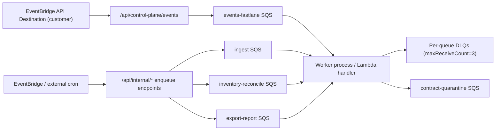

BACKGROUND JOB FEATURE INVENTORY

| Feature ID | Job Name | File Path | What it does (one sentence) | Trigger type (API-enqueued / scheduled cron / event-driven / manual) | Trigger endpoint or event (which API endpoint or event source) | Input payload (fields expected) | Output / side effects (what it writes, calls, or sends) | AWS services called during execution | Estimated duration (fast <30s / medium 30s-5min / slow >5min) | Retry behavior (retries / no retry / unknown) | Idempotent (yes / no / unknown) | Failure behavior (what happens to the job and related data on failure) | Queue or scheduler mechanism | Implementation status (fully implemented / partial / stub / unknown) | Known issues from audit files (finding ID or none) |
|---|---|---|---|---|---|---|---|---|---|---|---|---|---|---|---|
| JOB-001 | worker_queue_poller | backend/workers/main.py | Long-polls configured SQS queue(s), validates contracts, dispatches handlers, and deletes only successful messages. | event-driven | ECS/local worker process entrypoint (`python -m backend.workers.main`) consuming SQS queues | SQS message bodies for all supported `job_type` values (`schema_version` + job-specific fields) | Receives/deletes/changes SQS visibility; routes to handler; quarantines invalid contracts to quarantine queue; auto-disables accounts after repeated AssumeRole failures (config gated) | SQS (receive/delete/change visibility/send quarantine), optional STS indirectly via handlers | slow >5min (continuous worker loop) | retries (tenacity on receive/delete; SQS redelivery and DLQ on handler failure) | unknown | Contract violations are quarantined when configured; handler exceptions leave message undeleted for retry then DLQ; worker keeps running unless poller thread dies | SQS long polling across `WORKER_POOL` queues (`legacy/events/inventory/export/all`) | fully implemented | unknown (audit source missing) |
| JOB-002 | worker_lambda_handler | backend/workers/lambda_handler.py | Processes SQS-triggered Lambda batches with partial-batch failure reporting and the same job routing/contract checks as the poller. | event-driven | Lambda SQS event-source mappings from ingest/events/inventory/export queues | Lambda `event.Records[]` bodies containing worker job payloads | Returns `batchItemFailures`; sends contract violations to quarantine queue; best-effort visibility heartbeats for long jobs | SQS (change visibility/send quarantine; delete handled by Lambda integration) | medium 30s-5min (per invocation; queue-driven) | retries (failed records returned in partial-batch response and retried by SQS/Lambda until DLQ policy) | unknown | Bad records are quarantined (if queue configured) and ACKed; handler failures mark record failed for retry/DLQ | AWS Lambda SQS event-source mappings (`ReportBatchItemFailures`) | fully implemented | unknown (audit source missing) |
| JOB-003 | ingest_findings | backend/workers/jobs/ingest_findings.py | Assumes tenant ReadRole, fetches Security Hub findings for one account/region, upserts findings, and optionally enqueues `compute_actions`. | API-enqueued | `POST /api/aws/accounts/{account_id}/ingest`; also `POST /api/aws/accounts/{account_id}/onboarding-fast-path` | `tenant_id`, `account_id`, `region`, `job_type`, `created_at`, `schema_version` | Upserts `findings` rows (`source=security_hub`), reevaluates action confirmations for resolved findings, best-effort enqueue of `compute_actions` | STS, Security Hub, SQS (follow-up enqueue) | medium 30s-5min | retries (queue retry on unhandled error) | yes | Security Hub-not-enabled is treated as skip (no throw); per-finding upsert errors are logged/continued; unhandled exceptions cause message retry/DLQ | Ingest queue (`SQS_INGEST_QUEUE_URL`) | fully implemented | unknown (audit source missing) |
| JOB-004 | ingest_access_analyzer | backend/workers/jobs/ingest_access_analyzer.py | Assumes tenant ReadRole, fetches Access Analyzer findings for one account/region, upserts findings, and optionally enqueues `compute_actions`. | API-enqueued | `POST /api/aws/accounts/{account_id}/ingest-access-analyzer` | `tenant_id`, `account_id`, `region`, `job_type`, `created_at`, `schema_version` | Upserts `findings` rows (`source=access_analyzer`), best-effort enqueue of `compute_actions` | STS, IAM Access Analyzer, SQS (follow-up enqueue) | medium 30s-5min | retries (queue retry on unhandled error) | yes | Missing Access Analyzer permission is treated as skip; unhandled exceptions retry/DLQ | Ingest queue (`SQS_INGEST_QUEUE_URL`) | fully implemented | unknown (audit source missing) |
| JOB-005 | ingest_inspector | backend/workers/jobs/ingest_inspector.py | Assumes tenant ReadRole, fetches Inspector v2 findings for one account/region, upserts findings, and optionally enqueues `compute_actions`. | API-enqueued | `POST /api/aws/accounts/{account_id}/ingest-inspector` | `tenant_id`, `account_id`, `region`, `job_type`, `created_at`, `schema_version` | Upserts `findings` rows (`source=inspector`), best-effort enqueue of `compute_actions` | STS, Inspector v2, SQS (follow-up enqueue) | medium 30s-5min | retries (queue retry on unhandled error) | yes | Per-finding failures are logged/continued; unhandled exceptions retry/DLQ | Ingest queue (`SQS_INGEST_QUEUE_URL`) | fully implemented | unknown (audit source missing) |
| JOB-006 | ingest_control_plane_events | backend/workers/jobs/ingest_control_plane_events.py | Deduplicates and processes control-plane CloudTrail management events into shadow finding state and freshness telemetry. | event-driven | `POST /api/control-plane/events` (EventBridge API Destination); `POST /api/internal/control-plane-events` | `tenant_id`, `account_id`, `region`, `event`, `event_id`, `event_time`, `intake_time`, `job_type`, `created_at`, `schema_version` | Writes `control_plane_events`; updates shadow state; reevaluates confirmations for impacted actions; best-effort enqueue of `compute_actions` when not in shadow mode | STS, service-specific AWS read APIs via event enrichment, SQS (optional follow-up enqueue) | fast <30s to medium 30s-5min | retries (queue retry on unhandled error) | yes | Duplicate event IDs are counted and skipped; unsupported events are persisted as dropped; unhandled exceptions retry/DLQ | Events fast-lane queue (`SQS_EVENTS_FAST_LANE_QUEUE_URL`) | fully implemented | unknown (audit source missing) |
| JOB-007 | compute_actions | backend/workers/jobs/compute_actions.py | Recomputes tenant action groups and statuses (optionally scoped to account/region). | API-enqueued | `POST /api/actions/compute`; `POST /api/aws/accounts/{account_id}/onboarding-fast-path`; also worker-chained from ingest/reconcile/control-plane jobs | `tenant_id`, `job_type`, `created_at`, optional `account_id`, optional `region`, `schema_version` | Runs action engine; updates actions/action_findings mappings in DB | none | medium 30s-5min | retries (queue retry on unhandled error) | yes | Any unhandled error causes message retry/DLQ; no AWS side effects | Ingest queue (`SQS_INGEST_QUEUE_URL`) | fully implemented | unknown (audit source missing) |
| JOB-008 | reconcile_inventory_global_orchestration | backend/workers/jobs/reconcile_inventory_global_orchestration.py | Expands tenant-wide reconciliation into per-account/region/service shard jobs with checkpointed resume state. | scheduled cron | `POST /api/internal/reconcile-inventory-global-all-tenants` (designed for EventBridge scheduler API Destination) | `tenant_id`, `orchestration_job_id`, `job_type`, `created_at`, optional filters (`account_ids`,`regions`,`services`,`max_resources`,`precheck_assume_role`,`quarantine_on_assume_role_failure`), `schema_version` | Updates `control_plane_reconcile_jobs` checkpoint/status/stats; enqueues many `reconcile_inventory_shard` jobs; may disable accounts on configured precheck failures | SQS, STS, Security Hub, EC2, S3 (authoritative precheck probes) | slow >5min | retries (queue retry on unhandled error; checkpoint enables resume) | unknown (checkpointed resume, but shard enqueue may be re-attempted) | On exception, orchestration record is marked `error` with last error code and message then job rethrows for retry | Inventory queue (`SQS_INVENTORY_RECONCILE_QUEUE_URL`) + EventBridge schedule calling internal endpoint | fully implemented | unknown (audit source missing) |
| JOB-009 | reconcile_inventory_shard | backend/workers/jobs/reconcile_inventory_shard.py | Reconciles one inventory shard (tenant/account/region/service), updates shadow state/assets, and optionally enqueues `compute_actions`. | API-enqueued | `POST /api/internal/reconcile-inventory-shard`; `POST /api/saas/control-plane/reconcile/global`; `POST /api/saas/control-plane/reconcile/shard`; worker-chained from global orchestration and post-apply reconcile | `tenant_id`, `account_id`, `region`, `service`, `job_type`, `created_at`, optional `resource_ids`,`sweep_mode`,`max_resources`,`run_id`,`run_shard_id`, `schema_version` | Updates inventory assets and shadow state; marks reconcile shard tracking rows running/finished; reevaluates impacted action confirmations; optional `compute_actions` enqueue when authoritative mode changed statuses | STS, service-specific inventory APIs (`ec2`,`s3`,`s3control`,`cloudtrail`,`config`,`iam`,`rds`,`eks`,`ssm`,`guardduty`,`securityhub`), SQS (optional follow-up enqueue) | medium 30s-5min (can be slow on large global sweeps) | retries (queue retry on unhandled error) | yes | If `run_shard_id` provided, tracking row is marked failed with classified error; unhandled exceptions retry/DLQ | Inventory queue (`SQS_INVENTORY_RECONCILE_QUEUE_URL`) | fully implemented | unknown (audit source missing) |
| JOB-010 | reconcile_recently_touched_resources | backend/workers/jobs/reconcile_recently_touched_resources.py | Finds recently touched resources from control-plane events and runs targeted shard reconciliations inline for those resource IDs. | scheduled cron | `POST /api/internal/reconcile-recently-touched`; `POST /api/saas/control-plane/reconcile/recently-touched` | `tenant_id`, `job_type`, `created_at`, optional `lookback_minutes`,`services`,`max_resources`, `schema_version` | Reads recent control-plane events, derives target sets, invokes `execute_reconcile_inventory_shard_job` per target group | Indirect through shard execution (STS + inventory AWS APIs) | medium 30s-5min | retries (queue retry on unhandled error) | yes | Failure in any inline shard invocation bubbles up and causes job retry/DLQ; successful prior shard updates are durable | Inventory queue (`SQS_INVENTORY_RECONCILE_QUEUE_URL`) | partial (target extraction currently implemented for SG/S3 event families) | unknown (audit source missing) |
| JOB-011 | remediation_run | backend/workers/jobs/remediation_run.py | Executes one remediation run by generating PR bundle artifacts (`pr_only`) or performing direct fix execution (`direct_fix`). | API-enqueued | `POST /api/remediation-runs`; `POST /api/remediation-runs/group-pr-bundle`; `POST /api/action-groups/{group_id}/bundle-run`; `POST /api/remediation-runs/{run_id}/resend` | `job_type`, `run_id`, `tenant_id`, `action_id`, `mode`, `created_at`, optional `pr_bundle_variant`,`strategy_id`,`strategy_inputs`,`risk_acknowledged`,`group_action_ids`, `schema_version` | Updates `remediation_runs` status/logs/outcome/artifacts; writes audit entry; updates related action-group run lifecycle for download-bundle mode; optional S3 read for centralized runner template; direct-fix path applies AWS changes | STS (direct-fix path), action-dependent AWS APIs via direct fix, optional S3 (`get_object`), none for pure bundle generation | medium 30s-5min | no retry for handled business failures (job stores failed status and returns); retries for unhandled exceptions | unknown | Most execution errors are captured into run status/outcome/artifacts (`failed`) and message is deleted; only unhandled exceptions cause queue retry/DLQ | Ingest queue (`SQS_INGEST_QUEUE_URL`) | fully implemented | unknown (audit source missing) |
| JOB-012 | execute_pr_bundle_plan | backend/workers/jobs/remediation_run_execution.py | Runs SaaS-managed Terraform `init/plan/show` for PR bundle workspace and records execution results. | API-enqueued | `POST /api/remediation-runs/{run_id}/execute-pr-bundle`; `POST /api/remediation-runs/bulk-execute-pr-bundle` | `job_type=execute_pr_bundle_plan`, `execution_id`, `run_id`, `tenant_id`, `phase=plan`, `created_at`, optional `requested_by_user_id`, `schema_version` | Updates `remediation_run_executions` and parent `remediation_runs`; stores per-folder command outputs/results; may update action-group execution result tables | STS (WriteRole assume), target AWS APIs through Terraform provider | slow >5min | no retry for handled execution failures (status persisted); retries for unhandled exceptions | yes (queue-claim/status checks prevent duplicate active processing) | Execution failures are persisted (`failed`, `error_summary`) and run outcome/logs updated; message is acknowledged unless an outer unhandled exception occurs | Ingest queue (`SQS_INGEST_QUEUE_URL`) | fully implemented | unknown (audit source missing) |
| JOB-013 | execute_pr_bundle_apply | backend/workers/jobs/remediation_run_execution.py | Runs SaaS-managed Terraform `apply` for approved PR bundle execution and updates remediation/run-group status. | API-enqueued | `POST /api/remediation-runs/{run_id}/approve-apply`; `POST /api/remediation-runs/bulk-approve-apply` | `job_type=execute_pr_bundle_apply`, `execution_id`, `run_id`, `tenant_id`, `phase=apply`, `created_at`, optional `requested_by_user_id`, `schema_version` | Applies Terraform plans, updates execution/run statuses, syncs group results, and best-effort enqueues post-apply reconciliation shards | STS (WriteRole assume), target AWS APIs through Terraform provider, SQS (post-apply reconcile enqueue) | slow >5min | no retry for handled execution failures (status persisted); retries for unhandled exceptions | yes (queue-claim/status checks prevent duplicate active processing) | Apply failures are persisted in execution/run state; root-credential-required actions are fail-fast with manual marker and no apply attempt | Ingest queue (`SQS_INGEST_QUEUE_URL`) | fully implemented | unknown (audit source missing) |
| JOB-014 | generate_export | backend/workers/jobs/evidence_export.py | Builds evidence/compliance export bundle and uploads the archive to S3 for one export request. | API-enqueued | `POST /api/exports` | `job_type`, `export_id`, `tenant_id`, `created_at`, optional `pack_type`, `schema_version` | Updates `evidence_exports` lifecycle/status fields; writes S3 bucket/key/file size; stores truncated error on failure | S3 (via `generate_evidence_pack`) | medium 30s-5min (can be slow for large datasets) | no retry for handled generation failures (status persisted); retries for lookup/outer exceptions | yes (skips if export already success/failed) | Generation exceptions are stored as `failed` on export row and message is acknowledged; missing export row raises and retries | Export/report queue (`SQS_EXPORT_REPORT_QUEUE_URL`) | fully implemented | unknown (audit source missing) |
| JOB-015 | generate_baseline_report | backend/workers/jobs/generate_baseline_report.py | Builds 48h baseline report HTML, uploads to S3, updates report row, and optionally sends ready email. | API-enqueued | `POST /api/baseline-report` | `job_type`, `report_id`, `tenant_id`, `created_at`, optional `account_ids`, `schema_version` | Updates `baseline_reports` status/bucket/key/size; generates presigned URL for email notification; sends optional ready email | S3 (report storage and presign), optional external email provider | medium 30s-5min | no retry for handled generation failures (status persisted); retries for lookup/outer exceptions | yes (skips if report already success/failed) | Generation failures are persisted as `failed` with truncated outcome and acknowledged; missing report row raises and retries | Export/report queue (`SQS_EXPORT_REPORT_QUEUE_URL`) | fully implemented | unknown (audit source missing) |
| JOB-016 | weekly_digest | backend/workers/jobs/weekly_digest.py | Builds tenant digest metrics/top actions, enforces 7-day cooldown, updates last-sent marker, and sends email/Slack digests when enabled. | scheduled cron | `POST /api/internal/weekly-digest` (protected by `X-Digest-Cron-Secret`, intended for EventBridge/cron) | `job_type`, `tenant_id`, `created_at`, `schema_version` | Updates `tenants.last_digest_sent_at`; sends weekly digest email and optional Slack digest | none directly (email/Slack delivery integrations only) | fast <30s | no retry for send failures (send errors are logged); retries for unhandled exceptions | yes (7-day cooldown idempotency) | If tenant missing or unexpected error occurs, message retries/DLQ; email/Slack send failures do not fail the job | Ingest queue (`SQS_INGEST_QUEUE_URL`) + external cron scheduler calling internal endpoint | fully implemented | unknown (audit source missing) |
| JOB-017 | backfill_finding_keys | backend/workers/jobs/backfill_finding_keys.py | Backfills canonical control/resource keys on Security Hub findings in chunks, optionally continuing via self-enqueued cursor jobs. | manual | `POST /api/internal/backfill-finding-keys` | `job_type`, `created_at`, optional `tenant_id`,`account_id`,`region`,`chunk_size`,`max_chunks`,`include_stale`,`auto_continue`,`start_after_id`, `schema_version` | Updates `findings.canonical_control_id/resource_key/in_scope`; computes missing in-scope counts; optionally enqueues continuation message | SQS (continuation enqueue) | slow >5min (chunked multi-pass over large finding sets) | retries (queue retry on unhandled error) | yes | Partial chunk updates are committed; failure before completion can retry safely; continuation enqueue failure raises and retries current message | Inventory queue (`SQS_INVENTORY_RECONCILE_QUEUE_URL`) | fully implemented | unknown (audit source missing) |
| JOB-018 | backfill_action_groups | backend/workers/jobs/backfill_action_groups.py | Backfills action-group memberships and legacy group-run/result records in chunks with optional continuation. | manual | `POST /api/internal/backfill-action-groups` | `job_type`, `created_at`, optional `tenant_id`,`account_id`,`region`,`chunk_size`,`max_chunks`,`auto_continue`,`start_after_action_id`, `schema_version` | Assigns immutable memberships, creates missing legacy `action_group_runs/results`, updates confirmation metadata, optionally enqueues continuation | SQS (continuation enqueue) | slow >5min (chunked over actions + legacy backfill) | retries (queue retry on unhandled error) | yes | Existing memberships/runs/results are skipped (append-only semantics); continuation enqueue errors raise and trigger retry | Ingest queue (`SQS_INGEST_QUEUE_URL`) | fully implemented | unknown (audit source missing) |

JOB DEPENDENCY MAP

| Job | Must run after | Typically followed by | Can run concurrently with |
|-----|---------------|----------------------|--------------------------|
| worker_queue_poller | Queue and DB readiness | All queue job handlers | All jobs (bounded by `WORKER_MAX_IN_FLIGHT_PER_QUEUE`) |
| worker_lambda_handler | Lambda event-source mapping + queue wiring | All queue job handlers | All jobs (bounded by Lambda concurrency) |
| ingest_findings | Account validation + ReadRole setup | compute_actions | Other account/region ingests, exports, digests |
| ingest_access_analyzer | Account validation + ReadRole permissions | compute_actions | Other ingests/reconcile/export jobs |
| ingest_inspector | Account validation + ReadRole permissions | compute_actions | Other ingests/reconcile/export jobs |
| ingest_control_plane_events | Control-plane event intake enqueue | compute_actions (when not shadow mode) | Ingest/reconcile/export jobs |
| compute_actions | Any finding/shadow state changes | remediation_run (user approval flow) | Most jobs |
| reconcile_inventory_global_orchestration | `control_plane_reconcile_jobs` record creation + queue availability | reconcile_inventory_shard fan-out | Ingest/export/digest/backfill jobs |
| reconcile_recently_touched_resources | Recent control-plane event rows present | inline reconcile_inventory_shard calls | Ingest/export/digest jobs |
| reconcile_inventory_shard | Shard payload creation (API/orchestration/post-apply) | compute_actions (authoritative mode + changed status) | Other shards, ingest, export |
| remediation_run | Remediation run row pending | execute_pr_bundle_plan/apply (SaaS executor path) or manual bundle apply | Ingest/export/reconcile jobs |
| execute_pr_bundle_plan | PR bundle artifacts present + queued execution row | execute_pr_bundle_apply (after approval) | Other non-execution jobs; other executions within tenant cap |
| execute_pr_bundle_apply | Plan phase awaiting approval | post-apply reconcile shard enqueue | Other non-execution jobs; other executions within tenant cap |
| generate_export | Evidence export row pending | none | All other jobs |
| generate_baseline_report | Baseline report row pending | none | All other jobs |
| weekly_digest | Cron/internal trigger | none | All other jobs |
| backfill_finding_keys | Backfill enqueue/manual trigger | continuation backfill_finding_keys jobs | All other jobs |
| backfill_action_groups | Backfill enqueue/manual trigger | continuation backfill_action_groups jobs | All other jobs |

SCHEDULER AND QUEUE ARCHITECTURE

- Queue type: Standard Amazon SQS queues (not FIFO) for ingest, events-fastlane, inventory-reconcile, and export-report.
- Scheduler type: EventBridge schedule (reconcile template defaults to `rate(6 hours)`) and cron-style callers for internal endpoints (weekly digest is explicitly designed for EventBridge/cron).
- Worker process type: 
  `backend/workers/main.py` long-poll multi-threaded queue consumer (ECS/local mode).
  `backend/workers/lambda_handler.py` Lambda SQS batch consumer with partial-batch failure support.
- DLQ/failure handling:
  Each main queue has a DLQ with `maxReceiveCount=3` in queue redrive policy.
  Invalid/unknown payload contracts can be diverted to `security-autopilot-contract-quarantine-queue` and source message is deleted.
  Handler exceptions generally leave message undeleted so SQS retry/DLQ behavior applies.
- Visibility timeout or lock behavior:
  Queue defaults set `VisibilityTimeout=960` seconds; poller receive call sets per-message visibility to 300 seconds; both poller and Lambda handler run heartbeat extensions (`ChangeMessageVisibility` to 300s every 120s) while jobs are running.

PERFORMANCE CHARACTERISTICS

| Job Name | Scales with (number of findings / accounts / actions) | Bottleneck risk | Max safe concurrent executions |
|---------|------------------------------------------------------|-----------------|-------------------------------|
| worker_queue_poller | Total queue depth across all configured queues | SQS receive rate, DB connection pool, downstream AWS API throttling | `WORKER_MAX_IN_FLIGHT_PER_QUEUE` per queue thread (default 10) |
| worker_lambda_handler | Queue depth and Lambda invocation fan-out | Lambda account concurrency, cold starts, downstream AWS throttling | Lambda reserved/unreserved concurrency; batch sizes set per queue mapping |
| ingest_findings | Findings volume per account-region | Security Hub API pagination + DB upsert throughput | Queue-consumer bound; keep account-region parallelism moderate to avoid AWS throttling |
| ingest_access_analyzer | Access Analyzer findings per account-region | Access Analyzer API rate + DB upserts | Queue-consumer bound; region/account fan-out should respect AWS read quotas |
| ingest_inspector | Inspector findings per account-region | Inspector API pagination + DB upserts | Queue-consumer bound; region/account fan-out should respect AWS read quotas |
| ingest_control_plane_events | Event rate (CloudTrail management events) | Event enrichment calls + shadow-state write contention | Queue-consumer bound; event queue isolates this workload |
| compute_actions | Number of findings/actions in tenant or scope | Action-engine DB joins/updates | Queue-consumer bound; scoped recompute reduces hotspot risk |
| reconcile_inventory_global_orchestration | Accounts × regions × services fan-out cardinality | SQS fan-out volume + precheck API calls | One orchestration per tenant is safest; checkpointing supports resume |
| reconcile_inventory_shard | Resources per shard and selected service complexity | AWS inventory API rate limits + shadow-state upserts | Parallel shards are safe when split by account/region/service and AWS quotas permit |
| reconcile_recently_touched_resources | Recent event volume and derived target groups | Inline shard execution serial cost inside one message | Low-to-moderate; large windows should be split or run more frequently |
| remediation_run | Action complexity; bundle size; direct-fix AWS mutation cost | Direct-fix AWS write operations; large group bundle generation | Queue-consumer bound; avoid high parallel direct-fix on same account/region |
| execute_pr_bundle_plan | Number of bundle folders/actions and Terraform graph size | Terraform init/plan runtime + provider/API throttling | Tenant cap via `SAAS_BUNDLE_EXECUTOR_MAX_CONCURRENT_PER_TENANT` (default 6) |
| execute_pr_bundle_apply | Number of bundle folders/actions and Terraform apply graph | Terraform apply runtime + AWS mutation throttling/failures | Tenant cap via `SAAS_BUNDLE_EXECUTOR_MAX_CONCURRENT_PER_TENANT` (default 6) |
| generate_export | Findings/actions/exceptions/runs included in pack | ZIP generation + S3 upload size | Queue-consumer bound; export queue isolates long-running pack jobs |
| generate_baseline_report | Included accounts and report data size | Report assembly + S3 upload + optional email send | Queue-consumer bound; export queue isolates report jobs |
| weekly_digest | Tenant count and per-tenant action/finding counts | Email provider throughput; DB aggregation queries | One job per tenant per week by cooldown logic |
| backfill_finding_keys | Historical finding row count (chunked) | DB scan/update throughput + continuation queue churn | Chunk controls (`chunk_size`,`max_chunks`) define safe rate |
| backfill_action_groups | Historical action count + legacy run cardinality | DB membership writes and legacy run/result backfill loops | Chunk controls (`chunk_size`,`max_chunks`) define safe rate |
