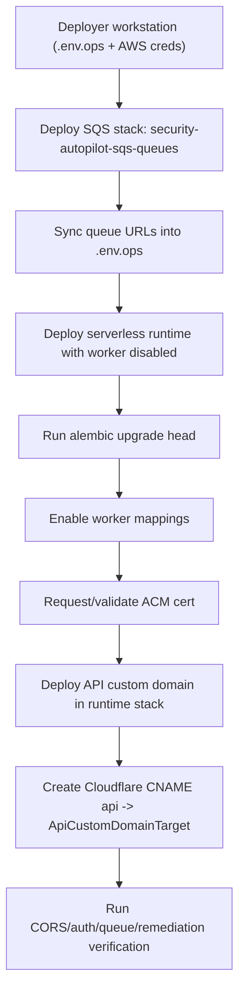
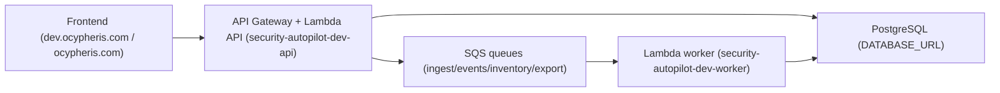

# Deployer Runbook: Phase 1 to Phase 3

## Audience
SaaS deployer/operator for AWS Security Autopilot.

## Scope
This runbook covers production-style deployment from `config/.env.ops` setup through AWS serverless deployment and Cloudflare custom-domain wiring, with practical verification for audit-remediation **Phase 1**, **Phase 2**, and **Phase 3**.

Canonical env model:
- Backend runtime: `/Users/marcomaher/AWS Security Autopilot/backend/.env`
- Worker runtime: `/Users/marcomaher/AWS Security Autopilot/backend/workers/.env`
- Frontend public vars: `/Users/marcomaher/AWS Security Autopilot/frontend/.env`
- Deploy/ops scripts: `/Users/marcomaher/AWS Security Autopilot/config/.env.ops`
- Root `/Users/marcomaher/AWS Security Autopilot/.env` is backup-only and commented out.

## Exact Phase Mapping (from this repository)
This repository defines phases in `/Users/marcomaher/AWS Security Autopilot/docs/audit-remediation/00-program-plan.md` as:

- **Phase 1: Critical Remediation (Weeks 1-3)**
- **Phase 2: High-Priority Reliability and UX (Weeks 3-6)**
- **Phase 3: Recommendations and Compliance Maturity (Weeks 6-8)**

This runbook uses that exact mapping.

## Cross-References
- `/Users/marcomaher/AWS Security Autopilot/docs/deployment/prerequisites.md`
- `/Users/marcomaher/AWS Security Autopilot/docs/deployment/database.md`
- `/Users/marcomaher/AWS Security Autopilot/docs/deployment/secrets-config.md`
- `/Users/marcomaher/AWS Security Autopilot/scripts/deploy_saas_serverless.sh`
- `/Users/marcomaher/AWS Security Autopilot/infrastructure/cloudformation/saas-serverless-httpapi.yaml`
- `/Users/marcomaher/AWS Security Autopilot/infrastructure/cloudformation/sqs-queues.yaml`
- `/Users/marcomaher/AWS Security Autopilot/docs/audit-remediation/phase2-architecture-closure-checklist.md`
- `/Users/marcomaher/AWS Security Autopilot/docs/audit-remediation/phase3-architecture-closure-checklist.md`
- `/Users/marcomaher/AWS Security Autopilot/docs/audit-remediation/phase3-security-closure-checklist.md`

## Deployment Flow


## Request Flow


## 1) Prerequisites (Accounts, IAM, Tools)

### Accounts and IAM
- SaaS AWS account configured (current repo live account: `029037611564`).
- IAM principal with deployment privileges for CloudFormation, Lambda, API Gateway, SQS, IAM, S3, ECR, CodeBuild, ACM, CloudWatch, Route53 (if used).
- DNS hosted in Cloudflare for the target domain (for this repo: `ocypheris.com`).

### Tooling checks (`aws`, `gh`, `cloudflared`, deploy tooling)
```bash
command -v aws
command -v gh
command -v cloudflared
command -v alembic
command -v jq
command -v zip
```

```bash
aws sts get-caller-identity
```

> ❓ Needs verification: `cloudflared` is requested in deploy prerequisites, but this repository does not currently ship Cloudflare Tunnel IaC/scripts. Use it only if your org routes traffic through Cloudflare Tunnel.

## 2) `config/.env.ops` Setup
Use `config/.env.ops` for deploy/ops script variables.

```bash
cat > config/.env.ops <<'ENVVARS'
APP_NAME="AWS Security Autopilot"
ENV="prod"
LOG_LEVEL="INFO"
AWS_REGION="eu-north-1"
SAAS_AWS_ACCOUNT_ID="029037611564"
ROLE_SESSION_NAME="security-autopilot-session"
FRONTEND_URL="https://ocypheris.com"
CORS_ORIGINS="https://dev.ocypheris.com,https://ocypheris.com,http://localhost:3000,http://127.0.0.1:3000"

DATABASE_URL="<YOUR_DATABASE_URL_ASYNCPG>"
DATABASE_URL_SYNC="<YOUR_DATABASE_URL_PSYCOPG2>"
JWT_SECRET="<YOUR_JWT_SECRET>"
CONTROL_PLANE_EVENTS_SECRET="<YOUR_CONTROL_PLANE_EVENTS_SECRET>"

S3_EXPORT_BUCKET="security-autopilot-exports"
S3_EXPORT_BUCKET_REGION="eu-north-1"
S3_SUPPORT_BUCKET="autopilot-s3-support-bucket"
S3_SUPPORT_BUCKET_REGION="eu-north-1"

CLOUDFORMATION_CONTROL_PLANE_FORWARDER_TEMPLATE_URL="https://security-autopilot-templates.s3.eu-north-1.amazonaws.com/cloudformation/control-plane-forwarder/v1.0.0.yaml"
SAAS_BUNDLE_EXECUTOR_ENABLED="true"
SAAS_BUNDLE_RUNNER_TEMPLATE_S3_URI="s3://autopilot-prbundle-run/run_all.sh"
SAAS_BUNDLE_RUNNER_TEMPLATE_VERSION="v1.6.7"
SAAS_BUNDLE_RUNNER_TEMPLATE_CACHE_SECONDS="300"
TENANT_RECONCILIATION_ENABLED="true"
ENVVARS
```

Validate required deploy variables:
```bash
for k in DATABASE_URL JWT_SECRET CONTROL_PLANE_EVENTS_SECRET AWS_REGION; do
  if [ -z "$(grep -E "^${k}=" config/.env.ops || true)" ]; then echo "Missing $k"; fi
done
```

## 3) Deploy SQS Baseline

```bash
export AWS_REGION="eu-north-1"
export SQS_STACK_NAME="security-autopilot-sqs-queues"

aws cloudformation deploy \
  --region "$AWS_REGION" \
  --stack-name "$SQS_STACK_NAME" \
  --template-file infrastructure/cloudformation/sqs-queues.yaml \
  --capabilities CAPABILITY_NAMED_IAM \
  --no-fail-on-empty-changeset
```

Sync queue URLs into `.env.ops`:
```bash
python3 scripts/set_env_sqs_from_stack.py --stack-name "$SQS_STACK_NAME" --region "$AWS_REGION"
```

Stack output inspection:
```bash
aws cloudformation describe-stacks \
  --region "$AWS_REGION" \
  --stack-name "$SQS_STACK_NAME" \
  --query "Stacks[0].Outputs[].[OutputKey,OutputValue]" \
  --output table
```

## 4) Database Migration
Run this before turning worker event-source mappings on.

```bash
alembic current
alembic upgrade head
python3 scripts/check_migration_gate.py
```

## 5) Serverless Deployment (Runtime + Build)
Use explicit stack names and prefix used by this repo.

```bash
export AWS_REGION="eu-north-1"
export BUILD_STACK="security-autopilot-saas-serverless-build"
export RUNTIME_STACK="security-autopilot-saas-serverless-runtime"
export NAME_PREFIX="security-autopilot-dev"
export SQS_STACK_NAME="security-autopilot-sqs-queues"
```

Initial deploy with worker disabled (safe migration-first rollout):
```bash
SAAS_SERVERLESS_ENABLE_WORKER=false \
SAAS_SERVERLESS_WORKER_RESERVED_CONCURRENCY=0 \
./scripts/deploy_saas_serverless.sh \
  --region "$AWS_REGION" \
  --build-stack "$BUILD_STACK" \
  --runtime-stack "$RUNTIME_STACK" \
  --name-prefix "$NAME_PREFIX" \
  --sqs-stack "$SQS_STACK_NAME" \
  --enable-worker false \
  --worker-reserved-concurrency 0
```

Stack output inspection:
```bash
aws cloudformation describe-stacks \
  --region "$AWS_REGION" \
  --stack-name "$RUNTIME_STACK" \
  --query "Stacks[0].Outputs[].[OutputKey,OutputValue]" \
  --output table
```

## 6) API Custom Domain + ACM + Cloudflare DNS

### 6.1 Request ACM certificate (`eu-north-1`)
```bash
export API_DOMAIN="api.ocypheris.com"

CERT_ARN=$(aws acm request-certificate \
  --region "$AWS_REGION" \
  --domain-name "$API_DOMAIN" \
  --validation-method DNS \
  --query CertificateArn \
  --output text)

echo "$CERT_ARN"
```

Get ACM DNS validation record:
```bash
aws acm describe-certificate \
  --region "$AWS_REGION" \
  --certificate-arn "$CERT_ARN" \
  --query "Certificate.DomainValidationOptions[?DomainName=='$API_DOMAIN'].ResourceRecord.[Name,Type,Value]" \
  --output text
```

### 6.2 Add ACM validation CNAME in Cloudflare
Use Cloudflare dashboard or API:

```bash
export CF_API_TOKEN="<YOUR_CLOUDFLARE_API_TOKEN>"
export CF_ZONE_ID="<YOUR_CLOUDFLARE_ZONE_ID>"
export ACM_CNAME_NAME="<OUTPUT_NAME_FROM_ACM>"
export ACM_CNAME_VALUE="<OUTPUT_VALUE_FROM_ACM>"

curl -sS -X POST "https://api.cloudflare.com/client/v4/zones/$CF_ZONE_ID/dns_records" \
  -H "Authorization: Bearer $CF_API_TOKEN" \
  -H "Content-Type: application/json" \
  --data "{\"type\":\"CNAME\",\"name\":\"$ACM_CNAME_NAME\",\"content\":\"$ACM_CNAME_VALUE\",\"ttl\":300,\"proxied\":false}"
```

Wait for validation:
```bash
aws acm wait certificate-validated --region "$AWS_REGION" --certificate-arn "$CERT_ARN"
```

### 6.3 Deploy runtime with custom domain parameters
```bash
./scripts/deploy_saas_serverless.sh \
  --region "$AWS_REGION" \
  --build-stack "$BUILD_STACK" \
  --runtime-stack "$RUNTIME_STACK" \
  --name-prefix "$NAME_PREFIX" \
  --sqs-stack "$SQS_STACK_NAME" \
  --api-domain "$API_DOMAIN" \
  --certificate-arn "$CERT_ARN"
```

Inspect custom-domain outputs:
```bash
aws cloudformation describe-stacks \
  --region "$AWS_REGION" \
  --stack-name "$RUNTIME_STACK" \
  --query "Stacks[0].Outputs[?OutputKey=='ApiBaseUrl' || OutputKey=='ApiCustomDomainTarget' || OutputKey=='ApiCustomDomainHostedZoneId'].[OutputKey,OutputValue]" \
  --output table
```

### 6.4 Add Cloudflare API CNAME -> API Gateway regional target
```bash
API_TARGET=$(aws cloudformation describe-stacks \
  --region "$AWS_REGION" \
  --stack-name "$RUNTIME_STACK" \
  --query "Stacks[0].Outputs[?OutputKey=='ApiCustomDomainTarget'].OutputValue" \
  --output text)

curl -sS -X POST "https://api.cloudflare.com/client/v4/zones/$CF_ZONE_ID/dns_records" \
  -H "Authorization: Bearer $CF_API_TOKEN" \
  -H "Content-Type: application/json" \
  --data "{\"type\":\"CNAME\",\"name\":\"api\",\"content\":\"$API_TARGET\",\"ttl\":300,\"proxied\":false}"
```

Verify DNS + endpoint:
```bash
dig +short api.ocypheris.com CNAME
curl -sS -i https://api.ocypheris.com/health
```

> ⚠️ Status: Planned — not yet implemented
> This repository does not currently include automated Cloudflare DNS provisioning scripts; DNS/API steps above are manual/operator-driven.

## 7) Worker Enablement + Verification

Enable worker mappings after migrations are confirmed:
```bash
./scripts/deploy_saas_serverless.sh \
  --region "$AWS_REGION" \
  --build-stack "$BUILD_STACK" \
  --runtime-stack "$RUNTIME_STACK" \
  --name-prefix "$NAME_PREFIX" \
  --sqs-stack "$SQS_STACK_NAME" \
  --enable-worker true \
  --worker-reserved-concurrency 0
```

Verify runtime parameters:
```bash
aws cloudformation describe-stacks \
  --region "$AWS_REGION" \
  --stack-name "$RUNTIME_STACK" \
  --query "Stacks[0].Parameters[?ParameterKey=='EnableWorker' || ParameterKey=='WorkerReservedConcurrency'].[ParameterKey,ParameterValue]" \
  --output table
```

Lambda event source mapping checks:
```bash
aws lambda list-event-source-mappings \
  --region "$AWS_REGION" \
  --function-name "${NAME_PREFIX}-worker" \
  --query "EventSourceMappings[].[State,EventSourceArn,BatchSize,LastProcessingResult]" \
  --output table
```

Logs tail for API/worker:
```bash
aws logs tail "/aws/lambda/${NAME_PREFIX}-api" --since 30m --follow
```

```bash
aws logs tail "/aws/lambda/${NAME_PREFIX}-worker" --since 30m --follow
```

## 8) CORS Validation + Auth/Login Validation

### CORS OPTIONS test
```bash
curl -sS -i -X OPTIONS "https://api.ocypheris.com/api/auth/login" \
  -H "Origin: https://dev.ocypheris.com" \
  -H "Access-Control-Request-Method: POST" \
  -H "Access-Control-Request-Headers: content-type,x-csrf-token,authorization,accept"
```

Expected:
- HTTP `200`/`204`
- `access-control-allow-origin: https://dev.ocypheris.com`
- `access-control-allow-credentials: true`

### Auth login/me curl tests
```bash
export API_BASE="https://api.ocypheris.com"
export TEST_EMAIL="<YOUR_TEST_EMAIL>"
export TEST_PASSWORD="<YOUR_TEST_PASSWORD>"

LOGIN_JSON=$(curl -sS -X POST "$API_BASE/api/auth/login" \
  -H "Content-Type: application/json" \
  -d "{\"email\":\"$TEST_EMAIL\",\"password\":\"$TEST_PASSWORD\"}")

echo "$LOGIN_JSON" | jq
ACCESS_TOKEN=$(echo "$LOGIN_JSON" | jq -r '.access_token')

curl -sS "$API_BASE/api/auth/me" \
  -H "Authorization: Bearer $ACCESS_TOKEN" | jq
```

## 9) Queue/Worker Health Checks

Readiness check:
```bash
curl -sS -i "https://api.ocypheris.com/ready"
```

Queue depth/age quick check:
```bash
for q in \
  "https://sqs.eu-north-1.amazonaws.com/029037611564/security-autopilot-ingest-queue" \
  "https://sqs.eu-north-1.amazonaws.com/029037611564/security-autopilot-events-fastlane-queue" \
  "https://sqs.eu-north-1.amazonaws.com/029037611564/security-autopilot-inventory-reconcile-queue" \
  "https://sqs.eu-north-1.amazonaws.com/029037611564/security-autopilot-export-report-queue"
  do
    aws sqs get-queue-attributes \
      --region "$AWS_REGION" \
      --queue-url "$q" \
      --attribute-names ApproximateNumberOfMessages ApproximateNumberOfMessagesNotVisible ApproximateAgeOfOldestMessage
  done
```

## 10) Remediation Resend Check

List one pending remediation run, then resend:
```bash
PENDING_RUN_ID=$(curl -sS "$API_BASE/api/remediation-runs?status=pending&limit=1" \
  -H "Authorization: Bearer $ACCESS_TOKEN" | jq -r '.items[0].id // empty')

if [ -n "$PENDING_RUN_ID" ]; then
  curl -sS -X POST "$API_BASE/api/remediation-runs/$PENDING_RUN_ID/resend" \
    -H "Authorization: Bearer $ACCESS_TOKEN" | jq
else
  echo "No pending remediation runs found."
fi
```

Expected success response:
```json
{"message":"Job re-sent to queue."}
```

## Practical Troubleshooting Playbook

| Symptom | Likely Cause | Fix |
| --- | --- | --- |
| Worker queue grows, runs stay pending | Worker mappings disabled or function throttled | Re-run deploy with `--enable-worker true --worker-reserved-concurrency 0`; verify mappings are `Enabled` |
| `alembic` mismatch / startup fails | DB not at head revision | Run `alembic upgrade head` and `python3 scripts/check_migration_gate.py` |
| Browser shows `CORS error` with preflight/login 500 | API Lambda cold-start crash (migration guard fail) despite correct CORS config | Check `/aws/lambda/<name>-api` for `database revision is not at Alembic head`; run migrations from the same deployed code lineage. For emergency availability restore, temporarily set `DB_REVISION_GUARD_ENABLED=false`, then reconcile revision lineage and re-enable. |
| Browser login fails with CORS despite OPTIONS success | CORS origins/headers mismatch for credentialed requests | Ensure `CORS_ORIGINS` includes frontend origins and API stack has explicit allow methods/headers |
| `CSRF validation failed` on cross-subdomain | CSRF cookie domain not shared across subdomains | Ensure `FRONTEND_URL` is set correctly and/or set `CSRF_COOKIE_DOMAIN=.ocypheris.com` |
| `ApiMapping CREATE_FAILED` on custom domain | Domain/certificate mapping race or invalid domain/cert | Verify `ApiDomainName` + `ApiCertificateArn` values, certificate status `ISSUED`, then redeploy runtime |
| `curl: Could not resolve host api.ocypheris.com` | DNS propagation or Cloudflare record issue | Verify Cloudflare CNAME points to `ApiCustomDomainTarget`, wait propagation, keep proxy off initially |
| Runs stuck queued after enqueue error | Queue send failed at API time | Check API logs, fix queue config, then retry using `/api/remediation-runs/{run_id}/resend` |
| `/ready` returns degraded | DB/SQS readiness issue | Validate DB connectivity, queue URLs in `config/.env.ops`, and queue attributes via `aws sqs get-queue-attributes` |

### Orphaned Alembic Revision Recovery (fail-closed startup restore)

Use this when API startup fails with `database revision is not at Alembic head` and the `alembic_version` value is not present in the deployed image's Alembic tree.

1. Identify the currently deployed runtime source bundle for the active image tag and extract it (so Alembic commands run against the exact migration lineage used by runtime).
2. Confirm expected head from that extracted bundle:
```bash
cd /tmp/saas_runtime_src_<DEPLOYED_TAG>
alembic heads
```
3. Validate schema compatibility for migrations up to that head (table/column/index checks via `psql`).
4. Restamp revision metadata to the deployed head:
```bash
cd /tmp/saas_runtime_src_<DEPLOYED_TAG>
alembic stamp <EXPECTED_HEAD> --purge
alembic current
```
5. Re-enable startup guard (`DB_REVISION_GUARD_ENABLED=true`) on the API Lambda and verify:
```bash
aws lambda get-function-configuration --region eu-north-1 --function-name security-autopilot-dev-api \
  --query "Environment.Variables.DB_REVISION_GUARD_ENABLED"
```
6. Final checks: `GET /health`, CORS preflight/login path, and log scan for absence of:
   - `Refusing to start api`
   - `database revision is not at Alembic head`

## Rollback / Safe Re-Run Procedure

1. **Safe re-run same release**: re-run `./scripts/deploy_saas_serverless.sh` with same stacks and current tag (idempotent via `--no-fail-on-empty-changeset`).
2. **Rollback API/worker image**: redeploy with previous `--tag <KNOWN_GOOD_TAG>`.
3. **Emergency stop worker execution**: redeploy with `--enable-worker false`.
4. **DNS rollback**: point Cloudflare `api` CNAME back to previous known-good target.
5. **Post-rollback verification**: run `/health`, `/ready`, mapping checks, and one auth login/me test.

## Phase 1 / 2 / 3 Checklists

## Phase 1 Checklist

### Objective
Fail-closed critical deployment posture (secure config, migrations, auth/cors baseline).

### Must be deployed/configured
- Runtime stack deployed in `eu-north-1`.
- `DATABASE_URL`, `JWT_SECRET`, `CONTROL_PLANE_EVENTS_SECRET` set.
- Database at Alembic head.
- CORS origins include active frontend domains.

### Practical verification
- `aws sts get-caller-identity` returns expected account.
- `alembic upgrade head` succeeds.
- `curl /health` returns HTTP `200`.
- CORS OPTIONS test returns expected headers.
- Auth login/me curl tests succeed.

### Evidence artifact locations/filenames
- Canonical phase source: `/Users/marcomaher/AWS Security Autopilot/docs/audit-remediation/00-program-plan.md` and `/Users/marcomaher/AWS Security Autopilot/docs/audit-remediation/01-priority-backlog.md`.
- Store deployer evidence under:
  - `/Users/marcomaher/AWS Security Autopilot/docs/audit-remediation/evidence/phase1-deployer-config-<YYYYMMDDTHHMMSSZ>.txt`
  - `/Users/marcomaher/AWS Security Autopilot/docs/audit-remediation/evidence/phase1-deployer-auth-cors-<YYYYMMDDTHHMMSSZ>.txt`

### Pass/Fail criteria
- **Pass**: all verification commands succeed and no fail-open config remains.
- **Fail**: migration mismatch, auth/cors failures, or unresolved security-critical config gaps.

> ❓ Needs verification: Phase 1 closure in this repo is tracked at program/backlog level rather than a dedicated `phase1-closure-checklist.md`; confirm if your audit process requires a new dedicated Phase 1 closure artifact.

## Phase 2 Checklist

### Objective
Reliability controls active (queue isolation, alarms, orchestration, forwarder readiness).

### Must be deployed/configured
- SQS stack `security-autopilot-sqs-queues` with all queue outputs.
- Runtime wired to all queue URLs.
- Control-plane forwarder and reconcile scheduler rollout per customer account/region where required.

### Practical verification
- `aws cloudformation describe-stacks` shows SQS stack `UPDATE_COMPLETE`.
- `scripts/set_env_sqs_from_stack.py` succeeds.
- `aws lambda list-event-source-mappings` shows four enabled mappings.
- Queue attributes show acceptable depth/age.

### Evidence artifact locations/filenames
- Existing closure/evidence set:
  - `/Users/marcomaher/AWS Security Autopilot/docs/audit-remediation/phase2-architecture-closure-checklist.md`
  - `/Users/marcomaher/AWS Security Autopilot/docs/audit-remediation/evidence/phase2-architecture-closure-evidence-20260212T131159Z.md`
  - `/Users/marcomaher/AWS Security Autopilot/docs/audit-remediation/evidence/phase2-forwarder-readiness-gate-tests-20260212T130053Z.txt`
- New deployer run evidence (recommended):
  - `/Users/marcomaher/AWS Security Autopilot/docs/audit-remediation/evidence/phase2-deployer-queues-<YYYYMMDDTHHMMSSZ>.txt`

### Pass/Fail criteria
- **Pass**: queue stack healthy, mappings enabled, queue health acceptable, forwarder readiness gate satisfied.
- **Fail**: missing queue wiring, disabled mappings, persistent DLQ growth, or readiness gate failure.

## Phase 3 Checklist

### Objective
Compliance maturity controls active (dependency-aware readiness, DR/edge controls, hardened auth runtime).

### Must be deployed/configured
- Runtime with secure cookie auth and CSRF flow.
- Custom domain + ACM + Cloudflare DNS configured.
- Edge protection stack (SEC-010 path) and Phase 3 architecture/security controls deployed where applicable.

### Practical verification
- `/ready` returns expected status for healthy dependencies.
- `ApiBaseUrl` and `ApiCustomDomainTarget` outputs are populated.
- `curl https://api.ocypheris.com/health` succeeds.
- Remediation resend check works for pending runs.
- API and worker logs show successful processing after deploy.

### Evidence artifact locations/filenames
- Architecture closure references:
  - `/Users/marcomaher/AWS Security Autopilot/docs/audit-remediation/phase3-architecture-closure-checklist.md`
- Security closure references:
  - `/Users/marcomaher/AWS Security Autopilot/docs/audit-remediation/phase3-security-closure-checklist.md`
- Consolidated closure index:
  - `/Users/marcomaher/AWS Security Autopilot/docs/audit-remediation/evidence/phase3-phase4-closure-index-20260217T195458Z.md`
- New deployer run evidence (recommended):
  - `/Users/marcomaher/AWS Security Autopilot/docs/audit-remediation/evidence/phase3-deployer-custom-domain-<YYYYMMDDTHHMMSSZ>.txt`
  - `/Users/marcomaher/AWS Security Autopilot/docs/audit-remediation/evidence/phase3-deployer-worker-health-<YYYYMMDDTHHMMSSZ>.txt`

### Pass/Fail criteria
- **Pass**: domain, readiness, worker, and remediation operation checks pass; required Phase 3 controls are verifiable.
- **Fail**: unresolved domain/certificate/DNS failures, degraded readiness, or worker/remediation pipeline not processing.
