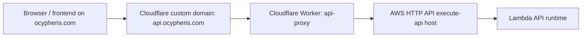

# Domain And DNS Configuration

This guide covers the live public API edge for AWS Security Autopilot and the optional AWS-managed custom-domain fallback.

## Current Production Shape

The live production API domain is `https://api.ocypheris.com`.

Current production traffic does not terminate on an AWS API Gateway custom domain. It is fronted by the checked-in Cloudflare Worker proxy at [cloudflare/api-proxy/wrangler.jsonc](/Users/marcomaher/AWS%20Security%20Autopilot/cloudflare/api-proxy/wrangler.jsonc), which forwards to the current AWS HTTP API execute-api origin.



## Live Restore Workflow

Use this path when the AWS runtime was recreated and `api.ocypheris.com` must be repointed to the new execute-api hostname.

1. Deploy or restore the AWS serverless runtime first.
2. Read the live HTTP API origin from the runtime stack outputs.
3. Update `UPSTREAM_API_BASE` in [cloudflare/api-proxy/wrangler.jsonc](/Users/marcomaher/AWS%20Security%20Autopilot/cloudflare/api-proxy/wrangler.jsonc).
4. Redeploy the Cloudflare Worker from `cloudflare/api-proxy/`.
5. Verify `https://api.ocypheris.com/health` and `https://api.ocypheris.com/ready`.

Current working example from the March 28, 2026 restore:

```jsonc
{
  "name": "api-proxy",
  "routes": [
    {
      "pattern": "api.ocypheris.com",
      "zone_name": "ocypheris.com",
      "custom_domain": true
    }
  ],
  "vars": {
    "UPSTREAM_API_BASE": "https://7ti19t61e6.execute-api.eu-north-1.amazonaws.com"
  }
}
```

Deploy command:

```bash
cd cloudflare/api-proxy
../../frontend/node_modules/.bin/wrangler deploy --config wrangler.jsonc
```

Validation commands:

```bash
curl -sS https://api.ocypheris.com/health
curl -sS https://api.ocypheris.com/ready
curl -I https://ocypheris.com
```

## Optional AWS-Managed Custom Domain Path

> ⚠️ Status: Implemented but not the current production path
> The runtime template still supports `ApiDomainName` plus `ApiCertificateArn`, but live `api.ocypheris.com` currently uses the Cloudflare Worker proxy instead.

If you intentionally want AWS to own the public API hostname instead of Cloudflare:

1. Request an ACM certificate in `eu-north-1` for the API domain.
2. Validate the ACM DNS record in your authoritative DNS provider.
3. Deploy the runtime with `ApiDomainName` and `ApiCertificateArn`.
4. Point DNS at the runtime stack output `ApiCustomDomainTarget`.

Example ACM request:

```bash
aws acm request-certificate \
  --domain-name api.ocypheris.com \
  --validation-method DNS \
  --region eu-north-1
```

Example API Gateway domain inspection:

```bash
aws apigatewayv2 get-domain-names --region eu-north-1
```

## Gotchas

- If `https://api.ocypheris.com` returns a Cloudflare `530` or `1016`, check [cloudflare/api-proxy/wrangler.jsonc](/Users/marcomaher/AWS%20Security%20Autopilot/cloudflare/api-proxy/wrangler.jsonc) first. In the current production design, that usually means the Worker proxy still points at a deleted execute-api hostname.
- `ApiPublicUrlOverride=https://api.ocypheris.com` is still the correct runtime setting even when AWS is not hosting the custom domain directly.
- `aws apigatewayv2 get-domain-names --region eu-north-1` returning no domains is valid in the current production setup.

## See Also

- [Deployment guide](/Users/marcomaher/AWS%20Security%20Autopilot/docs/deployment/README.md)
- [Secrets and configuration](/Users/marcomaher/AWS%20Security%20Autopilot/docs/deployment/secrets-config.md)
- [Infrastructure: ECS](/Users/marcomaher/AWS%20Security%20Autopilot/docs/deployment/infrastructure-ecs.md)
- [Audit-remediation deployer runbook](/Users/marcomaher/AWS%20Security%20Autopilot/docs/audit-remediation/deployer-runbook-phase1-phase3.md)
