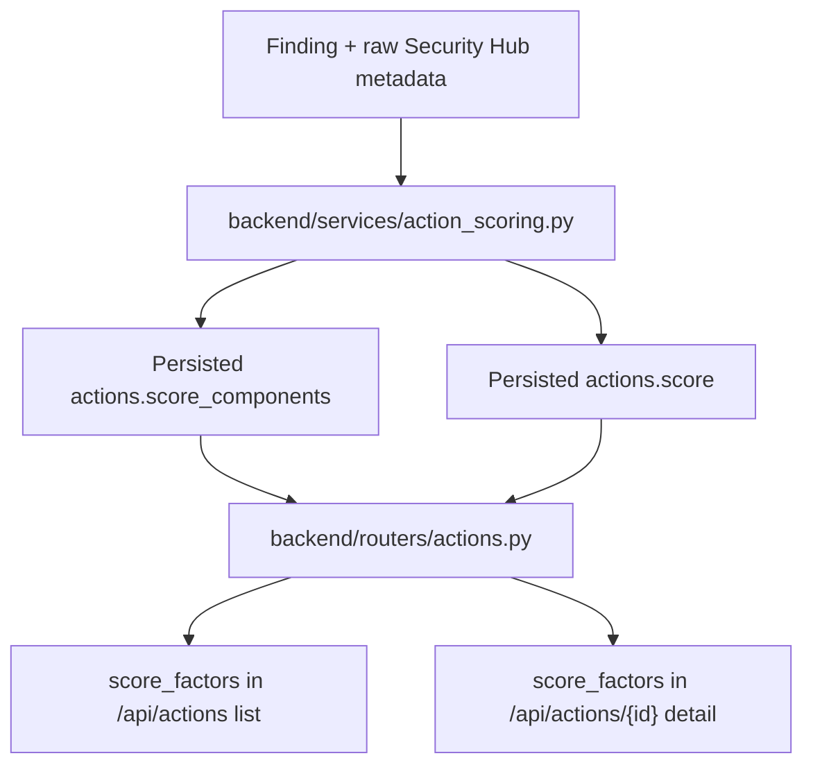

# Action Score Explainability

This feature makes prioritized action scores explainable in both human and machine terms.

Implemented source files:
- `backend/services/action_scoring.py`
- `backend/services/threat_intelligence.py`
- `backend/routers/actions.py`
- `frontend/src/lib/api.ts`

## What is returned

`GET /api/actions` and `GET /api/actions/{action_id}` now return:
- `score`: the persisted `0-100` action score.
- `score_components`: the existing normalized component payload from P0.1.
- `score_factors`: an auditor-readable factor list derived from `score_components`.
- `business_impact`: the additive Phase 3 P1.7 risk x criticality payload used for matrix placement and ranking.
- `context_incomplete` on action detail responses when toxic-combination promotion was withheld because relationship context was missing or low-confidence.

When toxic-combination prioritization is present in `score_components`, `score_factors` also includes a `toxic_combinations` entry with either:
- a positive additive boost, or
- a zero-point fail-closed explanation such as `context incomplete`, low-confidence relationship context, or missing required related signals.

When trusted exploit threat intel is present, `score_components["exploit_signals"]` also carries:
- bounded threat-intel point accounting
- `applied_threat_signals[]` provenance
- per-signal source, timestamp, confidence, and applied-point details

When trusted exploit threat intel is present, the `exploit_signals` score factor also includes additive `provenance[]` entries with:
- `source`
- `observed_at`
- `decay_applied`
- `base_contribution`
- `final_contribution`

Each `score_factors` entry includes:
- `factor_name`
- `weight`
- `contribution`
- `evidence_source`
- `signals`
- `explanation`
- `provenance`

The factor contributions always sum to the returned `score`. If an older action only has partial scoring metadata, the API falls back to a single legacy factor so the contract stays non-empty and internally consistent.

## Current factor weights

The current deterministic weights come directly from `backend/services/action_scoring.py`:

| Factor | Weight |
| --- | ---: |
| `severity` | `35` |
| `internet_exposure` | `20` |
| `privilege_level` | `15` |
| `data_sensitivity` | `15` |
| `exploit_signals` | `15` |
| `compensating_controls` | `15` |

`compensating_controls` contributes negative points when mitigating context is present.

`exploit_signals` can now include trusted threat-intel weighting, but it still caps at `15` total points. The threat-intel portion inside that factor currently caps at `10` points before remaining exploit-factor headroom is applied.

Threat-intel decay uses `ACTIONS_THREAT_INTELLIGENCE_HALF_LIFE_HOURS` and currently defaults to `72` hours.

`toxic_combinations` is additive and rule-based rather than normalized against the base weights above. Its contribution is capped separately by `ACTIONS_TOXIC_COMBINATION_MAX_BOOST`.

When `score_components["context_incomplete"]` is `true`, the returned score intentionally stays at `score_before_toxic_combinations` and the toxic-combination factor explains why no additive promotion was applied.

## Evidence model

Evidence is intentionally constrained to safe, explainable metadata:
- fixed evidence-source strings such as `finding.severity_label + finding.severity_normalized`
- bounded keyword/action signals already used by the scorer
- human-readable explanations generated from the stored score metadata

The API does not echo raw finding blobs, AWS credentials, tokens, or other secret-like values in `score_factors`.

Threat provenance is now exposed through both:
- `score_components["exploit_signals"]["applied_threat_signals"]` for the full stored exploit-factor metadata
- `score_factors[].provenance[]` for auditor-readable explainability on list/detail responses

## Batch list behavior

For `GET /api/actions?group_by=batch`, the batch item score still represents the highest member action score in that group. The returned `score_factors` come from that same highest-scoring representative action so the explanation matches the displayed score.

## Related docs

- [AWS Security Autopilot documentation index](/Users/marcomaher/AWS%20Security%20Autopilot/docs/README.md)
- [Baseline report spec](/Users/marcomaher/AWS%20Security%20Autopilot/docs/baseline-report-spec.md)
- [Business impact matrix](/Users/marcomaher/AWS%20Security%20Autopilot/docs/features/business-impact-matrix.md)
- [Threat-intelligence weighting](/Users/marcomaher/AWS%20Security%20Autopilot/docs/features/threat-intelligence-weighting.md)
- [Toxic-combination prioritization](/Users/marcomaher/AWS%20Security%20Autopilot/docs/features/toxic-combination-prioritization.md)
