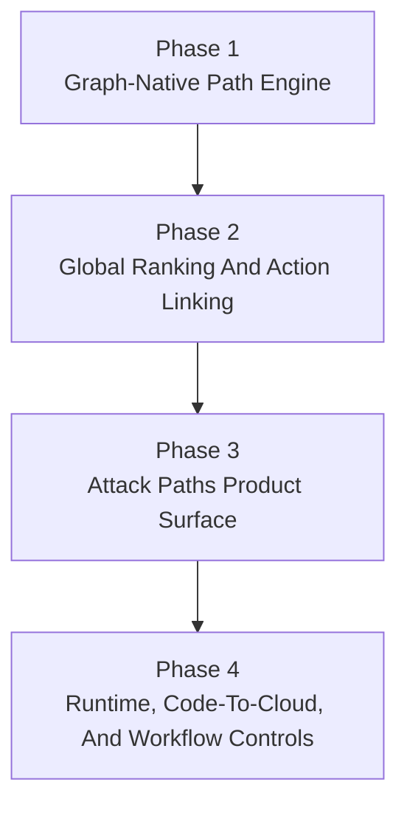

# Attack Path Enterprise Implementation Plan

> ⚠️ Status: Phases 1-3 implemented on March 21, 2026. Phase 4 bounded projection slice implemented on March 21, 2026; deeper graph/runtime enrichment remains follow-up work.

This document turns the current enterprise-grade Attack Path roadmap into `4 ordered phases` so implementation can proceed without relying on chat history.

The current repo state is:

- `P3.5.1` Attack Path View v1 is implemented as a bounded action-detail explainer
- the persisted security graph foundation exists
- `Phase 1` now computes `attack_path_view` from persisted `security_graph_nodes` / `security_graph_edges`
- `GET /api/actions/attack-paths` and the bounded `/attack-paths` page are now shipped as the early visible Phase-1 surface
- `graph_context` still remains on the existing conservative `finding_relationship_context+inventory_assets` builder
- remediation remains PR-only; customer `WriteRole` and `direct_fix` stay out of scope

The goal of this plan is to turn Attack Path from a bounded explanation widget into a graph-native prioritization and remediation workflow that meets an enterprise buyer bar while preserving the current fail-closed and PR-only safety posture.

## Phase 1 — Graph-Native Path Engine

### Goal

Replace the current explainer-only Attack Path source with a shared tenant-scoped engine that computes paths from persisted graph data instead of relying on `relationship_context` and bounded action-detail reuse.

### Status

Implemented on March 21, 2026.

### Implementation

- Add a backend attack-path service that reads from `security_graph_nodes` and `security_graph_edges` directly.
- Keep traversal bounded and deterministic:
  - max depth `6`
  - max returned paths per anchor `3`
  - max rendered nodes per path `10`
- Keep the current additive `attack_path_view` contract on `GET /api/actions/{id}`, but change its source to the new graph-native engine.
- Keep `graph_context` separate in this phase; only `attack_path_view` and `GET /api/actions/attack-paths` move to the graph-native engine.
- Preserve explicit states:
  - `available`
  - `partial`
  - `unavailable`
  - `context_incomplete`
- Reserve `context_incomplete` for true missing graph evidence, not for current action-detail contract gaps.
- Add a new additive API:
  - `GET /api/actions/attack-paths`
  - tenant-scoped ranked path summaries
  - filters for account, action, owner, resource, and status
- Pull a bounded visible UI slice forward:
  - standalone `/attack-paths`
  - action-detail deep links into `/attack-paths?action_id=...`

### Phase-1 API contract

`GET /api/actions/attack-paths` should return:

- `id`
- `status`
- `rank`
- `confidence`
- `entry_points[]`
- `target_assets[]`
- `summary`
- `business_impact_summary`
- `recommended_fix_summary`
- `owner_labels[]`
- `linked_action_ids[]`

### Done when

- the backend can compute attack paths from persisted graph tables
- `GET /api/actions/{id}` consumes graph-native attack-path context sourced from the persisted graph tables
- `GET /api/actions/attack-paths` returns stable tenant-scoped results
- `/attack-paths` renders the bounded Phase-1 list/detail workflow
- fail-closed behavior remains explicit for missing evidence

## Phase 2 — Global Path Ranking And Action Linking

### Goal

Make Attack Path useful for prioritization, not just visualization, and link reusable global paths back to individual actions.

### Implementation

- Add a path-ranking model that combines:
  - exploitability
  - internet reachability
  - effective privilege
  - reachable sensitive data
  - blast radius
  - business criticality
  - threat-intelligence signals
  - compensating controls
  - freshness/confidence penalties
- Keep the existing action score as the top-level action backlog rank.
- Make attack-path rank an additive prioritization lens, not a replacement scoring system.
- Add path-to-action linking so the same path can explain multiple related actions.
- Extend `GET /api/actions/{id}` to include:
  - `path_id`
  - graph-native `attack_path_view`
- Add `GET /api/actions/attack-paths/{id}` for full path detail.

### Phase-2 API contract

`GET /api/actions/attack-paths/{id}` should return:

- `id`
- `status`
- `rank`
- `rank_factors[]`
- `confidence`
- `freshness`
- `path_nodes[]`
- `path_edges[]`
- `entry_points[]`
- `target_assets[]`
- `business_impact`
- `risk_reasons[]`
- `owners[]`
- `recommended_fix`
- `linked_actions[]`
- `evidence[]`
- `provenance[]`
- `truncated`
- `availability_reason`

### Done when

- the same risky chain can be linked to multiple actions without recomputing it per action
- ranked paths are explainable and deterministic
- action detail can deep-link into a global path record
- `/attack-paths?path_id=<id>` resolves the same shared record as `GET /api/actions/{id}.path_id`
- live validation is still expected before Phase 2 is treated as fully closed because ranking semantics and a user-facing prioritization surface changed

## Phase 3 — Enterprise Product Surface v2

### Goal

Promote the already-shipped bounded Attack Paths surface from an early visible slice into a first-class triage and remediation workflow.

### Status

Implemented on March 21, 2026.

### Implementation

- Treat the existing `/attack-paths` page as the Phase-3 foundation instead of rebuilding a second entry point.
- Keep the current bounded action-detail render as a projection of the shared path engine and make the `/attack-paths` surface the primary shared-path workflow.
- Expand the frontend surface to provide:
  - ranked path list
  - tenant/account/owner/resource filters
  - saved bounded views for common triage modes
  - rank-factor and availability-state visibility in the list, not only in detail
  - path detail drilldown
  - linked actions
  - owner and remediation context
  - evidence/provenance visibility
  - direct handoff into existing PR-bundle and execution-guidance surfaces
- Add additive API support only where the current bounded Phase-2 contracts are not enough:
  - filter presets / saved-view metadata
  - owner-queue summaries derived from linked actions
  - remediation-state rollups for linked actions on a path
- Keep action score as the top-level action backlog rank and attack-path rank as the path-surface lens.
- Keep the UX bounded and triage-focused.
- Do not build a free-form graph explorer in this phase.

### Required product behaviors

- security users can answer “what matters most right now?”
- engineering users can answer “what do I own and how do I fix it?”
- path detail can link directly to existing PR-bundle/remediation guidance
- security and engineering users can move between shared path detail and linked actions without losing context or seeing inconsistent rank/explanation data

### Delivery slices

- `P3.1` Triage workflow hardening
  - stabilize ranked list states, empty states, and partial/context-incomplete handling on `/attack-paths`
  - make list and detail share the same rank, confidence, freshness, and evidence language
- `P3.2` Operator views
  - add saved bounded views such as `Highest blast radius`, `Business critical`, `Actively exploited`, and `Owned by my team`
  - keep views tenant-scoped and additive; no second reporting model
- `P3.3` Owner/remediation workflow
  - show linked-action rollout state, owner labels, recommended fix summary, and direct remediation entry points from path detail
  - surface the exact linked actions that must close before the path risk can materially drop
- `P3.4` Evidence and closure projection
  - expose provenance/evidence more clearly in detail
  - show bounded closure signals from linked actions and remediation runs without introducing path-level mutation workflows

### Done when

- `/attack-paths` works as a bounded daily triage surface instead of only an early technical preview
- action detail and path detail stay consistent because they share the same path records
- security users can sort into meaningful saved views without switching to a second dashboard
- engineering users can identify owned linked actions and jump directly into the current PR-only remediation workflow
- path detail exposes enough evidence and provenance to support operator trust and reviewer discussion
- the new surface works without introducing a second risk model

## Phase 4 — Runtime, Code-To-Cloud, And Enterprise Workflow Controls

### Goal

Add the enrichment and workflow controls that make the feature feel enterprise-grade against platforms like Wiz.

### Status

Initial bounded implementation landed on March 21, 2026.

### Implementation

- Expand the graph with first-class node and edge types for:
  - network boundaries
  - public entry points
  - workloads
  - secrets
  - data stores
  - repos
  - deployments
  - ownership mappings
- Add runtime and exploit validation signals:
  - active workload/runtime presence
  - observed exposure/reachability
  - threat-intelligence and exploit-feed linkage
  - freshness timestamps and decay
- Add code-to-cloud linkage:
  - repo
  - root path
  - service/team owner
  - linked remediation artifact or PR bundle
- Add enterprise workflow/governance:
  - saved views
  - owner queues
  - ticket integration hooks
  - exception governance on a path level
  - evidence export
  - tenant-scoped RBAC/export controls

### Scope boundaries

- runtime signals are additive and explainable, not required for path existence
- remediation remains PR-only
- customer `WriteRole` and `direct_fix` stay out of scope
- graph views remain bounded and tenant-scoped

### Landed bounded slice

- shared-path list/detail now project additive runtime truth summaries from the existing persisted graph inputs
- shared-path detail now projects code-to-cloud linkage from existing repo-aware PR automation and remediation handoff artifacts
- shared-path detail now projects workflow/governance state from existing owner queues, integration sync state, exceptions, and evidence metadata
- `/attack-paths` renders bounded Runtime truth, Code to cloud, and Workflow controls sections without introducing a new explorer or path-level mutation workflow

### Remaining follow-up work

- deeper graph taxonomy expansion for new first-class node/edge families
- independent runtime observation sources beyond current persisted graph/action/remediation evidence
- stricter RBAC/evidence masking beyond the current tenant-scoped full-visibility contract
- path-level exports or durable preference persistence if those become necessary

### Done when

- each high-priority path can show:
  - why it matters
  - who owns it
  - what code or infrastructure change closes it
  - what evidence proves closure
- enterprise reviewers can treat Attack Path as a prioritization and remediation workflow, not just an explainer widget

## Recommended Delivery Order

Recommended implementation order:

1. Phase 1
2. Phase 2
3. Phase 3
4. Phase 4

## Acceptance Summary

This plan is complete only when:

- Attack Path is computed generally once from shared graph data, not re-derived independently per action
- actions consume linked path records as bounded projections
- ranked paths can drive prioritization and owner workflow
- path detail can terminate in concrete PR-only remediation guidance and closure evidence

## Related docs

- [Attack Path view](/Users/marcomaher/AWS%20Security%20Autopilot/docs/features/attack-path-view.md)
- [Security Graph foundation](/Users/marcomaher/AWS%20Security%20Autopilot/docs/features/security-graph-foundation.md)
- [Graph-backed action context](/Users/marcomaher/AWS%20Security%20Autopilot/docs/features/graph-backed-action-context.md)
- [Phase 3.5 roadmap](/Users/marcomaher/AWS%20Security%20Autopilot/docs/features/phase-3-5-roadmap.md)
