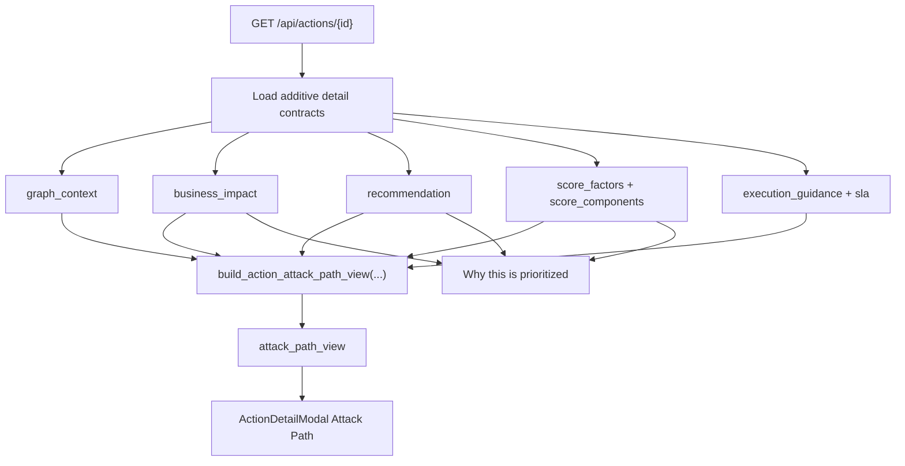

# Attack Path View

Implemented in Phase 3.5.1.

This feature turns `GET /api/actions/{id}` into a bounded attack story that explains how an attacker gets in, what they can reach, why the action is urgent, and what the safest next step is without introducing a free-form graph explorer or a second scoring system.

Implemented source files:
- `backend/services/action_attack_path_view.py`
- `backend/routers/actions.py`
- `frontend/src/lib/api.ts`
- `frontend/src/components/ActionDetailModal.tsx`
- `tests/test_phase3_p3_5_1_attack_path_view.py`
- `frontend/src/components/ActionDetailModal.test.tsx`

## API contract

`GET /api/actions/{id}` now includes additive `attack_path_view`.

Payload shape:

- `status`
  - `available`
  - `partial`
  - `unavailable`
  - `context_incomplete`
- `summary`
- `path_nodes[]`
- `path_edges[]`
- `entry_points[]`
- `target_assets[]`
- `business_impact_summary`
- `risk_reasons[]`
- `recommendation_summary`
- `confidence`
- `truncated`
- `availability_reason`

Current `path_nodes[].kind` values:

- `entry_point`
- `identity`
- `target_asset`
- `business_impact`
- `next_step`

Current `availability_reason` values:

- `relationship_context_unavailable`
- `relationship_context_incomplete`
- `bounded_context_truncated`
- `entry_point_unresolved`
- `target_assets_unresolved`
- `partial_attack_story`

## Source-of-truth reuse

The view is additive and reuses existing contracts only:

- `graph_context`
- `business_impact`
- `recommendation`
- `score_factors`
- `score_components`
- `execution_guidance`
- `sla`
- owner metadata already present on the action

No new risk score, business-criticality model, or unbounded graph query path is introduced.

## State semantics

### `available`

- bounded graph context exists
- a concrete entry point and target asset can be shown
- no truncation was required

### `partial`

- the story can still be shown, but some context was intentionally capped or could not be resolved inside the bounded slice
- `truncated=true` when the bounded graph input hit its existing caps

### `unavailable`

- the graph-backed attack story cannot be rendered from the bounded detail inputs
- the field still returns a stable explicit fallback payload instead of disappearing

### `context_incomplete`

- the action already carries explicit fail-closed context markers from the existing prioritization pipeline
- the API avoids implying a concrete attack path and returns empty `path_nodes[]` / `path_edges[]`

## Bounded model

The path view is built from the already-bounded action-detail neighborhood exposed by [Graph-backed action context](/Users/marcomaher/AWS%20Security%20Autopilot/docs/features/graph-backed-action-context.md).

It does not traverse beyond the existing detail caps:

- `max_related_findings = 24`
- `max_related_actions = 24`
- `max_inventory_assets = 24`
- `max_connected_assets = 6`
- `max_identity_nodes = 6`
- `max_blast_radius_neighbors = 6`

## Render flow

## UI behavior

`frontend/src/components/ActionDetailModal.tsx` now renders:

- an `Attack Path` section with a bounded horizontal path
- explicit badges for:
  - `Actively exploited`
  - `Business critical`
  - `Context incomplete`
- a `Why this is prioritized` panel that surfaces:
  - score-factor explanations
  - business-impact reasons
  - threat-intel reasons
  - recommendation rationale

Existing business-impact, score-explainability, threat-intel provenance, graph-context, and implementation-artifact sections remain in place.

## Limitations

- The path is intentionally single-story and bounded; it is not a tenant-wide graph explorer.
- `context_incomplete` remains fail-closed and returns no visual path nodes.
- The current confidence value is derived from the existing relationship-context confidence and bounded-state handling, not from a new scoring system.
- The view prefers the recommended execution-guidance entry when present; otherwise it falls back to the existing recommendation mode/rationale.

## Related docs

- [Graph-backed action context](/Users/marcomaher/AWS%20Security%20Autopilot/docs/features/graph-backed-action-context.md)
- [Security Graph foundation](/Users/marcomaher/AWS%20Security%20Autopilot/docs/features/security-graph-foundation.md)
- [Business impact matrix](/Users/marcomaher/AWS%20Security%20Autopilot/docs/features/business-impact-matrix.md)
- [Recommendation mode matrix](/Users/marcomaher/AWS%20Security%20Autopilot/docs/features/recommendation-mode-matrix.md)
- [Threat-intelligence weighting](/Users/marcomaher/AWS%20Security%20Autopilot/docs/features/threat-intelligence-weighting.md)
- [AWS Security Autopilot documentation index](/Users/marcomaher/AWS%20Security%20Autopilot/docs/README.md)
