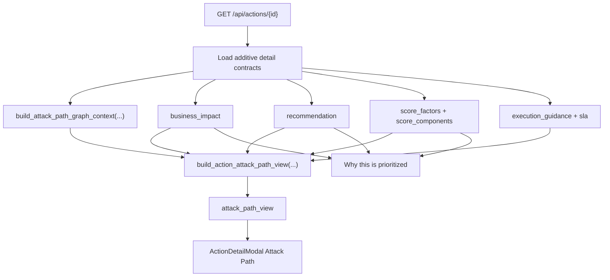

# Attack Path View

Implemented in Phase 3.5.1, extended in Attack Path Phase 1 on March 21, 2026, extended again in Attack Path Phase 2 on March 21, 2026, promoted into the bounded Phase 3 triage workflow on March 21, 2026, extended with bounded Phase 4 runtime/code-to-cloud/workflow projections on March 21, 2026, and moved onto a materialized production-readiness read model on March 22, 2026.

This feature turns `GET /api/actions/{id}` into a bounded attack story that explains how an attacker gets in, what they can reach, why the action is urgent, and what the safest next step is without introducing a free-form graph explorer or a second scoring system.

Implemented source files:
- `backend/services/attack_paths.py`
- `backend/services/attack_path_materialized.py`
- `backend/services/action_attack_path_view.py`
- `backend/routers/actions.py`
- `backend/models/attack_path_materialized_summary.py`
- `backend/models/attack_path_materialized_detail.py`
- `backend/models/attack_path_materialized_membership.py`
- `backend/workers/jobs/attack_path_materialization.py`
- `scripts/rebuild_attack_path_materializations.py`
- `alembic/versions/0046_attack_path_materialized_read_model.py`
- `frontend/src/lib/api.ts`
- `frontend/src/app/attack-paths/page.tsx`
- `frontend/src/components/ActionDetailModal.tsx`
- `tests/test_phase3_p3_5_1_attack_path_view.py`
- `frontend/src/app/attack-paths/page.test.tsx`
- `frontend/src/components/ActionDetailModal.test.tsx`

## API contract

`GET /api/actions/{id}` now includes additive `attack_path_view`.

`GET /api/actions/attack-paths` now returns tenant-scoped ranked path summaries for the bounded `/attack-paths` page.

`GET /api/actions/attack-paths/{id}` now returns the bounded shared-path detail payload for `/attack-paths?path_id=<id>`.

`GET /api/actions/{id}` now also includes additive `path_id` so action detail can deep-link to the same shared record.

Payload shape:

- `status`
  - `available`
  - `partial`
  - `unavailable`
  - `context_incomplete`
- `summary`
- `path_nodes[]`
- `path_edges[]`
- `entry_points[]`
- `target_assets[]`
- `business_impact_summary`
- `risk_reasons[]`
- `recommendation_summary`
- `confidence`
- `truncated`
- `availability_reason`

Shared path list/detail adds:

- `path_id`
- `rank_factors[]`
- `freshness`
- `owners[]`
- `linked_actions[]`
- `evidence[]`
- `provenance[]`
- `remediation_summary`

Phase 3 list metadata adds:

- `selected_view`
- `available_views[]`

Production-readiness metadata now adds:

- `computed_at`
- `stale_after`
- `is_stale`
- `refresh_status` on shared-path detail

Current `path_nodes[].kind` values:

- `entry_point`
- `identity`
- `target_asset`
- `business_impact`
- `next_step`

Current `availability_reason` values:

- `relationship_context_unavailable`
- `relationship_context_incomplete`
- `bounded_context_truncated`
- `entry_point_unresolved`
- `target_assets_unresolved`
- `partial_attack_story`

## Source-of-truth reuse

The action-detail view now uses a graph-native attack-path context sourced from persisted `security_graph_nodes` / `security_graph_edges`, then reuses the existing additive detail contracts for:

- `business_impact`
- `recommendation`
- `score_factors`
- `score_components`
- `execution_guidance`
- `sla`
- owner metadata already present on the action

The separate `graph_context` response remains on the older `finding_relationship_context+inventory_assets` builder in this phase.

No new risk score, business-criticality model, or unbounded graph query path is introduced.

## State semantics

### `available`

- bounded graph context exists
- a concrete entry point and target asset can be shown
- no truncation was required

### `partial`

- the story can still be shown, but some context was intentionally capped or could not be resolved inside the bounded slice
- `truncated=true` when the bounded graph input hit its existing caps

### `unavailable`

- the graph-backed attack story cannot be rendered from the bounded detail inputs
- the field still returns a stable explicit fallback payload instead of disappearing

### `context_incomplete`

- persisted `relationship_context` for the action is missing or below the minimum confidence threshold
- the API avoids implying a concrete attack path and returns empty `path_nodes[]` / `path_edges[]`

## Bounded model

The path view now traverses the persisted security graph directly for attack-path-specific context, but it remains bounded:

- `max depth = 6`
- `max returned paths per anchor = 3`
- `max rendered nodes per path = 10`

## Render flow

## UI behavior

`frontend/src/components/ActionDetailModal.tsx` now renders:

- an `Attack Path` section with a bounded horizontal path
- explicit badges for:
  - `Actively exploited`
  - `Business critical`
  - `Context incomplete`
- a `Why this is prioritized` panel that surfaces:
  - score-factor explanations
  - business-impact reasons
  - threat-intel reasons
  - recommendation rationale

Existing business-impact, score-explainability, threat-intel provenance, graph-context, and implementation-artifact sections remain in place.

The same graph-native attack-path source now also powers the bounded `/attack-paths` page and action-detail deep links into that page.

Phase 2 formalizes reusable global path records:

- one risky chain can explain multiple linked actions
- action score still remains the main `/api/actions` backlog order
- attack-path rank is a separate prioritization lens on the Attack Paths surface
- rank stays explainable through `rank_factors[]` instead of opaque weights

Phase 3 promotes that bounded surface into a daily workflow:

- preset bounded views such as `Highest blast radius`, `Business critical`, `Actively exploited`, and `Owned by my team`
- linked-action remediation rollups in both list and detail
- stronger freshness, evidence, provenance, and owner/remediation projection on shared-path detail

Phase 4 adds bounded enterprise projections on the same shared path records:

- `runtime_signals` and `exposure_validation`
- `code_context`, `linked_repositories`, and `implementation_artifacts`
- `closure_targets`, `external_workflow_summary`, `exception_summary`, `evidence_exports`, and `access_scope`

The production-readiness optimization moves shared-path list/detail reads onto a tenant-scoped materialized read model:

- `attack_path_materialized_summaries`
- `attack_path_materialized_details`
- `attack_path_materialized_memberships`

Refresh is now background-oriented and additive:

- compute-actions and remediation-sync workers enqueue attack-path refresh work
- stale shared-path reads can enqueue a bounded refresh while continuing to serve the last persisted record
- operators can rebuild one tenant/account/region scope with `scripts/rebuild_attack_path_materializations.py`

## Limitations

- The path is intentionally single-story and bounded; it is not a tenant-wide graph explorer.
- `context_incomplete` remains fail-closed and returns no visual path nodes when relationship context itself is missing or low-confidence.
- Toxic-combination scorer flags for account-scoped ineligibility do not, by themselves, force attack-path fallback when the persisted relationship context is complete.
- The current confidence value is derived from the existing relationship-context confidence and bounded-state handling, not from a new scoring system.
- The view prefers the recommended execution-guidance entry when present; otherwise it falls back to the existing recommendation mode/rationale.
- Shared-path list/detail reads now prefer the materialized read model instead of rebuilding graph grouping on every request.
- A bounded legacy fallback still exists for first-run or bootstrap-miss cases so the feature fails closed without dropping the route.
- Phase 3 preset views are bounded filters on the shared-path list route; they are not a second dashboard or a free-form explorer.
- Phase 4 currently projects runtime/code-to-cloud/governance state from existing graph, remediation, sync, and exception sources; it does not yet add a separate runtime collector or a broader graph persistence model.

## Related docs

- [Graph-backed action context](/Users/marcomaher/AWS%20Security%20Autopilot/docs/features/graph-backed-action-context.md)
- [Security Graph foundation](/Users/marcomaher/AWS%20Security%20Autopilot/docs/features/security-graph-foundation.md)
- [Business impact matrix](/Users/marcomaher/AWS%20Security%20Autopilot/docs/features/business-impact-matrix.md)
- [Recommendation mode matrix](/Users/marcomaher/AWS%20Security%20Autopilot/docs/features/recommendation-mode-matrix.md)
- [Threat-intelligence weighting](/Users/marcomaher/AWS%20Security%20Autopilot/docs/features/threat-intelligence-weighting.md)
- [AWS Security Autopilot documentation index](/Users/marcomaher/AWS%20Security%20Autopilot/docs/README.md)
