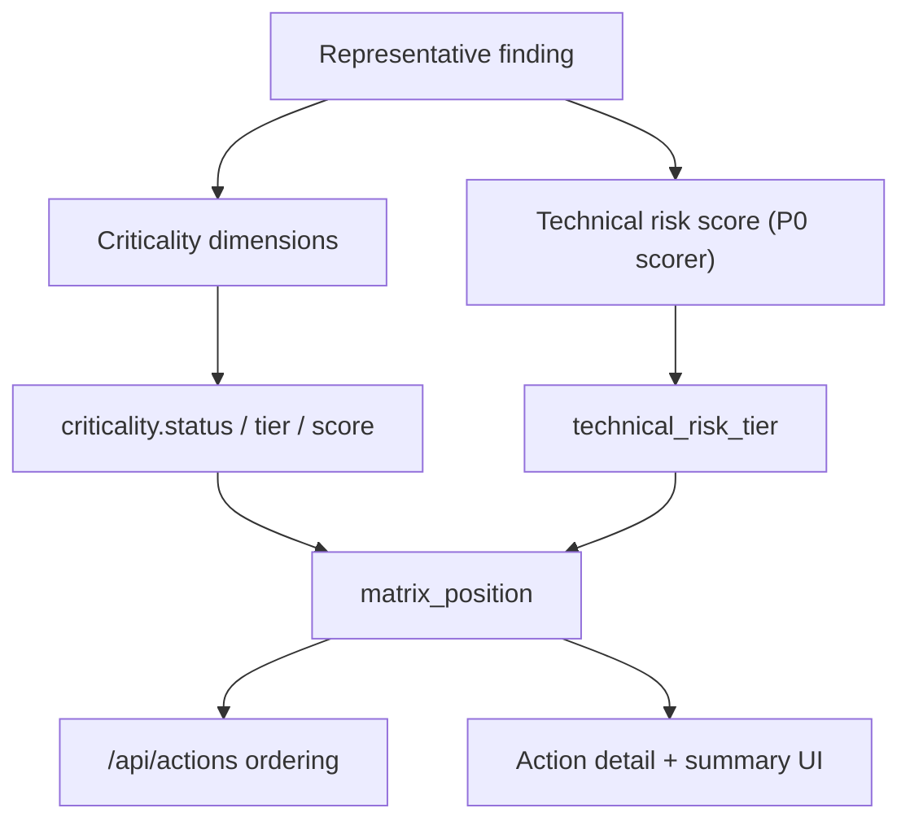

# Business Impact Matrix

Implemented in Phase 3 P1.7.

This feature adds an explicit `risk x criticality` matrix for actions so the platform can rank technically similar issues differently when the business context is materially different.

Implemented source files:
- `backend/services/action_business_impact.py`
- `backend/services/action_engine.py`
- `backend/services/toxic_combinations.py`
- `backend/routers/actions.py`
- `frontend/src/lib/api.ts`
- `frontend/src/components/ActionDetailDrawer.tsx`
- `frontend/src/app/pr-bundles/create/page.tsx`
- `frontend/src/app/pr-bundles/create/summary/page.tsx`

## API contract

`GET /api/actions` and `GET /api/actions/{action_id}` now return additive `business_impact` payloads:

- `technical_risk_score`
- `technical_risk_tier`
- `criticality`
- `matrix_position`
- `summary`

`criticality` includes:

- `status`
- `score`
- `tier`
- `weight`
- `dimensions[]`
- `explanation`

`matrix_position` includes:

- `row`
- `column`
- `cell`
- `risk_weight`
- `criticality_weight`
- `rank`
- `explanation`

Each criticality dimension entry includes:

- `dimension`
- `label`
- `weight`
- `matched`
- `contribution`
- `signals`
- `explanation`

## Criticality model

The current deterministic criticality model uses bounded heuristics only.

| Dimension | Weight | Evidence model |
| --- | ---: | --- |
| `customer_facing` | `25` | bounded keywords such as `customer portal`, `external api`, `website` |
| `revenue_path` | `25` | bounded keywords such as `billing`, `checkout`, `payment`, `subscription` |
| `regulated_data` | `25` | bounded keywords and action hints such as `pci`, `phi`, `pii`, `s3_bucket_encryption_kms` |
| `identity_boundary` | `15` | bounded identity/resource hints such as `AwsAccount`, `AwsIamRole`, `root user`, `assume role` |
| `production_environment` | `10` | bounded production tokens such as `production`, `prod-`, `-prod`, `live` |

Single-signal matches contribute `60%` of the dimension weight. Multiple signals contribute the full dimension weight.

Criticality tiers:

| Score | Tier |
| ---: | --- |
| `70+` | `critical` |
| `40-69` | `high` |
| `1-39` | `medium` |
| `0` | `unknown` |

## Matrix placement

Technical risk still comes from the existing P0 scoring model described in [Action score explainability](/Users/marcomaher/AWS%20Security%20Autopilot/docs/features/action-score-explainability.md).

Risk tiers:

| Score | Tier |
| ---: | --- |
| `85+` | `critical` |
| `65-84` | `high` |
| `40-64` | `medium` |
| `0-39` | `low` |

Matrix rank is deterministic and ordered by:

1. matrix row weight (`critical` > `high` > `medium` > `low`)
2. matrix column weight (`critical` > `high` > `medium` > `unknown`)
3. technical risk score
4. existing stable tie-breakers (`updated_at`, `id`)

This means business criticality can rerank actions with the same technical score without hiding the raw score itself.

## Missing criticality handling

Missing criticality is explicit, not silently defaulted.

When no criticality signals are found:

- `criticality.status = "unknown"`
- `criticality.tier = "unknown"`
- `matrix_position.column = "unknown"`
- `summary` explicitly says the action has unknown criticality

The action still receives a deterministic matrix cell and rank because technical risk remains known.

## UI surfaces

The matrix payload is currently surfaced in:

- action detail drawer
- PR bundle action selection list
- PR bundle summary view

The action detail drawer shows:

- matrix cell
- technical risk tier and score
- criticality tier and score
- matched criticality signals

The PR bundle selection and summary tables show condensed matrix labels so operators can see business context before selecting or batching work.

## Validation

- [P1.7 tests](/Users/marcomaher/AWS%20Security%20Autopilot/tests/test_phase3_p1_7_business_impact_matrix.py)
- `pytest tests/test_phase3_p1_7_business_impact_matrix.py -q`
- `pytest -q`

## Related docs

- [Action score explainability](/Users/marcomaher/AWS%20Security%20Autopilot/docs/features/action-score-explainability.md)
- [Recommendation mode matrix](/Users/marcomaher/AWS%20Security%20Autopilot/docs/features/recommendation-mode-matrix.md)
- [AWS Security Autopilot documentation index](/Users/marcomaher/AWS%20Security%20Autopilot/docs/README.md)
