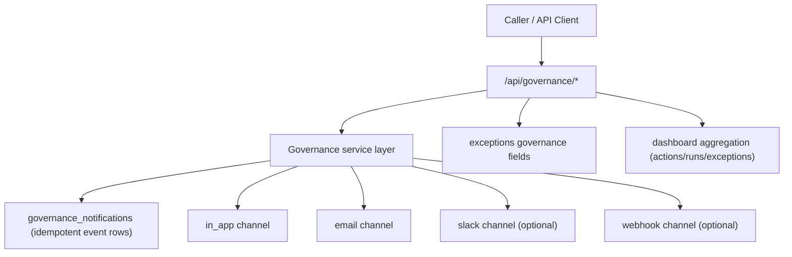

# Communication + Governance Layer

This feature adds a tenant-scoped communication and exception-governance layer with idempotent delivery, fail-closed behavior, and dashboard aggregation.

## Scope implemented

### Notifications

Stages:
- `pre_change`
- `in_progress`
- `action_required`
- `completion`

Channels:
- `in_app`
- `email`
- optional `slack` (if Slack webhook + Slack digest toggle are configured)
- optional `webhook` (if governance webhook is configured)

Delivery contract:
- Idempotent dedupe key per `(tenant_id, target_type, target_id, stage, idempotency_key, channel)`.
- Fail-closed dispatch: delivery errors mark row as `failed` and return `503` to callers.
- Secret-safe persistence/logging: payload redaction and masked webhook logging.

### Exception governance

Added metadata on `exceptions`:
- `owner_user_id`
- `approval_metadata`
- `reminder_interval_days`, `next_reminder_at`, `last_reminded_at`
- `revalidation_interval_days`, `next_revalidation_at`, `last_revalidated_at`

Lifecycle states (computed):
- `active`
- `expiring`
- `action_required`
- `expired`

Reminder dispatch:
- `POST /api/governance/exceptions/reminders/dispatch`
- Processes due reminder/revalidation/expired exceptions per tenant.
- Uses idempotent notification keys and schedule advancement.

### Dashboard

Endpoint:
- `GET /api/governance/dashboard`

Returns:
- run states by tenant
- run states by account
- open exception counts (`open_total`, `action_required`, `expiring`)
- SLA breach list for active remediation runs older than threshold
- compliance closure trend buckets per day

## API surface

Router:
- `backend/routers/governance.py`

Endpoints:
- `POST /api/governance/remediation-runs/{run_id}/notifications`
- `PATCH /api/governance/exceptions/{exception_id}`
- `POST /api/governance/exceptions/{exception_id}/revalidate`
- `POST /api/governance/exceptions/reminders/dispatch`
- `GET /api/governance/notifications`
- `GET /api/governance/dashboard`

Contract headers:
- `Idempotency-Key` required for mutating governance endpoints.
- Optional contract/version headers:
  - `X-Correlation-Id`
  - `X-Governance-Contract-Version`

## Settings

Feature flags and tunables in `backend/config.py`:
- `COMMUNICATION_GOVERNANCE_ENABLED` (default `false`)
- `COMMUNICATION_GOVERNANCE_DEFAULT_REMINDER_INTERVAL_DAYS` (default `7`)
- `COMMUNICATION_GOVERNANCE_DEFAULT_REVALIDATION_INTERVAL_DAYS` (default `30`)
- `COMMUNICATION_GOVERNANCE_SLA_BREACH_MINUTES` (default `120`)
- `COMMUNICATION_GOVERNANCE_REMINDER_BATCH_LIMIT` (default `100`)

Tenant settings:
- `governance_notifications_enabled`
- `governance_webhook_url`

User settings endpoints:
- `GET /api/users/me/governance-settings`
- `PATCH /api/users/me/governance-settings`

## Data model

Additive migration:
- `alembic/versions/0037_communication_governance_layer.py`

New table:
- `governance_notifications`

Updated tables:
- `exceptions`
- `tenants`

## Related docs

- [Root-key remediation lifecycle UI](/Users/marcomaher/AWS%20Security%20Autopilot/docs/features/root-key-remediation-lifecycle-ui.md)
- [Weekly digest + Slack settings context](/Users/marcomaher/AWS%20Security%20Autopilot/docs/CHANGELOG.md)
