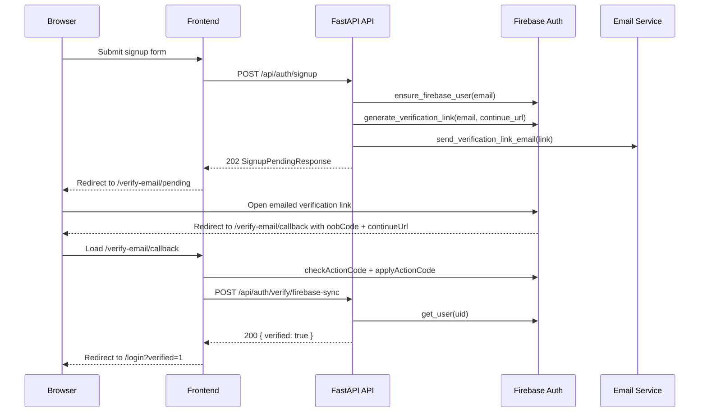

# Firebase Email Verification Signup Flow

Firebase now acts as the email-verification authority for signup. App sessions, tenant records, user records, JWT cookies, and password reset/change flows stay local to AWS Security Autopilot.

## Current Status

- Implemented: `POST /api/auth/signup` now returns a pending-verification response when Firebase is enabled.
- Implemented: `/verify-email/pending` and `/verify-email/callback` handle the frontend verification journey.
- Implemented: `POST /api/auth/login` fails closed when Firebase verification cannot be confirmed for an unverified user.
- Implemented: local development and live `https://ocypheris.com` now both point at the Firebase project `aws-security-autopilot`.
- Implemented: the serverless deploy path now wires `EMAIL_FROM`, `EMAIL_SMTP_HOST`, `EMAIL_SMTP_PORT`, `EMAIL_SMTP_STARTTLS`, and SMTP credentials from Secrets Manager into the Lambda runtime.
- Implemented: signup and resend now fail closed with `503 verification_email_delivery_unavailable` when non-local verification-email delivery cannot happen.
- Blocked in live production: as of `2026-03-11`, the deployed `security-autopilot-dev-api` runtime is wired to SES SMTP in `eu-north-1` (`EMAIL_FROM=noreply@ocypheris.com`, `EMAIL_SMTP_HOST=email-smtp.eu-north-1.amazonaws.com`, port `587`, STARTTLS `true`, and Secrets Manager credentials). The sandbox recipient `marcoibrahim11@outlook.com` is now verified in SES, but the sender domain `ocypheris.com` still has not been re-polled by AWS, so it remains `VerificationStatus=PENDING`, the SES production-access review is still `DENIED`, and a fresh `aws sesv2 put-account-details --production-access-enabled` attempt currently fails with `ConflictException`.

> ⚠️ Status: Planned — phone verification is no longer part of signup. The remaining follow-up is to require verified phone ownership before MFA enrollment and future sensitive actions.
> ❓ Needs verification: After SES rechecks the published DKIM records for `ocypheris.com` and the sender identity moves to `SUCCESS`, rerun a real resend/signup flow to confirm inbox delivery, callback completion, and the final redirect to `/login?verified=1`.

## Flow



## Backend Contract

### Signup

- `POST /api/auth/signup`
  - When `FIREBASE_PROJECT_ID` is set:
    - returns `202`
    - body: `{ "message": "...", "email": "<user email>" }`
    - does not issue auth cookies
    - returns `503 { "detail": "verification_email_delivery_unavailable" }` when SMTP delivery is unavailable or the send attempt fails
  - When `FIREBASE_PROJECT_ID` is unset:
    - keeps the legacy local-dev `201 AuthResponse` auto-login path

### Verification sync + resend

- `POST /api/auth/verify/firebase-sync`
  - unauthenticated
  - body: `{ "email": "<user email>", "sync_token": "<one-time token>" }`
  - returns `200 { "verified": true }` after Firebase confirms `email_verified=true`
- `POST /api/auth/verify/resend`
  - unauthenticated
  - body: `{ "email": "<user email>" }`
  - rate limit: 3 attempts per email per 10 minutes
  - returns generic `200` for non-existent or already-verified users
  - returns `503 { "detail": "verification_email_delivery_unavailable" }` when non-local email delivery is unavailable or the resend send attempt fails

### Login

- `POST /api/auth/login`
  - returns `403 email_verification_required` when the password is valid but email verification is still incomplete
  - returns `503 email_verification_check_unavailable` when Firebase cannot be checked for an unverified user
  - caches the verified result locally by setting `users.email_verified=true` and `users.email_verified_at`

### Legacy authenticated verification endpoints

- `POST /api/auth/verify/send`
- `POST /api/auth/verify/confirm`

Email mode on both endpoints now returns `400` and points callers to `POST /api/auth/verify/resend`. Phone mode is unchanged.

## Required Environment Variables

### Backend

Add these to [`docs/local-dev/environment.md`](/Users/marcomaher/AWS%20Security%20Autopilot/docs/local-dev/environment.md) service env files when you want Firebase-backed signup enabled:

```bash
FIREBASE_PROJECT_ID="<YOUR_VALUE_HERE>"
FIREBASE_SERVICE_ACCOUNT_JSON=""
FIREBASE_SERVICE_ACCOUNT_PATH="<YOUR_VALUE_HERE>"
FIREBASE_EMAIL_CONTINUE_URL_BASE="<YOUR_VALUE_HERE>"
```

Notes:

- Keep exactly one credential source populated: `FIREBASE_SERVICE_ACCOUNT_JSON` or `FIREBASE_SERVICE_ACCOUNT_PATH`.
- `FIREBASE_EMAIL_CONTINUE_URL_BASE` must be the public frontend origin, for example `http://localhost:3000` or `https://ocypheris.com`.
- Leave `FIREBASE_PROJECT_ID` unset to preserve the legacy local auto-login path.
- The live serverless deployment currently uses the file-path mode, not inline JSON:
  - repo build context file: `backend/.firebase/firebase-service-account.json`
  - runtime env value: `FIREBASE_SERVICE_ACCOUNT_PATH=/var/task/backend/.firebase/firebase-service-account.json`
  - runtime env value: `FIREBASE_SERVICE_ACCOUNT_JSON=""`
- The inline JSON mode was removed from the live Lambda path because `UpdateFunctionConfiguration` failed once the environment payload exceeded AWS Lambda's `5120` byte limit.

### Frontend

```bash
NEXT_PUBLIC_FIREBASE_API_KEY="<YOUR_VALUE_HERE>"
NEXT_PUBLIC_FIREBASE_AUTH_DOMAIN="<YOUR_VALUE_HERE>"
NEXT_PUBLIC_FIREBASE_PROJECT_ID="<YOUR_VALUE_HERE>"
NEXT_PUBLIC_FIREBASE_APP_ID="<YOUR_VALUE_HERE>"
```

The checked-in production frontend values currently map to:

- `NEXT_PUBLIC_API_URL=https://api.ocypheris.com`
- `NEXT_PUBLIC_FIREBASE_AUTH_DOMAIN=aws-security-autopilot.firebaseapp.com`
- `NEXT_PUBLIC_FIREBASE_PROJECT_ID=aws-security-autopilot`

## Production Rollout Notes

### Live domains

- Firebase Auth authorized domains now include:
  - `localhost`
  - `127.0.0.1`
  - `ocypheris.com`
  - `www.ocypheris.com`
  - `dev.ocypheris.com`
- Live frontend origin: `https://ocypheris.com`
- Live API origin: `https://api.ocypheris.com`

### Serverless deploy path

- `config/.env.ops` now supplies:
  - `FRONTEND_URL=https://ocypheris.com`
  - `API_PUBLIC_URL=https://api.ocypheris.com`
  - `FIREBASE_PROJECT_ID=aws-security-autopilot`
  - `FIREBASE_EMAIL_CONTINUE_URL_BASE=https://ocypheris.com`
- `config/.env.ops` also defines the SMTP deploy inputs:
  - `EMAIL_FROM`
  - `EMAIL_SMTP_HOST`
  - `EMAIL_SMTP_PORT`
  - `EMAIL_SMTP_STARTTLS`
  - `EMAIL_SMTP_CREDENTIALS_SECRET_ID`
- `scripts/deploy_saas_serverless.sh` passes the Firebase and SMTP deploy inputs into `infrastructure/cloudformation/saas-serverless-httpapi.yaml`.
- The API Lambda then receives:
  - `FIREBASE_PROJECT_ID`
  - `FIREBASE_SERVICE_ACCOUNT_PATH=/var/task/backend/.firebase/firebase-service-account.json`
  - `FIREBASE_EMAIL_CONTINUE_URL_BASE=https://ocypheris.com`
  - `EMAIL_FROM`
  - `EMAIL_SMTP_HOST`
  - `EMAIL_SMTP_PORT`
  - `EMAIL_SMTP_STARTTLS`
  - `EMAIL_SMTP_USER`
  - `EMAIL_SMTP_PASSWORD`
- `EMAIL_SMTP_USER` and `EMAIL_SMTP_PASSWORD` are resolved from the Secrets Manager secret referenced by `EMAIL_SMTP_CREDENTIALS_SECRET_ID`, which must contain JSON shaped like:

```json
{
  "user": "<YOUR_VALUE_HERE>",
  "password": "<YOUR_VALUE_HERE>"
}
```

### Cloudflare/OpenNext deploy gotcha

- Production frontend deploys must not read `frontend/.env.local`.
- `frontend/package.json` now routes production-style OpenNext commands through `frontend/scripts/run-opennext-production.mjs`.
- That wrapper hides `frontend/.env.local`, strips inherited `NEXT_PUBLIC_*` environment variables, and fails the build if `.open-next/cloudflare/next-env.mjs` resolves `production.NEXT_PUBLIC_API_URL` to a local host.

### Current live blocker

- `aws lambda get-function-configuration --region eu-north-1 --function-name security-autopilot-dev-api --query 'Environment.Variables.{ENV:ENV,EMAIL_FROM:EMAIL_FROM,EMAIL_SMTP_HOST:EMAIL_SMTP_HOST,EMAIL_SMTP_PORT:EMAIL_SMTP_PORT,EMAIL_SMTP_USER:EMAIL_SMTP_USER,EMAIL_SMTP_STARTTLS:EMAIL_SMTP_STARTTLS}' --output json` now returns:
  - `ENV=prod`
  - `EMAIL_FROM="noreply@ocypheris.com"`
  - `EMAIL_SMTP_HOST="email-smtp.eu-north-1.amazonaws.com"`
  - `EMAIL_SMTP_PORT="587"`
  - `EMAIL_SMTP_USER` is the SES SMTP username resolved from `security-autopilot-dev/EMAIL_SMTP`
  - `EMAIL_SMTP_STARTTLS="true"`
- `aws sesv2 get-email-identity --region eu-north-1 --email-identity ocypheris.com` currently returns:
  - `VerifiedForSendingStatus=false`
  - `VerificationStatus=PENDING`
  - `VerificationInfo.ErrorType=HOST_NOT_FOUND`
  - `DkimAttributes.Status=PENDING`
- External DNS now resolves all three DKIM CNAMEs via `nslookup ... 1.1.1.1`, so the current SES `HOST_NOT_FOUND` status is stale relative to the published DNS state and is waiting on the next SES verification poll.
- `aws sesv2 get-account --region eu-north-1` currently returns:
  - `ProductionAccessEnabled=false`
  - `Details.ReviewDetails.Status=DENIED`
  - `Details.ReviewDetails.CaseId=177318726300086`
- A fresh `aws sesv2 put-account-details --region eu-north-1 ... --production-access-enabled` attempt currently returns `ConflictException`, so AWS is not accepting a new programmatic production-access submission while the denied case remains attached.
- `aws sesv2 create-email-identity --region eu-north-1 --email-identity marcoibrahim11@outlook.com` has already been run for sandbox testing:
  - current status: `VerificationStatus=SUCCESS`
  - `VerifiedForSendingStatus=true`
- `POST /api/auth/verify/resend` against `https://api.ocypheris.com` now returns the generic `200 {"message":"If your account exists, a new link was sent."}` body for `marcoibrahim11@outlook.com`, but that is not proof of delivery because the endpoint intentionally hides whether a send occurred.
- CloudWatch for `security-autopilot-dev-api` now shows the SES-side rejection:
  - `Failed to send email ... Message rejected: Email address is not verified`
- Result: the live `ocypheris.com` signup route is correctly fail-closed and the runtime is wired to SES SMTP, but it is still not end-to-end functional until the `ocypheris.com` SES identity is verified and the account is moved out of sandbox.

### Current SES DNS records

These DKIM records are now published in Cloudflare as `DNS only` CNAMEs for `ocypheris.com`:

| Name | Type | Value |
|------|------|-------|
| `3nnjfxd3pc3ccswvgj5xpfe7ftkdhb3w._domainkey.ocypheris.com` | `CNAME` | `3nnjfxd3pc3ccswvgj5xpfe7ftkdhb3w.dkim.amazonses.com` |
| `sy2ubheakio36fszurdsdvm4k6cjlcdy._domainkey.ocypheris.com` | `CNAME` | `sy2ubheakio36fszurdsdvm4k6cjlcdy.dkim.amazonses.com` |
| `oxsp5xif66qvsvn6pq6sqquj2dgsnmb3._domainkey.ocypheris.com` | `CNAME` | `oxsp5xif66qvsvn6pq6sqquj2dgsnmb3.dkim.amazonses.com` |

### Remaining SES follow-up

- Wait for `aws sesv2 get-email-identity --region eu-north-1 --email-identity ocypheris.com` to move from `VerificationStatus=PENDING` / `HOST_NOT_FOUND` to a verified state after AWS rechecks DNS.
- Revisit SES production access from **SES > Account dashboard** after the domain verifies:
  - current review status: `DENIED`
  - case id: `177318726300086`
  - current CLI resubmission result: `ConflictException`
- While sandbox is still enabled, only verified sender and recipient identities can be used for live resend testing.
- `marcoibrahim11@outlook.com` is already verified as an SES recipient identity; the remaining sandbox blocker is the sender side (`ocypheris.com` / `noreply@ocypheris.com`).

## Frontend Routes

- `/signup`
  - always redirects to `/verify-email/pending?email=...`
  - local-dev auto-login still works because the pending page immediately reroutes authenticated sessions to `/onboarding`
- `/verify-email/pending`
  - shows the destination email
  - triggers `POST /api/auth/verify/resend`
- `/verify-email/callback`
  - applies the Firebase action code
  - calls `POST /api/auth/verify/firebase-sync`
  - redirects to `/login?verified=1` on success
- `/login`
  - surfaces resend controls for `email_verification_required`
  - surfaces a temporary-unavailable banner for `email_verification_check_unavailable`

## Related Docs

- [Environment setup](/Users/marcomaher/AWS%20Security%20Autopilot/docs/local-dev/environment.md)
- [Backend development](/Users/marcomaher/AWS%20Security%20Autopilot/docs/local-dev/backend.md)
- [Secrets & configuration management](/Users/marcomaher/AWS%20Security%20Autopilot/docs/deployment/secrets-config.md)
- [Final to-do list](/Users/marcomaher/AWS%20Security%20Autopilot/docs/final-to-do/final-to-do)
