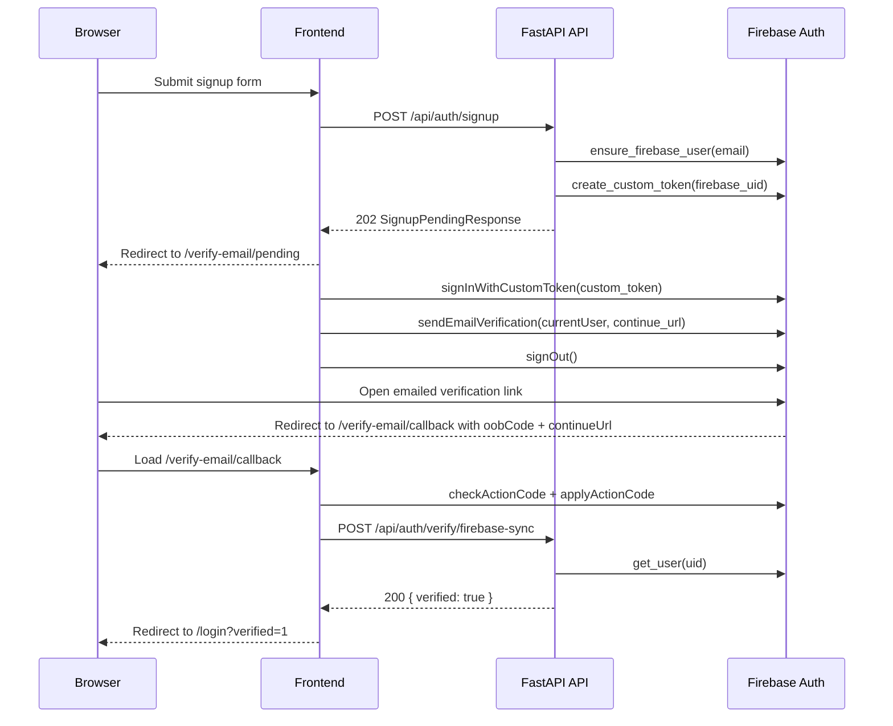

# Firebase Email Verification Signup Flow

Firebase remains the source of truth for email verification, but verification-email delivery is now Firebase-managed from the frontend instead of backend SMTP. App sessions, tenant records, user records, JWT cookies, and password reset/change flows stay local to AWS Security Autopilot.

## Current Status

- Implemented: `POST /api/auth/signup` returns a pending-verification bootstrap payload when Firebase is enabled.
- Implemented: `/verify-email/pending` now signs into Firebase with a short-lived custom token, sends the verification email client-side, and then signs out immediately.
- Implemented: `POST /api/auth/verify/resend` is now ticket-based and no longer accepts a raw email address.
- Implemented: `POST /api/auth/login` still fails closed for unverified users, but now returns a `resend_ticket` after a password-valid login attempt so the user can request another verification email without leaking account existence.
- Implemented: SMTP is no longer required for signup verification emails. SMTP is still required for other transactional paths such as invites, MFA email codes, password reset delivery, and Help Hub notifications.
- Implemented and live-validated on `2026-03-21`: production `https://api.ocypheris.com/api/auth/signup` and `POST /api/auth/verify/resend` now return the Firebase bootstrap payload (`resend_ticket` plus `firebase_delivery`) instead of failing on SES SMTP state.
- Implemented and live-validated on `2026-03-21`: production `https://ocypheris.com/signup` redirects to `/verify-email/pending`, and the pending page reaches Firebase-managed delivery. A manual resend in the same browser session reached Firebase and returned `auth/too-many-requests`, which is consistent with the initial send already having fired.
- Implemented on `2026-03-21`: `/verify-email/callback` now accepts both Firebase action-code redirects (`mode=verifyEmail&oobCode=...`) and the production `vt`-only post-verification redirect, using the one-time sync token as the authoritative local verification handoff.
- Implemented and live-validated on `2026-03-21`: the patched production callback now redirects real verified users to `/login?verified=1` and clears the local sync token after marking `users.email_verified=true`.

> ⚠️ Status: Planned — phone verification is no longer part of signup. The remaining follow-up is to require verified phone ownership before MFA enrollment and future sensitive actions.

## Flow



## Backend Contract

### Signup

- `POST /api/auth/signup`
  - When `FIREBASE_PROJECT_ID` is set:
    - returns `202`
    - body:

```json
{
  "message": "Check your inbox for a verification email to activate your account.",
  "email": "<user email>",
  "resend_ticket": "<signed ticket>",
  "firebase_delivery": {
    "custom_token": "<firebase custom token>",
    "continue_url": "https://ocypheris.com/verify-email/callback?vt=<sync_token>"
  }
}
```

  - does not issue auth cookies
  - does not depend on SMTP availability
  - When `FIREBASE_PROJECT_ID` is unset:
    - keeps the legacy local-dev `201 AuthResponse` auto-login path

### Verification sync + resend

- `POST /api/auth/verify/firebase-sync`
  - unauthenticated
  - body: `{ "sync_token": "<one-time token>" }`
  - optional compatibility field: `email`
  - returns `200 { "verified": true }` after Firebase confirms `email_verified=true`

- `POST /api/auth/verify/resend`
  - unauthenticated
  - body: `{ "resend_ticket": "<signed ticket>" }`
  - rate limit: 3 attempts per email per 10 minutes
  - returns `400 invalid_or_expired_resend_ticket` for forged, expired, stale, or already-consumed user state
  - returns:

```json
{
  "message": "If your account exists, a new link was sent.",
  "resend_ticket": "<fresh signed ticket>",
  "firebase_delivery": {
    "custom_token": "<firebase custom token>",
    "continue_url": "https://ocypheris.com/verify-email/callback?vt=<sync_token>"
  }
}
```

  - does not support anonymous email lookup in this temporary fallback

### Login

- `POST /api/auth/login`
  - accepts optional `remember_me` boolean:
    - `true` issues persistent auth/CSRF cookies with one-week lifetime
    - `false` issues session cookies with no `expires` / `Max-Age`
  - returns:

```json
{
  "detail": "email_verification_required",
  "email": "<user email>",
  "resend_ticket": "<signed ticket>"
}
```

  - when the password is valid but email verification is still incomplete
  - returns `503 email_verification_check_unavailable` when Firebase cannot be checked for an unverified user
  - caches the verified result locally by setting `users.email_verified=true` and `users.email_verified_at`

### Legacy authenticated verification endpoints

- `POST /api/auth/verify/send`
- `POST /api/auth/verify/confirm`

Email mode on both endpoints still returns `400` and points callers to `POST /api/auth/verify/resend`. Phone mode is unchanged.

## Frontend Routes

- `/signup`
  - stores `email`, `resend_ticket`, and `firebase_delivery` in `sessionStorage`
  - redirects to `/verify-email/pending?email=...`

- `/verify-email/pending`
  - reads the stored pending-verification bootstrap
  - automatically sends the Firebase-managed verification email on first load when `firebase_delivery` is present
  - uses ticket-based `POST /api/auth/verify/resend` for explicit resend
  - requires existing signup or password-validated login session state for resend

- `/verify-email/callback`
  - accepts either a Firebase action-code callback or a `vt`-only redirect
  - applies the Firebase action code when `mode=verifyEmail&oobCode=...` is present
  - calls `POST /api/auth/verify/firebase-sync` with the one-time sync token
  - redirects to `/login?verified=1` on success
  - only offers resend when a stored `resend_ticket` exists

- `/login`
  - surfaces resend controls for `email_verification_required`
  - stores the returned `resend_ticket` after a password-valid unverified login attempt
  - surfaces a temporary-unavailable banner for `email_verification_check_unavailable`

## Required Environment Variables

### Backend

Add these to [`docs/local-dev/environment.md`](/Users/marcomaher/AWS%20Security%20Autopilot/docs/local-dev/environment.md) service env files when you want Firebase-backed signup enabled:

```bash
FIREBASE_PROJECT_ID="<YOUR_VALUE_HERE>"
FIREBASE_SERVICE_ACCOUNT_JSON=""
FIREBASE_SERVICE_ACCOUNT_PATH="<YOUR_VALUE_HERE>"
FIREBASE_EMAIL_CONTINUE_URL_BASE="<YOUR_VALUE_HERE>"
```

Notes:

- Keep exactly one credential source populated: `FIREBASE_SERVICE_ACCOUNT_JSON` or `FIREBASE_SERVICE_ACCOUNT_PATH`.
- `FIREBASE_EMAIL_CONTINUE_URL_BASE` must be the public frontend origin, for example `http://localhost:3000` or `https://ocypheris.com`.
- Leave `FIREBASE_PROJECT_ID` unset to preserve the legacy local auto-login path.
- The live serverless deployment currently uses the file-path mode, not inline JSON:
  - repo build context file: `backend/.firebase/firebase-service-account.json`
  - runtime env value: `FIREBASE_SERVICE_ACCOUNT_PATH=/var/task/backend/.firebase/firebase-service-account.json`
  - runtime env value: `FIREBASE_SERVICE_ACCOUNT_JSON=""`

### Frontend

```bash
NEXT_PUBLIC_FIREBASE_API_KEY="<YOUR_VALUE_HERE>"
NEXT_PUBLIC_FIREBASE_AUTH_DOMAIN="<YOUR_VALUE_HERE>"
NEXT_PUBLIC_FIREBASE_PROJECT_ID="<YOUR_VALUE_HERE>"
NEXT_PUBLIC_FIREBASE_APP_ID="<YOUR_VALUE_HERE>"
```

The checked-in production frontend values currently map to:

- `NEXT_PUBLIC_API_URL=https://api.ocypheris.com`
- `NEXT_PUBLIC_FIREBASE_AUTH_DOMAIN=aws-security-autopilot.firebaseapp.com`
- `NEXT_PUBLIC_FIREBASE_PROJECT_ID=aws-security-autopilot`

## Operational Notes

- Verification-email delivery no longer depends on `EMAIL_FROM`, `EMAIL_SMTP_HOST`, `EMAIL_SMTP_PORT`, `EMAIL_SMTP_USER`, or `EMAIL_SMTP_PASSWORD`.
- SMTP configuration remains part of the deploy because other email features still use [`backend/services/email.py`](/Users/marcomaher/AWS%20Security%20Autopilot/backend/services/email.py).
- Existing Firebase authorized domains and `FIREBASE_EMAIL_CONTINUE_URL_BASE` remain the critical prerequisites for this flow.

## Related Docs

- [Environment setup](/Users/marcomaher/AWS%20Security%20Autopilot/docs/local-dev/environment.md)
- [Backend development](/Users/marcomaher/AWS%20Security%20Autopilot/docs/local-dev/backend.md)
- [Secrets & configuration management](/Users/marcomaher/AWS%20Security%20Autopilot/docs/deployment/secrets-config.md)
- [Final to-do list](/Users/marcomaher/AWS%20Security%20Autopilot/docs/final-to-do/final-to-do)
