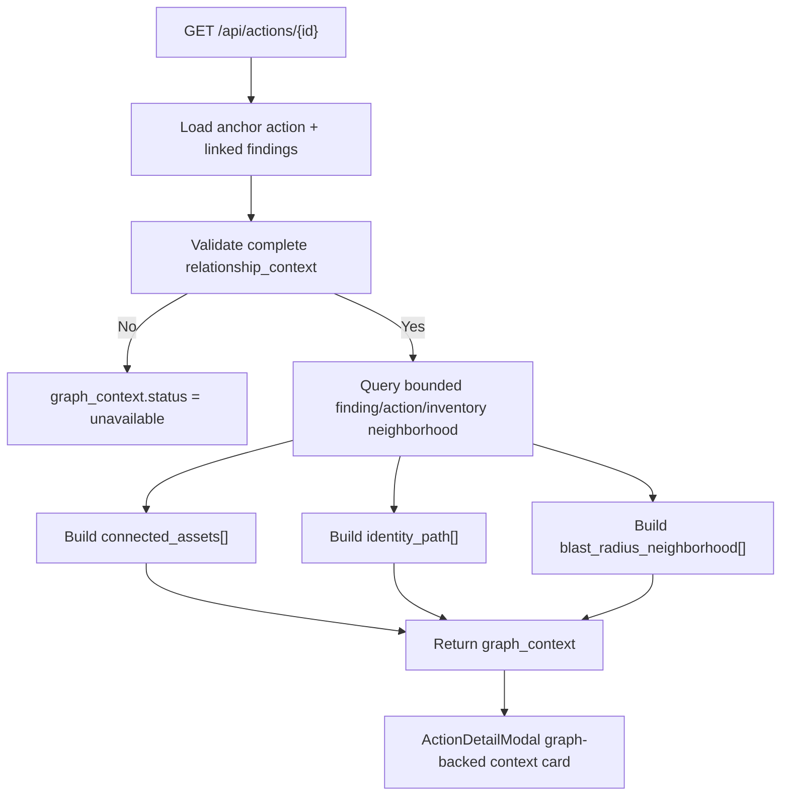

# Graph-Backed Action Context

This feature exposes graph-backed action detail context on `/api/actions/{id}` using the persisted relationship metadata and inventory snapshots already stored in the platform.

Implemented source files:
- `backend/services/action_graph_context.py`
- `backend/routers/actions.py`
- `frontend/src/lib/api.ts`
- `frontend/src/components/ActionDetailModal.tsx`
- `tests/test_phase3_p1_2_graph_backed_action_context.py`

## Status

Implemented in Phase 3 P1.2.

Attack Path Phase 1 did not replace this contract. `graph_context` remains the conservative bounded detail builder while `attack_path_view` and `GET /api/actions/attack-paths` now use the persisted security graph directly.

## What it does

- Adds additive `graph_context` to action detail responses.
- Returns the three requested sections:
  - `connected_assets`
  - `identity_path`
  - `blast_radius_neighborhood`
- Returns an explicit fallback state when graph context is not available instead of omitting the field or failing the request.
- Keeps traversal conservative and bounded so action detail reads do not issue unbounded graph queries.

## Data sources

The current graph-backed action detail payload is intentionally conservative and uses existing persisted data only:

- linked finding `raw_json.relationship_context`
- linked finding `resource_key`
- linked finding `raw_json.Resources`
- linked finding identity hints such as `raw_json.principal`
- `inventory_assets` rows for the same tenant/account and the anchor resource or same-account support assets
- related `actions` and `findings` inside the same tenant/account neighborhood

An action is considered graph-ready only when its relationship context is explicit and complete with confidence `>= 0.75`.

## API contract

`GET /api/actions/{id}` now returns additive `graph_context` with this shape:

- `status`
  - `available`
  - `unavailable`
- `availability_reason`
  - currently `relationship_context_unavailable` when the anchor action does not have complete/high-confidence relationship context
- `source`
  - `finding_relationship_context+inventory_assets`
- `connected_assets[]`
- `identity_path[]`
- `blast_radius_neighborhood[]`
- `truncated_sections[]`
- `limits`

The fallback contract is explicit and stable:

- `graph_context.status = "unavailable"`
- `graph_context.connected_assets = []`
- `graph_context.identity_path = []`
- `graph_context.blast_radius_neighborhood = []`

## Traversal model

The current neighborhood is bounded to the same tenant/account and uses the same conservative relationship model introduced by toxic-combination scoring:

- anchor resource key
- same-account support key: `account:{account_id}`
- same-account-region support key: `account:{account_id}:region:{region}`

Related actions are limited to:

- the same resource as the anchor action, plus
- same-account `AwsAccount` support actions in the same region or global scope

Inventory assets are limited to:

- the anchor resource, plus
- same-account support assets in the same region when the anchor action is regional

## Query limits

The current hard limits are:

- `max_related_findings = 24`
- `max_related_actions = 24`
- `max_inventory_assets = 24`
- `max_connected_assets = 6`
- `max_identity_nodes = 6`
- `max_blast_radius_neighbors = 6`

When a section hits its cap, the response records that in `truncated_sections[]` so the client can explain the bounded view instead of implying completeness.

## Render flow

## UI behavior

`frontend/src/components/ActionDetailModal.tsx` now renders a dedicated `Graph-backed context` card:

- when `status = available`, the modal shows connected assets, identity path chips, and bounded blast-radius neighbors
- when `status = unavailable`, the modal shows the explicit fallback reason instead of hiding the section
- when any section is truncated, the modal shows a capped-traversal note sourced from `truncated_sections[]`

## Limitations

- This slice still does not traverse the persisted `security_graph_nodes` / `security_graph_edges` tables directly; it builds the detail payload from the persisted relationship metadata and inventory rows already used by the rest of the product.
- `identity_path` is only populated when linked finding payloads contain concrete identity hints such as principals or IAM resources.
- The current neighborhood remains intentionally narrow; it is explainability-focused, not a tenant-wide free-form graph explorer.

## Related docs

- [Attack Path view](/Users/marcomaher/AWS%20Security%20Autopilot/docs/features/attack-path-view.md)
- [Security Graph foundation](/Users/marcomaher/AWS%20Security%20Autopilot/docs/features/security-graph-foundation.md)
- [Toxic-combination prioritization](/Users/marcomaher/AWS%20Security%20Autopilot/docs/features/toxic-combination-prioritization.md)
- [Shared Security + Engineering execution guidance](/Users/marcomaher/AWS%20Security%20Autopilot/docs/features/shared-execution-guidance.md)
- [Handoff-free closure](/Users/marcomaher/AWS%20Security%20Autopilot/docs/features/handoff-free-closure.md)
- [AWS Security Autopilot documentation index](/Users/marcomaher/AWS%20Security%20Autopilot/docs/README.md)
