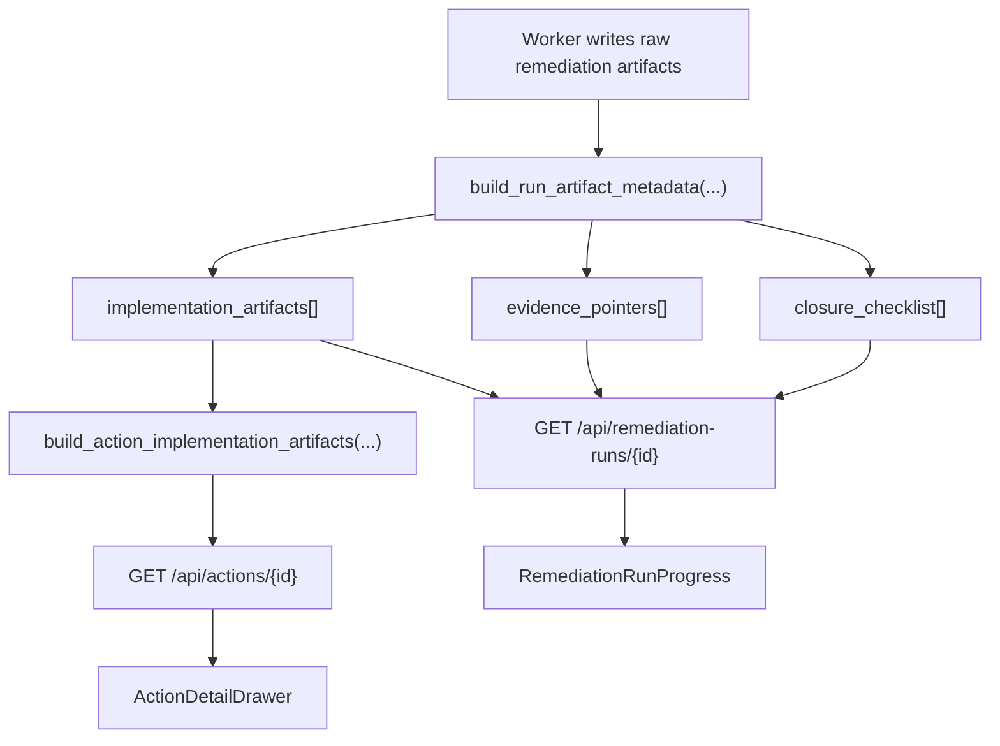

# Handoff-Free Closure

This feature makes remediation closure self-serve for engineering by attaching implementation artifacts, closure checklist state, and evidence pointers directly to action detail and remediation-run detail responses.

## Status

Implemented in Phase 3 P0.8.

## Implemented source files

- `backend/services/remediation_handoff.py`
- `backend/routers/actions.py`
- `backend/routers/remediation_runs.py`
- `backend/workers/jobs/remediation_run.py`
- `frontend/src/components/ActionDetailDrawer.tsx`
- `frontend/src/components/RemediationRunProgress.tsx`

## API contract

### Action detail

`GET /api/actions/{action_id}` now includes additive `implementation_artifacts[]`.

Each item represents one linked remediation output that engineering can act on without reconstructing the run payload:

- `run_id`
- `run_status`
- `run_mode`
- `artifact_key`
- `kind`
- `label`
- `description`
- `href`
- `executable`
- `generated_at`
- `closure_status`
- `metadata`

Current normalized action artifacts:

- `pr_bundle` → engineer-executable bundle link (`/remediation-runs/{run_id}#run-generated-files`)
- `change_summary` → applied-change record (`/remediation-runs/{run_id}#run-activity`)
- `direct_fix` → direct-fix execution record (`/remediation-runs/{run_id}#run-activity`)

### Remediation run detail

`GET /api/remediation-runs/{run_id}` now includes additive `artifact_metadata`.

`artifact_metadata` contains:

- `implementation_artifacts[]`
- `evidence_pointers[]`
- `closure_checklist[]`

The raw `artifacts` payload remains unchanged for backward compatibility.

## Normalization rules

`backend/services/remediation_handoff.py` converts sparse worker artifacts into stable UX-facing metadata:

- `pr_bundle.files[]` becomes a bundle artifact with file-count and format metadata.
- `change_summary.changes[]` becomes an applied-change artifact with `applied_at` and `applied_by`.
- `direct_fix` becomes a direct-fix record with `recorded_at`, `post_check_passed`, and log metadata.
- `risk_snapshot`, `pr_bundle_error`, and the run activity log become evidence pointers.
- Terminal runs receive a closure checklist for:
  - implementation artifact recorded
  - evidence pointers attached
  - action closure verified

## UI wiring

The frontend now renders the normalized contract directly:

- `ActionDetailDrawer` shows an `Implementation artifacts` section sourced from `action.implementation_artifacts`.
- `RemediationRunProgress` shows:
  - implementation artifacts
  - closure checklist
  - evidence pointers

Stable anchors are now part of the run-detail page contract:

- `#run-activity`
- `#run-generated-files`
- `#run-closure`

## Backward compatibility

The contract stays additive and fail-open for existing runs:

- legacy runs with `artifacts = null` return empty normalized lists instead of failing
- pending/running runs do not emit closure checklist items yet
- existing consumers can continue reading the raw `artifacts` object

## Data flow

## Related docs

- [Shared Security + Engineering execution guidance](/Users/marcomaher/AWS%20Security%20Autopilot/docs/features/shared-execution-guidance.md)
- [Remediation safety model](/Users/marcomaher/AWS%20Security%20Autopilot/docs/remediation-safety-model.md)
- [Backend local-dev notes](/Users/marcomaher/AWS%20Security%20Autopilot/docs/local-dev/backend.md)
- [Docs index](/Users/marcomaher/AWS%20Security%20Autopilot/docs/README.md)
