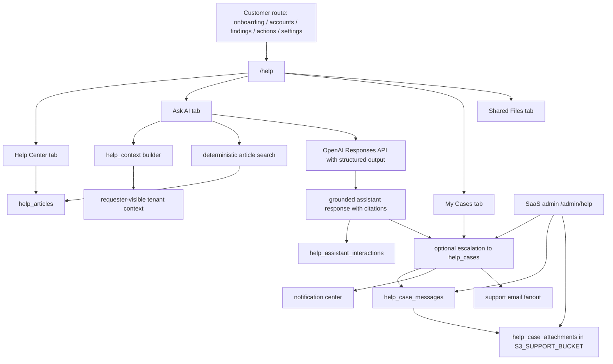
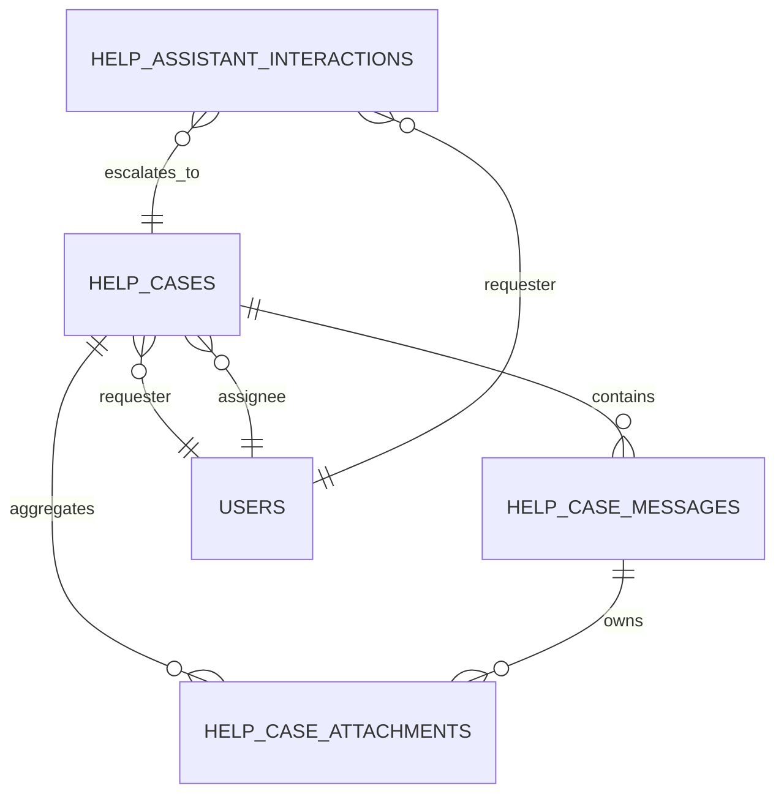

# Help Desk Platform

> Status: Implemented for the native Help Hub MVP and public Help Center article surface.

This feature adds a native help desk to AWS Security Autopilot with a tenant-authenticated Help Hub, a public published-article Help Center, a deterministic article search layer, an OpenAI-backed citation-required assistant, requester-private support cases, case attachments stored in the support S3 bucket, and a dedicated SaaS-admin support inbox.

## Scope implemented

Authenticated customer surfaces:

- `/help` with four tabs:
  - `Help Center`
  - `Ask AI`
  - `My Cases`
  - `Shared Files`
- Contextual `Need help?` entry points on:
  - `/onboarding`
  - `/accounts`
  - `/actions/[id]`
  - `/findings/[id]`
  - `/settings`
- `/support-files` now redirects to `/help?tab=files`

Public article surfaces:

- `/help-center`
- `/help-center/[slug]`

Support operations:

- `/admin/help` SaaS-admin inbox with status, priority, tenant, assignee, and SLA filtering
- requester-facing notification-center updates for case creation, support replies, and status changes
- support email fanout via `SAAS_ADMIN_EMAILS` for new cases and customer replies

## Source files

Backend:

- `alembic/versions/0044_help_desk_platform.py`
- `alembic/versions/0045_help_assistant_llm_threads.py`
- `backend/routers/help.py`
- `backend/help_content/catalog.py`
- `backend/models/help_article.py`
- `backend/models/help_case.py`
- `backend/models/help_case_message.py`
- `backend/models/help_case_attachment.py`
- `backend/models/help_assistant_interaction.py`
- `backend/services/help_center.py`
- `backend/services/help_context.py`
- `backend/services/help_assistant.py`
- `backend/services/help_cases.py`
- `backend/services/help_notifications.py`
- `backend/services/help_storage.py`
- `backend/services/email.py`

Frontend:

- `frontend/src/app/help/page.tsx`
- `frontend/src/app/help-center/page.tsx`
- `frontend/src/app/help-center/[slug]/page.tsx`
- `frontend/src/app/admin/help/page.tsx`
- `frontend/src/components/help/NeedHelpLink.tsx`
- `frontend/src/lib/help.ts`
- `frontend/src/lib/api.ts`

## Current route and API contract

Published article APIs:

- `GET /api/help/articles`
- `GET /api/help/articles/{slug}`
- `GET /api/help/search`

Authenticated assistant APIs:

- `POST /api/help/assistant/query`
- `POST /api/help/assistant/{interaction_id}/feedback`
- `GET /api/help/assistant/threads/{thread_id}`

Authenticated customer case APIs:

- `GET /api/help/cases`
- `POST /api/help/cases`
- `GET /api/help/cases/{id}`
- `POST /api/help/cases/{id}/messages`
- `POST /api/help/cases/{id}/attachments/upload`
- `GET /api/help/cases/{id}/attachments/{attachment_id}/download`

SaaS-admin support APIs:

- `GET /api/saas/help/cases`
- `GET /api/saas/help/cases/{id}`
- `PATCH /api/saas/help/cases/{id}`
- `POST /api/saas/help/cases/{id}/messages`
- `POST /api/saas/help/cases/{id}/attachments/upload`
- `GET /api/saas/help/cases/{id}/attachments/{attachment_id}/download`
- `GET /api/saas/help/summary`

## Article taxonomy and search

The shipped customer-help corpus is checked into `backend/help_content/catalog.py` and is synced into `help_articles` during API startup. The current seeded taxonomy covers:

- account setup
- AWS connection and validation
- findings and actions
- exceptions and governance
- PR bundles and remediation runs
- notifications and shared files
- settings and integrations
- support escalation

The search implementation in `backend/services/help_center.py` is deterministic and keyword-based:

- token scoring uses title, tags, summary, and body matches
- route affinity adds score when `current_path` matches an article’s `related_routes`
- no vector database or embeddings are used in the current MVP

## Assistant grounding contract

The assistant is intentionally read-only and now uses the OpenAI `Responses` API through `backend/services/help_assistant.py`.

Grounding inputs:

- published Help Center articles returned by deterministic search
- requester-visible route context from `current_path`
- requester-visible tenant entities:
  - AWS account summary
  - action summary
  - finding summary
- platform-visible security summary:
  - actionable risk score derived from the same Top Risks formula shown in-product
  - critical/high open finding counts behind that visible score
  - account validation and live-lookup eligibility metadata
- tenant settings summary:
  - `digest_enabled`
  - `slack_digest_enabled`
  - `governance_notifications_enabled`

Current behavior:

- every model response is requested as structured JSON and must include article citations
- the backend sends only approved article excerpts plus requester-visible SaaS context; no hidden support notes, secrets, or unrelated tenant data are included in prompts
- the prompt instructs the model to answer briefly by default unless the user asks for more detail
- low-confidence answers can suggest opening a support case, but the case is created only after explicit user approval
- Help Hub AI chats are grouped by `thread_id`; the backend persists bounded turn history, follow-up prompts, context gaps, provider metadata, token usage, and latency on each interaction row
- the assistant never triggers remediation, AWS mutations, or any action execution side effects
- live IAM lookup is a separate bounded read-only path:
  - default source remains ingested SaaS data
  - live lookup is available only for accounts explicitly enabled by a SaaS admin
  - the assistant asks for confirmation before executing a live IAM read
  - v1 live scope is limited to role posture, user/access-key posture, root posture, trust-risk indicators, and attached-policy summaries
  - if the assistant cannot resolve exactly one enabled account, it asks the user to choose an account first instead of guessing

Runtime configuration:

- `OPENAI_HELP_ENABLED=true`
- `OPENAI_API_KEY_SECRET_ID=security-autopilot-dev/OPENAI_API_KEY`
- `OPENAI_API_KEY=<YOUR_VALUE_HERE>` for local-only runtime setup
- `OPENAI_HELP_MODEL=gpt-4.1-mini`
- `OPENAI_HELP_REASONING_EFFORT=low`
- `OPENAI_HELP_TIMEOUT_SECONDS=30`

The production serverless runtime resolves `OPENAI_API_KEY` from the Secrets Manager secret referenced by `OPENAI_API_KEY_SECRET_ID`; local development may still set `OPENAI_API_KEY` directly in `backend/.env`.

Live IAM enablement on AWS accounts:

- `ai_live_lookup_enabled`
- `ai_live_lookup_scope`
- `ai_live_lookup_enabled_at`
- `ai_live_lookup_enabled_by_user_id`
- `ai_live_lookup_notes`

Current scope value:

- `iam_readonly_v1`

## Case lifecycle and RBAC

Case statuses:

- `new`
- `triaging`
- `waiting_on_customer`
- `resolved`
- `closed`

Case sources:

- `manual`
- `ai_escalation`
- `contextual_cta`

Message roles:

- `requester`
- `support`
- `assistant`
- `system`

Visibility rules:

- customer-side case visibility is requester-private in MVP
- the requester can read and reply to only their own cases
- other tenant users, including tenant admins, cannot read requester-private cases
- SaaS admins can read all cases and can add internal-only support notes
- internal-only messages and attachments are hidden from the requester serialization path

## Persistence and storage

Database tables added by `0044_help_desk_platform.py`:

- `help_articles`
- `help_cases`
- `help_case_messages`
- `help_case_attachments`
- `help_assistant_interactions`

`0045_help_assistant_llm_threads.py` extends `help_assistant_interactions` with:

- `thread_id`
- normalized `citations`
- `follow_up_questions`
- `context_gaps`
- provider/model metadata
- token-usage metadata
- provider response payload capture
- latency and error-code fields

Attachment storage:

- bucket: `S3_SUPPORT_BUCKET`
- region override: `S3_SUPPORT_BUCKET_REGION` or fallback `AWS_REGION`
- case attachment key prefix:
  - `help-cases/{tenant_id}/{case_id}/{message_id}/{generated_uuid}/{filename}`

Legacy support-file behavior remains separate:

- tenant-shared files still use the existing `support_files` flow
- help-case attachments do not reuse `support_files`

## Notifications and email reuse

Customer-facing case updates reuse the same notification center pattern documented in [Communication + Governance Layer](/Users/marcomaher/AWS%20Security%20Autopilot/docs/features/communication-governance-layer.md).

Current help-case notification behavior:

- case created: requester gets an in-app confirmation
- AI escalation created: requester gets an in-app confirmation
- admin public reply: requester gets an in-app notification and a requester email
- admin status update: requester gets an in-app notification
- new case and customer reply: SaaS admin fanout email is sent through `SAAS_ADMIN_EMAILS`

## Current limitations

> ⚠️ Status: Planned — not yet implemented: Jira, ServiceNow, and Slack support-case synchronization.

> ⚠️ Status: Planned — not yet implemented: CMS-style article editing and article publishing workflows in the product UI.

> ⚠️ Status: Planned — not yet implemented: shared tenant-visible cases, live chat, and billing-support flows.

The current public Help Center is article-only. Unauthenticated visitors can browse published articles, but opening a private case still requires sign-in.

## Related docs

- [Customer Help Hub guide](/Users/marcomaher/AWS%20Security%20Autopilot/docs/customer-guide/help-hub.md)
- [Customer guide index](/Users/marcomaher/AWS%20Security%20Autopilot/docs/customer-guide/README.md)
- [Communication + Governance layer](/Users/marcomaher/AWS%20Security%20Autopilot/docs/features/communication-governance-layer.md)
- [Settings IA refresh](/Users/marcomaher/AWS%20Security%20Autopilot/docs/README.md)
