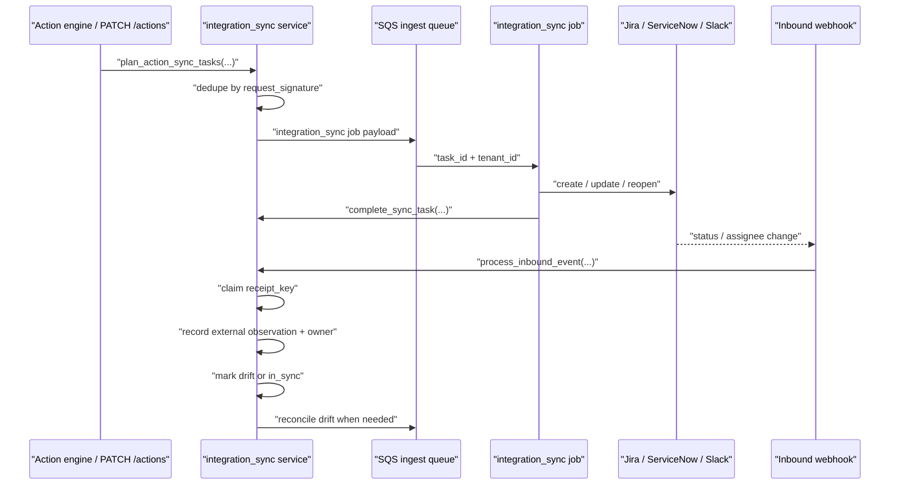

# Integration-First Remediation Operations

> Status: Implemented in Phase 3 P1.5.

This feature keeps AWS Security Autopilot actions synchronized with external Jira, ServiceNow, and Slack work items without making those providers the source of truth.

## Scope

Implemented provider set:

- `jira`
- `servicenow`
- `slack`

Implemented sync behaviors:

- outbound create/update/reopen task planning
- tenant-scoped integration settings and secret storage
- idempotent inbound webhook receipt handling
- assignee sync plus external-status observation without overwriting canonical action state
- retry-safe outbound worker execution
- drift reconciliation back to the internal canonical action state

## Source files

- `backend/routers/integrations.py`
- `backend/services/integration_sync.py`
- `backend/services/action_remediation_state_machine.py`
- `backend/services/action_remediation_sync.py`
- `backend/services/integration_adapters.py`
- `backend/services/jira_admin.py`
- `backend/workers/jobs/integration_sync.py`
- `backend/workers/jobs/reconcile_action_remediation_sync.py`
- `backend/workers/jobs/compute_actions.py`
- `backend/routers/actions.py`
- `frontend/src/app/settings/IntegrationsSettingsTab.tsx`
- `frontend/src/components/ActionDetailModal.tsx`
- `backend/routers/internal.py`
- `backend/services/action_engine.py`
- `backend/utils/sqs.py`
- `alembic/versions/0042_bidirectional_integrations.py`
- `alembic/versions/0042_action_remediation_system_of_record.py`

## API contract

Routes mounted under `/api/integrations`:

- `GET /api/integrations/settings`
- `PATCH /api/integrations/settings/{provider}`
- `POST /api/integrations/actions/{action_id}/sync`
- `POST /api/integrations/webhooks/{provider}`
- `POST /api/integrations/settings/jira/validate`
- `POST /api/integrations/settings/jira/webhook/sync`
- `POST /api/integrations/settings/jira/canary-sync`

Webhook headers:

- Jira supports `X-Hub-Signature` for signed admin-webhook delivery.
- `X-Integration-Webhook-Token` remains available as the migration fallback for Jira and as the shared-token contract for providers that do not use signed delivery.
- `X-External-Event-Id` is optional and is used as the preferred inbound idempotency key.

Supported setting fields on `PATCH /api/integrations/settings/{provider}`:

- `enabled`
- `outbound_enabled`
- `inbound_enabled`
- `auto_create`
- `reopen_on_regression`
- `config`
- `secret_config`
- `clear_secret_config`

Current provider-specific secret/config expectations from `backend/services/integration_adapters.py`:

| Provider | Required config | Required secret fields |
|---|---|---|
| `jira` | `base_url`, `project_key` | `user_email`, `api_token` |
| `servicenow` | `base_url`, `table` | `username`, `password` |
| `slack` | `channel_id` | `bot_token` |

Optional provider config already supported:

- Jira `issue_type`
- Jira `transition_map`
- Jira `assignee_account_map`
- Jira `canary_action_id`
- Slack `api_base_url`
- per-provider `status_mapping`
- per-provider `external_status_mapping`

Operator setup and live Jira validation steps are documented in [Jira remediation sync runbook](/Users/marcomaher/AWS%20Security%20Autopilot/docs/runbooks/jira-remediation-sync-runbook.md).

Canonical remediation-state authority is documented in [Remediation system-of-record sync](/Users/marcomaher/AWS%20Security%20Autopilot/docs/features/remediation-system-of-record-sync.md).

## Persistence model

P1.5 and P1.6 together add six tenant-scoped tables:

- `tenant_integration_settings`
- `action_external_links`
- `integration_sync_tasks`
- `integration_event_receipts`
- `action_remediation_sync_states`
- `action_remediation_sync_events`

Key isolation and idempotency constraints:

- `tenant_integration_settings`: unique by `(tenant_id, provider)`
- `action_external_links`: unique by `(tenant_id, action_id, provider)` and `(tenant_id, provider, external_id)`
- `integration_sync_tasks`: unique by `(tenant_id, request_signature)`
- `integration_event_receipts`: unique by `(tenant_id, provider, receipt_key)`

`tenant_integration_settings.secret_json` and webhook token hashes are stored separately from action state so provider credentials remain isolated at the tenant-integration boundary.

`action_remediation_sync_states` and `action_remediation_sync_events` are the canonical conflict-resolution and audit layer for provider status drift.

## Status mapping

Outbound canonical-to-provider defaults:

| Canonical action status | Jira | ServiceNow | Slack |
|---|---|---|---|
| `open` | `To Do` | `New` | `open` |
| `in_progress` | `In Progress` | `Work in Progress` | `in_progress` |
| `resolved` | `Done` | `Resolved` | `resolved` |
| `suppressed` | `Won't Do` | `Cancelled` | `suppressed` |

Inbound provider-to-canonical mapping is configurable via `external_status_mapping`, with default provider maps sourced from the canonical action-remediation state machine.

## Runtime flow

## Reopen-on-regression behavior

When `compute_actions_for_tenant(...)` reports `reopened_action_ids`, `plan_action_sync_tasks(...)` emits `operation="reopen"` for providers with:

- an existing external link, and
- `reopen_on_regression=true`.

The worker still sends the provider's normal update payload, but the operation marker is preserved in `integration_sync_tasks.operation` so retries, audit review, and provider-specific handling can distinguish reopen traffic from ordinary updates.

## Retry and failure semantics

Outbound sync safety:

- duplicate outbound payloads collapse to one `request_signature` per tenant
- worker retries reuse the same `integration_sync_tasks` row and increment `attempt_count`
- retryable provider errors raise back to the worker loop after the task is marked `failed`
- non-retryable provider errors mark the task `failed` without mutating canonical action state

Inbound sync safety:

- webhook events are normalized to a `receipt_key`
- the receipt row is created before action/link mutation
- duplicate or concurrent deliveries replay cleanly from `integration_event_receipts`
- stale inbound events are ignored when `occurred_at <= action_external_links.last_inbound_event_at`
- conflicting inbound statuses do not overwrite `Action.status`; they record `preserve_internal_canonical` and mark the provider row `drifted`

## Current limitations

- Slack inbound status sync expects webhook/event payloads that carry `metadata.event_payload.status` and assignee metadata; provider-specific interactive Slack action translation is not yet implemented.
- Jira production readiness still requires one staged canary proof and one retained production canary proof on the dedicated Jira canary project/workflow.

## Related docs

- [Jira remediation sync runbook](/Users/marcomaher/AWS%20Security%20Autopilot/docs/runbooks/jira-remediation-sync-runbook.md)
- [Repo-aware PR automation](/Users/marcomaher/AWS%20Security%20Autopilot/docs/features/repo-aware-pr-automation.md)
- [Remediation system-of-record sync](/Users/marcomaher/AWS%20Security%20Autopilot/docs/features/remediation-system-of-record-sync.md)
- [Communication + Governance layer](/Users/marcomaher/AWS%20Security%20Autopilot/docs/features/communication-governance-layer.md)
- [Handoff-free closure](/Users/marcomaher/AWS%20Security%20Autopilot/docs/features/handoff-free-closure.md)
- [Backend local-dev notes](/Users/marcomaher/AWS%20Security%20Autopilot/docs/local-dev/backend.md)
- [Docs index](/Users/marcomaher/AWS%20Security%20Autopilot/docs/README.md)
