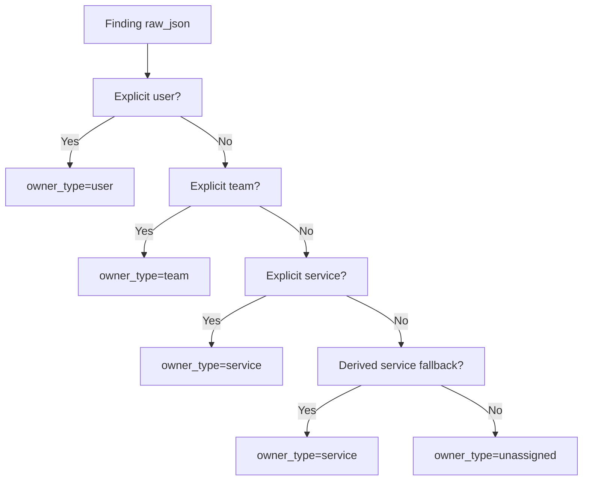

# Ownership-Based Risk Queues

This feature adds deterministic action ownership plus owner-scoped queue filters to `GET /api/actions`.

## Status

Implemented in Phase 3 P0.5.

## What it adds

- Every action now stores:
  - `owner_type`
  - `owner_key`
  - `owner_label`
- `GET /api/actions` now supports:
  - `owner_type=user|team|service|unassigned`
  - `owner_key=<normalized-owner-key>`
  - `owner_queue=open|expiring|overdue|expiring_exceptions|blocked_fixes`
- `GET /api/actions/{id}` now returns the stored owner fields.
- Action list/detail payloads now include computed `sla` metadata:
  - `risk_tier`
  - `due_at`
  - `expiring_at`
  - `state`
  - `hours_until_due` / `hours_overdue`
  - `escalation_eligible`
- Owner-queue responses now include `owner_queue_counters` so clients can render backlog totals for all queue buckets without issuing separate requests.

## Resolver logic

Ownership is resolved deterministically in this order:

1. Explicit `user`
2. Explicit `team`
3. Explicit `service`
4. Derived `service` fallback from `action_type` or `resource_type`
5. `unassigned`

Explicit owner signals are read from Security Hub raw finding data already stored in `findings.raw_json`:

- `ProductFields`
- resource tag maps under `Resources[*]`

Supported explicit hint keys:

- User: `owner_email`, `owner_user`, `assigned_to`, `user`, `email`
- Team: `team`, `owner_team`, `owning_team`, `squad`, `group`
- Service: `service`, `service_name`, `application`, `app`, `system`, `workload`
- Ambiguous fallback: `owner`
  - if the value contains `@`, it resolves to `user`
  - otherwise it resolves to `team`

Current derived service fallbacks from action types:

- `s3`
- `ec2`
- `iam`
- `config`
- `cloudtrail`
- `ssm`
- `guardduty`
- `securityhub`
- `ebs`

Additional resource-type fallback exists for:

- `AwsAccount`
- `AwsEc2SecurityGroup`
- `AwsEksCluster`
- `AwsIamAccessKey`
- `AwsIamUser`
- `AwsRdsDbInstance`
- `AwsS3Bucket`
- `AwsSsmDocument`



## Queue definitions

Queues are intentionally distinct:

- `open`
  - unresolved actions
  - no active exception
  - not expiring
  - not overdue
- `expiring`
  - unresolved actions
  - no active exception
  - inside the SLA warning window
  - not overdue
- `overdue`
  - unresolved actions
  - no active exception
  - older than the score-based SLA window
- `expiring_exceptions`
  - unresolved actions
  - active exception expires within the configured warning window
- `blocked_fixes`
  - unresolved actions
  - active exception exists
  - exception is not already in `expiring_exceptions`

`blocked_fixes` is exception-only in the current implementation. Waiting on another team, missing access, or manual execution debt are not yet modeled as separate blocker states.

## Default overdue windows

Current score-based windows are:

- `critical` (`score >= 90`) → overdue after `24` hours
- `high` (`score >= 70`) → overdue after `72` hours
- `medium` (`score >= 40`) → overdue after `168` hours
- `low` (`score < 40`) → overdue after `336` hours

Expiring warning windows are derived deterministically from the due window:

- `critical` → warning starts `8` hours before due
- `high` → warning starts `24` hours before due
- `medium` → warning starts `56` hours before due
- `low` → warning starts `72` hours before due

Current expiring-exception warning window:

- `7` days before expiry

These values come from:

- `ACTIONS_OWNER_QUEUE_OVERDUE_CRITICAL_HOURS=24`
- `ACTIONS_OWNER_QUEUE_OVERDUE_HIGH_HOURS=72`
- `ACTIONS_OWNER_QUEUE_OVERDUE_DEFAULT_HOURS=168`
- `ACTIONS_OWNER_QUEUE_OVERDUE_LOW_HOURS=336`
- `ACTIONS_OWNER_QUEUE_EXPIRING_EXCEPTION_DAYS=7`

## Escalation eligibility

Escalations only fire for high-impact unresolved actions:

- risk tier `critical` or `high`
- SLA state `expiring` or `overdue`
- no active action exception

That same eligibility logic is reused in:

- `/api/actions` `sla.escalation_eligible`
- weekly digest email/Slack escalation sections
- governance Slack/webhook notification payloads

## Unassigned behavior

Actions that do not resolve to a user, team, or service remain explicit:

- `owner_type=unassigned`
- `owner_key=unassigned`
- `owner_label=Unassigned`

That allows dashboards and API clients to query unowned work directly instead of silently dropping it.

## Example API calls

List one team’s overdue queue:

```bash
curl "http://localhost:8000/api/actions?owner_type=team&owner_key=platform-team&owner_queue=overdue"
```

List one team’s expiring queue with additive queue counters:

```bash
curl "http://localhost:8000/api/actions?owner_type=team&owner_key=platform-team&owner_queue=expiring"
```

List unassigned open actions:

```bash
curl "http://localhost:8000/api/actions?owner_type=unassigned&owner_key=unassigned&owner_queue=open"
```

Fetch one action with resolved ownership:

```bash
curl "http://localhost:8000/api/actions/<ACTION_ID>"
```

## Related files

- [Actions router](/Users/marcomaher/AWS%20Security%20Autopilot/backend/routers/actions.py)
- [Action SLA policy](/Users/marcomaher/AWS%20Security%20Autopilot/backend/services/action_sla.py)
- [Action engine](/Users/marcomaher/AWS%20Security%20Autopilot/backend/services/action_engine.py)
- [Action ownership resolver](/Users/marcomaher/AWS%20Security%20Autopilot/backend/services/action_ownership.py)
- [Phase 3 P0.5 tests](/Users/marcomaher/AWS%20Security%20Autopilot/tests/test_phase3_p0_5_owner_queues.py)
- [Phase 3 P0.6 tests](/Users/marcomaher/AWS%20Security%20Autopilot/tests/test_phase3_p0_6_sla_escalation.py)
