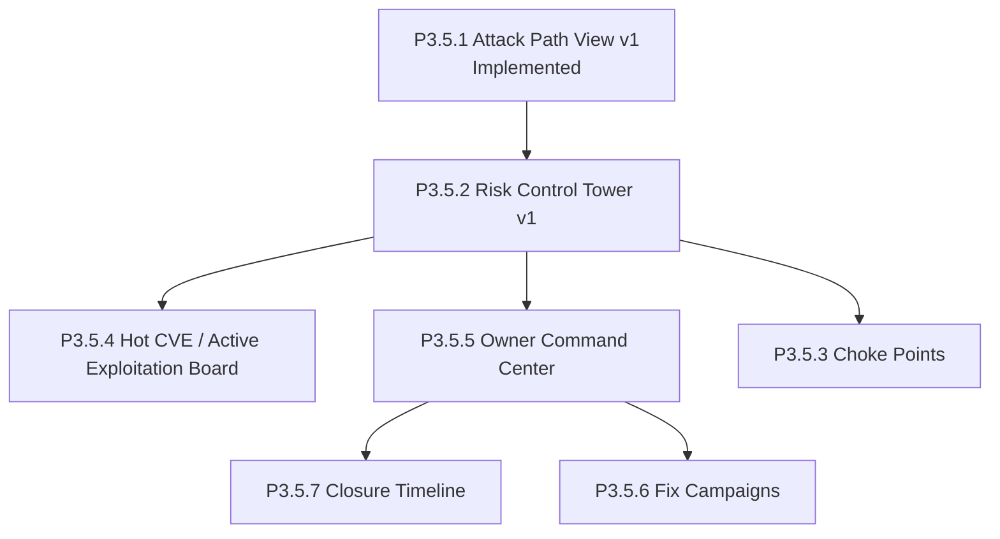

# Phase 3.5 Roadmap

This document captures the deferred post-`P3.5.1` plan so the remaining Phase 3.5 work is discoverable later without relying on chat history.

## Status

- `P3.5.1` Attack Path View v1: implemented on March 12, 2026
- `P3.5.2` Risk Control Tower v1: planned
- `P3.5.3` Choke Points: planned
- `P3.5.4` Hot CVE / Active Exploitation Board: planned
- `P3.5.5` Owner Command Center: planned
- `P3.5.6` Fix Campaigns: planned
- `P3.5.7` Closure Timeline: planned

> ⚠️ Status: Planned — not yet implemented for `P3.5.2` through `P3.5.7`

## Intent

Phase 3.5 packages the shipped Phase 3 `P0`, `P1`, and `P2` backend capabilities into clearer user-facing decision surfaces.

The goal is to make the platform answer three questions quickly:

1. Why is this urgent?
2. What can an attacker actually reach from here?
3. What is the fastest safe path to closure?

`P3.5.1` already addressed the action-detail attack-story surface. The remaining roadmap is intentionally deferred until resumed explicitly.

Phase 1 of the enterprise Attack Path implementation intentionally pulled forward a minimal visible `/attack-paths` page plus action-detail deep links. Phase 2 then added reusable shared path records, `path_id` deep links, and explainable path-ranking factors on that bounded surface. Those shipped slices still do not replace the broader Phase 3.5 roadmap below.

## Planned slices

### `P3.5.2` Risk Control Tower v1

Audience:
- security lead
- CTO / PM
- engineering manager

Planned surface:
- KPI strip
- risk x criticality matrix
- hot exploited now
- owner pressure
- drill-down into filtered actions

Expected value:
- one post-login home screen for prioritization
- immediate visibility into business-critical and actively exploited work
- less dependence on manual action-list filtering

Depends on:
- `P0.5`
- `P0.6`
- `P1.7`
- `P1.8`
- `P2`

### `P3.5.3` Choke Points

Audience:
- security lead
- platform team

Planned surface:
- repeated risky identities
- repeated exposed resources
- repeated business-critical target assets

Expected value:
- helps users fix one thing that reduces multiple risky paths
- turns graph data into a decision aid instead of a raw explorer

Depends on:
- `P1.1`
- `P1.2`
- `P1.7`

### `P3.5.4` Hot CVE / Active Exploitation Board

Audience:
- security lead
- on-call/security operations

Planned surface:
- trusted threat-intelligence-backed actions only
- freshness and decay visibility
- direct links to action detail and remediation recommendation

Expected value:
- makes `P2` visible and operational
- gives users a clean weekly workflow for active exploitation

Depends on:
- `P2`

### `P3.5.5` Owner Command Center

Audience:
- engineering manager
- service owner
- security lead

Planned surface:
- owned backlog by team/service
- overdue work
- expiring exceptions
- blocked fixes
- actively exploited owned items

Expected value:
- turns ownership queues and SLA routing into an execution surface instead of an API-only capability

Depends on:
- `P0.5`
- `P0.6`
- optionally `P1.5` and `P1.6` for integration-state enrichment

### `P3.5.6` Fix Campaigns

Audience:
- security lead
- engineering program owner

Planned surface:
- remediation waves/campaigns
- grouped actions by owner, repo, service, or theme
- campaign-level PR/ticket/closure progress

Expected value:
- strongest workflow differentiation versus graph-only competitors
- turns action groups into managed execution waves

Depends on:
- `P0.7`
- `P0.8`
- `P1.3`
- `P1.5`
- `P1.6`

### `P3.5.7` Closure Timeline

Audience:
- engineering
- security
- compliance

Planned surface:
- action lifecycle timeline
- ticket/PR/remediation progress
- verification
- drift and reopen visibility

Expected value:
- strengthens trust and auditability
- makes closure state easier to understand from one place

Depends on:
- `P0.8`
- `P1.6`

## Recommended order

Recommended resume order:

1. `P3.5.2` Risk Control Tower v1
2. `P3.5.4` Hot CVE / Active Exploitation Board
3. `P3.5.5` Owner Command Center
4. `P3.5.3` Choke Points
5. `P3.5.7` Closure Timeline
6. `P3.5.6` Fix Campaigns

## Scope boundaries

When Phase 3.5 resumes:

- reuse the existing `P0` / `P1` / `P2` contracts first
- keep new API contracts additive
- keep graph views bounded and tenant-scoped
- do not build a free-form graph explorer before the bounded surfaces prove value
- do not start `P3.5.6` Fix Campaigns until at least one real integration provider is usable live

## Related docs

- [Attack Path view](/Users/marcomaher/AWS%20Security%20Autopilot/docs/features/attack-path-view.md)
- [Attack Path enterprise implementation plan](/Users/marcomaher/AWS%20Security%20Autopilot/docs/features/attack-path-enterprise-implementation-plan.md)
- [Graph-backed action context](/Users/marcomaher/AWS%20Security%20Autopilot/docs/features/graph-backed-action-context.md)
- [Business impact matrix](/Users/marcomaher/AWS%20Security%20Autopilot/docs/features/business-impact-matrix.md)
- [Recommendation mode matrix](/Users/marcomaher/AWS%20Security%20Autopilot/docs/features/recommendation-mode-matrix.md)
- [Threat-intelligence weighting](/Users/marcomaher/AWS%20Security%20Autopilot/docs/features/threat-intelligence-weighting.md)
- [Ownership-based risk queues](/Users/marcomaher/AWS%20Security%20Autopilot/docs/features/ownership-risk-queues.md)
