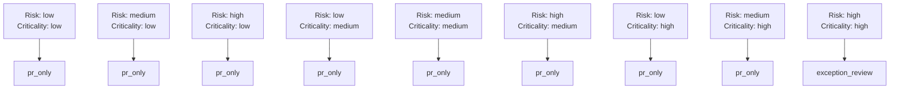
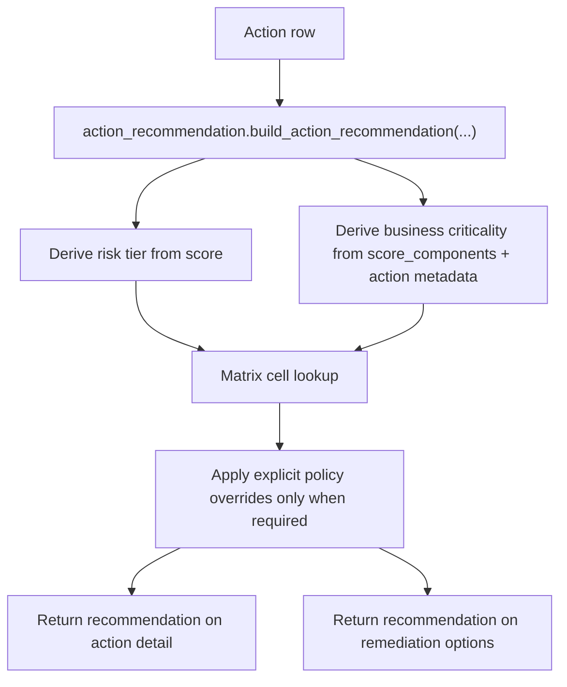

# Recommendation Mode Matrix

This feature adds an auditable recommendation engine that derives a default remediation recommendation from matrix position and exposes it through the action APIs without changing the existing approval or execution gates.

## Status

Implemented in Phase 3 P1.8.

> ⚠️ Current scope: recommendation output no longer emits `direct_fix_candidate`. Active values are `pr_only` and `exception_review`.

## Implemented source files

- `backend/services/action_recommendation.py`
- `backend/routers/actions.py`
- `frontend/src/lib/api.ts`
- `tests/test_phase3_p1_8_recommendation_mode.py`

## API contract

`GET /api/actions/{id}` and `GET /api/actions/{id}/remediation-options` now return additive `recommendation`.

The payload shape is:

- `mode`
  - effective recommendation mode after any explicit policy override
  - values: `pr_only`, `exception_review`
- `default_mode`
  - matrix-derived default before policy override
- `advisory`
  - `true` when the matrix result is informational only
  - `false` when an explicit policy forces the effective recommendation
- `enforced_by_policy`
  - `manual_high_risk_root_credentials_required` for root-credential/manual-high-risk actions
  - `unsupported_pr_only_action` for unmapped `pr_only` actions
- `rationale`
  - human-readable explanation of matrix placement, evidence, and any override
- `matrix_position`
  - `risk_tier`
  - `business_criticality`
  - `cell`
- `evidence`
  - `score`
  - `context_incomplete`
  - `data_sensitivity`
  - `internet_exposure`
  - `privilege_level`
  - `exploit_signals`
  - `matched_signals[]`

The contract is additive. Existing `mode_options`, remediation preview, and remediation-run creation remain unchanged; current execution scope stays PR-only.

## Matrix mapping

The current implementation uses a 3x3 matrix:

## How matrix position is derived

### Risk tier

Risk tier is derived from the existing action score bands:

- `high`: score `>= 70`
- `medium`: score `>= 40` and `< 70`
- `low`: score `< 40`

This reuses the same score semantics already used by action SLA routing and prioritization.

### Business criticality

There is not yet a persisted `business_criticality` field on `actions` or `findings`.

The current implementation derives business criticality from:

- `score_components.data_sensitivity`
- `score_components.privilege_level`
- action-type defaults for high-impact controls such as root credentials, CloudTrail, AWS Config, and encryption controls
- conservative title/description/resource keyword matches such as `customer`, `payment`, `production`, `regulated`, and `revenue`

This keeps the feature additive and auditable while the platform still lacks first-class business metadata storage.

## Override semantics

Matrix output is advisory by default.

The implementation only forces an override when an explicit policy already exists in the platform:

- root-credential/manual-high-risk actions force `exception_review`
- unmapped `pr_only` actions force `exception_review`

## Data flow

## Testing

`tests/test_phase3_p1_8_recommendation_mode.py` covers:

- all nine matrix cells
- explicit policy overrides for manual-high-risk and unmapped `pr_only` actions
- API exposure on both `GET /api/actions/{id}` and `GET /api/actions/{id}/remediation-options`

## Related docs

- [Shared Security + Engineering execution guidance](/Users/marcomaher/AWS%20Security%20Autopilot/docs/features/shared-execution-guidance.md)
- [Ownership-based risk queues](/Users/marcomaher/AWS%20Security%20Autopilot/docs/features/ownership-risk-queues.md)
- [Remediation safety model](/Users/marcomaher/AWS%20Security%20Autopilot/docs/remediation-safety-model.md)
- [Docs index](/Users/marcomaher/AWS%20Security%20Autopilot/docs/README.md)
