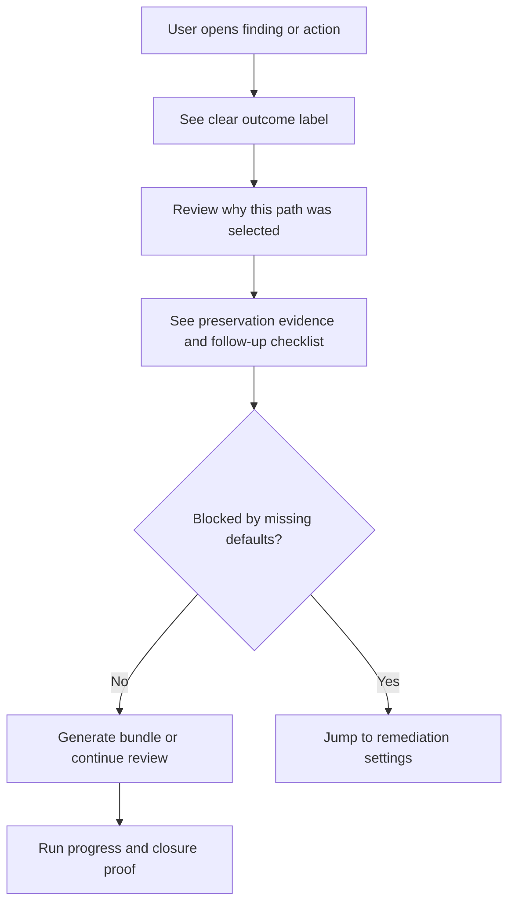

# Remediation Operator UX Implementation Plan

> ⚠️ Status: Partially implemented — Phase A language/shared labels and Phase B guided-review layout landed on 2026-03-30. Phase C remains planned.

This plan packages the value from the now-closed remediation-determinism phases into clearer operator-facing product UX. The backend/runtime work for truthful remediation selection is already closed through the retained March 30, 2026 signoff packages. The remaining opportunity is to make those outcomes easier to understand, prioritize, and act on in the browser.

## Why this plan exists

The product now truthfully distinguishes:

- executable remediation bundles
- review-required bundles
- manual-guidance-only outcomes
- grouped mixed-tier runs
- rationale, preservation evidence, and follow-up state

The current UI exposes most of that data, but it still feels more technical than productized. Operators can complete the flow, but they must interpret low-level signals instead of being guided by clear product language and stronger review workflows.

This plan improves user value without reopening remediation-determinism backend scope.

## Goals

1. Make remediation outcome types immediately understandable to a non-specialist operator.
2. Reduce hesitation when the system lands on `review_required_bundle` instead of an executable path.
3. Make blockers actionable by routing users toward the settings or follow-up step that will unblock them.
4. Help users prioritize the most straightforward remediations first using fields the frontend already has.
5. Keep the implementation frontend-first unless a gap is discovered that cannot be solved with current API contracts.

## Non-goals

- No new remediation families
- No change to canonical backend resolver behavior
- No new production signoff gate
- No customer-side `terraform apply` automation inside the product
- No changes to `docs/Production/`

## Current product baseline

Existing shipped surfaces already cover the core remediation journey:

- action launch, state, artifacts, execution guidance, and attack-path context in `frontend/src/components/ActionDetailModal.tsx`
- single-action strategy selection, preview, and run creation in `frontend/src/components/RemediationModal.tsx`
- grouped mixed-tier outcomes and follow-up in `frontend/src/app/actions/group/page.tsx`
- run artifacts and closure proof in `frontend/src/components/RemediationRunProgress.tsx`
- post-apply state cues in `frontend/src/app/findings/FindingCard.tsx` and `frontend/src/app/findings/FindingGroupCard.tsx`

The recently closed UI gap was canonical resolver visibility inside the single-action modal. This plan builds on that work rather than reopening it.

## Scope

This plan covers the following frontend improvements:

1. clearer UI labels for outcome types
2. better wording around review-required vs manual-only
3. improved layout for rationale, preservation evidence, and follow-up steps
4. stronger guided-review UX using data we already have
5. better grouping and prioritization in the frontend from existing fields
6. better navigation from blockers to the right settings page

## Data assumptions

This plan assumes the current frontend can continue to reuse existing contracts, especially:

- `GET /api/actions/{id}`
- `GET /api/actions/{id}/remediation-options`
- `GET /api/actions/{id}/remediation-preview`
- `GET /api/remediation-runs/{id}`
- findings list and grouped findings list responses
- grouped run detail responses

Important current fields that should be treated as the source of truth:

- `resolution.support_tier`
- `resolution.decision_rationale`
- `resolution.blocked_reasons`
- `resolution.missing_defaults`
- `resolution.preservation_summary`
- `execution_guidance[]`
- `implementation_artifacts[]`
- `closure_checklist[]`
- `pending_confirmation_*`
- `followup_kind`
- grouped member status buckets

## Proposed workstreams

### Workstream 1: Outcome labels

Replace technical-first outcome framing with simple operator labels that are visible consistently across action detail, remediation modal, grouped runs, and run progress.

Proposed product labels:

- `Ready to generate` for `deterministic_bundle`
- `Needs review before apply` for `review_required_bundle`
- `Manual steps required` for `manual_guidance_only`

Display rules:

- Keep the canonical support tier available as a secondary technical detail, not the primary headline.
- Use the same label mapping everywhere the user sees remediation status.
- Reuse shared badge tone and wording across single-action and grouped flows.

Value:

- Users understand immediately how far the product can take them.
- The same remediation does not feel different depending on which page it is viewed from.

### Workstream 2: Review-only and manual-only language cleanup

Current resolver outcomes are truthful, but the difference between review-only and manual-only still requires technical interpretation.

Planned UX changes:

- Add explicit plain-language summaries:
  - `Needs review before apply` means the platform generated a truthful bundle, but the operator must inspect and approve the change before using it.
  - `Manual steps required` means the platform cannot truthfully generate a safe automatic bundle from current evidence or inputs.
- Avoid phrasing that makes review-only sound like a failure.
- Avoid phrasing that makes manual-only sound temporary unless the UI can point to a specific unblock path.

Value:

- Users stop treating `review_required_bundle` as “the product failed.”
- Manual-only cases become clearer and more trustworthy.

### Workstream 3: Resolver evidence layout

The existing resolver decision section should be turned into a more guided review layout instead of a raw evidence dump.

Planned UI changes:

- Reorder the section into:
  - outcome summary
  - why the system chose this path
  - what must be preserved
  - what the user should check next
- Convert preservation evidence into readable cards grouped by theme rather than raw key/value density.
- Surface follow-up steps directly under the decision, not only after the run is created.

Candidate touchpoints:

- `frontend/src/components/RemediationModal.tsx`
- `frontend/src/components/RemediationRunProgress.tsx`
- shared remediation surface components under `frontend/src/components/ui/`

Value:

- Review-required bundles feel guided instead of technical.
- Operators can understand what to protect before they leave the browser.

### Workstream 4: Guided review UX

The product already has enough data to provide a stronger “how to review this safely” flow without backend changes.

Planned UX changes:

- Add a compact review checklist for `review_required_bundle` paths.
- Turn existing rationale, blocked reasons, and preservation evidence into explicit review prompts such as:
  - verify preserved policy statements
  - confirm destination bucket or DNS target
  - confirm customer-managed defaults or inputs
- Keep the checklist scoped to current data and avoid pretending the product has validated more than it actually has.

Value:

- Higher user trust
- Lower abandonment after bundle generation
- Better handoff to engineering or infrastructure owners

### Workstream 5: Frontend-only grouping and prioritization

The findings and action surfaces already expose enough state to provide better prioritization without inventing a new score.

Planned UX changes:

- Add optional grouping or quick filters such as:
  - easiest to execute
  - needs review
  - waiting on manual work
  - waiting on AWS confirmation
- Prefer existing fields over new derived backend metrics.
- Prioritize actions with executable paths and minimal blockers near the top of remediation-focused views.

Candidate fields:

- `recommendation`
- `resolution.support_tier`
- `pending_confirmation_*`
- `followup_kind`
- grouped member buckets and run status

Value:

- Users can focus on high-leverage actions first.
- The product feels more outcome-oriented and less like a raw queue.

### Workstream 6: Blocker-to-settings navigation

Some remediations are blocked not because the product lacks logic, but because tenant defaults or required operator inputs are missing.

Planned UX changes:

- Add direct links from known blocker types to the relevant settings page.
- When `missing_defaults` contains known keys, route the user to the correct settings context rather than leaving them on a dead-end modal.
- Keep the link text explicit, for example:
  - `Set remediation defaults`
  - `Add approved bastion security groups`
  - `Configure CloudTrail bucket defaults`

Candidate navigation targets:

- `/settings?tab=remediation`
- existing tenant settings surfaces already used for remediation defaults

Value:

- Fewer dead ends
- Better “fix once, unblock many” product behavior

## Recommended delivery order

### Phase A: Language and shared labels

Status:

- Implemented on 2026-03-30

Shipped:

- outcome labels
- review-only vs manual-only wording cleanup
- shared badge and summary language

Why first:

- low risk
- immediately improves comprehension everywhere

### Phase B: Guided review and layout

Status:

- Implemented on 2026-03-30

Ship second:

- resolver evidence layout improvements
- review checklist and follow-up guidance

Why second:

- highest user-value improvement for the newly closed Phase 2 and Phase 3 work

### Phase C: Prioritization and blocker routing

Status:

- Planned — not yet implemented

Ship third:

- frontend grouping and prioritization
- blocker-to-settings links

Why third:

- depends on stabilizing the language and review model first

## Frontend touchpoints

Likely implementation files:

- `frontend/src/components/RemediationModal.tsx`
- `frontend/src/components/ActionDetailModal.tsx`
- `frontend/src/components/RemediationRunProgress.tsx`
- `frontend/src/app/actions/group/page.tsx`
- `frontend/src/app/findings/page.tsx`
- `frontend/src/app/findings/FindingCard.tsx`
- `frontend/src/app/findings/FindingGroupCard.tsx`
- `frontend/src/components/ui/remediation-surface.tsx`
- `frontend/src/lib/api.ts`

Likely frontend tests:

- `frontend/src/components/RemediationModal.test.tsx`
- `frontend/src/components/ActionDetailModal.test.tsx`
- `frontend/src/components/RemediationRunProgress.test.tsx`
- `frontend/src/app/actions/group/page.test.tsx`
- `frontend/src/app/findings/FindingCard.test.tsx`
- `frontend/src/app/findings/FindingGroupCard.test.tsx`

## Backend expectation

Default assumption: no backend work is required for the initial version of this plan.

Allowed frontend-only approach:

- remap existing support tiers into clearer product language
- reorganize and restyle current resolver metadata
- derive UI grouping and priority views from existing frontend fields
- add direct navigation to already-existing settings routes

Escalate to backend only if a specific user-facing improvement cannot be implemented truthfully with current contracts.

## Acceptance criteria

This plan is complete when:

- outcome types are expressed in clear product language across single-action, grouped, and run-progress surfaces
- `review_required_bundle` and `manual_guidance_only` have distinct, understandable explanations
- rationale, preservation evidence, and next steps are easier to scan than the current raw layout
- review-required actions provide a stronger guided-review experience without inventing unsupported claims
- remediation-focused views can be filtered or grouped by actionable operator value using existing fields
- known blocker cases can route users toward the relevant remediation settings page
- focused frontend tests cover the new wording, grouping, and navigation behavior

## Risks and guardrails

- Do not hide canonical technical truth behind marketing language.
- Do not imply automatic apply support where the product still requires customer-side execution.
- Do not merge `review_required_bundle` and `manual_guidance_only` into one generic warning state.
- Do not introduce a second scoring model just for frontend prioritization.
- Do not add blocker links unless the destination actually helps the user resolve the issue.

## UX flow summary

## Related docs

- [Shared Security + Engineering execution guidance](/Users/marcomaher/AWS%20Security%20Autopilot/docs/features/shared-execution-guidance.md)
- [Handoff-free closure](/Users/marcomaher/AWS%20Security%20Autopilot/docs/features/handoff-free-closure.md)
- [Remediation determinism hardening implementation plan](/Users/marcomaher/AWS%20Security%20Autopilot/docs/prod-readiness/remediation-determinism-hardening-implementation-plan.md)
- [Docs index](/Users/marcomaher/AWS%20Security%20Autopilot/docs/README.md)
