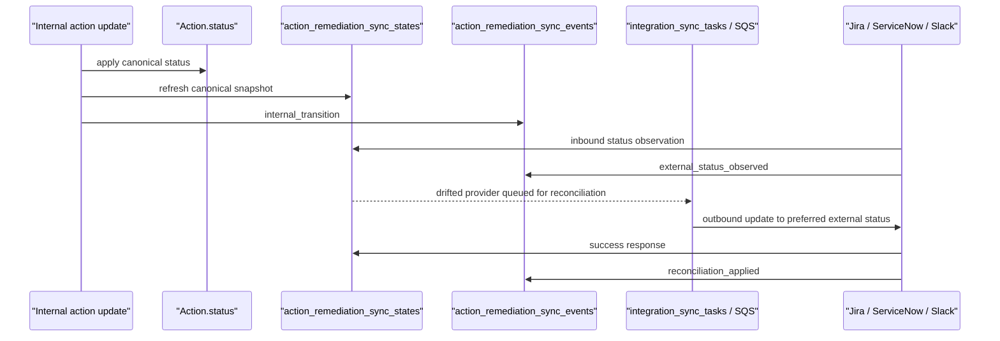
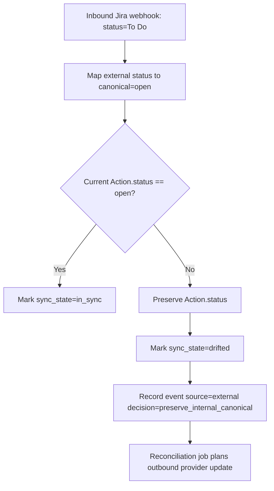

# Remediation System-of-Record Sync

Phase 3 P1.6 makes the platform the authoritative system of record for remediation state.

The canonical remediation status for an action lives in [`Action.status`](/Users/marcomaher/AWS%20Security%20Autopilot/backend/models/action.py). External ticket or chat systems can report status, but they no longer overwrite the platform's canonical action state. Instead, the platform records the observation, marks drift when needed, and reconciles the external system back to the internal canonical state through the existing outbound integration sync rail.

Related docs:
- [Local backend development](/Users/marcomaher/AWS%20Security%20Autopilot/docs/local-dev/backend.md)
- [Handoff-free closure](/Users/marcomaher/AWS%20Security%20Autopilot/docs/features/handoff-free-closure.md)
- [Jira remediation sync runbook](/Users/marcomaher/AWS%20Security%20Autopilot/docs/runbooks/jira-remediation-sync-runbook.md)

## Canonical state model

Authoritative internal remediation states:

| Canonical state | Meaning |
| --- | --- |
| `open` | New remediation work exists and has not started externally or internally. |
| `in_progress` | The remediation is actively being worked. |
| `resolved` | The platform considers the remediation complete. |
| `suppressed` | The platform intentionally closed the remediation without fixing it. |

The canonical transition table is intentionally permissive across those four states so operators, action recompute, and suppress/reopen flows can move an action between any two canonical states without adding a separate transient status model.

## External provider mapping

Preferred outbound statuses come from [`backend/services/action_remediation_state_machine.py`](/Users/marcomaher/AWS%20Security%20Autopilot/backend/services/action_remediation_state_machine.py).

| Provider | `open` | `in_progress` | `resolved` | `suppressed` |
| --- | --- | --- | --- | --- |
| `jira` | `To Do` | `In Progress` | `Done` | `Won't Do` |
| `servicenow` | `New` | `Work in Progress` | `Resolved` | `Cancelled` |
| `slack` | `open` | `in_progress` | `resolved` | `suppressed` |
| `generic` | `open` | `in_progress` | `resolved` | `suppressed` |

Inbound provider statuses are normalized and mapped back into canonical states with provider-specific aliases such as:

| Provider | Example inbound values | Canonical mapping |
| --- | --- | --- |
| `jira` | `To Do`, `Backlog`, `Selected for Development` | `open` |
| `jira` | `In Progress`, `Doing` | `in_progress` |
| `jira` | `Done`, `Closed` | `resolved` |
| `servicenow` | `New`, `Open` | `open` |
| `servicenow` | `Work in Progress`, `Implement` | `in_progress` |
| `servicenow` | `Resolved`, `Closed Complete` | `resolved` |

If an inbound external status maps to a different canonical state than the current `Action.status`, the platform preserves the internal state and records the conflict as drift.

The default table above is the provider baseline, not a forced per-tenant workflow. For Jira projects whose workflow does not truthfully support those defaults, configure tenant-level `status_mapping` and `transition_map` as documented in [Jira remediation sync runbook](/Users/marcomaher/AWS%20Security%20Autopilot/docs/runbooks/jira-remediation-sync-runbook.md).

## Persistence model

P1.6 adds two tables:

| Table | Purpose |
| --- | --- |
| `action_remediation_sync_states` | Current per-action, per-provider synchronization snapshot. |
| `action_remediation_sync_events` | Immutable audit trail for internal transitions, external observations, reconciliation queueing, and reconciliation completion. |

Snapshot rows track:
- `provider`
- `external_ref`
- `external_status`
- `mapped_internal_status`
- `canonical_internal_status`
- `preferred_external_status`
- `sync_status` (`in_sync` or `drifted`)
- `last_source` (`internal`, `external`, or `reconciliation`)
- `resolution_decision`
- `conflict_reason`

Event rows track:
- `event_type`
- `source`
- `internal_status_before`
- `internal_status_after`
- `external_status`
- `mapped_internal_status`
- `preferred_external_status`
- `resolution_decision`
- `decision_detail`
- `idempotency_key`

## Decision rules

1. Internal canonical writes win.
2. External webhook or poll observations never mutate `Action.status`.
3. Drift is explicit.
4. Reconciliation uses the existing `integration_sync_tasks` queue so provider updates stay idempotent and retry-safe.
5. Replayed inbound or reconciliation events reuse `idempotency_key` and do not mutate the snapshot twice.

Resolution decisions currently used in the audit trail:

| Decision | Meaning |
| --- | --- |
| `canonical_update_applied` | Internal canonical status changed. |
| `external_matches_internal` | External status already matches the canonical state. |
| `preserve_internal_canonical` | External status conflicts with canonical state, so internal state remains authoritative. |
| `reconciled_to_internal_canonical` | An outbound sync completed and brought the external provider back in sync. |

## Runtime flow



Webhook conflict example:



## Reconciliation job

Drift reconciliation is exposed through the internal scheduler endpoint:

- `POST /api/internal/reconciliation/remediation-state-sync`
- Required header: `X-Reconciliation-Scheduler-Secret`
- Secret source: `RECONCILIATION_SCHEDULER_SECRET` or fallback `CONTROL_PLANE_EVENTS_SECRET`

Request body:

```json
{
  "tenant_id": "<YOUR_TENANT_ID_HERE>",
  "provider": "jira",
  "action_ids": [
    "<YOUR_ACTION_ID_HERE>"
  ],
  "limit": 200
}
```

`<YOUR_TENANT_ID_HERE>` and `<YOUR_ACTION_ID_HERE>` are environment-specific values. Omit `tenant_id` or `action_ids` when the reconciler should scan all eligible drifted rows within the requested provider and limit.

Queue job:
- `job_type`: `reconcile_action_remediation_sync`

Worker path:
- [`backend/workers/jobs/reconcile_action_remediation_sync.py`](/Users/marcomaher/AWS%20Security%20Autopilot/backend/workers/jobs/reconcile_action_remediation_sync.py)

The worker loads `drifted` sync-state rows, calls manual outbound planning through [`plan_manual_action_sync()`](/Users/marcomaher/AWS%20Security%20Autopilot/backend/services/integration_sync.py), records `reconciliation_queued`, and dispatches the resulting `integration_sync` tasks through SQS.

## Operator notes

- Internal action updates from [`backend/routers/actions.py`](/Users/marcomaher/AWS%20Security%20Autopilot/backend/routers/actions.py) and [`backend/services/action_engine.py`](/Users/marcomaher/AWS%20Security%20Autopilot/backend/services/action_engine.py) now go through the canonical state service instead of assigning `Action.status` directly.
- Inbound provider events processed by [`process_inbound_event()`](/Users/marcomaher/AWS%20Security%20Autopilot/backend/services/integration_sync.py) update external-link metadata and sync-state audit rows, but keep the internal canonical action status unchanged.
- Successful outbound provider sync completion records `reconciliation_applied` and moves the provider snapshot back to `in_sync`.
- For a practical Jira-specific configuration, drift test, and reconciliation checklist, use [Jira remediation sync runbook](/Users/marcomaher/AWS%20Security%20Autopilot/docs/runbooks/jira-remediation-sync-runbook.md).

Environment-specific example:

```bash
curl -X POST http://localhost:8000/api/internal/reconciliation/remediation-state-sync \
  -H "Content-Type: application/json" \
  -H "X-Reconciliation-Scheduler-Secret: <YOUR_RECONCILIATION_SCHEDULER_SECRET>" \
  -d '{"provider":"jira","limit":50}'
```

`<YOUR_RECONCILIATION_SCHEDULER_SECRET>` is environment-specific and should match the configured internal scheduler secret for the target deployment.
