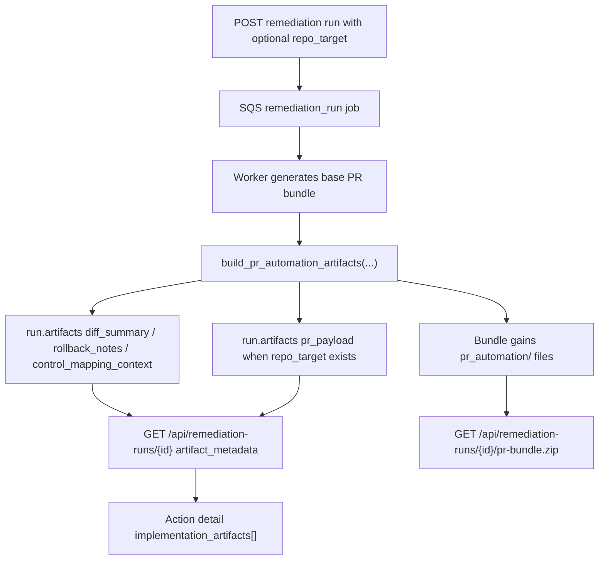

# Repo-Aware PR Automation

This feature extends remediation PR-bundle generation with optional repository metadata so the platform can emit provider-agnostic pull-request drafting artifacts without coupling execution to a single VCS vendor.

## Status

Implemented in Phase 3 P1.3.

## Implemented source files

- `backend/services/pr_automation.py`
- `backend/routers/remediation_runs.py`
- `backend/workers/jobs/remediation_run.py`
- `backend/services/remediation_handoff.py`
- `backend/utils/sqs.py`
- `frontend/src/lib/api.ts`
- `tests/test_phase3_p1_3_repo_aware_pr_automation.py`

## API contract

`POST /api/remediation-runs` and `POST /api/remediation-runs/group-pr-bundle` now accept an additive optional `repo_target` object when the selected run mode produces a PR bundle.

`repo_target` fields:

- `provider` - optional generic provider label. The backend defaults this to `generic_git` when omitted.
- `repository` - required repository slug or URL label.
- `base_branch` - required target branch for the generated PR payload.
- `head_branch` - optional source branch name. The backend autogenerates `autopilot/remediation/<token>-<runid8>` when omitted.
- `root_path` - optional repo-relative directory prefix applied to each generated bundle file when computing repo paths.

If `repo_target` is omitted, the existing non-repo PR bundle flow still works. The worker still enriches the bundle with deterministic automation artifacts, but it does not emit `pr_payload`.

## Generated artifacts

Successful PR-bundle runs now attach additive provider-agnostic artifacts to the remediation run and to the downloadable bundle contents.

Run-level `artifacts` additions:

- `diff_summary`
- `rollback_notes`
- `control_mapping_context`
- `repo_target` when repository metadata is configured
- `pr_payload` when repository metadata is configured

Bundle file additions under `pr_automation/`:

- `pr_automation/diff_summary.json`
- `pr_automation/rollback_notes.md`
- `pr_automation/control_mapping_context.json`
- `pr_automation/pr_payload.json` when `repo_target` is configured

`diff_summary` is deterministic bundle metadata, not a live Git checkout diff. Each mapped file entry records:

- `bundle_path`
- `repo_path`
- `change_type`
- `content_sha256`
- `byte_count`
- `line_count`

The worker also records a bundle-level `fingerprint_sha256` so downstream PR creation or review systems can reproduce the exact generated payload.

## Provider-agnostic PR payload

When `repo_target` is present, the worker emits `pr_payload` with a stable VCS-neutral shape:

- `repo_target`
- `title`
- `commit_message`
- `body_markdown`
- `diff_metadata`
- `rollback_notes`

This payload intentionally avoids GitHub-only, GitLab-only, or Bitbucket-only request fields. A later integration layer can map the same artifact onto a specific provider API.

## Rollback and control context

`rollback_notes` captures a rollback entry for each affected action, including the hydrated rollback command from the remediation strategy catalog when one is available.

`control_mapping_context` attaches the control IDs present in the bundled actions plus any framework mapping rows already known to the backend. The payload explicitly distinguishes:

- `mapped_control_ids`
- `unmapped_control_ids`
- `mappings`

That context is stored both in `run.artifacts` and inside the downloadable bundle so engineering and audit workflows can reuse the same evidence package.

## Handoff integration

`backend/services/remediation_handoff.py` now normalizes the new PR automation outputs so:

- `pr_payload` appears in `artifact_metadata.implementation_artifacts[]`
- `diff_summary`
- `rollback_notes`
- `control_mapping_context`

appear in `artifact_metadata.evidence_pointers[]`

This keeps action-detail and run-detail UX additive while preserving the raw worker `artifacts` payload for existing consumers.

## Frontend flow

Action detail now keeps PR-bundle generation inside the same popup instead of stacking a second modal above `Action Detail`.

- `Generate PR bundle` switches the existing action-detail dialog into the PR-bundle workflow.
- The dialog header adds a `Back to action detail` control so operators can return without dismissing the popup.
- After a PR bundle run is created, the same dialog keeps the `Run progress` view in place until the operator goes back, closes, or opens the dedicated run page.

## Data flow

## Related docs

- [Handoff-free closure](/Users/marcomaher/AWS%20Security%20Autopilot/docs/features/handoff-free-closure.md)
- [Shared Security + Engineering execution guidance](/Users/marcomaher/AWS%20Security%20Autopilot/docs/features/shared-execution-guidance.md)
- [Backend local-dev notes](/Users/marcomaher/AWS%20Security%20Autopilot/docs/local-dev/backend.md)
- [Docs index](/Users/marcomaher/AWS%20Security%20Autopilot/docs/README.md)
