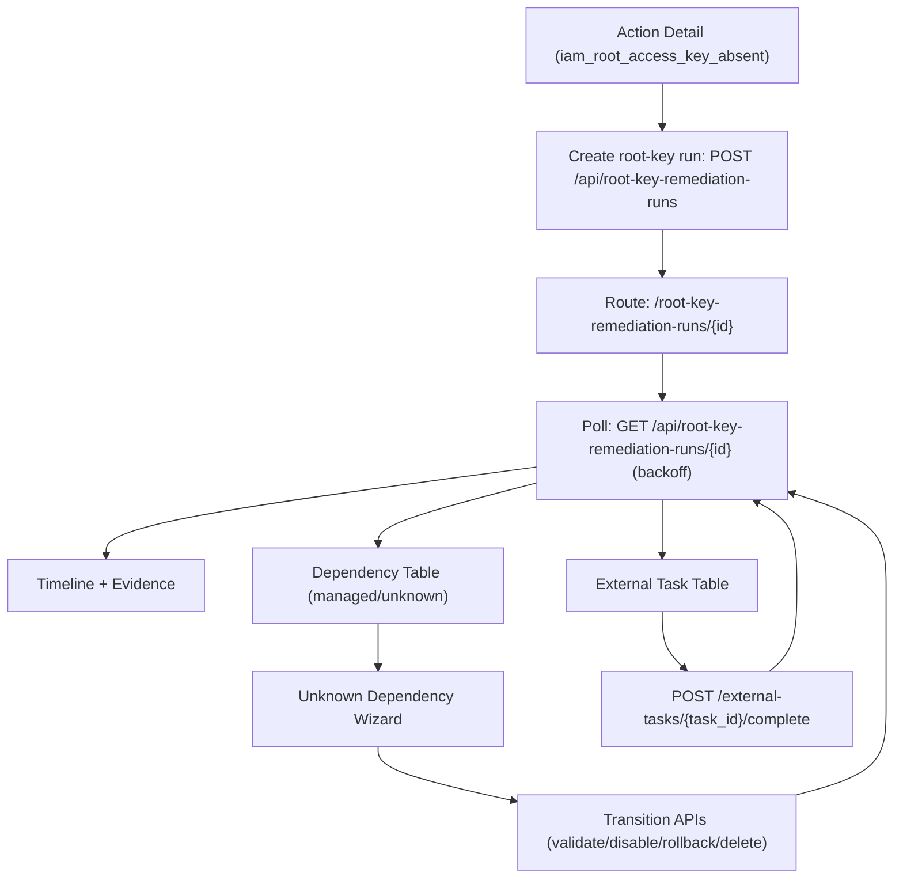

# Root-Key Remediation Lifecycle UI

> Scope date: 2026-03-02
>
> Status: Implemented behind feature flag (`NEXT_PUBLIC_ROOT_KEY_REMEDIATION_UI_ENABLED`).

This document describes the frontend lifecycle UX for root-key remediation orchestration runs (`iam_root_access_key_absent`).

## Scope

Implemented frontend surfaces:

- Action Detail entrypoint:
  - `/Users/marcomaher/AWS Security Autopilot/frontend/src/components/ActionDetailModal.tsx`
  - Adds an `Open root-key lifecycle` action in the root-account-required warning panel.
- Lifecycle route:
  - `/root-key-remediation-runs/{id}`
  - `/Users/marcomaher/AWS Security Autopilot/frontend/src/app/root-key-remediation-runs/[id]/page.tsx`
- Lifecycle component:
  - `/Users/marcomaher/AWS Security Autopilot/frontend/src/components/root-key/RootKeyRemediationLifecycle.tsx`

## Feature Flag

- `NEXT_PUBLIC_ROOT_KEY_REMEDIATION_UI_ENABLED`
  - Default: unset/false.
  - Effect when false: existing behavior preserved; lifecycle route shows disabled notice and Action Detail entrypoint is hidden.

## Lifecycle UX Coverage

The lifecycle UI includes:

1. Run timeline with state, timestamp, and evidence links.
2. Dependency table with managed vs unknown classification.
3. Action-required wizard for unknown dependencies.
4. External migration task completion flow.
5. Rollback status and guidance panel.
6. Final completion summary panel.
7. Polling with retry backoff and resilient error/empty states.
8. Role-based access in UI:
   - Admin users can run transitions and complete tasks.
   - Non-admin users are read-only.

## Data and API Contracts

Primary frontend contract source:

- `/Users/marcomaher/AWS Security Autopilot/frontend/src/lib/api.ts`

Primary backend contract source:

- `/Users/marcomaher/AWS Security Autopilot/backend/routers/root_key_remediation_runs.py`

`GET /api/root-key-remediation-runs/{id}` now returns:

- run snapshot,
- external tasks,
- dependency fingerprints,
- transition events,
- artifact summaries,
- counts (`event_count`, `dependency_count`, `artifact_count`).

## Flow

## Test Coverage

Frontend:

- `/Users/marcomaher/AWS Security Autopilot/frontend/src/components/root-key/RootKeyRemediationLifecycle.test.tsx`
  - Timeline states rendering.
  - Unknown dependency wizard flow.
  - API error rendering and retry.

Backend:

- `/Users/marcomaher/AWS Security Autopilot/tests/test_root_key_remediation_runs_api.py`
  - Root-key run detail payload coverage for dependencies/events/artifacts.
