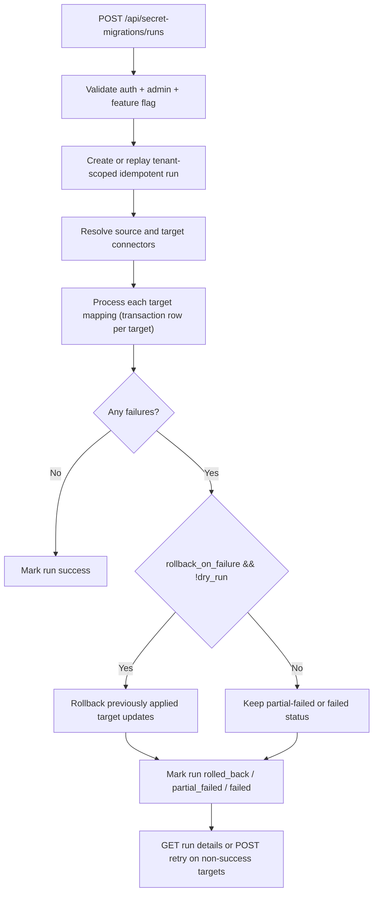

# Secret Migration Connectors

## Status

> Status: Implemented behind feature flag (`SECRET_MIGRATION_CONNECTORS_ENABLED`).

## Goal

Provide tenant-scoped, retry-safe secret migration across supported backends with:

- strict tenant isolation for every read/write,
- idempotent create/retry behavior,
- fail-closed error handling,
- redacted transaction artifacts (no plaintext secret values in persisted logs),
- rollback support for applied updates.

## API Contract

- `POST /api/secret-migrations/runs`
- `GET /api/secret-migrations/runs/{run_id}`
- `POST /api/secret-migrations/runs/{run_id}/retry`

Headers:

- `Idempotency-Key` is required for `POST /runs`.
- `X-Secret-Migration-Contract-Version` response header value: `2026-03-02`.
- `X-Correlation-Id` request/response tracing header.

## Connector Matrix

| Connector | Source | Target | Notes |
|---|---:|---:|---|
| `aws_secrets_manager` | ✅ | ✅ | Uses tenant-scoped AWS account role assumption. |
| `aws_ssm_parameter_store` | ✅ | ✅ | Uses tenant-scoped AWS account role assumption. |
| `github_actions` | ❌ | ✅ | Write-only backend; source reads are fail-closed. |

CI backends are allowlisted through `SECRET_MIGRATION_APPROVED_CI_BACKENDS`.

## Execution Flow

## Persistence

The feature adds additive schema:

- `secret_migration_runs`
- `secret_migration_transactions`

Both tables are tenant-scoped, and per-target transaction rows are unique by `(tenant_id, run_id, target_ref)`.

## Dry-Run Behavior

When `dry_run=true`:

- source reads are still executed for validation,
- target writes are skipped,
- per-target transaction status is `skipped`,
- run can still fail if source access/connector validation fails.

## Partial Failure + Retry

- Per-target failures are isolated in `secret_migration_transactions`.
- `POST /runs/{id}/retry` reprocesses non-success targets only (`failed`, `rolled_back`, `rollback_failed`).
- Repeated retries are safe because target connector updates are idempotent and transaction status is convergent.

## Rollback Semantics

- AWS Secrets Manager: version-stage rollback or delete-if-new.
- SSM Parameter Store: rollback by previous version from parameter history or delete-if-new.
- GitHub Actions: fail-closed for pre-existing secrets because value restore is not guaranteed; rollback supports delete for newly created secrets.

## Security Properties

- No plaintext secret values are stored in DB rows.
- Transaction metadata and JSON payloads are redacted for secret-like keys.
- Error payloads are sanitized to avoid leaking secret material.
- Tenant isolation is enforced on every run and run lookup.

## Related Docs

- [Deployment Secrets Configuration](/Users/marcomaher/AWS%20Security%20Autopilot/docs/deployment/secrets-config.md)
- [Documentation Index](/Users/marcomaher/AWS%20Security%20Autopilot/docs/README.md)
