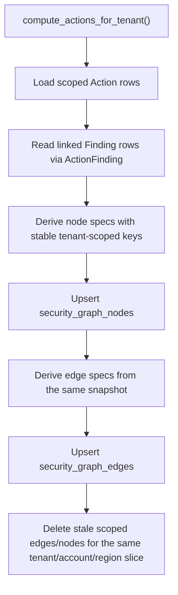

# Security Graph Foundation

This feature adds the first persisted tenant-scoped security graph built from existing findings and actions.

Implemented source files:
- `backend/models/security_graph_node.py`
- `backend/models/security_graph_edge.py`
- `backend/services/security_graph.py`
- `backend/services/risk_signals.py`
- `backend/services/action_engine.py`
- `alembic/versions/0041_security_graph_foundation.py`

## Status

Implemented in Phase 3 P1.1.

Graph-backed action detail payloads are now delivered by Phase 3 P1.2:

- [Graph-backed action context](/Users/marcomaher/AWS%20Security%20Autopilot/docs/features/graph-backed-action-context.md)

## What it does

- Persists a tenant-scoped graph of `resource`, `identity`, `exposure`, `finding`, and `action` nodes.
- Persists deterministic edges between those nodes using stable tenant-scoped keys.
- Reuses existing `Action`, `ActionFinding`, `Finding.resource_key`, `Finding.raw_json.relationship_context`, and action/finding score signals instead of introducing a second risk-scoring source of truth.
- Runs automatically during `compute_actions_for_tenant`, so a normal action recompute also refreshes the graph for the same tenant/account/region scope.

## Data model

### `security_graph_nodes`

- `tenant_id`
- `account_id`
- `region`
- `node_type`
- `node_key`
- `display_name`
- `metadata_json`

Node uniqueness is enforced by `uq_security_graph_nodes_tenant_key` on `(tenant_id, node_key)`.

### `security_graph_edges`

- `tenant_id`
- `account_id`
- `region`
- `edge_type`
- `edge_key`
- `source_node_id`
- `target_node_id`
- `metadata_json`

Edge uniqueness is enforced by `uq_security_graph_edges_tenant_key` on `(tenant_id, edge_key)`.

## Current node and edge types

### Node types

- `resource`
- `identity`
- `exposure`
- `finding`
- `action`

### Edge types

- `action_derived_from_finding`
- `action_targets_resource`
- `action_targets_identity`
- `finding_targets_resource`
- `finding_targets_identity`
- `action_indicates_exposure`
- `finding_indicates_exposure`

## Population flow

The authoritative integration point is:

- `backend/services/action_engine.py`

The graph builder itself is:

- `backend/services/security_graph.py`

## Exposure semantics

Exposure nodes reuse the same score-component thresholds already used by toxic-combination logic:

- `internet_exposure`
- `privilege_weakness`
- `sensitive_data`
- `exploit_signals`

Those thresholds now live in:

- `backend/services/risk_signals.py`

That keeps graph exposure nodes aligned with existing prioritization behavior instead of inventing a second signal taxonomy.

## Idempotency and tenant isolation

- Reprocessing the same action scope reuses the same `node_key` and `edge_key`, so reruns update existing rows instead of inserting duplicates.
- The graph sync deletes stale nodes/edges only inside the same tenant/account/region slice being recomputed.
- Action-to-finding graph edges are created only when the linked finding matches the same `tenant_id`, `account_id`, and compatible region scope. Cross-tenant links are ignored even if an inconsistent `action_findings` row exists.

## Limitations

- The current graph is derived from persisted findings/actions only; it does not yet ingest independent inventory-only relationships or non-action-producing entity graphs.
- The current action-detail graph context still derives from persisted finding/inventory neighborhoods instead of traversing the `security_graph_nodes` / `security_graph_edges` tables directly.
- Account-scoped identity nodes remain intentionally conservative and only surface when the linked finding payload contains explicit identity hints.

## Related docs

- [Graph-backed action context](/Users/marcomaher/AWS%20Security%20Autopilot/docs/features/graph-backed-action-context.md)
- [Toxic-combination prioritization](/Users/marcomaher/AWS%20Security%20Autopilot/docs/features/toxic-combination-prioritization.md)
- [Action score explainability](/Users/marcomaher/AWS%20Security%20Autopilot/docs/features/action-score-explainability.md)
- [Ownership-based risk queues](/Users/marcomaher/AWS%20Security%20Autopilot/docs/features/ownership-risk-queues.md)
- [AWS Security Autopilot documentation index](/Users/marcomaher/AWS%20Security%20Autopilot/docs/README.md)
