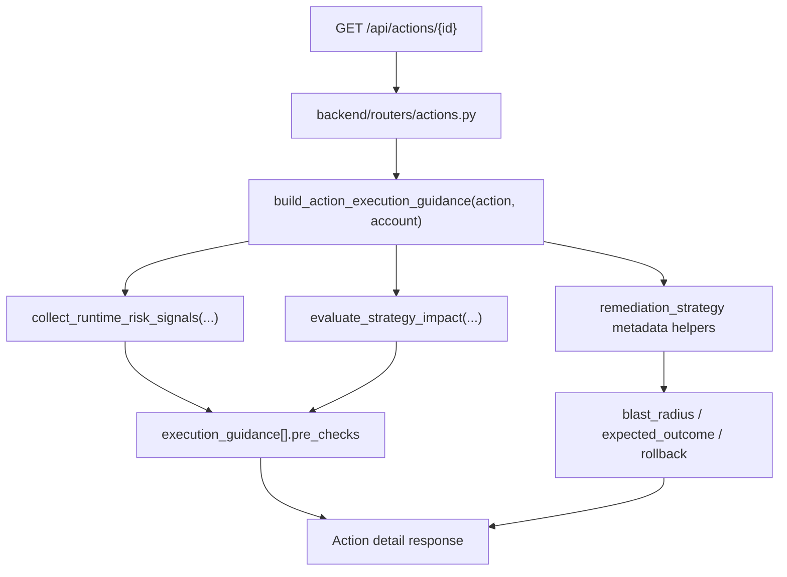

# Shared Security + Engineering Execution Guidance

This feature adds implementation-ready execution guidance to action detail responses so security and engineering can work from the same contract without a separate handoff step.

## Status

Implemented in Phase 3 P0.7.

## Implemented source files

- `backend/services/action_execution_guidance.py`
- `backend/routers/actions.py`
- `backend/services/remediation_risk.py`
- `backend/services/remediation_runtime_checks.py`
- `backend/services/remediation_strategy.py`

## API contract

`GET /api/actions/{action_id}` now returns additive `execution_guidance[]`.

Each item represents one actionable, non-exception remediation strategy and includes:

- `strategy_id`
- `label`
- `mode` (`direct_fix` or `pr_only`)
- `recommended`
- `blast_radius`
- `blast_radius_summary`
- `pre_checks[]`
  - `code`
  - `status`
  - `message`
- `expected_outcome`
- `post_checks[]`
  - `code`
  - `status`
  - `message`
- `rollback`
  - `summary`
  - `command`
  - `notes[]`

The contract is additive. Existing action detail fields remain unchanged.

## How guidance is built

The builder intentionally reuses the existing remediation safety stack instead of introducing a second risk model:

- `collect_runtime_risk_signals(...)` provides best-effort live AWS context and evidence.
- `evaluate_strategy_impact(...)` supplies dependency checks and recommendation context.
- `get_blast_radius(...)`, `get_estimated_resolution_time(...)`, `get_rollback_command(...)`, and strategy metadata provide operator-facing execution details.

Runtime probes remain best-effort and fail closed in the guidance:

- missing account metadata or role access does not produce blank fields,
- dependency checks still appear with `fail`, `warn`, or `unknown` statuses,
- rollback guidance still remains non-empty even when runtime evidence is limited.

## Mode-specific behavior

`execution_guidance[]` is mode-aware by design.

### `direct_fix`

- `pre_checks[]` includes a live-change warning because AWS state mutates immediately after approval.
- `expected_outcome` describes immediate AWS-side mutation and the expected Security Hub resolution window.
- `post_checks[]` emphasizes remediation-run success, scoped verification, and immediate re-evaluation when supported.
- `rollback.summary` assumes an operator may need to back out a live change.

### `pr_only`

- `pre_checks[]` includes repository/deployment ownership confirmation before generating the bundle.
- `expected_outcome` describes a reviewable infrastructure change that must be merged and applied through the normal IaC path.
- `post_checks[]` emphasizes diff review, plan/apply evidence, and later control closure confirmation.
- `rollback.summary` assumes rollback happens through version control and the same deployment workflow.

Exception-only strategies are intentionally omitted from `execution_guidance[]` because this contract is focused on executable remediation paths.

## Rollback hydration

Rollback commands continue to come from the shared remediation strategy catalog, but the action-detail builder now fills placeholders when reliable action/runtime context is available.

Examples:

- `<ACCOUNT_ID>` from the action account scope
- `<BUCKET_NAME>` from bucket target identifiers or collected runtime evidence
- `<SECURITY_GROUP_ID>` from the target ID or runtime evidence
- `<RECORDER_NAME>` / `<TRAIL_NAME>` from collected runtime evidence or safe defaults

If a value cannot be derived safely, the placeholder remains visible instead of guessing.

## Data flow

## Related docs

- [Handoff-free closure](/Users/marcomaher/AWS%20Security%20Autopilot/docs/features/handoff-free-closure.md)
- [Remediation safety model](/Users/marcomaher/AWS%20Security%20Autopilot/docs/remediation-safety-model.md)
- [Ownership-based risk queues](/Users/marcomaher/AWS%20Security%20Autopilot/docs/features/ownership-risk-queues.md)
- [Communication + Governance layer](/Users/marcomaher/AWS%20Security%20Autopilot/docs/features/communication-governance-layer.md)
- [Docs index](/Users/marcomaher/AWS%20Security%20Autopilot/docs/README.md)
