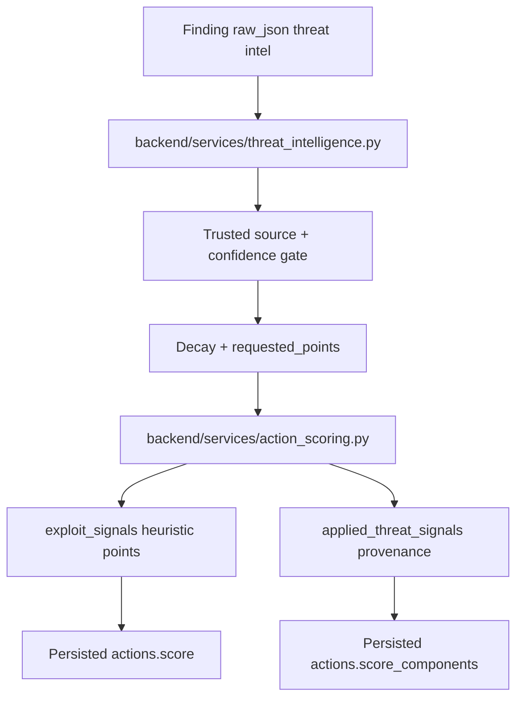

# Threat-Intelligence Weighting

This feature refines exploit scoring by giving bounded priority boosts only to trusted active-exploitation signals, while persisting enough provenance for operators and auditors to understand every applied boost.

Implemented source files:
- `backend/services/threat_intelligence.py`
- `backend/services/action_scoring.py`
- `backend/routers/actions.py`

## Live validation status

Production validation on March 12, 2026 is now live-PASS for the implemented `P2.1` / `P2.2` contract.

Observed production proof:
- the trusted Config synthetic finding resolves to action `73097c11-174c-4597-85a2-9af793842e8d`
- the action detail explanation says `0 heuristic points plus 10 decayed threat-intel points`
- the live drawer visibly renders `Threat-intel provenance`, `CVE-2026-9001`, `CISA KEV`, confidence, requested/applied points, and decay

Evidence:
- [20260312T165611Z-phase3-p2-grouped-fix-validation](/Users/marcomaher/AWS%20Security%20Autopilot/docs/test-results/live-runs/20260312T165611Z-phase3-p2-grouped-fix-validation/notes/final-summary.md)
- [20260312T163257Z-phase3-p2-fix-validation](/Users/marcomaher/AWS%20Security%20Autopilot/docs/test-results/live-runs/20260312T163257Z-phase3-p2-fix-validation/)

## Trusted signals

The current adapter accepts these trusted signal families:

| Canonical source | Accepted aliases | Confidence floor | Base points |
| --- | --- | ---: | ---: |
| `cisa_kev` | `cisa_kev`, `kev`, `known_exploited_vulnerabilities`, `known_exploited_vulnerability` | `0.95` | `10` |
| `high_confidence_exploitability` | `high_confidence_exploitability`, `epss_high_confidence`, `trusted_exploitability_feed`, `vendor_high_confidence_exploitability` | `0.75` | `6` |

`cisa_kev` is treated as active by definition once it passes the trust and confidence checks.

`high_confidence_exploitability` also requires one of:
- `active=true`
- `exploitable=true`
- `high_confidence=true`

If a candidate signal has an unknown source, `trusted=false`, or confidence below the source floor, it is ignored and scoring continues normally.

## Accepted finding payload shapes

The adapter reads threat intel from these existing finding surfaces:
- top-level `raw_json.ThreatIntel`, `raw_json.ThreatIntelligence`, or `raw_json.threatIntel`
- `raw_json.ProductFields["aws/autopilot/threat_intel"]`
- `raw_json.ProductFields["aws/autopilot/threat_intelligence"]`
- `raw_json.ProductFields["threat_intel"]`
- `raw_json.ProductFields["threat_intelligence"]`
- `raw_json.Vulnerabilities[].ThreatIntel`
- `raw_json.Vulnerabilities[].ThreatIntelligence`
- `raw_json.Vulnerabilities[].KnownExploited`
- `raw_json.Vulnerabilities[].known_exploited`

JSON strings and native arrays/maps are both accepted. Missing or malformed values are skipped.

## Score behavior

Threat intel is folded into `score_components["exploit_signals"]`.

Current caps:
- the exploit factor still caps at `15` total points
- trusted threat-intel contribution caps at `10` points before factor headroom is applied
- if heuristic exploit scoring already consumed some of the `15` exploit points, only the remaining headroom can be filled by threat intel
- signal decay uses `ACTIONS_THREAT_INTELLIGENCE_HALF_LIFE_HOURS` and currently defaults to `72` hours

This keeps threat weighting additive but bounded. A KEV-linked signal can promote a neutral exploit score up to `10` points, but it cannot push the exploit factor past `15`.

## Stored provenance

When trusted threat intel is present, `GET /api/actions` and `GET /api/actions/{id}` expose it through:

- `score_components["exploit_signals"]["heuristic_points"]`
- `score_components["exploit_signals"]["threat_intel_points_requested"]`
- `score_components["exploit_signals"]["threat_intel_points_applied"]`
- `score_components["exploit_signals"]["threat_intel_max_points"]`
- `score_components["exploit_signals"]["factor_max_points"]`
- `score_components["exploit_signals"]["applied_threat_signals"][]`

Each `applied_threat_signals[]` item currently includes:
- `source`
- `source_label`
- `signal_type`
- `identifier`
- `cve_id`
- `timestamp`
- `confidence`
- `requested_points`
- `applied_points`
- `capped`

The explainability layer also surfaces the boost through the normal `exploit_signals` score factor.

`score_factors[].provenance[]` now includes:
- `source`
- `observed_at`
- `decay_applied`
- `base_contribution`
- `final_contribution`

Zero-point decay remains visible in `score_factors[].provenance[]`, so a signal that has aged out still explains why no current threat-intel points were applied.

## Fail-closed behavior

Threat intel does not change the score when:
- the feed source is not trusted
- the feed marks `trusted=false`
- the confidence value is below the source floor
- a high-confidence exploitability signal is not marked active/exploitable/high-confidence
- the payload is malformed
- the exploit factor has no remaining cap headroom

This keeps scoring available even when feeds are absent or partially populated.

## Related docs

- [Action score explainability](/Users/marcomaher/AWS%20Security%20Autopilot/docs/features/action-score-explainability.md)
- [Toxic-combination prioritization](/Users/marcomaher/AWS%20Security%20Autopilot/docs/features/toxic-combination-prioritization.md)
- [AWS Security Autopilot documentation index](/Users/marcomaher/AWS%20Security%20Autopilot/docs/README.md)
