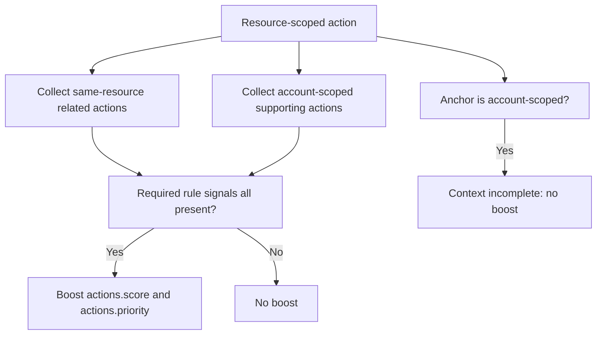

# Toxic-Combination Prioritization

This feature adds a conservative attack-path-lite boost on top of the existing P0.1 action score.

Implemented source files:
- `backend/services/toxic_combinations.py`
- `backend/services/finding_relationship_context.py`
- `backend/services/action_engine.py`
- `backend/services/action_scoring.py`
- `backend/routers/actions.py`
- `backend/workers/jobs/ingest_findings.py`
- `scripts/backfill_finding_relationship_context.py`

## Status

Implemented in Phase 3 P0.3.

## What it does

- Detects explicit toxic combinations across related actions that came from open findings.
- Applies an additive score boost only when every required signal in a rule is present and the related relationship context is both complete and above the minimum confidence threshold.
- Persists the boosted score back onto:
  - `actions.score`
  - `actions.priority`
  - `actions.score_components["toxic_combinations"]`
- Persists `actions.score_components["context_incomplete"]` so the API can show when toxic-combination promotion was withheld because relationship context was missing or low-confidence.
- Reuses the existing `/api/actions` ordering and batch-group logic, so boosted priorities are visible without a separate API path.

## Safe default rule

The default rule is intentionally narrow:

| Rule ID | Required signals | Boost |
| --- | --- | ---: |
| `public_exposure_privilege_sensitive_data` | `internet_exposure` + `privilege_weakness` + `sensitive_data` | `15` |

Only resource-scoped actions can act as the anchor for this rule. Account-scoped actions such as root-account hygiene findings can contribute supporting context, but they do not become boosted anchors themselves.

## Relationship model

The current implementation is fail-closed and only evaluates the following neighborhood after explicit relationship context is available:

- same tenant
- same AWS account
- same region, or region plus global/account-scoped context
- same `resource_id` for resource-scoped related actions
- optional account-scoped supporting actions

Relationship context is considered complete only when one of these payloads is present and marks the context complete with confidence `>= 0.75`:

- `finding.raw_json.relationship_context`
- `finding.raw_json.RelationshipContext`
- `finding.raw_json.graph_context`
- `finding.raw_json.GraphContext`
- `finding.raw_json.ProductFields["aws/autopilot/relationship_context"]`
- `finding.raw_json.ProductFields["aws/autopilot/graph_context"]`

If the anchor action is account-scoped, the relationship payload is missing, or the confidence is below threshold, the engine records `context_incomplete` and applies no boost.

### Authoritative producer

Security Hub ingest now writes `finding.raw_json.relationship_context` on every upsert using the same canonical finding metadata already persisted on the row:

- `account_id`
- `region`
- `resource_id`
- `resource_type`
- `resource_key`

The enriched payload is deterministic and additive:

- `complete`
- `confidence`
- `scope`
- `source`
- `account_id`
- `region`
- `resource_id`
- `resource_type`
- `resource_key`
- `missing_fields`

`backend/services/finding_relationship_context.py` marks the payload `complete=true` with `confidence=1.0` only when the canonical identifiers required for that scope are present:

- resource-scoped findings require `account_id`, `resource_id`, `resource_type`, and `resource_key`
- account-scoped findings require `account_id`, `resource_type`, and `resource_key`
- account-region scoped findings require `account_id`, `region`, `resource_type`, and `resource_key`

If the canonical identifiers are incomplete, the payload stays fail-closed with `complete=false`, `confidence=0.0`, and populated `missing_fields`.



## API behavior

`GET /api/actions` and `GET /api/actions/{id}` expose the result through the existing score contract:

- `score` and `priority` include the toxic-combination boost when a rule matches.
- `GET /api/actions/{id}` now includes additive `context_incomplete` so action detail can explicitly show when relationship context was not good enough to apply a boost.
- `score_components["toxic_combinations"]` includes:
  - `points`
  - `context_incomplete`
  - `matched_rule_ids`
  - `context_incomplete_rule_ids`
  - `missing_signals`
  - `signals`
  - `explanation`
- `score_factors` includes a `toxic_combinations` factor so the boost, or the fail-closed non-boost reason, is explainable.

Batch-mode action lists also inherit the boosted value because they already use the highest member action score in the group.

## Configuration

Environment variables:

- `ACTIONS_TOXIC_COMBINATIONS_ENABLED=true`
- `ACTIONS_TOXIC_COMBINATION_MAX_BOOST=15`
- `ACTIONS_TOXIC_COMBINATION_RULES_JSON=''`

`ACTIONS_TOXIC_COMBINATION_RULES_JSON` accepts an optional JSON array of explicit rule objects. Each rule supports:

- `rule_id`
- `label`
- `required_signals`
- `boost_points`
- `anchor_signals`
- `require_resource_anchor`
- `allow_account_scope_support`

If the JSON is invalid or empty, the implementation falls back to the default built-in rule.

## Backfill existing findings

Existing Security Hub findings created before this producer shipped will not gain `relationship_context` until they are re-ingested or backfilled.

Safest repo-native backfill:

```bash
python3 scripts/backfill_finding_relationship_context.py \
  --tenant-id <YOUR_TENANT_ID_HERE> \
  --account-id <YOUR_ACCOUNT_ID_HERE> \
  --region <YOUR_REGION_HERE> \
  --recompute-actions
```

`<YOUR_TENANT_ID_HERE>` is environment-specific and should be the tenant you want to refresh. Scope `account_id` and `region` to the narrowest validation slice you need.

If fresh AWS data is preferred, rerun Security Hub ingest for the same account/region and then recompute actions. The persisted producer path is the same because `backend/workers/jobs/ingest_findings.py` writes the authoritative `relationship_context` payload during every upsert.

## Limitations

- The neighborhood is computed from the current recompute scope, so out-of-scope actions are intentionally not inferred into the path.
- The current release supports explicit rule-based combinations only; it is not a full security graph.
- Boosts are capped by `ACTIONS_TOXIC_COMBINATION_MAX_BOOST`.
- Missing or low-confidence relationship data is conservative by design: no boost is applied, even if the existing same-resource/account heuristics would otherwise have matched.
- The authoritative producer currently enriches Security Hub findings, which is sufficient for the current in-scope action engine. Non-Security-Hub finding sources remain outside this toxic-combination contract until they become action-producing inputs.

## Related docs

- [Action score explainability](/Users/marcomaher/AWS%20Security%20Autopilot/docs/features/action-score-explainability.md)
- [Ownership-based risk queues](/Users/marcomaher/AWS%20Security%20Autopilot/docs/features/ownership-risk-queues.md)
- [AWS Security Autopilot documentation index](/Users/marcomaher/AWS%20Security%20Autopilot/docs/README.md)
