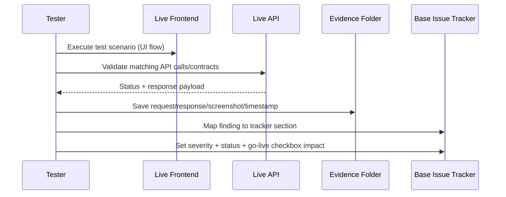

# Live SaaS E2E Testing Runbook (Tracker-Driven)

This runbook operationalizes end-to-end live testing for AWS Security Autopilot and maps every result directly into the base tracker.

## Scope and Source of Truth

- Primary tracker: `docs/live-e2e-testing/00-BASE-ISSUE-TRACKER.md`
- Live frontend target: `https://ocypheris.com`
- Live backend target: `https://api.ocypheris.com`
- Required execution order: Wave 1 -> Wave 9 (Tests 01 -> 35)

## Artifacts Produced Per Run

For each run, create a date-stamped artifact folder under `docs/test-results/live-runs/`.
Use:

```bash
bash scripts/init_live_e2e_run.sh
```

This creates:
- Run metadata file
- Wave folders
- Per-test markdown stubs (`test-01.md` ... `test-35.md`)
- Evidence folders for API/UI/screenshots
- Snapshot of `docs/live-e2e-testing/00-BASE-ISSUE-TRACKER.md`

## End-to-End Execution Flow



## One-Time Setup Before Wave 1

1. Prepare three identities:
   - Admin user (primary tenant)
   - Member user (same tenant)
   - Separate user in second tenant (isolation checks)
2. Prepare AWS account states:
   - One account for normal platform tests
   - One account/state for adversarial tests (23-28)
3. Initialize the run folder:

```bash
bash scripts/init_live_e2e_run.sh
```

4. In `docs/live-e2e-testing/00-BASE-ISSUE-TRACKER.md`, set `Last updated` to current run timestamp.

## Wave 7 Adversarial Fixture Preparation

Use this section before Tests `23` to `28`. The retained March 30, 2026 package was blocked because these AWS fixtures were not actually seeded.

> ⚠️ This is a validation/setup workflow, not a product-bug diagnosis. Do not mark Wave 7 ready unless the AWS state was really provisioned in the target test account.

> ⚠️ Run these scripts only in an isolated test account. Several checked-in scripts still contain `<YOUR_...>` placeholders and need operator-local value substitution before execution.

> ✅ March 30, 2026 closure proof now exists in [20260330T161251Z-poi016-wave7-rerun](/Users/marcomaher/AWS%20Security%20Autopilot/docs/test-results/live-runs/20260330T161251Z-poi016-wave7-rerun/notes/final-summary.md). Reuse that package as the current template for fixture seeding, target-action verification, and the remaining non-setup blockers.

### Canonical source docs

- [Architecture design registry](/Users/marcomaher/AWS%20Security%20Autopilot/docs/prod-readiness/07-architecture-design.md)
- [A-series adversarial resources](/Users/marcomaher/AWS%20Security%20Autopilot/docs/prod-readiness/07-task4-a-series-resources.md)
- [B-series adversarial resources](/Users/marcomaher/AWS%20Security%20Autopilot/docs/prod-readiness/07-task5-b-series-resources.md)
- [POI-016 backlog packet](/Users/marcomaher/AWS%20Security%20Autopilot/docs/live-e2e-testing/production-open-issues-agent-backlog.md#poi-016)

### Real script path in repo

1. Seed Architecture 1:
   - [08-task2-deploy-arch1.sh](/Users/marcomaher/AWS%20Security%20Autopilot/docs/prod-readiness/08-task2-deploy-arch1.sh)
   - Requires exported `ACCOUNT_ID`, `AWS_REGION`, `ARCH1_RDS_MASTER_USERNAME`, and `ARCH1_RDS_MASTER_PASSWORD`.
   - Prompts for an explicit interactive `CONFIRM`.
2. Seed Architecture 2:
   - [08-task3-deploy-arch2.sh](/Users/marcomaher/AWS%20Security%20Autopilot/docs/prod-readiness/08-task3-deploy-arch2.sh)
   - Requires exported `ACCOUNT_ID`, `AWS_REGION`, `ARCH2_RDS_MASTER_USERNAME`, `ARCH2_RDS_MASTER_PASSWORD`, and `ENABLE_ARCH2_DEPLOY=true`.
3. Reintroduce the adversarial states:
   - [08-task4-reset-arch1.sh](/Users/marcomaher/AWS%20Security%20Autopilot/docs/prod-readiness/08-task4-reset-arch1.sh)
   - [08-task5-reset-arch2.sh](/Users/marcomaher/AWS%20Security%20Autopilot/docs/prod-readiness/08-task5-reset-arch2.sh)
4. Execute the Wave 7 reruns through the normal tracker workflow in this document.
5. Tear the fixtures down after reruns:
   - [08-task6-teardown-arch1-groupA.sh](/Users/marcomaher/AWS%20Security%20Autopilot/docs/prod-readiness/08-task6-teardown-arch1-groupA.sh)
   - [08-task6-teardown-arch1-groupB.sh](/Users/marcomaher/AWS%20Security%20Autopilot/docs/prod-readiness/08-task6-teardown-arch1-groupB.sh)
   - [08-task6-teardown-arch1-full.sh](/Users/marcomaher/AWS%20Security%20Autopilot/docs/prod-readiness/08-task6-teardown-arch1-full.sh)
   - [08-task7-teardown-arch2-groupA.sh](/Users/marcomaher/AWS%20Security%20Autopilot/docs/prod-readiness/08-task7-teardown-arch2-groupA.sh)
   - [08-task7-teardown-arch2-groupB.sh](/Users/marcomaher/AWS%20Security%20Autopilot/docs/prod-readiness/08-task7-teardown-arch2-groupB.sh)
   - [08-task7-teardown-arch2-full.sh](/Users/marcomaher/AWS%20Security%20Autopilot/docs/prod-readiness/08-task7-teardown-arch2-full.sh)

### Wave 7 test-to-fixture mapping

| Test | Focus | Fixture(s) to confirm before rerun | Notes |
|---|---|---|---|
| 23 | Adversarial S3 blast radius | `arch1_bucket_website_a1` plus `arch1_bucket_evidence_b1` | A1 stays website/public; B1 stays non-website with complex policy preserved. |
| 24 | Adversarial SG dependency chain | `arch1_sg_dependency_a2` plus `arch1_sg_reference_a2` | Keep the EC2/RDS/reference-chain dependencies intact. |
| 25 | Adversarial IAM multi-principal | `arch2_shared_compute_role_a3` | Retained Wave 7 IAM flow later hit root-gated apply. Treat root-safe execution as separate operator prep. |
| 26 | Complex S3 policy preservation | `arch1_bucket_evidence_b1` | Dedicated helper exists at [run_wave7_test26_closure.sh](/Users/marcomaher/AWS%20Security%20Autopilot/scripts/live_e2e/run_wave7_test26_closure.sh). |
| 27 | Mixed SG rule preservation | `arch1_sg_app_b2` | Legitimate rules must remain alongside the intentional public SSH rule before rerun. |
| 28 | IAM inline + managed policy preservation | `arch2_mixed_policy_role_b3` | Root-safe execution path is still operator-owned. |

### Operator-owned prerequisites

- Architecture 1 reset and teardown scripts still use literal placeholder values by default. Update them in a local working copy or export equivalent values where supported before execution.
- Tests `25` and `28` are not fully runnable from repo automation alone. Use the [root-credentials-required IAM root access-key runbook](/Users/marcomaher/AWS%20Security%20Autopilot/docs/prod-readiness/root-credentials-required-iam-root-access-key-absent.md) for approvals, root identity checks, and manual apply evidence.
- `POI-016` is no longer open after the March 30 rerun package above. The remaining blockers are the per-test product/runtime issues preserved in that package, especially `IAM.4`.

## Standard Loop (Apply to Every Test)

1. Open the specific per-test file in the current run folder.
2. Record preconditions (identity, tenant, account, region, prerequisite IDs/tokens).
3. Execute positive path and negative path.
4. Validate auth boundary behavior where relevant (no token, wrong role, wrong tenant).
5. Capture evidence in the run folder:
   - endpoint + method
   - request payload
   - response status/body
   - UTC timestamp
   - screenshot for UI-visible defects
   - browser console dump for UI-visible flows
6. Mark per-test outcome: `PASS`, `FAIL`, `PARTIAL`, or `BLOCKED`.
7. Update tracker sections immediately:
   - Section 1: missing endpoint (`404`)
   - Section 2: frontend wiring/shape mismatch
   - Section 3: security/isolation/auth severity
   - Section 4: logic/behavior bug
   - Section 5: adversarial results (Tests 23-28)
   - Section 6: partial implementation
   - Section 7: environment/infrastructure drift
8. If the test affects release gates, update Section 8 checkboxes.
9. At end of each wave, update Quick Status Board counts.
10. For retests after fixes, update Section 9 changelog.
11. For explicit deferrals, update Section 10 with mitigation and revisit milestone.

## Wave Order and Test Coverage

| Wave | Tests | Focus |
|---|---|---|
| Wave 1 | 01 | Platform/API health, connectivity baseline |
| Wave 2 | 02-04 | Signup, login/session behavior, password/reset paths |
| Wave 3 | 05-08 | Onboarding, account connect, invite and service-readiness paths |
| Wave 4 | 09-12 | Findings/ingest behavior and multi-tenant isolation/security |
| Wave 5 | 13-16 | Findings/action detail contracts, remediation options, recompute/action endpoints |
| Wave 6 | 17-22 | PR bundle generation/download/auth, internal endpoints, exports, baseline report |
| Wave 7 | 23-28 | Adversarial architecture/resource validation (blast-radius and preservation checks) |
| Wave 8 | 29-33 | Ingest sync/freshness, rate limiting, RBAC boundaries, audit-log security, PR-proof content |
| Wave 9 | 34-35 | Full regression + final go-live blocker closure sweep |

> ❓ Needs verification: Detailed scripted definitions for Tests 34-35 are not codified in current repo artifacts; this runbook treats them as full-regression and final gate-closure passes.

## Severity and Status Discipline

Use tags exactly as defined in the tracker:

- `🔴 BLOCKING`
- `🟠 HIGH`
- `🟡 MEDIUM`
- `🔵 LOW`
- `✅ FIXED`
- `⚪ SKIP/NA`

Escalate to `🔴 BLOCKING` immediately for:
- cross-tenant data exposure
- auth bypass/admin-boundary failure
- internal endpoint exposure
- token invalidation/session security failures

Do not leave `TBD` in observed behavior after execution.

## Required Assertions in Every Wave

1. Positive path success behavior
2. Negative path/error handling behavior
3. Auth boundary behavior
4. Contract-shape compatibility with frontend requirements
5. Idempotency/retry behavior for mutating operations
6. Auditability (evidence exists and is traceable)
7. Console cleanliness for UI flows (no React production errors, hydration mismatches, or other unexpected runtime errors)

## Acceptance Criteria for a Completed Run

1. Every executed test has an evidence artifact and per-test result file.
2. Every detected issue is mapped into one primary tracker section.
3. Quick Status Board is updated for all completed waves.
4. Section 8 reflects current go-live gate status.
5. Section 9 includes all retested fixes with outcomes.
