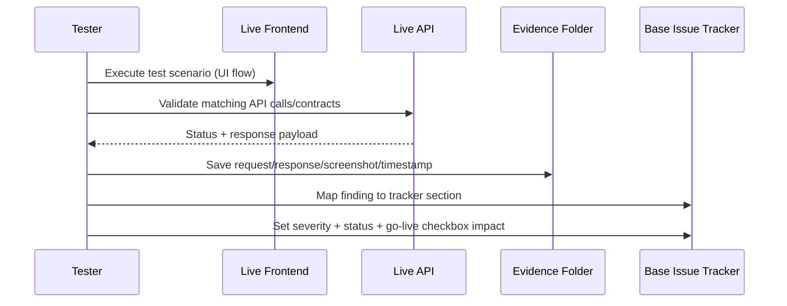

# Live SaaS E2E Testing Runbook (Tracker-Driven)

This runbook operationalizes end-to-end live testing for AWS Security Autopilot and maps every result directly into the base tracker.

## Scope and Source of Truth

- Primary tracker: `docs/live-e2e-testing/00-BASE-ISSUE-TRACKER.md`
- Live frontend target: `https://dev.valensjewelry.com`
- Live backend target: `https://api.valensjewelry.com`
- Required execution order: Wave 1 -> Wave 9 (Tests 01 -> 35)

## Artifacts Produced Per Run

For each run, create a date-stamped artifact folder under `docs/test-results/live-runs/`.
Use:

```bash
bash scripts/init_live_e2e_run.sh
```

This creates:
- Run metadata file
- Wave folders
- Per-test markdown stubs (`test-01.md` ... `test-35.md`)
- Evidence folders for API/UI/screenshots
- Snapshot of `docs/live-e2e-testing/00-BASE-ISSUE-TRACKER.md`

## End-to-End Execution Flow



## One-Time Setup Before Wave 1

1. Prepare three identities:
   - Admin user (primary tenant)
   - Member user (same tenant)
   - Separate user in second tenant (isolation checks)
2. Prepare AWS account states:
   - One account for normal platform tests
   - One account/state for adversarial tests (23-28)
3. Initialize the run folder:

```bash
bash scripts/init_live_e2e_run.sh
```

4. In `docs/live-e2e-testing/00-BASE-ISSUE-TRACKER.md`, set `Last updated` to current run timestamp.

## Standard Loop (Apply to Every Test)

1. Open the specific per-test file in the current run folder.
2. Record preconditions (identity, tenant, account, region, prerequisite IDs/tokens).
3. Execute positive path and negative path.
4. Validate auth boundary behavior where relevant (no token, wrong role, wrong tenant).
5. Capture evidence in the run folder:
   - endpoint + method
   - request payload
   - response status/body
   - UTC timestamp
   - screenshot for UI-visible defects
6. Mark per-test outcome: `PASS`, `FAIL`, `PARTIAL`, or `BLOCKED`.
7. Update tracker sections immediately:
   - Section 1: missing endpoint (`404`)
   - Section 2: frontend wiring/shape mismatch
   - Section 3: security/isolation/auth severity
   - Section 4: logic/behavior bug
   - Section 5: adversarial results (Tests 23-28)
   - Section 6: partial implementation
   - Section 7: environment/infrastructure drift
8. If the test affects release gates, update Section 8 checkboxes.
9. At end of each wave, update Quick Status Board counts.
10. For retests after fixes, update Section 9 changelog.
11. For explicit deferrals, update Section 10 with mitigation and revisit milestone.

## Wave Order and Test Coverage

| Wave | Tests | Focus |
|---|---|---|
| Wave 1 | 01 | Platform/API health, connectivity baseline |
| Wave 2 | 02-04 | Signup, login/session behavior, password/reset paths |
| Wave 3 | 05-08 | Onboarding, account connect, invite and service-readiness paths |
| Wave 4 | 09-12 | Findings/ingest behavior and multi-tenant isolation/security |
| Wave 5 | 13-16 | Findings/action detail contracts, remediation options, recompute/action endpoints |
| Wave 6 | 17-22 | PR bundle generation/download/auth, internal endpoints, exports, baseline report |
| Wave 7 | 23-28 | Adversarial architecture/resource validation (blast-radius and preservation checks) |
| Wave 8 | 29-33 | Ingest sync/freshness, rate limiting, RBAC boundaries, audit-log security, PR-proof content |
| Wave 9 | 34-35 | Full regression + final go-live blocker closure sweep |

> ❓ Needs verification: Detailed scripted definitions for Tests 34-35 are not codified in current repo artifacts; this runbook treats them as full-regression and final gate-closure passes.

## Severity and Status Discipline

Use tags exactly as defined in the tracker:

- `🔴 BLOCKING`
- `🟠 HIGH`
- `🟡 MEDIUM`
- `🔵 LOW`
- `✅ FIXED`
- `⚪ SKIP/NA`

Escalate to `🔴 BLOCKING` immediately for:
- cross-tenant data exposure
- auth bypass/admin-boundary failure
- internal endpoint exposure
- token invalidation/session security failures

Do not leave `TBD` in observed behavior after execution.

## Required Assertions in Every Wave

1. Positive path success behavior
2. Negative path/error handling behavior
3. Auth boundary behavior
4. Contract-shape compatibility with frontend requirements
5. Idempotency/retry behavior for mutating operations
6. Auditability (evidence exists and is traceable)

## Acceptance Criteria for a Completed Run

1. Every executed test has an evidence artifact and per-test result file.
2. Every detected issue is mapped into one primary tracker section.
3. Quick Status Board is updated for all completed waves.
4. Section 8 reflects current go-live gate status.
5. Section 9 includes all retested fixes with outcomes.
