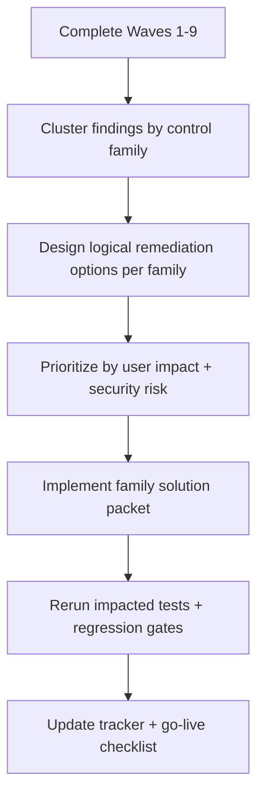

# Post-Test Logical Solutions Backlog

> ⚠️ Status: Planned — not yet implemented

This document is the implementation backlog template to use **after finishing the full E2E test wave cycle**.
It is designed for PM/engineering planning so we solve root user-impact logic per control family, not single findings one-by-one.

## Why this exists

Some findings can be "technically fixed" but still create user disruption (for example, closing public SSH with no guided alternative).
This backlog forces each control family to include:

- user-safe decision options,
- default recommendation logic,
- rollout and rollback guardrails,
- explicit retest coverage before production use.

## Source inputs

- Tracker source of truth: `docs/live-e2e-testing/00-BASE-ISSUE-TRACKER.md`
- Wave test run artifacts: `docs/test-results/live-runs/<RUN_ID>/`
- Live runbook: `docs/live-e2e-testing/live-saas-e2e-tracker-runbook.md`

## Decision Workflow

## Prioritization Rules

- `P0`: Security-critical or high user disruption risk if auto-remediated blindly.
- `P1`: High-volume controls that materially affect customer trust or onboarding speed.
- `P2`: Important but low-frequency controls with manageable workarounds.
- `P3`: Nice-to-have quality upgrades.

## Backlog Table (Control-Family Level)

| Priority | Control family | Current test coverage | Current behavior summary | User-impact risk if unchanged | Logical solution set to implement | Acceptance checks | Rerun tests | Owner | Status |
|---|---|---|---|---|---|---|---|---|---|
| P0 | EC2.53 `sg_restrict_public_ports` (mixed SG rules) | Wave 5 Test 16, Wave 7 Tests 24/27 | PR-only flow works and preserves benign rules in tested paths; options contract currently `mode_options=[\"pr_only\"]` with empty `strategies` in live evidence. | Operators using public SSH can lose access without guided alternatives. | Add explicit optioned strategy set: close public SSH, allow specific IPv4/IPv6 CIDR, route via bastion/managed path, time-bound exception path. | `22 0.0.0.0/0` removed or narrowed by selected option; benign rules preserved; action/finding closure verified; no-auth and wrong-tenant deny-closed. | 16, 24, 27, 34, 35 | PM + Backend + Frontend | Planned |
| P0 | IAM.4 root-access-key remediation | Wave 7 Test 25 | Run/bundle path works; apply requires root principal and remains blocked in non-root session. | Customers can misunderstand completion state and think remediation failed silently. | Add explicit product state model for root-required/manual completion with guided operator path and closure semantics. | Clear state transition from "bundle generated" to "awaiting root action" to "resolved"; evidence and audit trail complete. | 25, 34, 35 | PM + Backend | Planned |
| P1 | S3.2 complex-policy and closure propagation | Wave 7 Tests 23/26 | Preservation and closure passed in latest Test 26; Test 23 still partial for closure propagation in tracker. | Users can lose trust if remediation appears applied but stays open. | Standardize closure propagation checks and user-facing status messaging for delayed refresh scenarios. | Deterministic refresh convergence contract; tracker partials resolved or explicitly accepted with rationale. | 23, 26, 34, 35 | Backend + Worker | Planned |
| P1 | Strategy contract consistency (`remediation-options` -> run/create/preview) | Wave 5 Test 16, Wave 7 Tests 24/27 | Multiple paths still run with no explicit strategy IDs for some control families. | Harder PM/control-plane governance over why a remediation path was chosen. | Enforce explicit strategy catalog coverage for high-impact controls and consistent request contract. | Options payload includes machine-readable strategy set where required; API enforces valid selection. | 16, 24, 27, 34 | Backend + Frontend | Planned |

## Implementation Packet Template (per control family)

Use one packet per control family in planning tickets:

1. **Problem statement**
   - Which tests proved this gap?
   - What is the user pain and security risk?
2. **Option model**
   - Option A/B/C with clear user-facing wording.
   - Recommended default and why.
3. **Decision inputs required from user**
   - Only required fields (for example: allowlisted CIDR).
4. **Execution behavior**
   - Direct fix vs PR mode behavior.
   - Failure/rollback behavior.
5. **Evidence contract**
   - What API/UI/AWS artifacts prove safe execution and preservation?
6. **Release gates**
   - Which test IDs must pass before mark-as-complete?

## Release Gate for This Backlog

A control-family packet can be closed only when all are true:

- Implemented behavior is live.
- All linked rerun tests pass with evidence artifacts.
- Tracker rows and Section 8 checkboxes are updated.
- No unresolved `🔴 BLOCKING` regressions introduced.

> ❓ Needs verification: Should EC2.53 ship with a default "allow specific admin CIDR" recommendation, or default to "close SSH" when no CIDR is supplied?

