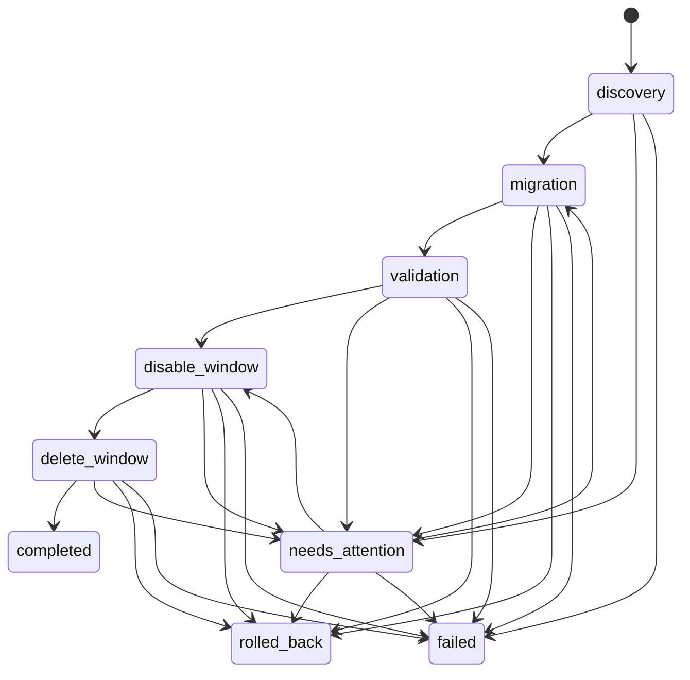
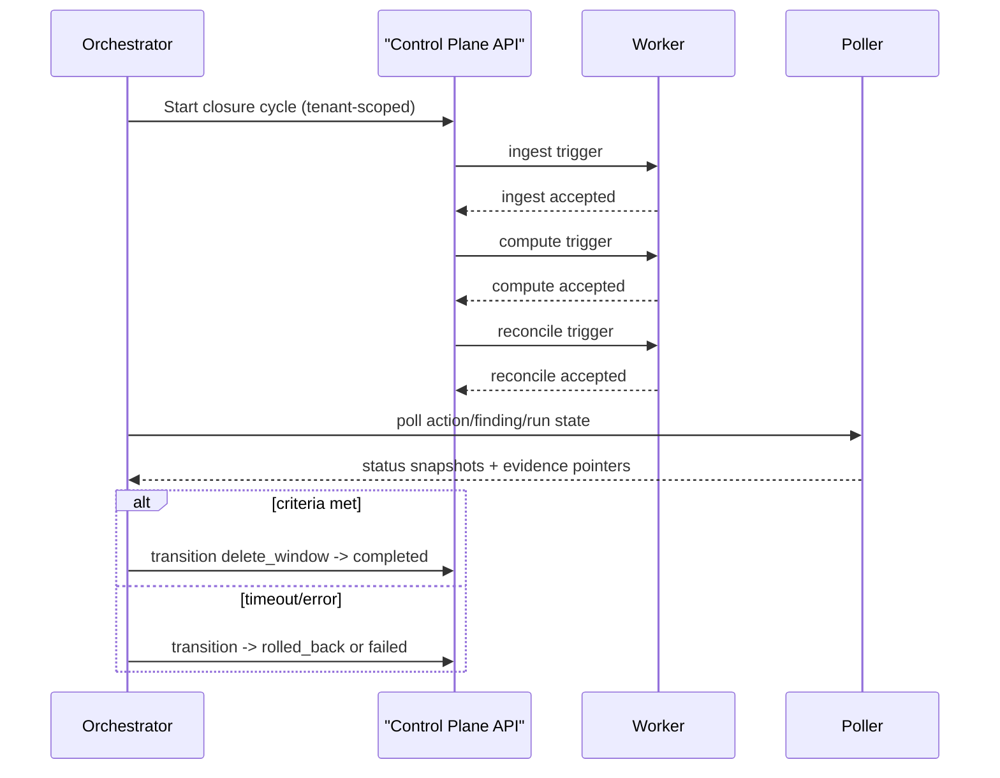

# Root-Key Safe Remediation Technical Spec

> Scope date: 2026-03-02
>
> This spec defines the production contract for root-key safe remediation orchestration for `IAM.4` (`iam_root_access_key_absent`) with strict multi-tenant isolation, retry safety, and fail-closed behavior.
>
> ⚠️ Status: In progress — persistence, state-machine service, root-key usage discovery/dependency classification, tenant-scoped orchestration API endpoints, guarded executor-worker logic for disable/rollback/delete, closure-cycle orchestration service with runtime delete-path wiring, rollout/ops controls (canary gating, kill switch, pause/resume, override logging, tenant metrics), and a feature-flagged frontend lifecycle UI are implemented.
>
> Implemented so far: additive persistence schema + ORM + repository/service access layer + transition-guarded state-machine service + tenant-scoped `create_run` action/finding ownership checks + CloudTrail usage discovery with managed/unknown dependency classification + root-key orchestration API contract at `/api/root-key-remediation-runs` + guarded executor-worker path for disable/rollback/delete transitions + closure-cycle orchestration service (`ingest`/`compute`/`reconcile` + polling) wired into the runtime delete path + deterministic integration/e2e matrix coverage + rollout/ops controls (`canary percent`, `kill switch`, `pause/resume`, `operator override reason` events, `ops metrics`) + feature-flagged frontend route `/root-key-remediation-runs/{id}` for lifecycle/timeline/dependency/task flows.

## 1) Scope and Constraints

This design is mandatory for all root-key remediation orchestration operations:

1. Multi-tenant isolation on every read/write.
2. Idempotent operations that are safe to retry.
3. Fail closed on validation, auth, or data-integrity errors.
4. No plaintext secrets in logs/artifacts (sensitive fields redacted before persistence).
5. New behavior behind feature flags with default values preserving current behavior.
6. Positive, negative, auth, and retry tests.
7. Additive, non-destructive migration behavior only.
8. Explicit version-safe API contracts.

Related docs:
- [Remediation safety model](/Users/marcomaher/AWS%20Security%20Autopilot/docs/remediation-safety-model.md)
- [IAM root credentials runbook](/Users/marcomaher/AWS%20Security%20Autopilot/docs/prod-readiness/root-credentials-required-iam-root-access-key-absent.md)
- [Acceptance matrix](/Users/marcomaher/AWS%20Security%20Autopilot/docs/live-e2e-testing/root-key-safe-remediation-acceptance-matrix.md)

## 2) Actor Model

### System automation actor
- Owns discovery, dependency checks, disable/delete orchestration, validation, rollback decisions, and closure polling.
- Writes immutable evidence and transition events.
- Never executes cross-tenant reads/writes.

### User-attention actor
- Handles manual tasks when automation cannot safely continue (`needs_attention`).
- Can acknowledge unknown dependencies, attach evidence, approve rollback/cancel, and complete external tasks.
- Cannot bypass transition guards.

## 3) State Machine

Canonical primary path:
- `discovery -> migration -> validation -> disable_window -> delete_window -> completed`

Alternate/terminal path states:
- `needs_attention`
- `rolled_back`
- `failed`

### Allowed transitions

| From | To | Allowed | Notes |
|---|---|---|---|
| `discovery` | `migration` | Yes | Eligibility and prechecks passed. |
| `discovery` | `needs_attention` | Yes | Unknown dependency or missing required evidence. |
| `discovery` | `failed` | Yes | Validation/auth/system failure. |
| `migration` | `validation` | Yes | Pre-delete mutation completed. |
| `migration` | `needs_attention` | Yes | Operator step required. |
| `migration` | `rolled_back` | Yes | Rollback trigger reached. |
| `migration` | `failed` | Yes | Non-recoverable execution failure. |
| `validation` | `disable_window` | Yes | Disable-first preconditions met. |
| `validation` | `needs_attention` | Yes | Dependency or policy guard uncertain. |
| `validation` | `rolled_back` | Yes | Policy-preservation or dependency regression. |
| `validation` | `failed` | Yes | Validation timeout or hard error. |
| `disable_window` | `delete_window` | Yes | Disable evidence confirmed and cooldown elapsed. |
| `disable_window` | `needs_attention` | Yes | Awaiting user confirmation or external task completion. |
| `disable_window` | `rolled_back` | Yes | Disable caused regression. |
| `disable_window` | `failed` | Yes | Disable operation failed. |
| `delete_window` | `completed` | Yes | Delete verification and closure criteria met. |
| `delete_window` | `needs_attention` | Yes | Unknown dependency surfaced post-delete. |
| `delete_window` | `rolled_back` | Yes | Rollback requested or policy regression. |
| `delete_window` | `failed` | Yes | Delete failed or verify timeout. |
| `needs_attention` | `migration` | Yes | User supplied required evidence/approval. |
| `needs_attention` | `disable_window` | Yes | User completed manual prerequisite. |
| `needs_attention` | `rolled_back` | Yes | Operator-selected rollback path. |
| `needs_attention` | `failed` | Yes | SLA breach or explicit abort. |
| `rolled_back` | `failed` | No | `rolled_back` is terminal. |
| `completed` | any | No | `completed` is terminal. |
| `failed` | any | No | `failed` is terminal. |

## 4) Zero-Interaction Eligibility (`mode=auto`)

A run can stay in zero-interaction mode only if all checks pass:

1. Tenant/account/action ownership is valid and scoped.
2. Required dependency fingerprints are known and non-blocking.
3. Policy-preservation baseline is captured.
4. No unknown dependency with `status in {unknown, warn}` requiring explicit operator decision.
5. Required strategy (`disable_then_delete`) is available.
6. All prerequisite evidence artifacts are present.

If any check fails, transition to `needs_attention` (never auto-continue on uncertainty).

## 5) Unknown Dependency Handling and Evidence Model

Unknown dependency handling:
- Record dependency fingerprint row with `unknown_dependency=true` and explicit `unknown_reason`.
- Emit event row describing the unknown dependency class.
- Open external task for user-attention flow.
- Freeze forward progress until external task is completed or rollback is selected.

Evidence model objects:
- Transition events (`root_key_remediation_events`) for immutable timeline.
- Fingerprints (`root_key_dependency_fingerprints`) for dependency snapshots and unknown flags.
- Artifacts (`root_key_remediation_artifacts`) for redacted references and digest metadata.
- External tasks (`root_key_external_tasks`) for user-attention actionables.

## 6) Disable-First Then Delete Policy

Policy invariant:
1. Key(s) must be disabled first.
2. Verification window confirms no unexpected access regressions.
3. Delete allowed only after disable verification passes.
4. If disable verification fails, transition to `rolled_back` or `needs_attention`.

This policy applies in both `auto` and `manual` modes.

## 7) Rollback Triggers and SLA Targets

Rollback triggers:
- Policy-preservation regression detected.
- Unknown dependency in blocking scope.
- Repeated execution failures exceeding retry threshold.
- Missing closure convergence before SLA limit.
- Explicit operator rollback request.

SLA targets:
- Transition persistence: <= 2s p95.
- Event/artifact write acknowledgment: <= 5s p95.
- Closure protocol cycle (`ingest/compute/reconcile` + polling): <= 15 minutes.
- Manual attention response SLA: <= 24 hours before escalated `failed`.

> ❓ Needs verification: Final production timeout targets for each region/account tier (current target aligns to 15-minute closure polling windows in live test workflows).

## 8) Closure Protocol

Closure pipeline:
1. Trigger ingest.
2. Trigger action compute.
3. Trigger reconcile.
4. Poll run/action/finding until terminal criteria or timeout.
5. Mark `completed` only when final criteria pass.

Final criteria:
- Target action is resolved.
- Target finding is resolved/effective resolved.
- Required policy-preservation checks pass.
- No unresolved external tasks for the run.

## 9) Policy-Preservation Checks

Before migration:
- Capture baseline of required safe permissions and principal/trust posture.

After disable window and after delete window:
- Recompute policy summary.
- Enforce `required_safe_permissions_unchanged=true` for protected permissions.
- Reject completion if preservation check fails.

Failure behavior:
- Transition to `rolled_back` (if recoverable) or `failed` (if non-recoverable).

## 10) API Contracts (Version-Safe, Implemented Behind Flags)

Implemented endpoint family:
- `POST /api/root-key-remediation-runs`
- `GET /api/root-key-remediation-runs/ops/metrics`
- `GET /api/root-key-remediation-runs/{id}`
- `POST /api/root-key-remediation-runs/{id}/validate`
- `POST /api/root-key-remediation-runs/{id}/disable`
- `POST /api/root-key-remediation-runs/{id}/rollback`
- `POST /api/root-key-remediation-runs/{id}/delete`
- `POST /api/root-key-remediation-runs/{id}/pause`
- `POST /api/root-key-remediation-runs/{id}/resume`
- `POST /api/root-key-remediation-runs/{id}/external-tasks/{task_id}/complete`

Contract invariants:
- Auth required (`get_optional_user` + fail-closed `401`), tenant boundary enforced on every read/write.
- `Idempotency-Key` required on all mutating `POST` endpoints.
- Optional `X-Operator-Override-Reason` header is sanitized and logged as immutable `operator_override` events.
- Optional request header `X-Root-Key-Contract-Version`; mismatches are rejected with `400`.
- Global kill switch (`ROOT_KEY_SAFE_REMEDIATION_KILL_SWITCH_ENABLED=true`) fail-closes mutating endpoints with `409`.
- All success and error payloads include:
  - `correlation_id`
  - `contract_version` (`2026-03-02`)
- Consistent error envelope:
  - `error.code`
  - `error.message`
  - `error.retryable`
  - `error.details` (optional, non-secret diagnostics only)

Create contract:
- `POST /api/root-key-remediation-runs`
- `201` on first write, `200` on idempotent replay.
- Validates action type is `iam_root_access_key_absent` in tenant scope.
- Optionally validates `finding_id` in tenant/account scope.
- Supports deterministic canary gating when enabled:
  - scope key: `tenant_id + account_id`,
  - percent selection: `ROOT_KEY_SAFE_REMEDIATION_CANARY_PERCENT`,
  - allowlist bypass: tenant/account allowlists,
  - fail-closed `409 canary_not_selected` without operator override reason.

Read contract:
- `GET /api/root-key-remediation-runs/{id}`
- Tenant-scoped run detail with:
  - run snapshot,
  - external tasks,
  - dependency fingerprints,
  - transition events,
  - artifact evidence summaries,
  - `event_count`, `dependency_count`, and `artifact_count`.
- `GET /api/root-key-remediation-runs/ops/metrics` returns tenant-scoped:
  - `auto_success_rate`,
  - `rollback_rate`,
  - `needs_attention_rate`,
  - `closure_pass_rate`,
  - `mean_time_to_detect_unknown_dependency_seconds`.

State transition contracts:
- `POST /api/root-key-remediation-runs` now gates auto-forward transitions through discovery/classification when `ROOT_KEY_SAFE_REMEDIATION_DISCOVERY_ENABLED=true`:
  - safe managed discovery (`unknown_count=0`, `partial_data=false`) -> transition to `migration`,
  - unknown dependency, partial discovery data, or discovery execution failure -> fail-closed transition to `needs_attention`.
- `validate` and `rollback` are routed through `RootKeyRemediationStateMachineService`.
- `delete` requires executor-worker runtime path:
  - when `ROOT_KEY_SAFE_REMEDIATION_EXECUTOR_ENABLED=false`, endpoint fails closed with `503 executor_unavailable`,
  - when `ROOT_KEY_SAFE_REMEDIATION_EXECUTOR_ENABLED=true`, delete execution is routed through `RootKeyRemediationExecutorWorker`.
- When executor-worker path is enabled, `disable`/`rollback`/`delete` are executed through `RootKeyRemediationExecutorWorker` with:
  - self-cutoff prevention guard requiring a safe observer context,
  - disable monitor-window evidence (`health + usage`) capture,
  - automatic rollback + rollback alert task creation on breakage signals,
  - fail-closed delete gating (`validation passed`, `disable window clean`, `delete flag enabled`, `no unknown active dependencies`).
- Invalid transitions and lock/idempotency conflicts return fail-closed `409`.
- Pause/resume contracts:
  - `POST /api/root-key-remediation-runs/{id}/pause` transitions active runs to `needs_attention/waiting_for_user`.
  - `POST /api/root-key-remediation-runs/{id}/resume` restores the prior active state from pause event context.
  - While paused, transition endpoints and external-task completion fail closed with `409 run_paused`.

External task completion contract:
- `POST /api/root-key-remediation-runs/{id}/external-tasks/{task_id}/complete`
- Tenant-scoped run/task lookup; idempotent event append + task completion update.
- Secret-like keys in request result/metadata are redacted before persistence.

## 11) Persistence Schema (Implemented)

Migration:
- [alembic/versions/0035_root_key_remediation_orchestration.py](/Users/marcomaher/AWS%20Security%20Autopilot/alembic/versions/0035_root_key_remediation_orchestration.py)

Models:
- [root_key_remediation_run.py](/Users/marcomaher/AWS%20Security%20Autopilot/backend/models/root_key_remediation_run.py)
- [root_key_remediation_event.py](/Users/marcomaher/AWS%20Security%20Autopilot/backend/models/root_key_remediation_event.py)
- [root_key_dependency_fingerprint.py](/Users/marcomaher/AWS%20Security%20Autopilot/backend/models/root_key_dependency_fingerprint.py)
- [root_key_remediation_artifact.py](/Users/marcomaher/AWS%20Security%20Autopilot/backend/models/root_key_remediation_artifact.py)
- [root_key_external_task.py](/Users/marcomaher/AWS%20Security%20Autopilot/backend/models/root_key_external_task.py)

Repository/service layer:
- [root_key_remediation_store.py](/Users/marcomaher/AWS%20Security%20Autopilot/backend/services/root_key_remediation_store.py)
- [root_key_remediation_state_machine.py](/Users/marcomaher/AWS%20Security%20Autopilot/backend/services/root_key_remediation_state_machine.py)
- [root_key_usage_discovery.py](/Users/marcomaher/AWS%20Security%20Autopilot/backend/services/root_key_usage_discovery.py)
- [root_key_remediation_closure.py](/Users/marcomaher/AWS%20Security%20Autopilot/backend/services/root_key_remediation_closure.py)

### Entities

1. `root_key_remediation_runs`
- tenant/account/action/finding scope fields.
- state/status/mode/strategy/correlation fields.
- idempotency key (`uq_root_key_runs_tenant_idempotency`).
- optimistic lock field (`lock_version`).

2. `root_key_remediation_events`
- immutable event timeline with tenant/run scoped idempotency.

3. `root_key_dependency_fingerprints`
- dependency fingerprints with unknown dependency flags and reasons.

4. `root_key_remediation_artifacts`
- redacted artifact metadata and references.

5. `root_key_external_tasks`
- user-attention tasks for manual flow.

### Implemented safety properties

- Strict tenant scoping in store reads/writes.
- Child writes require tenant-scoped run ownership validation.
- Idempotent create behavior with conflict retry fallback (`IntegrityError` handling).
- Optimistic locking for run transitions via `expected_lock_version`.
- Sensitive payload redaction for common secret-like keys before persistence.
- Root-key usage discovery is CloudTrail lookback-based, pagination-safe, retry-safe, and sorted deterministically for testability.
- Classification uses an explicit managed dependency registry and fails closed (`eligible_for_auto_flow=false`) on unknown usage or partial CloudTrail data.

## 12) Feature Flags and Defaults

All defaults preserve current behavior:

| Flag | Default | Purpose |
|---|---|---|
| `ROOT_KEY_SAFE_REMEDIATION_ENABLED` | `false` | Master gate for orchestration path. |
| `ROOT_KEY_SAFE_REMEDIATION_API_ENABLED` | `false` | Enables v1 root-key orchestration APIs. |
| `ROOT_KEY_SAFE_REMEDIATION_AUTO_ENABLED` | `false` | Allows zero-interaction mode. |
| `ROOT_KEY_SAFE_REMEDIATION_DELETE_ENABLED` | `false` | Enables delete window after disable verification. |
| `ROOT_KEY_SAFE_REMEDIATION_CLOSURE_ENABLED` | `false` | Enables ingest/compute/reconcile closure cycle automation. |
| `ROOT_KEY_SAFE_REMEDIATION_STRICT_TRANSITIONS` | `false` | Enforces transition guardrail checks in runtime path. |
| `ROOT_KEY_SAFE_REMEDIATION_DISCOVERY_ENABLED` | `false` | Enables root-key usage discovery and dependency classification path. |
| `ROOT_KEY_SAFE_REMEDIATION_EXECUTOR_ENABLED` | `false` | Enables guarded executor-worker behavior for disable/rollback/delete. |
| `ROOT_KEY_SAFE_REMEDIATION_CANARY_ENABLED` | `false` | Enables deterministic percent-based canary rollout on create-run. |
| `ROOT_KEY_SAFE_REMEDIATION_CANARY_PERCENT` | `100` | Canary selection percent when canary gating is enabled. |
| `ROOT_KEY_SAFE_REMEDIATION_CANARY_TENANT_ALLOWLIST` | `""` | Comma-separated tenant UUID bypass list for canary gating. |
| `ROOT_KEY_SAFE_REMEDIATION_CANARY_ACCOUNT_ALLOWLIST` | `""` | Comma-separated account ID bypass list for canary gating. |
| `ROOT_KEY_SAFE_REMEDIATION_KILL_SWITCH_ENABLED` | `false` | Fail-closed kill switch for all root-key mutating operations. |
| `ROOT_KEY_SAFE_REMEDIATION_OPS_METRICS_ENABLED` | `false` | Enables tenant-scoped root-key ops metrics endpoint. |
| `ROOT_KEY_SAFE_REMEDIATION_MONITOR_LOOKBACK_MINUTES` | `15` | CloudTrail lookback window for disable-window usage signals. |
| `ROOT_KEY_SAFE_REMEDIATION_CLOSURE_MAX_POLLS` | `30` | Maximum poll attempts for closure-cycle convergence checks. |
| `ROOT_KEY_SAFE_REMEDIATION_CLOSURE_POLL_INTERVAL_SECONDS` | `5.0` | Poll interval in seconds between closure status checks. |

## 13) Error Taxonomy and Operator Actions

| Error code | Category | Fail-closed behavior | Operator action |
|---|---|---|---|
| `tenant_scope_violation` | Auth/Isolation | Reject mutation/read; no state advance. | Verify account membership and tenant context. |
| `idempotency_conflict` | Concurrency | Return existing result or `409`; no duplicate side effects. | Retry with same key or inspect existing run/event. |
| `optimistic_lock_conflict` | Concurrency | Reject stale update. | Reload run and retry with latest `lock_version`. |
| `unknown_dependency_blocking` | Dependency | Transition to `needs_attention`. | Supply dependency evidence or select rollback. |
| `policy_preservation_failed` | Safety | Transition to `rolled_back` or `failed`. | Inspect preservation diff and rollback evidence. |
| `closure_timeout` | Orchestration | Transition to `failed` or `needs_attention`. | Retry closure cycle or escalate for manual review. |
| `artifact_redaction_error` | Security | Reject artifact write. | Re-submit sanitized metadata/artifact reference. |

## 14) Test Plan (Implemented + Planned)

Implemented tests in this task:
- [test_root_key_remediation_migration.py](/Users/marcomaher/AWS%20Security%20Autopilot/tests/test_root_key_remediation_migration.py)
- [test_root_key_remediation_models.py](/Users/marcomaher/AWS%20Security%20Autopilot/tests/test_root_key_remediation_models.py)
- [test_root_key_remediation_store.py](/Users/marcomaher/AWS%20Security%20Autopilot/tests/test_root_key_remediation_store.py)
- [test_root_key_usage_discovery.py](/Users/marcomaher/AWS%20Security%20Autopilot/tests/test_root_key_usage_discovery.py)
- [test_root_key_remediation_state_machine.py](/Users/marcomaher/AWS%20Security%20Autopilot/tests/test_root_key_remediation_state_machine.py)
- [test_root_key_remediation_runs_api.py](/Users/marcomaher/AWS%20Security%20Autopilot/tests/test_root_key_remediation_runs_api.py)
- [test_root_key_remediation_executor_worker.py](/Users/marcomaher/AWS%20Security%20Autopilot/tests/test_root_key_remediation_executor_worker.py)
- [test_root_key_remediation_plan_e2e.py](/Users/marcomaher/AWS%20Security%20Autopilot/tests/test_root_key_remediation_plan_e2e.py)
- Deterministic fixtures:
  - [root_key_safe_remediation_plan_scenarios.json](/Users/marcomaher/AWS%20Security%20Autopilot/tests/fixtures/root_key_safe_remediation_plan_scenarios.json)
  - [root_key_safe_remediation_plan_expected_matrix.json](/Users/marcomaher/AWS%20Security%20Autopilot/tests/fixtures/root_key_safe_remediation_plan_expected_matrix.json)

Coverage provided:
- migration upgrade/downgrade shape checks.
- model constraints/tenant-scoped unique keys.
- positive, negative, auth-scope, and retry/idempotency store semantics.
- root-key usage discovery/classification: no-usage, all-managed, mixed managed/unknown, and CloudTrail transient retry recovery.
- state-machine transition matrix coverage for legal transitions.
- illegal transition rejection (fail closed).
- retry/idempotency behavior for optimistic-lock conflicts with capped backoff.
- root-key API auth/no-auth/wrong-tenant, happy paths, idempotent replay behavior, and invalid transition response contracts.
- rollout/ops controls:
  - canary percent gating (`allow`/`deny`/allowlist bypass),
  - kill-switch fail-closed behavior,
  - pause/resume correctness with run-paused mutation blocking,
  - ops-metrics response contract.
- executor-worker coverage for self-cutoff regression, disable clean-window success, rollback on failure signal, delete gating, auth-scope fail-closed behavior, and replay-safe disable retries.
- root-key run detail contract coverage for timeline/dependency/artifact payload shape.
- integration/e2e matrix coverage for managed-only completion, unknown dependency fail-closed path, user external-task continuation path, post-disable rollback, closure-cycle polling convergence, policy-preservation fail-closed assertions, and self-cutoff prevention.
- frontend component coverage for timeline rendering, unknown-dependency wizard flow, and API error rendering.

Execution checklist and rollout gates:
- [Root-key safe remediation acceptance matrix](/Users/marcomaher/AWS%20Security%20Autopilot/docs/live-e2e-testing/root-key-safe-remediation-acceptance-matrix.md)

## 15) Frontend Lifecycle UX (Implemented Behind Flag)

Feature flag:
- `NEXT_PUBLIC_ROOT_KEY_REMEDIATION_UI_ENABLED` (default off; existing behavior unchanged when unset/false).

Implemented frontend surfaces:
- Root-key run route:
  - `/root-key-remediation-runs/{id}`
  - Source: `/Users/marcomaher/AWS Security Autopilot/frontend/src/app/root-key-remediation-runs/[id]/page.tsx`
- Lifecycle component:
  - Source: `/Users/marcomaher/AWS Security Autopilot/frontend/src/components/root-key/RootKeyRemediationLifecycle.tsx`
  - Includes polling with backoff, resilient empty/error states, and role-based action controls.
- Entry from action detail warning banner:
  - Source: `/Users/marcomaher/AWS Security Autopilot/frontend/src/components/ActionDetailModal.tsx`

Implemented UX requirements:
- Run timeline with state, timestamp, and evidence links.
- Dependency table split by managed vs unknown.
- Action-required unknown-dependency wizard.
- External migration task completion flow.
- Rollback status and operator guidance panel.
- Final completion summary panel.

Role behavior:
- Admin: can run transitions (`validate`, `disable`, `delete`, `rollback`) and complete external tasks.
- Member/non-admin: read-only lifecycle view with no mutating controls.
