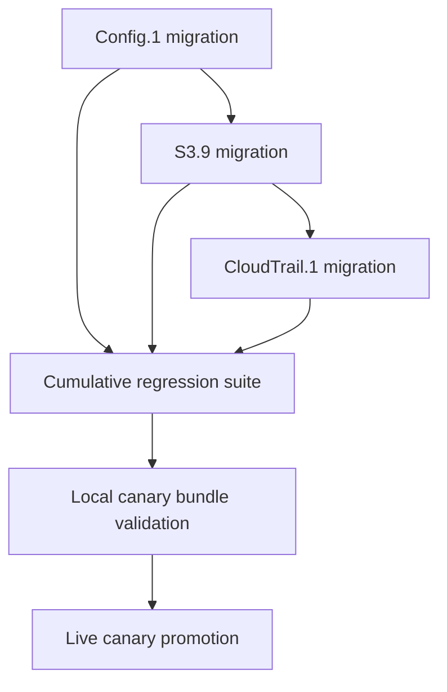

# Phase 5 Support-Bucket Family Implementation Plan

> Status: Completed for the agreed March 26, 2026 backup-tenant acceptance scope. The Phase 5 code changes are live, the focused local regression suites are green (`299 passed in 1.50s` across `tests/test_remediation_runtime_checks.py`, `tests/test_remediation_run_resolution_create.py`, `tests/test_remediation_runs_api.py`, and `tests/test_step7_components.py`), the retained backup-tenant rerun under [20260326T050614Z-phase5-support-bucket-cluster-canary-backup-auth-rerun](/Users/marcomaher/AWS%20Security%20Autopilot/docs/test-results/live-runs/20260326T050614Z-phase5-support-bucket-cluster-canary-backup-auth-rerun/README.md) proves deterministic bundles for `Config.1`, `S3.9`, and `CloudTrail.1`, the focused CloudTrail postdeploy recheck under [20260326T052354Z-phase5-cloudtrail-postdeploy-recheck](/Users/marcomaher/AWS%20Security%20Autopilot/docs/test-results/live-runs/20260326T052354Z-phase5-cloudtrail-postdeploy-recheck/README.md) proves production emits the shared support-bucket baseline, and the retained pending-confirmation repair under [20260326T132117Z-phase5-pending-confirmation-repair](/Users/marcomaher/AWS%20Security%20Autopilot/docs/test-results/live-runs/20260326T132117Z-phase5-pending-confirmation-repair/README.md) proves the live `Config.1` finding is now `RESOLVED` with `pending_confirmation=false`. The initial auth-only blocker attempt remains retained at [20260326T025813Z-phase5-support-bucket-cluster-canary-blocked](/Users/marcomaher/AWS%20Security%20Autopilot/docs/test-results/live-runs/20260326T025813Z-phase5-support-bucket-cluster-canary-blocked/README.md).

> Chosen default: `Config.1` now auto-promotes selective/custom recorder scope to `all_resources` on the executable path. When runtime evidence proves the existing recorder would still fail `Config.1`, the effective resolved input becomes `recording_scope=all_resources` even if the caller omitted the field or explicitly requested `keep_existing`.

> Promotion target for this cycle: backup tenant/account `696505809372` first. The original `Valens` / `029037611564` auth path is not a blocker for code completion in this fix cycle.

This plan turns the remaining support-bucket family rollout into one ordered implementation checklist. The goal is to finish the first adjacency-sensitive cluster without reintroducing family-local bucket drift or allowing executable bundles to create new S3 findings on their helper buckets.

Cross-reference:
- [Remediation adjacency hardening plan](/Users/marcomaher/AWS%20Security%20Autopilot/docs/prod-readiness/remediation-adjacency-hardening-plan.md)
- [Remediation safety model](/Users/marcomaher/AWS%20Security%20Autopilot/docs/remediation-safety-model.md)
- [PR bundle artifact readiness](/Users/marcomaher/AWS%20Security%20Autopilot/docs/prod-readiness/README.md)
- [Shared support-bucket tests](/Users/marcomaher/AWS%20Security%20Autopilot/tests/test_remediation_support_bucket.py)

## Current Retained Evidence

- [20260326T132117Z-phase5-pending-confirmation-repair](/Users/marcomaher/AWS%20Security%20Autopilot/docs/test-results/live-runs/20260326T132117Z-phase5-pending-confirmation-repair/README.md)
  - Targeted live repair for the stale backup-tenant `Config.1` confirmation loop after the scheduler deploy.
  - `POST /api/internal/pending-confirmation/sweep` returned zero due states for the legacy row because it predated the new refresh fields and had already aged past its 12-hour confirmation window.
  - A one-time manual `config` inventory shard cleared the stale evidence and the live API now reports `status=RESOLVED`, `pending_confirmation=false`, `followup_kind=null`, `shadow.status_normalized=RESOLVED`, and action-group bucket `run_successful_confirmed`.
- [20260326T050614Z-phase5-support-bucket-cluster-canary-backup-auth-rerun](/Users/marcomaher/AWS%20Security%20Autopilot/docs/test-results/live-runs/20260326T050614Z-phase5-support-bucket-cluster-canary-backup-auth-rerun/README.md)
  - Full backup-tenant rerun after restoring live API access through the fallback DB path.
  - `Config.1`, `S3.9`, and `CloudTrail.1` all resolved to `support_tier=deterministic_bundle`.
  - `Config.1` applied successfully with effective `recording_scope=all_resources`, and AWS Config now shows `allSupported=true`, `includeGlobalResourceTypes=true`, empty inclusion/exclusion lists, and recorder status `SUCCESS`.
  - `S3.9` produced the managed-create destination bundle with the shared support-bucket baseline.
  - `CloudTrail.1` became executable on the managed-create path, but the first live bundle still emitted the stale family-local bucket fragment.
- [20260326T052354Z-phase5-cloudtrail-postdeploy-recheck](/Users/marcomaher/AWS%20Security%20Autopilot/docs/test-results/live-runs/20260326T052354Z-phase5-cloudtrail-postdeploy-recheck/README.md)
  - Focused postdeploy `CloudTrail.1` rerun after clean-snapshot serverless deploy tag `20260326T052354Z`.
  - Production now emits `resource "aws_s3_bucket_policy" "cloudtrail_logs"`, `kms_master_key_id = "alias/aws/s3"`, `DenyInsecureTransport`, and no longer emits `cloudtrail_managed` or `sse_algorithm = "AES256"`.
- Current live `Config.1` source-of-truth state:
  - Before the repair, the live API finding payload remained stale with `status=NEW`, `pending_confirmation=true`, and `followup_kind=awaiting_aws_confirmation`; the retained pre-repair snapshot is stored in [pre_repair_finding_snapshot.json](/Users/marcomaher/AWS%20Security%20Autopilot/docs/test-results/live-runs/20260326T132117Z-phase5-pending-confirmation-repair/internal/pre_repair_finding_snapshot.json).
  - After the repair, [the live API finding payload](/Users/marcomaher/AWS%20Security%20Autopilot/docs/test-results/live-runs/20260326T132117Z-phase5-pending-confirmation-repair/api/config_finding_post_repair.json) reports `status=RESOLVED`, `effective_status=RESOLVED`, `last_observed_at=2026-03-26T12:25:03.778000+00:00`, `resolved_at=2026-03-26T12:25:03.778000+00:00`, `pending_confirmation=false`, `followup_kind=null`, `shadow.status_normalized=RESOLVED`, and action-group bucket `run_successful_confirmed`.

## Scope

Phase 5 covers the first support-bucket family cluster only:

| Order | Canonical control | action_type | Primary risk to remove |
| --- | --- | --- | --- |
| 1 | `Config.1` | `aws_config_enabled` | Local or centralized delivery buckets can be reachable but still unsafe |
| 2 | `S3.9` | `s3_bucket_access_logging` | Destination log bucket can pass reachability checks while still creating sibling S3 findings |
| 3 | `CloudTrail.1` | `cloudtrail_enabled` | Trail buckets can be created or reused without the full safe support-bucket baseline |

Cluster exit criteria:

1. Every created helper bucket uses the shared support-bucket builder from [`backend/services/remediation_support_bucket.py`](/Users/marcomaher/AWS%20Security%20Autopilot/backend/services/remediation_support_bucket.py).
2. Every reused helper bucket requires full proof from `probe_support_bucket_safety(...)` before executable bundle generation remains allowed.
3. Terraform, CloudFormation, and helper-script paths converge on the same baseline instead of keeping family-local S3 hardening logic.
4. Missing or unreadable proof downgrades the family to `review_required_bundle`.
5. Local regression tests pass before the family is promoted back to executable rollout.



## Cluster Rules

These rules apply to all three families:

- Do not start `S3.9` until `Config.1` is green.
- Do not start `CloudTrail.1` until `S3.9` is green.
- Created buckets must be built through the shared support-bucket profile instead of hand-written `aws_s3_bucket_*` fragments.
- Reused buckets must be proven safe, not merely reachable.
- Family-specific service-delivery statements may extend the shared bucket policy, but must not replace the shared baseline statements.
- If bundle generation cannot prove adjacency safety, keep the family on `review_required_bundle`.

## Family 1: `Config.1`

`Config.1` is the first migration because it exercises the hardest path: runtime proof, resolver logic, Terraform/CloudFormation generation, and generated helper scripts all have to agree on the same delivery-bucket contract.

### Code slices

#### 1. Runtime proof

Primary files:
- [`backend/services/remediation_runtime_checks.py`](/Users/marcomaher/AWS%20Security%20Autopilot/backend/services/remediation_runtime_checks.py)
- [`backend/services/remediation_support_bucket.py`](/Users/marcomaher/AWS%20Security%20Autopilot/backend/services/remediation_support_bucket.py)

Primary touchpoints:
- `collect_runtime_risk_signals(...)`
- `check_adjacency_safety(...)`
- `probe_support_bucket_safety(...)`

Required changes:
- Extend the `config_enable_account_local_delivery` and `config_enable_centralized_delivery` branches so `use_existing` means `existing and safe`, not `existing and reachable`.
- Emit or preserve signals that let the resolver distinguish:
  - safe managed-create path
  - safe existing-bucket reuse path
  - existing-but-unsafe bucket
  - unreadable bucket posture
- Require the full support-bucket baseline proof already modeled in the shared probe:
  - public access block
  - encryption
  - SSL-only policy
  - lifecycle
  - required Config service delivery policy statements

#### 2. Resolver and downgrade wiring

Primary file:
- [`backend/services/remediation_profile_selection.py`](/Users/marcomaher/AWS%20Security%20Autopilot/backend/services/remediation_profile_selection.py)

Primary touchpoints:
- `_config_resolved_inputs(...)`
- `_config_blocked_reasons(...)`
- `_config_local_blocked_reasons(...)`
- `_config_centralized_blocked_reasons(...)`
- `_config_existing_bucket_reasons(...)`
- `_config_preservation_summary(...)`
- `_config_persisted_inputs(...)`

Required changes:
- Keep `config_enable_account_local_delivery` executable only when the managed local-bucket path can apply the shared support-bucket profile safely.
- Keep `config_enable_centralized_delivery` executable only when the supplied bucket passes full support-bucket proof.
- Prefer create-new over unsafe existing-bucket reuse when both are available.
- Surface adjacency-safety downgrade reasons explicitly in the preservation summary and blocked-reason output.

#### 3. Bundle generation

Primary files:
- [`backend/services/pr_bundle.py`](/Users/marcomaher/AWS%20Security%20Autopilot/backend/services/pr_bundle.py)
- [`backend/services/aws_config_bundle_support.py`](/Users/marcomaher/AWS%20Security%20Autopilot/backend/services/aws_config_bundle_support.py)

Primary touchpoints:
- `_resolve_aws_config_defaults(...)`
- `_generate_for_aws_config_enabled(...)`
- `_terraform_aws_config_enabled_content(...)`
- `_cloudformation_aws_config_enabled_content(...)`
- `aws_config_apply_script_content(...)`
- `aws_config_restore_script_content(...)`
- `_apply_helpers()`
- `_apply_snapshot_helpers()`
- `_apply_main()`
- `_restore_helpers()`
- `_restore_main()`

Required changes:
- Replace the Config-specific bucket creation path with the shared support-bucket builder.
- Make the Terraform, CloudFormation, and helper-script paths use the same bucket baseline and the same safety assumptions.
- Keep Config-specific delivery policy statements as an extension of the shared baseline, not a replacement for it.
- Extend rollback snapshots so restore covers the additional support-bucket fields, not only recorder and delivery-channel state.

### Tests

Primary files:
- [`tests/test_remediation_runtime_checks.py`](/Users/marcomaher/AWS%20Security%20Autopilot/tests/test_remediation_runtime_checks.py)
- [`tests/test_remediation_profile_options_preview.py`](/Users/marcomaher/AWS%20Security%20Autopilot/tests/test_remediation_profile_options_preview.py)
- [`tests/test_remediation_runs_api.py`](/Users/marcomaher/AWS%20Security%20Autopilot/tests/test_remediation_runs_api.py)
- [`tests/test_step7_components.py`](/Users/marcomaher/AWS%20Security%20Autopilot/tests/test_step7_components.py)

Required coverage:
- created local bucket gets the shared support-bucket baseline
- centralized existing-bucket path downgrades when proof is incomplete
- safe existing bucket remains executable
- helper script snapshots and restores the new baseline fields
- Terraform and CloudFormation emit the same safety posture

### Done criteria

`Config.1` is green only when:

1. create-new delivery uses the shared support-bucket baseline
2. reuse requires full proof
3. unsafe or unreadable buckets downgrade to review-only
4. rollback restores the expanded bucket state
5. the Config regression slice passes

## Family 2: `S3.9`

`S3.9` reuses the same support-bucket primitives, but without the Config helper-script complexity. It should follow immediately after `Config.1` so the shared builder and probe behavior are already proven.

### Code slices

#### 1. Runtime proof

Primary files:
- [`backend/services/remediation_runtime_checks.py`](/Users/marcomaher/AWS%20Security%20Autopilot/backend/services/remediation_runtime_checks.py)
- [`backend/services/remediation_support_bucket.py`](/Users/marcomaher/AWS%20Security%20Autopilot/backend/services/remediation_support_bucket.py)

Primary touchpoints:
- `collect_runtime_risk_signals(...)`
- `check_adjacency_safety(...)`
- `probe_support_bucket_safety(...)`

Required changes:
- Replace reachability-only destination checks with full support-bucket posture proof.
- Keep `source_bucket != destination_bucket` as a hard fail.
- Carry the same safety interpretation into grouped/shared setup paths, not only the direct single-action path.

#### 2. Resolver and downgrade wiring

Primary file:
- [`backend/services/remediation_profile_selection.py`](/Users/marcomaher/AWS%20Security%20Autopilot/backend/services/remediation_profile_selection.py)

Primary touchpoints:
- `_resolve_s3_9_family_selection(...)`

Required changes:
- Keep executable bundle selection only when the destination bucket is either safe-by-construction or proven-safe for reuse.
- Downgrade to `review_required_bundle` when the destination bucket posture is missing, unsafe, unreadable, or equal to the source bucket.

#### 3. Bundle generation

Primary file:
- [`backend/services/pr_bundle.py`](/Users/marcomaher/AWS%20Security%20Autopilot/backend/services/pr_bundle.py)

Primary touchpoints:
- `_generate_for_s3_bucket_access_logging(...)`
- `_terraform_s3_bucket_access_logging_content(...)`
- `_cloudformation_s3_bucket_access_logging_content(...)`

Required changes:
- Allow the created-destination path to use the shared support-bucket builder instead of requiring an externally prepared bucket.
- Keep reused-destination paths executable only when the bucket already passes the shared safety probe.
- Keep Terraform and CloudFormation aligned on how the destination bucket is created or referenced.

### Tests

Primary files:
- [`tests/test_remediation_runtime_checks.py`](/Users/marcomaher/AWS%20Security%20Autopilot/tests/test_remediation_runtime_checks.py)
- [`tests/test_remediation_profile_options_preview.py`](/Users/marcomaher/AWS%20Security%20Autopilot/tests/test_remediation_profile_options_preview.py)
- [`tests/test_step7_components.py`](/Users/marcomaher/AWS%20Security%20Autopilot/tests/test_step7_components.py)
- [`tests/test_remediation_profile_catalog.py`](/Users/marcomaher/AWS%20Security%20Autopilot/tests/test_remediation_profile_catalog.py)

Required coverage:
- created destination bucket gets the shared baseline
- reused destination bucket downgrades when safety proof is incomplete
- grouped path reuses the same proof/builder behavior
- source and destination equality still hard-fails

### Done criteria

`S3.9` is green only when:

1. destination safety means full posture proof
2. created destinations use the shared support-bucket builder
3. grouped and single-action flows follow the same downgrade rules
4. the S3.9 regression slice passes after the Config changes remain green

## Family 3: `CloudTrail.1`

`CloudTrail.1` is last in the cluster because it shares the support-bucket profile with the other two families, but still needs CloudTrail-specific delivery statements layered on top.

### Code slices

#### 1. Runtime proof

Primary files:
- [`backend/services/remediation_runtime_checks.py`](/Users/marcomaher/AWS%20Security%20Autopilot/backend/services/remediation_runtime_checks.py)
- [`backend/services/remediation_support_bucket.py`](/Users/marcomaher/AWS%20Security%20Autopilot/backend/services/remediation_support_bucket.py)

Primary touchpoints:
- `collect_runtime_risk_signals(...)`
- `check_adjacency_safety(...)`
- `probe_support_bucket_safety(...)`

Required changes:
- Keep `trail_bucket_name` executable only when the bucket is safe-by-construction or proven-safe for reuse.
- Do not allow `cloudtrail_log_bucket_reachable=true` to be treated as sufficient proof by itself.
- Preserve CloudTrail-specific delivery requirements as additional policy expectations layered on top of the shared support-bucket baseline.

#### 2. Resolver and downgrade wiring

Primary file:
- [`backend/services/remediation_profile_selection.py`](/Users/marcomaher/AWS%20Security%20Autopilot/backend/services/remediation_profile_selection.py)

Primary touchpoints:
- `_resolve_cloudtrail_family_selection(...)`
- `_cloudtrail_resolved_inputs(...)`
- `_cloudtrail_missing_defaults(...)`
- `_cloudtrail_blocked_reasons(...)`
- `_cloudtrail_preservation_summary(...)`
- `_cloudtrail_persisted_inputs(...)`

Required changes:
- Keep the family executable only when the trail bucket path satisfies the shared support-bucket proof.
- Preserve the current missing-defaults behavior for unresolved bucket names, but tighten it so an unsafe or unreadable bucket also downgrades to review-only.
- Surface the bucket-safety state in preservation/block reasons so the selected profile explains why it is executable or downgraded.

#### 3. Bundle generation

Primary file:
- [`backend/services/pr_bundle.py`](/Users/marcomaher/AWS%20Security%20Autopilot/backend/services/pr_bundle.py)

Primary touchpoints:
- `_resolve_cloudtrail_defaults(...)`
- `_generate_for_cloudtrail_enabled(...)`
- `_terraform_cloudtrail_content(...)`
- `_cloudformation_cloudtrail_content(...)`

Required changes:
- Rebuild the create-bucket path on top of the shared support-bucket builder.
- Keep CloudTrail policy statements merged onto the shared baseline instead of assembling an independent bucket policy branch.
- Keep Terraform and CloudFormation aligned on versioning, encryption, public access block, SSL-only enforcement, and CloudTrail delivery policy expectations.

### Tests

Primary files:
- [`tests/test_remediation_runtime_checks.py`](/Users/marcomaher/AWS%20Security%20Autopilot/tests/test_remediation_runtime_checks.py)
- [`tests/test_remediation_profile_options_preview.py`](/Users/marcomaher/AWS%20Security%20Autopilot/tests/test_remediation_profile_options_preview.py)
- [`tests/test_step7_components.py`](/Users/marcomaher/AWS%20Security%20Autopilot/tests/test_step7_components.py)
- [`tests/test_remediation_profile_catalog.py`](/Users/marcomaher/AWS%20Security%20Autopilot/tests/test_remediation_profile_catalog.py)

Required coverage:
- created trail bucket gets the shared baseline plus CloudTrail delivery statements
- reused trail bucket downgrades when safety proof is incomplete
- bucket-policy merge keeps the shared baseline statements intact
- CloudTrail bundle defaults still resolve correctly when the family stays executable

### Done criteria

`CloudTrail.1` is green only when:

1. create-bucket uses the shared support-bucket builder
2. reuse requires full support-bucket proof
3. CloudTrail delivery statements extend, rather than replace, the baseline
4. the full support-bucket family regression slice passes

## Recommended Implementation Sequence

Use one branch and one PR, but keep the code changes in three commits:

1. `Config.1` migration
2. `S3.9` migration
3. `CloudTrail.1` migration

Promotion rule per family:

1. wire runtime proof
2. wire resolver downgrade logic
3. wire bundle generation onto the shared builder
4. add or update tests
5. keep review-only until the family slice is green
6. run local canary validation
7. run live canary before broad executable promotion

## Validation Plan

Run the targeted family regression slice after each family, then rerun the full cluster slice after `CloudTrail.1`.

Recommended commands:

```bash
PYTHONPATH=. ./venv/bin/pytest -q \
  tests/test_remediation_support_bucket.py \
  tests/test_remediation_runtime_checks.py \
  tests/test_remediation_profile_options_preview.py \
  tests/test_remediation_runs_api.py \
  tests/test_step7_components.py \
  tests/test_remediation_profile_catalog.py
```

For local executable validation after the test suite is green:

```bash
PYTHONPATH=. ./venv/bin/python scripts/run_no_ui_pr_bundle_agent.py \
  --api-base https://api.ocypheris.com \
  --account-id 029037611564 \
  --region eu-north-1
```

Optional follow-up:
- If product wants symmetric proof on the original `Valens` path again, rerun the cluster on account `029037611564` once that operator-auth path is restored. That is no longer a blocker for the March 26 Phase 5 closure decision because the agreed backup-tenant scope is now green.

## Phase 5 Done Criteria

Phase 5 is complete only when all of the following are true:

1. `Config.1`, `S3.9`, and `CloudTrail.1` all use the shared support-bucket builder for create paths.
2. All three families require full support-bucket proof for reuse paths.
3. None of the three families ship executable bundles when the helper bucket is unsafe or unreadable.
4. Terraform, CloudFormation, and helper-script outputs no longer drift on support-bucket posture.
5. Local regression suites are green.
6. Live canary evidence shows no new sibling S3 findings introduced by the migrated family cluster.
7. `Config.1` executable live proof actually closes the control instead of preserving a selective recorder scope that leaves `CONFIG_RECORDER_MISSING_REQUIRED_RESOURCE_TYPES` in place.

All seven done criteria are now satisfied for the backup-tenant acceptance scope documented above.
