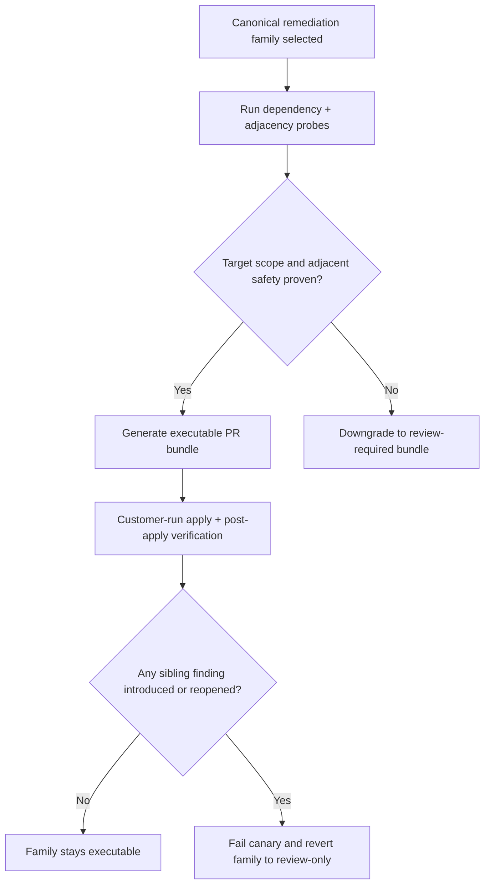

# Remediation Adjacency Hardening Plan

> ⚠️ Status: In progress — shared adjacency contracts, runtime proof collection, and review-only downgrade wiring are implemented; family rollout and live canaries remain open.

This plan defines how AWS Security Autopilot should harden its covered remediation families so a fix for one rule does not introduce new sibling findings or adjacent control regressions. The current executable scope is the PR-only canonical family set defined in [`backend/services/control_scope.py`](/Users/marcomaher/AWS%20Security%20Autopilot/backend/services/control_scope.py) and generated through [`backend/services/pr_bundle.py`](/Users/marcomaher/AWS%20Security%20Autopilot/backend/services/pr_bundle.py).

Cross-reference:
- [Remediation safety model](/Users/marcomaher/AWS%20Security%20Autopilot/docs/remediation-safety-model.md)
- [PR bundle artifact readiness](/Users/marcomaher/AWS%20Security%20Autopilot/docs/prod-readiness/README.md)
- [Control/action inventory](/Users/marcomaher/AWS%20Security%20Autopilot/docs/prod-readiness/06-control-action-inventory.md)
- [Item 17 medium/low-confidence control coverage plan](/Users/marcomaher/AWS%20Security%20Autopilot/docs/prod-readiness/17-medium-low-confidence-control-coverage-plan.md)

## Problem Statement

The current remediation system is now fail-closed for the proof-collection slice, but the full adjacency program is not finished. The remaining high-value gaps are:

- [`cloudtrail_enable_guided`](/Users/marcomaher/AWS%20Security%20Autopilot/backend/services/pr_bundle.py#L3454) and [`config_enable_account_local_delivery`](/Users/marcomaher/AWS%20Security%20Autopilot/backend/services/pr_bundle.py#L3986) still carry family-local support-bucket generation instead of one shared Terraform builder, even though runtime reuse/create gating is now in place.
- [`backend/services/aws_config_bundle_support.py`](/Users/marcomaher/AWS%20Security%20Autopilot/backend/services/aws_config_bundle_support.py#L441) still needs the shared support-bucket baseline wired into its generated helper scripts.
- [`s3_bucket_lifecycle_configuration`](/Users/marcomaher/AWS%20Security%20Autopilot/backend/services/pr_bundle.py#L2711) still replaces lifecycle configuration instead of merge-preserving existing rules, which is too risky for broad executable rollout.
- `EC2.53` now collects an `sg_alternate_admin_path_type` advisory signal, but revoke-style downgrade logic for non-SSM paths still needs a resolver/risk-policy decision before the family is considered fully hardened.

## Goal

For every covered canonical remediation family:

1. Prove the target resource scope is correct.
2. Prove the fix will not introduce known adjacent findings on helper resources or the same target resource.
3. Fail closed into review-only output when that proof is missing.
4. Promote a family back to executable only after local regression coverage and live canary evidence pass.

## Adjacency Safety Contract

Each executable remediation family must define:

- `target_scope_proof`: how the runtime confirms the exact resource or account scope.
- `adjacent_controls_at_risk`: which sibling findings the remediation could introduce or reopen.
- `creates_helper_resources`: whether the path can create helper resources such as support buckets.
- `merge_safe_preservation_required`: whether existing target configuration must be captured and preserved instead of overwritten.
- `downgrade_rule`: the exact fail-closed condition surfaced when proof is missing and the family must emit `review_required_bundle`.

If any required proof is unavailable, the system should emit `review_required_bundle` behavior instead of runnable IaC.

Current implementation anchors:

- Family declarations live in [`backend/services/remediation_strategy.py`](/Users/marcomaher/AWS%20Security%20Autopilot/backend/services/remediation_strategy.py) as `ADJACENCY_REGISTRY`.
- Shared runtime enforcement lives in [`backend/services/remediation_runtime_checks.py`](/Users/marcomaher/AWS%20Security%20Autopilot/backend/services/remediation_runtime_checks.py) as `check_adjacency_safety(...)`.
- Resolver and bundle downgrade wiring lives in:
  - [`backend/services/remediation_profile_selection.py`](/Users/marcomaher/AWS%20Security%20Autopilot/backend/services/remediation_profile_selection.py)
  - [`backend/services/remediation_risk.py`](/Users/marcomaher/AWS%20Security%20Autopilot/backend/services/remediation_risk.py)
  - [`backend/services/pr_bundle.py`](/Users/marcomaher/AWS%20Security%20Autopilot/backend/services/pr_bundle.py)



## Covered Canonical Families

| Canonical control | action_type | Current adjacency risk | Hardening priority |
| --- | --- | --- | --- |
| `S3.1` | `s3_block_public_access` | Low, account-scoped, no helper resources | `P3` |
| `SecurityHub.1` | `enable_security_hub` | Low, service enablement only | `P3` |
| `GuardDuty.1` | `enable_guardduty` | Low, service enablement only | `P3` |
| `S3.2` | `s3_bucket_block_public_access` | Can break intended public/website/CloudFront or service-access paths | `P2` |
| `S3.4` | `s3_bucket_encryption` | Can produce AES256-only output even when the tenant should converge on `S3.15` SSE-KMS | `P2` |
| `EC2.53` | `sg_restrict_public_ports` | Can remove operator access without a validated replacement path | `P2` |
| `CloudTrail.1` | `cloudtrail_enabled` | Can create or reuse a trail bucket that later triggers S3 findings | `P0` |
| `Config.1` | `aws_config_enabled` | Can create or reuse a delivery bucket that later triggers S3 findings | `P0` |
| `SSM.7` | `ssm_block_public_sharing` | Low, no supporting resources | `P3` |
| `EC2.182` | `ebs_snapshot_block_public_access` | Low-medium, mostly account/region guardrail semantics | `P3` |
| `EC2.7` | `ebs_default_encryption` | Customer KMS path needs stronger proof; AWS-managed path is safer | `P2` |
| `S3.5` | `s3_bucket_require_ssl` | Existing bucket policy merge/preservation risk | `P1` |
| `IAM.4` | `iam_root_access_key_absent` | High-risk root flow, but helper-resource adjacency is low | `P2` |
| `S3.9` | `s3_bucket_access_logging` | Destination-bucket creation/reuse can create new S3 findings | `P0` |
| `S3.11` | `s3_bucket_lifecycle_configuration` | Current path can overwrite lifecycle state instead of merging | `P1` |
| `S3.15` | `s3_bucket_encryption_kms` | Custom KMS branch already probes policy/grants, but helper-resource defaults still need alignment | `P1` |

Aliases remain covered through their canonical families:

- `S3.3` and `S3.8` follow `S3.2`
- `S3.13` follows `S3.11`
- `S3.17` follows `S3.15`
- `EC2.13`, `EC2.18`, and `EC2.19` follow `EC2.53`

Explicitly unsupported inventory-only signals remain excluded from this plan:

- `RDS.PUBLIC_ACCESS`
- `RDS.ENCRYPTION`
- `EKS.PUBLIC_ENDPOINT`

## Shared Safe Support-Resource Profile

Any remediation that creates an internal support bucket or repoints delivery to a bundle-managed bucket should reuse one shared baseline profile across Terraform, CloudFormation, and helper scripts.

Required default profile for product-created support buckets:

- bucket-level public access block enabled
- SSL-only bucket policy
- default encryption enabled with AWS-managed SSE-KMS (`alias/aws/s3`)
- lifecycle abort-incomplete rule enabled, with optional retention expiry for log buckets
- least-privilege service-write bucket policy
- versioning when the bucket stores audit-sensitive logs

Current implementation anchors:

- Shared baseline/profile helpers live in [`backend/services/remediation_support_bucket.py`](/Users/marcomaher/AWS%20Security%20Autopilot/backend/services/remediation_support_bucket.py).
- Runtime reuse-bucket probing uses `probe_support_bucket_safety(...)`.
- The remaining open work is refactoring family-local bundle generation onto the shared builder for `CloudTrail.1`, `Config.1`, and `S3.9`.

This shared profile should become the common building block for:

- `S3.9` destination buckets
- `CloudTrail.1` trail buckets created in-bundle
- `Config.1` account-local delivery buckets

## Family-Specific Hardening Work

### Phase 1: Support-Bucket Safety

Families:
- `aws_config_enabled`
- `cloudtrail_enabled`
- `s3_bucket_access_logging`

Required changes:
- Replace remaining one-off bucket creation logic with a shared support-bucket builder.
- Require adjacent-control proof for reused buckets, not just reachability. Implemented for runtime reuse checks; bundle-generation refactor remains open.
- Capture and validate bucket posture before bundle generation:
  - public access block
  - encryption mode
  - SSL-only policy
  - lifecycle presence
  - service-delivery bucket policy requirements
- Downgrade to review-only when any bucket-safety invariant is missing or unreadable.

Current code anchors:
- [`backend/services/remediation_runtime_checks.py#L497`](/Users/marcomaher/AWS%20Security%20Autopilot/backend/services/remediation_runtime_checks.py#L497)
- [`backend/services/remediation_runtime_checks.py#L697`](/Users/marcomaher/AWS%20Security%20Autopilot/backend/services/remediation_runtime_checks.py#L697)
- [`backend/services/aws_config_bundle_support.py#L441`](/Users/marcomaher/AWS%20Security%20Autopilot/backend/services/aws_config_bundle_support.py#L441)
- [`backend/services/pr_bundle.py#L2164`](/Users/marcomaher/AWS%20Security%20Autopilot/backend/services/pr_bundle.py#L2164)
- [`backend/services/pr_bundle.py#L3454`](/Users/marcomaher/AWS%20Security%20Autopilot/backend/services/pr_bundle.py#L3454)
- [`backend/services/pr_bundle.py#L3986`](/Users/marcomaher/AWS%20Security%20Autopilot/backend/services/pr_bundle.py#L3986)

### Phase 2: S3 Target-Resource Merge Safety

Families:
- `s3_bucket_require_ssl`
- `s3_bucket_lifecycle_configuration`
- `s3_bucket_encryption`
- `s3_bucket_encryption_kms`
- `s3_bucket_block_public_access`

Required changes:
- `S3.5`: keep merge-safe policy preservation mandatory; fail closed if the current policy cannot be captured and merged safely.
- `S3.11`: replace overwrite-style lifecycle writes with merge-preserving behavior or downgrade to review-only.
- `S3.4`: avoid generating AES256-only output when the same bucket should converge directly to `S3.15`. Implemented as a fail-closed redirect to review/guidance when the KMS family is already open.
- `S3.15`: keep custom-KMS proof strict and align any helper-resource defaults with the shared safe support-bucket profile.
- `S3.2`: keep executable path only when direct-public-access dependency checks are proven; otherwise prefer the existing CloudFront OAC migration or review-only output.

Current code anchors:
- [`backend/services/remediation_runtime_checks.py#L1020`](/Users/marcomaher/AWS%20Security%20Autopilot/backend/services/remediation_runtime_checks.py#L1020)
- [`backend/services/remediation_runtime_checks.py#L1040`](/Users/marcomaher/AWS%20Security%20Autopilot/backend/services/remediation_runtime_checks.py#L1040)
- [`backend/services/remediation_runtime_checks.py#L1107`](/Users/marcomaher/AWS%20Security%20Autopilot/backend/services/remediation_runtime_checks.py#L1107)
- [`backend/services/pr_bundle.py#L1667`](/Users/marcomaher/AWS%20Security%20Autopilot/backend/services/pr_bundle.py#L1667)
- [`backend/services/pr_bundle.py#L2013`](/Users/marcomaher/AWS%20Security%20Autopilot/backend/services/pr_bundle.py#L2013)
- [`backend/services/pr_bundle.py#L2711`](/Users/marcomaher/AWS%20Security%20Autopilot/backend/services/pr_bundle.py#L2711)
- [`backend/services/pr_bundle.py#L2746`](/Users/marcomaher/AWS%20Security%20Autopilot/backend/services/pr_bundle.py#L2746)
- [`backend/services/pr_bundle.py#L4216`](/Users/marcomaher/AWS%20Security%20Autopilot/backend/services/pr_bundle.py#L4216)

### Phase 3: Access-Path and High-Risk Family Hardening

Families:
- `sg_restrict_public_ports`
- `ebs_default_encryption`
- `iam_root_access_key_absent`

Required changes:
- `EC2.53`: require positive proof of an alternate admin path before revoke-style variants remain executable.
- `EC2.7`: keep AWS-managed default KMS as the safest executable default; require strict key-policy proof for customer KMS.
- `IAM.4`: preserve the MFA gate and fail closed when MFA state is unreadable for delete-mode selection. Implemented for the delete-key branch.

### Phase 4: Low-Adjacency Family Verification

Families:
- `s3_block_public_access`
- `enable_security_hub`
- `enable_guardduty`
- `ssm_block_public_sharing`
- `ebs_snapshot_block_public_access`

Required changes:
- Verify idempotency, rollback notes, and live canary evidence.
- Keep these families executable unless live evidence shows adjacent regressions not currently modeled.

## Delivery Sequence

Completed:

1. Implement the shared support-bucket profile.
2. Add family-specific adjacency probes and downgrade logic.
3. Add `S3.4` to `S3.15` convergence logic for shared-target cases.
4. Tighten the `IAM.4` unreadable-MFA gate.

Remaining:

1. Rewire `Config.1`, `CloudTrail.1`, and `S3.9` bundle generation to use the shared support-bucket builder everywhere.
2. Add merge-safe behavior for `S3.11`.
3. Finish `EC2.53` and `EC2.7` family-policy gating.
4. Run local regression suites and then live canary validation before promoting any downgraded family back to executable.

## Validation Matrix

Each hardening phase should add automated coverage for:

- safe dependency path
- unsafe dependency path
- unreadable dependency path
- helper-resource creation path
- helper-resource reuse path
- rollback artifact capture
- post-apply adjacent-control verification

Recommended first live canary order:

1. `Config.1`
2. `S3.9`
3. `CloudTrail.1`
4. `S3.11`
5. `S3.15`
6. `S3.5`
7. `S3.2`
8. `EC2.53`

## Done Criteria

This plan is complete only when all of the following are true:

1. Every executable canonical family has a documented adjacency contract.
2. Every helper-resource-creating family uses the shared safe support-resource profile.
3. Families without sufficient proof emit review-only output instead of runnable IaC.
4. Local tests cover both safe and unsafe adjacent-control outcomes.
5. Live canary evidence confirms that promoted families do not introduce new sibling findings after customer-run execution.

> ❓ Needs verification: Before promoting helper-bucket families back to broad executable rollout, should `CloudTrail.1`, `Config.1`, and `S3.9` first converge on one shared Terraform/bundle generation path instead of keeping the current family-local builders under the shared runtime gate?
>
> ❓ Needs verification: For `EC2.53`, should `sg_alternate_admin_path_type=unknown` always downgrade revoke-style profiles to review-only, or should the resolver first learn explicit `bastion` / `vpn` proof types?
>
> ❓ Needs verification: Beyond the current `S3.4` and `IAM.4` protection, should direct bundle generation synthesize review-only fallback resolutions for more adjacency-gated families when no canonical resolver decision is supplied?

---

## Implementation Status: Shared Registry And Runtime Enforcement

> Status: **Implemented on 2026-03-26** in [`backend/services/remediation_strategy.py`](/Users/marcomaher/AWS%20Security%20Autopilot/backend/services/remediation_strategy.py), [`backend/services/remediation_support_bucket.py`](/Users/marcomaher/AWS%20Security%20Autopilot/backend/services/remediation_support_bucket.py), [`backend/services/remediation_runtime_checks.py`](/Users/marcomaher/AWS%20Security%20Autopilot/backend/services/remediation_runtime_checks.py), [`backend/services/remediation_profile_selection.py`](/Users/marcomaher/AWS%20Security%20Autopilot/backend/services/remediation_profile_selection.py), [`backend/services/remediation_risk.py`](/Users/marcomaher/AWS%20Security%20Autopilot/backend/services/remediation_risk.py), and [`backend/services/pr_bundle.py`](/Users/marcomaher/AWS%20Security%20Autopilot/backend/services/pr_bundle.py).

This slice is now live in local code. The remediation stack has one shared family-level adjacency registry, one shared support-bucket baseline, runtime proof collection, and fail-closed downgrade wiring across preview, run creation, and direct bundle generation.

### Landed changes

| Area | Landed behavior | Current effect |
|---|---|---|
| Family contracts | `ADJACENCY_REGISTRY` covers every non-`exception_only` canonical `action_type` | New executable families must declare adjacency rules before they can remain runnable |
| Support buckets | Shared support-bucket helpers now define the canonical public-access-block + SSL-only + SSE-KMS + lifecycle + versioning baseline | Helper buckets have one current source of truth instead of family-by-family posture definitions |
| Profile selection | Resolver output now degrades executable selections to `review_required_bundle` when adjacency proof is unsafe or unreadable | Operators see review-only output instead of runnable IaC when proof is missing |
| Risk evaluation | `check_adjacency_safety(...)` now runs structurally inside `evaluate_strategy_impact(...)` | Unsafe adjacency proof now forces `review_and_acknowledge` instead of `safe_to_proceed` |
| Direct bundle fallback | `pr_bundle.py` now synthesizes non-executable guidance bundles for direct-call `S3.4` / `IAM.4` adjacency-gated cases | Bundle generation stays fail-closed even without a canonical resolver payload |
| Family-specific fail-closed cases | `S3.4 -> S3.15` redirect and `IAM.4` delete unreadable-MFA downgrade are implemented | Two previously open plan questions now have enforced runtime behavior |

## Implementation Status: Upgrade Runtime Proof Collection

> Status: **Implemented on 2026-03-26** in [`backend/services/remediation_runtime_checks.py`](/Users/marcomaher/AWS%20Security%20Autopilot/backend/services/remediation_runtime_checks.py), [`backend/services/remediation_risk.py`](/Users/marcomaher/AWS%20Security%20Autopilot/backend/services/remediation_risk.py), [`tests/test_remediation_runtime_checks.py`](/Users/marcomaher/AWS%20Security%20Autopilot/tests/test_remediation_runtime_checks.py), and [`tests/test_remediation_risk.py`](/Users/marcomaher/AWS%20Security%20Autopilot/tests/test_remediation_risk.py).

This slice is now live in local code. The runtime collector and risk evaluator both understand the shared adjacency contract, so missing proof degrades execution to review instead of silently staying executable.

### Landed changes

| Family | Landed signal / behavior | Current effect |
|---|---|---|
| `cloudtrail_enabled` | Explicit `helper_bucket_creation_planned=False` on reused-bucket paths plus existing `support_bucket_probe` reuse evidence | Reused unsafe trail buckets now downgrade through the shared adjacency contract |
| `aws_config_enabled` | `helper_bucket_creation_planned=True` when `delivery_bucket_mode == create_new`, without probing a planned bucket | New-bucket flows now avoid false reuse assumptions and rely on bundle-side hardening |
| `sg_restrict_public_ports` | `sg_alternate_admin_path_type` plus attached-instance / SSM-online evidence | Review surfaces can now distinguish `ssm`, `unknown`, and `none` for the current SG |
| `s3_bucket_block_public_access` | Advisory `s3_account_pab_enabled` signal from `s3control.get_public_access_block(AccountId=...)` | Reviewers now see whether account-level PAB is already converged |
| `s3_bucket_encryption_kms` | `evidence.s3_existing_encryption_algorithm`, `evidence.s3_existing_kms_key_id`, and `s3_kms_key_change_required` | SSE-KMS previews now show whether the change preserves or swaps existing KMS state |
| Risk evaluation | `check_adjacency_safety(...)` now runs structurally inside `evaluate_strategy_impact(...)` | Unsafe adjacency proof now forces `review_and_acknowledge` instead of `safe_to_proceed` |

### Residual follow-ups

- `EC2.53` still needs an explicit resolver/risk-policy decision for `bastion` / `vpn` / revoke-style downgrade semantics; the runtime signal is present, but that family is not fully hardened yet.
- `CloudTrail.1`, `Config.1`, and `S3.9` still need the remaining shared support-bucket Terraform/bundle refactor described earlier in this document.
- Live canary evidence is still required before any additional family should be promoted based on these proofs alone.

### Verification

Automated verification completed locally:

```bash
PYTHONPATH=. ./venv/bin/pytest tests/test_remediation_runtime_checks.py tests/test_remediation_risk.py -q
PYTHONPATH=. ./venv/bin/pytest tests/test_remediation_profile_options_preview.py tests/test_remediation_run_resolution_create.py -q
./venv/bin/ruff check backend/services/remediation_runtime_checks.py backend/services/remediation_risk.py tests/test_remediation_runtime_checks.py tests/test_remediation_risk.py
```

Observed results:

- `57` remediation runtime/risk tests passed
- `47` profile-preview / run-resolution tests passed
- `ruff` passed on the touched code/test files
