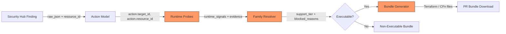

# Remediation Determinism Hardening — Implementation Handoff

**Objective:** Reduce the frequency of Non-Executable outcomes for 8 controls (S3.2, S3.5, S3.9, S3.11, S3.15, CloudTrail.1, Config.1, EC2.53) by adding deterministic safe paths, apply-time discovery, and enrichment fallbacks.  
**Excluded:** IAM.4  
**Contract:** PR/Patch-bundle only. No direct-fix execution. No `WriteRole` mutations.

> Status: Implemented and production-signoff complete.
>
> This repo copy was imported from `/Users/marcomaher/Desktop/implementation_plan.md` on March 27, 2026 and later updated with the retained Gate 1, Gate 2, and Gate 3 production closure results from March 28-30, 2026. Treat this repo copy and the linked retained evidence packages as authoritative; the desktop source file is a historical handoff snapshot.

---

## Architecture Overview



> [!IMPORTANT]
> The changes in this plan touch three layers (marked orange above): **Runtime Probes** ([remediation_runtime_checks.py](file:///Users/marcomaher/AWS%20Security%20Autopilot/backend/services/remediation_runtime_checks.py)), **Family Resolvers** ([s3_family_resolution_adapter.py](file:///Users/marcomaher/AWS%20Security%20Autopilot/backend/services/s3_family_resolution_adapter.py), [remediation_profile_selection.py](file:///Users/marcomaher/AWS%20Security%20Autopilot/backend/services/remediation_profile_selection.py)), and **Bundle Generators** ([pr_bundle.py](file:///Users/marcomaher/AWS%20Security%20Autopilot/backend/services/pr_bundle.py)). Changes must be implemented and tested layer-by-layer to avoid regressions.

---

## Key File Map

| File | Role | Lines |
|---|---|---|
| [s3_family_resolution_adapter.py](file:///Users/marcomaher/AWS%20Security%20Autopilot/backend/services/s3_family_resolution_adapter.py) | S3 family resolvers (S3.2, S3.5, S3.9, S3.11, S3.15) | 886 |
| [remediation_runtime_checks.py](file:///Users/marcomaher/AWS%20Security%20Autopilot/backend/services/remediation_runtime_checks.py) | Runtime probes — all evidence collection | 1279 |
| [remediation_profile_selection.py](file:///Users/marcomaher/AWS%20Security%20Autopilot/backend/services/remediation_profile_selection.py) | Profile selection + CloudTrail/Config/EC2.53 resolvers | 1688 |
| [remediation_profile_catalog.py](file:///Users/marcomaher/AWS%20Security%20Autopilot/backend/services/remediation_profile_catalog.py) | Profile registry definitions | 472 |
| [remediation_strategy.py](file:///Users/marcomaher/AWS%20Security%20Autopilot/backend/services/remediation_strategy.py) | Strategy & input schema definitions | 2167 |
| [pr_bundle.py](file:///Users/marcomaher/AWS%20Security%20Autopilot/backend/services/pr_bundle.py) | IaC bundle generators (Terraform + CFn) | 4864 |

---

## Dependency Graph

```mermaid
flowchart TD
    WI7["WI-7: resource_id fallback"] --> WI6["WI-6: S3.9 auto log bucket"]
    WI7 --> WI10["WI-7: S3.15 resource_id"]
    WI1["WI-1: S3.11 additive merge"] -.-> WI11["WI-11: S3.11 apply-time"]
    WI4["WI-4: S3.5 apply-time merge"] -.-> WI9["WI-9: S3.2 OAC apply-time"]
    WI5["WI-5: S3.2 website profile"] -.-> WI10b["WI-10: S3.2 policy scrub"]
    
    WI3["WI-3: CloudTrail defaults"]
    WI2["WI-2: EC2.53 ssm_only"]
    WI8["WI-8: EC2.53 bastion"]
    WI12["WI-12: Config.1 auto scope"]
    WI13["WI-13: S3.2 OAC PolicyStatus"]
    WI14["WI-14: S3.5 empty-policy"]
    
    style WI1 fill:#d32,color:#fff
    style WI2 fill:#d32,color:#fff
    style WI3 fill:#d32,color:#fff
    style WI4 fill:#d32,color:#fff
    style WI5 fill:#d32,color:#fff
    style WI6 fill:#d32,color:#fff
    style WI7 fill:#fa0,color:#fff
    style WI8 fill:#fa0,color:#fff
    style WI9 fill:#fa0,color:#fff
    style WI10b fill:#fa0,color:#fff
    style WI11 fill:#fa0,color:#fff
    style WI12 fill:#fa0,color:#fff
    style WI13 fill:#fa0,color:#fff
    style WI14 fill:#0a5,color:#fff
```



**Legend:** 🔴 High impact · 🟠 Medium · 🟢 Low  
**Arrows →** = hard dependency (must complete first). **Dashed ⇢** = soft dependency (shares pattern).

---

## Work Items

---

### WI-1 · S3.11 — Additive Lifecycle Merge at Bundle-Gen Time

**Priority:** 🔴 P0 — Highest impact single change  
**Effort:** Medium (~200 LOC)  
**Dependencies:** None

> Status note (2026-03-29): the bundle-generation work item itself is implemented, and the retained production closure follow-up in [20260329T002042Z-wi1-production-closure](/Users/marcomaher/AWS%20Security%20Autopilot/docs/test-results/live-runs/20260329T002042Z-wi1-production-closure/README.md) fixed the missing live finding-materialization bug on the reconcile path. `WI-1` still remains `BLOCKED` at the production-ready gate because the truthful seeded lifecycle bucket now materializes as `RESOLVED` / compliant and still produces no open S3.11 action for additive-merge preview/create proof.

> Status note (2026-03-30): the retained closure run [20260330T012757Z-phase2-action-resolution-lag-closure](/Users/marcomaher/AWS%20Security%20Autopilot/docs/test-results/live-runs/20260330T012757Z-phase2-action-resolution-lag-closure/README.md) closed the remaining Gate 2 blocker without reopening candidate discovery. The authoritative live conclusion remains that `WI-1` does not currently expose a truthful open additive-merge candidate under the corrected `S3.11` semantics; the final blocker was the post-apply action-resolution lag, and that lag is now fixed and re-proven on production.

#### Problem

When a bucket has existing lifecycle rules, the S3.11 resolver downgrades to `review_required_bundle` even though the probe successfully captures the full lifecycle JSON. The IaC generator ignores the captured JSON and only emits a single-rule resource.

#### Current Code Flow

```
_s3_11_blocked_reasons()  ← s3_family_resolution_adapter.py L590-621
  │
  ├─ rule_count == 0  → return []  (executable ✅)
  ├─ equivalent_safe_state  → return []  (executable ✅)
  ├─ lifecycle_json is None  → "evidence missing"  (blocked ❌)
  └─ rule_count > 0 AND lifecycle_json present  → "additive merge not implemented"  (blocked ❌) ← THIS CASE
```

```
_generate_for_s3_bucket_lifecycle_configuration()  ← pr_bundle.py L2356-2442
  │
  └─ Always emits a single rule{}  ← IGNORES existing rules
```

#### Required Changes

**File 1: [s3_family_resolution_adapter.py](file:///Users/marcomaher/AWS%20Security%20Autopilot/backend/services/s3_family_resolution_adapter.py#L617-L620)**

```diff
 # L617-620: _s3_11_blocked_reasons()
-    elif rule_count not in (None, 0):
-        reasons.append(
-            "Existing lifecycle rules are present, and additive merge generation is not implemented for this branch."
-        )
+    elif rule_count not in (None, 0) and lifecycle_json is None:
+        reasons.append(
+            "Existing lifecycle rules were detected, but the lifecycle document was not captured for additive merge."
+        )
+    # When lifecycle_json IS captured and rule_count > 0, allow executable additive merge.
```

**File 2: [pr_bundle.py](file:///Users/marcomaher/AWS%20Security%20Autopilot/backend/services/pr_bundle.py#L2356-L2442)**

Modify [_generate_for_s3_bucket_lifecycle_configuration](file:///Users/marcomaher/AWS%20Security%20Autopilot/backend/services/pr_bundle.py#2356-2408) to accept `risk_snapshot` and implement merge:

```python
def _generate_for_s3_bucket_lifecycle_configuration(
    action: ActionLike,
    format: PRBundleFormat,
    *,
    strategy_inputs: dict[str, Any] | None = None,
    risk_snapshot: dict[str, Any] | None = None,      # ← NEW PARAM
) -> PRBundleResult:
```

Inside the function, after resolving [abort_days](file:///Users/marcomaher/AWS%20Security%20Autopilot/backend/services/s3_family_resolution_adapter.py#785-790):

```python
    # --- NEW: Additive merge logic ---
    evidence = _strategy_risk_evidence(risk_snapshot)
    existing_lifecycle_json = evidence.get("existing_lifecycle_configuration_json")
    existing_rules: list[dict] = []
    if existing_lifecycle_json:
        try:
            parsed = json.loads(existing_lifecycle_json)
            if isinstance(parsed, dict):
                existing_rules = parsed.get("Rules", [])
            elif isinstance(parsed, list):
                existing_rules = parsed
        except (json.JSONDecodeError, TypeError):
            pass
    # Filter out any existing abort-incomplete rule to avoid duplication
    existing_rules = [
        r for r in existing_rules
        if not isinstance(r, dict) or not r.get("AbortIncompleteMultipartUpload")
    ]
```

Then emit the merged resource in [_terraform_s3_bucket_lifecycle_configuration_content](file:///Users/marcomaher/AWS%20Security%20Autopilot/backend/services/pr_bundle.py#2410-2443):

```python
def _terraform_s3_bucket_lifecycle_configuration_content(
    meta: dict[str, str],
    *,
    abort_days: int,
    existing_rules: list[dict] | None = None,     # ← NEW PARAM
) -> str:
    bucket = _s3_bucket_name_from_target_id(meta.get("target_id", ""))
    rule_blocks = []
    # Emit existing rules first (preservation)
    for idx, rule in enumerate(existing_rules or []):
        rule_id = rule.get("ID") or f"preserved-rule-{idx}"
        status = rule.get("Status", "Enabled")
        rule_blocks.append(f'''  rule {{
    id     = "{rule_id}"
    status = "{status}"
    # Preserved from existing lifecycle configuration
    ...  # Map each rule field to Terraform HCL
  }}''')
    # Always append our abort rule
    rule_blocks.append(f'''  rule {{
    id     = "security-autopilot-abort-incomplete-multipart"
    status = "Enabled"
    filter {{}}
    abort_incomplete_multipart_upload {{
      days_after_initiation = var.abort_incomplete_multipart_days
    }}
  }}''')
    all_rules = "\n\n".join(rule_blocks)
    return f"""# ... header ...
resource "aws_s3_bucket_lifecycle_configuration" "security_autopilot" {{
  bucket = "{bucket}"

{all_rules}
}}
"""
```

> [!WARNING]
> The lifecycle-rule-to-HCL mapper must handle all AWS lifecycle rule fields: `Expiration`, `Transitions`, `NoncurrentVersionExpiration`, `NoncurrentVersionTransitions`, `Filter` (including `Tag`, `And`, `Prefix`). Missing a field will silently drop customer rules. Build a comprehensive mapping function and test with real-world lifecycle configs.

Update the call site in [generate_pr_bundle](file:///Users/marcomaher/AWS%20Security%20Autopilot/backend/services/pr_bundle.py#592-772) (L696-701) to pass `risk_snapshot`:

```diff
     elif action_type == ACTION_TYPE_S3_BUCKET_LIFECYCLE_CONFIGURATION:
         result = _generate_for_s3_bucket_lifecycle_configuration(
             action,
             normalized_format,
             strategy_inputs=strategy_inputs,
+            risk_snapshot=risk_snapshot,
         )
```

#### Acceptance Criteria

- [ ] Bucket with 0 existing rules → `deterministic_bundle` (same as today)
- [ ] Bucket with 1+ existing rules AND lifecycle JSON captured → `deterministic_bundle` with merged rules in generated `.tf`
- [ ] Bucket with 1+ existing rules AND lifecycle JSON NOT captured → `review_required_bundle` (same as today)
- [ ] Generated Terraform passes `terraform validate`
- [ ] Existing rules appear in generated `.tf` exactly as captured (round-trip fidelity)
- [ ] AbortIncompleteMultipartUpload rule deduplication works when an equivalent rule already exists

#### Test Commands

```bash
PYTHONPATH=. ./venv/bin/pytest tests/test_s3_family_resolution_adapter.py -v -k "s3_11"
PYTHONPATH=. ./venv/bin/pytest tests/test_pr_bundle.py -v -k "lifecycle"
```

---

### WI-2 · EC2.53 — Implement `ssm_only` IaC Generator

**Priority:** 🔴 P0  
**Effort:** Medium (~150 LOC)  
**Dependencies:** None

#### Problem

The `ssm_only` profile exists in the catalog ([remediation_profile_catalog.py L166-177](file:///Users/marcomaher/AWS%20Security%20Autopilot/backend/services/remediation_profile_catalog.py#L166-L177)) but is hardcoded to blocked:

```python
# remediation_profile_selection.py L1146-1147
if profile_id == "ssm_only":
    return ["Wave 6 downgrades 'ssm_only' because SSM-only execution is not implemented."]
```

#### Required Changes

**File 1: [remediation_profile_selection.py](file:///Users/marcomaher/AWS%20Security%20Autopilot/backend/services/remediation_profile_selection.py#L1146-L1147)**

```diff
-    if profile_id == "ssm_only":
-        return ["Wave 6 downgrades 'ssm_only' because SSM-only execution is not implemented."]
+    if profile_id == "ssm_only":
+        return []  # SSM-only IaC is now implemented
```

**File 2: [remediation_profile_catalog.py](file:///Users/marcomaher/AWS%20Security%20Autopilot/backend/services/remediation_profile_catalog.py#L166-L177)**

```diff
         RemediationProfileDefinition(
             action_type=action_type,
             strategy_id=strategy_id,
             profile_id="ssm_only",
             label="Use SSM only",
-            default_support_tier="manual_guidance_only",
+            default_support_tier="deterministic_bundle",
             recommended=False,
             requires_inputs=False,
```

**File 3: [pr_bundle.py](file:///Users/marcomaher/AWS%20Security%20Autopilot/backend/services/pr_bundle.py#L2727)** — inside [_generate_for_sg_restrict_public_ports](file:///Users/marcomaher/AWS%20Security%20Autopilot/backend/services/pr_bundle.py#2727-2829)

Add a new branch for `access_mode == "ssm_only"` and implement dedicated revoke-only generators for both Terraform and CloudFormation.

```python
if access_mode == "ssm_only":
    return _generate_for_sg_ssm_only(action, format, meta=meta, sg_id=sg_id)
```

`_generate_for_sg_ssm_only()` should:

- keep the standard EC2.53 bundle filenames (`sg_restrict_public_ports.tf` / `.yaml`)
- revoke public IPv4/IPv6 SSH/RDP ingress on ports `22` and `3389`
- avoid adding replacement SSH/RDP ingress rules
- document that Session Manager access must already work before apply
- reuse the exact-state capture/restore scripts plus rollback metadata on the Terraform path

> [!IMPORTANT]
> Corrected semantics: `ssm_only` means “remove public SSH/RDP exposure and rely on already-available SSM-managed operator access.” It does **not** add inbound `443` rules or perform SSM prefix-list lookups in the workload security group.

#### Acceptance Criteria

- [ ] `ssm_only` profile resolves to `deterministic_bundle`
- [ ] Generated Terraform revokes public SSH (22) and RDP (3389) ingress without adding replacement SSH/RDP rules
- [ ] Generated CloudFormation revokes public SSH (22) and RDP (3389) ingress without adding replacement SSH/RDP rules
- [ ] README.txt includes the Session Manager prerequisite and rollback guidance
- [ ] Passes `terraform validate`

---

### WI-3 · CloudTrail.1 — Change Default to `create_bucket_if_missing=True`

**Priority:** 🔴 P0  
**Effort:** Small (~10 LOC)  
**Dependencies:** None

> Status: Implemented locally on March 27, 2026 across the strategy schema, runtime probe defaults, resolver provenance, grouped approval gating, and CloudTrail modal initialization. Retained live canary proof for this slice is still pending.

#### Problem

When no existing trail exists, `trail_bucket_name` is auto-filled by the probe from `DescribeTrails` — but if there's no trail, there's nothing to fill. Combined with `create_bucket_if_missing` defaulting to `False`, the resolver always blocks.

#### Required Changes

**File 1: [remediation_strategy.py](file:///Users/marcomaher/AWS%20Security%20Autopilot/backend/services/remediation_strategy.py#L512-L530)**

```diff
                     {
                         "key": "trail_bucket_name",
                         "type": "string",
                         "required": False,
                         "description": "CloudTrail log bucket.",
+                        "safe_default_value": "security-autopilot-trail-logs-{{account_id}}-{{region}}",
+                        "safe_default_label": "Auto-generate a dedicated CloudTrail log bucket",
                         ...
                     },
                     {
                         "key": "create_bucket_if_missing",
                         "type": "boolean",
                         "required": False,
-                        "default_value": False,
+                        "default_value": True,
                         ...
                     },
```

**File 2: [remediation_profile_selection.py](file:///Users/marcomaher/AWS%20Security%20Autopilot/backend/services/remediation_profile_selection.py#L1189-L1194)** — [_cloudtrail_missing_defaults](file:///Users/marcomaher/AWS%20Security%20Autopilot/backend/services/remediation_profile_selection.py#1189-1195)

Verify this function correctly resolves with the new default. When `create_bucket_if_missing=True`, it returns `[]` at L1192-1193 — **already correct, no change needed**.

**File 3: [remediation_runtime_checks.py](file:///Users/marcomaher/AWS%20Security%20Autopilot/backend/services/remediation_runtime_checks.py#L772-L826)** — probe auto-fill

When the probe auto-generates a `trail_bucket_name` (because no existing trail exists), it should populate the safe default. Verify the probe's fallback bucket-name generation at L807-808 uses the same pattern.

#### Acceptance Criteria

- [ ] New account with no existing CloudTrail trail → resolves to `deterministic_bundle` without user input
- [ ] `trail_bucket_name` auto-populated in [resolved_inputs](file:///Users/marcomaher/AWS%20Security%20Autopilot/backend/services/remediation_profile_selection.py#906-921) as `security-autopilot-trail-logs-{account_id}-{region}`
- [ ] `create_bucket_if_missing=True` by default
- [ ] Existing accounts with trails → behavior unchanged (probe auto-fills from `DescribeTrails`)

---

### WI-4 · S3.5 — Apply-Time Policy Merge via Terraform Data Source

**Priority:** 🔴 P0  
**Effort:** Medium (~200 LOC)  
**Dependencies:** None (shares pattern with WI-9, WI-10)

> Status: Implemented locally on March 27, 2026 and closed with the retained March 28, 2026 isolated current-head live canary package at [20260328T021002Z-wi4-s35-apply-time-merge-canary](/Users/marcomaher/AWS%20Security%20Autopilot/docs/test-results/live-runs/20260328T021002Z-wi4-s35-apply-time-merge-canary/README.md). The retained proof covers single-run preview/create/apply/exact rollback plus grouped generate/execute/callback finalization on the real AWS account `696505809372`. CloudFormation without captured policy JSON remains intentionally fail-closed, and production deployment status is still separate from this closure proof.

#### Problem

When `GetBucketPolicy` returns `AccessDenied` at probe time (ReadRole doesn't have `s3:GetBucketPolicy` or the bucket has a restrictive policy), the resolver blocks because it can't capture the existing policy for merge-safe preservation. But the customer running `terraform apply` uses their own credentials, which typically have broader access.

#### Current Code Flow

```
_s3_5_blocked_reasons()  ← s3_family_resolution_adapter.py L493-525
  │
  ├─ statement_count=0, policy_json NOT captured  → "evidence missing"  (blocked ❌)
  ├─ capture_error != None  → "capture failed ({error})"  (blocked ❌) ← TARGET
  └─ statement_count > 0, JSON NOT captured  → "detected but not captured"  (blocked ❌) ← TARGET
```

#### Required Changes

**File 1: [s3_family_resolution_adapter.py](file:///Users/marcomaher/AWS%20Security%20Autopilot/backend/services/s3_family_resolution_adapter.py#L493-L525)** — [_s3_5_blocked_reasons](file:///Users/marcomaher/AWS%20Security%20Autopilot/backend/services/s3_family_resolution_adapter.py#493-526)

Add a new concept: `apply_time_merge_eligible`. When the probe fails to capture the policy but the bucket exists and is reachable, set a flag that tells the bundle generator to use a `data` source instead.

```diff
 def _s3_5_blocked_reasons(
     *,
     preserve_existing_policy: bool,
     runtime_signals: Mapping[str, Any] | None,
+    apply_time_merge_allowed: bool = True,          # ← NEW PARAM
 ) -> list[str]:
     if not preserve_existing_policy:
         return [...]
     evidence = _evidence(runtime_signals)
     statement_count = _coerce_int(evidence.get("existing_bucket_policy_statement_count"))
     policy_json_captured = _clean_text(evidence.get("existing_bucket_policy_json")) is not None
     reasons: list[str] = []
+    capture_error = _clean_text(evidence.get("existing_bucket_policy_capture_error"))
+    # If capture failed but apply-time merge is allowed, don't block
+    if capture_error is not None and apply_time_merge_allowed:
+        pass  # Bundle generator will use data source at apply time
+    elif capture_error is not None:
+        reasons.append(f"Existing bucket policy capture failed ({capture_error}).")
-    if _mapping_value(runtime_signals, "s3_policy_analysis_possible") is False:
+    elif _mapping_value(runtime_signals, "s3_policy_analysis_possible") is False:
         reasons.append(...)
     ...
```

**File 2: [s3_family_resolution_adapter.py](file:///Users/marcomaher/AWS%20Security%20Autopilot/backend/services/s3_family_resolution_adapter.py#L540-L565)** — [_s3_5_preservation_summary](file:///Users/marcomaher/AWS%20Security%20Autopilot/backend/services/s3_family_resolution_adapter.py#540-566)

Add `apply_time_merge: true` to the preservation summary so the bundle generator knows to use data sources:

```diff
     return {
         ...
         "executable_policy_merge_allowed": not blocked_reasons,
+        "apply_time_merge": capture_error is not None and not blocked_reasons,
     }
```

**File 3: [pr_bundle.py](file:///Users/marcomaher/AWS%20Security%20Autopilot/backend/services/pr_bundle.py#L3917-L4070)** — [_generate_for_s3_bucket_require_ssl](file:///Users/marcomaher/AWS%20Security%20Autopilot/backend/services/pr_bundle.py#3917-4071)

When `preservation_policy is None` and `preserve_existing_policy=True`, instead of calling [_raise_pr_bundle_error](file:///Users/marcomaher/AWS%20Security%20Autopilot/backend/services/pr_bundle.py#476-495), generate a Terraform bundle with a `data` source:

```diff
     if preserve_existing_policy:
-        preservation_policy = _resolve_s3_migrate_policy_preservation(
-            ...,
-            fail_when_evidence_missing=True,
-        )
+        preservation_policy = _resolve_s3_migrate_policy_preservation(
+            ...,
+            fail_when_evidence_missing=False,      # ← Don't hard-fail
+        )
```

Then in the Terraform generation, when `preservation_policy is None`:

```python
# New: Apply-time merge template
tf_content = f"""
data "aws_s3_bucket_policy" "existing" {{
  bucket = "{bucket_name}"
}}

locals {{
  existing_statements = try(
    jsondecode(data.aws_s3_bucket_policy.existing.policy).Statement,
    []
  )
  deny_insecure_transport = {{
    Sid       = "DenyInsecureTransport"
    Effect    = "Deny"
    Principal = "*"
    Action    = "s3:*"
    Resource  = [
      "arn:aws:s3:::{bucket_name}",
      "arn:aws:s3:::{bucket_name}/*"
    ]
    Condition = {{
      Bool = {{
        "aws:SecureTransport" = "false"
      }}
    }}
  }}
  merged_statements = concat(
    local.existing_statements,
    [local.deny_insecure_transport]
  )
}}

resource "aws_s3_bucket_policy" "ssl_enforcement" {{
  bucket = "{bucket_name}"
  policy = jsonencode({{
    Version   = "2012-10-17"
    Statement = local.merged_statements
  }})
}}
"""
```

> [!IMPORTANT]
> The `data "aws_s3_bucket_policy"` source will fail at plan time if the customer's credentials also lack `s3:GetBucketPolicy`. This is correct behavior — the customer sees the failure in `terraform plan` and can resolve permissions before `terraform apply`. The bundle itself is still downloadable and structurally valid.

#### Acceptance Criteria

- [ ] ReadRole has `GetBucketPolicy` → works identically to today (pre-captured merge)
- [ ] ReadRole lacks `GetBucketPolicy` → `deterministic_bundle` with `data` source in Terraform
- [ ] Generated Terraform passes `terraform validate`
- [ ] `terraform plan` shows the merge diff when run with customer credentials
- [ ] Existing non-SSL statements are preserved in the merged policy
- [ ] DenyInsecureTransport is not duplicated if already present

---

### WI-5 · S3.2 — Website-Aware CloudFront Migration Profile

> Status: Implemented locally on March 28, 2026 across strategy selection, runtime probes, preview/create resolution, grouped-run validation, and Terraform bundle generation. Website-enabled S3.2 actions now have a dedicated `s3_migrate_website_cloudfront_private` branch that migrates simple S3 website buckets to CloudFront backed by the private S3 REST origin plus OAC, updates Route53 aliases, removes website hosting, and then enables bucket Block Public Access. Complex website configs still downgrade truthfully to `review_required_bundle`, CloudFormation remains unsupported, and grouped execution requires per-action overrides because aliases, hosted zone IDs, and ACM certificates are bucket-specific.
>
> Current retained production status on March 30, 2026: `PASS` in [20260329T194129Z-remediation-determinism-phase3-production](/Users/marcomaher/AWS%20Security%20Autopilot/docs/test-results/live-runs/20260329T194129Z-remediation-determinism-phase3-production/README.md). The March 29 rerun plus March 30 follow-up proved the full truthful live chain on `https://api.ocypheris.com`: the canary read-role baseline now includes `s3:GetBucketWebsite`, production accepted `strategy_id=s3_migrate_website_cloudfront_private`, the real delegated hostname `wi5-gate3-696505809372.ocypheris.com` resolved publicly, ACM certificate `arn:aws:acm:us-east-1:696505809372:certificate/509785ff-eef1-4071-bddc-d275f1dfa6ed` reached `ISSUED`, production create run `ff6dea42-dbdc-42f1-996f-da437ad48e4c` succeeded, local Terraform apply created CloudFront distribution `E3VUPASYW2QL80` and OAC `EDLL3VYQR916E`, and truthful rollback restored website hosting, the original bucket policy, and the baseline all-false bucket-level Public Access Block state.

**Priority:** 🔴 P0  
**Effort:** High (~350 LOC)  
**Dependencies:** None

#### Problem

The earlier plan assumed CloudFront could preserve access by fronting the S3 website endpoint directly while using OAC/OAI semantics. That is not true for the landed safe path. The implemented branch instead:

- keeps the existing `s3_bucket_block_public_access_standard` strategy unchanged, including its manual downgrade when website hosting is enabled
- adds a new public strategy ID, `s3_migrate_website_cloudfront_private`
- requires explicit `strategy_inputs.aliases`, `strategy_inputs.route53_hosted_zone_id`, and `strategy_inputs.acm_certificate_arn`
- captures the full `GetBucketWebsite` payload and classifies it as either simple/executable or complex/review-only
- reuses the same bucket-policy preservation gates as the OAC branch, including the earlier empty-policy and apply-time merge behavior
- builds only the private S3 REST origin + CloudFront + OAC + Route53 alias path
- removes S3 website hosting during apply with `aws s3api delete-bucket-website`
- applies `aws_s3_bucket_public_access_block` only after CloudFront, Route53, and website-hosting removal are in place

#### Landed Implementation

- Strategy + profile contract:
  - New strategy: `s3_migrate_website_cloudfront_private`
  - New fallback profile: `s3_migrate_website_cloudfront_private_review_required`
  - Dynamic recommendation now points website-enabled S3.2 actions at the website strategy on remediation-options surfaces
- Runtime + resolver behavior:
  - Runtime probes now persist `existing_bucket_website_configuration_json`
  - `IndexDocument` plus optional `ErrorDocument` remains executable
  - `RedirectAllRequestsTo` and any non-empty `RoutingRules` now downgrade to `review_required_bundle`
  - Additive resolver metadata now includes `website_configuration_captured`, `website_translation_supported`, `website_translation_reason`, and `dns_inputs_complete`
- Terraform bundle behavior:
  - Origin uses `data.aws_s3_bucket.target.bucket_regional_domain_name`, not the website endpoint
  - CloudFront aliases require the caller-provided ACM certificate ARN from `us-east-1`
  - Route53 `A` and `AAAA` alias records are emitted for each requested hostname
  - Captured simple website behavior maps to:
    - `IndexDocument.Suffix` -> `default_root_object`
    - `ErrorDocument.Key` -> `custom_error_response` for `403` and `404`
  - Bundles include rollback-aware `terraform.auto.tfvars.json` with the captured website configuration JSON
  - The apply-time preservation branch uses `data "aws_s3_bucket_policy" "existing"` and merges the managed CloudFront read statement during Terraform apply
- Grouped-run behavior:
  - Top-level grouped `strategy_id="s3_migrate_website_cloudfront_private"` is rejected
  - Grouped website migration must use `action_overrides` so each bucket can carry its own aliases, hosted zone, and certificate inputs
  - Missing per-action website DNS inputs downgrade the action to `review_required_bundle` instead of failing grouped request normalization

#### Acceptance Criteria

- [x] Website bucket remediation-options now recommend `s3_migrate_website_cloudfront_private`
- [x] Generated Terraform creates CloudFront + OAC against the private S3 REST origin, plus Route53 alias records
- [x] Website hosting removal is ordered after CloudFront and Route53 creation, and bucket BPA enforcement is ordered after website removal
- [x] Non-website S3.2 behavior remains unchanged on the standard and OAC branches
- [x] Complex S3 website configs downgrade to `review_required_bundle`
- [x] CloudFormation stays fail-closed for the website strategy
- [x] Generated WI-5 Terraform bundle now passes a focused temp-dir `terraform init -backend=false` + `terraform validate` proof in local regression coverage

---

### WI-6 · S3.9 — Auto-Generate Log Bucket Name

> Status: Implemented locally on March 27, 2026 across resolver defaults, runtime probes, single-run create, grouped create, and canonical artifact persistence. Bucket-scoped S3.9 actions now auto-derive `log_bucket_name=<source-bucket>-access-logs` when the caller omits the field, while account-scoped or otherwise unprovable actions remain non-executable and the direct bundle generator still fails closed without canonical resolved inputs.

**Priority:** 🔴 P0  
**Effort:** Small (~40 LOC)  
**Dependencies:** WI-7 (for `resource_id` fallback)

#### Problem

When the user provides no `log_bucket_name`, the legacy bundle path fails closed and the resolver/runtime path previously downgraded bucket-scoped S3.9 actions even when the source bucket was provable. The landed change derives a deterministic dedicated destination from the resolved source bucket, preserves the older fail-closed behavior when bucket scope is not provable, and persists the generated value into canonical run artifacts.

#### Required Changes

**Landed implementation**

- Resolver-side safe defaulting now derives `log_bucket_name` from the resolved source bucket instead of using the invalid sketch `{{resource_id}}-access-logs`.
- The source-bucket helper used for S3.9 defaulting now matches the runtime bucket-scope contract for piped target IDs:
  - `target_id` / `resource_id` bucket ARN => derive `<bucket>-access-logs`
  - account-scoped / ambiguous target => no derived bucket
- Runtime probes still treat `_bucket_name_from_action(...)` as the source-of-truth and now add additive evidence when the destination bucket name was auto-generated.
- Single-run create and grouped create no longer reject omitted `strategy_inputs.log_bucket_name` up front for S3.9; canonical resolution now decides whether a source-derived default exists and persists the generated value into run artifacts when it does.
- Direct bundle generation remains fail-closed when callers bypass canonical resolved inputs and invoke the generator without a concrete `log_bucket_name`.

#### Acceptance Criteria

- [x] User provides no `log_bucket_name` + source bucket is resolvable → auto-generates `{source}-access-logs`
- [x] Auto-generated bucket does not exist → `creation_planned=True` remains executable on the managed-create path
- [x] Auto-generated bucket name stays within S3 naming rules by truncating only the source portion when needed
- [x] User-provided `log_bucket_name` keeps existing behavior and precedence

---

### WI-7 · S3.9 / S3.15 — `resource_id` Fallback Enrichment

**Priority:** 🟠 P1  
**Effort:** Small (~20 LOC)  
**Dependencies:** None

> Status: Implemented locally on March 27, 2026 in the runtime probe layer only. S3.9, S3.5, S3.2, and S3.11 probe branches now try `action.target_id` first and fall back to `action.resource_id` when the action is stale or account-scoped. Bundle generation remains unchanged and out of scope for this WI.

#### Problem

[_bucket_name_from_target_id](file:///Users/marcomaher/AWS%20Security%20Autopilot/backend/services/remediation_runtime_checks.py#82-108) in the probes only reads `action.target_id`. But `action.resource_id` (String 2048) often contains the full S3 ARN when [target_id](file:///Users/marcomaher/AWS%20Security%20Autopilot/backend/services/remediation_runtime_checks.py#82-108) is account-scoped. The resolver's [_bucket_name_from_action_fields](file:///Users/marcomaher/AWS%20Security%20Autopilot/backend/services/s3_family_resolution_adapter.py#811-817) ([L811-816](file:///Users/marcomaher/AWS%20Security%20Autopilot/backend/services/s3_family_resolution_adapter.py#L811-L816)) already checks both fields, but the probes don't.

#### Required Changes

**File: [remediation_runtime_checks.py](file:///Users/marcomaher/AWS%20Security%20Autopilot/backend/services/remediation_runtime_checks.py)**

Add a helper and use it in all S3 probe sections:

```python
def _bucket_name_from_action(action: Any) -> str | None:
    """Try target_id first, then resource_id as fallback."""
    candidate = _bucket_name_from_target_id(getattr(action, "target_id", None))
    if candidate:
        return candidate
    return _bucket_name_from_target_id(getattr(action, "resource_id", None))
```

Then replace [_bucket_name_from_target_id(action.target_id)](file:///Users/marcomaher/AWS%20Security%20Autopilot/backend/services/remediation_runtime_checks.py#82-108) with [_bucket_name_from_action(action)](file:///Users/marcomaher/AWS%20Security%20Autopilot/backend/services/s3_family_resolution_adapter.py#811-817) at these locations:

| Line | Strategy |
|---|---|
| L545 | S3.9 access logging |
| L1078 | S3.5 SSL enforcement |
| L1138 | S3.2 block public access |
| L1205 | S3.11 lifecycle configuration |

#### Acceptance Criteria

- [x] [target_id](file:///Users/marcomaher/AWS%20Security%20Autopilot/backend/services/remediation_runtime_checks.py#82-108) contains bucket ARN → works as before
- [x] [target_id](file:///Users/marcomaher/AWS%20Security%20Autopilot/backend/services/remediation_runtime_checks.py#82-108) is account-scoped but `resource_id` has bucket ARN → bucket is resolved
- [x] Both [target_id](file:///Users/marcomaher/AWS%20Security%20Autopilot/backend/services/remediation_runtime_checks.py#82-108) and `resource_id` are empty or non-bucket → runtime probes still fail closed when no bucket can be derived

---

### WI-8 · EC2.53 — Implement `bastion_sg_reference` IaC Generator

**Priority:** 🟠 P1  
**Effort:** Medium (~150 LOC)  
**Dependencies:** None

> Implemented on March 27, 2026.

#### Problem

The `bastion_sg_reference` profile exists in the catalog ([L178-189](file:///Users/marcomaher/AWS%20Security%20Autopilot/backend/services/remediation_profile_catalog.py#L178-L189)) but is hardcoded to blocked:

```python
# remediation_profile_selection.py L1148-1153
if profile_id == "bastion_sg_reference":
    reasons = ["Wave 6 downgrades 'bastion_sg_reference' because SG-reference execution is not implemented."]
    if not normalized_settings.get("approved_bastion_security_group_ids"):
        reasons.append("No approved bastion security group IDs are configured.")
    return reasons
```

#### Required Changes

**File 1: [remediation_profile_selection.py](file:///Users/marcomaher/AWS%20Security%20Autopilot/backend/services/remediation_profile_selection.py#L1148-L1153)**

```diff
     if profile_id == "bastion_sg_reference":
-        reasons = [
-            "Wave 6 downgrades 'bastion_sg_reference' because SG-reference execution is not implemented."
-        ]
+        reasons = []
         if not normalized_settings.get("approved_bastion_security_group_ids"):
             reasons.append("No approved bastion security group IDs are configured.")
         return reasons
```

**File 2: [remediation_profile_catalog.py](file:///Users/marcomaher/AWS%20Security%20Autopilot/backend/services/remediation_profile_catalog.py#L178-L189)**

```diff
         RemediationProfileDefinition(
             ...
             profile_id="bastion_sg_reference",
             label="Reference bastion security group",
-            default_support_tier="review_required_bundle",
+            default_support_tier="deterministic_bundle",
             ...
```

**File 3: [pr_bundle.py](file:///Users/marcomaher/AWS%20Security%20Autopilot/backend/services/pr_bundle.py#L2727)** — new branch in SG generator

```python
if access_mode == "bastion_sg_reference":
    bastion_sg_ids = (strategy_inputs or {}).get("approved_bastion_security_group_ids", [])
    return _generate_for_sg_bastion_reference(action, format, meta=meta, bastion_sg_ids=bastion_sg_ids)
```

Generated Terraform replaces public CIDR ingress with `referenced_security_group_id`:

```python
resource "aws_vpc_security_group_ingress_rule" "bastion_ssh" {
  security_group_id            = "<target-sg>"
  from_port                    = 22
  to_port                      = 22
  ip_protocol                  = "tcp"
  referenced_security_group_id = "<bastion-sg>"
  description                  = "SSH from bastion security group"
}
```

#### Acceptance Criteria

- [x] Tenant has `approved_bastion_security_group_ids` set → `deterministic_bundle`
- [x] Tenant has NO bastion SG → still blocked with clear message
- [x] Generated Terraform references bastion SG for SSH/RDP access
- [x] Public 22/3389 ingress is revoked in the same bundle

#### Landed Notes

- Resolver/catalog behavior now treats `bastion_sg_reference` as executable when tenant settings provide `approved_bastion_security_group_ids`.
- Persisted EC2.53 branch inputs now carry both `access_mode="bastion_sg_reference"` and the resolved bastion SG ID list through preview, single-run create, grouped-run persistence, and queue payloads.
- Terraform and CloudFormation bundle generation both revoke public SSH/RDP ingress first, then add replacement ingress from every approved bastion security group in the resolved union.
- Preview state simulation now surfaces bastion-based operator access explicitly instead of showing CIDR replacement ingress.

---

### WI-9 · S3.2 OAC — Apply-Time Policy Capture

> Status: Implemented locally on March 28, 2026 across resolver metadata, risk gating, single-run create, grouped persistence, and Terraform bundle generation. When the S3.2 OAC path cannot capture the current bucket policy JSON but does know the target bucket and a concrete capture error, the resolver now keeps the Terraform path executable via apply-time policy fetch/merge. The earlier WI-13 zero-policy path remains executable, and CloudFormation support remains intentionally out of scope.

**Priority:** 🟠 P1  
**Effort:** Medium (~150 LOC)  
**Dependencies:** Shares pattern with WI-4

#### Problem

Same as WI-4 but for the OAC migration path. When `GetBucketPolicy` fails with `AccessDenied` at probe time, the OAC resolver blocks because it can't capture the existing policy for preservation.

#### Landed Implementation

- Added an OAC-specific apply-time-merge eligibility helper in the resolver so concrete `existing_bucket_policy_capture_error` values no longer block executability when:
  - `evidence.target_bucket` is present
  - `existing_bucket_policy_json` is absent
  - `existing_bucket_policy_parse_error` is absent
  - statement count remains unknown because the live policy could not be captured
- Extended S3.2 `preservation_summary` and `decision_rationale` with additive:
  - `apply_time_merge`
  - `apply_time_merge_reason`
- Kept the OAC branch on the existing compatibility profile/strategy IDs; no new profile IDs or request inputs were added.
- Updated single-run risk handling so the OAC apply-time branch downgrades access-path discovery loss to `warn` instead of reclassifying the run to non-executable after `risk_acknowledged=true`.
- Updated Terraform bundle generation so the OAC variant can:
  - skip `terraform.auto.tfvars.json` preservation input when `resolution.preservation_summary.apply_time_merge=true`
  - read the live policy with `data "aws_s3_bucket_policy"`
  - `jsondecode` and preserve existing non-managed statements
  - merge the managed CloudFront/OAC read statement at plan/apply time
- Preserved the existing boundaries:
  - captured-policy OAC bundles still behave as before
  - WI-13 `GetBucketPolicyStatus -> NoSuchBucketPolicy` still preserves the zero-policy executable path
  - CloudFormation for the OAC migration variant remains unsupported

#### Acceptance Criteria

- [x] OAC path with captured policy → behavior identical to today
- [x] OAC path with capture error → `deterministic_bundle` with data source
- [x] Generated Terraform passes focused bundle-generation regression coverage

---

### WI-10 · S3.2 — Apply-Time Public-Statement Scrub

**Priority:** 🟠 P1  
**Effort:** High (~250 LOC)  
**Dependencies:** Shares pattern with WI-4, WI-9

> Status: Implemented locally on March 28, 2026 across the standard S3.2 resolver branch, profile catalog, single-run and grouped resolution persistence, and Terraform bundle generation. Public non-website S3.2 cases now auto-select internal review profile `s3_bucket_block_public_access_review_public_policy_scrub`, which keeps the public strategy ID unchanged while generating a Terraform-only review bundle that reads the live bucket policy, removes unconditional public `Allow` statements, and then enables bucket Block Public Access. Website-enabled buckets and OAC/website migration branches remain unchanged.

#### Problem

When `s3_bucket_policy_public=True`, the resolver blocks. At apply time, we can read the policy, filter out unconditionally public statements, and emit a scrubbed version.

#### Landed Changes

- Added internal profile `s3_bucket_block_public_access_review_public_policy_scrub` under public strategy `s3_bucket_block_public_access_standard`.
- Updated standard S3.2 family selection so:
  - private non-website buckets stay `deterministic_bundle`
  - public non-website buckets auto-select the new review profile
  - website-enabled buckets keep the existing manual/website branch behavior
  - incomplete posture proof still falls back to the existing manual branch
- Extended `preservation_summary` with additive:
  - `public_policy_scrub_available`
  - `public_policy_scrub_reason`
- Kept `manual_preservation_required=true` scoped to the true manual-only S3.2 branches.
- Added a Terraform-only review bundle that:
  1. uses `data "aws_s3_bucket_policy" "existing"` to read the live policy
  2. normalizes `Statement` into a list
  3. removes only unconditional wildcard-principal `Allow` statements
  4. preserves `Deny` statements, conditional wildcard statements, and non-public statements
  5. writes the scrubbed policy back via `aws_s3_bucket_policy`
  6. applies `aws_s3_bucket_public_access_block` after the scrubbed policy via `depends_on`
- Added review-visible Terraform outputs:
  - `removed_statement_count`
  - `removed_statement_identifiers`
- Kept CloudFormation fail-closed for this review profile with the existing structured `unsupported_variant_format` error contract.

> [!WARNING]
> This is `review_required_bundle`, NOT `deterministic_bundle`. The customer MUST review `terraform plan` output to verify no critical policy statements are removed. The README must emphasize this.

#### Acceptance Criteria

- [x] `policy_public=True` on non-website S3.2 → `review_required_bundle` (not `manual_guidance_only`)
- [x] Generated Terraform exposes which statements will be removed via outputs
- [x] Conditional statements (with `Condition` blocks) are preserved even if `Principal="*"`
- [x] BPA is applied after policy scrub via `depends_on`
- [x] CloudFormation remains unsupported for this review-only branch

---

### WI-11 · S3.11 — Apply-Time Lifecycle Discovery (Fallback)

**Priority:** 🟠 P1  
**Effort:** High (~200 LOC)  
**Dependencies:** WI-1 (same rule, WI-1 handles evidence-present case)

> Status: Implemented locally on March 28, 2026. S3.11 now keeps the Terraform customer-run path executable when runtime probes know the target bucket but `GetBucketLifecycleConfiguration` fails concretely. CloudFormation remains fail-closed for this fallback branch.

#### Problem

When the probe can't read the lifecycle config at all (`GetLifecycleConfiguration` fails), WI-1 doesn't help. This WI adds a fallback: read lifecycle at apply time via a helper script.

#### Required Changes

When `existing_lifecycle_configuration_json` is `None`, [rule_count](file:///Users/marcomaher/AWS%20Security%20Autopilot/backend/services/remediation_runtime_checks.py#309-318) is unknown, `existing_lifecycle_capture_error` is concrete, and runtime probes still know the bucket, generate a Terraform bundle containing an apply-time helper:

1. `scripts/s3_lifecycle_merge.py` — calls `GetBucketLifecycleConfiguration`, snapshots exact pre-state, removes only an equivalent existing abort rule, appends the managed abort rule, and calls `PutBucketLifecycleConfiguration`
2. `rollback/s3_lifecycle_restore.py` — restores the exact captured lifecycle document or deletes lifecycle configuration when the original state was empty
3. A `terraform_data` resource with `provisioner "local-exec"` running the merge helper
4. Script must be idempotent — running twice doesn't duplicate the abort rule and must preserve the first rollback snapshot

#### Acceptance Criteria

- [x] Lifecycle JSON captured by probe → WI-1 handles (merge at gen time)
- [x] Lifecycle JSON NOT captured after a concrete capture failure with known bucket → this WI handles via executable Terraform apply-time merge
- [x] Helper script is idempotent
- [x] Rollback script restores the exact captured lifecycle state

---

### WI-12 · Config.1 — Auto-Promote Recording Scope

**Priority:** 🟠 P1  
**Effort:** Small (~30 LOC)  
**Dependencies:** None

> Status: Implemented locally on March 28, 2026. Config family resolution now auto-promotes `recording_scope` to `all_resources` whenever runtime evidence proves the existing recorder is selective/custom, even when the caller explicitly requested `keep_existing`.

#### Problem

When the existing recorder has `recording_scope=custom`, the resolver blocks because `keep_existing` still fails Config.1.

#### Landed Changes

- Resolver normalization now happens in `_config_resolved_inputs(...)`, not inside `_config_recording_scope_reasons(...)`.
- When runtime evidence reports `config_recorder_exists=true` and `config_recording_scope=custom`, any non-`all_resources` effective input is promoted to `recording_scope=all_resources`.
- `_config_recording_scope_reasons(...)` stays a pure checker; the old selective-recorder blocked reason now disappears naturally after normalization.
- `preservation_summary` now carries additive `existing_recorder_scope` and `recording_scope_auto_promoted` fields so preview/create responses explain why the run remained executable.
- Config decision rationale now mentions the compliance-driven promotion when it happens.
- Persisted strategy inputs inherit the promoted `recording_scope=all_resources`, so bundle generation keeps `overwrite_recording_group=true` on the executable path.

#### Acceptance Criteria

- [x] Existing recorder with custom scope → auto-promoted to `all_resources` → `deterministic_bundle`
- [x] User explicitly sets `recording_scope=keep_existing` → auto-promoted (override for compliance)
- [x] User explicitly sets `recording_scope=all_resources` → no change
- [x] Config preservation summary reflects the auto-promotion

---

### WI-13 · S3.2 OAC — `GetBucketPolicyStatus` Probe Fallback

**Priority:** 🟠 P1  
**Effort:** Small (~25 LOC)  
**Dependencies:** None

> Status: Implemented locally on March 28, 2026 in the runtime probe layer only. When the S3.2 OAC path cannot read the current bucket policy, the probe now treats `GetBucketPolicyStatus -> NoSuchBucketPolicy` as proof that no policy exists and preserves the existing executable zero-policy branch. Resolver and bundle-generation behavior remain unchanged and out of scope for this WI.

#### Problem

On the OAC probe path, when `GetBucketPolicy` fails with `AccessDenied`, we could still determine if the bucket has NO policy by calling `GetBucketPolicyStatus`. If it returns `NoSuchBucketPolicy`, we know `statement_count=0` → no merge needed → executable.

#### Required Changes

**File: [remediation_runtime_checks.py](file:///Users/marcomaher/AWS%20Security%20Autopilot/backend/services/remediation_runtime_checks.py#L1176-L1187)** — after the `GetBucketPolicy` catch block for OAC

```diff
                     except ClientError as exc:
                         code = _error_code(exc)
                         evidence_payload = signals.setdefault("evidence", {})
                         if isinstance(evidence_payload, dict):
                             if code == "NoSuchBucketPolicy":
                                 evidence_payload["existing_bucket_policy_statement_count"] = 0
                             else:
                                 evidence_payload["existing_bucket_policy_capture_error"] = code
+                                # Fallback: try GetBucketPolicyStatus
+                                try:
+                                    ps = s3.get_bucket_policy_status(Bucket=bucket)
+                                except ClientError as ps_exc:
+                                    ps_code = _error_code(ps_exc)
+                                    if ps_code == "NoSuchBucketPolicy":
+                                        evidence_payload["existing_bucket_policy_statement_count"] = 0
+                                        evidence_payload.pop("existing_bucket_policy_capture_error", None)
+                                else:
+                                    # Policy exists but we can't read it — keep capture_error
+                                    pass
```

#### Acceptance Criteria

- [x] `GetBucketPolicy` returns valid JSON → works as today
- [x] `GetBucketPolicy` returns `NoSuchBucketPolicy` → `statement_count=0` (existing behavior)
- [x] `GetBucketPolicy` returns `AccessDenied` + `GetBucketPolicyStatus` returns `NoSuchBucketPolicy` → `statement_count=0`
- [x] `GetBucketPolicy` returns `AccessDenied` + `GetBucketPolicyStatus` returns `PolicyStatus` or another error → keep the original capture error
- [x] Both calls fail → `capture_error` set from the original `GetBucketPolicy` failure

---

### WI-14 · S3.5 — Empty-Policy Fast Path via `GetBucketPolicyStatus`

**Priority:** 🟢 P2  
**Effort:** Small (~20 LOC)  
**Dependencies:** None

> Status: Implemented locally on March 28, 2026 in the runtime probe layer only. When S3.5 `GetBucketPolicy` fails concretely, the probe now treats `GetBucketPolicyStatus -> NoSuchBucketPolicy` as proof of an empty bucket policy and preserves the existing zero-policy executable path. Resolver and bundle-generation behavior remain unchanged and out of scope for this WI.

#### Problem

Same pattern as WI-13 but for the S3.5 SSL enforcement probe ([L1077-1135](file:///Users/marcomaher/AWS%20Security%20Autopilot/backend/services/remediation_runtime_checks.py#L1077-L1135)). When `GetBucketPolicy` fails, try to determine if no policy exists.

#### Required Changes

After the `GetBucketPolicy` catch block for the SSL strategy (L1118-1135), add a `GetBucketPolicyStatus` fallback that:

- keeps the current branch unchanged when `GetBucketPolicy` itself returns `NoSuchBucketPolicy`
- treats only `GetBucketPolicyStatus -> NoSuchBucketPolicy` as proof of an empty policy
- keeps the original `GetBucketPolicy` failure as the canonical capture error when the status call succeeds or fails with any other code

#### Acceptance Criteria

- [x] `GetBucketPolicy` succeeds → works as today
- [x] `GetBucketPolicy` fails + `GetBucketPolicyStatus` → `NoSuchBucketPolicy` → `statement_count=0` → `deterministic_bundle`
- [x] `GetBucketPolicy` fails + `GetBucketPolicyStatus` succeeds with `PolicyStatus` → keep original `GetBucketPolicy` capture failure
- [x] Both fail → `capture_error` set from the original `GetBucketPolicy` failure (same as today)

---

## Summary Table

| WI | Rule | Change Summary | Priority | Effort | LOC Est. |
|---|---|---|---|---|---|
| 1 | S3.11 | Additive lifecycle merge at bundle-gen time | 🔴 P0 | Medium | ~200 |
| 2 | EC2.53 | `ssm_only` IaC generator + unblock | 🔴 P0 | Medium | ~150 |
| 3 | CloudTrail.1 | Default `create_bucket_if_missing=True` + safe bucket name | 🔴 P0 | Small | ~10 |
| 4 | S3.5 | Apply-time policy merge via Terraform data source | 🔴 P0 | Medium | ~200 |
| 5 | S3.2 | Website-aware CloudFront migration profile + IaC | 🔴 P0 | High | ~350 |
| 6 | S3.9 | Auto-generate log bucket name when not provided | 🔴 P0 | Small | ~40 |
| 7 | S3.9/S3.15 | `resource_id` fallback enrichment in probes | 🟠 P1 | Small | ~20 |
| 8 | EC2.53 | `bastion_sg_reference` IaC generator + unblock | 🟠 P1 | Medium | ~150 |
| 9 | S3.2 OAC | Apply-time policy capture when ReadRole fails | 🟠 P1 | Medium | ~150 |
| 10 | S3.2 | Apply-time public-statement scrub + BPA | 🟠 P1 | High | ~250 |
| 11 | S3.11 | Apply-time lifecycle discovery as fallback for WI-1 | 🟠 P1 | High | ~200 |
| 12 | Config.1 | Auto-promote [recording_scope](file:///Users/marcomaher/AWS%20Security%20Autopilot/backend/services/remediation_profile_selection.py#1360-1379) to `all_resources` | 🟠 P1 | Small | ~30 |
| 13 | S3.2 OAC | `GetBucketPolicyStatus` probe fallback | 🟠 P1 | Small | ~25 |
| 14 | S3.5 | Empty-policy fast path via `GetBucketPolicyStatus` | 🟢 P2 | Small | ~20 |

**Total estimated LOC:** ~1,795

---

## Implementation Phases

### Phase 1 — Quick Wins (~145 LOC)

Small changes that unlock executable paths with minimal risk. Can be shipped as individual PRs.

```
WI-3  →  WI-7  →  WI-6  →  WI-14  →  WI-13  →  WI-12
```

### Phase 2 — Core IaC Generators (~500 LOC)

Medium-effort items that implement new Terraform generators. Should be reviewed together for pattern consistency.

```
WI-1  →  WI-2  →  WI-8
```

### Phase 3 — Apply-Time Data Sources (~1,150 LOC)

High-effort architectural changes introducing Terraform `data` source patterns. Shared pattern across S3.2/S3.5 — implement WI-4 first as the reference implementation.

```
WI-4  →  WI-9  →  WI-5  →  WI-10  →  WI-11
```

---

## Regression Test Plan

```bash
# After each WI, run the targeted test suite:
PYTHONPATH=. ./venv/bin/pytest tests/test_s3_family_resolution_adapter.py -v
PYTHONPATH=. ./venv/bin/pytest tests/test_remediation_profile_selection.py -v
PYTHONPATH=. ./venv/bin/pytest tests/test_pr_bundle.py -v

# Full regression after each phase:
PYTHONPATH=. ./venv/bin/pytest -q

# Terraform validation of generated bundles (manual per WI):
terraform validate    # inside generated bundle directory
terraform plan        # with customer credentials, NOT ReadRole
```

---

## Production-Ready Validation Gates

> Status: Closed on production.
>
> This section records the retained phase-scoped production-readiness signoff for the March 28-30, 2026 remediation-determinism wave rather than future planned work.
>
> Scope locked for this signoff:
> - Phase 1: `WI-3`, `WI-6`, `WI-7`, `WI-12`, `WI-13`, `WI-14`
> - Phase 2: `WI-1`, `WI-2`, `WI-8`
>
> Production-ready proof for this signoff is `production runtime only`.
>
> The only accepted live API surface is `https://api.ocypheris.com`. No isolated current-head fallback is allowed for this signoff. If production does not expose a truthful candidate for any required WI, the gate is `BLOCKED`, not `PASS`.

### Validation Scope Notes

- This is a retained signoff record. No new backend or frontend API contract changes are introduced by this section.
- Treat the restored March 28, 2026 production runtime as the surface being signed off.
- Use the dedicated production-connected canary account `696505809372` in `eu-north-1`.
- Use the [No-UI PR Bundle Agent Runbook](/Users/marcomaher/AWS%20Security%20Autopilot/docs/runbooks/no-ui-pr-bundle-agent.md) as the default operator workflow and [Live SaaS E2E Testing Docs](/Users/marcomaher/AWS%20Security%20Autopilot/docs/live-e2e-testing/README.md) as the retained evidence convention.

### Gate 0 — Shared Preflight

Do not begin either phase gate until every prerequisite below is satisfied.

**Required prerequisites:**
- [x] `https://api.ocypheris.com/health` returns healthy
- [x] `https://api.ocypheris.com/ready` returns ready
- [x] Production operator authentication is working for the target tenant
- [x] The canary tenant is connected to AWS account `696505809372` in `eu-north-1`
- [x] Local operator environment has `terraform`, `aws`, and a working `AWS_PROFILE` for the canary account
- [x] Control-plane freshness is healthy before each live run

**Operator checks:**

```bash
curl -fsS https://api.ocypheris.com/health
curl -fsS https://api.ocypheris.com/ready
PYTHONPATH=. ./venv/bin/python scripts/recompute_account_actions.py \
  --tenant-id <TENANT_UUID> \
  --account-id 696505809372 \
  --region eu-north-1
```

If any prerequisite fails, stop and mark the phase gate `BLOCKED`.

### Gate 1 — Phase 1 Production-Ready Gate

Phase 1 covers the implemented quick-win slice:

- `WI-3` CloudTrail.1 safe-default create path
- `WI-6` S3.9 auto log-bucket default
- `WI-7` S3 family `resource_id` fallback enrichment
- `WI-12` Config.1 recording-scope auto-promotion
- `WI-13` S3.2 OAC `GetBucketPolicyStatus` zero-policy fallback
- `WI-14` S3.5 empty-policy fast path via `GetBucketPolicyStatus`

#### Gate 1A — Phase 1 Non-Live Regression

Run this consolidated local gate before any production execution:

```bash
PYTHONPATH=. ./venv/bin/pytest tests/test_remediation_runtime_checks.py tests/test_remediation_profile_options_preview.py tests/test_remediation_run_resolution_create.py tests/test_action_groups_bundle_run.py tests/test_step7_components.py -q -k cloudtrail
PYTHONPATH=. ./venv/bin/pytest tests/test_remediation_runtime_checks.py tests/test_remediation_profile_options_preview.py tests/test_remediation_run_resolution_create.py tests/test_grouped_remediation_run_service.py tests/test_grouped_remediation_run_routes.py tests/test_action_groups_bundle_run.py tests/test_step7_components.py -q -k 's3_9 or s3_access_logging'
PYTHONPATH=. ./venv/bin/pytest tests/test_remediation_runtime_checks.py -q -k 's3_2 or bucket_policy_status or oac'
PYTHONPATH=. ./venv/bin/pytest tests/test_remediation_profile_options_preview.py -q -k 's3_2 or oac'
PYTHONPATH=. ./venv/bin/pytest tests/test_remediation_run_resolution_create.py -q -k 's3_2 or oac'
PYTHONPATH=. ./venv/bin/pytest tests/test_remediation_runtime_checks.py -q -k 's35'
PYTHONPATH=. ./venv/bin/pytest tests/test_remediation_profile_options_preview.py -q -k 's3_5'
PYTHONPATH=. ./venv/bin/pytest tests/test_remediation_run_resolution_create.py -q -k 's3_5'
PYTHONPATH=. ./venv/bin/pytest tests/test_remediation_run_resolution_create.py -q -k 'config_local_create or config_centralized_create'
PYTHONPATH=. ./venv/bin/pytest tests/test_remediation_profile_options_preview.py -q -k 'config_preview'
PYTHONPATH=. ./venv/bin/pytest tests/test_step7_components.py -q -k 'aws_config_enabled'
```

**Status note (2026-03-28):** the consolidated Phase 1 local gate has now been rerun and retained under [docs/test-results/live-runs/20260328T162829Z-remediation-determinism-phase1-production/README.md](/Users/marcomaher/AWS%20Security%20Autopilot/docs/test-results/live-runs/20260328T162829Z-remediation-determinism-phase1-production/README.md). Gate 1A is therefore `PASS`, while the full Phase 1 production-ready gate remains `BLOCKED` because no valid production operator auth path was available for live scenario execution.

#### Gate 1B — Required Phase 1 Production Scenarios

Production signoff for Phase 1 requires one truthful production-backed proof for each required scenario below. `WI-7` is no longer a required live-proof item for this gate because the authoritative March 28, 2026 production-path investigation showed the implementation is present but the current production data path cannot surface a truthful candidate even after a bounded AWS-side seed attempt.

- [x] `WI-3` CloudTrail no-trail safe-default create path
- [x] `WI-6` S3.9 bucket-scoped auto log-bucket default
- `WI-7` stale `target_id` with truthful `resource_id` fallback on an S3 family action — `WAIVED / DEFERRED` on [20260328T205427Z-wi7-production-authoritative-path](/Users/marcomaher/AWS%20Security%20Autopilot/docs/test-results/live-runs/20260328T205427Z-wi7-production-authoritative-path/README.md)
- [x] `WI-12` Config selective/custom recorder auto-promotion to `all_resources`
- [x] `WI-13` S3.2 OAC zero-policy executable path via `GetBucketPolicyStatus`
- [x] `WI-14` S3.5 empty-policy executable path via `GetBucketPolicyStatus`

If production does not expose a truthful candidate for any required scenario, mark Gate 1 `BLOCKED`.

**Current retained outcome (2026-03-30):** [docs/test-results/live-runs/20260330T011601Z-phase1-action-resolution-closure/notes/final-summary.md](/Users/marcomaher/AWS%20Security%20Autopilot/docs/test-results/live-runs/20260330T011601Z-phase1-action-resolution-closure/notes/final-summary.md) is now the latest authoritative Phase 1 follow-up. Together with the predecessor [docs/test-results/live-runs/20260330T000053Z-remediation-determinism-phase1-phase2-closure/notes/final-summary.md](/Users/marcomaher/AWS%20Security%20Autopilot/docs/test-results/live-runs/20260330T000053Z-remediation-determinism-phase1-phase2-closure/notes/final-summary.md), it proves:

- `WI-12` is now closed truthfully on production through preview/create/bundle download/local Terraform validation/real canary apply/live closure/live cleanup.
- `WI-13` and `WI-14` remain already proven live.
- `WI-7` remains `WAIVED / DEFERRED` on the current production data path.
- before deploy, the remaining production defect was reproduced truthfully on live action `54b0d584-d60a-409d-86e3-5458bd8054b1`: real AWS remediation converged, the action still remained `open`, and a manual scoped compute closed it immediately
- after deploying image tag `20260330T013354Z`, the same action family closed automatically on the live API after truthful targeted reconcile, with no manual compute and no DB repair

Gate 1 is now `PASS`. The former remaining blocker was the post-apply action-resolution lag, and that lag is now fixed and re-proven on production.

### Gate 2 — Phase 2 Production-Ready Gate

Phase 2 covers the implemented core IaC generator slice:

- `WI-1` S3.11 captured additive lifecycle merge
- `WI-2` EC2.53 `ssm_only`
- `WI-8` EC2.53 `bastion_sg_reference`

#### Gate 2A — Phase 2 Non-Live Regression

Re-run the March 28, 2026 local gate unchanged before any production execution:

```bash
PYTHONPATH=. ./venv/bin/pytest tests/test_remediation_profile_options_preview.py -q -k 's3_11 or ec2_53 or bastion or ssm_only'
PYTHONPATH=. ./venv/bin/pytest tests/test_remediation_run_resolution_create.py -q -k 's3_11 or ec2_53 or bastion or ssm_only'
PYTHONPATH=. ./venv/bin/pytest tests/test_step7_components.py -q -k 's3_11 or sg_restrict or ec2_53'
PYTHONPATH=. ./venv/bin/pytest tests/test_remediation_runs_api.py -q -k 'sg_restrict_public_ports or impact_summary or lifecycle'
PYTHONPATH=. ./venv/bin/pytest tests/test_grouped_remediation_run_service.py -q -k 'sg_restrict or ec2_53 or ssm_only or bastion or lifecycle'
PYTHONPATH=. ./venv/bin/pytest tests/test_action_groups_bundle_run.py -q -k 'sg_restrict or executable_family_tier or bastion or lifecycle'
PYTHONPATH=. ./venv/bin/pytest tests/test_remediation_run_worker.py -q -k 'sg_restrict or executable_actions or lifecycle'
PYTHONPATH=. ./venv/bin/pytest tests/test_grouped_remediation_run_routes.py tests/test_internal_group_run_report.py tests/test_remediation_run_queue_contract.py -q -k 'grouped or resend or replay or sg_restrict or lifecycle'
```

**Status note (2026-03-28):** the non-live Phase 2 local gate was rerun unchanged and retained again under [docs/test-results/live-runs/20260328T221004Z-remediation-determinism-phase1-phase2-production/README.md](/Users/marcomaher/AWS%20Security%20Autopilot/docs/test-results/live-runs/20260328T221004Z-remediation-determinism-phase1-phase2-production/README.md). Gate 2A remains `PASS`.

#### Gate 2B — Required Phase 2 Production Scenarios

Production signoff for Phase 2 requires one truthful production-backed proof for each of these scenarios:

- [ ] `WI-1` S3.11 captured additive lifecycle merge
- [x] `WI-2` EC2.53 `ssm_only`
- [x] `WI-8` EC2.53 `bastion_sg_reference`

If production does not expose a truthful candidate for any required scenario, mark Gate 2 `BLOCKED`.

**Current retained outcome (2026-03-30):** [docs/test-results/live-runs/20260330T012757Z-phase2-action-resolution-lag-closure/notes/final-summary.md](/Users/marcomaher/AWS%20Security%20Autopilot/docs/test-results/live-runs/20260330T012757Z-phase2-action-resolution-lag-closure/notes/final-summary.md) is now the latest authoritative Phase 2 follow-up. Together with [docs/test-results/live-runs/20260328T221004Z-remediation-determinism-phase1-phase2-production/notes/final-summary.md](/Users/marcomaher/AWS%20Security%20Autopilot/docs/test-results/live-runs/20260328T221004Z-remediation-determinism-phase1-phase2-production/notes/final-summary.md) and [docs/test-results/live-runs/20260330T000053Z-remediation-determinism-phase1-phase2-closure/notes/final-summary.md](/Users/marcomaher/AWS%20Security%20Autopilot/docs/test-results/live-runs/20260330T000053Z-remediation-determinism-phase1-phase2-closure/notes/final-summary.md), the retained truth is:

- `WI-2` `ssm_only` live on production through create, bundle generation, bundle download, local Terraform `init` / `validate` / `plan` / `apply`, AWS mutation proof, and rollback
- `WI-8` `bastion_sg_reference` live on production after patching real approved bastion SG settings, with the same retained bundle/apply/rollback proof path
- one grouped mixed-tier S3.11 production run finalized successfully through the callback-backed `run_all.sh` contract with two executable members and five `manual_guidance_only` siblings
- the WI-1 lifecycle semantics were corrected on March 30 to match authoritative live AWS behavior: enabled lifecycle rules, including noncurrent-version-only rules, are compliant under the current control semantics used here
- the March 30 follow-up therefore proves the earlier open WI-1 additive-merge candidate was not truthful live AWS behavior
- the Phase 2 lag-closure follow-up fixed the remaining targeted re-evaluation defect on production and retained a truthful resolved-finding to resolved-action transition with no manual recompute script

Gate 2 is now `PASS`. The March 30 semantics conclusion still stands for `WI-1`, and the remaining lag blocker was fixed and re-proven on production in the same-day closure follow-up.

### Gate 3 — Phase 3 Production-Ready Gate

Phase 3 in this section means the remediation-determinism apply-time data-source wave only:

- `WI-4` S3.5 apply-time policy merge
- `WI-5` S3.2 website-to-CloudFront private-origin migration
- `WI-9` S3.2 OAC apply-time policy capture
- `WI-10` S3.2 public-policy scrub review bundle
- `WI-11` S3.11 apply-time lifecycle fallback

Use the same strict signoff contract as the March 28, 2026 Phase 1 and Phase 2 gates:

- production runtime only
- accepted live surface is `https://api.ocypheris.com`
- canary account is `696505809372` in `eu-north-1`
- isolated current-head or isolated-runtime evidence remains historical context only and does not count toward production-ready signoff

#### Gate 3 Scope and Current Status

Current retained outcome for this wave is now `PASS` on [20260329T194129Z-remediation-determinism-phase3-production](/Users/marcomaher/AWS%20Security%20Autopilot/docs/test-results/live-runs/20260329T194129Z-remediation-determinism-phase3-production/README.md):

- `WI-4` has retained truthful production apply/rollback proof
- `WI-5` is now closed truthfully on production through the retained delegated DNS plus ACM follow-up
- `WI-9` has retained truthful production apply/rollback proof
- `WI-10` has retained truthful production review-required bundle plus apply/rollback proof
- `WI-11` has retained truthful production apply/rollback proof

Gate 3A through Gate 3E now pass. Treat the retained package above as the authoritative Phase 3 signoff set for the remediation-determinism apply-time wave.

#### Gate 3A — Preflight and Deploy-Parity Requirements

Do not begin any Phase 3 live scenario until all prerequisites below are satisfied.

**Required prerequisites:**

- [x] `https://api.ocypheris.com/health` returns healthy
- [x] `https://api.ocypheris.com/ready` returns ready
- [x] Production operator authentication works for the target tenant
- [x] The canary tenant is connected to AWS account `696505809372` in `eu-north-1`
- [x] Local operator environment has `terraform`, `aws`, and a working `AWS_PROFILE` for the canary account
- [x] Control-plane freshness is healthy before each live scenario
- [x] Production runtime includes the landed Phase 3 branches
- [x] The canary read-role baseline includes `s3:GetBucketWebsite`

Deploy parity for Phase 3 must be proven through live production behavior, not assumed from local code or prior isolated-runtime evidence.

**Required parity checks:**

- [x] `WI-5`: production `remediation-options` for a truthful website bucket exposes `website_configured=true` and production accepts `strategy_id=s3_migrate_website_cloudfront_private`
- [x] `WI-9`: production preview/create for an OAC capture-failure case preserves executability and surfaces apply-time merge metadata
- [x] `WI-10`: production preview/create for a public non-website bucket resolves to `review_required_bundle`, not `manual_guidance_only`
- [x] `WI-11`: production preview/create for a lifecycle capture-failure case remains executable and surfaces lifecycle apply-time merge metadata

If any parity check fails, Gate 3 remains `BLOCKED` and live execution for the affected Phase 3 work item does not begin.

#### Gate 3B — Phase 3 Non-Live Regression Gate

Re-run this consolidated local gate unchanged before any Phase 3 production rerun:

```bash
PYTHONPATH=. ./venv/bin/pytest tests/test_remediation_risk.py tests/test_remediation_runtime_checks.py -q -k 's3_2 or s3_5 or access_path or bucket_policy_status or website_strategy'
PYTHONPATH=. ./venv/bin/pytest tests/test_remediation_profile_catalog.py tests/test_remediation_profile_options_preview.py -q -k 's3_2 or s3_5 or s3_11 or oac or website_strategy or public_policy_scrub'
PYTHONPATH=. ./venv/bin/pytest tests/test_remediation_run_resolution_create.py -q -k 's3_2 or s3_5 or s3_11 or oac or website_strategy or public_policy_scrub'
PYTHONPATH=. ./venv/bin/pytest tests/test_grouped_remediation_run_service.py tests/test_internal_group_run_report.py -q -k 'apply_time_merge or website or s3_11 or lifecycle or s3_migrate_cloudfront_oac_private'
PYTHONPATH=. ./venv/bin/pytest tests/test_remediation_run_worker.py tests/test_step7_components.py -q -k 's3_2 or s3_5 or s3_11 or lifecycle or website_cloudfront_private or cloudfront_oac_private or public_policy_scrub'
```

Gate 3B is `PASS` only if every command passes unchanged and the transcripts are retained under the final Phase 3 evidence package.

#### Gate 3C — Required Phase 3 Production Scenarios

Production signoff for this wave requires one truthful production-backed proof for each required scenario below.

- [x] `WI-4`
  - Production S3.5 candidate must show concrete policy-capture failure with known bucket and `apply_time_merge=true`
  - Retain preview, create, run detail, bundle download, local `terraform init`, `terraform validate`, `terraform apply`, AWS post-state, recompute, and exact rollback
- [x] `WI-5`
  - Seed a simple website bucket with explicit Route53 hosted zone and `us-east-1` ACM certificate
  - Production must accept `s3_migrate_website_cloudfront_private`
  - Retain options, preview, create, bundle download, local `terraform validate`, apply, post-apply AWS checks for CloudFront, OAC, DNS, website disablement, and bucket Public Access Block, plus recompute and cleanup rollback
  - Keep complex website configs out of scope and fail them closed truthfully
- [x] `WI-9`
  - Production S3.2 OAC candidate must show policy-capture failure with known bucket and executable apply-time merge behavior
  - Retain bundle proof that uses live policy fetch/merge, plus apply and rollback
- [x] `WI-10`
  - Production public non-website S3.2 candidate must resolve to `review_required_bundle`
  - Require explicit operator review acknowledgement before apply
  - Retain proof that only unconditional public `Allow` statements are removed, `removed_statement_*` outputs are present, bucket Public Access Block is applied after scrub, and rollback or restore is captured
- [x] `WI-11`
  - Production S3.11 candidate must show concrete lifecycle-capture failure with known bucket and executable apply-time fallback behavior
  - Retain bundle proof for helper scripts and rollback metadata, plus apply that adds the abort rule and exact lifecycle restore on rollback

If any required Phase 3 scenario lacks a truthful production candidate, Gate 3C is `BLOCKED`.

#### Gate 3D — Grouped Phase 3 Production Proof

Retain at least one grouped mixed-tier production run for the Phase 3 wave.

Use this priority order:

1. grouped S3.11 proof with at least one `WI-11` executable member
2. grouped S3.2 proof with at least one `WI-9` or `WI-10` executable or `review_required_bundle` member
3. grouped S3.5 proof with at least one `WI-4` executable member on production

Do not use `WI-5` as the grouped proof anchor because website migration is intentionally a per-action override path rather than a top-level grouped strategy.

The retained grouped proof must include:

- group create response
- final group detail
- bundle layout
- `run_all.sh` execution
- callback finalization
- recompute output
- rollback or cleanup verification for every executed member

#### Gate 3E — Retained Evidence and Cross-Links

Retain one Phase 3 signoff package under:

- `docs/test-results/live-runs/<RUN_ID>-remediation-determinism-phase3-production/`

The retained package must contain at minimum:

- `README.md`
- `00-run-metadata.md`
- `summary.json`
- `notes/final-summary.md`
- local-gate transcripts
- per-scenario preview, create, and run-detail captures
- bundle downloads or extracted bundle evidence
- Terraform validate and apply output
- recompute output
- rollback or cleanup verification
- a final go or no-go table with one row each for `WI-4`, `WI-5`, `WI-9`, `WI-10`, and `WI-11`

Cross-link the retained package from:

- [docs/live-e2e-testing/README.md](/Users/marcomaher/AWS%20Security%20Autopilot/docs/live-e2e-testing/README.md)
- [docs/prod-readiness/README.md](/Users/marcomaher/AWS%20Security%20Autopilot/docs/prod-readiness/README.md)
- [docs/README.md](/Users/marcomaher/AWS%20Security%20Autopilot/docs/README.md)

### Gate 4 — Production Live Execution

Use the production runtime only:

- API base: `https://api.ocypheris.com`
- default operator path: [No-UI PR Bundle Agent Runbook](/Users/marcomaher/AWS%20Security%20Autopilot/docs/runbooks/no-ui-pr-bundle-agent.md)
- canary account: `696505809372`
- canary region: `eu-north-1`

**Required live sequence for every applied scenario:**
1. Create the remediation run through the normal production path.
2. Confirm bundle generation completes and download the generated artifact.
3. Run local `terraform init`, `terraform validate`, and `terraform apply` with the canary account credentials.
4. Recompute and wait for the post-apply state to become visible on production.
5. Capture rollback proof before moving on to the next scenario.

**Standard operator commands:**

```bash
PYTHONPATH=. ./venv/bin/python scripts/run_no_ui_pr_bundle_agent.py \
  --api-base https://api.ocypheris.com \
  --account-id 696505809372 \
  --region eu-north-1

PYTHONPATH=. ./venv/bin/python scripts/recompute_account_actions.py \
  --tenant-id <TENANT_UUID> \
  --account-id 696505809372 \
  --region eu-north-1

AWS_PROFILE=<CANARY_PROFILE> AWS_REGION=eu-north-1 bash ./run_all.sh
```

**Live acceptance rules:**
- [x] Every required WI has one truthful production-backed proof or authoritative no-candidate production conclusion
- [x] Every applied run shows create, bundle generation, local `terraform validate`, apply, production visibility, and rollback or cleanup evidence where an apply path was executed
- [x] At least one grouped mixed-tier production run is retained for the grouped-capable phases in this signoff (`Phase 2` and `Phase 3`)

Any missing production candidate, auth gap, readiness failure, or rollback gap is a blocker, not a waiver.

### Gate 5 — Retained Evidence and Signoff

Retain one final signoff package under:

- `docs/test-results/live-runs/<RUN_ID>-remediation-determinism-production-signoff/`

The retained package must contain at minimum:

- `README.md`
- `00-run-metadata.md`
- `summary.json`
- `notes/final-summary.md`
- links to the authoritative retained closure packages for Gate 1, Gate 2, and Gate 3
- enough metadata to show the final umbrella verdict and per-WI status
- any remaining non-blocking follow-up notes that surfaced during signoff

Cross-link the retained package from:

- [docs/live-e2e-testing/README.md](/Users/marcomaher/AWS%20Security%20Autopilot/docs/live-e2e-testing/README.md)
- [docs/prod-readiness/README.md](/Users/marcomaher/AWS%20Security%20Autopilot/docs/prod-readiness/README.md)
- [docs/README.md](/Users/marcomaher/AWS%20Security%20Autopilot/docs/README.md)

### Frontend UI Coverage Status

**Status note (2026-03-30):** the closed Phase 1, Phase 2, and Phase 3 remediation-determinism contracts are now fully surfaced in the shipped frontend for the intended operator journey. The final single-action gap was the lack of canonical resolver-decision visibility on the remediation preview modal for review-only/manual branches. That gap is now closed.

Repo-backed UI evidence:

- Action-detail launch, state refresh, execution guidance, implementation artifacts, and attack-path deep links are already present in `frontend/src/components/ActionDetailModal.tsx`.
- Single-action remediation options, preview, create, manual-workflow evidence, CloudTrail create-bucket approval, and the new canonical resolver `Execution decision` surface are present in `frontend/src/components/RemediationModal.tsx`.
- Run progress, generated artifacts, closure checklist, and evidence pointers are present in `frontend/src/components/RemediationRunProgress.tsx`.
- Grouped mixed-tier generation outcomes, review-required follow-up, and member-level status visibility are present in `frontend/src/app/actions/group/page.tsx`.
- Findings-level grouped/member state cues and post-apply refresh visibility are present in `frontend/src/app/findings/FindingCard.tsx` and `frontend/src/app/findings/FindingGroupCard.tsx`.
- Attack-path list/detail workflow and action-detail deep-link targets are present in `frontend/src/app/attack-paths/page.tsx`.

What was missing before this follow-up:

- `GET /api/actions/{id}/remediation-preview` already returned canonical `resolution` metadata for review-only and manual branches, but the single-action modal did not render:
  - `support_tier`
  - `decision_rationale`
  - `blocked_reasons`
  - `missing_defaults`
  - `preservation_summary`
- As a result, grouped pages showed truthful mixed-tier outcomes more clearly than the single-action modal for some Phase 2 and Phase 3 paths.

What is now surfaced in-product:

- Phase 1 families such as `CloudTrail.1`, `S3.9`, `Config.1`, `S3.2`, and `S3.5` can be driven through findings/action detail into remediation options, preview, bundle creation, run progress, implementation artifacts, and post-apply refresh cues without hidden API-only steps.
- Phase 2 families such as `S3.11` and `EC2.53` now show the truthful single-action resolver conclusion directly in the modal, including the authoritative no-candidate/no-truthful-additive outcome for the retained `WI-1` semantics boundary when preview resolution lands on non-executable support tiers.
- Phase 3 apply-time merge and website/OAC families now expose review-required rationale, preservation evidence, and missing-default blockers in the same single-action flow that already linked into grouped follow-up and `/attack-paths`.

Still intentionally operator-only:

- customer-side `terraform plan` / `apply` / rollback execution
- customer-owned DNS, ACM, Route53, and other per-environment values that must be supplied or reviewed outside the browser
- no-UI/runbook automation flows used for retained signoff capture and production proof packaging

### Production-Ready Exit Gate

Do not call this handoff production-ready until all of the following are true:

- [x] Gate 0 preflight passes
- [x] Gate 1A Phase 1 local regression passes
- [x] Gate 1B Phase 1 production scenarios are all proven on production
- [x] Gate 2A Phase 2 local regression passes
- [x] Gate 2B Phase 2 production scenarios are all proven on production
- [x] Gate 3A preflight and deploy-parity requirements pass for the Phase 3 wave
- [x] Gate 3B Phase 3 local regression gate passes
- [x] Gate 3C Phase 3 production scenarios are all proven on production
- [x] Gate 3D grouped Phase 3 production proof is retained
- [x] Gate 3E Phase 3 retained evidence package is complete and cross-linked
- [x] Gate 4 live execution evidence is complete, including rollback proof
- [x] Gate 5 retained evidence package is complete and cross-linked

If any required production-only branch cannot be observed truthfully on `https://api.ocypheris.com`, leave the phase or overall signoff in `BLOCKED` or `planned` status rather than claiming completion.
