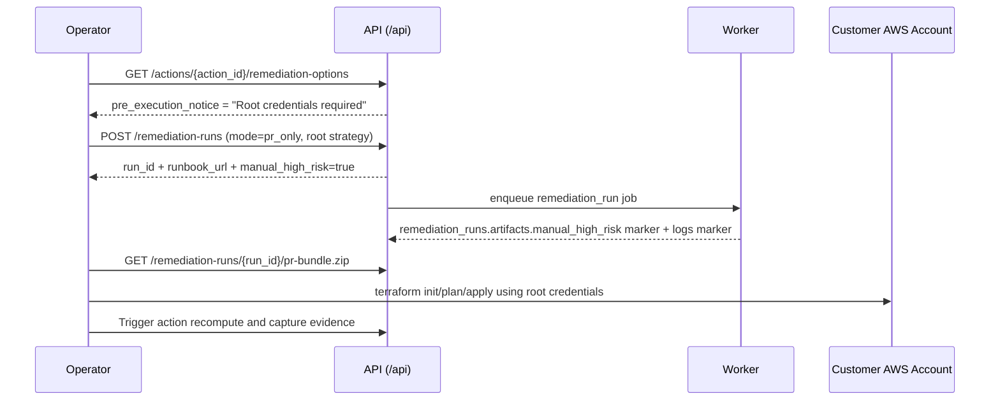

# Root-Credentials-Required Runbook (`iam_root_access_key_absent`)

This runbook is the mandatory operational path for `iam_root_access_key_absent` when strategy is:
- `iam_root_key_disable`
- `iam_root_key_delete`

This remediation is marked `manual/high-risk` in API and worker artifacts and requires AWS **root** credentials during Terraform apply.

Cross-reference:
- [PR Bundle Artifact Readiness](README.md)
- [Implementation Plan (archived snapshot)](../archive/2026-02-doc-cleanup/implementation-plan.md)

## Workflow Overview



## Prerequisites

1. SaaS approval identity is authenticated and authorized to create remediation runs.
2. Action type is exactly `iam_root_access_key_absent`.
3. Strategy is selected:
   - `iam_root_key_disable` (reversible if key IDs are preserved)
   - `iam_root_key_delete` (irreversible deletion of existing root keys)
4. Operator has access to a hardened workstation approved for root-credential use.
5. Break-glass controls are verified before apply:
   - Root MFA is enabled.
   - At least one non-root admin role path is validated.
6. Terraform CLI and AWS CLI are installed on operator workstation.

## Required Approvals

1. Security approver confirms strategy choice and risk acceptance.
2. Change approver confirms maintenance window and rollback plan.
3. Operator acknowledges `Root credentials required` warning before run creation.

Capture these approval identities in the change ticket before execution.

## Exact Execution Steps

1. Load remediation options and confirm the warning:
   ```bash
   curl -sS -H "Authorization: Bearer <YOUR_VALUE_HERE>" \
     "https://<YOUR_VALUE_HERE>/api/actions/<YOUR_VALUE_HERE>/remediation-options" | jq .
   ```
   Replace values:
   - first `<YOUR_VALUE_HERE>`: API bearer token
   - second `<YOUR_VALUE_HERE>`: API host
   - third `<YOUR_VALUE_HERE>`: `action_id`

2. Create PR-bundle remediation run:
   ```bash
   curl -sS -X POST \
     -H "Authorization: Bearer <YOUR_VALUE_HERE>" \
     -H "Content-Type: application/json" \
     "https://<YOUR_VALUE_HERE>/api/remediation-runs" \
     -d '{
       "action_id": "<YOUR_VALUE_HERE>",
       "mode": "pr_only",
       "strategy_id": "iam_root_key_disable",
       "risk_acknowledged": true
     }' | jq .
   ```

3. Poll run until `status=success`, then download bundle:
   ```bash
   curl -sS -H "Authorization: Bearer <YOUR_VALUE_HERE>" \
     "https://<YOUR_VALUE_HERE>/api/remediation-runs/<YOUR_VALUE_HERE>" | jq .
   curl -sS -L -H "Authorization: Bearer <YOUR_VALUE_HERE>" \
     "https://<YOUR_VALUE_HERE>/api/remediation-runs/<YOUR_VALUE_HERE>/pr-bundle.zip" \
     -o pr-bundle-root-keys.zip
   ```

4. Extract bundle and authenticate AWS CLI as root for the target account:
   ```bash
   unzip -o pr-bundle-root-keys.zip -d pr-bundle-root-keys
   cd pr-bundle-root-keys
   aws sts get-caller-identity
   ```
   Expected ARN pattern: `arn:aws:iam::<account_id>:root`

5. Execute Terraform:
   ```bash
   terraform init
   terraform plan
   terraform apply
   ```

6. Preserve command outputs and close execution window.

## Rollback and Verification

### Rollback

1. If strategy was `iam_root_key_disable`:
   - Re-enable only if emergency authorization exists:
     ```bash
     aws iam update-access-key --access-key-id <YOUR_VALUE_HERE> --status Active
     ```
2. If strategy was `iam_root_key_delete`:
   - Deletion is irreversible.
   - Emergency fallback is creating a new root key (temporary break-glass only), then rotating/removing immediately after incident.

### Verification

1. Confirm root access key state:
   ```bash
   aws iam list-access-keys
   ```
2. Recompute actions in SaaS and confirm `iam_root_access_key_absent` action resolves.
3. Verify run record contains:
   - `approved_by_user_id`
   - `artifacts.manual_high_risk.marker = MANUAL_HIGH_RISK_ROOT_CREDENTIALS_REQUIRED`
   - worker log line containing the same marker.

## Audit Evidence to Capture

Store all evidence under the change ticket and compliance export package:

1. Approval evidence:
   - Security approver identity and timestamp.
   - Change approver identity and timestamp.
2. SaaS run evidence:
   - `POST /api/remediation-runs` response (`run_id`, `manual_high_risk`, `runbook_url`).
   - `GET /api/remediation-runs/{run_id}` showing `approved_by_user_id`, logs, and artifacts marker.
3. Execution identity evidence:
   - `aws sts get-caller-identity` output proving root ARN used during apply.
4. Terraform evidence:
   - `terraform plan` and `terraform apply` outputs.
5. Verification evidence:
   - `aws iam list-access-keys` post-apply output.
   - Action recompute output showing resolved state.
