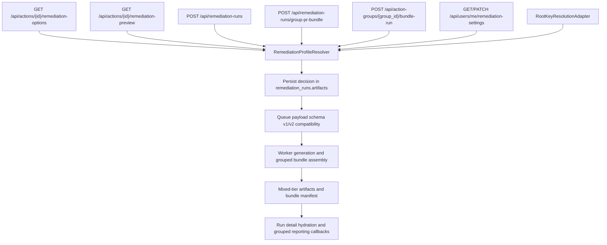

# Remediation Profile Resolution

> Scope date: 2026-03-14
>
> ⚠️ Status: Planned — not yet implemented
>
> This document defines the planned backend-centered remediation profile resolution model for generic remediation flows that produce PR bundles, review bundles, or manual guidance artifacts.

## Summary

- Introduce a backend `RemediationProfileResolver` as the sole safety authority for generic remediation flows.
- Introduce a `RootKeyResolutionAdapter` so generic IAM.4 bundle and guidance generation uses the same decision model without bypassing the existing root-key state machine or changing execution authority.
- Keep the current public `strategy_id` catalog as the compatibility contract. Profiles are additive execution variants nested beneath strategies.
- Persist resolved decisions in `remediation_runs.artifacts`, using `artifacts.resolution` for single-action runs and `artifacts.group_bundle.action_resolutions` for grouped runs.
- Keep grouped runs on the current single-`RemediationRun`-row model in phase 1.
- Store tenant-scoped remediation defaults on `Tenant.remediation_settings` JSONB and expose them through `GET/PATCH /api/users/me/remediation-settings`.
- Keep `direct_fix` explicitly out of scope for this migration. Existing direct-fix preview, approval, validation, queueing, and execution remain unchanged in this phase.

Related docs:

- [Remediation safety model](/Users/marcomaher/AWS%20Security%20Autopilot/docs/remediation-safety-model.md)
- [Repo-aware PR automation](/Users/marcomaher/AWS%20Security%20Autopilot/docs/features/repo-aware-pr-automation.md)
- [Root-key safe remediation technical spec](/Users/marcomaher/AWS%20Security%20Autopilot/docs/live-e2e-testing/root-key-safe-remediation-spec.md)
- [Root-key remediation lifecycle UI](/Users/marcomaher/AWS%20Security%20Autopilot/docs/features/root-key-remediation-lifecycle-ui.md)
- [Implementation plan](/Users/marcomaher/AWS%20Security%20Autopilot/docs/remediation-profile-resolution/implementation-plan.md)

## Wave 0 Baselines

- [Wave 0 contract lock](/Users/marcomaher/AWS%20Security%20Autopilot/docs/remediation-profile-resolution/wave-0-contract-lock.md)
- [Wave 0 API contract baseline](/Users/marcomaher/AWS%20Security%20Autopilot/docs/remediation-profile-resolution/wave-0-api-contract-baseline.md)
- [Wave 0 legacy compatibility baseline](/Users/marcomaher/AWS%20Security%20Autopilot/docs/remediation-profile-resolution/wave-0-legacy-compat-baseline.md)
- [Wave 0 worker and root-key baseline](/Users/marcomaher/AWS%20Security%20Autopilot/docs/remediation-profile-resolution/wave-0-worker-rootkey-baseline.md)

## Wave 1 Foundations

- [Wave 1 foundation contracts](/Users/marcomaher/AWS%20Security%20Autopilot/docs/remediation-profile-resolution/wave-1-foundation-contracts.md)

## Wave 2 Read and Single-Run Surfaces

- [Wave 2 read and single-run surfaces](/Users/marcomaher/AWS%20Security%20Autopilot/docs/remediation-profile-resolution/wave-2-read-and-single-run-surfaces.md)

## Scope and Non-Goals

In scope:

- Resolution-aware remediation options and remediation preview.
- Generic single-run remediation creation.
- Both grouped PR bundle creation routes:
  - `POST /api/remediation-runs/group-pr-bundle`
  - `POST /api/action-groups/{group_id}/bundle-run`
- Grouped bundle generation, grouped bundle execution compatibility, and grouped reporting compatibility.
- IAM.4 generic bundle and guidance resolution through a root-key adapter.
- Tenant remediation defaults, additive metrics, additive audit evidence, and artifact persistence.
- Queue payload migration, resend compatibility, duplicate detection updates, and backward compatibility for current clients.
- Incremental migration of selected control families into resolver-backed profile selection.

Not in scope:

- Replacing the direct-fix runtime.
- Expanding CloudFormation rendering support.
- Adding first-class `remediation_runs` columns for strategy or profile metadata in this phase.
- Replacing current public strategy IDs.
- Changing the current root-key contract versioning model.
- Introducing a second IAM.4 execution authority outside `/api/root-key-remediation-runs`.

## Compatibility Contract

- `strategy_id` remains the public compatibility contract in this migration.
- Existing public strategy rows keep their current meaning and remain usable by strategy-only clients.
- Profiles are additive beneath strategies. A currently valid strategy row never becomes understandable only through a new profile layer in phase 1.
- Where a strategy already maps to one concrete remediation path, `profile_id == strategy_id` in phase 1.
- If a future release adds branching beneath a formerly single-profile strategy, `strategy_id`-only requests must continue to resolve to the legacy-equivalent default profile automatically.
- Existing clients that send only `strategy_id` and `strategy_inputs` must continue to succeed when the legacy path remains valid.
- Legacy `strategy_inputs` continue participating in profile auto-selection where they historically encoded branch selection.
- If neither `profile_id` nor legacy-disambiguating `strategy_inputs` uniquely identifies a profile, the backend returns a validation response instead of silently picking one.
- Missing business-sensitive values are never invented and must resolve to `review_required_bundle` or `manual_guidance_only`.
- No grouped-run creation path may bypass resolver-backed safety once this migration is in place.
- No root-key execution behavior may change based on `profile_id` in this phase. `strategy_id` remains authoritative for the dedicated root-key subsystem.

## Resolver Model

The planned `RemediationProfileResolver` is a pure or sync-compatible core shared by async API entry points and sync worker paths.

Resolver inputs:

- action and linked findings
- selected strategy family
- optional `profile_id`
- explicit user inputs
- tenant remediation settings
- runtime signals
- current-resource evidence
- computed risk snapshot

Resolver behavior:

- Reuse and extend `collect_runtime_risk_signals` plus control-specific evidence adapters required for profile eligibility and downgrade decisions.
- Treat linked findings and current-resource evidence as explicit inputs to the decision, not hidden generator-time discovery.
- Keep input precedence fixed:
  - explicit request values
  - tenant remediation settings
  - runtime-safe defaults already declared in schema
  - static profile defaults
- Never promote runtime evidence into business-sensitive defaults.
- Allow generators to consume only resolved inputs, resolved profile data, and explicit evidence attached to the decision or risk snapshot.
- Move remediation preview from strategy-only simulation to resolved-decision simulation so preview matches actual run creation.

Resolver outputs:

- `strategy_id`
- `profile_id`
- `support_tier`
- `resolved_inputs`
- `missing_inputs`
- `missing_defaults`
- `blocked_reasons`
- `rejected_profiles`
- `finding_coverage`
- `preservation_summary`
- `decision_rationale`
- `decision_version`

`decision_version` is a persisted decision-semantics identifier. It starts at `resolver/v1`, changes only when persisted schema or selection semantics change materially, and must be treated as opaque evidence by older consumers.

Support tiers:

- `deterministic_bundle`
- `review_required_bundle`
- `manual_guidance_only`

## Public Interfaces

Planned additive interface changes:

- `GET /api/actions/{id}/remediation-options`
  - keeps `strategies[]`
  - adds strategy-level metadata such as `profiles[]`, `recommended_profile_id`, `missing_defaults`, `blocked_reasons`, and `decision_rationale`
- `GET /api/actions/{id}/remediation-preview`
  - accepts optional `profile_id`
  - returns a `resolution` object tied to the backend-selected profile
- `POST /api/remediation-runs`
  - continues to require `strategy_id` where required today
  - adds optional `profile_id`
- `POST /api/remediation-runs/group-pr-bundle`
  - keeps top-level `strategy_id` and `strategy_inputs` for backward compatibility
  - adds optional grouped `action_overrides[]`
- `POST /api/action-groups/{group_id}/bundle-run`
  - must expose the same resolution semantics as the grouped remediation-runs route
  - must gain `repo_target` support
- `GET/PATCH /api/users/me/remediation-settings`
  - remains tenant-scoped
  - PATCH remains admin-only

Planned additive request and response concepts:

- `profile_id`
- `profiles[]`
- grouped `action_overrides[]`
- `repo_target`
- `artifacts.resolution`
- `artifacts.group_bundle.action_resolutions`
- queue payload schema versioning
- run-detail fields such as `selected_profile`, `support_tier`, `rejected_profiles`, `finding_coverage`, `preservation_summary`, and `decision_rationale`

## Grouped Run and Artifact Model

- Keep one `RemediationRun` row per grouped run in phase 1.
- Keep the representative action anchor model already used today.
- Do not create per-action `RemediationRun` rows in phase 1.
- Store per-action decisions under `artifacts.group_bundle.action_resolutions`.
- Preserve the existing `ActionGroupRun` lifecycle, reporting-token issuance, callback configuration, and reporting metadata for the action-groups route.
- Replace representative-action-only risk evaluation with per-action resolution while preserving the single grouped-run-row model.

Grouped override rules:

- `action_overrides[]` is optional.
- Each override `action_id` must belong to the grouped action set for the request.
- Duplicate override entries for the same action are rejected.
- In phase 1, grouped runs remain single-action-type groups, so override strategies must remain valid for the group action type.
- Override `profile_id` must belong to the supplied override `strategy_id` family.
- Top-level grouped `strategy_id` and `strategy_inputs` remain the default for actions without overrides.
- A blocked or downgraded override affects only that action unless shared run invariants fail or zero actions can produce any artifact.

Artifact persistence rules:

- Canonical single-run decision: `artifacts.resolution`
- Canonical grouped-run decisions: `artifacts.group_bundle.action_resolutions`
- During migration, continue writing legacy mirror fields required by older logic:
  - `selected_strategy`
  - `strategy_inputs`
  - `pr_bundle_variant`
- Continue writing grouped reporting metadata and execution metadata needed by existing consumers.
- Run detail hydration must read both resolution-aware payloads and legacy mirrors during rollout.

## Queue, Worker, Executor, and Reporting Rules

Queue and worker migration:

- Treat this as a queue payload schema migration.
- Keep schema version 1 payloads runnable during rollout.
- Introduce schema version 2 for profile-aware and grouped per-action resolution payloads.
- Add a fail-closed schema-version guard before any version 2 payloads are emitted so unknown future schema versions are rejected explicitly.
- Update worker generation so grouped execution no longer assumes one strategy for every grouped action.
- Refactor or wrap `_generate_group_pr_bundle` so each grouped action is generated from its own resolved decision.
- Keep worker code compatible with sync SQLAlchemy and the sync-compatible resolver core.

Grouped bundle layout:

- New grouped bundles use:
  - `executable/actions/...`
  - `review_required/actions/...`
  - `manual_guidance/actions/...`
- New `run_all.sh` scans only `executable/actions`.
- `bundle_manifest.json` must declare `layout_version` and `execution_root`.
- Legacy grouped bundles rooted at `actions/` remain supported through executor and download/apply compatibility logic.
- Grouped bundle output must enumerate every action and its outcome across all tiers in:
  - `bundle_manifest.json`
  - `decision_log.md`
  - `finding_coverage.json`

Reporting rules:

- Preserve current grouped reporting behavior for executable actions.
- Add `non_executable_results[]` to grouped reporting callback payloads.
- Each `non_executable_results` item includes:
  - `action_id`
  - `support_tier`
  - `profile_id`
  - `strategy_id`
  - `reason`
  - `blocked_reasons`
- Review-required and manual-guidance actions are not reported as execution failures.
- Grouped hard failure remains reserved for invalid request payloads, broken shared invariants, broken grouped execution invariants, or zero-artifact outcomes.

## Root-Key Contract Boundaries

- Generic IAM.4 bundle and guidance resolution may use the shared decision model through `RootKeyResolutionAdapter`.
- `/api/root-key-remediation-runs` remains the only execution authority for IAM.4 lifecycle and state-machine work.
- The current root-key API contract version remains authoritative in this phase.
- Existing root-key requirements for `Idempotency-Key`, `X-Root-Key-Contract-Version`, canary selection, discovery gating, and transition semantics remain unchanged.
- `strategy_id` remains the authoritative root-key contract key for request validation, persistence, replay, transitions, and frontend typing.
- Any optional `profile_id` on root-key APIs in this phase is additive metadata only.
- For IAM.4 executable root-key paths in phase 1, `profile_id == strategy_id`.
- Generic IAM.4 delete-profile eligibility must not diverge from the dedicated root-key subsystem.
- If required delete-path proof such as root MFA enabled cannot be proven through approved root-key state or approved adapter evidence, the delete path is rejected or downgraded explicitly.

## Control-Family Migration Rules

Phase-1 migration rules captured in the source plan:

- EC2.53 stays under the `sg_restrict_public_ports` family and preserves `sg_restrict_public_ports_guided` as the public compatibility strategy.
- Phase-1 executable EC2.53 profiles are only:
  - `close_public`
  - `close_and_revoke`
  - `restrict_to_ip`
  - `restrict_to_cidr`
- `ssm_only` and `bastion_sg_reference` are review/manual profiles until runtime support exists.
- IAM.4 keeps `iam_root_key_disable` and `iam_root_key_delete`, each starting with `profile_id == strategy_id`.
- S3.2 keeps current strategy families and adds `website_manual` as manual-only.
- S3.5 executable output requires resolver-side policy-document classification proving merge and preservation are safe.
- S3.11 executable output requires resolver-side lifecycle classification proving additive merge is safe.
- S3.9 remains under `s3_bucket_access_logging` with internal branching for default destination, explicit external destination, and manual-only fallback.
- S3.15 remains under `s3_bucket_encryption_kms` with internal branching for AWS-managed and customer-managed KMS paths.
- CloudTrail.1 keeps `cloudtrail_enable_guided` as the public compatibility strategy while unresolved branches downgrade explicitly.
- Config.1 preserves current strategy families in phase 1 and adds `org_config_manual` as manual-only.

## Tenant Remediation Settings

Planned settings persistence:

- Add `Tenant.remediation_settings` as a JSONB column through Alembic.
- Add validated nested response and PATCH schemas.
- Keep PATCH tenant-scoped and admin-only.

PATCH semantics:

- omitted fields remain unchanged
- provided scalar fields replace existing scalar values
- provided object branches deep-merge into the existing JSONB document
- explicit `null` clears the addressed scalar field or object branch
- unknown keys are rejected with HTTP 400

Planned settings fields called out in the source plan:

- `sg_access_path_preference`
  - `close_public`
  - `restrict_to_detected_public_ip`
  - `restrict_to_approved_admin_cidr`
  - `bastion_sg_reference`
  - `ssm_only`
- `approved_bastion_security_group_ids`
- `approved_admin_cidrs`
- `cloudtrail.default_bucket_name`
- `cloudtrail.default_kms_key_arn`
- `config.delivery_mode`
- `config.default_bucket_name`
- `config.default_kms_key_arn`
- `s3_access_logs.default_target_bucket_name`
- `s3_encryption.mode`
- `s3_encryption.kms_key_arn`

The settings contract must not expose secrets beyond the intended remediation-settings scope, and the preference fields remain default-selection hints rather than overrides of explicit request inputs.

## Test and Rollout Requirements

Planned test coverage:

- Unit tests for resolver precedence, profile eligibility, downgrade paths, rejected-profile explanations, and legacy mirror persistence.
- Unit tests for `decision_version` handling.
- Unit tests for `strategy_inputs`-based profile auto-selection where legacy inputs historically disambiguate behavior.
- Unit tests for `sg_access_path_preference` selection and failure paths.
- API tests for additive `profiles[]`, single-run `profile_id`, grouped `action_overrides[]`, remediation-settings endpoints, legacy `strategy_id` behavior, and parity between grouped creation routes.
- API tests proving grouped runs remain single-row `RemediationRun` records with per-action decisions under grouped artifacts.
- Worker tests for resolution persistence, mixed-tier ZIP layout, `run_all.sh` behavior, per-action grouped generation, and schema-version compatibility.
- Resend and duplicate-detection tests proving `profile_id`, overrides, and `repo_target` participate correctly in request signatures.
- Executor tests for both legacy `actions/` bundles and new mixed-tier layouts.
- Reporting tests for `non_executable_results`.
- Root-key adapter tests proving generic IAM.4 bundle generation and root-key lifecycle APIs cannot diverge on shared gating logic.
- Frontend tests for backend-driven profile rendering and per-action grouped outcome display.

Planned rollout sequence:

1. Introduce resolver types, decision schema, profile catalog, and legacy mirror writes.
2. Add worker schema-version guardrails before version 2 payload rollout.
3. Make remediation options and remediation preview resolution-aware.
4. Wire single-run generic remediation creation to resolver-backed decision persistence.
5. Unify both grouped bundle creation routes on the same resolver-backed service.
6. Migrate queue contracts, resend logic, duplicate detection, and grouped worker generation.
7. Ship mixed-tier grouped bundle layout, manifests, reporting updates, and executor compatibility.
8. Add tenant remediation settings persistence and endpoints.
9. Migrate selected controls incrementally, keeping unresolved branches in review/manual.
10. Update product claims and operator docs only after live validation.

## Assumptions and Defaults

- Strategy IDs remain the public compatibility contract.
- Profiles are additive beneath strategies.
- `direct_fix` remains entirely out of scope for this migration.
- `remediation_runs.artifacts` remains the persistence location for resolver decisions in this phase.
- Legacy artifact keys are written alongside the new decision payload during rollout.
- Grouped runs remain one `RemediationRun` row per group in phase 1.
- `ActionGroupRun` remains the grouped-run lifecycle tracker for the action-groups route.
- Tenant remediation defaults are tenant-scoped despite the `/users/me/...` route shape.
- Grouped PR bundles remain Terraform-first in this phase.
- Existing CloudFormation rendering is not expanded as part of the resolver migration.
- Missing business-sensitive values are never invented and always resolve to `review_required_bundle` or `manual_guidance_only`.
- Generic IAM.4 bundle and guidance resolution may share decision logic, but execution authority remains solely with `/api/root-key-remediation-runs`.
