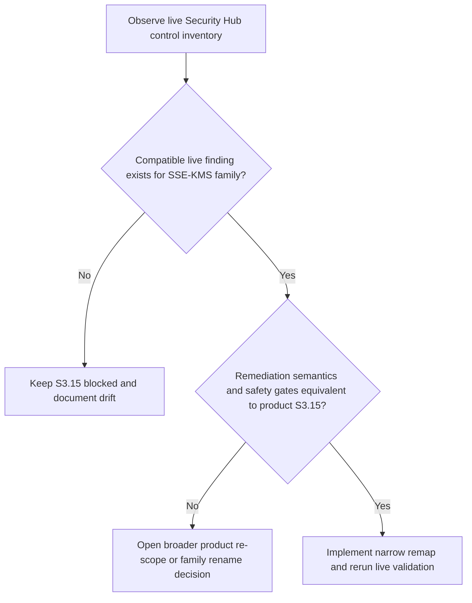

# S3.15 Live Remap Follow-Up

> Scope date: 2026-03-16
>
> ⚠️ Status: Planned — not yet implemented
>
> This follow-up packet exists because the Wave 6 `s3_bucket_encryption_kms` family behavior is implemented on `master`, but the March 15 live rerun proved there is still no truthful live Security Hub control/finding mapping for the product's `S3.15` SSE-KMS semantics in the isolated account.

Related docs:

- [Remediation profile resolution README](/Users/marcomaher/AWS%20Security%20Autopilot/docs/remediation-profile-resolution/README.md)
- [Wave 6 control-family migration](/Users/marcomaher/AWS%20Security%20Autopilot/docs/remediation-profile-resolution/wave-6-control-family-migration.md)
- [Wave 6 blocker-closure rerun summary](/Users/marcomaher/AWS%20Security%20Autopilot/docs/test-results/live-runs/20260315T213821Z-rem-profile-wave6-readiness-rerun/notes/final-summary.md)
- [Wave 6 blocker-closure family matrix](/Users/marcomaher/AWS%20Security%20Autopilot/docs/test-results/live-runs/20260315T213821Z-rem-profile-wave6-readiness-rerun/notes/family-readiness-matrix.md)

## Current Evidence Baseline

- Run ID: `20260315T213821Z-rem-profile-wave6-readiness-rerun`
- Account: `696505809372`
- Primary region: `eu-north-1`
- Product family under review: `S3.15` -> `s3_bucket_encryption_kms`
- Current seeded executable-candidate resource: `arn:aws:s3:::security-autopilot-w6-envready-s315-exec-696505809372`

Highest-signal evidence from the rerun:

- Enabled live S3 control inventory still contains only:
  - `S3.13`
  - `S3.2`
  - `S3.8`
- Fresh `S3.15` findings remain empty:
  - [s315-findings.json](/Users/marcomaher/AWS%20Security%20Autopilot/docs/test-results/live-runs/20260315T213821Z-rem-profile-wave6-readiness-rerun/evidence/aws/s315-findings.json)
  - [s315-findings-refresh.json](/Users/marcomaher/AWS%20Security%20Autopilot/docs/test-results/live-runs/20260315T213821Z-rem-profile-wave6-readiness-rerun/evidence/aws/s315-findings-refresh.json)
- Post-seeding action inventory contains no `s3_bucket_encryption_kms` action:
  - [actions-list-post-seeding.json](/Users/marcomaher/AWS%20Security%20Autopilot/docs/test-results/live-runs/20260315T213821Z-rem-profile-wave6-readiness-rerun/evidence/api/actions-list-post-seeding.json)
- Current live control inventory evidence:
  - [s3-control-inventory.json](/Users/marcomaher/AWS%20Security%20Autopilot/docs/test-results/live-runs/20260315T213821Z-rem-profile-wave6-readiness-rerun/evidence/aws/s3-control-inventory.json)
  - [s3-control-inventory-refresh.json](/Users/marcomaher/AWS%20Security%20Autopilot/docs/test-results/live-runs/20260315T213821Z-rem-profile-wave6-readiness-rerun/evidence/aws/s3-control-inventory-refresh.json)

## Exact Mismatch

The current live isolated account has no enabled Security Hub control/finding that truthfully materializes the product's `S3.15` family semantics:

- the product family expects bucket-scoped SSE-KMS enforcement behavior
- the isolated account's live Security Hub control inventory does not currently expose a compatible `S3.15` finding stream
- direct AWS runtime proof such as `GetBucketEncryption` on the seeded bucket is not enough to claim product readiness without a real Security Hub finding/action materialization path

> ❓ Needs verification: Which current live Security Hub control, if any, now expresses the product's intended SSE-KMS bucket-encryption semantics closely enough to justify a remap without weakening safety boundaries?

## Decision Boundary

## Prohibited Shortcuts

The follow-up must not do any of the following:

- add a live alias from inventory-only data without a truthful Security Hub finding/action materialization path
- add a live alias from shadow-state observations alone
- mark `S3.15` ready from direct `GetBucketEncryption` probes on `security-autopilot-w6-envready-s315-exec-696505809372` without a real Security Hub finding
- claim readiness from a seeded bucket that never produces a canonical `s3_bucket_encryption_kms` action

## Acceptable Follow-On Options

Only these next steps are in bounds:

1. Keep `S3.15` blocked until AWS exposes a truthful compatible control/finding.
2. Remap `S3.15` to a different live Security Hub control only if the remediation semantics and the existing customer-managed KMS safety boundaries are equivalent.
3. Re-scope or rename the product family as a broader product decision if the current `S3.15` name no longer matches live AWS semantics.

## Acceptance Evidence Before Any Future Code Change

No runtime or mapping change should land until the chosen path can produce all of the following:

- one real executable-ready live case with exact action ID, run ID, resource ID, control ID, and region recorded
- one real downgrade-ready live case with exact action ID, resource ID, blocked reasons, and region recorded
- updated focused resolver/runtime/bundle tests tied to the chosen mapping, not generic fallback coverage

If the chosen path is a product re-scope rather than a narrow remap, the follow-up must also update the remediation-profile docs and task history so the renamed family claim matches the live AWS source of truth.
