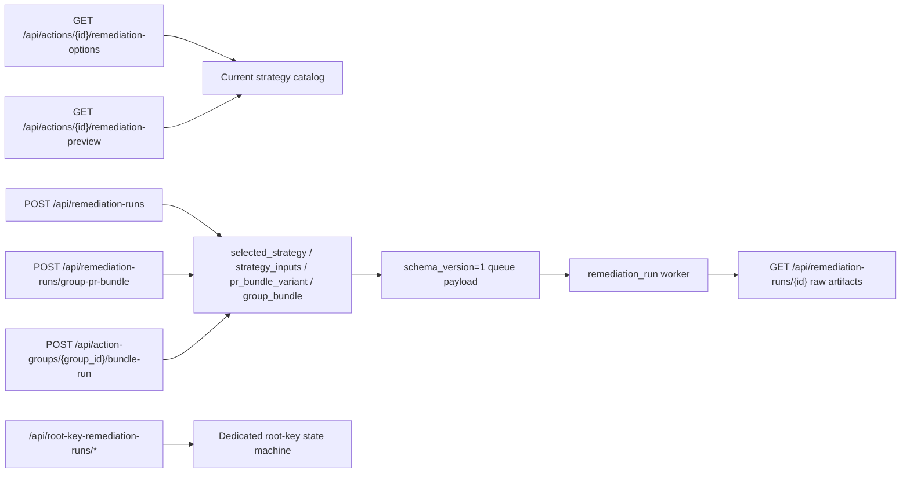

# Wave 0 Contract Lock

> Scope date: 2026-03-14
>
> This document is the Wave 0 current-state contract lock for remediation profile resolution. Later waves must preserve this baseline unless a deliberate contract revision updates both the live code and this lock.

Source baselines:

- [Wave 0 API contract baseline](/Users/marcomaher/AWS%20Security%20Autopilot/docs/remediation-profile-resolution/wave-0-api-contract-baseline.md)
- [Wave 0 legacy compatibility baseline](/Users/marcomaher/AWS%20Security%20Autopilot/docs/remediation-profile-resolution/wave-0-legacy-compat-baseline.md)
- [Wave 0 worker and root-key baseline](/Users/marcomaher/AWS%20Security%20Autopilot/docs/remediation-profile-resolution/wave-0-worker-rootkey-baseline.md)

## Summary Lock

- The current public generic remediation contract is still `strategy_id`-centric. There is no shipped `profile_id` surface yet.
- Legacy artifact mirrors `selected_strategy`, `strategy_inputs`, and `pr_bundle_variant` are still active compatibility fields and still have live readers.
- Duplicate detection and resend behavior are already route-specific and must not be changed silently during later profile work.
- Worker payloads are still schema version `1`, and unknown future versions already fail closed through contract quarantine.
- IAM.4 root-key execution authority remains exclusively under `/api/root-key-remediation-runs`.
- Rollback, validation, and legacy run readability must keep working even if later waves are partially rolled out or reverted.

## 1. Current API Contract Surface

### Generic options and preview

- `GET /api/actions/{id}/remediation-options` is still strategy-oriented:
  - top-level contract: `action_id`, `action_type`, `mode_options`, `strategies[]`, `recommendation`, `manual_high_risk`, `pre_execution_notice`, `runbook_url`
  - `strategies[]` currently expose strategy metadata and runtime checks, not profile metadata
  - there is no current `profiles[]`, `recommended_profile_id`, `missing_defaults`, `blocked_reasons`, or `decision_rationale`
- `GET /api/actions/{id}/remediation-preview` is still mode-oriented:
  - accepts `mode`, optional `strategy_id`, and optional JSON-encoded `strategy_inputs`
  - returns `compliant`, `message`, `will_apply`, `impact_summary`, `before_state`, `after_state`, and `diff_lines`
  - `pr_only` preview is informational only; there is no shipped decision `resolution` object

### Generic create routes

- `POST /api/remediation-runs` currently accepts:
  - `action_id`
  - `mode`
  - optional `strategy_id`
  - optional `strategy_inputs`
  - `risk_acknowledged`
  - optional deprecated `pr_bundle_variant`
  - optional `repo_target`
- `POST /api/remediation-runs/group-pr-bundle` currently accepts:
  - group selector fields `action_type`, `account_id`, `status`, `region | region_is_null`
  - optional `strategy_id`
  - optional `strategy_inputs`
  - `risk_acknowledged`
  - optional deprecated `pr_bundle_variant`
  - optional `repo_target`
- `POST /api/action-groups/{group_id}/bundle-run` currently accepts only:
  - optional `strategy_id`
  - optional `strategy_inputs`
  - `risk_acknowledged`
  - optional deprecated `pr_bundle_variant`
- Explicit lock for later waves:
  - no shipped `profile_id`
  - no grouped `action_overrides[]`
  - no `repo_target` on the action-groups route

### Run detail surface

- `GET /api/remediation-runs/{id}` still returns raw stored `artifacts`
- Current run detail does not hydrate:
  - `selected_profile`
  - `support_tier`
  - `rejected_profiles`
  - `finding_coverage`
  - `preservation_summary`
  - `decision_rationale`
- Later waves must keep old runs readable while new fields roll out

## 2. Legacy Artifact Mirror Fields and Consumers

| Field | Why it is still locked | Current live readers |
| --- | --- | --- |
| `selected_strategy` | current generic compatibility key | duplicate detection, resend, remediation worker fallback, manual-high-risk helpers, raw run detail |
| `strategy_inputs` | current persisted request-shape mirror | duplicate detection, resend, remediation worker fallback, execution change-summary generation, raw run detail |
| `pr_bundle_variant` | current legacy client bridge to strategy selection | duplicate detection, resend, worker variant fallback, legacy create-time mapping |

Preservation rules:

- Later waves may add canonical resolution payloads, but they must not remove these mirrors until every duplicate-detection, resend, worker, executor, and run-detail reader has moved.
- `GET /api/remediation-runs/{id}` currently exposes these fields directly through stored artifacts, so rollback compatibility is not optional.

## 3. Current Duplicate-Detection and Resend Behavior

### Single-run `POST /api/remediation-runs`

- Active duplicate block:
  - any run for the same `action_id` in `pending`, `running`, or `awaiting_approval` returns `409 duplicate_active_run`
- Current request-signature comparison fields:
  - `mode`
  - `selected_strategy`
  - `strategy_inputs`
  - `pr_bundle_variant`
  - `repo_target`
- Current windows:
  - `pr_only`: total `6` runs per `20 minutes` for the action
  - `pr_only`: identical signature `3` runs per `20 minutes`
  - `direct_fix`: identical signature blocked for `30 seconds`
- Current signature does not include `risk_acknowledged`

### Grouped `POST /api/remediation-runs/group-pr-bundle`

- Current duplicate block is only for pending grouped runs
- Match criteria:
  - same `group_key`
  - same `repo_target`
- Current `group_key` shape:
  - `{action_type}|{account_id}|{region-or-global}|{status}`
- There is no current grouped total-window or identical-window rate limit on this route

### Grouped `POST /api/action-groups/{group_id}/bundle-run`

- Current route does not enforce the same duplicate or rate-limit behavior as `POST /api/remediation-runs/group-pr-bundle`
- It always seeds grouped reporting metadata under `artifacts.group_bundle.reporting`

### `POST /api/remediation-runs/{id}/resend`

- Current resend rules:
  - only `pending` runs can be resent
  - maximum `3` resend attempts in `20 minutes`
  - resend timestamps persist in `artifacts.queue_resend_attempts`
- Current resend reconstructs:
  - `pr_bundle_variant`
  - `selected_strategy`
  - `strategy_inputs`
  - `risk_acknowledged`
  - grouped action ids from `artifacts.group_bundle.action_ids`
- Current resend does not explicitly rebuild `repo_target` into the queue payload
- Current compatibility still works because the remediation worker falls back to `artifacts.repo_target`
- Later waves must preserve that fallback or add an explicit resend payload field before removing it

## 4. Worker Schema-Version Fail-Closed Baseline

- Current outbound queue schema version is `1`
- Current worker support table accepts only schema version `1`
- Missing `schema_version` currently defaults to legacy version `1`
- Invalid or unknown future versions already fail closed through contract quarantine with reason `unsupported_schema_version`
- Both worker entrypoints already enforce this:
  - `backend/workers/main.py`
  - `backend/workers/lambda_handler.py`
- Later waves must preserve:
  - schema v1 runnability during rollout
  - explicit rejection of unknown future versions before any v2 payloads are emitted

## 5. Root-Key Execution-Authority Boundary

- IAM.4 execution authority remains exclusively under `/api/root-key-remediation-runs`
- Current dedicated root-key contract facts that later waves must preserve:
  - contract version `2026-03-02`
  - mutating routes require `Idempotency-Key`
  - optional `X-Root-Key-Contract-Version` must match when supplied
  - create is limited to `iam_root_access_key_absent`
  - supported strategies remain `iam_root_key_disable` and `iam_root_key_delete`
  - create still enforces canary gating and optional discovery gating
  - validate, disable, rollback, delete, pause, resume, and external-task completion remain state-machine-driven
  - delete fails closed with `503 executor_unavailable` when the executor worker path is disabled
- Generic remediation surfaces may continue to expose root-credentials-required warnings, but they must not become a second IAM.4 execution authority

## 6. Rollback and Validation Expectations Later Waves Must Preserve

- Schema rollback expectations:
  - schema version `1` queue payloads must keep running until migration completion is explicit
  - contract quarantine for unknown versions must remain fail closed
- Artifact rollback expectations:
  - old runs must remain readable through `GET /api/remediation-runs/{id}`
  - legacy mirrors must remain available during phased rollout and rollback
- Grouped-run expectations:
  - current grouped bundle flows must remain usable while new per-action resolution logic is introduced
  - current executor/download compatibility with `group_bundle.action_ids` and `group_bundle.resolved_action_ids` must not break
- Root-key expectations:
  - current canary, discovery, pause, rollback, and delete protections must remain intact
  - no later wave may move root-key lifecycle control out of the dedicated router/state machine

## 7. Validation Floor

Current tests that already back this Wave 0 lock:

- [tests/test_remediation_runs_api.py](/Users/marcomaher/AWS%20Security%20Autopilot/tests/test_remediation_runs_api.py)
- [tests/test_remediation_run_worker.py](/Users/marcomaher/AWS%20Security%20Autopilot/tests/test_remediation_run_worker.py)
- [tests/test_worker_main_contract_quarantine.py](/Users/marcomaher/AWS%20Security%20Autopilot/tests/test_worker_main_contract_quarantine.py)
- [tests/test_root_key_remediation_runs_api.py](/Users/marcomaher/AWS%20Security%20Autopilot/tests/test_root_key_remediation_runs_api.py)

Later waves should extend these baselines rather than replacing them with undocumented behavior changes.
