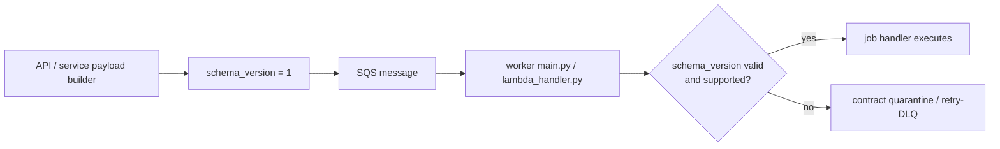
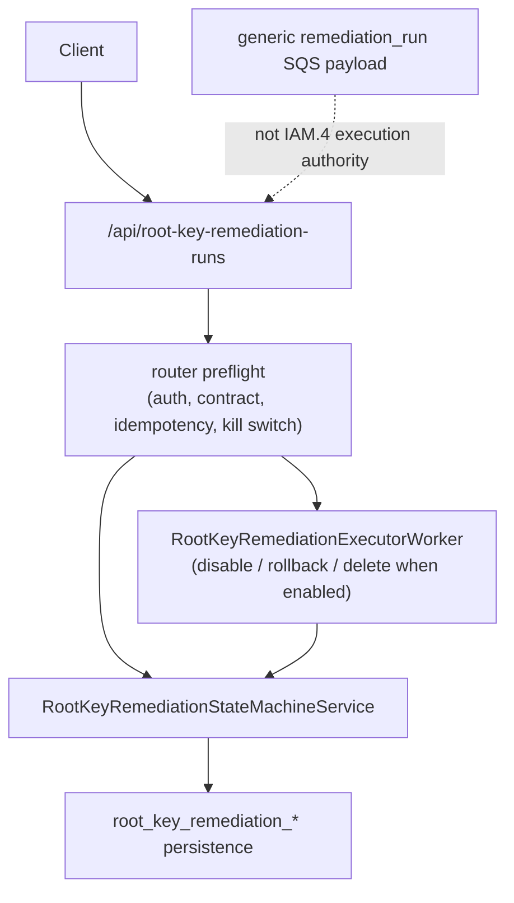

# Wave 0 Worker + Root-Key Baseline

> Scope date: 2026-03-14
>
> This document freezes the current worker queue-contract behavior and the current root-key execution boundary before remediation profile-resolution work changes any payload or orchestration paths.
>
> If this document and runtime behavior ever disagree, treat the current code as authoritative for Wave 0 and rev the contract explicitly before changing behavior.

Related docs:

- [Remediation profile resolution spec](/Users/marcomaher/AWS%20Security%20Autopilot/docs/remediation-profile-resolution/README.md)
- [Remediation profile resolution implementation plan](/Users/marcomaher/AWS%20Security%20Autopilot/docs/remediation-profile-resolution/implementation-plan.md)
- [Root-key safe remediation technical spec](/Users/marcomaher/AWS%20Security%20Autopilot/docs/live-e2e-testing/root-key-safe-remediation-spec.md)
- [Queue contract quarantine runbook](/Users/marcomaher/AWS%20Security%20Autopilot/docs/queue-contract-quarantine-runbook.md)

## Queue Payload Version Baseline

- All current outbound SQS payload builders stamp `schema_version = 1` through `_with_schema_version(...)`, and `QUEUE_PAYLOAD_SCHEMA_VERSION` is currently locked to `1`. Code: [backend/utils/sqs.py:28](/Users/marcomaher/AWS%20Security%20Autopilot/backend/utils/sqs.py#L28), [backend/utils/sqs.py:31](/Users/marcomaher/AWS%20Security%20Autopilot/backend/utils/sqs.py#L31)
- The generic remediation-run payload builder emits only:
  - required: `job_type`, `run_id`, `tenant_id`, `action_id`, `mode`, `created_at`
  - optional legacy/current fields: `pr_bundle_variant`, `strategy_id`, `strategy_inputs`, `risk_acknowledged`, `group_action_ids[]`, `repo_target`
  - queue contract field: `schema_version`
  - It does not currently emit `profile_id`, resolved-decision metadata, or any root-key contract/version fields. Code: [backend/utils/sqs.py:335](/Users/marcomaher/AWS%20Security%20Autopilot/backend/utils/sqs.py#L335)
- The current worker-side legacy default is also `1`: when `schema_version` is omitted, both worker entrypoints resolve it to `LEGACY_QUEUE_PAYLOAD_SCHEMA_VERSION = 1`. Code: [backend/workers/main.py:245](/Users/marcomaher/AWS%20Security%20Autopilot/backend/workers/main.py#L245), [backend/workers/main.py:438](/Users/marcomaher/AWS%20Security%20Autopilot/backend/workers/main.py#L438), [backend/workers/lambda_handler.py:25](/Users/marcomaher/AWS%20Security%20Autopilot/backend/workers/lambda_handler.py#L25)
- Current producer regression coverage confirms every queue payload builder includes `schema_version == QUEUE_PAYLOAD_SCHEMA_VERSION`. Test: [tests/test_sqs_utils.py:415](/Users/marcomaher/AWS%20Security%20Autopilot/tests/test_sqs_utils.py#L415)

## Worker Fail-Closed Guard Behavior

- The worker contract already fail-closes on unknown payload versions. Each known job type currently supports only `{1}` via `SUPPORTED_QUEUE_SCHEMA_VERSIONS_BY_JOB_TYPE`. Code: [backend/workers/main.py:246](/Users/marcomaher/AWS%20Security%20Autopilot/backend/workers/main.py#L246)
- Both worker entrypoints follow the same order before handler execution:
  1. parse JSON,
  2. validate required fields,
  3. resolve `job_type`,
  4. reject unknown handlers,
  5. parse `schema_version`,
  6. reject invalid or unsupported versions,
  7. only then dispatch the handler.
  Code: [backend/workers/main.py:746](/Users/marcomaher/AWS%20Security%20Autopilot/backend/workers/main.py#L746), [backend/workers/lambda_handler.py:213](/Users/marcomaher/AWS%20Security%20Autopilot/backend/workers/lambda_handler.py#L213)
- Invalid schema values fail closed. `_parse_schema_version(...)` accepts integers and digit-only strings, rejects booleans and other non-integer values, and the worker quarantines those messages with `reason_code = unsupported_schema_version` plus `reason_detail = invalid_schema_version=...`. Code: [backend/workers/main.py:425](/Users/marcomaher/AWS%20Security%20Autopilot/backend/workers/main.py#L425), [backend/workers/main.py:813](/Users/marcomaher/AWS%20Security%20Autopilot/backend/workers/main.py#L813), [backend/workers/lambda_handler.py:282](/Users/marcomaher/AWS%20Security%20Autopilot/backend/workers/lambda_handler.py#L282)
- Unsupported but parseable future versions also fail closed. The worker records `job_type`, requested `schema_version`, and the supported version set in quarantine detail. Code: [backend/workers/main.py:827](/Users/marcomaher/AWS%20Security%20Autopilot/backend/workers/main.py#L827), [backend/workers/lambda_handler.py:296](/Users/marcomaher/AWS%20Security%20Autopilot/backend/workers/lambda_handler.py#L296)
- Quarantine behavior is intentionally not silent:
  - when `SQS_CONTRACT_QUARANTINE_QUEUE_URL` is configured and quarantine succeeds, the source message is ACKed/deleted and the violation is preserved in the quarantine queue;
  - when quarantine is unavailable or send fails, the source message is left for normal retry/DLQ handling.
  Code: [backend/workers/main.py:318](/Users/marcomaher/AWS%20Security%20Autopilot/backend/workers/main.py#L318), [backend/workers/lambda_handler.py:127](/Users/marcomaher/AWS%20Security%20Autopilot/backend/workers/lambda_handler.py#L127)
- Wave 0 conclusion: the schema-version fail-closed guard already exists in both worker runtimes and does not require code refactor in this wave. Primary sources: [backend/workers/main.py:813](/Users/marcomaher/AWS%20Security%20Autopilot/backend/workers/main.py#L813), [backend/workers/lambda_handler.py:282](/Users/marcomaher/AWS%20Security%20Autopilot/backend/workers/lambda_handler.py#L282)

## Root-Key Execution-Authority Boundary

- The shipped IAM.4 remediation authority is the dedicated router family at `/api/root-key-remediation-runs`; it is not routed through the generic remediation-run queue contract. Code: [backend/routers/root_key_remediation_runs.py:52](/Users/marcomaher/AWS%20Security%20Autopilot/backend/routers/root_key_remediation_runs.py#L52), [backend/utils/sqs.py:335](/Users/marcomaher/AWS%20Security%20Autopilot/backend/utils/sqs.py#L335)
- The current root-key contract is explicitly versioned as `2026-03-02`, and the router only accepts `strategy_id in {"iam_root_key_disable", "iam_root_key_delete"}`. Code: [backend/routers/root_key_remediation_runs.py:55](/Users/marcomaher/AWS%20Security%20Autopilot/backend/routers/root_key_remediation_runs.py#L55), [backend/routers/root_key_remediation_runs.py:57](/Users/marcomaher/AWS%20Security%20Autopilot/backend/routers/root_key_remediation_runs.py#L57), [backend/routers/root_key_remediation_runs.py:470](/Users/marcomaher/AWS%20Security%20Autopilot/backend/routers/root_key_remediation_runs.py#L470)
- Create-run authority is tenant-scoped and root-key-specific:
  - auth is required,
  - feature flags must be enabled,
  - `Idempotency-Key` is required,
  - the selected action must exist in tenant scope and have `action_type = iam_root_access_key_absent`,
  - optional `finding_id` must match tenant/account scope,
  - create then flows through `RootKeyRemediationStateMachineService.create_run(...)`.
  Code: [backend/routers/root_key_remediation_runs.py:703](/Users/marcomaher/AWS%20Security%20Autopilot/backend/routers/root_key_remediation_runs.py#L703), [backend/routers/root_key_remediation_runs.py:775](/Users/marcomaher/AWS%20Security%20Autopilot/backend/routers/root_key_remediation_runs.py#L775), [backend/services/root_key_remediation_state_machine.py:151](/Users/marcomaher/AWS%20Security%20Autopilot/backend/services/root_key_remediation_state_machine.py#L151)
- The persistence and replay contract remains `strategy_id`-anchored today:
  - runs, events, artifacts, dependencies, and external tasks all persist `strategy_id`,
  - idempotent create replay rejects mismatched `account_id`, `control_id`, `action_id`, `finding_id`, `strategy_id`, `mode`, or `correlation_id`.
  Code: [backend/services/root_key_remediation_store.py:146](/Users/marcomaher/AWS%20Security%20Autopilot/backend/services/root_key_remediation_store.py#L146), [backend/services/root_key_remediation_store.py:253](/Users/marcomaher/AWS%20Security%20Autopilot/backend/services/root_key_remediation_store.py#L253), [backend/services/root_key_remediation_state_machine.py:747](/Users/marcomaher/AWS%20Security%20Autopilot/backend/services/root_key_remediation_state_machine.py#L747)
- Current header expectations are already locked:
  - `Idempotency-Key` is required on all mutating root-key `POST`s and must be `<= 128` characters.
  - `X-Root-Key-Contract-Version` is optional, but any non-empty mismatch returns `400 unsupported_contract_version`.
  - Success and error responses always echo `contract_version = 2026-03-02` and `X-Root-Key-Contract-Version: 2026-03-02`.
  Code: [backend/routers/root_key_remediation_runs.py:226](/Users/marcomaher/AWS%20Security%20Autopilot/backend/routers/root_key_remediation_runs.py#L226), [backend/routers/root_key_remediation_runs.py:291](/Users/marcomaher/AWS%20Security%20Autopilot/backend/routers/root_key_remediation_runs.py#L291), [backend/routers/root_key_remediation_runs.py:311](/Users/marcomaher/AWS%20Security%20Autopilot/backend/routers/root_key_remediation_runs.py#L311)
- Delete has no generic fallback path. When the executor worker is disabled, `/delete` fails closed with `503 executor_unavailable` instead of falling back to generic state-only completion. Code: [backend/routers/root_key_remediation_runs.py:1473](/Users/marcomaher/AWS%20Security%20Autopilot/backend/routers/root_key_remediation_runs.py#L1473), regression: [tests/test_root_key_remediation_runs_api.py:569](/Users/marcomaher/AWS%20Security%20Autopilot/tests/test_root_key_remediation_runs_api.py#L569)

## Rollback and State-Transition Expectations

Current legal state transitions are enforced in the state-machine service and are the Wave 0 rollback baseline. Code: [backend/services/root_key_remediation_state_machine.py:40](/Users/marcomaher/AWS%20Security%20Autopilot/backend/services/root_key_remediation_state_machine.py#L40)

| From state | Current allowed next states |
| --- | --- |
| `discovery` | `migration`, `needs_attention`, `failed` |
| `migration` | `validation`, `needs_attention`, `rolled_back`, `failed` |
| `validation` | `disable_window`, `needs_attention`, `rolled_back`, `failed` |
| `disable_window` | `delete_window`, `needs_attention`, `rolled_back`, `failed` |
| `delete_window` | `completed`, `needs_attention`, `rolled_back`, `failed` |
| `needs_attention` | `migration`, `validation`, `disable_window`, `delete_window`, `rolled_back`, `failed` |
| `completed`, `rolled_back`, `failed` | terminal; no further transitions |

- Create baseline:
  - `create_run(...)` persists new runs as `discovery/queued`;
  - the router then auto-forwards to `migration/running` when discovery is disabled or discovery returns a safe managed result;
  - unknown dependency, partial discovery data, or discovery execution failure fail closed to `needs_attention/waiting_for_user`.
  Code: [backend/services/root_key_remediation_store.py:160](/Users/marcomaher/AWS%20Security%20Autopilot/backend/services/root_key_remediation_store.py#L160), [backend/routers/root_key_remediation_runs.py:906](/Users/marcomaher/AWS%20Security%20Autopilot/backend/routers/root_key_remediation_runs.py#L906), regressions: [tests/test_root_key_remediation_runs_api.py:607](/Users/marcomaher/AWS%20Security%20Autopilot/tests/test_root_key_remediation_runs_api.py#L607), [tests/test_root_key_remediation_runs_api.py:693](/Users/marcomaher/AWS%20Security%20Autopilot/tests/test_root_key_remediation_runs_api.py#L693)
- Pause/resume baseline:
  - pause transitions the run to `needs_attention/waiting_for_user` and stores pause context in the event payload;
  - resume restores the prior active state from the latest `pause_run` event `payload.from_state`;
  - while paused, transition endpoints and external-task completion fail closed with `409 run_paused`;
  - repeated pause returns `200` with `idempotency_replayed = true` instead of creating a new pause transition.
  Code: [backend/services/root_key_remediation_state_machine.py:340](/Users/marcomaher/AWS%20Security%20Autopilot/backend/services/root_key_remediation_state_machine.py#L340), [backend/routers/root_key_remediation_runs.py:597](/Users/marcomaher/AWS%20Security%20Autopilot/backend/routers/root_key_remediation_runs.py#L597), [backend/routers/root_key_remediation_runs.py:1135](/Users/marcomaher/AWS%20Security%20Autopilot/backend/routers/root_key_remediation_runs.py#L1135), [backend/routers/root_key_remediation_runs.py:1509](/Users/marcomaher/AWS%20Security%20Autopilot/backend/routers/root_key_remediation_runs.py#L1509), [backend/routers/root_key_remediation_runs.py:1591](/Users/marcomaher/AWS%20Security%20Autopilot/backend/routers/root_key_remediation_runs.py#L1591), regression: [tests/test_root_key_remediation_runs_api.py:1042](/Users/marcomaher/AWS%20Security%20Autopilot/tests/test_root_key_remediation_runs_api.py#L1042)
- Disable baseline:
  - with executor disabled, `/disable` is a plain state-machine transition to `disable_window/running`;
  - with executor enabled, disable first enforces the self-cutoff guard, disables root keys, records `disable_window_evidence`, and auto-rolls back if the post-disable signal window shows partial data, unknown usage, or other breakage signals.
  Code: [backend/routers/root_key_remediation_runs.py:1291](/Users/marcomaher/AWS%20Security%20Autopilot/backend/routers/root_key_remediation_runs.py#L1291), [backend/services/root_key_remediation_executor_worker.py:152](/Users/marcomaher/AWS%20Security%20Autopilot/backend/services/root_key_remediation_executor_worker.py#L152), regressions: [tests/test_root_key_remediation_runs_api.py:779](/Users/marcomaher/AWS%20Security%20Autopilot/tests/test_root_key_remediation_runs_api.py#L779), [tests/test_root_key_remediation_executor_worker.py:171](/Users/marcomaher/AWS%20Security%20Autopilot/tests/test_root_key_remediation_executor_worker.py#L171), [tests/test_root_key_remediation_executor_worker.py:219](/Users/marcomaher/AWS%20Security%20Autopilot/tests/test_root_key_remediation_executor_worker.py#L219), [tests/test_root_key_remediation_executor_worker.py:275](/Users/marcomaher/AWS%20Security%20Autopilot/tests/test_root_key_remediation_executor_worker.py#L275)
- Rollback baseline:
  - blank rollback reasons normalize to `operator_requested_rollback` at the router;
  - the state machine transitions rollback to `rolled_back/failed`;
  - when executor is enabled, rollback reactivates inactive root keys, records rollback evidence, and creates a `rollback_alert` external task.
  Code: [backend/routers/root_key_remediation_runs.py:1394](/Users/marcomaher/AWS%20Security%20Autopilot/backend/routers/root_key_remediation_runs.py#L1394), [backend/services/root_key_remediation_state_machine.py:402](/Users/marcomaher/AWS%20Security%20Autopilot/backend/services/root_key_remediation_state_machine.py#L402), [backend/services/root_key_remediation_executor_worker.py:236](/Users/marcomaher/AWS%20Security%20Autopilot/backend/services/root_key_remediation_executor_worker.py#L236), regression: [tests/test_root_key_remediation_runs_api.py:509](/Users/marcomaher/AWS%20Security%20Autopilot/tests/test_root_key_remediation_runs_api.py#L509)
- Delete baseline:
  - delete is executor-only at the router;
  - executor delete refuses to proceed unless the run is already in `disable_window` or `delete_window`, the latest `disable_window_evidence` has `window_clean = true`, the delete feature flag is on, and no unknown active dependencies remain;
  - delete then additionally blocks on explicit root-MFA absence, any active root keys still present, and self-cutoff guard failure;
  - gate failures downgrade to `needs_attention/waiting_for_user` rather than silently continuing;
  - successful non-closure delete finalizes through the state machine as `disable_window -> delete_window -> completed`.
  Code: [backend/routers/root_key_remediation_runs.py:1441](/Users/marcomaher/AWS%20Security%20Autopilot/backend/routers/root_key_remediation_runs.py#L1441), [backend/services/root_key_remediation_executor_worker.py:296](/Users/marcomaher/AWS%20Security%20Autopilot/backend/services/root_key_remediation_executor_worker.py#L296), [backend/services/root_key_remediation_executor_worker.py:629](/Users/marcomaher/AWS%20Security%20Autopilot/backend/services/root_key_remediation_executor_worker.py#L629), [backend/services/root_key_remediation_state_machine.py:274](/Users/marcomaher/AWS%20Security%20Autopilot/backend/services/root_key_remediation_state_machine.py#L274)
- Current delete-path nuance that later work must treat deliberately:
  - the executor blocks delete only when root MFA is explicitly observed as disabled (`AccountMFAEnabled == 0`);
  - if `get_account_summary()` is unreadable and the MFA probe returns `None`, that signal does not independently block delete today.
  Code: [backend/services/root_key_remediation_executor_worker.py:469](/Users/marcomaher/AWS%20Security%20Autopilot/backend/services/root_key_remediation_executor_worker.py#L469), [backend/services/root_key_remediation_executor_worker.py:318](/Users/marcomaher/AWS%20Security%20Autopilot/backend/services/root_key_remediation_executor_worker.py#L318)

## Migration-Safe Constraints For Later Profile-Resolution Work

- Do not emit any new queue `schema_version` until both worker runtimes explicitly support it. A future v2 rollout must update [backend/workers/main.py](/Users/marcomaher/AWS%20Security%20Autopilot/backend/workers/main.py) and [backend/workers/lambda_handler.py](/Users/marcomaher/AWS%20Security%20Autopilot/backend/workers/lambda_handler.py) before any producer starts sending it.
- Preserve the current legacy fallback: missing `schema_version` still resolves to `1` during rollout. A future migration may add v2, but it must not strand existing v1 or omitted-version payloads without an intentional contract cutover.
- Preserve contract quarantine as the worker fail-closed mechanism for invalid/unsupported payload versions. Future profile-resolution work must not silently coerce unknown versions or bypass quarantine before handler dispatch.
- Keep generic remediation-run payloads additive. Today they do not carry `profile_id`, resolved decision payloads, or root-key contract data; any future additions must remain backward compatible with v1 consumers until the schema version is intentionally revved.
- Keep IAM.4 execution authority on `/api/root-key-remediation-runs`. Do not move root-key lifecycle execution onto the generic remediation-run queue path or allow profile-resolution metadata to become an alternate mutating authority.
- Keep root-key `strategy_id` authoritative while the contract version remains `2026-03-02`. If future profile metadata is added, it must stay additive until the root-key contract is deliberately revved.
- Preserve current root-key header semantics:
  - mutating calls require `Idempotency-Key`,
  - mismatched `X-Root-Key-Contract-Version` still rejects with `400`,
  - responses keep echoing the current contract version in both body and header.
- Preserve current delete/rollback safety outcomes:
  - no executor means `503 executor_unavailable`,
  - illegal transitions and idempotency conflicts remain fail-closed,
  - delete gate failures downgrade to `needs_attention`,
  - disable breakage signals can still trigger rollback,
  - executor rollback still emits evidence and `rollback_alert`.
- Preserve current pause/resume semantics exactly:
  - pause is represented as `needs_attention/waiting_for_user`,
  - resume target comes from the stored pause event `from_state`,
  - paused runs block further transition and external-task mutations until resumed.

Wave 0 assessment:

- Worker/root-key guardrails are already present in code.
- Wave 0 does not require a behavior change for schema-version fail-closed handling or root-key execution-authority locking.
- The required work in this wave is to document these existing baselines so later remediation-profile-resolution slices do not accidentally break them.
