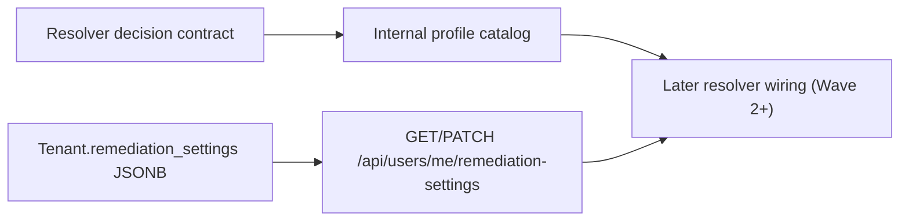

# Wave 1 Foundation Contracts

> Scope date: 2026-03-14
>
> Status: Implemented foundation only
>
> This document records the exact Wave 1 additions that landed before any Wave 2 resolver wiring.

## Scope Boundary

Wave 1 adds only the following foundations:

- the canonical resolver decision contract
- the internal remediation profile catalog seed
- tenant remediation settings persistence plus `GET/PATCH /api/users/me/remediation-settings`

Wave 1 does **not** wire profile resolution into:

- remediation options
- remediation preview
- remediation run creation
- grouped remediation routes
- queue payloads

## Canonical Resolution Decision Contract

Wave 1 adds [backend/services/remediation_profile_resolver.py](/Users/marcomaher/AWS%20Security%20Autopilot/backend/services/remediation_profile_resolver.py) and [tests/test_remediation_profile_resolver.py](/Users/marcomaher/AWS%20Security%20Autopilot/tests/test_remediation_profile_resolver.py).

The contract is a pure dict-based normalization layer with the canonical persisted fields:

- `strategy_id`
- `profile_id`
- `support_tier`
- `resolved_inputs`
- `missing_inputs`
- `missing_defaults`
- `blocked_reasons`
- `rejected_profiles`
- `finding_coverage`
- `preservation_summary`
- `decision_rationale`
- `decision_version`

Wave 1 compatibility rules locked by this module:

- `decision_version` starts at `resolver/v1`
- support tiers are normalized to `deterministic_bundle`, `review_required_bundle`, or `manual_guidance_only`
- single-profile families default `profile_id` to the public `strategy_id`
- the contract stays JSON-serializable and mutation-safe for later artifact persistence

## Internal Profile Catalog Foundation

Wave 1 adds [backend/services/remediation_profile_catalog.py](/Users/marcomaher/AWS%20Security%20Autopilot/backend/services/remediation_profile_catalog.py) and [tests/test_remediation_profile_catalog.py](/Users/marcomaher/AWS%20Security%20Autopilot/tests/test_remediation_profile_catalog.py).

The catalog remains internal and is keyed by existing public `strategy_id` values. Wave 1 seeds one internal profile per currently single-profile family:

- `cloudtrail_enable_guided`
- `config_enable_account_local_delivery`
- `config_enable_centralized_delivery`
- `s3_enable_access_logging_guided`
- `s3_enable_sse_kms_guided`
- `sg_restrict_public_ports_guided`

Each seeded entry keeps `profile_id == strategy_id` in Wave 1 and records:

- the default support tier
- any static default inputs that already exist today
- the tenant-settings paths that later resolver precedence may consume
- any explicitly tracked missing-default paths
- a rationale template explaining the preserved compatibility path

This module does not change the public strategy catalog or any current remediation route behavior.

## Tenant Remediation Settings Persistence and API

Wave 1 adds [backend/services/remediation_settings.py](/Users/marcomaher/AWS%20Security%20Autopilot/backend/services/remediation_settings.py), [alembic/versions/0043_tenant_remediation_settings.py](/Users/marcomaher/AWS%20Security%20Autopilot/alembic/versions/0043_tenant_remediation_settings.py), [backend/models/tenant.py](/Users/marcomaher/AWS%20Security%20Autopilot/backend/models/tenant.py), [backend/routers/users.py](/Users/marcomaher/AWS%20Security%20Autopilot/backend/routers/users.py), and [tests/test_remediation_settings_api.py](/Users/marcomaher/AWS%20Security%20Autopilot/tests/test_remediation_settings_api.py).

Persistence and route contract:

- `Tenant.remediation_settings` is stored as tenant-scoped JSONB
- `GET /api/users/me/remediation-settings` is authenticated and read-only
- `PATCH /api/users/me/remediation-settings` is tenant-scoped and admin-only
- omitted PATCH fields remain unchanged
- provided scalar fields replace existing scalar values
- provided object branches deep-merge into the stored document
- explicit `null` clears the addressed scalar field or object branch
- unknown keys return HTTP `400`

Wave 1 supported settings fields:

- `sg_access_path_preference`
- `approved_bastion_security_group_ids`
- `approved_admin_cidrs`
- `cloudtrail.default_bucket_name`
- `cloudtrail.default_kms_key_arn`
- `config.delivery_mode`
- `config.default_bucket_name`
- `config.default_kms_key_arn`
- `s3_access_logs.default_target_bucket_name`
- `s3_encryption.mode`
- `s3_encryption.kms_key_arn`

The route only exposes remediation-setting fields. It does not expose Slack webhooks, governance webhooks, or other tenant secrets.

## Validation Intent

Wave 1 is behavior-preserving for existing remediation execution surfaces because this branch does not modify:

- [backend/routers/remediation_runs.py](/Users/marcomaher/AWS%20Security%20Autopilot/backend/routers/remediation_runs.py)
- [backend/routers/action_groups.py](/Users/marcomaher/AWS%20Security%20Autopilot/backend/routers/action_groups.py)
- queue payload producers or worker execution payload readers

Related docs:

- [Remediation profile resolution spec](/Users/marcomaher/AWS%20Security%20Autopilot/docs/remediation-profile-resolution/README.md)
- [Implementation plan](/Users/marcomaher/AWS%20Security%20Autopilot/docs/remediation-profile-resolution/implementation-plan.md)
