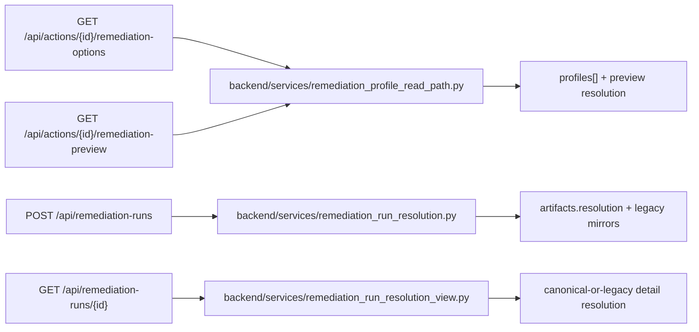

# Wave 2 Read and Single-Run Surfaces

> Scope date: 2026-03-14
>
> Status: Implemented Wave 2 slice only
>
> This document records the exact Wave 2 remediation-profile-resolution behavior integrated on top of the Wave 1 foundations.

## Scope Boundary

Wave 2 adds only the following runtime surfaces:

- resolution-aware metadata on `GET /api/actions/{id}/remediation-options`
- optional `profile_id` support plus additive `resolution` on `GET /api/actions/{id}/remediation-preview`
- optional `profile_id` support plus canonical single-run `artifacts.resolution` persistence on `POST /api/remediation-runs`
- additive run-detail `resolution` hydration on `GET /api/remediation-runs/{id}`

Wave 2 does **not** change:

- grouped create routes
- grouped execution behavior
- resend payload shape
- `backend/utils/sqs.py`
- worker code
- root-key routes
- `direct_fix` runtime semantics

## Resolution-Aware Options Metadata

Wave 2 updates [backend/routers/actions.py](/Users/marcomaher/AWS%20Security%20Autopilot/backend/routers/actions.py) to keep the existing `strategies[]` contract while adding additive profile metadata sourced from [backend/services/remediation_profile_read_path.py](/Users/marcomaher/AWS%20Security%20Autopilot/backend/services/remediation_profile_read_path.py).

Each strategy row can now expose:

- `profiles[]`
- `recommended_profile_id`
- `missing_defaults`
- `blocked_reasons`
- `decision_rationale`

Wave 2 compatibility behavior:

- the public `strategy_id` rows remain the primary contract
- Wave 1 single-profile families still resolve with `profile_id == strategy_id`
- tenant remediation settings participate only as additive read-path defaults
- dependency-check failures surface as additive `blocked_reasons`; they do not change grouped or worker behavior in this wave

## Preview `profile_id` Support and Additive `resolution`

Wave 2 extends `GET /api/actions/{id}/remediation-preview` with an optional `profile_id` query parameter.

Preview behavior:

- when `strategy_id` is absent, preview keeps its prior behavior and returns `resolution = null`
- when `strategy_id` is present, preview builds a canonical normalized `resolution` object
- when `profile_id` is omitted, preview defaults to the single compatible profile for the selected strategy family
- when `profile_id` is invalid for the selected strategy, preview returns HTTP `400`

The preview `resolution` object is additive and uses the Wave 1 canonical decision keys:

- `strategy_id`
- `profile_id`
- `support_tier`
- `resolved_inputs`
- `missing_inputs`
- `missing_defaults`
- `blocked_reasons`
- `rejected_profiles`
- `finding_coverage`
- `preservation_summary`
- `decision_rationale`
- `decision_version`

## Single-Run Create `profile_id` Support and Canonical Persistence

Wave 2 extends `POST /api/remediation-runs` in [backend/routers/remediation_runs.py](/Users/marcomaher/AWS%20Security%20Autopilot/backend/routers/remediation_runs.py) with optional `profile_id` support for `pr_only` runs.

Create-time behavior:

- `profile_id` is validated only when `mode == pr_only`
- `profile_id` requires a compatible `strategy_id`
- invalid `profile_id` returns HTTP `400`
- omitted `profile_id` defaults to the compatible single-profile family value
- `direct_fix` remains unchanged and does not persist `artifacts.resolution`

Canonical persistence added in this wave:

- single-run `pr_only` creations now persist the normalized decision under `artifacts.resolution`

Legacy compatibility preserved in the same write path:

- `selected_strategy`
- `strategy_inputs`
- `pr_bundle_variant`

Those legacy mirrors still remain on the run artifact because existing queue, resend, duplicate-detection, and worker code still depend on them in Wave 2.

## Run-Detail `resolution` Hydration

Wave 2 adds an additive nested `resolution` object on `GET /api/remediation-runs/{id}`.

Hydration order:

1. Prefer canonical `artifacts.resolution` when it exists and is a dict.
2. Otherwise synthesize a compatibility `resolution` only for legacy non-grouped `pr_only` runs with `selected_strategy`.
3. Otherwise return `resolution = null`.

Compatibility synthesis rules locked in this wave:

- `strategy_id` comes from `selected_strategy`
- `profile_id` defaults to `strategy_id`
- `resolved_inputs` comes from `strategy_inputs`
- `decision_version` defaults to `resolver/v1`
- `support_tier` is `review_required_bundle` when `risk_acknowledged == true`
- `support_tier` is otherwise `deterministic_bundle`
- `missing_inputs`, `missing_defaults`, `blocked_reasons`, and `rejected_profiles` stay empty unless canonical artifacts provide them
- grouped runs carrying `artifacts.group_bundle` do not get a fabricated single-run compatibility resolution in this wave
- raw `artifacts` are returned unchanged

## Validation Intent

Wave 2 integration added focused coverage in:

- [tests/test_remediation_profile_options_preview.py](/Users/marcomaher/AWS%20Security%20Autopilot/tests/test_remediation_profile_options_preview.py)
- [tests/test_remediation_run_resolution_create.py](/Users/marcomaher/AWS%20Security%20Autopilot/tests/test_remediation_run_resolution_create.py)
- [tests/test_remediation_run_detail_resolution.py](/Users/marcomaher/AWS%20Security%20Autopilot/tests/test_remediation_run_detail_resolution.py)

Neighboring regression coverage was also re-run to confirm:

- handoff-free closure metadata remains stable
- run-progress payloads remain stable
- preview reconcile behavior remains stable
- legacy remediation options, preview, create, and run-detail routes still work

## Deferred Follow-Up

> ⚠️ Status: Planned — not yet implemented
>
> Wave 3 still needs grouped-route parity and grouped artifact-resolution wiring.

> ⚠️ Status: Planned — not yet implemented
>
> Wave 4 still needs queue payload schema v2, resend reconstruction updates, and worker consumption of canonical resolution data.

Related docs:

- [Remediation profile resolution spec](/Users/marcomaher/AWS%20Security%20Autopilot/docs/remediation-profile-resolution/README.md)
- [Implementation plan](/Users/marcomaher/AWS%20Security%20Autopilot/docs/remediation-profile-resolution/implementation-plan.md)
- [Wave 1 foundation contracts](/Users/marcomaher/AWS%20Security%20Autopilot/docs/remediation-profile-resolution/wave-1-foundation-contracts.md)
