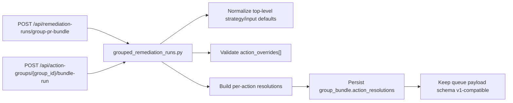

# Wave 3 Grouped-Run Orchestration

> Scope date: 2026-03-14
>
> Status: Implemented Wave 3 slice only
>
> This document records the exact Wave 3 remediation-profile-resolution behavior integrated on top of the Wave 2 baseline.

## Scope Boundary

Wave 3 adds only the grouped orchestration layer for:

- `POST /api/remediation-runs/group-pr-bundle`
- `POST /api/action-groups/{group_id}/bundle-run`

Wave 3 adds:

- one shared grouped-run service in [backend/services/grouped_remediation_runs.py](/Users/marcomaher/AWS%20Security%20Autopilot/backend/services/grouped_remediation_runs.py)
- grouped request normalization across both grouped routes
- additive grouped `action_overrides[]`
- per-action grouped resolution persistence under `artifacts.group_bundle.action_resolutions`
- `repo_target` parity for the action-groups route
- preservation of the single-`RemediationRun` grouped persistence model
- preservation of `ActionGroupRun` lifecycle and reporting-token issuance on the action-groups route

Wave 3 does **not** change:

- queue payload schema version
- resend behavior
- worker consumption of per-action grouped decisions
- grouped reporting callback schema
- mixed-tier grouped bundle layout
- root-key routes

## Shared Grouped-Run Service

Wave 3 introduces a shared grouped-run service at [backend/services/grouped_remediation_runs.py](/Users/marcomaher/AWS%20Security%20Autopilot/backend/services/grouped_remediation_runs.py).

The service now owns:

- grouped request normalization for both route shapes
- grouped action-set validation
- grouped override validation
- per-action resolution building
- grouped artifact assembly
- queue-v1-compatible field extraction for the existing worker path

The service returns one normalized grouped persistence plan that both routes use instead of maintaining separate grouped safety logic.

## Grouped Request Normalization

Both grouped routes now normalize the same additive request concepts:

- top-level `strategy_id`
- top-level `strategy_inputs`
- optional `action_overrides[]`
- optional `repo_target`
- optional `pr_bundle_variant`
- `risk_acknowledged`

Compatibility behavior preserved in Wave 3:

- legacy top-level grouped requests still work
- top-level strategy/default inputs still apply to actions without overrides
- queue payloads remain schema-version `1`
- per-action decisions are persisted in artifacts only, not sent to workers yet

## Grouped `action_overrides[]`

Wave 3 adds additive grouped `action_overrides[]` support on both grouped routes.

Each override may include:

- `action_id`
- `strategy_id`
- `profile_id`
- `strategy_inputs`

Validation rules now enforced:

- duplicate override entries for the same action are rejected
- override `action_id` must belong to the grouped action set
- override strategy must be valid for the grouped action type
- override `profile_id` must belong to the selected override strategy family
- if no top-level grouped strategy exists, every grouped action must be covered by an explicit override

## Grouped Per-Action Resolution Persistence

Wave 3 keeps one grouped `RemediationRun` row but replaces representative-action-only resolution with per-action artifact persistence.

Canonical grouped persistence added in this wave:

- `artifacts.group_bundle.action_resolutions`

Each entry includes:

- `action_id`
- `strategy_id`
- `profile_id`
- `strategy_inputs`
- nested `resolution`

Legacy compatibility remains in place:

- `selected_strategy`
- `strategy_inputs`
- `pr_bundle_variant`
- `repo_target`

These remain available because queue submission and worker execution still read the existing top-level fields.

## Route Parity

### `/api/remediation-runs/group-pr-bundle`

Wave 3 now routes grouped create through the shared grouped-run service in [backend/routers/remediation_runs.py](/Users/marcomaher/AWS%20Security%20Autopilot/backend/routers/remediation_runs.py).

Preserved behavior:

- one grouped `RemediationRun`
- duplicate pending-group guard
- current queue payload shape
- current root/manual-high-risk marker behavior

Added behavior:

- additive `action_overrides[]`
- canonical `group_bundle.action_resolutions`

### `/api/action-groups/{group_id}/bundle-run`

Wave 3 removes the earlier raw enqueue bypass in [backend/routers/action_groups.py](/Users/marcomaher/AWS%20Security%20Autopilot/backend/routers/action_groups.py) and now routes grouped creation through the same shared grouped-run service.

Preserved behavior:

- `ActionGroupRun` creation
- reporting token issuance
- reporting callback URL generation
- `ActionGroupRun` to `RemediationRun` linkage
- queue-enqueue failure still marks both rows failed

Added behavior:

- `repo_target` parity
- additive `action_overrides[]`
- canonical `group_bundle.action_resolutions`

## Queue Compatibility Boundary

Wave 3 explicitly keeps the existing worker contract unchanged.

Current queue payload compatibility preserved:

- `schema_version = 1`
- top-level `strategy_id`
- top-level `strategy_inputs`
- `group_action_ids`
- `repo_target`

Wave 3 does **not** add to the queue payload:

- `action_overrides`
- grouped per-action `action_resolutions`
- queue schema version `2`

Those changes remain deferred to the later queue/worker migration wave.

## Validation Intent

Wave 3 added focused grouped coverage in:

- [tests/test_grouped_remediation_run_service.py](/Users/marcomaher/AWS%20Security%20Autopilot/tests/test_grouped_remediation_run_service.py)
- [tests/test_remediation_runs_api.py](/Users/marcomaher/AWS%20Security%20Autopilot/tests/test_remediation_runs_api.py)
- [tests/test_action_groups_bundle_run.py](/Users/marcomaher/AWS%20Security%20Autopilot/tests/test_action_groups_bundle_run.py)
- [tests/test_internal_group_run_report.py](/Users/marcomaher/AWS%20Security%20Autopilot/tests/test_internal_group_run_report.py)

The implemented Wave 3 coverage proves:

- both grouped routes use the shared grouped service
- grouped overrides are validated consistently
- grouped artifacts now persist per-action resolutions
- action-groups lifecycle/reporting behavior stays intact
- queue payloads remain worker-compatible

## Deferred Follow-Up

> ⚠️ Status: Planned — not yet implemented
>
> Wave 4 still needs queue payload schema v2, resend reconstruction updates, duplicate-signature expansion, and worker consumption of per-action grouped resolution data.

Related docs:

- [Remediation profile resolution spec](/Users/marcomaher/AWS%20Security%20Autopilot/docs/remediation-profile-resolution/README.md)
- [Implementation plan](/Users/marcomaher/AWS%20Security%20Autopilot/docs/remediation-profile-resolution/implementation-plan.md)
- [Wave 2 read and single-run surfaces](/Users/marcomaher/AWS%20Security%20Autopilot/docs/remediation-profile-resolution/wave-2-read-and-single-run-surfaces.md)
