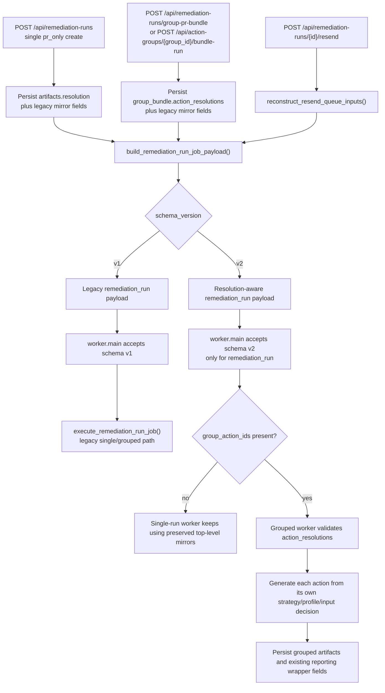

# Wave 4 Queue Contract and Worker Migration

> Scope date: 2026-03-14
>
> Status: Implemented Wave 4 slice only
>
> This document records the exact Wave 4 queue-contract and worker-migration behavior landed on `master`.

Related docs:

- [Remediation profile resolution spec](/Users/marcomaher/AWS%20Security%20Autopilot/docs/remediation-profile-resolution/README.md)
- [Implementation plan](/Users/marcomaher/AWS%20Security%20Autopilot/docs/remediation-profile-resolution/implementation-plan.md)
- [Wave 3 grouped-run orchestration](/Users/marcomaher/AWS%20Security%20Autopilot/docs/remediation-profile-resolution/wave-3-grouped-run-orchestration.md)
- [Wave 0 worker and root-key baseline](/Users/marcomaher/AWS%20Security%20Autopilot/docs/remediation-profile-resolution/wave-0-worker-rootkey-baseline.md)

## Summary

Wave 4 completes the landed queue-contract migration for generic `pr_only` remediation runs:

- `remediation_run` schema `v2` is now supported by the queue payload builder, the create/resend producers, the worker dispatcher, and the grouped worker path.
- schema `v1` remains runnable for older payloads and for resend reconstruction when only legacy artifacts exist.
- unknown or invalid schema versions still fail closed in the worker and are quarantined through the contract-violation path.
- duplicate detection now treats canonical single-run `profile_id`, grouped override maps, and `repo_target` as part of the request identity.
- resend reconstructs resolution-aware payloads when canonical `artifacts.resolution` or `artifacts.group_bundle.action_resolutions` exist.
- grouped worker generation now consumes per-action decisions instead of assuming one shared grouped strategy whenever canonical grouped decisions are available.
- `direct_fix` remains unchanged and out of scope for this migration.

## Scope Boundary

Wave 4 changes only the queue-contract and worker-consumption layer in:

- [backend/utils/sqs.py](/Users/marcomaher/AWS%20Security%20Autopilot/backend/utils/sqs.py)
- [backend/services/remediation_run_queue_contract.py](/Users/marcomaher/AWS%20Security%20Autopilot/backend/services/remediation_run_queue_contract.py)
- [backend/routers/remediation_runs.py](/Users/marcomaher/AWS%20Security%20Autopilot/backend/routers/remediation_runs.py)
- [backend/routers/action_groups.py](/Users/marcomaher/AWS%20Security%20Autopilot/backend/routers/action_groups.py)
- [backend/workers/main.py](/Users/marcomaher/AWS%20Security%20Autopilot/backend/workers/main.py)
- [backend/workers/jobs/remediation_run.py](/Users/marcomaher/AWS%20Security%20Autopilot/backend/workers/jobs/remediation_run.py)

Wave 4 does not change:

- `direct_fix` approval or execution behavior
- the dedicated root-key execution authority
- Step 7 mixed-tier grouped bundle layout
- grouped reporting callback schema

## Queue Schema v2 Support

Wave 4 adds explicit schema-version support in [backend/utils/sqs.py](/Users/marcomaher/AWS%20Security%20Autopilot/backend/utils/sqs.py):

- `build_remediation_run_job_payload(...)` still defaults to schema `v1`.
- schema `v2` is now allowed only for `job_type=remediation_run`.
- schema `v2` may carry:
  - single-run `resolution`
  - grouped `action_resolutions`
- schema `v1` rejects those resolution fields instead of silently accepting a mixed contract.

Producer behavior now landed:

- single-run `POST /api/remediation-runs` emits schema `v2` only when create-time canonical resolution exists and `artifacts.resolution` is persisted first in [backend/routers/remediation_runs.py](/Users/marcomaher/AWS%20Security%20Autopilot/backend/routers/remediation_runs.py)
- both grouped create routes emit schema `v2` with `group_action_ids`, `repo_target`, and `action_resolutions`
- `direct_fix` stays on the unchanged path and does not participate in the schema-`v2` resolution contract

Important boundary: single-run schema `v2` support is additive queue compatibility, not a new single-run worker decision engine. The worker still reads the preserved top-level mirror fields (`selected_strategy`, `strategy_inputs`, `pr_bundle_variant`) for single-action PR bundle generation, while `resolution` serves as canonical persisted evidence and resend input.

## Duplicate Detection and Resend

Wave 4 moves duplicate detection and resend reconstruction into [backend/services/remediation_run_queue_contract.py](/Users/marcomaher/AWS%20Security%20Autopilot/backend/services/remediation_run_queue_contract.py).

### Single-run duplicate identity

`normalize_single_run_request_signature(...)` and `normalize_single_run_artifact_signature(...)` now compare:

- `mode`
- `strategy_id`
- canonical `profile_id` for `pr_only`
- `strategy_inputs`
- `pr_bundle_variant`
- `repo_target`

Artifact normalization prefers `artifacts.resolution` when present, so different canonical profiles are no longer collapsed into one duplicate signature.

### Grouped duplicate identity

`normalize_grouped_run_request_signature(...)` and `grouped_run_signatures_match(...)` now treat the effective grouped decision map as the duplicate key when canonical grouped decisions exist.

That means:

- different grouped override maps are not treated as duplicates
- identical effective grouped decisions are still treated as duplicates
- `repo_target` remains part of the grouped identity

When canonical grouped decisions do not exist yet, the helper still falls back to the older legacy comparison so already-persisted Wave 3 style runs remain compatible.

### Resend reconstruction

`POST /api/remediation-runs/{id}/resend` now rebuilds the queue payload from persisted artifacts instead of replaying only legacy top-level fields.

Landed resend behavior:

- canonical single-run `artifacts.resolution` -> schema `v2` resend with `resolution`
- canonical grouped `artifacts.group_bundle.action_resolutions` -> schema `v2` resend with `action_resolutions`
- legacy grouped artifacts without canonical decisions -> schema `v1` resend without resolution fields
- `repo_target`, `strategy_id`, `strategy_inputs`, `pr_bundle_variant`, and `risk_acknowledged` are preserved in all applicable resend paths

Canonical grouped resend also normalizes `action_resolutions` through the queue-contract helper before enqueueing, so the replayed list follows the helper's canonical ordering rather than the original artifact insertion order.

## Worker Migration

Wave 4 splits worker migration into dispatcher compatibility and grouped-generation behavior.

### Dispatcher compatibility

In [backend/workers/main.py](/Users/marcomaher/AWS%20Security%20Autopilot/backend/workers/main.py):

- `schema_version` now parses as an integer, defaulting missing values to legacy schema `v1`
- `job_type=remediation_run` supports schema versions `{1, 2}`
- every other job type remains locked to schema `v1`
- invalid or unsupported schema versions are quarantined with `reason_code=unsupported_schema_version`

This preserves the Wave 0 fail-closed rule: unknown future schema versions are rejected before any handler runs.

### Grouped worker decision source

In [backend/workers/jobs/remediation_run.py](/Users/marcomaher/AWS%20Security%20Autopilot/backend/workers/jobs/remediation_run.py), grouped bundle generation now resolves decisions in this order:

1. `job.action_resolutions` from a schema `v2` queue payload
2. persisted `run.artifacts.group_bundle.action_resolutions`
3. legacy grouped fallback built from the shared top-level strategy fields

This preserves schema `v1` grouped execution while allowing schema `v2` grouped runs to use per-action decisions.

### Grouped validation and fail-closed behavior

Canonical grouped decisions now fail closed unless every entry:

- includes a valid `action_id`
- points to an action inside `group_action_ids`
- is unique within the grouped payload
- contains a valid nested `resolution`
- keeps outer `strategy_id` and `profile_id` consistent with that nested `resolution`
- resolves to `support_tier == deterministic_bundle`

Malformed grouped decisions fail the run with `invalid_grouped_action_resolutions`. Non-deterministic grouped decisions fail the run with `grouped_support_tier_not_executable`.

### Per-action grouped generation

Grouped worker generation no longer assumes one grouped strategy for all actions when canonical grouped decisions exist.

`_generate_group_pr_bundle(...)` now receives `action_decisions` and generates each grouped action using that action's:

- `strategy_id`
- `profile_id`
- `strategy_inputs`

`repo_target` remains a post-generation PR-automation enrichment input and continues to feed grouped artifact metadata.

## Compatibility Boundaries Still Deferred

> ⚠️ Status: Planned — not yet implemented
>
> Wave 4 finishes queue-contract and grouped worker migration only. The following boundaries are still open for later waves.

- Step 7 mixed-tier layout is not implemented. Grouped bundles still use `actions/...` folders and `run_all.sh` still scans `actions/`; the Step 7 `executable/actions`, `review_required/actions`, and `manual_guidance/actions` layout has not landed.
- Step 7 mixed-tier execution is not implemented. Grouped schema-`v2` worker input currently requires every action decision to stay `deterministic_bundle`; `review_required_bundle` or `manual_guidance_only` grouped decisions fail closed instead of generating split-tier output.
- Reporting callback schema changes are not implemented. The grouped worker still reads the existing `group_bundle.reporting.callback_url` and `token` fields and emits the existing `started` / `finished` callback shape.
- Root-key profile execution is still unchanged. IAM.4 execution authority remains on `/api/root-key-remediation-runs`; the generic remediation-run queue path still only adds the existing manual-high-risk marker and does not become a second root-key execution authority.
- `direct_fix` remains unchanged and out of scope. Wave 4 does not introduce profile-aware direct-fix queue payloads or worker behavior.

## Landed Coverage

Focused contract and worker coverage exists in:

- [tests/test_sqs_utils.py](/Users/marcomaher/AWS%20Security%20Autopilot/tests/test_sqs_utils.py)
- [tests/test_worker_main_contract_quarantine.py](/Users/marcomaher/AWS%20Security%20Autopilot/tests/test_worker_main_contract_quarantine.py)
- [tests/test_remediation_runs_api.py](/Users/marcomaher/AWS%20Security%20Autopilot/tests/test_remediation_runs_api.py)
- [tests/test_remediation_run_worker.py](/Users/marcomaher/AWS%20Security%20Autopilot/tests/test_remediation_run_worker.py)

Those tests cover the landed Wave 4 contract points:

- schema `v1` default behavior and schema `v2` emission rules
- unsupported-schema quarantine behavior in the worker
- single-run duplicate detection with canonical `profile_id`
- grouped duplicate detection with canonical per-action decisions and `repo_target`
- resend reconstruction for legacy grouped, canonical single, and canonical grouped runs
- grouped worker consumption of queue-v2 and artifact-stored `action_resolutions`
- grouped fail-closed validation for malformed or non-deterministic per-action decisions
