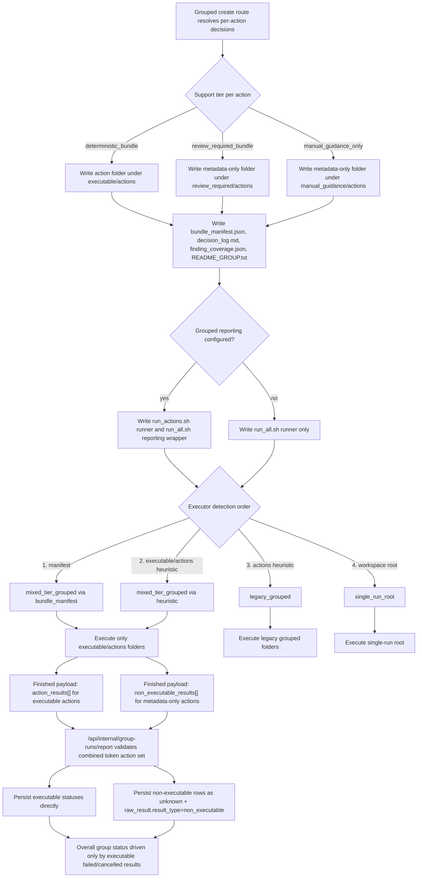

# Wave 5 Mixed-Tier Grouped Bundles

> Scope date: 2026-03-15
>
> Status: Implemented Wave 5 slice only
>
> This document records the exact mixed-tier grouped-bundle behavior landed on `master`.
>
> Current contract note (2026-03-19): Wave 5 defines the grouped PR-bundle execution model still used today. Active `direct_fix` entry points were later disabled globally and are not part of the live grouped-bundle contract.

Related docs:

- [Remediation profile resolution spec](/Users/marcomaher/AWS%20Security%20Autopilot/docs/remediation-profile-resolution/README.md)
- [Implementation plan](/Users/marcomaher/AWS%20Security%20Autopilot/docs/remediation-profile-resolution/implementation-plan.md)
- [Wave 4 queue contract and worker migration](/Users/marcomaher/AWS%20Security%20Autopilot/docs/remediation-profile-resolution/wave-4-queue-contract-and-worker-migration.md)
- [Wave 5 narrowed live S3.9 rerun summary](/Users/marcomaher/AWS%20Security%20Autopilot/docs/test-results/live-runs/20260315T015105Z-rem-profile-wave5-s3-mixed-tier-live-rerun/notes/final-summary.md)

## Summary

Wave 5 completes the mixed-tier grouped-bundle slice that Wave 4 explicitly deferred:

- Customer-run PR bundles remain the supported execution model. Public SaaS-managed PR-bundle plan/apply routes are archived.
- Resolver-backed grouped PR bundles no longer require every action to stay `deterministic_bundle`.
- Grouped bundle generation now maps each resolved action into one of three tier roots:
  - `deterministic_bundle` -> `executable/actions`
  - `review_required_bundle` -> `review_required/actions`
  - `manual_guidance_only` -> `manual_guidance/actions`
- Mixed-tier bundles now carry a first-class `bundle_manifest.json` with layout metadata, per-action records, tier counts, and runnable-action counts.
- `run_all.sh` now treats `executable/actions` as the only execution root. Review/manual folders are metadata only.
- The generated customer-run bundle flow, grouped callback flow, and legacy internal executor code path support additive `non_executable_results[]` so review/manual actions are reported without being treated as execution failures.
- Callback-managed `download_bundle` group runs now stay non-terminal after successful bundle generation so the later valid customer `finished` callback can persist results exactly once.
- Legacy grouped bundles remain runnable through the existing `actions/` layout and heuristic detection path.

> ⚠️ Historical note (2026-03-15): the archived post-archive live AWS run package still records the pre-fix `RPW5-POST-ARCHIVE-03` failure state. The follow-up narrowed rerun on current `master` now proves the closure path: callback-managed `download_bundle` runs stay `started` with `finished_at=null` until the first valid mixed `finished` callback arrives, that first callback persists both executable plus non-executable results, and replay rejection still applies only after true finalization. Historical failure evidence: [post-archive live AWS summary](/Users/marcomaher/AWS%20Security%20Autopilot/docs/test-results/live-runs/20260315T125927Z-rem-profile-wave5-post-archive-live-aws-e2e/notes/final-summary.md). Closure evidence: [post-archive rerun summary](/Users/marcomaher/AWS%20Security%20Autopilot/docs/test-results/live-runs/20260315T133714Z-rem-profile-wave5-post-archive-rerun/notes/final-summary.md).

## Scope Boundary

Wave 5 changes the landed mixed-tier grouped-bundle behavior in:

- [backend/workers/jobs/remediation_run.py](/Users/marcomaher/AWS%20Security%20Autopilot/backend/workers/jobs/remediation_run.py)
- [backend/workers/jobs/remediation_run_execution.py](/Users/marcomaher/AWS%20Security%20Autopilot/backend/workers/jobs/remediation_run_execution.py)
- [backend/routers/internal.py](/Users/marcomaher/AWS%20Security%20Autopilot/backend/routers/internal.py)
- [backend/routers/remediation_runs.py](/Users/marcomaher/AWS%20Security%20Autopilot/backend/routers/remediation_runs.py)

Wave 5 does not change:

- the historical `direct_fix` behavior that existed when Wave 5 landed; current `master` later disabled that path entirely
- customer-run `run_all.sh` / `run_actions.sh` bundle execution
- grouped callback/reporting support at `/api/internal/group-runs/report`
- the queue-`v2` contract introduced in Wave 4
- the dedicated root-key execution authority
- the separate control-family migration work needed to move more remediation families onto the resolver

## Mixed-Tier Bundle Layout

Resolver-backed grouped generation now emits the mixed-tier layout version `grouped_bundle_mixed_tier/v1` unless the grouped run is explicitly using the legacy decision source. The generated bundle root contains:

```text
bundle root/
  run_all.sh
  run_actions.sh                      # present only when grouped callback reporting is configured
  bundle_manifest.json
  decision_log.md
  finding_coverage.json
  README_GROUP.txt
  executable/actions/<action-folder>/
    *.tf                              # executable actions only
    README_ACTION.txt
    decision.json
    generation_error.json             # only when generation produced a recoverable error record
  review_required/actions/<action-folder>/
    README_ACTION.txt
    decision.json
    generation_error.json             # optional
  manual_guidance/actions/<action-folder>/
    README_ACTION.txt
    decision.json
    generation_error.json             # optional
```

Tier semantics are fixed in the worker:

| Support tier | Tier label | Tier root | Runnable |
| --- | --- | --- | --- |
| `deterministic_bundle` | `executable` | `executable/actions` | Yes |
| `review_required_bundle` | `review_required` | `review_required/actions` | No |
| `manual_guidance_only` | `manual_guidance` | `manual_guidance/actions` | No |

Important landed behavior:

- Only `deterministic_bundle` actions may contribute Terraform files.
- Every represented action still gets its own folder plus `README_ACTION.txt` and `decision.json`.
- Metadata-only folders are still part of the grouped artifact contract and are included in the manifest, decision log, and finding coverage output.
- If the grouped decision source is still marked legacy, the worker keeps using the older grouped generator instead of this mixed-tier layout.

## Manifest Semantics

`bundle_manifest.json` is now the authoritative mixed-tier layout description when present. The worker and execution APIs treat it as the first detection source before falling back to heuristics.

Top-level manifest keys:

- `layout_version`
  - Currently `grouped_bundle_mixed_tier/v1`.
- `execution_root`
  - Currently `executable/actions`.
- `action_count`
  - Count of represented grouped actions.
- `grouped_actions`
  - Ordered list of grouped `action_id` values.
- `actions`
  - Full per-action records for every represented action.
- `tier_counts`
  - Counts by generated tier label: `executable`, `review_required`, `manual_guidance`.
- `runnable_action_count`
  - Count of actions where `has_runnable_terraform` is true.
- `runner_template_source`
  - Source label for the embedded or centralized runner template used to build the executable script.
- `runner_template_version`
  - Template version identifier written by the worker for the runner template it used.

Each `actions[]` record carries the operational metadata needed to understand or reconstruct the grouped decision:

- Identity and placement:
  - `action_id`
  - `title`
  - `action_type`
  - `control_id`
  - `target_id`
  - `folder`
  - `tier`
  - `tier_root`
  - `index`
- Resolution outcome:
  - `strategy_id`
  - `profile_id`
  - `support_tier`
  - `outcome`
  - `has_runnable_terraform`
- Decision evidence:
  - `decision_version`
  - `decision_summary`
  - `decision_rationale`
  - `strategy_inputs`
  - `missing_inputs`
  - `missing_defaults`
  - `blocked_reasons`
  - `rejected_profiles`
  - `finding_coverage`
  - `preservation_summary`
- Generation diagnostics:
  - `generation_error` when the action produced metadata-only output because generation hit a recoverable error

Operational semantics:

- `has_runnable_terraform=true` is the decisive signal that an action belongs in executable plan/apply execution.
- `outcome` is reused as the default non-executable reporting reason when the action is metadata only.
- `tier_root` and `folder` together define the stable on-disk location used by the manifest-driven executor.

## `run_all.sh` and Executable-Root Behavior

Wave 5 changes grouped execution from “scan everything under `actions/`” to “execute only the manifest execution root.”

Landed behavior:

- The mixed-tier runner script hardcodes `EXECUTION_ROOT="executable/actions"`.
- `run_all.sh` scans only immediate subdirectories under that root and only executes folders containing `.tf` files.
- `review_required/actions` and `manual_guidance/actions` are never executed by `run_all.sh`.
- If no executable Terraform folders are found under `executable/actions`, the runner exits `0` after printing a no-executable message.
- The bundle `README_GROUP.txt` explicitly tells operators that only `executable/actions` is runnable and the other tier roots are metadata only.

When grouped callback reporting is configured:

- `run_actions.sh` is the actual Terraform runner.
- `run_all.sh` becomes a reporting wrapper that posts the grouped `started` and `finished` callbacks and then invokes `run_actions.sh`.

When grouped callback reporting is not configured:

- `run_all.sh` is the Terraform runner directly.
- `run_actions.sh` is not generated.

## Execution-Root Detection Order

The generated customer-run bundle flow and the legacy internal executor code path share the same grouped execution-root detection order:

1. `bundle_manifest.json`
   - If the manifest contains a non-empty `layout_version` and `execution_root`, execution is treated as `target_kind="mixed_tier_grouped"` with `detected_by="bundle_manifest"`.
2. `executable/actions` heuristic
   - If no usable manifest exists but the `executable/actions` directory is present, execution is still treated as `mixed_tier_grouped` with `detected_by="executable_actions_heuristic"`.
3. Legacy `actions` heuristic
   - If no mixed-tier indicators exist but `actions/` exists, execution falls back to `target_kind="legacy_grouped"` with `detected_by="actions_heuristic"`.
4. Workspace root fallback
   - If neither grouped layout is present, execution uses the bundle root as `target_kind="single_run_root"` with `detected_by="workspace_root"`.

Mixed-tier execution metadata is propagated into execution results and workspace manifests through:

- `target_kind`
- `detected_by`
- `layout_version`
- `execution_root`
- `executed_folders`
- `non_executable_action_count`

Before the public SaaS plan/apply routes were archived, the remediation-run execution path used the same mixed-tier detection summary and failed closed on zero-executable bundles. Customer-run bundles remain supported today through `run_all.sh` / `run_actions.sh` plus optional grouped callback reporting.

## Reporting Contract

Wave 5 keeps the existing grouped callback contract and adds one new finished-event field:

- `action_results[]`
  - Executable actions only.
- `non_executable_results[]`
  - Review/manual metadata-only actions only.

Each `non_executable_results[]` item includes:

- `action_id`
- `support_tier`
- `profile_id`
- `strategy_id`
- `reason`
- `blocked_reasons`

`run_all.sh` reporting behavior now matches the bundle layout:

- executable actions stay in `action_results[]`
- metadata-only review/manual actions are emitted through `non_executable_results[]`
- the wrapper emits its callback templates as shell-quoted JSON literals, so tokens, blocked reasons, and mixed-result payloads survive bash parsing before `curl` submits them
- wrapper failures still report metadata-only actions as non-executable instead of converting them into failed execution results
- when grouped callback reporting is configured, successful bundle generation sets `started_at` but leaves the `ActionGroupRun` non-terminal until the later valid `finished` callback arrives
- when grouped callback reporting is not configured, the legacy immediate-finish worker lifecycle remains unchanged

The internal callback route now validates the combined finished payload strictly:

- action IDs across `action_results[]` and `non_executable_results[]` must be unique
- every action ID must be allowed by the reporting token
- every token-authorized action must be accounted for across the two arrays
- once a finished callback finalizes the run, later terminal callback replays are rejected with `409 reason=group_run_report_replay`
- broken tokens, mismatched action IDs, and malformed finished payloads still fail closed

Persistence semantics remain schema-compatible:

- executable rows continue using the existing `ActionGroupExecutionStatus` enum
- non-executable results are stored as `execution_status=unknown`
- non-executable detail is preserved in `ActionGroupRunResult.raw_result` with `result_type="non_executable"`
- public action-groups read APIs now surface the persisted per-action outcomes directly:
  - `GET /api/action-groups/{group_id}/runs` returns `results[]` for each run list item
  - `GET /api/action-groups/{group_id}/runs/{run_id}` returns the same persisted `results[]` shape for one specific run
- the frontend action-group detail view at `/actions/group?group_id=...` now renders those persisted `results[]` rows under `Run Timeline`, including metadata-only `support_tier`, `reason`, `blocked_reasons`, and per-action timestamps

For rollout compatibility, legacy internal executor result payloads still include the older `non_executable_actions` alias, but new consumers should prefer `non_executable_results`.

## Mixed-Tier Success and Failure Semantics

Wave 5 changes grouped success/failure classification so metadata-only actions are not treated as failed execution.

Landed rules:

- A grouped callback `finished` event becomes `failed` only when an executable `action_results[]` item reports `failed`.
- A grouped callback `finished` event becomes `cancelled` only when an executable `action_results[]` item reports `cancelled`.
- Otherwise the grouped callback finishes as `finished`, even when review/manual actions are present.
- Legacy internal executor result sync now follows the same rule set and no longer falls back to `missing_folder_result` for review/manual actions that intentionally have no runnable folder.
- Non-executable grouped actions remain auditable through `raw_result`, but they do not make the overall `ActionGroupRun` fail by default.

There is one intentional fail-closed boundary:

- If legacy internal SaaS execution code is reached with zero executable folders, the worker still raises `mixed-tier bundle has no executable folders` fail-closed instead of treating metadata-only folders as runnable work.

## Legacy Compatibility

Legacy grouped bundle behavior remains intact after Wave 5:

- The worker still uses the legacy grouped generator when the grouped decision source is legacy.
- Existing grouped bundles rooted at `actions/` are still detected and executed through the `legacy_grouped` path.
- Executable-only grouped callbacks remain valid because `non_executable_results[]` is additive, not a replacement for `action_results[]`.
- Single-run bundles still fall back to workspace-root execution.

Wave 5 therefore extends the grouped contract without requiring a queue migration or a schema migration.



## Narrowed Live Proof

March 15, 2026 now has a narrowed live-AWS proof for the exact mixed-tier executable grouped case that blocked the first Wave 5 run:

- Grouped family: `s3_bucket_access_logging` / `S3.9`
- Run package: [20260315T015105Z-rem-profile-wave5-s3-mixed-tier-live-rerun](/Users/marcomaher/AWS%20Security%20Autopilot/docs/test-results/live-runs/20260315T015105Z-rem-profile-wave5-s3-mixed-tier-live-rerun/notes/final-summary.md)
- Group ID: `75cd4f50-97c9-4aa0-911b-eb3b17ffd804`
- Account / region: `696505809372` / `eu-north-1`
- Bucket-scoped action: `bb487cfd-2d28-41a6-8ec3-5f685e4eaa26` targeting `arn:aws:s3:::config-bucket-696505809372`
- Account-scoped action: `47c023ae-945c-42bf-9b44-018d276046fa` targeting `AWS::::Account:696505809372`

Observed grouped bundle contract:

- `bundle_manifest.json`, `decision_log.md`, `finding_coverage.json`, `README_GROUP.txt`, and `run_all.sh` were generated in one successful grouped run.
- `bundle_manifest.json` reported `layout_version = grouped_bundle_mixed_tier/v1` and `execution_root = executable/actions`.
- The bucket-scoped action resolved `support_tier = deterministic_bundle` and generated runnable Terraform under `executable/actions/01-arn-aws-s3-config-bucket-696505809372-bb487cfd/`.
- The account-scoped action resolved `support_tier = review_required_bundle` and generated metadata-only output under `review_required/actions/02-aws-account-696505809372-47c023ae/`.

Environment note:

- The narrowed rerun did not widen into target-account IAM repair after `arn:aws:iam::696505809372:role/SecurityAutopilotReadRole` stopped accepting the SaaS account.
- Instead, the isolated runtime restored the exact March 15, 2026 live-ingested S3.9 group records from the earlier Wave 5 evidence package and then exercised the current `master` API/worker grouped-bundle path end to end.

## Post-Archive Gate Closure

March 15, 2026 now also has the narrowed archived-SaaS gate closure rerun for the same S3.9 grouped family:

- Run package: [20260315T133714Z-rem-profile-wave5-post-archive-rerun](/Users/marcomaher/AWS%20Security%20Autopilot/docs/test-results/live-runs/20260315T133714Z-rem-profile-wave5-post-archive-rerun/notes/final-summary.md)
- Backend URL used: `http://127.0.0.1:18010`
- Queue/runtime account: `029037611564`
- Target account / region: `696505809372` / `eu-north-1`
- Exact rerun commit: `7eee3cbb57ee99fa9866d811aa5f1bdf5f428a73`

Observed post-archive callback lifecycle proof:

- Before callback finalization, the grouped `download_bundle` `ActionGroupRun` stayed `started` with `finished_at = null`.
- The first valid `started` callback returned `200`.
- The first valid mixed `finished` callback returned `200` and persisted:
  - executable `action_results[]` for `bb487cfd-2d28-41a6-8ec3-5f685e4eaa26`
  - review-required `non_executable_results[]` for `47c023ae-945c-42bf-9b44-018d276046fa`
- After that first successful finalization, replaying the same valid `finished` payload returned `409 reason=group_run_report_replay`.
- Archived public SaaS PR-bundle execution routes still returned `410`.

Gate result:

- `RPW5-POST-ARCHIVE-01` = `PASS`
- `RPW5-POST-ARCHIVE-02` = `PASS`
- `RPW5-POST-ARCHIVE-03` = `PASS`
- `RPW5-POST-ARCHIVE-04` = `PASS`
- `RPW5-POST-ARCHIVE-05` = `PASS`
- Wave 5 is therefore complete under the archived-SaaS product model.

## Still Deferred After Wave 5

> ⚠️ Status: Planned — not yet implemented
>
> Wave 5 finishes the mixed-tier grouped-bundle runtime slice only. The following items remain separate follow-up work.

- Control-family migration remains separate. Wave 5 does not claim that every remediation family now has resolver-backed mixed-tier grouped coverage.
- Root-key execution authority remains separate. IAM.4 execution authority still stays on the dedicated root-key remediation routes and does not move into the generic remediation-run executor.

> ❓ Needs verification: A fresh end-to-end live ingest against account `696505809372` still requires the target `SecurityAutopilotReadRole` trust to allow the SaaS account again. The mixed-tier grouped-bundle product contract itself is now proven by the narrowed S3.9 live rerun above.

## Landed Coverage

The landed mixed-tier grouped-bundle contract is covered in:

- [tests/test_internal_group_run_report.py](/Users/marcomaher/AWS%20Security%20Autopilot/tests/test_internal_group_run_report.py)
- [tests/test_remediation_risk.py](/Users/marcomaher/AWS%20Security%20Autopilot/tests/test_remediation_risk.py)
- [tests/test_grouped_remediation_run_service.py](/Users/marcomaher/AWS%20Security%20Autopilot/tests/test_grouped_remediation_run_service.py)
- [tests/test_remediation_run_worker.py](/Users/marcomaher/AWS%20Security%20Autopilot/tests/test_remediation_run_worker.py)
- [tests/test_action_groups_bundle_run.py](/Users/marcomaher/AWS%20Security%20Autopilot/tests/test_action_groups_bundle_run.py)

Those tests now cover the Wave 5 contract points:

- family-specific S3.9 risk specialization that keeps bucket-scoped access-logging actions executable and downgrades account-scoped variants to review-required
- grouped resolution splitting for mixed bucket-scope plus account-scope S3.9 action sets
- mixed-tier grouped bundle generation with per-tier folders and manifest metadata
- reporting-wrapper emission of `action_results[]` plus additive `non_executable_results[]`
- strict callback rejection for invalid non-executable action IDs
- non-failing mixed-tier group status when executable folders succeed and review/manual actions are metadata only
- legacy internal executor result sync that does not misclassify non-executable actions as execution failures
- ActionGroupRun linkage and reporting-token preservation on the action-groups route
