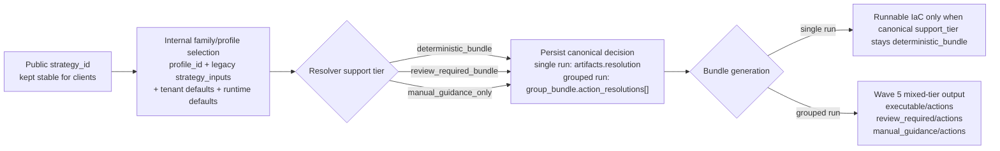

# Wave 6 Control-Family Migration

> Scope date: 2026-03-18
>
> Status: Implemented on `master`
>
> This document records the landed Wave 6 control-family migration behavior only. It does not widen product claims beyond what current `master` code and task history prove.
>
> Current contract note (2026-03-19): current `master` keeps the Wave 6 resolver-backed customer-run PR-bundle model, but active `direct_fix` entry points and customer `WriteRole` are now out of scope.

Related docs:

- [Remediation profile resolution spec](/Users/marcomaher/AWS%20Security%20Autopilot/docs/remediation-profile-resolution/README.md)
- [Implementation plan](/Users/marcomaher/AWS%20Security%20Autopilot/docs/remediation-profile-resolution/implementation-plan.md)
- [Wave 5 mixed-tier grouped bundles](/Users/marcomaher/AWS%20Security%20Autopilot/docs/remediation-profile-resolution/wave-5-mixed-tier-grouped-bundles.md)

## Summary

Wave 6 completes the planned control-family migration slice on `master` by moving the remaining targeted PR-bundle families onto resolver-backed branch selection while preserving public `strategy_id` compatibility.

The landed boundaries remain:

- `artifacts.resolution` is the safety authority for single-run executability.
- `artifacts.group_bundle.action_resolutions[]` is the grouped equivalent, and Wave 5 mixed-tier bundle layout still decides `executable/actions`, `review_required/actions`, and `manual_guidance/actions`.
- Customer-run PR bundles remain the supported execution model. Active `direct_fix` entry points are disabled and customer `WriteRole` is out of scope.
- IAM.4 generic surfaces are additive metadata only. `/api/root-key-remediation-runs` remains the only execution authority.
- Legacy CloudFront OAC compatibility remains intact for S3.2.
- Legacy artifact mirrors such as `selected_strategy`, `strategy_inputs`, and `pr_bundle_variant` are still written for compatibility and have not been retired.

## Landed Migration Order

Wave 6 landed on `master` in this order:

| Prompt | Commit | Families migrated |
| --- | --- | --- |
| Prompt 1 | `f41a935d` | EC2.53 shared family branching |
| Prompt 2 | `ba92ca2f` | IAM.4 metadata-only generic read surfaces with preserved root-key authority |
| Prompt 3 | `679087be` | S3.2, S3.5, S3.11 |
| Prompt 4 | `c001c7ce` | S3.9, S3.15 |
| Prompt 5 | `791e59d8` | CloudTrail.1, Config.1 |

## Resolution And Bundle Flow

## Family Details

### EC2.53 `sg_restrict_public_ports`

- Public compatibility strategy IDs preserved: `sg_restrict_public_ports_guided`.
- Internal profiles/branches added: `close_public`, `close_and_revoke`, `restrict_to_ip`, `restrict_to_cidr`, `ssm_only`, `bastion_sg_reference`.
- Executable vs review/manual behavior: `close_public` and `close_and_revoke` stay executable; `restrict_to_ip` and `restrict_to_cidr` stay executable only when `allowed_cidr` resolves safely, otherwise they downgrade to `review_required_bundle`; `ssm_only` is always `manual_guidance_only`; `bastion_sg_reference` is never executable in Wave 6 and stays `review_required_bundle` or `manual_guidance_only`.
- Supported-path parity rule: when preview resolves an EC2.53 branch as `deterministic_bundle` with sufficient inputs, the persisted single-run create and grouped customer-run bundle decision must preserve that same executable tier instead of silently reclassifying it to `review_required_bundle` for risk-only reasons.
- Tenant-default inputs used: `sg_access_path_preference`, `approved_admin_cidrs`, and `approved_bastion_security_group_ids`. Runtime defaults can also supply `detected_public_ipv4_cidr` for `restrict_to_ip`.
- Runtime/preservation gates: missing `allowed_cidr`, multiple approved CIDRs, missing bastion SG IDs, and the explicit “not implemented in Wave 6” guards for `ssm_only` and `bastion_sg_reference`.

### IAM.4 `iam_root_access_key_absent`

- Public compatibility strategy IDs preserved: `iam_root_key_disable`, `iam_root_key_delete`, `iam_root_key_keep_exception`.
- Internal profiles/branches added: no new executable profile IDs; existing compatibility rows are wrapped by the root-key family adapter for generic read surfaces only.
- Executable vs review/manual behavior: generic options and preview always surface `manual_guidance_only`; generic single-run create, grouped create, resend, and action-group bundle routes fail closed with `root_key_execution_authority`.
- Tenant-default inputs used: none.
- Runtime/preservation gates: additive metadata only on generic surfaces; `preservation_summary.execution_authority` explicitly points to `/api/root-key-remediation-runs`. The authoritative disable/delete runtime now also requires a separate observer context built from explicit observer AWS credentials plus the tenant read role and fails closed when that observer path cannot be built.

### S3.2 `s3_bucket_block_public_access`

- Public compatibility strategy IDs preserved: `s3_bucket_block_public_access_standard`, `s3_migrate_cloudfront_oac_private`.
- Internal profiles/branches added: `s3_bucket_block_public_access_manual_preservation` and `s3_migrate_cloudfront_oac_private_manual_preservation`.
- Executable vs review/manual behavior: both compatibility branches stay executable only when the relevant preservation evidence is proven; otherwise the resolver downgrades directly to `manual_guidance_only`.
- Tenant-default inputs used: none.
- Preservation/runtime gates: standard S3.2 requires runtime proof that website hosting is disabled, the bucket policy is not public, and access-path evidence is available; the CloudFront/OAC migration branch requires captured existing bucket-policy evidence so the OAC/private-S3 migration can preserve current policy safely.

### S3.5 `s3_bucket_require_ssl`

- Public compatibility strategy IDs preserved: `s3_enforce_ssl_strict_deny`, `s3_enforce_ssl_with_principal_exemptions`.
- Internal profiles/branches added: no new profile IDs; the same public strategies now resolve through the S3.5 preservation family.
- Executable vs review/manual behavior: executable output requires merge-safe policy preservation; blocked preserve-merge cases downgrade to `review_required_bundle`; explicit `preserve_existing_policy=false` downgrades to `manual_guidance_only`.
- Tenant-default inputs used: none.
- Preservation/runtime gates: `s3_policy_analysis_possible`, existing bucket-policy statement count, captured `existing_bucket_policy_json`, and parse/capture errors.

### S3.11 `s3_bucket_lifecycle_configuration`

- Public compatibility strategy IDs preserved: `s3_enable_abort_incomplete_uploads`.
- Internal profiles/branches added: no new profile IDs; the same compatibility profile now resolves through the S3.11 lifecycle-preservation family.
- Executable vs review/manual behavior: executable output is allowed only when no lifecycle rules exist or the captured lifecycle document already matches the abort-incomplete-uploads safe state; captured-but-ambiguous existing lifecycle rules downgrade to `review_required_bundle`; missing lifecycle evidence can fall to `manual_guidance_only`.
- Tenant-default inputs used: none.
- Preservation/runtime gates: `existing_lifecycle_rule_count`, captured `existing_lifecycle_configuration_json`, and the additive-merge equivalence test for the requested `abort_days`.

### S3.9 `s3_bucket_access_logging`

- Public compatibility strategy IDs preserved: `s3_enable_access_logging_guided`.
- Internal profiles/branches added: `s3_enable_access_logging_review_destination_safety`.
- Executable vs review/manual behavior: the compatibility branch stays executable only when bucket scope and destination safety are proven; otherwise the resolver downgrades to `review_required_bundle` on the review branch.
- Tenant-default inputs used: `s3_access_logs.default_target_bucket_name` -> `log_bucket_name`.
- Preservation/runtime gates: source bucket scope must resolve from the action target, destination bucket must resolve and differ from the source bucket, and runtime checks must prove the destination bucket is reachable and safe.

### S3.15 `s3_bucket_encryption_kms`

- Public compatibility strategy IDs preserved: `s3_enable_sse_kms_guided`.
- Internal profiles/branches added: `s3_enable_sse_kms_customer_managed`.
- Executable vs review/manual behavior: the AWS-managed branch remains executable when target bucket scope is proven; the customer-managed branch downgrades to `review_required_bundle` when KMS safety proof is incomplete and to `manual_guidance_only` when `kms_key_arn` is missing entirely.
- Tenant-default inputs used: `s3_encryption.mode` -> `kms_key_mode` and `s3_encryption.kms_key_arn` -> `kms_key_arn`.
- Preservation/runtime gates: target bucket scope proof, KMS ARN presence/shape, account-region validation, enabled-key validation, captured key-policy evidence, and captured grant evidence.

### CloudTrail.1 `cloudtrail_enabled`

- Public compatibility strategy IDs preserved: `cloudtrail_enable_guided`.
- Internal profiles/branches added: no new profile IDs; the compatibility profile now resolves through the CloudTrail delivery family.
- Executable vs review/manual behavior: CloudTrail.1 has one public branch boundary, but executability now flips explicitly between executable and `review_required_bundle` based on bucket, policy, multi-region, and KMS proof. `create_bucket_policy=false`, `multi_region=false`, unresolved bucket selection, unproven bucket reachability, or any `kms_key_arn` all downgrade the branch.
- Tenant-default inputs used: `cloudtrail.default_bucket_name` -> `trail_bucket_name` and `cloudtrail.default_kms_key_arn` -> `kms_key_arn`.
- Preservation/runtime gates: runtime defaulting for `trail_name`, `create_bucket_policy`, and `multi_region`; `DescribeTrails` evidence for existing-trail defaults; `HeadBucket` proof for the selected log bucket; and the explicit “KMS proof not implemented yet” downgrade when encrypted delivery is requested.

### Config.1 `aws_config_enabled`

- Public compatibility strategy IDs preserved: `config_enable_account_local_delivery`, `config_enable_centralized_delivery`, `config_keep_exception`.
- Internal profiles/branches added: no new profile IDs; the local and centralized compatibility strategies now resolve through the Config delivery family, while `config_keep_exception` stays on the compatibility exception path.
- Executable vs review/manual behavior: `config_enable_account_local_delivery` stays executable on the supported Terraform customer-run branch only when the bundle can capture exact recorder, recorder-status, delivery-channel, and target-bucket-policy pre-state and ship a bundle-local restore command; existing-bucket reuse and any requested KMS path downgrade unless their proof is present; `config_enable_centralized_delivery` downgrades to `review_required_bundle` until centralized bucket resolution, reachability, bucket-policy compatibility, and any requested KMS proof are present; `config_keep_exception` remains exception-only.
- Tenant-default inputs used: `config.delivery_mode`, `config.default_bucket_name`, and `config.default_kms_key_arn`.
- Preservation/runtime gates: runtime defaults from existing recorder/delivery-channel discovery, resolved `delivery_bucket_mode`, exact pre-state snapshot capture for the recorder, recording mode, delivery channel, and target-bucket policy, `HeadBucket` reachability, centralized bucket-policy compatibility, and KMS key validation.

## Explicit Landed Boundaries

- EC2.53 executable-capable branches are `close_public`, `close_and_revoke`, `restrict_to_ip`, and `restrict_to_cidr`. Wave 6 does not make `ssm_only` or `bastion_sg_reference` executable.
- IAM.4 is additive metadata only on generic remediation-profile surfaces. Execution authority remains `/api/root-key-remediation-runs`.
- S3.2 fallback behavior is manual-only. The resolver auto-selects the manual preservation profile when runtime evidence cannot prove the executable branch is safe.
- S3.5 and S3.11 both require preservation evidence before executable output remains allowed.
- S3.9 downgrades when source-bucket scope is ambiguous, the destination bucket is unresolved or equal to the source, or destination safety cannot be proven.
- S3.15 downgrades when bucket scope is unproven, the customer-managed branch lacks `kms_key_arn`, the key is invalid/disabled/account-region mismatched, or key-policy/grant evidence is incomplete.
- CloudTrail.1 keeps one public compatibility branch but now has explicit executable versus review boundaries driven by log-bucket reachability, external bucket-policy management, multi-region selection, and KMS proof.
- Config.1 keeps local, centralized, and exception public branches. The supported executable Terraform boundary now includes exact pre-state snapshot and bundle-local restore proof for the local branch, while centralized delivery, existing-bucket reuse, and KMS-backed delivery still require proof before they remain executable.

## Live AWS closure notes through March 18, 2026

- The first readiness package under [`docs/test-results/live-runs/20260315T201821Z-rem-profile-wave6-environment-readiness/`](/Users/marcomaher/AWS%20Security%20Autopilot/docs/test-results/live-runs/20260315T201821Z-rem-profile-wave6-environment-readiness/notes/final-summary.md) established the March 15 baseline and isolated the remaining blockers to `S3.2`, `S3.5`, `S3.11`, and `S3.15`.
- The follow-up blocker-closure rerun under [`docs/test-results/live-runs/20260315T213821Z-rem-profile-wave6-readiness-rerun/`](/Users/marcomaher/AWS%20Security%20Autopilot/docs/test-results/live-runs/20260315T213821Z-rem-profile-wave6-readiness-rerun/notes/final-summary.md) refined the live-control truth in the same isolated account:
  - direct Security Hub `EC2.53` still remains `DISABLED`, but live `EC2.18`/`EC2.19` findings continue to canonicalize into executable/downgrade-ready `EC2.53` actions
  - current bucket-scoped public-access failures surface from enabled control `S3.8`, and the product canonicalizes them into the `S3.2` family
  - current lifecycle findings surface from enabled control `S3.13`, while current live `S3.11` findings represent `event notifications`
  - current SSE-KMS findings surface from enabled control `S3.17`, while current live `S3.15` findings represent `Object Lock`
- The strict blocker-closure package under [`docs/test-results/live-runs/20260315T231815Z-rem-profile-wave6-strict-blocker-closure/`](/Users/marcomaher/AWS%20Security%20Autopilot/docs/test-results/live-runs/20260315T231815Z-rem-profile-wave6-strict-blocker-closure/notes/final-summary.md) closed the final two families without weakening the gate:
  - live `S3.11` event-notification findings are excluded from lifecycle-family materialization, while live `S3.13` lifecycle findings canonicalize to family `S3.11`
  - live `S3.15` Object Lock findings are excluded from SSE-KMS-family materialization, while live `S3.17` SSE-KMS findings canonicalize to family `S3.15`
  - `S3.11` now has a truthful executable case and a truthful downgrade/manual case backed by paired bucket-policy access to the import role
  - `S3.15` now has a truthful executable case and a truthful downgrade/manual case backed by the AWS-managed branch plus a customer-managed-KMS AccessDenied downgrade
- Current live-AWS readiness truth after the strict blocker-closure package:
  - `S3.2` is closed from truthful live executable and downgrade/manual evidence
  - `S3.5` is closed from truthful live executable and downgrade/manual evidence
  - `S3.11` is closed from truthful live executable and downgrade/manual evidence
  - `S3.15` is closed from truthful live executable and downgrade/manual evidence
- The retained closure package under [`docs/test-results/live-runs/20260318T030658Z-rem-profile-wave6-live-closure-rerun/`](/Users/marcomaher/AWS%20Security%20Autopilot/docs/test-results/live-runs/20260318T030658Z-rem-profile-wave6-live-closure-rerun/notes/final-summary.md) then closed the remaining March 16 blockers without changing the customer-run execution model:
  - `EC2.53` now has truthful grouped executable apply plus exact rollback restoration
  - `IAM.4` now has truthful authoritative disable plus rollback on `/api/root-key-remediation-runs`
  - `S3.5`, `S3.11`, `S3.15`, and `Config.1` now carry retained March 18 closure notes with exact rollback evidence
  - grouped callback finalization now proves `S3.2`, `S3.9`, and `CloudTrail.1` finish via `bundle_callback` on current `master`
- Those live-control observations do not change the landed Wave 6 product behavior described above, but they now close the strict final-gate boundary precisely: `9/9` families are closed, and the retained March 18 package records `Wave 6 complete = YES`.

## Post-Wave-6 Boundary

- Wave 6 control-family migration is implemented on `master`, and the full nine-family live closure gate is now closed under the retained March 18 package.
- The March 15 readiness and failed-gate packages remain valuable historical evidence, but they are superseded as the current closure status by the retained March 18 summary.
- Legacy artifact mirrors are still present during rollout. `selected_strategy`, `strategy_inputs`, and `pr_bundle_variant` remain compatibility artifacts, not the safety authority.
- Wave 5 mixed-tier grouped behavior remains the grouped execution/output boundary for downgraded review/manual actions.
- Customer-run PR bundles remain the supported model, and active `direct_fix` entry points remain disabled.
