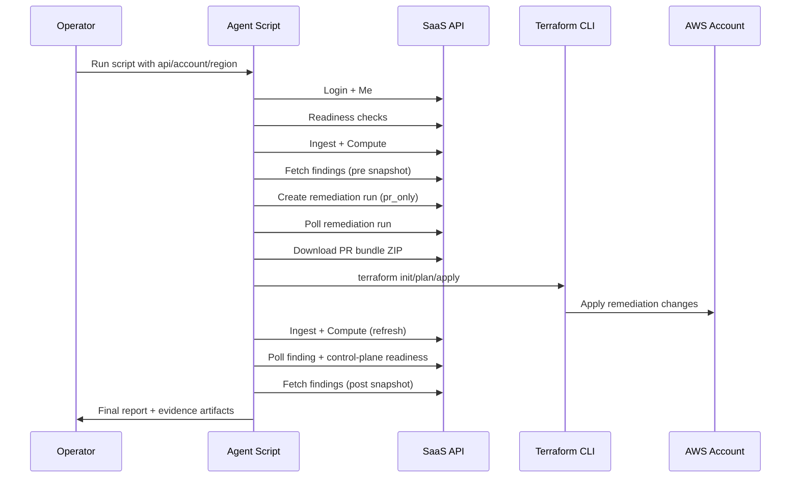

# No-UI PR Bundle Agent Runbook

This runbook describes how to run the fully automated PR-bundle validation agent without using the SaaS web UI.

## Scope

The agent executes this sequence against one AWS account and one region:

1. API authentication (`POST /api/auth/login`, `GET /api/auth/me`)
2. Readiness checks (`service-readiness`, `control-plane-readiness`)
3. Pre-test findings snapshot and stats
4. Target finding and strategy selection
5. PR bundle remediation run creation and polling
6. PR bundle ZIP download (`GET /api/remediation-runs/{id}/pr-bundle.zip`)
7. Local remediation apply:
   - EC2.53 compatibility preflight (revoke duplicate/public SG rules on 22/3389 when present)
   - Terraform (`init`, `plan`, `apply`)
8. Refresh (`ingest`, `actions/compute`)
9. Verification polling (finding resolution + control-plane freshness)
10. Post-test findings snapshot and delta report

## Workflow



## Prerequisites

- Python environment with backend dependencies:
  - `backend/requirements.txt`
- Local Terraform CLI installed and available in `PATH`
- AWS CLI installed and available in `PATH` (used by EC2.53 compatibility preflight)
- AWS credentials configured locally for the target account/region:
  - `AWS_PROFILE=<YOUR_PROFILE_NAME>`
  - `AWS_REGION=<YOUR_REGION>`
- SaaS user credentials provided via:
  - environment variables: `SAAS_EMAIL`, `SAAS_PASSWORD`, or
  - interactive prompt at runtime

## Example Command

```bash
PYTHONPATH=. ./venv/bin/python scripts/run_no_ui_pr_bundle_agent.py \
  --api-base https://api.valensjewelry.com \
  --account-id 029037611564 \
  --region eu-north-1
```

## Config File Mode

Example config template:
- `scripts/config/no_ui_pr_bundle_agent.example.json`

Run with config:

```bash
PYTHONPATH=. ./venv/bin/python scripts/run_no_ui_pr_bundle_agent.py \
  --config scripts/config/no_ui_pr_bundle_agent.example.json
```

CLI flags override config values.

## Important Flags

- Required in effective config:
  - `--api-base`
  - `--account-id`
  - `--region`
- Optional:
  - `--output-dir`
  - `--control-preference EC2.53,S3.2`
  - `--poll-interval-sec`
  - `--phase-timeout-sec`
  - `--run-timeout-sec`
  - `--verify-timeout-sec`
  - `--terraform-timeout-sec`
  - `--stale-resend-sec`
  - `--client-timeout-sec`
  - `--client-retries`
  - `--client-retry-backoff-sec`
  - `--resume-from-checkpoint`
  - `--dry-run`
  - `--keep-workdir`
  - `--allow-insecure-http`

## Output Artifacts

Default artifact root:
- `artifacts/no-ui-agent/<UTC_TIMESTAMP>/`

Files produced:
- `checkpoint.json`
- `readiness.json`
- `target_context.json`
- `strategy_selection.json`
- `run_create.json`
- `run_final.json`
- `refresh_last.json`
- `verification_result.json`
- `findings_pre_raw.json`
- `findings_pre_summary.json`
- `findings_post_raw.json`
- `findings_post_summary.json`
- `findings_delta.json`
- `terraform_transcript.json`
- `api_transcript.json`
- `final_report.md`
- `final_report.json`

## Exit Codes

- `0`: success
- `1`: validation/test failure
- `2`: configuration/input error
- `3`: transient infrastructure/API error

## Safety Defaults

- Credentials are read from prompt/env only (never CLI args).
- API transcript redacts secret-like keys (`password`, `token`, `access_token`, `authorization`).
- Non-HTTPS API base is rejected unless `--allow-insecure-http` is set.
- Workspace cleanup refuses paths outside the run output root.
- No rollback phase is executed; fixes remain applied by default.

## Troubleshooting

- If runs remain `pending`/`running`, the script automatically retries one resend via `/api/remediation-runs/{id}/resend` after the stale threshold.
- If Terraform fails, inspect `terraform_transcript.json` for the exact failing command and stderr.
  - For EC2.53 runs, `terraform_transcript.json` includes any preflight AWS CLI commands executed before Terraform.
- If verification times out, inspect:
  - `verification_result.json` (if present)
  - `readiness.json`
  - `api_transcript.json`
- If readiness fails with `Control-plane readiness failed (missing: <region>)`, validate the customer forwarder is targeting production SaaS intake (not a temporary tunnel URL):

```bash
aws events describe-api-destination \
  --region <YOUR_REGION> \
  --name SecurityAutopilotControlPlaneApiDestination-<YOUR_REGION> \
  --query '{state:ApiDestinationState,endpoint:InvocationEndpoint}' \
  --output json
```

Expected endpoint format:
`https://api.valensjewelry.com/api/control-plane/events`

### Debug Note: `eu-north-1` Freshness Incident (2026-02-20)

During a full PR-bundle campaign on **2026-02-20**, most controls failed at readiness with:
- `Control-plane readiness failed (missing: eu-north-1)`
- `control_plane_event_ingest_status.last_intake_time` stuck at `2026-02-20T00:50:29.897235Z`

Root-cause evidence:
- CloudTrail showed remediation activity using `PutAccountPublicAccessBlock` in the campaign window.
- Forwarder/intake allowlists were keyed to `PutPublicAccessBlock`, so those account-level events were dropped before they could refresh readiness.

Current fix:
- Allowlist is now centralized in `backend/services/control_plane_event_allowlist.py`.
- Backend intake, worker filters, and `infrastructure/cloudformation/control-plane-forwarder-template.yaml` are kept in parity by tests:
  - `tests/test_control_plane_allowlist_parity.py`
  - `tests/test_cloudformation_phase2_reliability.py`

## Related Documentation

- [Control-Plane Event Monitoring](../control-plane-event-monitoring.md)
- [Deployer Runbook (Phase 1-3)](../audit-remediation/deployer-runbook-phase1-phase3.md)
- [Manual Test Use Cases](../manual-test-use-cases.md)
