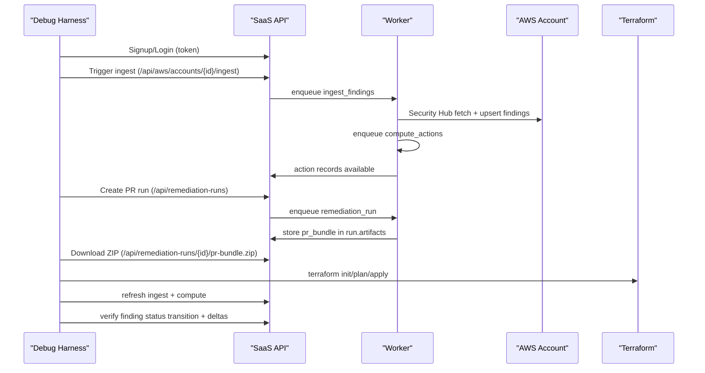

# S3 PR-Bundle E2E Debug Plan (No UI)

## Objective
Debug the full no-UI remediation lifecycle until PR bundles reliably resolve all scoped findings for:

- `S3.9` -> `s3_bucket_access_logging`
- `S3.15` -> `s3_bucket_encryption_kms`
- `S3.11` -> `s3_bucket_lifecycle_configuration`
- `S3.5` -> `s3_bucket_require_ssl`

Primary scripts in scope:

- `/Users/marcomaher/AWS Security Autopilot/scripts/run_s3_controls_campaign.py`
- `/Users/marcomaher/AWS Security Autopilot/scripts/run_no_ui_pr_bundle_agent.py`

Default live target values currently hardcoded in campaign script:

- `api_base`: `https://api.valensjewelry.com`
- `account_id`: `029037611564`
- `region`: `eu-north-1`

## Current Known Blocker (Baseline)
As of **2026-02-20**, repeated runs are blocked at readiness before target selection:

- Error: `Control-plane readiness failed (missing: eu-north-1)`
- Example artifact:
  - `/Users/marcomaher/AWS Security Autopilot/artifacts/no-ui-agent/s3-campaign-20260220T131137Z/S3_9/final_report.json`
- Consequence:
  - `target_finding_id`, `target_action_id`, and `run_id` remain empty
  - Terraform phase is not reached

## End-to-End Pipeline


## Stage-by-Stage Debug Plan

### Stage 0: Baseline and Readiness Gate
Before control-specific debugging, enforce gate health.

Checks and assertions:

- `POST /api/aws/accounts/{account_id}/service-readiness` returns `overall_ready=true`
- `GET /api/aws/accounts/{account_id}/control-plane-readiness?stale_after_minutes=30` returns:
  - `overall_ready=true`
  - target region (`eu-north-1`) present with `is_recent=true`

Logging points:

- Persist raw readiness payload to `readiness.json` (already done by agent)
- Persist canary output when used:
  - `/Users/marcomaher/AWS Security Autopilot/scripts/control_plane_freshness_canary.py`

Fail isolation:

- If readiness fails, stop pipeline triage and fix freshness first. Any later-stage failure analysis is invalid until this is green.

Script-enforced gate commands:

```bash
# Stage 0 only (script-enforced; must pass before control execution)
SAAS_EMAIL=<YOUR_EMAIL> SAAS_PASSWORD=<YOUR_PASSWORD> \
./venv/bin/python scripts/run_s3_controls_campaign.py \
  --stage0-only \
  --stage0-max-attempts 3 \
  --max-readiness-wait-sec 120 \
  --readiness-poll-interval-sec 5
```

```bash
# Optional safety test: verify hard-abort behavior when target region gate cannot pass
SAAS_EMAIL=<YOUR_EMAIL> SAAS_PASSWORD=<YOUR_PASSWORD> \
./venv/bin/python scripts/run_s3_controls_campaign.py \
  --stage0-only \
  --region us-west-2 \
  --stage0-max-attempts 1 \
  --max-readiness-wait-sec 10 \
  --readiness-poll-interval-sec 2
```

### Stage 1: Sign Up / Authenticate

Checks and assertions:

- New-user path: `POST /api/auth/signup` returns `201` and `access_token`
- Existing-user path: `POST /api/auth/login` returns `200` and `access_token`
- Identity check: `GET /api/auth/me` returns expected tenant/user IDs

Logging points:

- In agent `phase_auth`, persist `tenant_id`, `user_id`, and login response subset in checkpoint context
- In API transcript, verify auth calls are `2xx`

Fail isolation:

- `401`: invalid credentials
- `409` on signup: expected if email already exists; switch to login

### Stage 2: Ingest Findings

Checks and assertions:

- Trigger ingest succeeds: `POST /api/aws/accounts/{account_id}/ingest` -> `202`
- Findings list contains in-scope controls and open statuses:
  - `GET /api/findings?account_id={account_id}&region={region}&status=NEW`
  - each control appears with `in_scope=true`
- For each target control, at least one finding has non-empty `remediation_action_id`

Logging points:

- Worker ingest summary (`ingest_findings complete ... processed/new/updated/errors`)
- `findings_pre_raw.json` and `findings_pre_summary.json`

Fail isolation:

- Control missing in findings: ingestion/source issue
- Control present but `remediation_action_id=null`: compute/action-link issue
- Status already `RESOLVED`: seed data not suitable for remediation test

### Stage 3: Compute Actions

Checks and assertions:

- `POST /api/actions/compute` accepts scope (`account_id`, `region`) with `202`
- Action mapping is correct:
  - `S3.9` -> `s3_bucket_access_logging`
  - `S3.15` -> `s3_bucket_encryption_kms`
  - `S3.11` -> `s3_bucket_lifecycle_configuration`
  - `S3.5` -> `s3_bucket_require_ssl`
- Each target finding links to exactly one actionable open action

Logging points:

- Worker compute summary (`created/updated/resolved/links`)
- If possible, persist action lookup snapshot per control (action id, type, status, target_id)

Fail isolation:

- Wrong `action_type`: `control_scope`/grouping mismatch
- Duplicate actions per same target: grouping key/link conflict
- Action resolved while finding open: stale compute or bad link state

### Stage 4: Remediation Run Creation + PR Bundle Download

Checks and assertions:

- `GET /api/actions/{action_id}/remediation-options`:
  - S3.9/S3.11/S3.15 should allow `pr_only` without required strategy
  - S3.5 requires strategy handling (`s3_enforce_ssl_strict_deny` path)
- `POST /api/remediation-runs` returns `201` and run ID
- `GET /api/remediation-runs/{run_id}` reaches `status=success`
- ZIP download succeeds: `GET /api/remediation-runs/{run_id}/pr-bundle.zip`

Logging points:

- `run_create.json` with attempted strategies
- `run_final.json`
- `api_transcript.json` (focus on `/remediation-runs`, `/resend`, `/pr-bundle.zip`)

Fail isolation:

- `Dependency check failed` on S3.5 indicates runtime strategy gating (access-path evidence/policy analysis)
- Run stuck `pending/running`: resend path or worker throughput issue
- Missing `pr_bundle` in artifacts: remediation worker generation failure

### Stage 5: Local PR Bundle Execution

Checks and assertions:

- ZIP extraction creates expected files
- Terraform transcript shows all commands and zero exit codes:
  - `terraform init`
  - `terraform plan`
  - `terraform apply`
- AWS side effect exists after apply (see control matrix below)

Logging points:

- `terraform_transcript.json`
- Preserve workspace for failed runs (`keep_workdir=true`) to inspect generated `.tf`

Fail isolation:

- Terraform compile/provider error: bundle generation content issue
- Apply-time AWS denial: local credentials/permissions/region mismatch
- No resource drift after successful apply: wrong target resource in bundle (`target_id` parse issue)

### Stage 6: Refresh + Before/After State Verification

Checks and assertions:

- Refresh executes both ingest and compute:
  - `POST /api/aws/accounts/{account_id}/ingest`
  - `POST /api/actions/compute`
- Target finding transitions to resolved:
  - `finding.status == RESOLVED` OR `finding.shadow.status_normalized == RESOLVED`
- Aggregate deltas confirm control-specific improvement:
  - `findings_delta.json.kpis.tested_control_delta < 0`
  - `resolved_gain > 0`

Logging points:

- `verification_result.json`
- `findings_post_raw.json`, `findings_post_summary.json`, `findings_delta.json`
- checkpoint errors with phase annotations

Fail isolation:

- Apply succeeded but finding still open: either detection criteria not met by generated IaC or refresh timing/event freshness issue
- Finding resolved but action remains open: compute/link refresh issue
- Delta unchanged with successful apply: remediation targeted wrong bucket/resource

## Control Failure Triage Matrix

| Control | Action type | Expected bundle file | Must be true after apply | Most likely breakpoints |
|---|---|---|---|---|
| `S3.9` | `s3_bucket_access_logging` | `s3_bucket_access_logging.tf` | `GetBucketLogging` returns non-empty `LoggingEnabled` for target bucket | wrong bucket parsed from `target_id`; logging destination invalid/not writable; refresh did not ingest latest state |
| `S3.15` | `s3_bucket_encryption_kms` | `s3_bucket_encryption_kms.tf` | `GetBucketEncryption` default SSE algorithm is `aws:kms` | wrong bucket target; KMS key ARN invalid/inaccessible for bucket context; apply succeeded in wrong region |
| `S3.11` | `s3_bucket_lifecycle_configuration` | `s3_bucket_lifecycle_configuration.tf` | `GetBucketLifecycleConfiguration` returns at least one active rule | bundle applied to wrong bucket; generated lifecycle rule not satisfying upstream control evaluator; refresh lag |
| `S3.5` | `s3_bucket_require_ssl` | `s3_bucket_require_ssl.tf` | bucket policy includes deny on `aws:SecureTransport=false` | run creation blocked by dependency checks; policy merge/replacement side-effects; target bucket parse failure |

## Per-Control Diagnostic Checklist (Pipeline Order)
For each control (`S3.9`, `S3.15`, `S3.11`, `S3.5`), run this exact checklist and stop at first failing assertion:

1. Auth succeeded and readiness green for `eu-north-1`.
2. At least one `NEW/NOTIFIED` finding exists for the control with `remediation_action_id`.
3. Linked action exists with expected `action_type`.
4. Run creation succeeded and reached `run.status=success`.
5. ZIP contains control-expected `.tf` file.
6. Terraform `init/plan/apply` all exit `0`.
7. AWS API read-back confirms intended config change on targeted bucket.
8. Post-refresh finding changed to resolved and delta shows control improvement.

## Definition of Done
The debug objective is complete only when all conditions hold in one campaign run:

- All four controls (`S3.9`, `S3.15`, `S3.11`, `S3.5`) complete end-to-end without readiness or phase abort.
- For each control run:
  - `final_report.json.status == "success"`
  - non-empty `target_finding_id`, `target_action_id`, `run_id`
  - Terraform transcript reached apply and all commands exited `0`
  - before/after evidence proves finding-state transition to resolved
- Campaign-level summary reports all target controls `PASS`.

> ❓ Needs verification: For `S3.11`, confirm whether Security Hub evaluator in this account accepts the current generated lifecycle rule shape (abort-incomplete-multipart only) as compliant in all test buckets.

> ⚠️ Status: Planned — not yet implemented
> Add control-specific post-apply AWS read-back assertions directly inside `/Users/marcomaher/AWS Security Autopilot/scripts/run_no_ui_pr_bundle_agent.py` so failures are surfaced before waiting on ingest/compute cycles.

## Related Docs
- [No-UI PR Bundle Agent](no-ui-pr-bundle-agent.md)
- [Manual Test Use Cases](../manual-test-use-cases.md)
- [Control-Plane Event Monitoring](../control-plane-event-monitoring.md)
