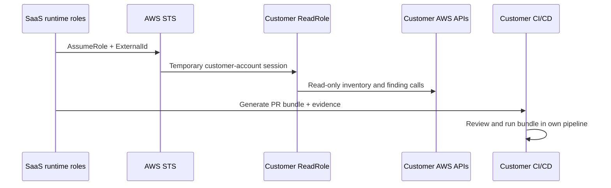

# Trust Package

This is the canonical reviewer entry point for enterprise trust review of the current repo state.

> ⚠️ Status: Current as of March 20, 2026 for the checked-in codebase. Active trust claims cover `ReadRole`, STS `AssumeRole` + `ExternalId`, and customer-run PR bundles only. Customer `WriteRole` and `direct_fix` remain out of scope.

## Review Map

- [Least privilege and current trust boundary](/Users/marcomaher/AWS%20Security%20Autopilot/docs/trust/least-privilege.md)
- [IAM Access Analyzer policy validation](/Users/marcomaher/AWS%20Security%20Autopilot/docs/trust/policy-validation.md)
- [AssumeRole proof and retained evidence](/Users/marcomaher/AWS%20Security%20Autopilot/docs/trust/assume-role-evidence.md)
- [Secrets lifecycle and rotation](/Users/marcomaher/AWS%20Security%20Autopilot/docs/trust/secrets-lifecycle.md)
- [Emergency revoke playbook](/Users/marcomaher/AWS%20Security%20Autopilot/docs/trust/emergency-revoke.md)
- [Tenant isolation proof](/Users/marcomaher/AWS%20Security%20Autopilot/docs/trust/tenant-isolation.md)

## Fresh Evidence

- [Buyer trust package evidence (20260320T023532Z)](/Users/marcomaher/AWS%20Security%20Autopilot/docs/test-results/trust-package/20260320T023532Z-buyer-trust-package/README.md)
- [Authoritative Issue 2 live closure rerun (March 20, 2026 UTC)](/Users/marcomaher/AWS%20Security%20Autopilot/docs/test-results/live-runs/20260320T003851Z-issue2-live-closure-rerun/notes/final-summary.md)

## Current Contract

- `ReadRole` is the only active customer AWS role in scope.
- Grouped/customer-run bundles always use the checked-in [`run_all.sh` template](/Users/marcomaher/AWS%20Security%20Autopilot/infrastructure/templates/run_all.sh); the old S3 override path is removed from current code, config, and deploy surfaces.
- Customer remediation remains PR-only. `WriteRole` and `direct_fix` are retained only as deprecated appendix surfaces, not as active product trust claims.

## Historical Note

Older live-run artifacts can still contain deprecated `SAAS_BUNDLE_RUNNER_TEMPLATE_*` settings or raw operator evidence collected before this trust package existed. For current trust review, use the trust docs above and the sanitized buyer package under [docs/test-results/trust-package/](/Users/marcomaher/AWS%20Security%20Autopilot/docs/test-results/trust-package/20260320T023532Z-buyer-trust-package/README.md).
