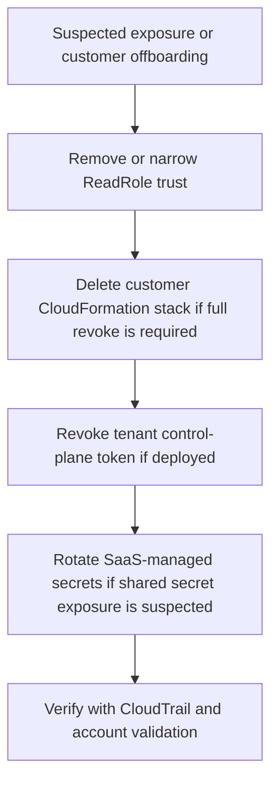

# Emergency Revoke

Use this when you need to cut off SaaS access to a customer account or disable a token surface quickly.

## Customer Account Revoke

1. Remove or narrow `SaaSExecutionRoleArns` on the customer `SecurityAutopilotReadRole` trust policy.
2. If full removal is required, delete the `SecurityAutopilotReadRole` CloudFormation stack in the customer account through normal change control.
3. Disconnect the account in the app if you want the SaaS UI state to match the AWS-side revoke.

Current behavior: account deletion in the app does **not** require runtime IAM teardown. `ALLOW_RUNTIME_IAM_CLEANUP` is fail-closed/off by default.

## Token Revoke

1. Revoke the tenant control-plane token with `POST /api/auth/control-plane-token/revoke` if the tenant uses EventBridge forwarding.
2. Rotate the token with `POST /api/auth/control-plane-token/rotate` only after the customer is ready to update the forwarder connection or stack.

## SaaS Secret Rotation

- Rotate `JWT_SECRET` if auth signing material is exposed.
- Rotate `BUNDLE_REPORTING_TOKEN_SECRET` if bundle callback/report tokens are exposed.
- Rotate `CONTROL_PLANE_EVENTS_SECRET` and `DIGEST_CRON_SECRET` if internal endpoint secrets are exposed.

## Verification

- [Sanitized CloudTrail AssumeRole evidence](/Users/marcomaher/AWS%20Security%20Autopilot/docs/test-results/trust-package/20260320T023532Z-buyer-trust-package/evidence/aws/cloudtrail-assumerole-sanitized.json)
- [Connecting your AWS account](/Users/marcomaher/AWS%20Security%20Autopilot/docs/customer-guide/connecting-aws.md)
- [Control-plane event monitoring](/Users/marcomaher/AWS%20Security%20Autopilot/docs/control-plane-event-monitoring.md)
